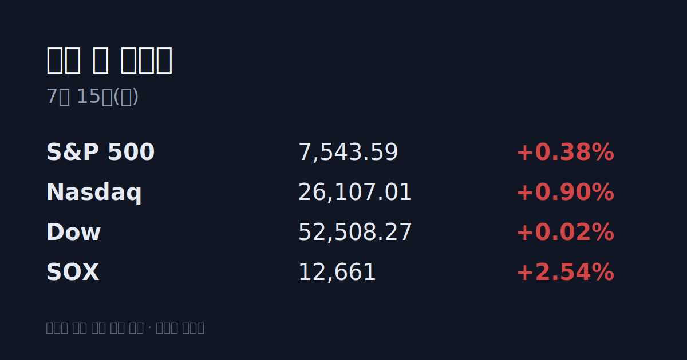

## ① 30초 요약

- 미 증시는 호르무즈 해협 봉쇄 재개 발표에 일제히 하락했다 — S&P 500 -0.79%, 나스닥 -1.55%, <mark>반도체지수(SOX)는 -4.78% 급락</mark>.
- 나스닥에 갓 상장한 SK하이닉스 ADR(SKHY)은 -9.32%로 마감했으나, 미 프리마켓에서는 +6.91% 반등해 거래 중이다.
- SKHY 환산가는 <mark>본주 종가 대비 +18.9% 프리미엄</mark> — 상장 첫 주 과열 구간이 이어지고 있다.
- WTI는 배럴당 $80.35(+2.83%)로 1개월 최고, 미 10년물 금리는 4.62%로 2개월 최고 부근을 기록 중이다.
- 어제 코스피는 장중 6,600선까지 밀렸다가 기관·외국인 순매수에 +0.73%로 마감했고, 코스닥은 매도 사이드카가 발동되며 -1.92%로 마쳤다.

## ② 밤사이 미국 시장

| 지수 | 종가 | 등락률 |
| --- | --- | --- |
| S&P 500 | 7,515.34 | -0.79% |
| Nasdaq | 25,873.18 | -1.55% |
| Dow | 52,498.64 | -0.26% |
| SOX | 12,347.78 | -4.78% |

미국 정부가 호르무즈 해협의 이란 선박 봉쇄를 재개하고 사흘 연속 targeted 공습을 이어가면서, 6월 중순의 잠정 합의가 사실상 와해됐다. 세계 원유 물동량의 약 20%가 지나는 해협의 봉쇄 우려에 WTI 8월물은 $80.35(+2.83%)까지 올랐고, 채권시장에서는 인플레 재점화 우려로 미 10년물 금리가 4.62%로 상승했다. VIX는 17.15로 +14.11% 급등했다.

반도체가 낙폭을 주도했다. SOX는 -4.78%로 밀렸고, 7월 10일 나스닥에 상장한 SK하이닉스 ADR(SKHY)은 -9.32%($152.35)로 마감하며 칩주 매도세의 중심에 섰다. 다만 이 글 작성 시점의 미 프리마켓에서 <mark>SKHY는 $162.88(+6.91%)로 반등</mark>해 거래되고 있다.

## ③ 괴리율 트래커 — SK하이닉스 ADR

| 항목 | 수치 |
| --- | --- |
| SKHY 종가 | $152.35 (-9.32%) |
| 본주 환산가 (×10×환율) | 2,274,738원 |
| 본주 직전 종가 | 1,913,000원 |
| **괴리율** | **+18.9%** |

괴리율은 'ADR을 원주로 바꾸면 얼마인가'를 본주 가격과 비교한 값이다. 프리미엄(+)이 크면 ADR을 사서 원주로 전환해 파는 차익거래 구조상 본주에는 매수 유인이, ADR에는 매도 압력이 생기는 메커니즘이 작동한다. 현재 +18.9%는 7월 10일 상장 직후의 과열 프리미엄이 유지되고 있는 상태다. 다만 ADR은 7/13(미국) 종가, 본주는 7/14(한국) 종가로 하루 시차가 있는 수치라는 점은 감안할 필요가 있다.

## ④ 오늘의 시장 온도계

<mark>VKOSPI는 83.97로 '극단' 구간(40 이상)</mark>에 있으며 52주 최고치(97.99)에서 멀지 않다. 어제 코스피는 장중 한때 -1.67%(6,600선)까지 밀렸다가 +0.73%로 마감하는 큰 일중 진폭을 보였고, 코스닥에서는 낮 12시 6분 매도 사이드카가 발동됐다. 원/달러 환율은 1,493.10원으로 6.40원 내리며 2개월 최저 수준에 안착했다.

## ⑤ 어제 한국장 리뷰

| 구분 | 종가 | 등락률 |
| --- | --- | --- |
| KOSPI | 6,856.83 | +0.73% |
| KOSDAQ | 783.98 | -1.92% |

코스피에서 외국인이 1조 7,574억 원, 기관이 3조 9,174억 원을 순매수했고 개인은 5조 5,807억 원을 순매도했다. 전날(7/13) -15.37% 폭락했던 SK하이닉스는 1,913,000원(+3.69%)으로 반등했고, 삼성전자는 254,500원에 마감했다. 반면 코스닥에서는 외국인이 2,811억 원을 순매도하며 지수가 -1.92%로 밀렸다.

## ⑥ 오늘의 캘린더 & 관전 포인트

- <mark>**22:30 (KST)** 미국 6월 CPI 발표</mark>
- **24:00 (KST)** Warsh 연준 의장 의회 증언
- 호르무즈 해협 관련 뉴스플로우 수시

시장 참가자들은 WTI $85선, 원/달러 1,510원선, VKOSPI 90선, 미 10년물 4.8%선을 주시하고 있다. SKHY의 미국 정규장 흐름이 프리마켓 반등(+6.91%)을 유지하는지도 관전 포인트다.

## ⑦ 정책 워치

공매도는 2026년 3월 31일 전면 재개 이후 전 종목 허용이 유지되고 있다 — 기관 상환기간 12개월 제한, 개인·기관 담보비율 105% 통일, 무차입 공매도 부당이득 최대 5배 벌금 체제가 적용 중이다.

## ⑧ 오늘의 질문

상장 첫 주 +18.9%까지 벌어진 SK하이닉스 ADR 프리미엄은 전환 차익거래를 통해 좁혀질 것인가, 아니면 오늘 밤 CPI가 그보다 먼저 시장의 방향을 바꿀 것인가?

---

*본 글은 공개된 시장 데이터를 정리한 정보성 콘텐츠이며, 특정 종목·상품의 매매 권유가 아닙니다. 모든 투자 판단과 책임은 투자자 본인에게 있습니다. 수치는 작성 시점 기준이며 이후 변동될 수 있습니다.*
