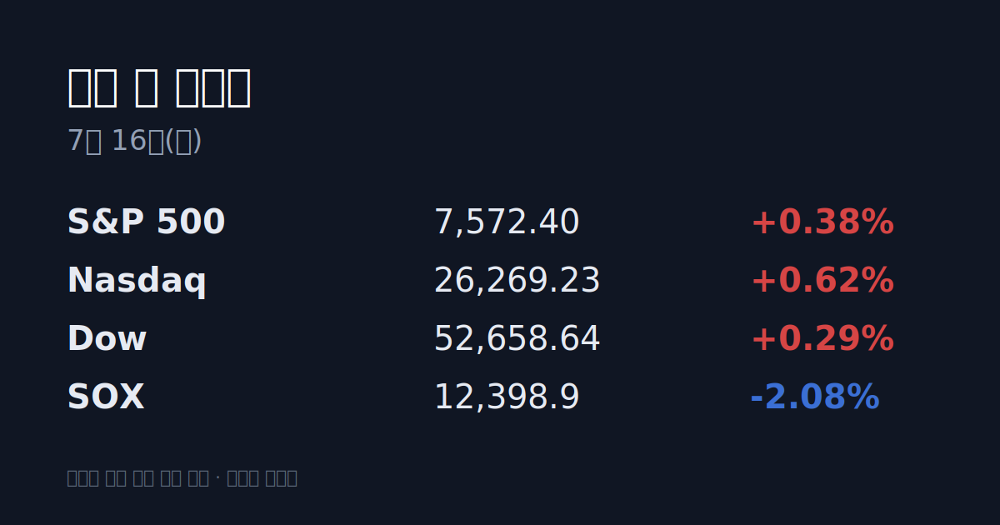
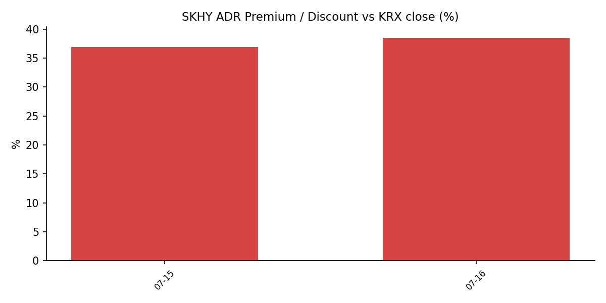

## ① 30초 요약

- 미국 6월 생산자물가(PPI)가 <mark>전월 대비 -0.3%(예상 0.0%)로 둔화</mark>하며 CPI에 이어 디스인플레이션 신호가 이어졌고, S&P 500 +0.38%·나스닥 +0.62%·다우 +0.29%로 상승 마감했다. 애플은 +4%로 사상 최고가를 기록했다.
- 반면 <mark>필라델피아 반도체지수(SOX)는 -2.08%로 지수와 역행</mark>했다 — 대형 기술주가 지수를 끌어올리는 동안 반도체는 차익실현이 나왔다.
- SK하이닉스 ADR(SKHY)은 +10.53%, $193.92로 마감해 본주 대비 괴리율이 +38.5%로 벌어졌으나, <mark>애프터장·프리마켓에서 -3~9% 되돌림</mark>(현재 약 $182대)이 진행됐다.
- 어제 한국장은 <mark>외국인이 코스피에서 2조6,763억 원을 순매수</mark>하며 주도해 코스피가 +6.24%(7,284.41), 코스닥이 +5.80%(829.43)로 급반등했다.
- 오늘 <mark>15:00(KST) TSMC 2분기 실적</mark> 발표가 예정돼 있고, 중동에서는 호르무즈 유조선 피격으로 유가가 다시 올랐다.

## ② 밤사이 미국 시장

| 지수 | 종가 | 등락률 |
| :--- | ---: | ---: |
| S&P 500 | 7,572.40 | +0.38% |
| 나스닥 | 26,269.23 | +0.62% |
| 다우 | 52,658.64 | +0.29% |
| SOX(반도체) | 12,398.9 | -2.08% |

6월 생산자물가(PPI)가 전월 대비 -0.3%(예상 0.0%), 근원 +0.2%(예상 +0.3%)로 둔화하면서 앞선 소비자물가(CPI)에 이어 인플레이션 완화 신호가 이어졌습니다. 미 국채 금리는 하락 압력을 받았고, 애플(+4%, 사상 최고)·아마존·알파벳·마이크로소프트 등 대형 기술주가 지수를 끌어올렸습니다. 다만 반도체지수(SOX)는 -2.08%로 지수와 반대로 움직였습니다 — 대형 기술주로의 순환매 속에 반도체는 차익실현이 출회됐습니다.

중동에서는 이란이 호르무즈 해협에서 UAE 유조선 2척을 미사일로 피격하면서 브렌트유가 장중 $86를 넘었고, 미군은 호르무즈 인근 이란 군사시설을 겨냥한 작전을 벌였습니다. WTI 8월물은 $79.60, 브렌트 9월물은 $84.95로 3거래일 연속 올랐고 브렌트 선물은 백워데이션으로 전환됐습니다.

## ③ 괴리율 트래커 — SK하이닉스 ADR

| 항목 | 수치 |
| :--- | ---: |
| SKHY 종가 | $193.92 (+10.53%) |
| 본주 환산가 (×10×환율) | 2,883,396원 |
| 본주 직전 종가 | 2,082,000원 |
| **괴리율** | **+38.5%** |

SKHY(나스닥 상장 SK하이닉스 ADR)는 07/15 +10.53%로 마감하며 SOX -2.08%에도 홀로 강세를 보였습니다. ADR 1주는 본주 1/10주에 해당하므로, 종가($193.92)에 10과 환율(1,486.90원)을 곱한 환산가는 2,883,396원으로, 본주 직전 종가 2,082,000원 대비 +38.5% 높은 수준입니다.

이 괴리는 구조적으로 프리미엄(ADR이 본주보다 비싼 상태)에 해당합니다. 프리미엄이 벌어지면 전환 차익거래 구조상 본주에 매수 유인이, 반대로 디스카운트면 매도 유인이 생기는 것이 일반적인 메커니즘입니다. 다만 <mark>SKHY는 정규장 마감 후 애프터장과 오늘 프리마켓에서 -3~9% 되돌려</mark> 현재 $182대에서 거래되고 있어, 본주 종가 기준으로 산출한 프리미엄과 실시간 프리미엄(약 30%대)에는 차이가 있습니다. 이 수치는 방향 예측이 아니라 구조 지표입니다.

## ④ 오늘의 시장 온도계

VKOSPI(코스피 변동성지수)는 85.79로 전일 대비 +2.17% 올랐고, 장중 한때 94.25까지 치솟았습니다. 통상 40 이상을 '극단' 국면으로 보는데, 지수가 +6.24% 급등한 날에도 변동성 지수가 오른 것은 일중 진폭이 여전히 크다는 의미입니다. 최근 3거래일 코스피는 -8.95%(07/13) → +0.73%(07/14) → +6.24%(07/15)로 스윙이 극심했습니다. 원/달러 환율은 1,486.90원으로 원화가 소폭 강세를 이어가며 2개월 최저권에 머물렀습니다.

## ⑤ 어제 한국장 리뷰

코스피는 +6.24%(+427.58p) 오른 7,284.41, 코스닥은 +5.80%(+45.45p) 오른 829.43으로 마감했습니다. 코스피에서는 외국인이 2조6,763억 원, 기관이 4,554억 원을 순매수했고 개인은 3조1,479억 원을 순매도했습니다 — 전날 기관이 주도했던 것과 달리 외국인이 순매수 주체로 돌아섰습니다. 코스닥에서는 외국인 +446억 원, 기관 +1,070억 원, 개인 -1,625억 원이었습니다. 시총 상위 반도체 투톱이 랠리를 주도해 삼성전자는 279,500원(+6.27%), SK하이닉스는 2,082,000원(+8.83%)에 마감했습니다.

## ⑥ 오늘의 캘린더 & 관전 포인트

- **15:00(KST)** — TSMC 2분기 실적 발표. 회사 가이던스는 매출 $39.0~40.2B, 매출총이익률 65.5~67.5%로 제시돼 있으며, AI 수요·CoWoS 패키징 캐파·2026년 설비투자 코멘트가 주목받습니다.
- 미국 반도체·SKHY 프리마켓 흐름, 이란-호르무즈 유조선·봉쇄 관련 뉴스가 장중 유입될 수 있습니다.
- 시장 참가자들이 주시하는 레벨: 원/달러 1,510원, WTI $85, VKOSPI 90~95 선. (방향 판단이 아니라 참가자들이 지켜보는 기준선입니다.)

## ⑦ 정책 워치

한국 공매도는 2025년 3월 31일 전면 재개된 이후 무차입 공매도 방지 전산화와 과열종목 지정제가 운영되고 있습니다. 단일종목 레버리지 ETF에 대해서는 금융당국의 규제 논의가 이어지고 있으며, 미국에 상장된 SKHY 연계 레버리지 상품의 종가 리밸런싱 물량이 한·미 양쪽 변동성에 영향을 주는 경로로 지목됩니다.

## ⑧ 오늘의 질문

밤사이 벌어진 반도체지수(SOX)와 SK하이닉스 ADR의 엇갈린 움직임이, 오늘 국내 반도체주의 시초가에 어떻게 반영될 것인가.

---
*본 글은 공개된 시장 데이터를 정리한 정보성 콘텐츠이며, 특정 종목·상품의 매매 권유가 아닙니다. 모든 투자 판단과 책임은 투자자 본인에게 있습니다. 수치는 작성 시점 기준이며 이후 변동될 수 있습니다.*
