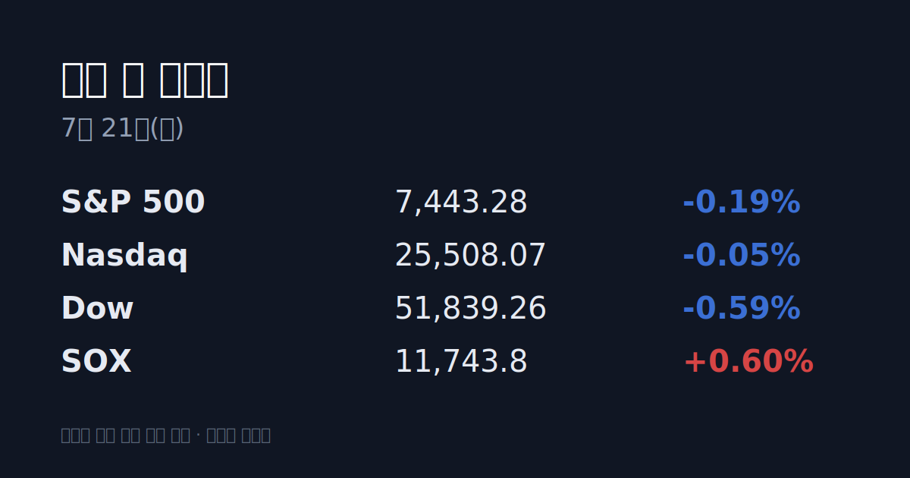
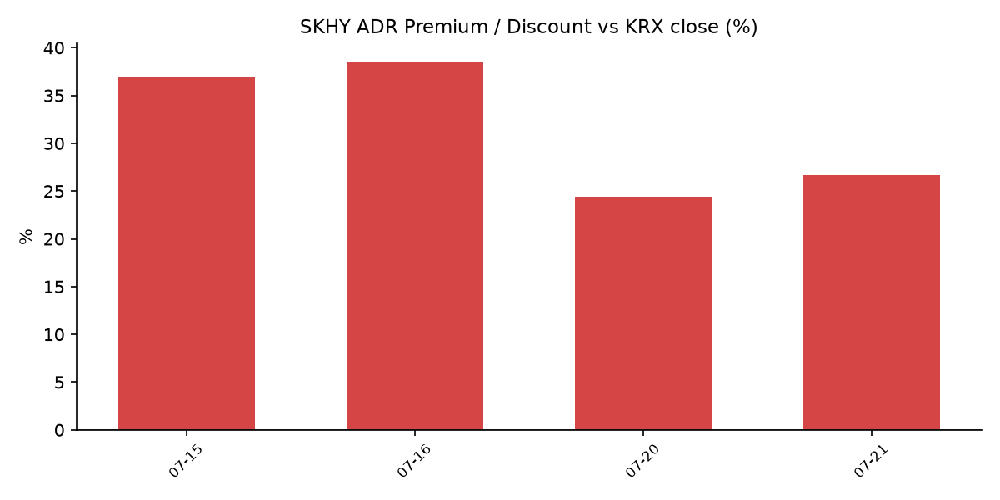

## ① 30초 요약

- 밤사이 미국 증시는 <mark>S&P -0.19%·나스닥 -0.05%·다우 -0.59%로 혼조</mark> 마감했고, 필라델피아 반도체지수(SOX)는 +0.60%로 반등을 시도했다.
- 어제(20일) 국내 증시는 <mark>코스피 -4.46%, 코스닥 -5.33%(52주 신저가)</mark>로 급락하며 양 시장 모두 매도 사이드카가 발동됐다.
- 급락의 방아쇠는 중국 MoonShot AI가 공개한 오픈소스 모델 `Kimi K3`로, AI 인프라 투자 과열 우려가 재점화되며 삼성전자·SK하이닉스에 매물이 집중됐다.
- SK하이닉스 ADR(SKHY)은 -1.86% 마감해 본주(-4.23%)보다 덜 빠졌고, 괴리율은 <mark>+26.7% 프리미엄</mark>으로 소폭 확대됐다.
- 이란-미국 충돌 재격화로 브렌트유는 약 $88.10(+4.6%)까지 올랐다.

## ② 밤사이 미국 시장

| 지수 | 종가 | 등락률 |
| :--- | :--- | :--- |
| S&P 500 | 7,443.28 | -0.19% |
| 나스닥 | 25,508.07 | -0.05% |
| 다우 | 51,839.26 | -0.59% |
| SOX(필라델피아 반도체) | 11,743.8 | +0.60% |

미국 증시는 이란-미국 간 군사 충돌 재격화로 유가가 오르며 다우가 307포인트 하락하는 등 혼조로 마감했다. 다만 지난주 급락했던 반도체주에는 저가 매수가 유입돼, 장 초반 SOX는 12,070까지 반등했다. 프리마켓에서 AMD가 +3.5%, 마이크론이 +4% 이상 올랐고 반도체 ETF(SOXX)는 2% 넘게 상승했다. 이후 이란발 유가 급등에 상승분을 일부 반납해 SOX는 <mark>+0.60%로 마감</mark>, 지난주의 연속 급락 흐름은 멈춰섰다. 알리바바는 신규 AI 모델 공개에 상승했고, 스페이스X 관련주와 데이터센터 임대 계약을 맺은 Hut8도 강세를 보였다.

## ③ 괴리율 트래커 — SK하이닉스 ADR

| 항목 | 수치 |
| :--- | :--- |
| SKHY 종가 | $151.16 (-1.86%) |
| 본주 환산가 (×10×환율) | 2,234,749원 |
| 본주 직전 종가 (07/20) | 1,764,000원 |
| **괴리율** | **+26.7%** |

괴리율은 미국에 상장된 SK하이닉스 ADR을 원화로 환산(ADR 종가 × 10주 × 환율)한 값이 국내 본주 종가보다 얼마나 높거나 낮은지를 나타낸다. 환산가가 본주보다 높으면(프리미엄) 전환 차익거래 구조상 본주에 매수 유인이, 낮으면(디스카운트) 매도 유인이 생긴다. 어제 본주는 -4.23% 빠진 반면 밤사이 ADR은 -1.86%에 그쳐, 프리미엄은 전일 +24.4%에서 <mark>+26.7%로 확대</mark>됐다. 즉 프리미엄이 커진 것은 ADR이 오른 것이 아니라 본주가 더 크게 하락한 결과다.

## ④ 오늘의 시장 온도계

- **VKOSPI 86.87** — 기준선 40을 크게 웃도는 '극단' 구간으로, 6월 29일 사상 최고치(96.94)에 근접한 수준이다. 어제 양 시장에는 매도 사이드카가 발동됐다.
- 반면 미국 변동성지수(VIX)는 17.44로 평온한 수준에 머물러, <mark>한·미 변동성이 뚜렷이 엇갈린</mark> 국면이다.
- 원/달러 환율은 20일 오후 3시 30분 기준 1,478.4원으로 전일과 사실상 보합이었다(1,478~1,488원 등락).

## ⑤ 어제 한국장 리뷰

코스피는 6,516.27로 -4.46%, 코스닥은 749.64로 -5.33% 하락해 52주 신저가를 기록했다. 삼성전자는 244,000원(-4.31%), SK하이닉스는 1,764,000원(-4.23%)으로 마감했다. 코스닥에서는 원익IPS(-18.19%), 피에스케이(-12.59%), 주성엔지니어링(-10.64%) 등 반도체 소부장의 낙폭이 컸다.

수급을 보면 코스피에서는 개인이 5,971억원, 외국인이 4,429억원을 순매수한 반면 기관이 1조1,466억원을 순매도하며 지수를 끌어내렸다. 코스닥에서는 개인이 1,909억원 순매수, 외국인 -585억원·기관 -1,340억원 순매도였다. 급락의 배경으로는 중국 MoonShot AI의 오픈소스 모델 `Kimi K3` 공개로 촉발된 AI 밸류에이션 과열 우려와 지정학 리스크가 지목됐다. 같은 날 대만 TAIEX는 -0.52%에 그쳤고 TSMC는 +1.31% 올라, 반도체 약세가 상대적으로 국내에 집중된 모습이었다.

## ⑥ 오늘의 캘린더 & 관전 포인트

- **07/21(화)** 미국 제너럴모터스(GM) 실적(장 시작 전), 3M·노스럽그루먼·다나허·MSCI 등 실적
- **07/22(수)** 알파벳·테슬라 실적(미 증시 마감 후) — '매그니피센트 7' 실적 시즌의 첫 타자. 알파벳의 AI 설비투자(capex) 가이던스가 시장의 관심사다.
- **07/28~29** FOMC(의장 Kevin Warsh)
- 시장이 주시하는 레벨: 원/달러 1,500원 선, 브렌트유 $90 선, SK하이닉스 ADR 프리미엄의 방향.

## ⑦ 정책 워치

공매도는 코스피200·코스닥150 종목에 한해 재개된 상태(5월 3일~)이며, 과열종목 지정제가 운영 중이다. 7월 19일까지 코스피 과열종목 지정은 205건으로 전년 동기(169건)를 웃돌고 있다.

## ⑧ 오늘의 질문

중국의 저가·고성능 AI 모델 공개가 촉발한 'AI 인프라 과열' 논쟁 속에서, 내일 나올 알파벳의 설비투자 가이던스는 그 우려를 키울 것인가 잠재울 것인가.

---
*본 글은 공개된 시장 데이터를 정리한 정보성 콘텐츠이며, 특정 종목·상품의 매매 권유가 아닙니다. 모든 투자 판단과 책임은 투자자 본인에게 있습니다. 수치는 작성 시점 기준이며 이후 변동될 수 있습니다.*
