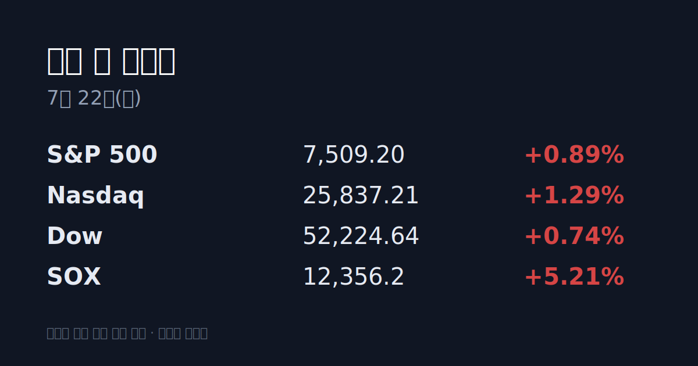
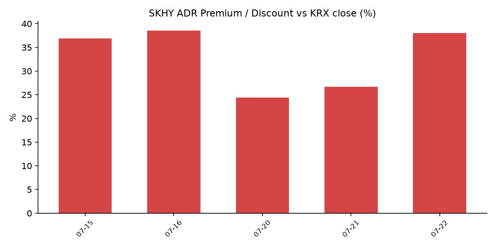

## ① 30초 요약
- 밤사이 미국 증시는 반도체 주도로 이틀째 상승 마감했다. <mark>SOX가 +5.21%</mark> 오르며 마이크론 +12%·샌디스크 +14%·웨스턴디지털 +12%로 메모리주가 급등했다.
- 어제(07/21) 코스피는 <mark>+3.56% 오른 6,747.95</mark>로 반등하며 6,700선을 회복했다. 삼성전자 +6.15%, SK하이닉스 +4.08%로 마감했고 장중 매수 사이드카가 발동됐다.
- 7월 1~20일 수출이 역대 최대를 기록했고, 반도체 수출은 전년 동기 대비 +180.6% 급증한 것으로 집계됐다.
- SK하이닉스 ADR(SKHY)은 $171.94(+13.75%)로 마감했고, 본주 대비 괴리율은 +38.0% 프리미엄으로 확대됐다.
- 오늘 밤(미 장마감 후) 알파벳·테슬라 실적이 발표된다 — 매그니피센트 세븐 중 첫 타자다.

## ② 밤사이 미국 시장

| 지수 | 종가 | 등락률 |
| :--- | :--- | :--- |
| S&P 500 | 7,509.20 | +0.89% |
| 나스닥 종합 | 25,837.21 | +1.29% |
| 다우 | 52,224.64 | +0.74% |
| 필라델피아 반도체(SOX) | 12,356.2 | +5.21% |

반도체가 이틀 연속 시장을 끌어올렸다. 마이크론(+12%)·샌디스크(+14%)·웨스턴디지털(+12%)이 메모리 가격 강세를 배경으로 급등했고, AMD는 마이크로소프트와의 AI 협력 소식에 +8% 올랐다. 엔비디아는 뉴클라우드 업체 네비우스(Nebius) 지분 인수 소식에 강세를 보였다. 뱅크오브아메리카는 마이크론 목표주가를 $1,550으로 상향했다. 한편 트럼프 행정부가 <mark>캐나다産 일부 품목에 50% 관세</mark>(30일 후 발효)를 발표하고 추가 관세 가능성을 시사하면서 무역 이슈도 함께 주시됐다. 미 10년물 국채금리는 4.63%, VIX는 18.65로 마감했다.

## ③ 괴리율 트래커 — SK하이닉스 ADR

| 항목 | 수치 |
| :--- | :--- |
| SKHY 종가 | $171.94 (+13.75%) |
| 본주 환산가 (×10×환율) | 2,533,364원 |
| 본주 직전 종가 | 1,836,000원 |
| **괴리율** | **+38.0%** |

ADR 괴리율은 전일 +26.7%에서 +38.0%로 확대됐다. 이는 밤사이 ADR(+13.75%)이 어제 본주 상승(+4.08%)보다 훨씬 크게 오른 결과다. 전환 차익거래 구조상 ADR이 본주보다 높게(프리미엄) 형성되면 본주 매수 유인이, 낮게(디스카운트) 형성되면 매도 유인이 생기는 것으로 설명된다. 프리미엄이 벌어졌다는 것은 본주가 밤사이 미국 메모리 랠리를 아직 부분적으로만 반영했음을 의미한다(구조 설명이며 방향 예측이 아니다).

## ④ 오늘의 시장 온도계

어제 VKOSPI(코스피 변동성지수)는 84.89로 마감했다. 기준선 40의 두 배가 넘는 <mark>'극단' 구간</mark>이 이어지고 있으며, 6월 29일 사상 최고치(96.94) 대비로는 하향 안정 중이다. 어제는 +3.56% 반등한 날이었음에도 장중 고가와 저가의 차이가 407.83포인트에 달해, 방향과 무관하게 변동성 자체는 진정되지 않은 상태다. 원/달러 환율은 5.0원 내린 1,473.4원(오후 3시 30분 기준)으로 마감했다. 7월 들어 코스피 일중 변동성은 1987년 이후 최대 국면이 지속되고 있다.

## ⑤ 어제 한국장 리뷰

코스피는 231.68포인트(+3.56%) 오른 6,747.95, 코스닥은 3.70포인트(+0.49%) 오른 753.34로 마감했다. 코스피에서는 <mark>기관이 1조6,480억원, 외국인이 5,959억원 순매수</mark>했고 개인은 2조1,647억원 순매도했다. 기관 순매수 1위는 SK하이닉스(+6,952억원), 2위는 삼성전자(+4,718억원)였으며 외국인은 삼성전자에 매수가 집중됐다. 반면 코스닥은 외국인이 1,398억원, 기관이 62억원 순매도하고 개인이 1,392억원 순매수해, 대형주 쏠림 속에 상대적으로 소외됐다. 오후 한때 지수가 6,836.86까지 오르며 장중 매수 사이드카가 발동됐다.

## ⑥ 오늘의 캘린더 & 관전 포인트

- **오늘 밤(미 장마감 후)** 알파벳·테슬라 Q2 실적 발표 — 매그니피센트 세븐 중 첫 타자. 시장은 알파벳 EPS $2.88·매출 $117B, 테슬라 EPS $0.52·매출 $25.99B를 예상치로 보고 있다. 미국 장마감 후 발표이므로 국내 반영은 다음 거래일 몫이다.
- **7월 28~29일** FOMC(연준 통화정책회의).
- 시장 참가자들이 주시하는 레벨: 원/달러 1,500원 선, SK하이닉스 ADR 괴리율(+38%)의 방향, 브렌트유 $91대에서의 추가 움직임, 트럼프 관세의 반도체·주요국 확대 여부.

## ⑦ 정책 워치

7월 1~20일 수출은 549억3천만 달러로 전년 동기 대비 52.3% 늘어 같은 기간 기준 역대 최대를 기록했다(관세청, 07/21 발표). 이 중 반도체 수출이 221억1천만 달러로 +180.6% 급증해 전체 수출의 40% 이상을 차지했다. 공매도는 코스피200·코스닥150 대상 재개(5월 3일~)와 과열종목 지정제가 유지되고 있다.

## ⑧ 오늘의 질문

밤사이 미국 메모리 랠리와 ADR 프리미엄 확대가 국내 반도체 대형주에 어떻게 소화될 것인가.

---
*본 글은 공개된 시장 데이터를 정리한 정보성 콘텐츠이며, 특정 종목·상품의 매매 권유가 아닙니다. 모든 투자 판단과 책임은 투자자 본인에게 있습니다. 수치는 작성 시점 기준이며 이후 변동될 수 있습니다.*
