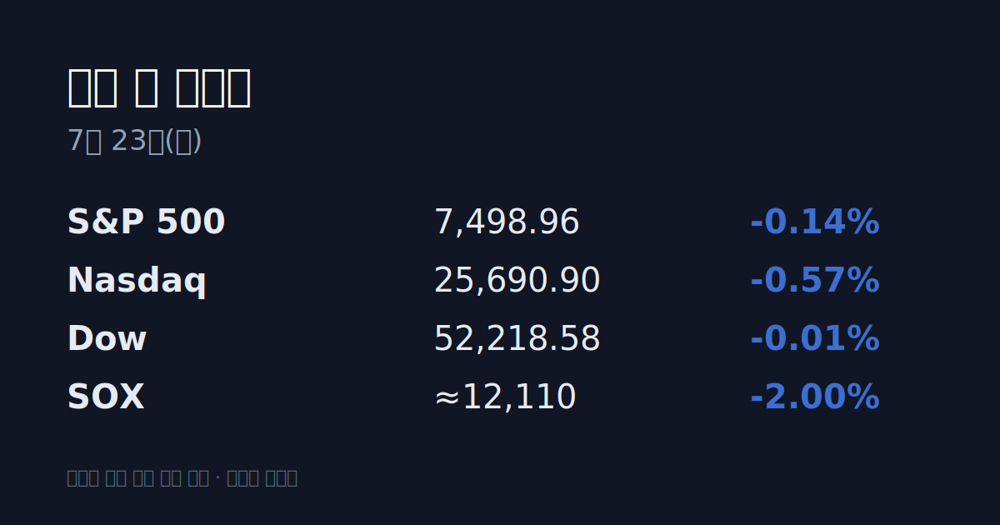
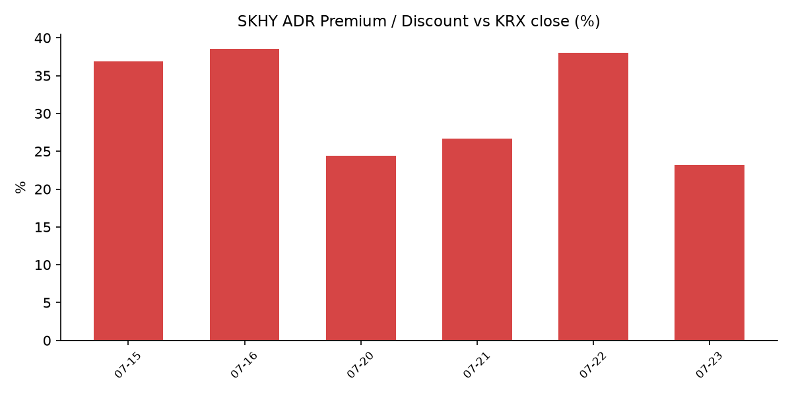

## ① 30초 요약
- 밤사이 미국 증시는 소폭 하락 마감했다. S&P 500 −0.14%, 나스닥 −0.57%, 다우는 보합이었고 <mark>반도체는 직전 이틀 랠리를 되돌렸다(SOXX ETF −2%)</mark>.
- 매그니피센트7 중 첫 타자로 <mark>테슬라와 알파벳이 실적을 발표</mark>했다. 테슬라는 매출은 사상 최대였으나 이익이 시장 기대를 크게 밑돌았고, 알파벳은 매출·클라우드가 호조였지만 설비투자(capex) 부담이 부각됐다.
- 국제유가가 급등했다. 브렌트유는 <mark>$94.07(+3.4%)로 약 6주 만의 최고</mark>를 기록했고, 미 10년물 국채금리는 4.56%로 올랐다.
- 어제(07/22) 코스피는 장중 7,000선을 찍은 뒤 되밀려 6,797.70(+0.74%)에 마감했다. <mark>외국인이 3조5,100억 원을 순매수</mark>했고 장초반 매수 사이드카가 발동됐다.
- SK하이닉스 ADR(SKHY)은 $152.31로 하락해 본주 대비 괴리율이 전일 +38.0%에서 +23.2%로 좁혀졌다.

## ② 밤사이 미국 시장

| 지수 | 종가 | 등락률 |
| :--- | :--- | :--- |
| S&P 500 | 7,498.96 | −0.14% |
| 나스닥 | 25,690.90 | −0.57% |
| 다우 | 52,218.58 | −0.01% |
| SOX(필라델피아 반도체) | 약 12,110 (추정) | 약 −2.0% |

전일 이틀간 급등했던 반도체가 되돌려졌다. 반도체 벤치마크 SOXX ETF는 −2% 내렸고, 인텔 −2.7%·AMD −1.8%·마이크론 −1.8%·샌디스크 −2.3%로 약세였다. 다만 엔비디아는 종가 기준 +2.3%($212.06)로 예외적으로 올랐다. (SOX 지수 자체의 정확한 종가는 집계 시점 기준 개별 소스에서 확인되지 않아, SOXX와 구성종목 등락으로 도출한 추정치를 표기했다.)

매그니피센트7 중 첫 실적으로 테슬라와 알파벳이 미 장마감 후 발표됐다. 테슬라는 매출 $28.24B(전년비 +26%)로 사상 최대였으나 조정 주당순이익 $0.33로 시장 기대($0.53)를 밑돌았고, 잉여현금흐름이 −$11억으로 돌아섰으며 설비투자가 +142% 늘었다 — 발표 후 시간외에서 약 3% 하락했다. 알파벳은 매출 $119.8B, 구글 클라우드 매출이 전년비 +82% 급증하며 시장 기대를 넘었으나, 대규모 설비투자 부담이 부각되며 시간외 주가는 보합~약세였다. 한편 국제유가는 미국의 이란 공습이 이어지며 브렌트 $94.07(+3.4%), WTI $86.83(+3%)로 급등했고, 이에 미 국채금리(10년 4.56%·30년 5.07%)가 올랐다. 반면 미국 변동성지수(VIX)는 16.64로 −2.4% 내려 미국 시장 자체의 체감 변동성은 낮았다.

## ③ 괴리율 트래커 — SK하이닉스 ADR

| 항목 | 수치 |
| :--- | :--- |
| SKHY 종가 | $152.31 (전일 $171.94에서 하락) |
| 본주 환산가 (×10×환율) | 2,254,340원 |
| 본주 직전 종가 | 1,830,000원 |
| **괴리율** | **+23.2%** |

괴리율은 미국에 상장된 SK하이닉스 ADR 가격을 원화로 환산(ADR 종가 × 10 × 원/달러)한 값이 서울 본주 종가보다 얼마나 높거나 낮은지를 나타낸다. 플러스(프리미엄)는 ADR이 본주보다 비싸다는 뜻으로, 전환 차익거래 구조상 본주에는 매수 유인이 생기는 것으로 해석된다. 전일 +38.0%였던 프리미엄이 하루 만에 +23.2%로 좁혀진 것은 ADR 가격이 본주보다 크게 내렸기 때문이다. 오는 7월 29일 ADR과 본주 간 양방향 전환 신청이 열리면 두 시장의 가격 차이를 메우는 차익거래가 가능해진다는 점도 배경으로 거론된다. 여전히 +23%의 프리미엄은 남아 있는 상태다.

## ④ 오늘의 시장 온도계

한국 시장의 변동성 지표인 VKOSPI는 07/22 종가 기준 <mark>82.97로 '극단' 구간</mark>(기준 40의 2배 이상)에 머물렀다. 전일 84.89에서 소폭 내렸으나 여전히 높은 수준이다. 7월 들어 코스피는 하루 −6%대 급락과 +3%대 급등이 교차하는 초대형 진폭이 이어지고 있으며, 07/22에도 장중 7,000선(약 +3%)을 찍은 뒤 종가 +0.74%로 상승분을 대부분 반납했다. 원/달러 환율은 1,480.1원으로 전일 대비 6.7원 올랐다. 07/22에는 3거래일 연속으로 사이드카(프로그램 매매호가 일시 효력정지)가 발동됐다.

## ⑤ 어제 한국장 리뷰

코스피는 6,797.70(+0.74%), 코스닥은 751.09(−0.30%)로 마감했다. 수급은 <mark>외국인이 3조5,100억 원을 순매수</mark>한 반면 개인은 1조9,800억 원, 기관은 1조4,800억 원을 순매도했다 — 외국인 단독 매수가 지수를 끌어올린 구도였다. 시가총액 상위 반도체 두 종목은 미국 반도체 랠리를 받아 장초반 급등(삼성전자 +5.6%·SK하이닉스 +8.9%)했으나 차익실현에 상승분을 반납해 삼성전자 260,500원(+0.58%)·SK하이닉스 1,830,000원(−0.33%)으로 마감했다. 대신 자금은 로봇·피지컬 AI 테마로 이동해 현대차가 +4.76%, 레인보우로보틱스가 +16.28% 올랐다. CES 2026에서 현대차·기아의 로봇 AI칩 개발 완료 소식이 전해진 점이 배경으로 언급됐다.

## ⑥ 오늘의 캘린더 & 관전 포인트
- **07/23(목) 미 장마감 후:** 인텔 2분기 실적 발표 — 반도체 업황의 추가 단서.
- **07/28~29:** 미국 FOMC(의장 Kevin Warsh).
- **07/29:** SK하이닉스 2분기 실적 발표 및 ADR↔본주 양방향 전환 신청 개시.
- 시장 참가자들이 주시하는 레벨: 원/달러 1,500원 선, 브렌트유 $95 선, VKOSPI 90 선, 그리고 SK하이닉스 ADR 프리미엄의 방향.

## ⑦ 정책 워치
트럼프 행정부가 브라질산에 대한 25% 관세를 발효했고, 제네릭(복제) 의약품에 대한 100% 관세를 예고하는 등 임시 관세를 영구 관세로 전환하는 방안을 준비 중이라는 소식이 전해졌다. 국내 공매도 제도는 코스피200·코스닥150 종목 재개(5/3~)와 과열종목 지정제가 유지되고 있으며 변경 사항은 없다.

## ⑧ 오늘의 질문
밤사이 식은 미 반도체와 어제 국내를 끌어올린 외국인 순매수·로봇 테마 중, 오늘 시장은 어느 쪽 신호를 더 크게 반영할 것인가.

---
*본 글은 공개된 시장 데이터를 정리한 정보성 콘텐츠이며, 특정 종목·상품의 매매 권유가 아닙니다. 모든 투자 판단과 책임은 투자자 본인에게 있습니다. 수치는 작성 시점 기준이며 이후 변동될 수 있습니다.*
