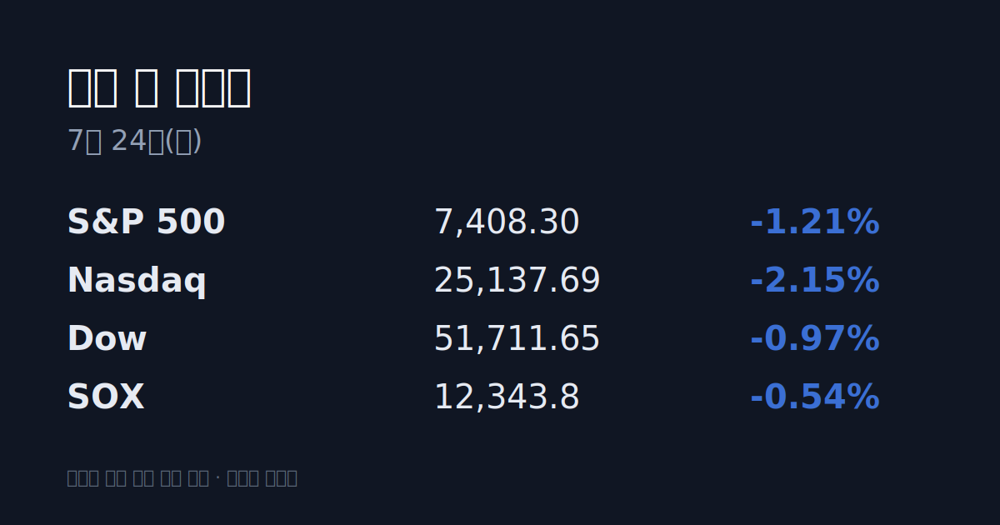
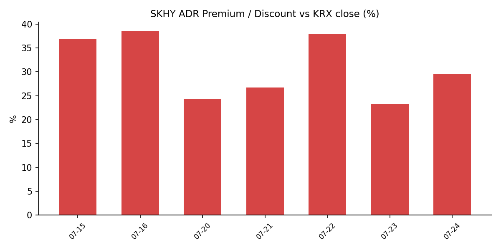

## ① 30초 요약
- 밤사이 미국 증시는 하락 마감했다. S&P 500 −1.21%, 나스닥 −2.15%, 다우 −0.97%로 <mark>테슬라(약 −14%)와 알파벳(약 −7%)의 급락</mark>이 지수를 끌어내렸다. 반면 반도체지수(SOX)는 −0.54%로 상대적으로 선방했다.
- 알파벳과 테슬라는 실적 발표에서 대규모 AI·설비투자 확대를 재확인했으나, <mark>두 회사 모두 잉여현금흐름이 적자로 전환</mark>하며 투자 수익성에 대한 의문이 부각됐다.
- 반면 <mark>인텔은 장 마감 후 2분기 '깜짝 실적'</mark>을 발표했다. 매출 161억 달러(+25%)·조정 주당순이익 0.42달러로 시장 기대(0.22달러)를 크게 웃돌았고 데이터센터·AI 매출이 59% 급증했다 — 발표 후 시간외에서 약 +9~13% 급등했다.
- 국제유가가 급등했다. 브렌트유는 <mark>약 7% 올라 $100.69로 5월 말 이후 처음 $100을 돌파</mark>했다(WTI $92.19). 후티 반군의 사우디 유조선 공격과 홍해 항로 봉쇄 선언이 배경이다.
- 어제(07/23) 코스피는 <mark>+4.39% 폭등한 7,096.89로 7,000선을 되찾았고</mark>, 코스닥은 +5.22% 올랐다. 외국인이 2조5,405억 원을 순매수(4거래일 연속)했다.
- SK하이닉스 ADR(SKHY)은 $169.50로 올라 본주 대비 괴리율이 전일 +23.2%에서 +29.6%로 확대됐다.

## ② 밤사이 미국 시장

| 지수 | 종가 | 등락률 |
| :--- | :--- | :--- |
| S&P 500 | 7,408.30 | −1.21% |
| 나스닥 | 25,137.69 | −2.15% |
| 다우 | 51,711.65 | −0.97% |
| SOX(필라델피아 반도체) | 12,343.8 | −0.54% |

지수를 끌어내린 것은 실적을 발표한 두 대형 기술주였다. 테슬라는 2분기 실적이 시장 기대를 밑돌고 설비투자가 전년비 142% 늘며 잉여현금흐름이 약 2년 만에 적자(−11억 달러)로 돌아섰고, 주가는 두 자릿수 급락했다. 알파벳은 매출과 클라우드가 호조였으나 <mark>2026년 설비투자 전망을 2,050억 달러(약 301조 원)로 상향</mark>하면서 잉여현금흐름이 −59억 달러로 처음 적자를 기록했고, AI 투자의 수익성에 대한 우려로 하락했다. 미국 변동성지수(VIX)는 18.70으로 12.4% 올랐고, 미 10년물 국채금리는 약 1년 반 만의 최고 수준으로 상승했다.

한편 반도체지수(SOX)는 −0.54%로 지수 급락 대비 낙폭이 작았다. 시장에서는 알파벳·테슬라가 상향한 대규모 설비투자가 결국 메모리 반도체 수요로 이어진다는 해석이 나오면서, 빅테크 주가 하락과 반도체의 상대적 강세가 갈렸다.

반도체의 상대 강세는 장 마감 후 발표된 인텔 실적으로 한층 뚜렷해졌다. 인텔은 2분기 매출 161억3,000만 달러(전년비 +25.4%)·조정 주당순이익 0.42달러로 시장 예상(매출 약 144억 달러, EPS 0.22달러)을 크게 웃돌았고, <mark>데이터센터·AI 부문 매출이 59% 급증</mark>했다. 3분기 매출 가이던스도 중간값 163억 달러로 시장 기대(약 151억 달러)를 넘겼고, AI 수요에 대응해 올해 설비투자 계획을 180억 달러에서 200억 달러로 상향했다. 발표 직후 인텔 주가는 시간외에서 약 +9~13% 급등해, '설비투자 확대 = 메모리·반도체 수요'라는 해석에 힘을 실었다.

## ③ 괴리율 트래커 — SK하이닉스 ADR

| 항목 | 수치 |
| :--- | :--- |
| SKHY 종가 | $169.50 (전일 $165.27에서 +2.56%) |
| 본주 환산가 (×10×환율) | 2,486,226원 |
| 본주 직전 종가 | 1,919,000원 |
| **괴리율** | **+29.6%** |

괴리율은 미국에 상장된 SK하이닉스 ADR 가격을 원화로 환산(ADR 종가 × 10 × 원/달러)한 값이 서울 본주 종가보다 얼마나 높거나 낮은지를 나타낸다. 플러스(프리미엄)는 ADR이 본주보다 비싸다는 뜻으로, 전환 차익거래 구조상 본주에는 매수 유인이 생기는 것으로 해석된다. 밤사이 미 지수가 급락한 가운데서도 SK하이닉스 ADR은 +2.56% 올라, 전일 +23.2%였던 프리미엄이 +29.6%로 다시 벌어졌다. 원/달러 환율이 내려(원화 강세) 환산가를 낮추는 방향이었음에도 괴리가 커졌다는 것은 ADR의 달러 가격 상승 폭이 그만큼 컸다는 의미다. 오는 7월 29일 ADR과 본주 간 양방향 전환 신청이 열리면 두 시장의 가격 차이를 메우는 차익거래가 가능해진다.

## ④ 오늘의 시장 온도계

한국 시장의 변동성 지표인 VKOSPI는 07/23 종가 기준 <mark>80.46으로 '극단' 구간</mark>(기준 40의 2배 이상)에 머물렀다. 전일 82.97에서 −2.81% 내렸으나 여전히 높은 수준이다. 7월 들어 코스피는 하루 −6%대 급락과 +4%대 급등이 교차하는 초대형 진폭이 이어지고 있으며, 07/23에는 +4.39% 급등하며 7,000선을 되찾았고 코스닥은 오후 2시 27분 매수 사이드카(프로그램 매매호가 일시 효력정지)가 발동됐다. 원/달러 환율은 1,466.8원으로 전일 대비 13.3원 내렸다.

## ⑤ 어제 한국장 리뷰

코스피는 7,096.89(+4.39%), 코스닥은 790.28(+5.22%)로 마감했다. 수급은 <mark>외국인이 2조5,405억 원을 순매수(4거래일 연속)</mark>하고 기관도 561억 원을 순매수한 반면 개인은 2조5,552억 원을 순매도했다 — 외국인·기관 매수가 지수를 끌어올린 구도였다. 반도체가 상승을 주도해 SK하이닉스가 +4.86%(1,919,000원), 삼성전자가 +3.65%(270,000원), 삼성전기가 +7.66% 올랐다. 알파벳의 설비투자 확대 발표가 메모리 수요 기대로 이어졌고, 여기에 메모리 업황 고점 우려 완화와 관세청 7월 1~20일 반도체 수출 호조, 최근 낙폭 과대에 따른 반발 매수가 겹쳤다는 해석이 나왔다.

## ⑥ 오늘의 캘린더 & 관전 포인트
- **07/28~29:** 미국 FOMC(의장 Kevin Warsh) — 결과는 07/30 새벽 3시(KST) 발표.
- **07/29:** SK하이닉스 2분기 실적 발표(오전 9시 IR, 분기 최대 실적 전망) 및 ADR↔본주 양방향 전환 신청 개시.
- **07/30:** 미국 2분기 GDP 속보치와 6월 PCE 물가지수(21:30 KST).
- 시장 참가자들이 주시하는 레벨: 브렌트유 $100 선, 원/달러 환율, VKOSPI 80선, 그리고 SK하이닉스 ADR 프리미엄의 방향.

## ⑦ 정책 워치
국제유가 급등은 후티 반군의 사우디 유조선 공격과 홍해·바브엘만데브 항로 봉쇄 선언, 미-이란 휴전 붕괴 이후 호르무즈 해협 통행 감소가 배경으로 거론된다. 앞서 트럼프 행정부가 예고한 브라질산 25%·제네릭 의약품 100% 관세 등 통상 이슈도 이어지고 있다. 국내 공매도 제도는 코스피200·코스닥150 종목 재개(5/3~)와 과열종목 지정제가 유지되고 있으며 변경 사항은 없다.

## ⑧ 오늘의 질문
어제 코스피를 +4.39% 끌어올린 반도체 강세와, 밤사이 다시 불거진 유가·금리·빅테크 부담 중 오늘 시장은 어느 쪽을 더 크게 반영할 것인가.

---
*본 글은 공개된 시장 데이터를 정리한 정보성 콘텐츠이며, 특정 종목·상품의 매매 권유가 아닙니다. 모든 투자 판단과 책임은 투자자 본인에게 있습니다. 수치는 작성 시점 기준이며 이후 변동될 수 있습니다.*
