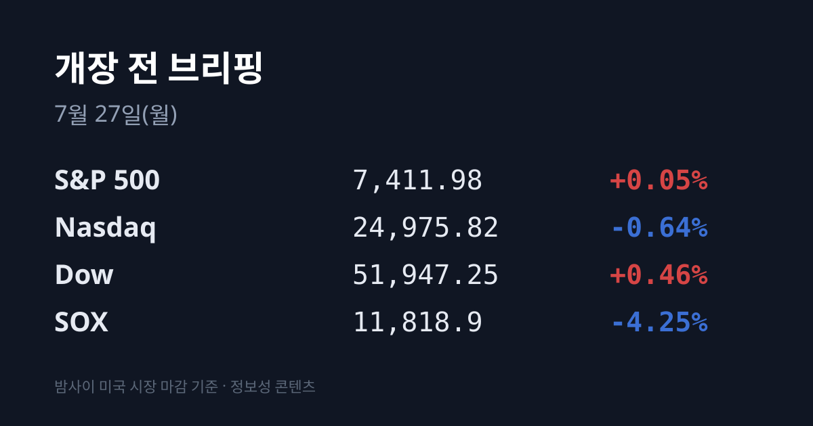
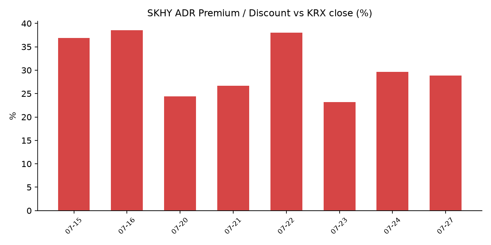

## ① 30초 요약

- 지난 금요일(07/24) 코스피는 <mark>−5.72% 폭락한 6,690.62로 7,000선을 내줬다</mark>. 코스닥도 −5.32%(748.22). 외국인 −3조2,828억 원, 기관 −1조9,513억 원 순매도로 **합산 5조 원 넘는 매도**가 나왔고, 오전 11시 23분 코스피·11시 47분 코스닥에 **매도 사이드카**가 발동했다.
- 금요일 미국장은 방향이 갈렸다. 다우 **+0.46%**·S&P 500 +0.05%로 되돌아선 반면, 나스닥은 −0.64%였고 <mark>필라델피아 반도체지수(SOX)는 −4.25%로 급락</mark>했다. 메모리가 낙폭을 주도했다(샌디스크 −10.79%, 마이크론·웨스턴디지털·시게이트 −6%대).
- 주말 사이 지정학 국면이 바뀌었다. 미국은 <mark>07/25 약 2주 만에 처음으로 대이란 공습을 중단했고 07/26까지 이틀 연속 중단</mark>했으며, 이란도 상응 중단을 밝혔다. 브렌트유는 $100.69(07/23) → $96.78(07/24) → 주말 선물 약 **$92**로 되밀렸다.
- 07/24 미국 샌프란시스코 AI 정상회의에서 <mark>약 9,500억 달러(약 1,375조 원) 규모 한미 AI·반도체 협력</mark>이 발표됐다. **삼성전자–브로드컴 5년 2,000억 달러 MOU**(차세대 HBM 공급·2nm 이하 파운드리·첨단 패키징), **SK그룹 7,500억 달러 첨단 메모리 협력**(엔비디아와 약 5,000억 달러 AI 메모리 파트너십 포함)이 포함됐다.
- 월스트리트저널(WSJ)은 주말 "SK하이닉스 ADR 프리미엄은 AI 거래 과열의 또 다른 신호"라고 지적했다. 상장(07/10) 이후 ADR이 본주보다 **16~51% 비싸게** 거래됐다는 내용이다.
- SK하이닉스 ADR(SKHY)은 −8.81% 급락한 $154.57로 마감했으나, 본주도 같은 날 −8.34% 빠져 <mark>괴리율은 +29.6%에서 +28.9%로 0.7%p만 줄었다</mark>.

## ② 밤사이 미국 시장

*지난 금요일 한국장 마감(07/24 15:30) 이후 미국은 1세션(07/24)이 지났고, 주말에는 지정학·산업 뉴스가 이어졌다. 아래는 그 누적 결과다.*

| 지수 | 종가 | 등락률 |
| :--- | :--- | :--- |
| S&P 500 | 7,411.98 | +0.05% |
| 나스닥 | 24,975.82 | −0.64% |
| 다우 | 51,947.25 | +0.46% |
| SOX(필라델피아 반도체) | 11,818.9 | −4.25% |

지수 표면과 업종 내부가 정반대였다. 다우와 S&P 500은 플러스로 돌아섰지만 **반도체는 따로 무너졌다.** SOX는 12,343.8에서 11,818.9로 524.9포인트(−4.25%) 빠졌고, 낙폭을 이끈 것은 메모리였다 — 샌디스크 −10.79%, 마이크론·웨스턴디지털·시게이트가 각각 −6%대, SK하이닉스 ADR −8.81%. AMD −3%대, 브로드컴·TSMC −2%대였던 반면 **엔비디아는 거의 보합**이었다. 즉 매도는 '반도체 전체'가 아니라 **대규모 설비투자의 수혜주로 분류돼 온 메모리·광통신에 집중**됐다.

배경으로 지목된 것은 설비투자(capex)에 대한 시장 해석의 반전이다. 직전 브리핑에서 다룬 인텔 사례가 이를 압축해 보여줬다. 인텔은 07/23 장 마감 후 2분기 어닝 서프라이즈(매출 161억3,000만 달러, 조정 EPS 0.42달러)로 시간외에서 약 +13%까지 급등했으나, <mark>07/24 정규장에서는 −7.89%로 급등분을 전부 반납</mark>했다. 실적 자체가 아니라 **연간 설비투자를 180억 달러에서 200억 달러 이상으로 올린 부분**이 부담으로 재해석된 결과다. 앞서 알파벳(2026년 capex 1,950~2,050억 달러 상향)과 테슬라(잉여현금흐름 적자 전환)에서 나온 우려가 같은 방향으로 누적됐다. 07/24(금)에는 장 마감 후 대형 실적 발표가 없었고, 정규장 개별 종목으로는 디지털리얼티 +14%, 부즈앨런 +12%, SLB +9.7%가 눈에 띄었다.

반면 매크로 지표는 반대로 움직였다. 미 변동성지수(VIX)는 18.58로 0.64% **하락**했고, 브렌트유는 07/23 $100.69에서 07/24 $96.78로 약 4% 내렸다. 미 10년물 국채금리는 4.69%로 올라 1년 반 최고 수준 부근에 머물렀다. 주말에는 미국이 07/25 약 2주 만에 대이란 공습을 중단하고 07/26까지 이틀 연속 중단했으며 이란도 상응 중단을 표명해, 브렌트 선물은 추가로 5%대 밀려 **약 $92** 수준까지 내려왔다. 미 지수선물은 주말 기준 나스닥100 +1.2%, S&P 500 +0.7%, 다우 +0.6%(+294포인트)로 상승 중이다. 단 후티 반군의 홍해·바브엘만데브 봉쇄 위협은 해소되지 않았다.

## ③ 괴리율 트래커 — SK하이닉스 ADR

| 항목 | 수치 |
| :--- | :--- |
| SKHY 종가 | $154.57 (전일 $169.50에서 −8.81%) |
| 본주 환산가 (×10×환율) | 2,266,924원 |
| 본주 직전 종가 | 1,759,000원 |
| **괴리율** | **+28.9%** |

괴리율은 미국에 상장된 SK하이닉스 ADR 가격을 원화로 환산(ADR 종가 × 10 × 원/달러 환율)한 값이 서울 본주 종가보다 얼마나 높거나 낮은지를 나타낸다. 플러스(프리미엄)는 ADR이 본주보다 비싸다는 뜻으로, 전환 차익거래 구조상 본주에는 매수 유인이 생기는 것으로 해석된다.

이번 수치가 흥미로운 것은 <mark>ADR이 −8.81% 급락했는데도 괴리율은 0.7%p만 줄었다</mark>는 점이다. 계산식의 분모인 본주(SK하이닉스)도 같은 날 −8.34% 빠져 두 시장이 거의 같은 폭으로 동시에 내렸기 때문이다. 두 가지로 읽힌다. 첫째, 미국의 메모리 매도가 본주 대비 '추가 할인'을 만들지는 않았다 — 디스카운트로 전환하지 않았다. 둘째, **+29%에 육박하는 구조적 프리미엄은 전혀 해소되지 않았다.**

WSJ은 주말 칼럼에서 이 프리미엄 자체를 문제로 지적했다. 07/10 상장 이후 ADR이 본주보다 16~51% 비싸게 거래된 것을 두고, 미국 투자자들이 한국 주식을 직접 거래할 증권사를 찾는 대신 뉴욕에서 사는 편의성에 웃돈을 지불하고 있다는 분석과 함께, 선임 시장 칼럼니스트 제임스 매킨토시는 "시장에선 일어나선 안 되는 일"이라고 평가했다. 구조적으로 이 가격차를 메우는 장치는 오는 **7월 29일 ADR과 본주 간 양방향 전환 신청 개시**다. 전환 창구가 정상화되면 차익거래가 가능해져 두 시장의 가격차를 좁히는 방향으로 작동한다.

**괴리율 추이:** 07/15 +36.9% → 07/16 +38.5% → 07/20 +24.4% → 07/21 +26.7% → 07/22 +38.0% → 07/23 +23.2% → 07/24 +29.6% → **07/27 +28.9%**

## ④ 오늘의 시장 온도계

- **VKOSPI 78.65**(07/24) — 통상 25 미만을 '평온', 25~40을 '경계', 40 이상을 '극단'으로 구분하는데, 현재는 기준선의 약 2배로 <mark>'극단' 구간에 머물러 있다</mark>.
- **최근 실현 변동폭** — 07/16 −6.37% → 07/20 −4.46% → 07/21 +3.56% → 07/22 +0.74% → 07/23 +4.39% → 07/24 **−5.72%**. 최근 6거래일 중 4일이 ±3.5% 이상 움직였고, **직전 이틀은 +4.39% → −5.72%로 방향이 통째로 뒤집혔다.**
- **매매 정지 이력** — 07/24 코스피 매도 사이드카 11:23:49(코스피200 선물 1,070.80, −5.04%), 코스닥 매도 사이드카 11:47 발동. 07/23에는 코스닥 **매수** 사이드카가 발동했으니 이틀 연속 방향만 반대로 걸린 셈이다. 올해 유가증권시장 사이드카 발동은 37회로 역대 연간 최다다.
- **원/달러** — 07/24 서울 외환시장 종가 **1,466.6원**(전일 대비 −0.2원). 코스피가 −5.72% 폭락한 날인데도 환율은 거의 움직이지 않았다(장중 1,475원대까지 올랐다가 되돌림).
- **미 10년물 4.69%** / **VIX 18.58** — 금리는 오르고 공포지수는 내린, 방향이 엇갈린 조합이다.
- 신용융자 잔고·미수 반대매매 금액, 코스피200 야간선물, 아시아 개별 지수 종가는 집계 시점 기준 미확인.

## ⑤ 어제 한국장 리뷰

*지난 거래일은 금요일(07/24)이다.*

| 지수 | 종가 | 등락률 |
| :--- | :--- | :--- |
| KOSPI | 6,690.62 | −5.72% (−406.27p) |
| KOSDAQ | 748.22 | −5.32% (−42.06p) |

코스피는 장중 6,650.41까지 밀렸다. 시장에서 지목된 배경은 세 가지가 겹친 것이다 — 중동발 지정학 긴장 재점화, 국제유가 급등, 미국 기술주 급락. 전날(07/23) +4.39% 폭등으로 되찾았던 7,000선을 하루 만에 내줬다.

**실제 수급(플로우 팩트):** 코스피에서 외국인 −3조2,828억 원, 기관 −1조9,513억 원 순매도, 개인 +5조1,783억 원 순매수. 코스닥에서는 기관 −3,587억 원, 외국인 −1,335억 원 순매도, 개인 +4,888억 원 순매수였다. 매도는 특정 종목에 극단적으로 쏠렸다 — **외국인 순매도 1·2위가 SK하이닉스(−1조7,568억 원)와 삼성전자(−8,730억 원)였고, 기관 순매도 1·2위도 같은 두 종목**(하이닉스 −8,673억 원, 삼성전자 −8,588억 원)이었다. 전날 외국인 순매수 1·2위였던 종목이 정확히 반대로 뒤집힌 것이다.

**시총 상위 종가:** 삼성전자 249,500원(**−7.59%**), SK하이닉스 1,759,000원(**−8.34%**). 두 회사는 이로써 5주 연속 약세를 기록했다.

**주말에 나온 산업 뉴스:** 07/24 샌프란시스코 AI 정상회의에서 약 9,500억 달러(약 1,375조 원) 규모의 한미 AI·반도체 협력이 발표됐다. 삼성전자는 브로드컴과 5년간 2,000억 달러 규모 MOU를 체결했고(차세대 HBM 공급, 2nm 이하 첨단 파운드리, 첨단 패키징, 브로드컴 AI 칩의 삼성 파운드리 생산), SK그룹은 7,500억 달러 규모 첨단 메모리 협력을 발표했다(엔비디아와 약 5,000억 달러 AI 메모리 파트너십, 마이크로소프트·앤스로픽·AWS와 'AI 인프라 얼라이언스', SK텔레콤 GPU 데이터센터 확장 포함). 한국 증시는 07/24 마감 이후 나온 이 발표를 아직 반영하지 않은 상태다.

## ⑥ 오늘의 캘린더 & 관전 포인트

이번 주는 초대형 이벤트가 집중된 주간이다(시각은 KST).

| 일정 | 내용 |
| :--- | :--- |
| **07/27(월) 10:00** | 금융위 소상공인 전용 신용평가체계(SCB) 점검회의 / 12:00 한은 제조업 생산·공급망 지도 |
| **07/28(화) 12:00** | 금융위 저PBR 기업 공표제도 세부기준안 의견수렴 / 18:00 한은 7월 소비자동향조사 / 미 FOMC 개시 |
| **07/29(수)** | ★**SK하이닉스 2분기 실적 발표 + IR 콘퍼런스콜** ★**ADR↔본주 양방향 전환 신청 개시** / 미 장 마감 후 **마이크로소프트·메타** 실적 |
| **07/30(목) 03:00** | ★**FOMC 결과 발표**(회견 03:30) / 10:00 **삼성전자 2분기 확정 실적 콘퍼런스콜** / 21:30 미 2분기 GDP 속보치 / 미 장 마감 후 **애플·아마존** 실적 |
| **07/31(금)** | 미 PCE 물가지수, 일본은행(BOJ)·영란은행(BOE) 통화정책회의 결과, 금융위 2027 D-SIB 선정 |

**시장이 주시하는 레벨과 수치:**
- **SK하이닉스 2분기 실적** — 증권가 컨센서스는 매출 84조5,746억 원·영업이익 64조7,967억 원(영업이익률 76%대)이 거론된다. 시장에서는 HBM 수요의 지속 여부를 확인할 자리라는 해석이 나온다.
- **삼성전자** — 07/07 잠정 실적으로 매출 171조 원·영업이익 89.4조 원을 발표했고, **07/30 확정 실적**에서 사업 부문별 세부 내역이 공개된다.
- **FOMC** — FedWatch 기준 07/28~29 회의 동결 확률이 약 **65%**, 25bp 인상 확률이 약 35%로 집계된다. 9월 25bp 이상 인상 확률은 약 82%다. 의장은 케빈 워시이며 포워드 가이던스를 사용하지 않고 있다.
- **유가와 지정학** — 브렌트 **$92 선**과 미-이란 공습 중단의 유지 여부, 후티 반군의 홍해 봉쇄 동향이 함께 주시되고 있다.
- **레벨** — 코스피 **7,000선** 회복 여부, 미 10년물 **4.69%**, ADR 괴리율 **+28.9%**, VKOSPI **78.65**가 시장 참가자들이 지켜보는 지점으로 언급된다. 증권가가 제시한 이번 주 코스피 예상 범위는 6,700~7,600선이다.

## ⑦ 정책 워치

국내 공매도 제도는 코스피200·코스닥150 대상 공매도와 과열종목 지정제가 유지되며, 2026년부터 공매도 전산 시스템 의무화와 대차거래 상환기간 최대 12개월 제한이 시행 중이다. 신규 금지·재개 등 **제도 변경은 없다.**

금융위원회는 07/28 저PBR 기업 공표제도 세부기준안에 대한 의견수렴을 진행하고, 07/29 '코리아 핀테크 위크 2026'을 개최한다. 07/31에는 2027년 시스템적 중요 은행·금융지주(D-SIB) 선정 결과가 예정돼 있다.

중동에서는 미국이 07/25~26 이틀 연속 대이란 공습을 중단했고 이란도 상응 중단을 밝혀 잠정 휴전 협상 복귀 논의가 진행되고 있다. 다만 이는 휴전 합의가 아닌 협상 전 단계이며, 후티 반군의 홍해·바브엘만데브 봉쇄 위협은 남아 있다. 전문가들은 호르무즈 해협과 홍해가 동시에 막히면 세계 원유 공급의 약 4분의 1이 차질을 빚을 수 있다고 추정한다.

## ⑧ 오늘의 질문

금요일 SK하이닉스와 삼성전자를 합쳐 2조6,000억 원 넘게 팔아치운 외국인은, 주말 사이 발표된 1,375조 원 한미 AI 동맹과 미국 메모리주 −6~11% 급락 중 어느 쪽을 먼저 반영할 것인가.

---
*본 글은 공개된 시장 데이터를 정리한 정보성 콘텐츠이며, 특정 종목·상품의 매매 권유가 아닙니다. 모든 투자 판단과 책임은 투자자 본인에게 있습니다. 수치는 작성 시점 기준이며 이후 변동될 수 있습니다.*
