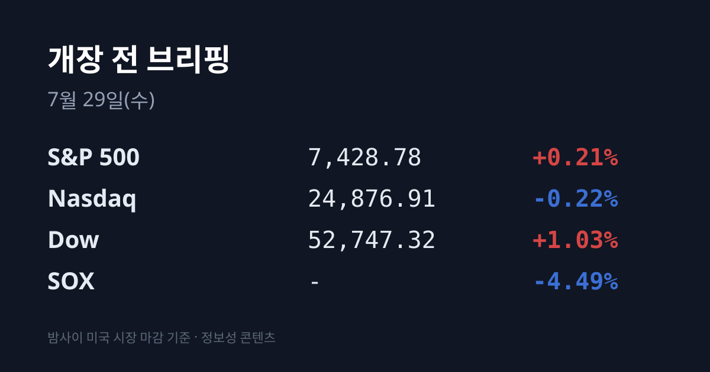
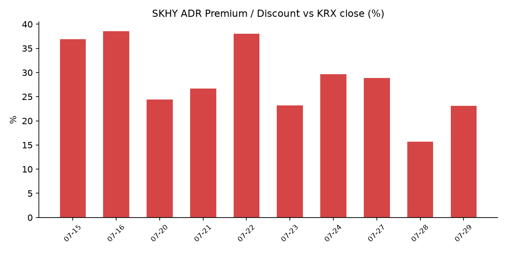
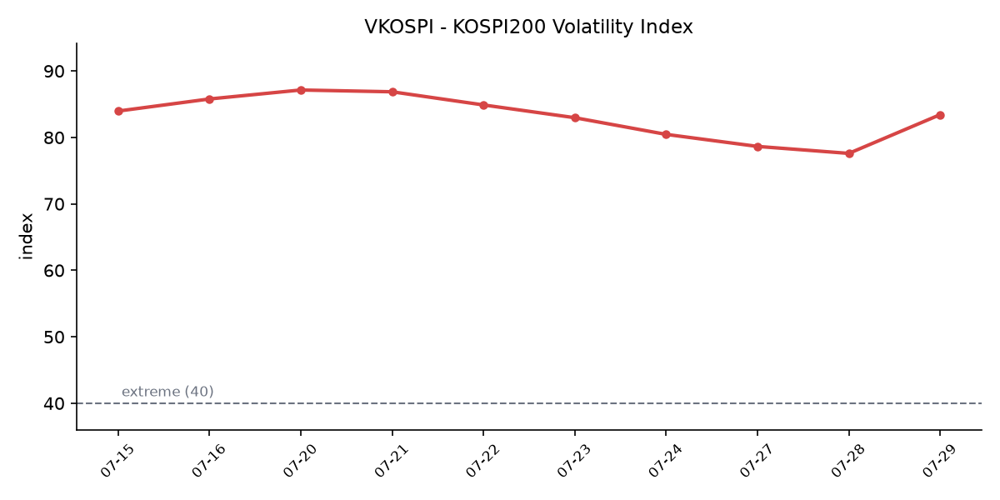

## ① 30초 요약

- 07/28 코스피는 **6,023.66(−732.09p, −10.84%)** 으로 마감해 <mark>역대 2위 하락폭</mark>을 기록했다(1위는 06/23 −910.71p). 오전 9시 6분 매도 사이드카, 10시 13분 서킷브레이커(1단계, 20분)가 발동됐다 — 올해 8번째, 7월 들어 3번째다.
- 같은 24시간 안에 미국은 반대로 움직였다. 다우는 **+1.03%(52,747.32)**, S&P 500은 +0.21%로 올랐고 VIX는 **18.21(−2.46%)** 로 내렸다. 밀린 것은 반도체뿐이다 — <mark>SOX −4.49%로 4거래일 연속 하락</mark>(올해 최장), 장중 한때 −6.5%였다.
- 삼성전자는 **220,000원(−13.39%)**, SK하이닉스는 **1,550,000원(−14.65%)** 으로 마감했다. 배경은 중국 창신메모리(CXMT) 상장 첫날 +466%·86억달러 조달과 중국 국영사의 침수식 DUV 노광장비 양산 착수 보도, 그리고 엔비디아-오픈AI 2,500억달러 순환금융 논란이다.
- 외국인은 코스피에서 **−4조9,592억원**을 순매도했고 개인이 +4조3,180억원, 기관이 +6,387억원을 받아냈다. 코스피 878개 종목이 내리고 36개만 올랐다.
- SKHY ADR은 $130.49(−8.76%)로 사상 최저를 기록했으나, 본주가 더 크게 빠져 <mark>괴리율은 +15.7% → +23.1%로 되벌어졌다</mark>. 오늘 09:00 SK하이닉스가 2분기 실적을 발표했다.

## ② 밤사이 미국 시장

| 지수 | 종가 | 등락률 |
| :--- | :--- | :--- |
| 다우 | 52,747.32 | +1.03% (+537.24) |
| S&P 500 | 7,428.78 | +0.21% (+15.60) |
| 나스닥 | 24,876.91 | −0.22% (−55.17) |
| SOX(필라델피아 반도체) | — | −4.49% |

07/28 미국장은 지수와 업종이 갈렸다. 다우가 500포인트 넘게 오르며 강세를 보인 배경에는 실적 시즌이 있었다 — 코카콜라가 시장 예상을 웃도는 실적을 내며 2009년 이후 최고 일간 상승률을 기록했고, 보잉과 페이팔도 실적 발표 후 올랐다. 유가가 이틀 연속 밀려 **WTI $79.26(−4.0%)** · 브렌트 $84.09(−4.8%)로 내려온 것도 위험선호를 지지했다. 브렌트는 07/23 $100.69에서 닷새 만에 약 16% 하락했다. 미 10년물 금리는 4.62%로 3거래일 연속 내려 약 1주일 최저 수준이 됐다.

반면 반도체는 홀로 −4.49% 밀리며 4거래일 연속 하락했다. 올해 최장 연속 하락이고, 나스닥100은 사상 최고 대비 −9.7%까지 내려와 조정 문턱에 왔다. 시장에서 지목한 원인은 두 갈래다. 하나는 엔비디아가 오픈AI 자금 조달을 지원할 가능성이 보도되며 재점화된 '순환 금융' 논란이고, 다른 하나는 중국의 반도체 자립 속도다. 종목별로는 샌디스크가 −13~14%, 마이크론과 AMD가 −8% 안팎, 인텔이 −6%, 시게이트가 −8% 넘게 밀렸고, ASML·어플라이드머티리얼즈·램리서치도 약세였다. 엔비디아는 장 초반 낙폭을 되돌려 소폭 상승(+0.25%)으로 마감했다. Wells Fargo 집계에 따르면 반도체와 하이퍼스케일러 주가의 상관관계는 −31%로 역사적 최저까지 내려왔다.

**장마감 후 실적은 정규장과 정반대 방향이었다.** <mark>테라다인은 2분기 EPS $2.47</mark>로 컨센서스 $2.06을 41센트 상회했고(매출 $13.3억 vs 컨센 $12.2억), 3분기 가이던스로 EPS **$1.85~2.15**(컨센 $1.44)·매출 $12~13억(컨센 $10.26억)을 제시했다. 시게이트는 1분기 조정 EPS를 약 **$7.30**(컨센 $5.80), 매출을 약 $41억(컨센 $37.5억)으로 안내하며 시간외에서 +8% 올라 정규장 낙폭을 되돌렸다. 그 외 포드가 2분기 실적 상회와 연간 전망 상향으로 +6%, 로키브랜즈 +16%, 맨해튼어소시에이츠 +7%였고, 비자는 가이던스에 −2%, 코스타는 매출·가이던스 미달로 −12%였다. KLA도 이날 실적을 발표했으나 시간외 등락률은 집계 시점 기준 미확인이다.

## ③ 괴리율 트래커 — SK하이닉스 ADR

| 항목 | 수치 |
| :--- | :--- |
| SKHY 종가 | $130.49 (−8.76%) |
| 본주 환산가 (×10×환율 1,462.5원) | 1,908,416원 |
| 본주 직전 종가 | 1,550,000원 |
| **괴리율** | **+23.1%** |

SKHY는 07/24 $154.57 → 07/27 $143.02 → 07/28 $130.49로 3거래일 누적 15.6% 내리며 사상 최저를 기록했다. 07/09 공모가 $149 대비로는 12.4% 낮은 수준이다. 그런데 괴리율은 직전 브리핑 **+15.7%** 에서 **+23.1%** 로 7.4%p 되벌어졌다. 분자(ADR)가 −8.76% 내렸는데 분모(본주)가 −14.65%로 더 크게 내렸기 때문이다.

괴리율은 두 시장이 같은 회사를 얼마나 다르게 값 매기는지를 보여주는 지표다. 07/27에는 ADR이 −7.47%, 본주가 +3.24%로 미국이 팔고 한국이 사서 괴리율이 하루에 13.2%p 압축됐다. 07/28은 방향이 반대였다 — 같은 뉴스를 받은 같은 회사인데 <mark>한국 시장이 미국 시장보다 5.9%p 더 팔았다</mark>. 프리미엄(+) 상태는 구조적으로 ADR을 본주로 전환하려는 유인을 만들고, 디스카운트(−) 상태는 그 반대 유인을 만든다.

전환 구조에는 제약이 있다. 본주↔ADR 상호전환이 오늘(07/29) 재개되지만, SK하이닉스가 본주→ADR 전환 총량을 발행주식의 **2.5%** 로 제한했고 초기 발행 쿼터가 이미 소진돼, 현재 실제로 가능한 방향은 ADR→본주 한쪽이다. 이 방향의 전환은 본주 매도 물량이 아니라 본주 유통주식 수 증가로 나타난다.

괴리율 추이: 07/15 +36.9 → 07/16 +38.5 → 07/20 +24.4 → 07/21 +26.7 → 07/22 +38.0 → 07/23 +23.2 → 07/24 +29.6 → 07/27 +28.9 → 07/28 +15.7 → 07/29 +23.1

## ④ 변동성 트래커

**판정 한 줄**: <mark>'극단' 심화, 방향은 재점화</mark> — VKOSPI가 7거래일 만에 반등하고 서킷브레이커가 발동됐으며 역대 2위 하락폭이 나왔다. 동시에 신용융자 잔고 −15.43%·예탁금 −30조원·PER 5.1배는 청산 연료가 줄고 있음을 함께 가리킨다.

**기대 변동성**  VKOSPI **83.43**(07/28), 전일 77.6에서 +5.88p(**+7.58%**) 상승했다. 기준선으로 보면 25 미만이 평온, 25~40이 경계, 40 이상이 극단이며 83.43은 극단 기준의 약 2.1배다. 07/21부터 07/27까지 5거래일 연속 하락하며 70선에 안착했던 흐름이 7거래일 만에 뒤집혔다. 06/29 장중 고점 96.9까지는 거리가 남아 있다.

**실현 변동성**  최근 7거래일 코스피 일별 등락률은 07/20 −4.46% → 07/21 +3.56% → 07/22 +0.74% → 07/23 +4.39% → 07/24 −5.72% → 07/27 +0.97% → **07/28 −10.84%** 였다. ±3.5% 이상인 날이 **7거래일 중 5일**이다. 07/28 하루만 봐도 시가 −5.26%에서 장중 −11.29%(5,992.91)까지 벌어졌다. 7월 월간 등락률 −28.9%는 2008년 10월 금융위기 당시(−23.1%)와 1987년 10월 블랙먼데이(−27.2%)를 모두 웃도는 수치다.

**매매 정지**  07/28 코스피 매도 사이드카 **09:06:02**, 코스닥 매도 사이드카 09:14, 코스피 서킷브레이커 **10:13**(1단계, 20분 매매정지)가 발동됐다. 올해 8번째 서킷브레이커이고 7월 들어서만 3번째다. 직전 주(07/20~24)에도 코스피 4회·코스닥 3회 사이드카가 발동됐다.

**증폭 경로**  단일종목 레버리지 ETF의 07/28 거래 비중·회전율은 집계 시점 기준 미확인이다(직전 확보치는 07/27 비중 31.3%·회전율 77.7%). 이 축에서는 수치보다 제도 변화가 컸다 — 금융위원회는 07/28 저녁 단일종목 레버리지 상품에 대한 투자요건 추가 상향과 개인별 투자한도 설정을 검토 중이라고 밝혔다(⑦ 정책 워치 참조).

**청산 압력**  신용거래융자 잔고는 07/24 기준 **32조6,716억원**으로, 6월 24일 연중 최고치 38조6,328억원 대비 한 달 만에 5조9,612억원(**−15.43%**) 줄었다. 반대매매는 6월 월간 3,935억원, 07/09 하루 1,422억원이었고, 미수금 대비 반대매매 비중은 1월 1.0% → 6월 5.1% → 07/09 10.2%로 올랐다. 투자자예탁금은 7월 4일 정점 대비 30조원 이상 감소했다. 07/28 당일 잔고와 반대매매 금액은 집계 시점 기준 미확인이다.

**하방 포지션**  코스피 공매도 순잔고 최신 확보치는 **16.85조원(07/22)** 으로, 06/01 사상 최고 22.82조원 대비 약 6조원 줄었다. 공매도 잔고는 T+3 공시 지연이 있어 07/28 폭락 당일 수치는 구조적으로 아직 공개되지 않았다.

미확인 항목: 달러인덱스·미 2년물·국제 금·구리 시세, SOX 종가 절대수치, 코스피200 야간선물 절대수치, 07/28 신용융자 잔고와 반대매매 금액, 레버리지 ETF 거래 비중·회전율, 프로그램 매매 차익/비차익, 선물 베이시스.

## ⑤ 어제 한국장 리뷰

| 지수 | 종가 | 등락률 |
| :--- | :--- | :--- |
| KOSPI | 6,023.66 | −10.84% (−732.09) |
| KOSDAQ | 705.85 | −7.72% (−59.01) |

코스피는 6,400.27(−5.26%)로 갭하락 출발한 뒤 낙폭을 키워 장중 5,992.91(−11.29%)까지 밀리며 6,000선이 무너졌고, 종가 6,023.66으로 6,000선을 겨우 지켰다. 투자자별로는 외국인이 **−4조9,592억원** 순매도, 개인이 +4조3,180억원, 기관이 +6,387억원 순매수였다. 코스피에서 오른 종목은 36개, 내린 종목은 878개였다.

시가총액 상위 종목은 삼성전자 220,000원(−13.39%), SK하이닉스 1,550,000원(−14.65%), 삼성전자우 158,200원(−12.01%)이었고, SK스퀘어 −15.60%·삼성전기 −15.92%로 반도체 연관주 낙폭이 가장 컸다. 반도체 밖에서도 현대차 −9.68%, 에코프로 −9.80%, 삼성생명 −8.51%, LG에너지솔루션 −5.71%, KB금융 −4.29%, 알테오젠 −4.97%로 업종 구분 없이 밀렸다. 오른 쪽에서는 삼성바이오로직스가 1,549,000원(+0.26%)으로 버텼고, 상승률 상위는 시가총액 10억원대 초소형 우선주(진흥기업2우B·진흥기업우B·CJ씨푸드1우 상한가)가 채웠다. 하한가는 코스피에서 미래산업·한화갤러리아우, 코스닥에서 야스·형지I&C였다.

원/달러 환율은 개장 직후 1,470원대로 재진입했으나 되밀려 **1,462.5원(−6.0원)** 으로 마감했다(오후 3시 30분 기준). 주식시장이 −10.84% 내리고 외국인이 5조원 가까이 순매도한 날 환율이 오히려 내렸다는 점이 07/27과 대비된다 — 07/27에는 유가가 −8% 급락했는데 환율이 올랐다.

아시아 증시는 07/28 동반 급락했다. 닛케이225 62,364.92(−3.95%), 토픽스 3,963.59(−2.52%), 대만 가권 41,603.36(−4.65%), 상해종합 3,813.31(−1.16%), CSI300 4,569.52(−2.83%)였고, 항셍은 +0.41%로 주요 지수 중 유일하게 올랐다. 일본에서는 키옥시아·도쿄일렉트론·어드반테스트가 두 자릿수 하락했고 대만에서는 TSMC가 동반 약세였다. 반도체 비중이 큰 시장이 함께 밀린 구도이며, 그 안에서 **코스피 −10.84%는 대만(−4.65%)의 약 2.3배**로 역내 최대 낙폭이었다.

## ⑥ 오늘의 캘린더 & 관전 포인트

**07/29(수)**
- **09:00 SK하이닉스 2분기 실적 발표(완료)** — 매출 **79조3,187억원**, 영업이익 **60조5,426억원**, 순이익 93조9,226억원, 영업이익률 76%(전분기 72%). 전분기 대비 매출 +50.9%·영업이익 +61.0%, 전년 동기 대비 +256.8%·+557.2%로 사상 최대다. 다만 최근 한 달간 보고서를 낸 증권사 14곳 평균 전망치(매출 84조597억원·영업이익 64조889억원)에는 <mark>각각 약 5% 미달</mark>했다. 회사는 HBM과 AI 서버용 D램, eSSD 판매 확대로 최고 수익성을 냈다고 설명했고, HBM4 양산 출하 개시, 321단 낸드 생산능력 연말 국내 50% 확대, 청주 M15X 양산 시점 단축, 2027년 초 용인 클러스터 1기 팹 오픈을 밝혔다. IR 콘퍼런스콜이 이어진다.
- **SK하이닉스 ADR 신주 국내 상장 + 본주↔ADR 상호전환 개시** — 앞서 적었듯 본주→ADR 한도(발행주식 2.5%)가 소진돼 실질은 ADR→본주 일방향이다.
- 6월 소매판매지수
- **미 장마감 후 마이크로소프트·메타 실적**(→ KST 07/30 새벽)

**07/30(목)**
- **03:00 FOMC 결과 · 03:30 기자회견**(의장 Kevin Warsh). 시장은 동결 확률 **64%**, 25bp 인상 확률 **36%** 를 반영하고 있다.
- **삼성전자 2분기 확정 실적 콘퍼런스콜**
- 미 2분기 GDP 속보치, 근원 PCE
- 미 장마감 후 애플·아마존 실적(→ KST 07/31 새벽)

**07/31(금)** 6월 광공업생산, 미 6월 PCE 물가, 시카고 PMI

**시장이 주시하는 레벨**
- 코스피 **6,000선** — 07/28 장중 5,992.91까지 밀렸다가 6,023.66으로 마감해 지켜진 자리다.
- **ADR 괴리율 +23.1%** — 압축될 때 그것이 본주 상승으로 이뤄지는지, ADR 하락으로 이뤄지는지에 시장의 관심이 있다.
- **VKOSPI 80선과 90선** — 07/28 83.43으로 80선을 다시 넘었고, 06/29 장중 고점은 96.9였다.
- 외국인 순매도 연속 일수 — 07/24·07/27·07/28 3거래일 누적 순매도가 11조원을 넘었다.
- 코스피 **PER 5.1배** — 2000년 이후 최저 수준이며 반도체 업종 PER은 4배 이하로 집계됐다.
- 참고로 07/29 09시 1분 코스피200 선물은 971.10(+1.50%)에 거래됐다.

## ⑦ 정책 워치

**단일종목 레버리지 상품 규제** — 이억원 금융위원장은 07/28 "단일종목 레버리지 상품의 수요가 충분히 진정되지 않을 경우 <mark>투자요건 추가 상향과 개인별 투자한도 설정</mark> 등 추가 조치를 검토·준비하겠다"고 밝혔다. 개인이 보유한 금융투자상품 총투자액의 일정 비율 이내로 단일종목 레버리지 투자액을 제한하는 방안이 검토되고 있다. 삼성전자·SK하이닉스를 기초자산으로 하는 국내 첫 단일종목 레버리지·인버스 ETF와 ETN은 5월 27일 상장됐고, 이후 두 종목에 투자금이 집중되며 변동성이 커졌다는 지적이 제기돼 왔다.

**공매도 제도** — 2026년 3월 31일 전 종목 전면 재개 상태가 유지되고 있으며 **제도 변경은 없다**. 기관투자자 실시간 잔고 관리와 NSDS 연동이 의무화됐고, 상환 기간은 최대 12개월, 개인·기관 담보 비율은 105%로 통일돼 있다. 불법 무차입 공매도에는 부당이득의 최대 5배 벌금과 형사처벌이 적용된다.

**중국 반도체 정책** — 창신메모리(CXMT)는 07/27 상하이 커촹반 상장 첫날 466% 오르며 86억달러를 조달했다. 07/28에는 중국 국영사가 침수식 DUV 노광장비 양산에 착수했다는 보도가 나왔다. 두 사안 모두 중국의 메모리·장비 자립과 관련된 공급 측 변화로 시장에서 다뤄졌다.

## ⑧ 오늘의 질문

같은 뉴스를 받은 같은 회사인데 한국 본주가 미국 ADR보다 5.9%p 더 빠졌던 어제의 간극은, 본주가 올라서 메워질 것인가 ADR이 더 내려서 메워질 것인가.

---
*본 글은 공개된 시장 데이터를 정리한 정보성 콘텐츠이며, 특정 종목·상품의 매매 권유가 아닙니다. 모든 투자 판단과 책임은 투자자 본인에게 있습니다. 수치는 작성 시점 기준이며 이후 변동될 수 있습니다.*
