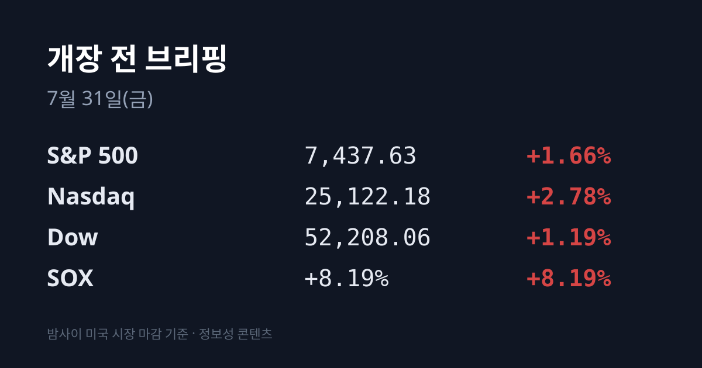
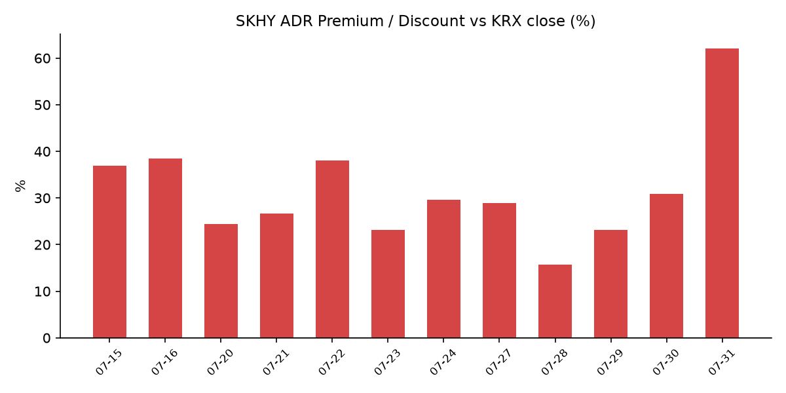
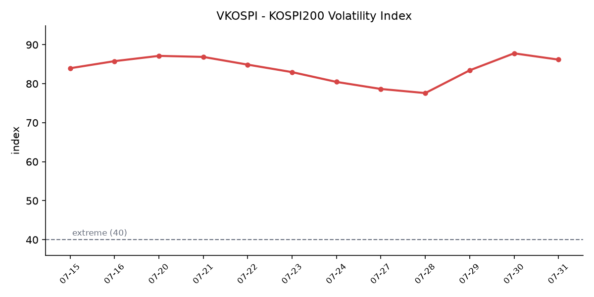

## ① 30초 요약

- 미 3대 지수가 일제히 반등했다. **나스닥 +2.78%로 6거래일 만의 상승**이었고, 마이크로소프트가 하루 15.5% 올라 1일 시가총액 증가액 사상 최대를 기록했다.
- <mark>필라델피아 반도체지수(SOX)가 +8.19%로 5거래일 연속 하락을 끝냈다.</mark> 마이크론 +18.36%, 샌디스크 +25.99%, AMD +13.00%, 인텔 +11.30%였다.
- SK하이닉스 ADR(SKHY)이 **+17.52%로 07/09 공모가 $149를 하루 만에 회복**했다. 같은 날 본주는 −5.64%로, 괴리율은 <mark>+62.0%로 트래커 집계 이래 최고치</mark>가 됐다.
- 미 장마감 후 아마존이 AWS 매출 +37%(1분기 +28%에서 가속)를 내놓으며 시간외 8~9% 올랐고, 애플은 하드웨어 호조에도 서비스·중화권이 컨센서스를 밑돌아 시간외 약 4% 내렸다.
- 어제 코스피는 삼성전자 컨퍼런스콜 직후 장중 **+5.36%(5,976.82)** 까지 올랐다가 종가 5,593.56(−1.23%)으로 마감했다. 외국인은 5거래일 만에 순매수로 전환했다.

## ② 밤사이 미국 시장

| 지수 | 종가 | 등락률 |
| :--- | ---: | ---: |
| 다우 | 52,208.06 | +1.19% |
| S&P 500 | 7,437.63 | +1.66% |
| 나스닥 | 25,122.18 | +2.78% |
| SOX(필라델피아 반도체) | 집계 시점 기준 미확인 | **+8.19%** |

반등의 축은 마이크로소프트였다. 전일 장 마감 후 발표한 실적에서 Azure 성장률이 시장 예상을 웃돌면서 주가가 **15.5% 급등**했고, 이는 1일 시가총액 증가액 기준 사상 최대였다. 반도체가 그 뒤를 이었다 — SOX는 8.19% 올라 5거래일 연속 하락을 끝냈다. 개별 종목으로는 마이크론 +18.36%, 샌디스크 +25.99%, SK하이닉스 ADR +17.52%, AMD +13.00%, 인텔 +11.30%로 메모리 계열의 상승폭이 특히 컸다. 애플은 정규장에서 $338.19(−0.56%)로 마감했다.

정규장 마감 후에는 두 개의 실적이 엇갈렸다. **아마존**은 2분기 매출 $2,006억(+20%), EPS $5.75를 기록했고 **AWS 매출이 $422억으로 전년 대비 37% 증가**했다 — 시장 성장률 기대치 31.21%를 웃돌았을 뿐 아니라 1분기 +28%에서 가속한 수치이며 18개 분기 만에 가장 빠른 성장률이다. 주가는 시간외에서 8~9% 올랐다. **애플**은 FY26 3분기 매출 $1,094.2억(+16.4%), EPS $2.02로 둘 다 컨센서스를 넘겼고 아이폰 $542.5억(+21.7%)·맥 $103.5억(+28.7%)도 예상을 상회했다. 그러나 서비스가 $307.4억으로 컨센서스 $313.6억을 밑돌았고 중화권도 $188.2억으로 약 $8억 미달해 시간외에서 4% 안팎 하락했다.

거시 지표와 채권은 방향이 달랐다. 미 2분기 GDP 속보치는 **연율 +1.5%** 로 1분기 2.1%와 컨센서스 1.8%를 모두 밑돌았고, 6월 PCE 물가는 전년 대비 +3.7%(전월비 −0.1%), 근원 PCE는 +3.3%(전월비 +0.1%)였다. 그럼에도 장기 금리는 올랐다 — **미 10년물 4.677%(+5.5bp), 30년물 5.221%(+7.8bp)로 30년물은 2007년 이후 최고 수준**에 근접했다. 국제유가는 사우디 주도 해상연합 발표로 호르무즈 해협 재개 기대가 생기며 브렌트 9월물 $89.03(−1.88%), WTI 9월물 $83.59(−1.03%)로 내렸다. 금 현물은 달러 약세와 물가 둔화에 $4,104.59(+1%)로 올랐고 달러인덱스는 0.8% 약해졌다. VIX 종가는 집계 시점 기준 미확인이다.

## ③ 괴리율 트래커 — SK하이닉스 ADR

| 항목 | 수치 |
| :--- | ---: |
| SKHY 종가 | $149.00 (+17.52%) |
| 본주 환산가 (×10×환율) | 2,141,726원 |
| 본주 직전 종가 | 1,322,000원 |
| **괴리율** | **+62.0%** |

SKHY는 07/29 $126.79로 사상 최저를 찍은 다음 날 17.52% 올라 **07/09 공모가 $149를 회복**했다. 같은 날 본주(SK하이닉스)는 1,322,000원으로 5.64% 내렸다. 하루 만에 두 시장의 등락률 격차가 <mark>23.2%p 벌어졌고, 07/28부터 사흘 누적으로는 약 36%p</mark>다. 괴리율 +62.0%는 이 트래커가 집계를 시작한 이래 가장 높은 값이며, 직전 최고치는 07/16의 +38.5%였다.

괴리율이 어떻게 작동하는지 짚어둔다. ADR 10주가 본주 1주에 대응하므로, ADR 가격에 10과 원/달러 환율을 곱하면 본주 기준 환산가가 나온다. 이 환산가가 본주 종가보다 높으면 프리미엄, 낮으면 디스카운트다. 구조상 프리미엄 상태에서는 ADR을 본주로 전환해 넘어올 유인이, 디스카운트 상태에서는 반대 방향의 유인이 생긴다. 다만 이 구조가 실제로 작동하려면 전환이 자유로워야 한다. SK하이닉스는 **07/30부터 ADR→본주 전환을 개시**했으나 전환 가능 물량이 1,779만주로 발행주식의 2.5%에 한정돼 있고 전환 절차에 수 주 이상이 걸린다. 시장에서 "괴리가 쉽게 좁혀지지 않는다"는 해석이 나온 이유다.

## ④ 변동성 트래커

**판정 한 줄**: <mark>'극단' 유지, 그러나 세 축이 처음으로 같은 진정 방향을 가리켰다</mark> — VKOSPI가 3거래일 만에 하락했고, 사이드카·서킷브레이커가 3거래일 만에 발동되지 않았으며, 일간 낙폭이 사흘 연속 줄었다. 반대 방향은 하나다 — 반대매매가 직전 거래일 대비 340% 급증했다.

**기대 변동성**  VKOSPI 07/30 종가 **86.18(−1.61p, −1.83%)**. 40 이상 '극단' 구간으로 기준의 약 2.2배다. 07/28 83.43 → 07/29 87.79 → 07/30 86.18로 **3거래일 만에 하락 전환**했고, 장중 레인지도 85.49~87.17로 전날(80.19~93.27)보다 크게 좁아졌다. 52주 레인지는 18.03~97.99다.

**실현 변동성**  최근 7거래일 코스피 일별 등락률은 07/22 +0.74% → 07/23 +4.39% → 07/24 −5.72% → 07/27 +0.97% → 07/28 −10.84% → 07/29 −5.98% → 07/30 −1.23%다. **±3.5% 이상인 날이 4일**이다. 낙폭은 −10.84% → −5.98% → −1.23%로 사흘 연속 줄었으나, 07/30 일중 진폭은 여전히 약 6.4%였다(장중 고 5,976.82 = +5.36% → 종가 −1.23%). 사흘 누적 −17.2%다.

**매매 정지**  **07/30은 사이드카·서킷브레이커가 모두 발동되지 않았다.** 07/28 코스피·코스닥 동반 서킷브레이커, 07/29 동반 재발동(2일 연속은 사상 최초)에 이어 3거래일 만의 무발동이다. 7월 코스피 누적은 사이드카 13회(매도 8·매수 5)·서킷브레이커 3회다.

**증폭 경로**  단일종목 레버리지 ETF의 07/30 거래 비중·회전율은 집계 시점 기준 미확인이다(직전 확인치는 07/27 비중 31.3%·회전율 77.7%). 이 축은 오늘 제도가 바뀐다 — 아래 ⑦ 정책 워치 참조.

**청산 압력**  신용거래융자 잔액은 07/29 기준 **32조9,950억원**으로 6월 24일 역대 최대 38조6,328억원 대비 약 14.6% 줄었다. 반면 위탁매매 반대매매는 07/29 **611억원으로 직전 거래일 138억9,000만원 대비 340% 급증**했고, 이는 7월 9일(1,422억원) 이후 최대 규모다. 위탁매매 미수금은 1조2,000억원, 미수금 대비 반대매매 비중은 **1.3%에서 5.0%로** 뛰었다. 잔고는 줄고 청산 속도는 붙은 상태다.

**하방 포지션**  코스피 공매도 순잔고 최신 확인치는 07/22 기준 **16.85조원**이다. **T+3 공시 지연** 때문에 07/28~30 급락 구간의 잔고는 구조적으로 확인이 불가능하다.

*집계 시점 기준 미확인 항목: VIX 07/30 종가, SOX 절대 종가, 달러인덱스 절대치, 미 2년물·10Y−2Y 스프레드, 코스피200 야간선물, 레버리지 ETF 거래 비중·회전율, 07/30 신용융자 잔액, 프로그램 매매 차익·비차익, 선물 베이시스, 대만 TAIEX.*

## ⑤ 어제 한국장 리뷰

| 지수 | 종가 | 등락 |
| :--- | ---: | ---: |
| 코스피 | 5,593.56 | −69.68 (−1.23%) |
| 코스닥 | 644.78 | −17.90 (−2.70%) |
| 삼성전자 | 207,000원 | −0.72% |
| SK하이닉스 | 1,322,000원 | −5.64% |

07/30 코스피는 5,681.77(+0.33%)로 출발해 **장중 5,976.82까지, 즉 +5.36%까지 올라 6,000선을 눈앞에 뒀다가 상승분을 전부 반납**하고 5,593.56(−1.23%)에 마감했다. 급등의 계기는 삼성전자 2분기 실적 컨퍼런스콜이었다. 확정 영업이익은 **89조4,924억원(전년 동기 대비 +1,813.8%)** 으로 컨센서스 84조1,894억원을 6.3% 상회했고, 회사는 컨콜에서 올해 미충족 수요가 내년으로 이연되면서 **"2027년 공급 부족이 올해보다 심화되고 2028년까지 지속"**, "신규 팹 건설부터 웨이퍼 생산까지 3년 넘게 소요"라고 밝혔다. 삼성전자는 장중 226,000원(+8.39%)까지 올랐다가 종가 207,000원(−0.72%)으로 되밀렸다.

수급은 이번 주 들어 처음으로 방향이 바뀌었다. 유가증권시장에서 **외국인이 1조4,882억원을 순매수해 07/23 이후 5거래일 만에 매수 우위로 전환**했고 기관도 788억원을 순매수했다. 반면 개인은 1조5,954억원을 순매도해 07/29(−2조9,265억원)에 이어 이틀 연속 매도 우위였다. 코스닥에서는 외국인 +2,481억원, 기관 −1,436억원, 개인 −1,101억원이었다(잠정).

업종은 뚜렷하게 갈렸다. **화학 +2.56%, 금속 +2.49%, 운송장비·부품 +2.19%**, 음식료·담배 +1.56%, 섬유·의류 +1.00%가 오른 반면 **전기·전자는 −3.08%**, 의료·정밀기기 −2.10%, 건설 −1.42%, 기계·장비 −0.65%로 내렸다. 자금이 실제로 이동한 곳은 조선이었다 — HD한국조선해양·한화오션·삼성중공업의 **2분기 합산 영업이익이 2조7,000억원**, 상반기 합산 매출이 30조원을 넘었고 수주액이 전년 동기 대비 약 2배로 집계되면서 장중 HD한국조선해양 +8.51%(363,500원), 삼성중공업 +7.22%(20,800원), 한화오션 +6.17%(79,200원)를 기록했다. ETF 수익률 상위도 TIGER 조선TOP10 +5.99%, KODEX 조선TOP10 +5.65%, HK 200 +5.28%, RISE 2차전지TOP10 +4.69%, SOL K방산 +4.64% 순이었고 반도체·AI ETF는 급락했다. 코스닥에서는 씨메스로보틱스가 상한가를 기록하며 07/29 미 FCC의 외국산 로봇 수입 금지 의결 이후의 로봇 테마가 이틀째 이어졌다.

원/달러 환율은 **1,437.4원(−9.3원)** 으로 마감해 2월 26일(1,425.8원) 이후 5개월 만의 최저를 기록했다. 07/29(−15.8원)에 이어 이틀 연속 하락이며 사흘 누적 약 31원이 내렸다. 시장에서는 FOMC 동결에 대한 해석과 함께 **SK하이닉스 ADR 관련 자금 유입**이 하락 요인으로 지목됐다.

아시아 증시는 닛케이 61,867.43(+0.71%), 항셍 25,858.88(+0.20%), 상해종합 3,804.69(−0.62%)였다. 대만 TAIEX는 집계 시점 기준 미확인이다.

## ⑥ 오늘의 캘린더 & 관전 포인트

- **07/31(오늘)** — **단일종목 레버리지 ETF·ETN 기본예탁금 현금 3,000만원 시행**(⑦ 참조)
- **07/31(오늘)** — **BOJ 금융정책결정회의 결과 발표**(07/30~31 개최)
- **07/31(오늘)** — 한국 6월 산업활동동향·광공업생산
- **08/01(토)** — **한국 7월 수출입 확정치**. 7월 1~20일 잠정치는 수출 549억달러(+52.3%), 반도체 221억달러(+180.6%), 무역수지 +122억달러였다
- **08/01 새벽(KST)** — 미 정규장 마감 후 실적 및 시간외 반응
- **다음 주** — 미 7월 고용보고서, ISM 제조업(구체 일정 집계 시점 기준 미확인)

**시장이 주시하는 레벨** — 시장 참가자들이 지켜보는 지점은 다음과 같다. **미 30년물 5.221%·10년물 4.677%** 는 2007년 이후 최고 수준에 근접한 구간이다. **ADR 괴리율 +62.0%** 는 트래커 사상 최고치이며, 압축이 일어난다면 그 경로가 본주 상승인지 ADR 하락인지가 관전 포인트다. **VKOSPI 86.18**은 '극단' 기준선 40의 두 배를 넘는 수준이고, 07/29 장중 고점은 93.27이었다. **코스피 5,976.82**는 어제 장중 고점이자 6,000선 직전 지점이다. 수급에서는 외국인의 5거래일 만의 순매수 전환(+1조4,882억원)이 이어지는지, 개인 순매도(−1조5,954억원)가 줄어드는지가 함께 언급된다.

## ⑦ 정책 워치

**오늘부터 단일종목 레버리지 ETF·ETN 기본예탁금이 현금 3,000만원으로 오른다.** 금융위원회는 상품 출시 이후 시가총액과 거래대금이 빠르게 늘자 당초 8월로 예정했던 시행을 7월 말로 앞당겼다. 개인투자자가 단일종목 레버리지 상품을 새로 사거나 추가 매수하려면 오늘부터 현금 3,000만원 이상의 기본예탁금을 보유해야 하며, **대용증권은 인정되지 않는다.** 현금 기본예탁금 인정 시점도 강화됐다 — 기존에는 대용증권 매도 당일(T일) 즉시 현금과 동일하게 인정했으나 앞으로는 결제가 완료돼 현금이 실제 입금되는 **T+2일**에 인정한다.

이와 별개로 신규 상품 상장 중단과 광고 금지는 이미 시행 중이고, 개인별 투자한도를 금융투자상품 총투자금액의 일정 비율(예시 20%) 이내로 제한하는 방안이 검토되고 있다. 투자자 보호 체계 개선 방안은 8월 중 시행 예정이다.

공매도 제도는 변경 사항이 없다. **2026년 3월 31일 차입 공매도 전 종목 전면 재개 상태가 유지**되고 있으며 무차입 공매도는 계속 금지다. 시장 일각에서 증권시장안정펀드 투입과 공매도 금지 요구가 나오고 있으나 당국이 결정한 바는 없다.

SK하이닉스는 **07/30부터 ADR→본주 전환을 개시**했다. 전환 가능 물량은 1,779만주로 발행주식의 2.5% 수준이며, 회사는 전환 절차에 통상 수 주 이상이 걸린다고 밝혔다. 향후 ADR 비율 확대는 규제 환경을 고려해 검토한다는 입장이다.

## ⑧ 오늘의 질문

밤사이 SOX가 8.19% 오르고 SK하이닉스 ADR이 공모가를 회복했는데, 어제와 그제 이틀 연속 오전 상승분을 오후에 반납했던 국내 시장은 이번에는 그 흐름을 지켜낼 것인가.

---
*본 글은 공개된 시장 데이터를 정리한 정보성 콘텐츠이며, 특정 종목·상품의 매매 권유가 아닙니다. 모든 투자 판단과 책임은 투자자 본인에게 있습니다. 수치는 작성 시점 기준이며 이후 변동될 수 있습니다.*
