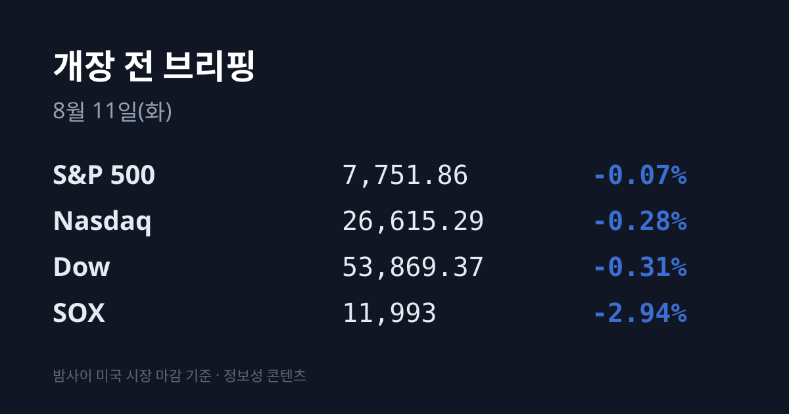
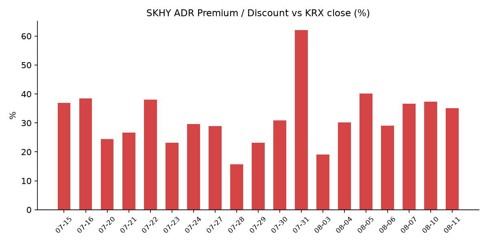
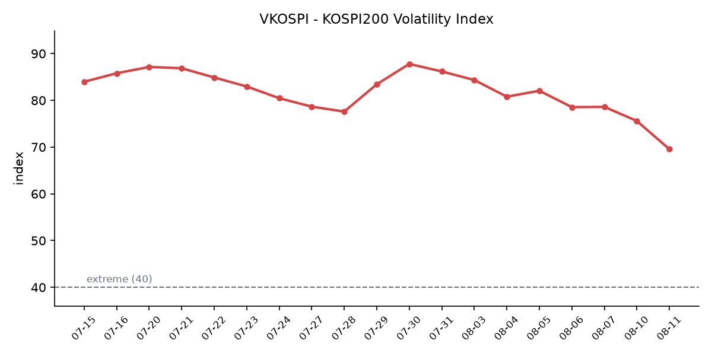

## ① 30초 요약

- 밤사이 미국에서 <mark>유가가 5% 급등하며 인플레이션 우려가 되살아났다</mark>. **WTI 9월물 $82.13(+5%)**, **브렌트 10월물 $87.72**다. 호르무즈 협상에서 이란은 오만과의 합의 근접을 주장했지만 미국의 조건 충족을 요구했고, **트럼프 대통령은 "절반 정도만 협상하고 있다"** 며 신중론으로 돌아섰다.
- 그 즉시 금리가 반응했다. **미 10년물 4.692%(+3bp)·2년물 4.235%(+3bp)** 이고, <mark>CME FedWatch 기준 9월 금리 인상 확률이 44.1%에서 51%로 되돌아왔다</mark>. 1주 전에는 67%였다.
- 미 3대 지수는 소폭 내렸다. **S&P 500 7,751.86(−5.78, −0.07%)**, **나스닥 26,615.29(−75.33, −0.28%)**, 다우 **53,869.37(−167.56, −0.31%)**. 반면 <mark>반도체만 따로 빠졌다 — SOX −2.94%</mark>다. **인텔 −4.06%**(150억 달러 유상증자), **엔비디아 −2.86%**, 마이크론 −1.89%였다.
- 어제 한국장에서는 <mark>코스닥이 854.47로 6.97% 폭등</mark>했다. 코스피는 6,299.66(+0.65%)으로 마감했는데, **삼성전자 −0.43%·SK하이닉스 −0.14%로 두 종목이 함께 내린 날에 지수는 올랐다**. 외국인은 코스피에서 **1조4,887억원**을 순매도했다.
- SK하이닉스 ADR 괴리율은 **+37.3% → +35.1%** 로 압축됐다. **VKOSPI는 69.55(−7.99%)** 로 <mark>5월 28일 이후 처음 70선 아래</mark>로 내려왔다.

## ② 밤사이 미국 시장

| 지수 | 종가 | 등락률 |
| :--- | ---: | ---: |
| S&P 500 | 7,751.86 | −0.07% |
| 나스닥 종합 | 26,615.29 | −0.28% |
| 다우존스 | 53,869.37 | −0.31% |
| 필라델피아 반도체(SOX) | 약 11,993 | **−2.94%** |

*SOX는 08/07 종가 12,356.79에 당일 등락률을 적용한 환산치다.*

**지수 하락폭보다 원인이 컸던 하루였다.** 세 지수 모두 −0.1%대의 소폭 하락에 그쳤지만, 그 배경에는 <mark>국제유가 5% 급등</mark>이 있었다. **WTI 9월물이 배럴당 82.13달러(+5%)**, **브렌트 10월물이 87.72달러**를 기록했다. 호르무즈 해협 재개방 협상에서 엇갈린 신호가 나온 것이 직접적인 계기였다 — 이란은 오만과의 합의가 가깝다고 주장하면서도 미국 측 조건 충족을 요구했고, 트럼프 대통령은 **"절반 정도만 협상하고 있다"** 고 언급했다. 지난주 초 "곧 열릴 것", "48시간 안에 결과를 알게 될 것"이라던 발언과 비교하면 톤이 내려간 것이다.

유가가 오르자 인플레이션 기대가 따라 올랐고, 채권이 즉시 반응했다. **미 10년물 국채금리는 4.692%로 3bp**, **2년물은 4.235%로 3bp** 상승했다. 그리고 **CME FedWatch 기준 9월 금리 인상 확률이 51%** 로 집계됐다 — 직전 거래일 44.1%, 1주 전 67%였다. 현 연방기금금리는 **3.50~3.75%** 구간이며, 직전 FOMC에서는 투표권을 가진 12명 중 3명이 인상을 선호했다. **VIX는 15.43으로 3.56% 올랐다.** 섹터별로는 **에너지가 4.63% 오르며 홀로 강세**였고 **정보기술은 1.1% 내렸다**.

**반도체는 따로 맞았다. SOX가 2.94% 빠졌다.** 그런데 <mark>어젯밤 반도체를 누른 두 재료는 업황 뉴스가 아니라 개별 기업의 자금조달 이슈였다</mark>. 첫째, **인텔이 150억 달러 규모의 보통주 공모를 발표하고 4.06% 하락**했다. 주식 수가 약 **3% 희석**되는 규모이고, 인수단에는 30일간 22.5억 달러 추가매수 옵션이 부여됐다. 조달 목적은 **파운드리 14A 공정 확장과 AI 컴퓨트 수요 대응**이며, 인텔은 같은 발표에서 **2026년 설비투자(capex) 전망을 180억 달러에서 200억 달러로 상향**했다. 인텔은 1990년 이후 1,500억 달러 넘게 자사주를 매입해온 회사이고, 주가는 연초 이후 약 3배로 AMD·엔비디아·SOX를 모두 상회한 상태였다.

둘째, **엔비디아가 2.86% 내려 217.55달러에 마감**했다. 파이낸셜타임스는 **아폴로 글로벌·블랙스톤·GIP(블랙록)·브룩필드·골드만삭스·KKR 컨소시엄이 엔비디아와 5,000억 달러 규모의 AI 인프라 자금조달 패키지를 추진 중**이라고 보도했다. 시장에서는 이를 호재가 아니라 **'순환 거래(circular deal)' 우려**로 해석했다는 분석이 나온다 — 칩을 판매하는 기업이 그 칩을 구매할 자금까지 함께 주선하는 구조에 대한 문제 제기다. 그 밖에 **마이크로소프트 +1.21%**(자체 칩 생산 확대 계획), 애플 −1.53%(제프리스 투자의견 하향), 이베이 −3.81%, 버크셔해서웨이 +1.53%였고, **슈퍼마이크로컴퓨터(SMCI)는 실적 발표를 앞두고 4.7% 올랐다**.

## ③ 괴리율 트래커 — SK하이닉스 ADR

| 항목 | 수치 |
| :--- | :--- |
| SKHY 종가 | $135.29 (−1.90%) |
| 본주 환산가 (×10×환율 1,418.40원) | 1,918,953원 |
| 본주 직전 종가 | 1,420,000원 |
| **괴리율** | **+35.1%** |

전일 **+37.3%** 에서 **2.2%p** 압축됐다. 압축의 경로는 **본주가 아니라 ADR 쪽**이었다 — 본주(SK하이닉스)는 **1,420,000원(−0.14%)** 으로 사실상 보합이었는데 **ADR은 −1.90%** 로 더 내렸다. 여기에 **원·달러가 8.90원 올라 환산가를 밀어올렸는데도** 괴리가 줄었다는 것은, ADR 하락 폭이 환율 효과를 넘어섰다는 뜻이다.

괴리율의 구조는 이렇다. ADR 프리미엄(+)은 미국에서 거래되는 가격이 본주보다 높다는 뜻이고, 전환 차익거래 구조상 본주 쪽에 매수 유인이 생기는 방향으로 작동한다. 디스카운트(−)면 반대다. 다만 이 프리미엄이 즉시 무위험 차익으로 실현되지는 않는다. **ADR→본주 전환 한도가 1,779만주(발행주식의 2.5%)** 로 제한돼 있고 **전환 절차에 수 주 이상**이 걸리기 때문이다. 그래서 이 지표는 차익거래 기회라기보다 **한·미 두 시장이 같은 자산에 매기는 값의 격차를 보여주는 계기판**에 가깝다.

한 가지 맥락을 함께 봐야 한다. <mark>어젯밤은 반도체 섹터 전체가 빠진 날이었다 — SOX −2.94%다</mark>. 그 안에서 **SKHY −1.90%는 섹터보다 1.0%p 덜 빠진 수치**다. 비교해 보면 차이가 드러난다. **08/07에는 SOX가 +2.56% 오른 날 SKHY가 −3.92%로 섹터를 6.5%p 하회**했다. **어제는 섹터를 1.0%p 상회했다.** 즉 "미국 시장이 이 종목만 따로 떼어 팔았다"는 08/07의 패턴은 어제 하루 동안 재현되지 않았다.

**+35.1%는 이번 국면의 평균대 위, 상단대 아래다.** 국면 고점은 08/05의 **+40.2%**, 그 이전 고점은 07/16의 **+38.5%** 였고(07/31의 +62.0%는 상한가 직후 왜곡), 평균대는 **+29%** 구간이다. SKHY는 07/29 126.79달러(사상 최저)에서 08/04 154.38달러(국면 최고)까지 올랐다가 현재 135.29달러로, **국면 최고 대비 12.4% 낮은 수준**이다. 어제 거래 레인지는 134.28~139.08달러였다.

## ④ 변동성 트래커 🌡️

**판정 한 줄**: <mark>'극단' 유지, 그러나 이번엔 진정의 원인이 국내 정책으로 특정됐다</mark> — **미국 VIX가 오른 날(+3.56%) 한국 VKOSPI는 7.99% 내렸다.** 한·미 변동성이 나흘 만에 반대로 갈렸고, 그 차이를 만든 것은 **레버리지 ETF 규제**다.

**기대 변동성** — **VKOSPI 69.55(−6.04, −7.99%)**, 장중 저점 69.53. 기준 40의 약 **1.74배**로 **'극단'(40 이상)** 구간이다. <mark>5월 28일 이후 처음으로 70선 아래</mark>로 내려왔고, **07/30 대비 −19.30%**, **07/29 장중 고점 93.27 대비 −25.43%** 다. 추이는 07/30 87.79 → 07/31 86.18 → 08/03 84.35 → 08/04 80.78 → 08/05 82.05 → 08/06 78.6 → 08/07 75.59 → **08/10 69.55**로, 8거래일 중 7일이 하락 방향이다. 같은 날 미국 **VIX는 15.43(+3.56%)** 으로 반등해 격차는 약 **4.5배**다.

**실현 변동성** — 최근 7거래일 코스피 종가 등락률: 07/31 +17.91% → 08/03 −5.12% → 08/04 +1.62% → 08/05 +3.76% → 08/06 −4.58% → 08/07 −0.60% → **08/10 +0.65%**. ±3.5% 이상은 4일이다. **이틀 연속 종가 등락률이 ±1% 안에 들어온 것은 8월 들어 처음**이다. 다만 같은 날 **코스닥은 +6.97%** 로, 두 지수의 하루 등락률 차이가 **6.32%p** 였다. 08/07에는 그 차이가 0.24%p였다.

**매매 정지** — **08/10 09시 50분 코스닥 매수 사이드카가 발동**했다. 연중 **31번째**, 매수 방향으로는 **18번째**이며 **8월 들어서만 3회**다. 최근 이력은 07/31 코스피·코스닥 동반 매수 → 08/03 코스닥 매수 → 08/04 코스닥 매수 → 08/05 코스피 매수 → 08/06 10시 18분 코스피 매도 → **08/10 코스닥 매수** 순이다. <mark>최근 6회 중 5회가 '매수' 사이드카다</mark>.

**증폭 경로** — **단일종목 레버리지 ETF 거래대금이 07/30(규제 시행 전날) 12조4,485억원에서 08/07(시행 7거래일 후) 8,452억원으로 93% 넘게 줄었다.** 규제는 07/31 시행됐고 내용은 **기본예탁금 1,000만원 → 3,000만원 상향**, **매도대금 현금 인정 T일 → T+2일**, 신규 상품 출시 중단이다. 블룸버그는 "레버리지 ETF 규제 강화로 한국 증시의 극단적 변동성이 진정되고 있다"고 진단했다. 이 자금의 행선지도 확인된다 — **코스닥150 패시브 ETF 개인 매수액이 2주 만에 50% 이상 증가해 7,952억원**이 됐다.

**청산 압력** — **신용거래융자 잔고 28조9,349억원(07/31 기준)** 으로, 올해 1월 28일 이후 처음 30조원을 밑돈 상태다. **6월 24일 역대 최고 38조6,328억원 대비 약 10조원 감소**다. 위탁매매 미수금 대비 반대매매 비중은 월평균 **6월 3.52% → 7월(29일까지) 3.17%** 였다.

**하방 포지션** — 코스피 공매도 순잔고 최신치는 **집계 시점 기준 미확인**이다. **T+3 공시 지연**으로 07/29~08/10 구간은 구조적으로 확인이 어렵다.

*미확인 항목: 08/03~08/10 신용융자·반대매매 일별 확정 집계(엿새째), 코스피 공매도 순잔고, 코스피200 야간선물, 08/10 단일일 레버리지 ETF 거래대금, 프로그램 매매.*

## ⑤ 어제 한국장 리뷰

| 지수 | 종가 | 등락률 |
| :--- | ---: | ---: |
| 코스피 | 6,299.66 | +0.65% |
| 코스닥 | 854.47 | **+6.97%** |

**어제 이 시장의 특징은 한 문장으로 요약된다 — <mark>삼성전자와 SK하이닉스가 함께 내린 날에 코스피가 올랐다</mark>.** 삼성전자는 **230,000원(−0.43%)**, SK하이닉스는 **1,420,000원(−0.14%)** 으로 마감했다. 그 빈자리를 채운 것은 그동안 반도체 상승장에서 소외됐던 업종이었다 — **한화에어로스페이스 +5.01%**, **현대차 +3.16%**, **LG에너지솔루션 +2.08%**, 삼성생명 +1.81%, SK스퀘어 +1.06%, 삼성바이오로직스 +0.84%였다. 반대로 KB금융은 −2.33%였다.

**수급은 두 시장에서 정반대였다.** 코스피에서는 **외국인 −1조4,887억원**, 개인 **+8,998억원**, 기관 **+5,674억원**이었다. 외국인 순매도 규모는 08/07(−8,633억원)의 약 1.7배다. 반면 코스닥에서는 **외국인 +1,031억원**, **기관 +5,661억원**으로 **양대 주체가 동시 순매수**했고, **개인이 −6,729억원**으로 차익실현했다. <mark>외국인은 한국 주식을 판 것이 아니라 반도체 대형주를 팔았다</mark>는 해석이 가능한 배분이다.

**코스닥 6.97% 급등의 배경으로는 세 가지가 지목된다.** 첫째, **실적**이다. 2분기 실적 발표를 마친 **코스닥 59개사의 영업이익이 전년 동기 대비 34.1% 증가한 8,336억원**으로 집계됐다. **알테오젠은 시장 추정치를 48% 상회**했고 어제 **14.10% 올라 348,000원**에 마감했다. **심텍은 2분기 영업이익 629억원으로 전년 대비 1,000% 증가**했다. 둘째, **수급**이다. 레버리지 ETF 규제 이후 개인 자금이 지수형 ETF와 코스닥 현물로 이동하며 **코스닥150 패시브 ETF 개인 매수액이 2주 만에 50% 이상 늘었다**. 셋째, **정책**이다 — 코스닥 승강제 도입에 따른 패시브 자금 유입 기대가 거론된다.

종목별로는 **주성엔지니어링 +13.30%**, **원익IPS +11.44%**, **에코프로 +8.72%**, **에코프로비엠 +7.29%**, 제주반도체 +7.69%였고 HLB·에이비엘바이오·리노공업도 강세였다. **코스닥 상한가는 11종목**(비츠로넥스텍·해성옵틱스·에이버온·LK삼양·퀀타매트릭스·크리스탈신소재·윙입푸드·파라택시스이더리움·E8·프롬바이오·비케이홀딩스)이었다. 코스닥 854.47은 **지난달 3일(868.41) 이후 약 5주 만의 최고치**이며, **07/30 저점 644.78 대비 32.52% 높은 수준**이다. 코스닥150 내 헬스케어 비중은 36%다.

**원·달러 환율은 1,418.40원으로 8.90원 올랐다.** 사흘 만의 반등이며, 08/07까지 이어진 주간 35.20원 원화 강세 국면이 처음 되돌려진 날이다. 외국인이 코스피에서 1조4,887억원을 순매도한 것과 같은 방향이다.

**아시아 증시는 전반적으로 강했다.** **닛케이 66,970.22(+1,363.51, +2.08%)**, 토픽스 4,100.61(+0.63%), **대만 자취안 44,928.76(+702.85, +1.59%)**, 상해종합 3,966.59(+0.67%), CSI300 4,702.02(+0.16%), 항셍 +1.07%(오후 4시 45분 기준)였다. 미 고용 둔화에 따른 금리 부담 완화가 공통 배경으로 지목됐다. <mark>역내가 일제히 오른 가운데 코스피 +0.65%는 하위권이었고, 코스닥 +6.97%는 역내 최상위였다</mark>.

## ⑥ 오늘의 캘린더 & 관전 포인트

**오늘(08/11)**
- **8월 1~10일 수출 잠정치(관세청)** — 통상 11일 발표. 7월 수출은 989억 달러로 역대 2위, 반도체는 62.8% 증가했다.
- **한국은행 제14차 금통위 의사록 공개** (16시)
- **반도체산업 경쟁력 강화 및 지원에 관한 특별법 시행**
- **금융위 특정금융정보법 시행령 개정안 국무회의 의결**
- **08/03~08/10 신용융자·반대매매 집계 공표** — 엿새째 공백 상태다.
- **호르무즈 협상 후속** — 트럼프 대통령의 "절반 정도만 협상" 발언 이후 양측 메시지가 유가에 반영되는 구간이다.
- **미 장마감 후(= 08/12 아침 KST): 코어위브·슈퍼마이크로컴퓨터(SMCI) 실적** — 컨센서스는 SMCI **EPS $0.92·매출 약 116억 달러(+101% YoY)**, 코어위브 **EPS −$1.21·매출 25.6억 달러**(전년 동기 12.1억 달러)다.

**이번 주**
- **08/12(수) 미 7월 소비자물가지수(CPI) — 21:30 KST.** 컨센서스는 **헤드라인 전월비 +0.1%·전년비 3.4%**(6월 3.5%, 6월 전월비 −0.4%), **코어 전월비 +0.2%·전년비 2.5%** 다. **MSCI 분기 리뷰**도 예정돼 있다.
- **08/13(목)** 미 7월 생산자물가지수(PPI) · 한국 옵션만기일 · 한국은행 금통위 본회의(10시) · 7월 가계대출 동향(12시) · 어플라이드머티어리얼즈(AMAT)·시스코 실적
- **08/14(금)** 미 7월 소매판매 · 한국은행 7월 수출입물가지수(6시)

**이후**: 08/21 미 상원이 애플에 요구한 CXMT·YMTC 미사용 확약 시한 · 08/26 미 7월 PCE 물가와 엔비디아 실적 · 08/27 한국은행 금통위(경제전망)와 잭슨홀 · 09/15~16 FOMC · 12/04 트럼프 폴리실리콘 관세 시행.

**시장이 주시하는 레벨** — 방향 판단 없이 참가자들이 지켜보는 수치만 적는다.
- **브렌트유 88달러선.** 어제 87.72달러로 마감해 0.28달러 차까지 근접했다.
- **미 10년물 4.75%선.** 어제 4.692%였다.
- **원·달러 1,420원선.** 어제 1,418.40원으로 마감했다.
- **코스닥 850선.** 어제 854.47로 마감했다.
- **VKOSPI 70선.** 어제 69.55로 5월 28일 이후 처음 아래로 내려왔다.
- **CME FedWatch 9월 인상 확률 51%.** 1주 전 67%, 직전 거래일 44.1%였다.

## ⑦ 정책 워치

- **단일종목 레버리지 ETF 규제** — 07/31 시행분(기본예탁금 1,000만원→3,000만원, 매도대금 현금 인정 T일→T+2일, 신규 상품 출시 중단)에 이어 **8월 중 개인별 총량규제와 괴리율 관리의무 3%→2% 강화**가 예정돼 있다.
- **공매도 제도** — 2026년 3월 31일 차입공매도 전 종목 전면 재개 상태가 유지되고 있으며, 이번 집계 시점 기준 제도 변경 사항은 확인되지 않았다. 무차입 공매도는 계속 금지다. 세부 규정은 기관의 실시간 잔고 관리 및 NSDS 연동 의무화, 기관 상환기간 최대 12개월 제한, 공매도 목적 대차 후 90일 경과 시 금융당국 보고 의무 신설 방향이다.
- **'한국판 IRA'(국내생산세액공제)** — 2026 세제개편안에 담긴 제도로, **태양광발전·풍력발전·이차전지·반도체·핵심소재·AI로봇부품 6개 분야**가 대상이다. 기존의 설비투자 세액공제 방식에서 **국내에서 실제 생산·판매한 물량에 비례해 법인세·소득세를 직접 공제**하는 방식으로 전환하는 것이 핵심이다.
- **반도체산업 경쟁력 강화 및 지원에 관한 특별법**이 오늘 시행된다.

## ⑧ 오늘의 질문

어제 코스피는 삼성전자와 SK하이닉스가 함께 내린 날에 상승했다. 오늘은 밤사이 SOX가 2.94% 내린 상태에서 출발하는데, 같은 일이 한 번 더 일어날 것인가.

---
*본 글은 공개된 시장 데이터를 정리한 정보성 콘텐츠이며, 특정 종목·상품의 매매 권유가 아닙니다. 모든 투자 판단과 책임은 투자자 본인에게 있습니다. 수치는 작성 시점 기준이며 이후 변동될 수 있습니다.*
