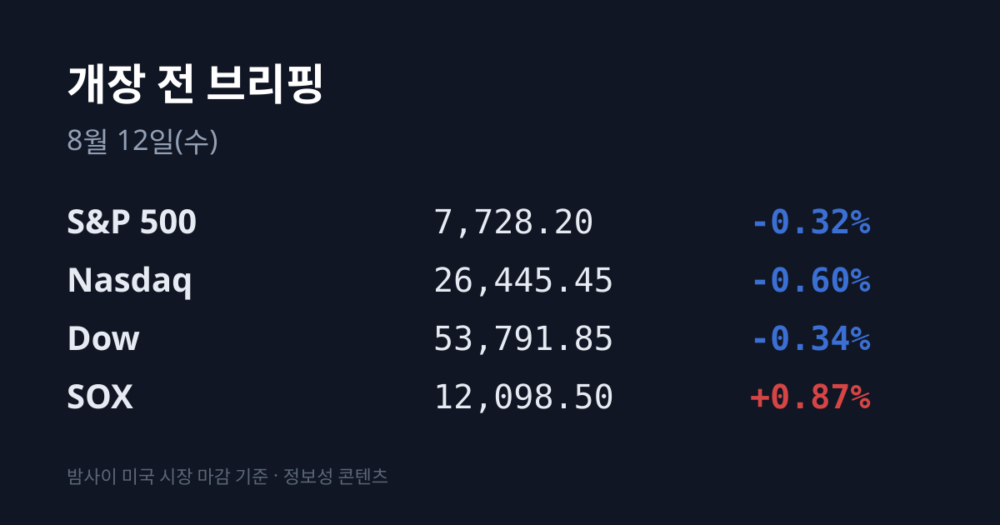
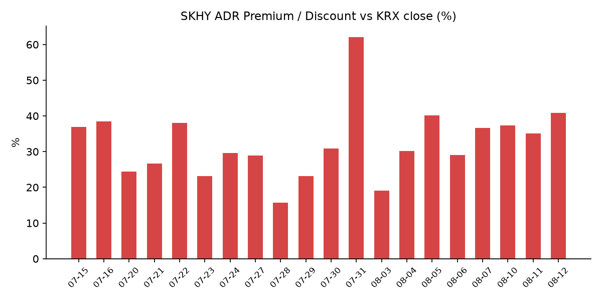
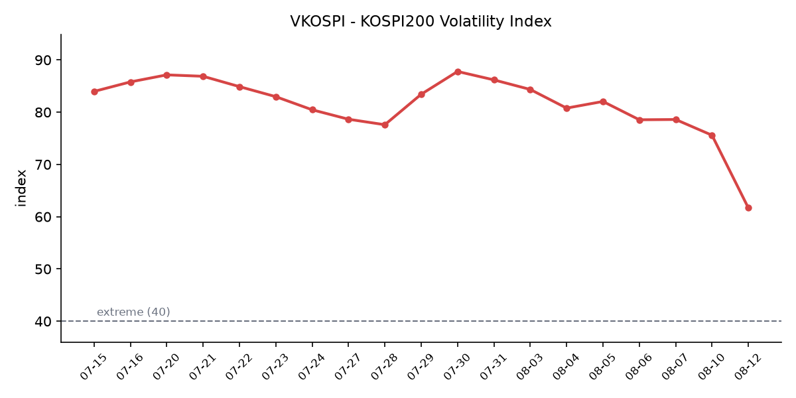

## ① 30초 요약

- 미 정규장이 끝난 뒤 <mark>코어위브와 슈퍼마이크로컴퓨터가 둘 다 컨센서스를 상회했고 시간외에서 각각 8~14%, 8% 올랐다</mark>. 특히 **SMCI의 1분기 매출 가이던스는 145~155억 달러**로, 컨센서스 **116억8,000만 달러를 24~33% 상회**했다.
- 미 3대 지수는 또 내렸다. **S&P 500 7,728.20(−0.32%)**, **나스닥 26,445.45(−0.60%)**, **다우 53,791.85(−0.34%)**. 그런데 지수를 누른 것은 반도체가 아니라 대형 기술주였다 — **알파벳 −3.8%**, 애플·아마존 약세다. **SOX는 12,098.5로 0.87% 올랐고**, **러셀2000(+0.45%)** 은 주요 지수 중 유일하게 상승했다.
- 어제 한국장은 **8월 1~10일 반도체 수출 +155.4%** 가 방향을 정했다. 총수출 **213억 달러(+45.3%)**, 반도체 **99억5,200만 달러**로 8월 같은 기간 기준 역대 최대다. **삼성전자가 4.13% 올라 239,500원**에 마감했고, **코스피는 6,345.53(+0.73%)** 으로 4거래일 만에 6,300선을 회복했다.
- SK하이닉스 ADR은 **$141.65(+4.70%)** 로 마감해 <mark>괴리율이 +40.8%로 이번 국면 신고점</mark>을 찍었다. 같은 날 SOX가 +0.87%였으니 **섹터를 3.83%p 상회**한 것이고, **본주는 +0.35%(1,425,000원)** 에 그쳤다.
- **VKOSPI는 61.68(−7.87, −11.32%)** 로 이틀 연속 큰 폭으로 내렸다. **07/29 장중 고점 93.27 대비 −33.9%** 다. 오늘 밤 **21:30 KST에 미국 7월 소비자물가지수(CPI)** 가 발표된다.

## ② 밤사이 미국 시장

| 지수 | 종가 | 등락률 |
| :--- | ---: | ---: |
| S&P 500 | 7,728.20 | −0.32% |
| 나스닥 종합 | 26,445.45 | −0.60% |
| 다우존스 | 53,791.85 | −0.34% |
| 필라델피아 반도체(SOX) | 12,098.5 | **+0.87%** |

**지수는 내렸는데 반도체는 올랐다.** 이틀 전과 정확히 반대 구조다. 08/10에는 지수가 −0.1%대에 그친 날 SOX만 −2.94%로 따로 빠졌는데, 어젯밤에는 <mark>지수가 −0.3~0.6% 내린 날 SOX만 +0.87%로 따로 올랐다</mark>. 여기에 소형주 지수인 **러셀2000이 +0.45%로 주요 지수 중 유일하게 상승**했다.

지수를 끌어내린 것은 대형 기술주였다. **알파벳이 3.8% 하락**했는데, 지난주 인공지능 조직 개편 발표 이후 **5거래일 중 4일을 내린 흐름**이다. 알파벳은 앞서 2026년 연간 설비투자 가이던스를 1,800억~1,900억 달러에서 **1,950억~2,050억 달러로 상향**했고 2분기 잉여현금흐름이 마이너스 59억 달러를 기록한 바 있으며, 반독점 판결 이후 구조적 개선 조치가 검토되고 있다는 점이 배경으로 거론된다. **애플도 1% 넘게 내렸고 아마존이 약세**였다.

매크로는 오히려 조용했다. **미 10년물 국채금리는 4.690%로 0.8bp 내렸다** — 장중에는 4.736%까지 올랐다가 되밀렸고, 하루 레인지는 4.666~4.736%였다. **VIX도 15.28로 1.16% 하락**했다. 유가는 방향이 달랐다. **브렌트유가 2주 만에 배럴당 90달러를 터치한 뒤 되밀렸고**, **WTI는 1.8% 올라 83.62달러**를 기록했다. 이란 최고국가안보회의 서기가 **"우리 조건이 충족되기 전에는 호르무즈 해협을 재개방하지 않는다"** 고 재확인했고, 이란은 미국과의 직접 협상 자체를 거부하고 있으며 전쟁 배상금 문제로 양측 주장이 정면 충돌했다. 유가는 올랐지만 금리와 변동성은 따라 오르지 않았다는 점이 전날과 달라진 부분이다.

**그리고 정규장이 끝난 뒤 이 시장의 가장 큰 뉴스가 나왔다.** 직전 브리핑이 "미 장마감 후 실적"으로 예고했던 두 회사의 결과다.

**코어위브(CRWV)** 는 2분기 매출 **25억8,000만 달러**를 기록해 컨센서스 25억6,000만 달러를 넘겼다. **전년 동기 대비 112.5% 증가**한 수치다. 조정 주당손실은 **1.03달러**로 컨센서스(1.22달러 손실)보다 적었고, **조정 영업이익률은 5%로 컨센서스 2.7%를 상회**했다. 무엇보다 <mark>수주잔고가 1,040억 달러이며, 여기에 3분기 신규 계약 250억 달러가 별도로 잡혀 있다</mark>고 밝혔다. 2026년 가이던스도 매출 **124억~132억 달러**(기존 120억~130억 달러), 조정 영업이익 **9억6,000만~11억5,000만 달러**로 올렸다. **시간외에서 8~14% 상승**했다.

**슈퍼마이크로컴퓨터(SMCI)** 는 4분기 조정 주당순이익 **1.70달러**로 컨센서스 1.59달러를 넘겼고, **수주잔고 600억 달러 초과**, 총이익률 가이던스 **15~17%** 를 제시했다. 가장 큰 폭의 상회는 다음 분기 전망에서 나왔다 — **1분기 조정 EPS 가이던스 1.01~1.10달러**(컨센서스 0.76달러), **매출 가이던스 145억~155억 달러**(컨센서스 116억8,000만 달러)다. **시간외에서 8% 이상 올랐다.**

이 두 실적이 시장에서 주목받은 맥락이 있다. 08/10에 엔비디아가 2.86% 하락한 직접적 계기는 **아폴로·블랙스톤·GIP·브룩필드·골드만삭스·KKR 컨소시엄이 참여하는 5,000억 달러 규모 AI 인프라 자금조달 패키지 보도**였고, 시장에서는 이를 **'순환 거래(circular deal)' 우려**로 읽는다는 해석이 나왔다. 칩을 파는 기업이 그 칩을 살 자금까지 함께 주선하는 구조에 대한 문제 제기다. 어젯밤 실적을 발표한 두 회사는 바로 그 구조의 수요 측에 있는 기업들이며, 매출과 수주잔고 수치를 제시했다.

## ③ 괴리율 트래커 — SK하이닉스 ADR

| 항목 | 수치 |
| :--- | :--- |
| SKHY 종가 | $141.65 (+4.70%) |
| 본주 환산가 (×10×환율 1,416.0원) | 2,005,764원 |
| 본주 직전 종가 | 1,425,000원 |
| **괴리율** | **+40.8%** |

전일 **+35.1%** 에서 **5.7%p** 확대됐다. <mark>이번 국면 신고점이다</mark> — 종전 최고는 08/05의 **+40.2%**, 그 이전은 07/16의 **+38.5%** 였고(07/31의 +62.0%는 상한가 직후 왜곡), 평균대는 **+29%** 구간이다.

확대의 경로가 이례적이다. **원·달러가 2.4원 내려 환산가를 낮추는 방향**이었는데도 괴리가 벌어졌다. 순수하게 주가 차이에서 나온 결과라는 뜻이다 — **ADR +4.70% vs 본주 +0.35%로 4.35%p** 차이가 났다. SKHY는 07/29 126.79달러(사상 최저)에서 08/04 154.38달러(국면 최고)까지 올랐다가 08/10 135.29달러로 밀렸고, 어제 141.65달러로 회복해 **국면 최고 대비 8.2% 낮은 수준**이다.

**섹터 대비 상대 성과가 사흘 만에 세 번째로 방향을 바꿨다.** 08/07에는 **SOX가 +2.56% 오른 날 SKHY가 −3.92%로 섹터를 6.5%p 하회**했다. 08/10에는 **SOX −2.94%인 날 SKHY −1.90%로 섹터를 1.0%p 상회**했다. 그리고 어제는 **SOX +0.87%인 날 SKHY +4.70%로 섹터를 3.83%p 상회**했다. "미국 시장이 이 종목만 따로 떼어 팔았다"던 08/07의 패턴은 현재 데이터에서 확인되지 않는다.

괴리율의 구조는 이렇다. ADR 프리미엄(+)은 미국에서 거래되는 가격이 본주보다 높다는 뜻이고, 전환 차익거래 구조상 본주 쪽에 매수 유인이 생기는 방향으로 작동한다. 디스카운트(−)면 반대다. 다만 이 프리미엄이 즉시 무위험 차익으로 실현되지는 않는다. **ADR→본주 전환 한도가 1,779만주(발행주식의 2.5%)** 로 제한돼 있고 **전환 절차에 수 주 이상**이 걸리기 때문이다. 그래서 이 지표는 차익거래 기회라기보다 **한·미 두 시장이 같은 자산에 매기는 값의 격차를 보여주는 계기판**에 가깝다.

수렴은 양방향으로 일어난다는 점도 함께 봐야 한다. 직전 사례를 보면 **08/05에 +40.2%를 기록한 다음 날 괴리는 +29.0%로 11.2%p 압축**됐는데, 그때의 경로는 본주 상승이 아니라 **ADR 하락(−5.0%)** 이었다.

## ④ 변동성 트래커 🌡️

**판정 한 줄**: <mark>'극단' 유지, 방향은 진정이며 속도가 빨라졌다</mark> — **VKOSPI가 이틀 만에 69.55에서 61.68로 내렸고**, 같은 기간 **코스피와 코스닥의 하루 등락률 차이도 6.32%p에서 0.34%p로 좁혀졌다**.

**기대 변동성** — **VKOSPI 61.68(−7.87, −11.32%)**, 장중 저점 61.68. 기준 40의 약 **1.54배**로 **'극단'(40 이상)** 구간이다. 추이는 07/30 87.79 → 07/31 86.18 → 08/03 84.35 → 08/04 80.78 → 08/05 82.05 → 08/06 78.6 → 08/07 75.59 → 08/10 69.55 → **08/11 61.68**이다. **07/29 장중 고점 93.27 대비 −33.9%**, **07/30 대비 −29.7%** 다. 최근 이틀 하락률이 각각 −7.99%, **−11.32%로 진정 속도가 빨라졌다**. 같은 날 미국 **VIX는 15.28(−1.16%)** 로, 한·미 격차는 **5.1배 → 4.5배 → 4.0배**로 사흘 연속 좁혀졌다.

**실현 변동성** — 최근 7거래일 코스피 종가 등락률은 08/03 −5.12% → 08/04 +1.62% → 08/05 +3.76% → 08/06 −4.58% → 08/07 −0.60% → 08/10 +0.65% → **08/11 +0.73%** 다. **±3.5% 이상은 3일**이며, 모두 08/06 이전이다. **사흘 연속 코스피 등락률이 ±1% 안에 들어왔다.** 코스닥은 08/10 +6.97%에서 **08/11 +0.39%** 로 급격히 잦아들었다.

**매매 정지** — 최근 이력은 07/31 코스피·코스닥 동반 매수 → 08/03 코스닥 매수 → 08/04 코스닥 매수 → 08/05 코스피 매수 → 08/06 10:18 코스피 매도 → **08/10 09:50 코스닥 매수**(연중 31번째, 매수 방향 18번째)다. **8월 들어 거래일의 절반에서 매수 사이드카가 발동**했다는 집계가 별도로 확인된다. **최근 6회 중 5회가 매수 방향**이다. 08/11 발동 여부는 집계 시점 기준 미확인이다.

**증폭 경로** — 단일종목 레버리지 규제 시행 이후 **해당 상품의 일 거래대금이 10조원 안팎 급감했고, 같은 기간 코스닥 거래대금은 4조원대에서 7조원대로 늘었다.** 규제 내용은 **기본예탁금 1,000만원 → 3,000만원(07/31 시행)**, **매도대금 현금 인정 T일 → T+2일**, **신규 상품 출시 중단**이며, 8월 중 **개인별 총량규제**와 **괴리율 관리의무 3%→2% 강화**가 예정돼 있다. 08/11 단일일 거래대금은 미확인이다.

**청산 압력** — **신용거래융자 잔고 28조9,349억원(07/31 기준)** 으로, 올해 1월 28일 이후 처음 30조원을 하회했고 **6월 24일 역대 최고 38조6,328억원 대비 약 10조원 감소**했다. 반대매매 비중(위탁매매 미수금 대비) 월평균은 **6월 3.52% → 7월(29일까지) 3.17%** 다. **08/03~08/11 일별 확정 집계는 이레째 미확인**이며, 코스닥이 8거래일 만에 32.5% 오른 구간에서 신용이 다시 늘었는지는 이 데이터가 나와야 확인된다.

**하방 포지션** — 코스피 공매도 순잔고 최신치는 이번에도 확보되지 않았다. **공시가 T+3 지연되는 구조**라 08/06~08/11 구간은 아직 집계 전이다. 제도는 **2026-03-31 차입공매도 전 종목 전면 재개** 상태가 유지되고 있다.

*미확인 항목: 코스피200 야간선물, 현재 시점 미 지수선물, 08/03~08/11 신용융자·반대매매 일별 집계, 공매도 순잔고, 프로그램 매매, 선물 베이시스, 08/11 사이드카 발동 여부, 08/11 레버리지 ETF 거래대금, 달러인덱스·금·구리 08/11 종가.*

## ⑤ 어제 한국장 리뷰

| 지수 | 종가 | 등락 |
| :--- | ---: | ---: |
| 코스피 | 6,345.53 | +45.87 (+0.73%) |
| 코스닥 | 857.84 | +3.37 (+0.39%) |
| 원/달러 (주간거래) | 1,416.0원 | −2.4원 |

**코스피가 08/05 이후 4거래일 만에 6,300선을 회복했다.** 장 초반에는 중동 협상 불확실성으로 약세 출발했지만, 오전에 발표된 수출 데이터가 방향을 바꿨다.

<mark>관세청 집계 기준 8월 1~10일 수출액은 213억 달러로 전년 동기 대비 45.3% 늘어 8월 같은 기간 기준 역대 최고</mark>였다. 이 가운데 **반도체가 99억5,200만 달러로 155.4% 급증**했고, **전체 수출에서 반도체가 차지하는 비중은 46.8%로 1년 전보다 20.1%p 높아졌다**. 지역별로는 **대중국 수출이 67억4,600만 달러로 134.8%**, **홍콩이 259.4%**, 베트남 45.4%, EU 57.2% 증가했다. 품목별로는 석유제품 19억9,700만 달러(+65.3%), 컴퓨터 주변기기 5억8,700만 달러(+139.5%)였다.

**어제 실제 수급은 두 시장에서 정반대였다.** 코스피에서는 **외국인이 2,189억원 순매수**(4거래일 만의 순매수 전환), **기관이 1,878억원 순매수**, **개인이 3,692억원 순매도**했다. 코스닥에서는 반대로 **외국인이 4,829억원, 기관이 978억원 순매도**했고 **개인이 5,590억원을 순매수**했다. 하루 전인 08/10에는 코스피 외국인 −1조4,887억원 / 코스닥 외국인 +1,031억원으로, **이틀 연속 외국인의 방향이 통째로 뒤집힌 셈**이다.

수급의 집중도도 함께 볼 필요가 있다. **외국인은 삼성전자 한 종목을 5,841억원 순매수**했는데, 같은 날 코스피 전체 외국인 순매수는 2,189억원이었다. 종목 단위 매수 규모가 시장 전체 순매수의 2.7배였다는 뜻이다.

**시총 상위 종목**은 **삼성전자 239,500원(+4.13%)**, **SK하이닉스 1,425,000원(+0.35%)** 으로 마감했다. 반도체 소부장이 대형주보다 강했다 — **주성엔지니어링 +12.15%**, **원익IPS +6.4%**, 이오테크닉스 +3.22%, 리노공업 +1.12%다. 업종별로는 제약 +3.0%, IT서비스 +2.7%, 보험 +2.5%, 의료정밀 +2.3%로 상승이 넓었고, **전날 급등했던 바이오·이차전지에서는 차익실현이 나왔다**.

코스닥과 관련해 한 가지 사실이 추가로 확인됐다. 08/10에 알테오젠이 14.10% 급등한 배경에는 2분기 실적 개선과 함께 <mark>블랙록 펀드 어드바이저스가 알테오젠 주식 269만4,448주(지분율 5.03%)를 신규 취득했다는 대량보유 공시</mark>가 있었다. 보유 목적은 **단순투자**, 취득 방법은 장내 매수이며 보고기준일은 07/31이다. 알테오젠은 **코스피 이전을 철회하고 코스닥에 잔류**하기로 했고, **08/26 무상증자 신주 상장**이 예정돼 있다.

역내 증시는 방향이 갈렸다. **일본은 산의 날 휴장**이었고, **상해종합 3,934.09(−0.81%)**, **항셍 25,669.80(−1.03%)**, **대만 자취안 45,120.72(+0.43%)** 였다. 상해와 항셍이 1% 가까이 내린 날 **코스피가 역내 최상위권에서 마감**한 셈이다.

## ⑥ 오늘의 캘린더 & 관전 포인트

**오늘(08/12)**
- **21:30 KST — 미국 7월 소비자물가지수(CPI)**. 컨센서스는 헤드라인 **전월 대비 +0.1% · 전년 대비 3.4%**(6월 3.5%), 코어 **전월 대비 +0.2% · 전년 대비 2.5%** 다. 현 연방기금금리는 **3.50~3.75%** 구간이며 직전 FOMC에서 투표권을 가진 12명 중 3명이 인상을 선호했다. 브렌트유가 배럴당 90달러를 터치한 직후 발표되는 물가 지표다.
- **미 장마감 후 — 시스코(CSCO) 실적**
- **호르무즈 후속 메시지** — 이란의 직접 협상 거부 이후 양측 발언

**이번 주 이후**
- **08/13(목)** — 미국 7월 생산자물가지수(PPI) · **한국 옵션만기일** · 한국은행 금통위 · **어플라이드머티어리얼즈(AMAT) 실적**
- **08/14(금)** — 미국 7월 소매판매
- **08/21** — 미 상원이 애플에 요구한 CXMT·YMTC 미사용 확약 시한
- **08/26** — 미국 7월 PCE 물가 · **엔비디아 실적** · 알테오젠 무상증자 신주 상장
- **08/27** — 한국은행 금통위(경제전망) · 잭슨홀
- **09/15~16** — FOMC
- **8월 중** — 단일종목 레버리지 개인별 총량규제·괴리율 관리의무 3%→2%, 해치텍 등 코스닥 8개사 상장 절차, 8월 1~20일 수출 잠정치

**시장이 주시하는 레벨**
- **미 7월 CPI 전년 대비 3.4%** — 컨센서스 라인이며, 상회·하회 여부가 9월 금리 결정 논의의 기준점으로 거론된다
- **브렌트유 배럴당 90달러** — 어제 장중 터치 후 되밀린 자리
- **미 10년물 4.75%** — 어제 장중 4.736%까지 상승했다가 4.690%로 마감
- **원/달러 1,410원** — 08/10에 하향 돌파에 실패한 자리이며, 어제는 1,416.0원으로 마감
- **코스닥 850선** — 어제 857.84로 유지
- **SK하이닉스 ADR 괴리율 +40.8%** — 이번 국면 신고점이며, 종전 최고는 08/05의 +40.2%
- **VKOSPI 70** — 어제 61.68로 내려온 뒤의 상단 참고선

## ⑦ 정책 워치

- **공매도**: 2026-03-31 차입공매도 전 종목 전면 재개 상태가 유지되고 있으며, 이번 확인에서 **제도 변경 사항은 없었다**. 무차입 공매도는 계속 금지이고, 2026년 중 **공매도 전산화 전면 의무화**가 진행되고 있다.
- **단일종목 레버리지 ETF 규제**: 07/31 시행분(기본예탁금 3,000만원, 매도대금 현금 인정 T+2일, 신규 상품 출시 중단)에 이어 **8월 중 개인별 총량규제와 괴리율 관리의무 3%→2% 강화**가 예정돼 있다.
- **코스닥**: 알테오젠이 **코스피 이전을 철회**하고 코스닥에 잔류하기로 했다. 코스닥 승강제 도입도 진행 중이다.
- **'한국판 IRA'**: 2026 세제개편안의 국내생산세액공제가 **태양광·풍력·이차전지·반도체·핵심소재·AI로봇부품 6개 분야**를 대상으로 하며, 설비투자 세액공제에서 **생산·판매 물량에 비례한 법인세·소득세 직접 공제**로 전환된다.

## ⑧ 오늘의 질문

오늘 밤 미국 7월 CPI를 앞두고, <mark>ADR은 4.70% 오르고 본주는 0.35%에 그치며 국면 신고점(+40.8%)까지 벌어진 SK하이닉스의 한·미 괴리는 어느 쪽 가격이 움직여 좁혀질 것인가</mark>.

---
*본 글은 공개된 시장 데이터를 정리한 정보성 콘텐츠이며, 특정 종목·상품의 매매 권유가 아닙니다. 모든 투자 판단과 책임은 투자자 본인에게 있습니다. 수치는 작성 시점 기준이며 이후 변동될 수 있습니다.*
