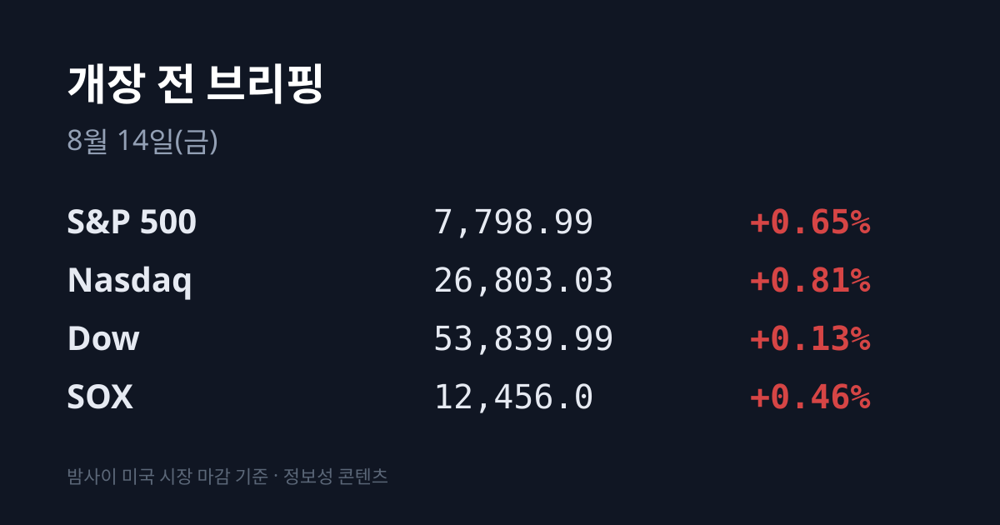
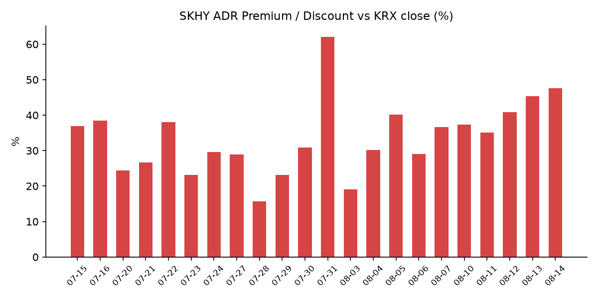
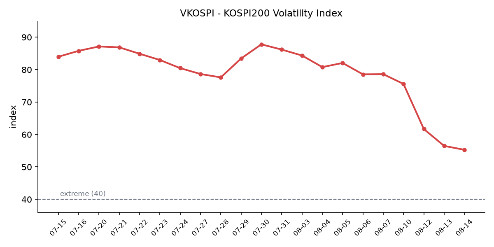

## ① 30초 요약

- **미 7월 PPI가 컨센서스를 하회**했습니다 — 전월비 <mark>0.0%</mark>(컨센 +0.2%), 전년비 4.7%(컨센 4.9%, 6월 5.5%), 코어 전월비 +0.2%였습니다.
- <mark>S&P 500이 7,798.99로 사상 최고 종가</mark>를 경신하며 장중 7,800선을 처음 넘었습니다. 나스닥 26,803.03(+0.81%) · 다우 53,839.99(+0.13%)였습니다.
- 다만 **필라델피아 반도체 지수는 +0.46%** 로 전일(+2.49%)의 5분의 1에 그쳤고, **엔비디아도 +0.54%** 였습니다.
- 대신 <mark>메모리·스토리지만 따로 급등</mark>했습니다 — 샌디스크 **+15.2%**, 웨스턴디지털 +8.42%, SK하이닉스 ADR +7.29%, 시게이트 +4.91%, 마이크론 +4.89%였습니다. 촉매는 샌디스크 인베스터데이였습니다.
- 어제 코스피는 **6,813.34(+3.56%)** 로 15거래일 만에 6,800선을 회복했고, 외국인이 2조1,187억원을 순매수하며 이달 첫 3거래일 연속 순매수를 기록했습니다.
- <mark>SK하이닉스 ADR 괴리율 +47.6%</mark> — 사흘 연속 이번 국면 신고점입니다.

## ② 밤사이 미국 시장

| 지수 | 종가 | 등락률 |
| :--- | ---: | ---: |
| S&P 500 | 7,798.99 | +0.65% |
| 나스닥 | 26,803.03 | +0.81% |
| 다우 | 53,839.99 | +0.13% |
| 필라델피아 반도체(SOX) | 12,456.0 | +0.46% |

미국 노동통계국이 발표한 7월 생산자물가지수는 전월 대비 0.0%로 시장 예상치 +0.2%를 밑돌았습니다. 전년 대비로는 4.7%로 6월 5.5%에서 둔화했고 예상치 4.9%도 하회했습니다. 코어 PPI는 전월 대비 +0.2%였습니다. 전날 소비자물가지수가 컨센서스에 부합한 데 이어 이틀 연속 물가 지표가 시장 예상을 웃돌지 않으면서, 9월 연방공개시장위원회에서 금리가 동결될 것이라는 관측에 힘이 실렸다는 해석이 나왔습니다. **미 10년물 금리는 4.65%로 5bp 내렸고**, S&P 500지수는 50.49포인트(+0.65%) 오른 7,798.99에 마감하며 종가 기준 사상 최고치를 기록했습니다. 장중에는 7,800선을 처음 넘어섰습니다. VIX는 14.63(+0.55%)으로 전날 7개월 최저에서 소폭 반등했습니다. CME FedWatch 기준 9월 인상 확률은 CPI 발표 직후 42%(동결 58%)까지 확인됐고, PPI 발표 이후 갱신치는 집계 시점 기준 미확인입니다.

지수와 반도체 지수의 방향이 갈렸다는 점이 어제 미국장의 특징입니다. 필라델피아 반도체 지수는 12,456.0으로 +0.46% 오르는 데 그쳐 전일 +2.49%의 5분의 1 수준이었고, **엔비디아는 +0.54%** 로 사실상 멈췄습니다. 대신 지수 안에서 메모리·스토리지만 따로 움직였습니다. <mark>샌디스크 +15.2%</mark>, 웨스턴디지털 +8.42%(약 492.04달러), SK하이닉스 ADR +7.29%, 시게이트 +4.91%(921.37달러), 마이크론 +4.89%(955.89달러)였습니다. 빅테크는 테슬라 +3.80%, 메타 +2.78%, 애플 +1.00%, 마이크로소프트 +0.90%였습니다.

촉매는 8월 13일 열린 **샌디스크 인베스터데이**였습니다. CFO Luis Visoso는 NAND 시장이 2026년 3,000억 달러를 넘고 2027년 5,000억 달러에 이르며 공급은 2028년까지 타이트하다고 제시했습니다. FY2028~2030 장기 재무 모델로는 매출이 비트 성장에 맞춰 mid-to-high teens 비율로 늘고, 조정 총이익률 약 80%·조정 영업이익률 약 75%를 유지한다는 목표를 내놨습니다. 근거로 제시된 수치는 FY26 4분기 데이터센터 매출 29.8억 달러(전년 대비 +645%), 출하 비트 중 데이터센터 비중이 1년 만에 약 12%에서 약 38%로 상승, 6개 고객과 맺은 8건의 장기계약 최소 약정 규모 약 939억 달러였습니다.

정규장 마감 후에는 어플라이드머티어리얼즈가 FY26 3분기 실적을 발표했습니다. 매출 91.2억 달러(전년 대비 +25%)로 분기 사상 최대였고, 비GAAP 주당순이익 3.50달러(+41%), GAAP 주당순이익 3.17달러(+43%), GAAP 총이익률 50.3%, 영업이익 30.8억 달러(마진 33.7%)였습니다. 영업현금흐름 30.4억 달러, 비GAAP 잉여현금흐름 23.3억 달러도 3분기 기준 최대였습니다. <mark>4분기 가이던스는 매출 약 102.5억 달러(±5억 달러)로 컨센서스 95.4억 달러를 크게 웃돌았고</mark>, 비GAAP 주당순이익은 4.02달러(±0.20달러)로 제시됐습니다. 회사는 수요를 "전례 없다(unprecedented)"고 표현했습니다. 다만 **시간외 주가는 하락**했습니다. 낙폭은 매체별로 −3.89%와 −5.22%로 보도가 갈려 집계 시점 기준 확정되지 않았으며, 3분기 매출이 일부 컨센서스를 소폭 하회했다는 점과 주가가 이미 큰 폭으로 올라 있었다는 점이 배경으로 지목됐습니다.

원자재는 크게 내렸습니다. **브렌트유(10월물) 87.07달러(−2.15%)**, WTI(9월물) 81.25달러(−2.43%)입니다. 국제에너지기구가 8월 월간보고서에서 올해 세계 석유 수요가 하루 160만 배럴 감소할 것으로 전망했고, OPEC도 2026년 수요 증가 전망을 하루 78만 배럴에서 58만 배럴로 낮췄습니다. 두 기관 모두 호르무즈 해협 봉쇄 장기화의 영향을 전망에 반영했다고 밝혔습니다. 여기에 미국 상업용 원유재고가 8월 7일 주간에 1,740만 배럴 늘어 4억2,440만 배럴이 된 점도 함께 작용했습니다. 금 현물은 8월 13일 장중 4,401달러 수준이었고 종가는 집계 시점 기준 미확인입니다. 달러/엔은 159.52였습니다.

## ③ 괴리율 트래커 — SK하이닉스 ADR

| 항목 | 수치 |
| :--- | ---: |
| SKHY 종가 | $165.67 (+7.29%) |
| 본주 환산가 (×10×환율) | 2,351,520원 |
| 본주 직전 종가 | 1,593,000원 |
| **괴리율** | **+47.6%** |

SKHY는 8월 13일 뉴욕장에서 11.26달러 오른 165.67달러에 마감했습니다. 전날 기록한 이번 국면 최고 종가 154.41달러를 이틀 연속 경신한 수치이고, 7월 29일 저점 126.79달러 대비로는 **+30.7%** 입니다. 같은 날 필라델피아 반도체 지수는 +0.46%였으므로 SKHY가 섹터를 **6.83%p 상회**했습니다. 섹터 대비 상회 폭은 8월 10일 1.0%p, 8월 11일 3.83%p, 8월 12일 6.52%p, 8월 13일 6.83%p로 나흘 연속 커졌습니다. 특히 어제는 섹터가 사실상 멈춘 날에 이 종목만 7.29% 올랐습니다.

사흘치를 붙여 보면 같은 구조가 반복되고 있습니다. 8월 11일에는 본주 +0.35%에 ADR +4.70%, 8월 12일에는 본주 +5.54%에 ADR +9.01%, 8월 13일에는 본주 **+5.92%** 에 ADR +7.29%였습니다. 본주가 얼마를 오르든 ADR이 더 올랐습니다. 다만 괴리 확대 폭은 +4.5%p에서 +2.3%p로 절반이 됐고, 한국의 추격 속도는 미국의 61%에서 81%로 개선됐습니다. 어제는 환율 요인도 섞였습니다. 원·달러가 1,415.7원에서 1,419.4원으로 3.7원 오르며 환산가를 약 6,100원 밀어올렸는데, 괴리율로 환산하면 약 0.4%p에 해당합니다. 즉 +2.3%p 확대 중 약 0.4%p는 환율, 약 1.9%p는 ADR과 본주의 가격차입니다.

괴리율의 의미는 구조에서 나옵니다. ADR과 본주는 원칙적으로 같은 회사의 같은 지분이므로, 환산가가 본주보다 높은 프리미엄 상태에서는 전환 차익거래 구조상 본주 쪽에 매수 유인이, 낮은 디스카운트 상태에서는 매도 유인이 생깁니다. 다만 SK하이닉스 ADR의 본주 전환 한도는 1,779만주(발행주식의 2.5%)이고 전환 절차에 수 주 이상이 걸리므로, 괴리가 즉시 무위험 차익으로 실현되는 구조는 아닙니다. 또한 수렴은 본주 상승으로도 ADR 하락으로도 일어납니다. 8월 5일 +40.2%를 기록한 다음 날인 8월 6일에는 ADR이 −5.0% 내리며 +29.0%로 11.2%p 압축된 사례가 있었습니다. 현재 수치는 평균대인 +29% 대비 18.6%p 위입니다.

괴리율 추이(브리핑 발행일 기준): 07/24 +29.6 → 07/27 +28.9 → 07/28 +15.7 → 07/29 +23.1 → 07/30 +30.9 → 07/31 +62.0 → 08/03 +19.1 → 08/04 +30.2 → 08/05 +40.2 → 08/06 +29.0 → 08/07 +36.7 → 08/10 +37.3 → 08/11 +35.1 → 08/12 +40.8 → 08/13 +45.3 → 08/14 +47.6

## ④ 변동성 트래커

**판정 한 줄**: <mark>'극단' 유지, 그런데 진정이 멈췄다</mark> — VKOSPI 하락률이 사흘간 −8~11%에서 어제 −2.12%로 4분의 1이 됐고, 같은 날 코스피는 +3.56% 오르며 이틀 연속 사이드카가 발동했습니다.

**기대 변동성** — VKOSPI **55.28**(전일 대비 −1.20p, −2.12%)로 기준 40의 약 1.38배입니다. 40 이상은 '극단' 구간이므로 레짐은 유지됩니다. 추이는 07/30 87.79 → 07/31 86.18 → 08/03 84.35 → 08/04 80.78 → 08/05 82.05 → 08/06 78.6 → 08/07 75.59 → 08/10 69.55 → 08/11 61.68 → 08/12 56.48 → 08/13 55.28입니다. 7월 29일 장중 고점 93.27 대비 −40.7%입니다. 최근 4거래일 하락률은 −7.99%, −11.32%, −8.43%, **−2.12%** 로, 지수가 3.56% 오른 날 기대 변동성은 거의 내리지 않았습니다. 같은 날 미국 VIX는 14.63(+0.55%)으로 전날 7개월 최저에서 반등해, 한·미 격차는 3.9배에서 3.8배로 사실상 정체했습니다.

**실현 변동성** — 최근 9거래일 코스피 일별 등락률은 08/03 −5.12% → 08/04 +1.62% → 08/05 +3.76% → 08/06 −4.58% → 08/07 −0.60% → 08/10 +0.65% → 08/11 +0.73% → 08/12 +3.68% → 08/13 **+3.56%** 입니다. 이틀 연속 +3% 이상 오른 것은 이번 국면에서 처음이며, 최근 10거래일 중 ±3% 이상 등락일은 5일입니다. 코스닥은 반대로 +0.29%에 그쳐 두 지수의 하루 등락률 차이가 08/12 3.56%p, 08/13 3.27%p로 이틀 연속 3%p 이상 벌어졌습니다.

**매매 정지** — 8월 13일 코스피 매수 사이드카가 발동했습니다. 코스피200 선물이 급등해 발동 요건을 충족하면서 프로그램 매수호가 효력이 5분간 정지됐습니다. 발동 시각은 집계 시점 기준 미확인입니다. 최근 이력은 07/31 코스피·코스닥 동반 매수 → 08/03 코스닥 매수 → 08/04 코스닥 매수 → 08/05 코스피 매수 → 08/06 코스피 매도 → 08/10 코스닥 매수 → 08/12 코스피 매수 → 08/13 코스피 매수로, **최근 8회 중 7회가 '매수' 방향**이며 이틀 연속 발동입니다.

**증폭 경로** — 단일종목 레버리지 ETF 일 거래대금은 직전 확인치 기준 8,500억원으로, 규제 시행 전날인 7월 30일 12조4,485억원 대비 −93.2%입니다. 8월 13일 갱신치는 집계 시점 기준 미확인입니다. 규제 내용은 기본예탁금 1,000만원 → 3,000만원(7월 31일 시행), 매도대금 현금 인정 T일 → T+2일, 신규 상품 출시 중단입니다. 개인 자금은 지수형 레버리지·인버스 상품으로 옮겨간 것으로 추정된다는 분석이 나왔습니다.

**청산 압력** — 신용거래융자 잔고는 7월 31일 기준 28조9,350억원으로, 6월 24일 역대 최고 약 38조6,000억원 대비 약 10조원 줄어든 상태입니다. 반대매매 비중 월평균은 6월 3.52%, 7월(29일까지) 3.17%였습니다. **8월 3일 이후의 일별 확정 집계는 9거래일째 집계 시점 기준 미확인**입니다.

**하방 포지션** — 8월 13일 공매도 거래대금과 순잔고는 공표 전으로 집계 시점 기준 미확인입니다. 직전 확정치인 8월 12일 기준으로는 총 1조9,236억원(전체 거래대금의 3.96%)이었고 전일 대비 5.9% 줄었으며, 코스피 1조5,627억원(−7.7%)·코스닥 3,609억원(+2.9%)으로 방향이 갈렸습니다. 금액 1위는 삼성전자 5,035억원이었고, 코스피 공매도 참여 구성에서 외국인 비중은 7.77%p 줄고 기관 비중은 7.61%p 늘었습니다. 코스피 공매도 순잔고는 T+3 공시 지연으로 8월 10일 이후 구간이 구조적으로 미확인입니다.

미확인 항목: 오늘 아침 시점 미 지수선물, 코스피200 야간선물, 8월 13일 공매도 거래대금·순잔고, 8월 3일 이후 신용융자·반대매매 일별 집계, 프로그램 매매·차익잔고·선물 베이시스, 미 2년물 금리, 달러인덱스, 구리, 달러/위안, 금 8월 13일 종가, 8월 13일 사이드카 발동 시각, DRAM/NAND 당일 현물가, PPI 발표 이후 FedWatch 갱신치.

## ⑤ 어제 한국장 리뷰

| 지수 | 종가 | 등락 |
| :--- | ---: | ---: |
| KOSPI | 6,813.34 | +234.30p (+3.56%) |
| KOSDAQ | 861.37 | +2.46p (+0.29%) |

코스피는 15거래일 만에 6,800선을 회복했고 4거래일 연속 상승했습니다. 전장 대비 2.96% 오른 6,773.92로 출발해 장중 6,895.63까지 올랐다가 6,813.34로 마감했습니다. 어제는 코스피200 선물·옵션 동시만기일이었습니다.

코스피 수급은 **외국인 +2조1,187억원, 기관 +6,809억원, 개인 −2조7,328억원**이었습니다. 외국인은 이달 들어 처음으로 3거래일 연속 순매수를 기록했고, 8월 12일 +2조8,357억원과 합치면 이틀 누적 4조9,544억원입니다. 개인은 이틀 누적 5조9,241억원을 순매도했습니다. 코스닥은 방향이 정반대였습니다 — <mark>개인 +2,654억원, 외국인 −1,258억원, 기관 −1,347억원</mark>으로 외국인과 기관이 함께 팔았습니다.

시가총액 상위 종목은 <mark>삼성전자 268,000원(+4.89%) · SK하이닉스 1,593,000원(+5.92%)</mark>으로 마감했습니다. SK하이닉스가 삼성전자를 1.03%p 앞선 것은 이틀 만에 처음이며, 이틀 누적 격차는 5.18%p에서 4.15%p로 좁혀졌습니다. 배경으로는 밤사이 미국 반도체 강세와 함께 **주주환원 발표 임박 관측**이 보도됐습니다. 시장에서 거론되는 규모는 삼성전자 100조~200조원, SK하이닉스 40조~60조원이며, SK하이닉스는 이르면 8월 말로 언급됐습니다. 배당보다 자사주 매입이 단기 수급에 더 크게 작용한다는 해석이 함께 나왔습니다.

어제 코스피에서 가장 많이 오른 시가총액 상위 종목은 반도체 투톱이 아니었습니다. **삼성전기가 1,503,000원(+12.58%)** 으로 신고가를 기록하며 10거래일 연속 상승했고, 8월 수익률은 31.6%입니다. 배경은 모건스탠리가 최선호주를 삼성전자에서 삼성전기로 교체한 것이고, 근거로는 AI 데이터센터 투자 확대에 따른 MLCC 가격 강세와 ABF 기판 수요 개선이 제시됐습니다. 목표주가는 256만원에서 262만원으로 올랐습니다. 이 밖에 SK스퀘어가 +9.08% 올랐습니다. 업종별로는 **전기·전자 +5.16%** 가 1위, **전기·가스 −5.25%** 가 최하위였습니다.

원·달러 환율은 주간거래 종가 기준 **1,419.4원으로 3.7원 올랐습니다**. 외국인이 코스피에서 2조1,187억원을 순매수한 날에 원화가 오히려 약해진 것입니다. 8월 12일에도 외국인 순매수 2조8,357억원에 환율은 0.3원 내리는 데 그쳤습니다. 이틀간 외국인이 4조9,544억원을 순매수하는 동안 원화는 순매수 이전보다 약해졌는데, 시장에서는 선물환으로 환헤지된 패시브·인덱스성 자금이라는 해석이 나옵니다. 같은 날 스팟 기준치로는 1,417.43(−0.04%)이 보도돼 주간거래 종가와 소폭 차이가 있었습니다.

아시아 증시는 코스피 +3.56%, 닛케이 68,308.59(+784.53p, +1.16%), 대만 자취안 46,021.48(+503.41p, +1.11%), 항셍 25,371.02(+0.27%), 상해종합 −0.5%였습니다. 코스닥 +0.29%는 이틀 연속 역내 최하위권이었습니다.

## ⑥ 오늘의 캘린더 & 관전 포인트

- **오늘 21:30 KST — 미 7월 소매판매.** 전월비 컨센서스는 **+0.4%**(전월 +0.2%), 자동차 제외 +0.4%, GDP 산출용 컨트롤그룹 +0.5%입니다. 예상대로면 4개월 연속 플러스로, 2022년 1~4월 이후 처음입니다.
- **오늘 23:00 KST — 미시간대 8월 소비자심리지수 예비치.** 7월 예비치는 54.4였습니다.
- **08/21** 미 상원이 애플에 요구한 CXMT·YMTC 미사용 확약 시한. **08/26** 미 7월 PCE 물가, 엔비디아 실적, 알테오젠 무상증자 신주 상장.
- **08/27(목)** 한국은행 금융통화위원회(통화정책방향 결정회의) 및 잭슨홀. 직전 7월 16일 회의에서 기준금리를 2.50%에서 **2.75%로 인상**했습니다.
- **09/15~16** FOMC. 현 연방기금금리는 3.50~3.75%입니다.
- **8월 말(수시)** SK하이닉스 주주환원 발표 관측(40조~60조원 규모 거론). 삼성전자 주주환원(100조~200조원 관측)은 시기 미정입니다.
- **8월 중** 단일종목 레버리지 개인별 총량규제·괴리율 관리의무 3%→2% 시행, 8월 1~20일 수출 잠정치, 8월 3~13일 신용융자·반대매매 집계 공표, 8월 13일 공매도 거래대금·순잔고 공표.

**시장이 주시하는 레벨**: SK하이닉스 ADR 괴리율 +47.6%(평균대 +29% 대비 18.6%p 위), 원·달러 1,420원, 미 10년물 4.75%, VKOSPI 60, 브렌트유 배럴당 90달러, 삼성전자와 SK하이닉스의 이틀 누적 등락률 격차 4.15%p, 코스피와 코스닥의 하루 등락률 격차 3.27%p입니다.

## ⑦ 정책 워치

공매도 제도는 2026년 3월 31일 차입공매도 전 종목 전면 재개 상태가 유지되고 있으며, 이번 리서치에서 제도 변경 사항은 확인되지 않았습니다. 무차입 공매도는 계속 금지이고, 2026년 중 공매도 전산화 전면 의무화가 진행 중입니다.

단일종목 레버리지 ETF 규제는 기본예탁금 1,000만원 → 3,000만원(7월 31일 시행), 매도대금 현금 인정 T일 → T+2일, 신규 상품 출시 중단이 시행됐고, 8월 중 개인별 총량규제와 괴리율 관리의무 3%→2% 강화가 예정돼 있습니다.

호르무즈 해협 관련해서는 8월 13일 기준 새로 확인된 동향이 없습니다. 이번 리서치에서 확보된 최신 보도는 8월 5~8일자로, 이란 외무부가 오만과 항로의 지리적 좌표에 합의했고 양국 공동성명이 최종 검토·초안 작성 단계에 있다는 내용입니다. 통행료를 두고 이란이 화물가치의 5~7%, 오만이 약 3%를 주장하며 대립 중이고 미국은 자유항행 원칙 훼손을 이유로 반대하고 있습니다. 다만 간접 신호는 하나 있습니다. **국제에너지기구와 OPEC이 8월 전망 보고서에서 호르무즈 해협 봉쇄 장기화를 명시적으로 반영**하면서 두 기관 모두 올해 석유 수요 전망을 낮췄습니다. 국제기구가 조기 해결을 기준 시나리오로 두지 않는 쪽으로 이동한 것입니다.

## ⑧ 오늘의 질문

밤사이 미국이 산 것이 'AI 전반'이 아니라 '메모리'였다면, 한국 시장은 그것을 두 종목의 재료로 읽을 것인가 시장 전체의 재료로 읽을 것인가.

---
*본 글은 공개된 시장 데이터를 정리한 정보성 콘텐츠이며, 특정 종목·상품의 매매 권유가 아닙니다. 모든 투자 판단과 책임은 투자자 본인에게 있습니다. 수치는 작성 시점 기준이며 이후 변동될 수 있습니다.*
