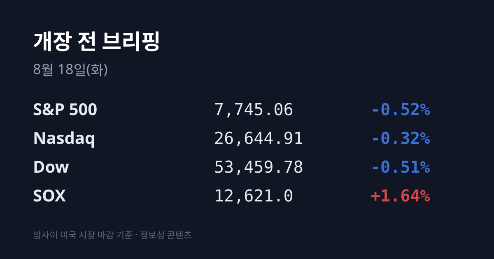
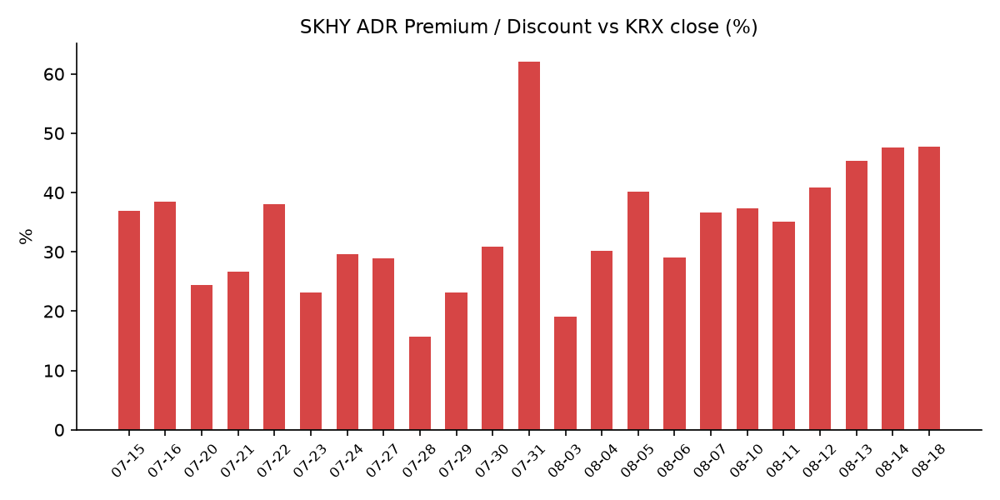
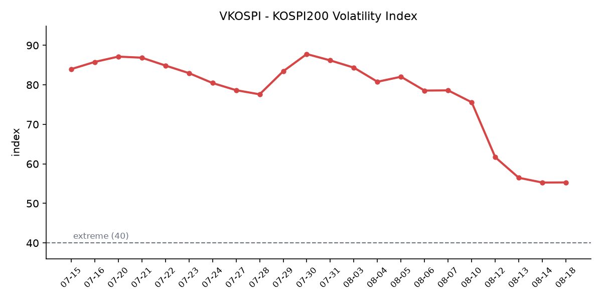

## ① 30초 요약

- 한국이 쉬는 동안 미국은 **08/14(금)·08/17(월) 2세션**이 지나갔습니다. <mark>지수와 반도체가 정반대로 갈렸습니다</mark> — S&P 500 **−0.69%**, 나스닥 −0.59%, 다우 −0.71%인데 **필라델피아 반도체 지수는 +1.32%** 였습니다(모두 한국 08/14 마감 기준 2세션 누적).
- <mark>미 7월 소매판매가 −0.6%</mark>로 컨센서스 +0.4%를 크게 밑돌았습니다. 2025년 5월 이후 최대 감소이고, 미시간대 8월 소비자심리 예비치도 **51.0**(7월 55.2)으로 급락했습니다.
- 08/17 미-이란 잠정 휴전 MOU가 만료되고 주말 호르무즈 통항이 사실상 멈추면서 <mark>브렌트유가 $91.34</mark>까지 올랐습니다(공백 누적 **+4.90%**).
- **미 30년물 금리가 5.31%로 2007년 6월 이후 최고**를 기록했습니다. 같은 날 2년물은 4.17%로 1bp 내렸습니다.
- 08/17 미국 반도체는 앤스로픽의 2분기 매출 급증 보도에 강세였고, 도쿄에서는 **키옥시아가 +15.07%** 올랐습니다.
- 08/14 코스피는 **6,977.94(+2.42%)** 로 5거래일 연속 상승했고 외국인이 **3조387억원** 순매수했습니다. 다만 9거래일간 비어 있던 신용융자 데이터가 공개되며 **잔고 30조9,263억원(+12.7%)** 이 확인됐습니다.
- <mark>SK하이닉스 ADR 괴리율 +47.7%</mark> — 나흘 연속 이번 국면 신고점이지만 확대 폭은 +0.1%p로 사실상 멈췄습니다.

## ② 밤사이 미국 시장

이번 브리핑은 **공백 4일(08/15 광복절 · 08/16 일요일 · 08/17 대체공휴일)** 을 건너뛴 뒤의 첫 거래일 자료입니다. 한국 08/14 마감이 반영한 미국장은 08/13이었으므로, 아래 표는 **08/17 종가**와 함께 **2세션 누적 등락률**을 병기했습니다.

| 지수 | 08/17 종가 | 08/17 등락률 | 2세션 누적 |
| :--- | ---: | ---: | ---: |
| S&P 500 | 7,745.06 | −0.52% | −0.69% |
| 나스닥 | 26,644.91 | −0.32% | −0.59% |
| 다우 | 53,459.78 | −0.51% | −0.71% |
| 필라델피아 반도체(SOX) | 12,621.0 | +1.64% | +1.32% |

**08/14(금)** 세션은 소비 지표 두 건이 지배했습니다. 미 7월 소매판매가 전월 대비 **−0.6%** 로 발표되며 시장 예상치 +0.4%를 크게 밑돌았습니다. 2025년 5월 이후 최대 감소이고, 자동차·부품 판매가 6월 +1.9%에서 **−1.8%** 로 뒤집힌 것이 컸습니다. 이어 미시간대 8월 소비자심리 예비치가 **51.0** 으로 7월 확정치 55.2에서 급락했고 컨센서스 54.2도 하회했습니다. 2개월 연속 개선이 끊긴 것이며, 보도는 이란 전쟁에 따른 연료·에너지·식품 가격 상승을 배경으로 지목했습니다. 이날 S&P 500은 7,785.76(−13.23, −0.2%), 다우 53,732.41(−107.58, −0.2%), 나스닥 26,729.16(−73.86, −0.3%)로 마감했습니다. 업종은 에너지(XLE)만 +1.4%로 올랐고 헬스케어 −0.6%, 기술 −0.4%, 경기소비재 −0.4%였습니다. 반도체는 이날 지수보다 더 밀렸습니다 — **어플라이드머티어리얼즈 −5.1%**, 브로드컴 −5.9%, 인텔 −2%였고, AI·반도체 투자 사이클이 이미 높아진 밸류에이션을 정당화할 수 있느냐는 의문이 배경으로 지목됐습니다. 어플라이드머티어리얼즈는 직전 브리핑에서 실적 발표 후 시간외 하락이 보도됐던 종목으로, 그 낙폭이 정규장에서 확정된 셈입니다.

**08/17(월)** 세션은 지정학과 금리가 지배했습니다. S&P 500 7,745.06(−0.52%), 다우 53,459.78(−0.51%), 나스닥 26,644.91(−0.32%)였습니다. 미-이란 잠정 휴전 양해각서가 이날 만료됐고, 트럼프 대통령은 폭스뉴스 인터뷰에서 <mark>"오만이 길을 막아서면 가차 없이 폭격하겠다"</mark>고 말했습니다. 호르무즈 해협 통행료를 두고 이란과 오만이 협의 중인 상황을 겨냥한 발언으로 해석됐고, 이란 혁명수비대는 "트럼프의 망상"이라며 반발했습니다. 주말 사이 유조선 피격 이후 호르무즈 통항이 급감해 **토요일 5척, 일요일 0척**이 지났습니다. 전주 같은 주말은 31척이었습니다. 브렌트유는 **$91.34(+2.35%)**, WTI는 2% 넘게 올랐습니다. 금리는 **미 30년물이 5bp 오른 5.31%** 로 2007년 6월 이후 최고를 기록했고, 10년물은 4.72%, 2년물은 4.17%(−1bp)였습니다. 금 현물은 $4,395.38(+0.45%) 수준이었으나 매체별로 $4,472.90(+0.80%)로도 보도돼 편차가 있습니다. VIX는 15.19(+6.60%)로 올랐습니다.

같은 날 반도체만 따로 올랐습니다. 필라델피아 반도체 지수가 **12,621.0(+1.64%)** 로 마감했고 샌디스크 +9%, 아스테라랩스 +5.7%(Northland의 투자의견 상향, 목표주가 350달러), 마이크론 강세였습니다. 촉매는 블룸버그가 보도한 **앤스로픽의 2분기 잠정 매출**입니다. 매출이 **115억 달러**를 넘어 전년 동기 7.87억 달러의 **약 14배**, 전분기 47.3억 달러의 약 3배였고 조정 영업이익이 흑자로 돌아섰다는 내용입니다. 연환산 매출은 650억 달러를 넘는 수준으로 전해졌습니다. AI 서비스의 실제 수요와 수익성이 확인되면서 GPU·고대역폭메모리 공급업체에 대한 기대가 커졌다는 해석이 나왔습니다. S&P 500 내 최대 하락 종목은 카바나 −7.3%였고, 업종은 산업재가 1위·커뮤니케이션서비스가 최하위였습니다.

아시아는 08/17 한 세션이 열렸고 한국만 쉬었습니다. **닛케이 225가 69,220.25(+0.74%)** 로 70,000선에 접근했고, 그 안에서 <mark>키옥시아가 +15.07%(61,840엔)</mark> 급등했습니다. AI 인프라와 고성능 메모리 수요 기대가 사유로 지목됐습니다. 소프트뱅크그룹은 +2.56%(5,886엔)였습니다. 대만 자취안은 **+0.1%**, 상해종합은 +1.41%였습니다(항셍은 보도 수치가 혼선돼 집계 시점 기준 미확인). 한편 일본 2분기 실질 GDP는 연율 **+1.1%** 로 시장 예상 +2.0%를 크게 밑돌았고 전분기 개정치 +1.9%에서 둔화했습니다.

오늘 아침 07:22 KST 기준 미 지수선물은 보합입니다 — S&P 7,744.90(−0.01%), 나스닥100 29,986.30(−0.03%), 다우 53,440.70(−0.04%)입니다.

## ③ 괴리율 트래커 — SK하이닉스 ADR

| 항목 | 수치 |
| :--- | ---: |
| SKHY 종가 | $171.38 (+3.04%) |
| 본주 환산가 (×10×환율) | 2,430,377원 |
| 본주 직전 종가 | 1,645,000원 |
| **괴리율** | **+47.7%** |

SKHY는 08/14 뉴욕장에서 $166.33(+0.40%), 08/17에는 $171.38(+5.05달러, +3.04%)로 마감해 **공백 2세션 누적 +3.45%** 였고 이번 국면 최고 종가를 다시 경신했습니다. 7월 29일 저점 126.79달러 대비로는 **+35.2%** 입니다. 환산가는 08/14 원·달러 주간거래 종가 1,418.3원을 적용해 2,430,377원이고, 본주 08/14 종가 1,645,000원과 대비한 괴리율은 **+47.7%** 입니다. 직전 브리핑의 +47.6%에서 **+0.1%p** 움직였습니다. 한국이 휴장이라 08/17 국내 환율 고시가 없어 08/14 종가를 기준값으로 썼습니다.

나흘 연속 신고점이지만, 이 지표에서 처음으로 확대가 멈췄습니다. 확대 폭은 **+4.5%p(08/12) → +2.3%p(08/13) → +0.1%p** 로 줄었습니다. 구조를 보면 이번 국면 들어 처음으로 본주가 ADR을 거의 따라잡았습니다 — 08/11에는 본주 +0.35%에 ADR +4.70%, 08/12에는 본주 +5.54%에 ADR +9.01%, 08/13에는 본주 +5.92%에 ADR +7.29%였는데, 이번에는 **본주 +3.26%(1세션)에 ADR 누적 +3.45%(2세션)** 로 격차가 0.19%p였습니다. 한국이 한 세션을 덜 거래하고도 따라붙은 셈입니다. 환율도 이번에는 괴리를 줄이는 쪽으로 작용했습니다. 원·달러가 1,419.4원에서 1,418.3원으로 1.1원 내리며 환산가를 약 1,900원 낮췄고, 괴리율로는 약 0.1%p에 해당합니다.

섹터 대비 상대 성과도 폭이 줄었습니다. SOX 대비 상회 폭은 08/12 +6.52%p, 08/13 +6.83%p였다가 08/14 +0.71%p(SOX −0.31%, SKHY +0.40%), 08/17 **+1.40%p**(SOX +1.64%, SKHY +3.04%)였습니다.

괴리율의 의미는 구조에서 나옵니다. ADR과 본주는 원칙적으로 같은 회사의 같은 지분이므로, 환산가가 본주보다 높은 프리미엄 상태에서는 전환 차익거래 구조상 본주 쪽에 매수 유인이, 낮은 디스카운트 상태에서는 매도 유인이 생깁니다. 다만 SK하이닉스 ADR의 본주 전환 한도는 **1,779만주(발행주식의 2.5%)** 이고 전환 절차에 수 주 이상이 걸리므로, 괴리가 즉시 무위험 차익으로 실현되는 구조는 아닙니다. 수렴은 본주 상승으로도 ADR 하락으로도 일어납니다. 8월 5일 +40.2%를 기록한 다음 날인 8월 6일에는 ADR이 −5.0% 내리며 +29.0%로 11.2%p 압축된 사례가 있었습니다. 현재 수치는 평균대인 +29% 대비 **18.7%p 위**입니다. 참고로 삼성전자는 최근 실적 발표에서 "현 시점의 자본조달 수요상 ADR 발행이 필요하지 않으며 검토하고 있지 않다"고 밝혀, 이 지표는 SK하이닉스에만 적용됩니다.

괴리율 추이(브리핑 발행일 기준): 07/24 +29.6 → 07/27 +28.9 → 07/28 +15.7 → 07/29 +23.1 → 07/30 +30.9 → 07/31 +62.0 → 08/03 +19.1 → 08/04 +30.2 → 08/05 +40.2 → 08/06 +29.0 → 08/07 +36.7 → 08/10 +37.3 → 08/11 +35.1 → 08/12 +40.8 → 08/13 +45.3 → 08/14 +47.6 → 08/18 +47.7

## ④ 변동성 트래커

**판정 한 줄**: <mark>'극단' 유지, 진정이 멈췄다</mark> — VKOSPI가 이틀에 걸쳐 하락률 −2.12% → +0.05%로 수렴했고, 그동안 코스피는 +6.1% 올랐으며, 신용융자와 대차잔고가 **양쪽에서 동시에 늘었습니다.**

**기대 변동성** — VKOSPI **55.31**(08/14, 전일 대비 +0.03p, +0.05%)로 기준 40의 약 **1.38배**인 '극단' 구간입니다(25 미만 평온 / 25~40 경계 / 40 이상 극단). 추이는 08/07 75.59 → 08/10 69.55 → 08/11 61.68 → 08/12 56.48 → 08/13 55.28 → 08/14 55.31입니다. 최근 5거래일 변화율이 −7.99% · −11.32% · −8.43% · −2.12% · **+0.05%** 로, 두 자릿수 하락세가 이틀 만에 0으로 수렴했습니다. 7월 29일 장중 고점 93.27 대비로는 −40.7%입니다. 같은 기간 VIX는 14.25(08/14) → **15.19(08/17, +6.60%)** 로 올랐고, 한·미 격차는 3.8배에서 3.64배로 좁혀졌습니다.

**실현 변동성** — 최근 7거래일 코스피 등락률은 08/06 −4.58% · 08/07 −0.60% · 08/10 +0.65% · 08/11 +0.73% · 08/12 +3.68% · 08/13 +3.56% · 08/14 **+2.42%** 입니다. 최근 10거래일 중 ±3% 이상 등락일은 4일입니다. 08/14에 처음으로 3% 아래로 내려왔지만, 장중 고점 7,010.86(+2.90%)에서 종가 6,977.94(+2.42%)까지 33포인트를 반납했습니다. 코스닥은 +0.38%로 사흘 연속 조용했고, 두 지수 등락률 차이는 08/13 3.27%p에서 08/14 2.04%p로 좁혀졌습니다.

**매매 정지** — 08/14 사이드카·서킷브레이커 발동 여부는 집계 시점 기준 미확인입니다(검색을 수행했으나 값을 확보하지 못했습니다). 최근 확인된 이력은 07/31 코스피·코스닥 동반 매수 → 08/03 코스닥 매수 → 08/04 코스닥 매수 → 08/05 코스피 매수 → 08/06 10:18 코스피 매도 → 08/10 09:50 코스닥 매수 → 08/12 11:57 코스피 매수 → 08/13 코스피 매수입니다. 8월 거래일의 절반 이상에서 사이드카가 발동해 왔습니다.

**증폭 경로** — 단일종목 레버리지 ETF의 08/14 거래대금 갱신치는 집계 시점 기준 미확인입니다. 직전 확인치는 규제 시행 2거래일째 16종목 합계 1조2,000억원대로, 시행 전날인 07/30의 12조4,000억원 대비 약 10분의 1 수준이었습니다. 08/14 ETF 수익률 상위는 SK하이닉스 단일종목 레버리지 3종(+6.80% · +6.66% · +6.58%)이었습니다.

**청산 압력** — 9거래일 동안 비어 있던 데이터가 공개됐습니다. 금융투자협회 기준 신용거래융자 잔고는 08/13 **30조9,263억원**으로, 이달 첫 거래일인 08/03의 27조4,439억원 대비 8거래일 만에 **3조4,824억원(+12.7%)** 늘며 30조원을 재돌파했습니다. 1월 28일 이후 처음 30조원을 하회했던 흐름이 되돌려진 것입니다. 종목별로는 <mark>삼성전자 신용잔고 4조8,821억원(07/31 대비 +9.4%), SK하이닉스 4조8,121억원(+20.9%)</mark>입니다. 6월 24일 역대 최고인 약 38조6,000억원 대비로는 여전히 낮은 수준입니다. 08/14 갱신치와 반대매매 금액은 집계 시점 기준 미확인입니다.

**하방 포지션** — 대차거래 잔고가 08/14 기준 **173조1,899억원**으로, 07/30의 133조4,126억원에서 2주 만에 약 40조원 늘었습니다. 대차잔고는 공매도로 전환될 수 있는 대기 물량입니다. 코스피와 코스닥은 지난달 각각 −22.19%, −21.44% 하락한 뒤 이달 들어 +5.80%, +20.13% 상승했고, 시장에서는 7월 조정에서 차익을 실현한 하방 세력이 다시 실탄을 모으고 있다는 해석이 나옵니다. 공매도 거래대금은 08/13 코스피 2조790억원 · 코스닥 3,461억원이며 08/14분은 집계 시점 기준 미확인입니다. 코스피 공매도 순잔고는 **T+3 공시 지연**으로 08/12~08/14 구간이 구조적으로 확인되지 않습니다.

미확인 항목: 08/14 사이드카 발동 여부 · 08/14 레버리지 ETF 거래대금 · 08/14 신용융자·반대매매 갱신치 · 08/14 공매도 거래대금과 순잔고 · 프로그램 매매와 선물 베이시스 · 달러인덱스 · 구리.

## ⑤ 어제 한국장 리뷰

| 지수 | 종가 | 등락률 |
| :--- | ---: | ---: |
| KOSPI | 6,977.94 | +2.42% |
| KOSDAQ | 864.65 | +0.38% |

08/14 코스피는 164.60포인트 오른 6,977.94로 마감하며 **5거래일 연속 상승**했습니다. 장중 7,010.86(+2.90%)까지 올라 15거래일 만에 7,000선을 회복했다가 연휴를 앞둔 차익 실현에 상승분을 일부 반납했습니다. 주간으로는 **+11.49%** 였습니다. 코스닥은 3.28포인트 오른 864.65로 마감했습니다.

수급은 코스피와 코스닥이 사흘째 반대였습니다. 코스피에서는 외국인이 **3조387억원**을 순매수해 **4거래일 연속 순매수**를 기록했고, 기관은 1조300억원, 개인은 1조9,819억원을 순매도했습니다. 외국인 순매수 사흘 누적은 약 8조원입니다. 코스닥에서는 개인이 3,152억원을 순매수한 반면 외국인 659억원, 기관 2,530억원이 순매도였습니다.

종목별로는 외국인이 **삼성전자 1조3,386억원, SK하이닉스 1조2,493억원**을 순매수해 코스피 전체 외국인 순매수의 약 85%가 두 종목에 집중됐습니다. 시총 상위 종가는 삼성전자 274,500원(+2.43%), SK하이닉스 1,645,000원(+3.26%)이었습니다. 개장 전 프리마켓에서 이미 삼성전자 3%대, SK하이닉스 6%대로 거래됐고, 08/13 샌디스크 인베스터데이가 만든 메모리 강세와 미 고용지표 둔화에 따른 연준 인상 시점 지연 기대가 배경으로 지목됐습니다.

그런데 이날 시총 상위에서 가장 많이 오른 종목은 반도체가 아니었습니다. <mark>현대차가 8.24% 올라 453,000원</mark>으로 마감했습니다. 사유는 두 가지로 전해졌습니다. **7월 자동차 수출이 약 62억4,000만 달러(전년 대비 +7%)로 역대 7월 최고치**를 기록해 본업 성장 기대가 커진 점, 그리고 08/13 부품업계발로 현대차그룹이 일부 1차 협력사와 휴머노이드 관련 사업 계획을 논의한 것으로 알려지며 피지컬 AI·로봇 사업 기대가 붙은 점입니다. 삼성바이오로직스는 −1.02%였습니다.

원·달러 환율은 주간거래 기준 **1,418.3원(−1.1원)** 으로 마감해 6거래일 연속 1,410원대에 머물렀습니다. 미 물가 지표 안도에 따른 달러 약세와 수출업체 네고 물량이 배경으로 지목됐습니다. 다만 외국인이 코스피에서 3조원 넘게 순매수한 규모에 비해 원화 강세 폭은 1.1원에 그쳤습니다. 08/12~08/14 사흘간 외국인이 약 8조원을 순매수하는 동안 원·달러는 1,415.7 → 1,419.4 → 1,418.3원으로 사실상 제자리였습니다.

펀더멘털 쪽 확정치도 하나 있습니다. 8월 1~10일 수출이 **212억8,600만 달러(전년 동기 대비 +45.3%)** 로 8월 기준 역대 최대를 기록했고, 그중 **반도체가 100억 달러를 돌파(+155.4%)** 하며 비중이 46.8%로 20.1%p 올랐습니다. 무역수지는 18억 달러 흑자였습니다. 석유제품 +65.3%, 컴퓨터 주변기기 +139.5%였고 무선통신기기는 −9.1%였습니다.

## ⑥ 오늘의 캘린더 & 관전 포인트

- **오늘(08/18) 밤** — 미 홈디포 2분기 실적(미 개장 전), 미 7월 수입물가
- **08/19** — 미 타깃·로우스 실적
- **08/20(목) 03:00 KST** — **7월 FOMC 의사록**(미 동부시간 08/19 14:00). 다만 이 의사록이 다루는 07/28~29 회의는 08/07 고용지표, 08/12 CPI, 08/14 소매판매 발표 이전이라 이미 낡은 정보라는 지적이 나옵니다.
- **08/20** — 미 월마트 실적
- **08/21** — 미 S&P 글로벌 8월 PMI 예비치, 한국 8월 1~20일 수출 잠정치, 미 상원이 애플에 요구한 CXMT·YMTC 미사용 확약 시한
- **08/26** — 미 7월 PCE 물가, **엔비디아 실적**, 알테오젠 무상증자 신주 상장
- **08/27(목)** — **한국은행 금융통화위원회**(직전 07/16 회의에서 기준금리 2.50% → 2.75% 인상), 잭슨홀
- **09/15~16** — FOMC(현 연방기금금리 3.50~3.75%). CME FedWatch 기준 9월 인상 확률은 08/16 시점 약 30%였고, 7월 말 82% 고점에서 08/07 비농업 −23,000명과 08/12 CPI를 거치며 내려왔습니다. 소매판매·소비심리 발표 이후 갱신치는 집계 시점 기준 미확인입니다.
- **8월 중(수시)** — 삼성전자·SK하이닉스 주주환원 발표. 양사는 2분기 실적 발표에서 3분기 중 새 주주환원 방안을 내놓겠다고 밝혔고, 시장 관측 규모는 삼성전자 100조~200조원(KB증권), SK하이닉스 40조~60조원(미래에셋·하나증권)입니다. 공백 기간 신규 발표는 없었습니다.

**시장이 주시하는 레벨** — 원·달러 **1,420원**(08/14 종가 1,418.3원), 미 10년물 **4.75%**(08/17 4.72%), 미 30년물 **5.35%**(08/17 5.31%), 브렌트유 **$95**(08/17 $91.34), VKOSPI **60**(08/14 55.31), ADR 괴리율의 평균대 **+29%**(현재 +47.7%). 그리고 오늘 아침 07:22 KST 기준 **코스피200 야간선물은 1,094.95(−0.36%)** 이며, 같은 시각 미 지수선물은 −0.01~−0.04%의 보합입니다.

## ⑦ 정책 워치

공매도 제도는 2026년 3월 31일 차입공매도 전 종목 전면 재개 상태가 유지되고 있으며, 이번 리서치에서 제도 변경 사항은 확인되지 않았습니다. 무차입 공매도는 계속 금지이고, 2026년 중 공매도 전산화 전면 의무화가 진행 중입니다.

단일종목 레버리지 ETF 규제는 기본예탁금 1,000만원 → 3,000만원(7월 31일 시행), 매도대금 현금 인정 T일 → T+2일, 신규 상품 출시 중단이 시행됐고, 8월 중 개인별 총량규제와 괴리율 관리의무 3%→2% 강화가 예정돼 있습니다.

호르무즈 해협 관련해서는 공백 기간에 상황이 크게 바뀌었습니다. 08/17 미-이란 잠정 휴전 양해각서가 만료됐고, 주말 유조선 피격 이후 통항이 토요일 5척·일요일 0척으로 급감했습니다(전주 같은 주말 31척). 이란과 오만은 해협 통행 관리 방안에 진전을 보이고 있으나 미국은 협의에 참여하지 않고 있으며, 무제한 통항을 보장하지 않는 안은 지지하지 않을 것으로 보도됐습니다.

## ⑧ 오늘의 질문

나흘 동안 지수는 내리고 반도체만 오른 미국장을, 한국 시장은 어느 쪽 신호로 먼저 읽을 것인가.

---
*본 글은 공개된 시장 데이터를 정리한 정보성 콘텐츠이며, 특정 종목·상품의 매매 권유가 아닙니다. 모든 투자 판단과 책임은 투자자 본인에게 있습니다. 수치는 작성 시점 기준이며 이후 변동될 수 있습니다.*
