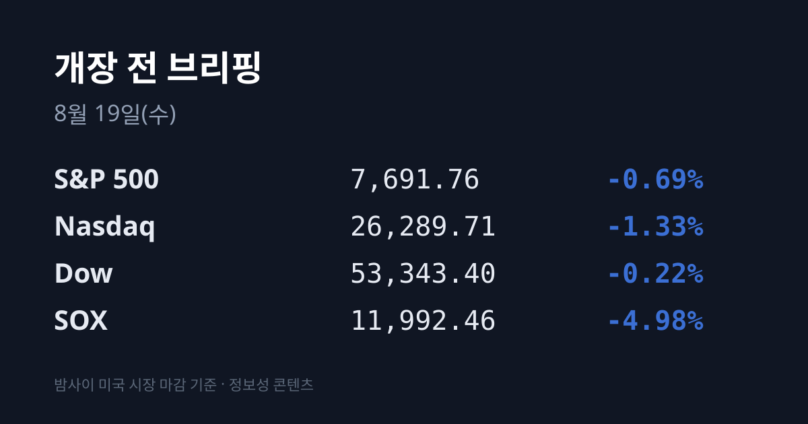
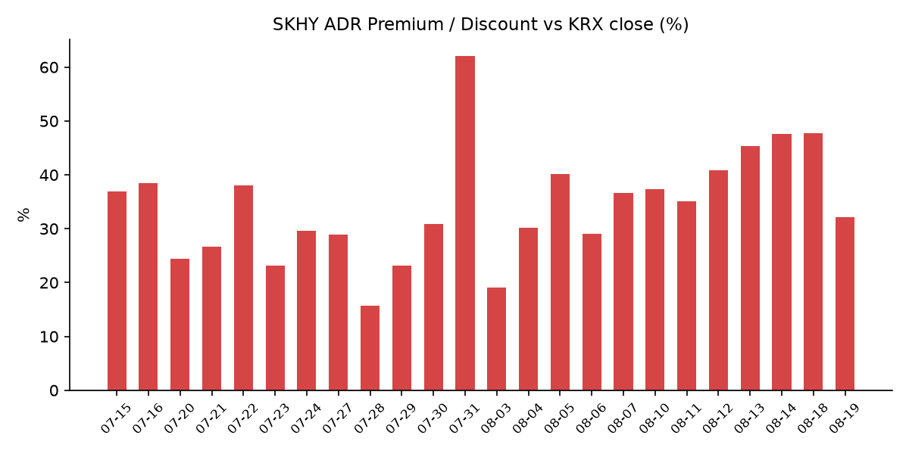
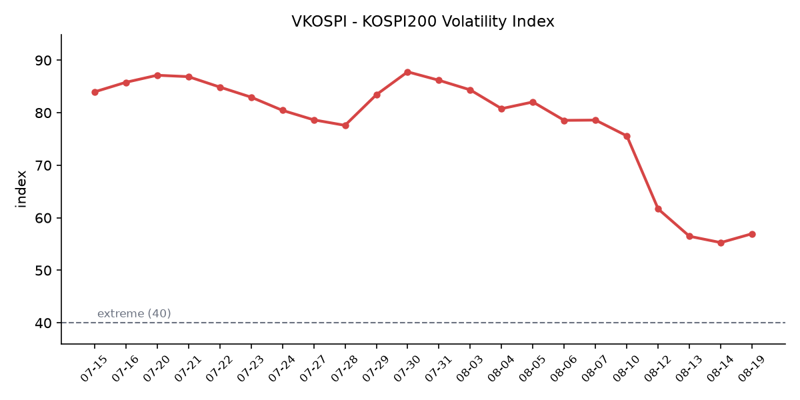

## ① 30초 요약

- <mark>미 30년물 국채 금리가 장중 5.34%까지 올라 19년 최고 기록을 하루 만에 갈아치웠습니다.</mark> 10년물도 장중 **4.748%** 로 4.7%를 넘었는데, **2년물은 4.18%로 제자리**였습니다. 오른 구간이 초장기뿐이라는 점이 이날의 성격입니다.
- 그 금리가 반도체를 때렸습니다. <mark>필라델피아 반도체 지수가 11,992.46으로 −4.98%</mark>, 나스닥(−1.33%)의 3.7배 낙폭입니다. 마이크론 −7%, 인텔 −6%, 엔비디아·브로드컴·TSMC는 각 2%대 하락이었습니다.
- <mark>SK하이닉스 ADR이 −9.20%($155.62)</mark> 무너졌습니다. 08/17 $171.38로 국면 최고 종가를 찍은 다음 세션입니다. 괴리율은 **+47.7%에서 +32.2%로** 15.5%포인트 압축됐습니다.
- 어제 코스피는 하루 안에서 양쪽 끝을 다녀왔습니다. 시가 7,127.77(+2.15%) → 장중 고 **7,216.62(+3.42%)** → 장중 저 6,788.78 → 종가 <mark>6,869.83(−1.55%)</mark>. 고·저 진폭이 **427.84포인트**, 종가 대비 6.23%입니다.
- 지수를 뒤집은 것은 **기관의 코스피 1조1,928억원 순매도**였고, 그것을 받아낸 것은 **개인의 1조1,978억원 순매수**였습니다. 외국인은 닷새 연속 순매수를 지켰지만 금액이 **+468억원**으로, 장 초반 1조5,200억원을 사놓고 대부분 되팔았습니다.
- 코스닥은 **834.20(−3.52%)** 로 사흘의 침묵을 깼습니다. 바이오·2차전지·로봇이 동반 하락했고, 양 시장 하락 종목 비중이 **79~80%** 였습니다.
- 원·달러는 <mark>1,411.8원으로 10개월 최저</mark>(2025년 10월 2일 이후)입니다. 유가가 $91에 머무는데도 원화가 강해진 배경으로 9월 FOMC 동결 기대, 반도체 수출 달러 유입, **SK하이닉스 ADR 관련 환전**이 지목됐습니다.
- 오늘부터 **ETF·ETN 종가 기준 괴리율 관리 범위가 국내 3%에서 2%로** 좁혀지고, 단일종목 레버리지·인버스 신규 투자에 **모의거래 5거래일·총 5시간** 이수가 의무화됩니다.

## ② 밤사이 미국 시장

| 지수 | 08/18 종가 | 등락 | 등락률 |
| :--- | ---: | ---: | ---: |
| S&P 500 | 7,691.76 | −53.30 | −0.69% |
| 나스닥 | 26,289.71 | −355.20 | −1.33% |
| 다우 | 53,343.40 | −116.38 | −0.22% |
| 필라델피아 반도체(SOX) | 11,992.46 | −628.54 | **−4.98%** |

3대 지수가 **사흘 연속** 내렸습니다. 그런데 이날의 실제 사건은 지수가 아니라 채권시장에서 일어났습니다. <mark>미 30년물 국채 수익률이 장중 5.34%까지 치솟아 19년 최고 기록을 하루 만에 다시 썼습니다.</mark> 종가는 5.29% 수준이었습니다. 10년물은 장중 4.748%까지 올라 4.7% 선을 넘었고 종가는 4.70%였습니다. 반면 **2년물은 4.18%로 사실상 변동이 없었습니다.**

이 구간별 차이가 중요합니다. 2년물은 연준 정책 경로를 반영하는 구간이고, CME FedWatch 기준 **9월 FOMC 동결 확률은 약 71%, 인상 확률은 약 28%** 입니다. 즉 통화정책 기대는 완화 쪽인데 초장기 금리만 올랐습니다. 보도가 배경으로 지목한 것은 **미국의 재정적자 확대와 중동 긴장에 따른 유가 상승發 인플레이션 우려**, 즉 기간 프리미엄(term premium)입니다.

그리고 이 종류의 금리 상승이 가장 크게 누르는 자산이 자본집약 산업입니다. **필라델피아 반도체 지수는 628.54포인트 내린 11,992.46으로 마감했습니다(−4.98%).** 08/17에 12,621.0(+1.64%)이었으므로 하루 만에 08/14 수준(12,417) 아래로 내려갔습니다. 개별 종목으로는 <mark>SK하이닉스 ADR −9.20%</mark>, 마이크론 −7%, 인텔 −6%였고 엔비디아·브로드컴·TSMC는 각각 2%대 하락이었습니다. 업종별로는 **에너지(XLE) +1.05%** 와 필수소비재만 올랐고, 나스닥100 −1.58%·러셀2000 −0.68%로 성장·소형이 더 밀렸습니다. VIX는 **15.84(+0.65, +4.28%)** 로 올랐습니다.

원자재는 WTI $84.52(+0.55%), 브렌트유는 약 $91 수준이었습니다(08/18 확정 종가는 집계 시점 기준 미확인, 08/17 종가는 $90.87). 금은 $4,394.10(−0.60%)였습니다. 달러인덱스는 08/17 기준 99.6(−0.06%), 달러/엔은 159.49입니다.

완화 재료도 두 건 있었습니다. **미 7월 수입물가가 전월 대비 −0.4%** 로 발표되며 월스트리트저널 집계 전망치 +0.1%를 밑돌았습니다. 석유 수입 가격이 **−7.5%** 급락한 것이 주도했습니다. 다만 7월 데이터이므로 8월 유가 급등은 아직 담고 있지 않습니다. 또 **홈디포 2분기 실적이 컨센서스를 넘었습니다** — 매출 **479억 달러(+5.7%)**, 희석 EPS 4.79달러(+4.6%), 조정 EPS 4.92달러(+5.1%)로 시장 예상 4.73달러를 상회했고 동일점포 매출은 +1.7%(미국 +1.3%)였습니다. 연간 가이던스는 그대로 유지됐습니다. 그러나 두 재료 모두 초장기 금리를 되돌리지는 못했습니다.

아시아도 같은 방향이었습니다. **닛케이 225가 67,460.73(−1,759.52, −2.54%)** 로 6거래일 만에 하락하며 아시아 최대 낙폭을 기록했고, 그 안에서 <mark>키옥시아가 −7.85%</mark>였습니다. 08/17에 +15.07% 급등했던 종목이 하루 만에 되돌려진 것입니다. 도쿄일렉트론 −6.17%, 어드반테스트 −5.08%였습니다. 대만 가권지수는 45,308.68(−548.59, −1.20%)이고 TSMC는 −0.83%였습니다. 상해종합은 3,990.30(+7.65, +0.19%), 항셍은 +0.15%로 중화권만 버텼습니다(항셍 정확 종가는 집계 시점 기준 미확인). 싱가포르 ST −1.33%, 인도 센섹스 −0.48%였습니다. 보도가 지목한 배경은 **미·이란 60일 협상 기한 만료에 따른 긴장 지속**과 국채금리 급등입니다.

오늘 아침 07:17~07:18 KST 기준 미 지수선물은 사실상 보합입니다 — S&P 7,693.50(+0.02%), 나스닥100 29,486.10(−0.02%), 다우 53,346.10(+0.00%)입니다.

## ③ 괴리율 트래커 — SK하이닉스 ADR

| 항목 | 수치 |
| :--- | ---: |
| SKHY 종가 | $155.62 (−9.20%) |
| 본주 환산가 (×10×환율) | 2,197,043원 |
| 본주 직전 종가 | 1,662,000원 |
| **괴리율** | **+32.2%** |

이 지표에서 한 달간 예고돼온 사건이 어제 일어났습니다. **수렴입니다. 그리고 방향은 ADR 하락이었습니다.**

SKHY는 08/17에 $171.38로 이번 국면 최고 종가를 찍은 뒤, 08/18에 **15.76달러 내린 $155.62(−9.20%)** 로 마감했습니다. 하루 만에 08/12 수준($154.41)으로 되돌아갔습니다. 7월 29일 사상 최저 $126.79 대비로는 여전히 +22.7% 위입니다. 환산가는 원·달러 1,411.8원을 적용해 **2,197,043원**이고, 본주 08/18 종가 1,662,000원과 대비한 괴리율은 **+32.2%** 입니다. 직전 브리핑의 +47.7%에서 **15.5%포인트** 압축됐습니다.

압축의 내역을 분해하면 방향이 명확합니다. 같은 날 **본주는 +1.03%(1,662,000원) 올랐고, ADR은 −9.20% 내렸습니다.** 즉 15.5%포인트 압축의 **약 94%가 ADR 하락 몫**입니다. 환율 기여는 소폭 마이너스입니다 — 원·달러가 1,418.3원에서 1,411.8원으로 6.5원 내리며 환산가를 약 10,100원 낮췄고, 괴리율로는 약 0.6%포인트에 해당합니다. 나머지 약 14.9%포인트가 순수 가격 요인입니다.

섹터 대비 상대 성과도 뒤집혔습니다. SKHY의 SOX 대비 초과 성과는 08/11 +3.83%p → 08/12 +6.52%p → 08/13 +6.83%p → 08/14 +0.71%p → 08/17 +1.40%p로 6세션 연속 상회였는데, **08/18에는 −4.22%p**(SOX −4.98% vs SKHY −9.20%)입니다. 끝나는 방식이 섹터의 약 2배 낙폭이었습니다.

괴리율의 의미는 구조에서 나옵니다. ADR과 본주는 원칙적으로 같은 회사의 같은 지분이므로, 환산가가 본주보다 높은 프리미엄 상태에서는 전환 차익거래 구조상 본주 쪽에 매수 유인이, 낮은 디스카운트 상태에서는 매도 유인이 생깁니다. 다만 SK하이닉스 ADR의 본주 전환 한도는 **1,779만주(발행주식의 2.5%)** 이고 전환 절차에 수 주 이상이 걸리므로, 괴리가 즉시 무위험 차익으로 실현되는 구조는 아닙니다. 수렴은 본주 상승으로도 ADR 하락으로도 일어나며, 어제는 후자였습니다. 8월 5일 +40.2%에서 다음 날 ADR −5.0%로 +29.0%까지 11.2%포인트 압축된 사례가 있었는데, 이번은 그보다 큰 15.5%포인트입니다.

현재 수준의 위치도 함께 적어둡니다. **+32.2%는 8월 들어 가장 낮은 값**이고, 평균대인 +29% 대비로는 **3.2%포인트 위**입니다. 8월 경로가 +40.2 → +45.3 → +47.6 → +47.7이었으므로, 한 세션에 국면 전체가 되돌려진 셈입니다. 참고로 삼성전자는 최근 실적 발표에서 ADR 발행을 검토하지 않는다고 밝혀, 이 지표는 SK하이닉스에만 적용됩니다. SK하이닉스 분기배당은 주당 375원이고 배당기준일은 8월 31일입니다.

괴리율 추이(브리핑 발행일 기준): 07/24 +29.6 → 07/27 +28.9 → 07/28 +15.7 → 07/29 +23.1 → 07/30 +30.9 → 07/31 +62.0 → 08/03 +19.1 → 08/04 +30.2 → 08/05 +40.2 → 08/06 +29.0 → 08/07 +36.7 → 08/10 +37.3 → 08/11 +35.1 → 08/12 +40.8 → 08/13 +45.3 → 08/14 +47.6 → 08/18 +47.7 → 08/19 +32.2

## ④ 변동성 트래커

**판정 한 줄**: <mark>'극단' 유지, 방향은 위로 꺾였다</mark> — VKOSPI가 9거래일 하락 뒤 처음 반등했고(**+3.00%**), 같은 날 코스피의 일중 진폭이 **427.84포인트(종가 대비 6.23%)** 였으며, 신용융자와 대차잔고는 양쪽에서 그대로 두껍습니다.

**기대 변동성** — VKOSPI **56.97**(08/18, 전일 대비 +1.66p, **+3.00%**)로 기준 40의 약 **1.42배**인 '극단' 구간입니다(25 미만 평온 / 25~40 경계 / 40 이상 극단). 추이는 08/10 69.55 → 08/11 61.68 → 08/12 56.48 → 08/13 55.28 → 08/14 55.31 → 08/18 **56.97** 입니다. 최근 5거래일 변화율은 −11.32% · −8.43% · −2.12% · +0.05% · **+3.00%** 로, 두 자릿수 하락세가 0으로 수렴한 다음 거래일에 방향이 위로 꺾였습니다. 7월 29일 장중 고점 93.27 대비로는 −38.9%입니다. 같은 기간 VIX는 15.19 → **15.84(+4.28%)** 로 함께 올랐고, 한·미 격차는 3.64배에서 3.60배입니다.

**실현 변동성** — 최근 7거래일 코스피 등락률은 08/07 −0.60% · 08/10 +0.65% · 08/11 +0.73% · 08/12 +3.68% · 08/13 +3.56% · 08/14 +2.42% · 08/18 **−1.55%** 입니다. 최근 10거래일 중 ±3% 이상 등락일은 3일로 줄었습니다. 그런데 종가 등락률만 보면 어제를 크게 오해하게 됩니다. <mark>08/18 코스피는 시가 7,127.77(+2.15%)에서 장중 고 7,216.62(+3.42%)까지 올랐다가 장중 저 6,788.78까지 밀리고 6,869.83에 닫았습니다.</mark> 고·저 진폭이 **427.84포인트**, 종가 대비 **6.23%** 입니다. 하루 안에서 위로 3.4%, 아래로 5.0%를 오간 셈이며, 일중 진폭 기준으로는 8월 최악급입니다. 코스닥은 **−3.52%** 로 사흘 연속 1% 미만이던 흐름을 깼고, 두 지수 등락률 차이는 1.97%p(방향은 둘 다 하락)였습니다.

**매매 정지** — 08/18 사이드카·서킷브레이커 발동 여부는 집계 시점 기준 미확인입니다(검색을 수행했으나 값을 확보하지 못했습니다). 장중 427.84포인트 진폭이 있었던 날이라는 점만 적어둡니다. 최근 확인된 이력은 07/31 코스피·코스닥 동반 매수 → 08/03 코스닥 매수 → 08/04 코스닥 매수 → 08/05 코스피 매수 → 08/06 10:18 코스피 매도 → 08/10 09:50 코스닥 매수 → 08/12 11:57 코스피 매수 → 08/13 코스피 매수입니다. 2026년 누적으로는 7월 16일까지 총 **57회**(코스피 37회) 발동해 역대 최다 경로입니다.

**증폭 경로** — 단일종목 레버리지 상품 거래대금은 5월 27일 10조4,000억원 → 7월 30일 12조4,000억원 → **8월 11일 7,000억원**으로, 규제 시행 전 고점 대비 약 18분의 1입니다. 08/18 갱신치는 집계 시점 기준 미확인입니다. 그리고 **오늘(08/19)부터 규제가 한 단계 더 조여집니다** — 종가 기준 괴리율 관리 범위가 국내 상품 3%→2%, 해외 상품 6%→5%로 좁혀지고, 단일종목 레버리지·인버스 신규 투자자는 **모의거래를 5거래일에 걸쳐 총 5시간 이상** 이수해야 합니다.

**청산 압력** — 금융투자협회 기준 신용거래융자 잔고는 08/13 **30조9,263억원**으로, 08/03의 27조4,439억원 대비 8거래일 만에 3조4,824억원(**+12.7%**) 늘어 30조원을 재돌파한 상태입니다. 종목별로는 08/14 기준 <mark>삼성전자 4조8,821억원(07/31 대비 +9.4%), SK하이닉스 4조8,121억원(+20.9%)</mark>입니다. 08/17·08/18 갱신치와 반대매매 금액은 집계 시점 기준 미확인이며, **어제 장중 −5.0% 되돌림이 이 잔고의 담보 여력에 어떤 영향을 줬는지가 확인되지 않은 상태**입니다. 종가 낙폭이 −1.55%에 그쳤다는 점은 대규모 반대매매 구간까지는 가지 않았을 가능성을 시사하지만, 개별 종목(삼성전기 −7.57%, 에코프로 −7%대)은 훨씬 깊었습니다.

**하방 포지션** — 대차거래 잔고는 08/14 기준 **173조1,899억원**으로, 07/30의 133조4,126억원에서 2주 만에 약 40조원 늘어난 수준입니다. 대차잔고는 공매도로 전환될 수 있는 대기 물량이며, 08/18 갱신치는 집계 시점 기준 미확인입니다. 공매도 거래대금은 08/13 코스피 2조790억원 · 코스닥 3,461억원이 마지막 확인치이고 08/18분은 미확인입니다. 코스피 공매도 순잔고는 **T+3 공시 지연**으로 08/14~08/18 구간이 구조적으로 확인되지 않습니다.

미확인 항목: **코스피200 야간선물**(두 차례 조회를 시도했으나 값을 확보하지 못했습니다) · 08/18 사이드카 발동 여부 · 08/18 레버리지 상품 거래대금 · 08/17~08/18 신용융자·반대매매 갱신치 · 08/18 공매도 거래대금과 순잔고 · 08/18 대차잔고 · 프로그램 매매와 선물 베이시스 · 달러/위안 · 구리 · 항셍 정확 종가 · 브렌트 08/18 확정 종가.

## ⑤ 어제 한국장 리뷰

| 지수 | 종가 | 등락률 |
| :--- | ---: | ---: |
| KOSPI | 6,869.83 | −1.55% |
| KOSDAQ | 834.20 | −3.52% |

08/18 코스피는 108.11포인트 내린 6,869.83으로 마감해 **6거래일 만에 하락**했습니다. 다만 종가만으로는 이날을 설명할 수 없습니다. 지수는 전장보다 149.83포인트 오른 **7,127.77(+2.15%)로 출발**해 오전 한때 **7,216.62(+3.42%)** 까지 치솟았고, 오전 10~11시 이후 매도세에 하락 전환해 장중 **6,788.78**까지 밀렸습니다. **'전강후약'** 이라는 표현이 그대로 붙은 세션입니다.

반전의 사유로 보도가 지목한 것은 셋입니다. **미 30년물 금리가 19년 최고치를 경신했다는 확인**, **미·이란 지정학 리스크**, 그리고 **5거래일 +11.49% 뒤의 차익실현 압력**입니다.

수급은 주체별로 정확히 갈렸습니다. 코스피에서 <mark>기관이 1조1,928억원을 순매도</mark>해 지수 하락을 주도했고, **개인이 1조1,978억원을 순매수**해 그 물량을 받아냈습니다. 사흘 연속 대규모 순매도(누적 약 7.9조원)로 이탈하던 개인이 하루 만에 방향을 뒤집은 것입니다. 외국인은 **468억원 순매수로 5거래일 연속 매수 우위**를 지켰지만, **장 초반 1조5,200억원이 넘던 순매수를 장 후반 대부분 반납**했습니다. 코스닥에서는 개인이 4,543억원 순매수, 기관 4,163억원·외국인 200억원 순매도로 나흘 연속 같은 구조였습니다.

시총 상위 종가는 삼성전자 **268,500원(−2.19%)**, SK하이닉스 **1,662,000원(+1.03%)** 입니다. 두 종목 모두 장 초반에는 급등했습니다 — 오전 9시 48분 기준 SK하이닉스는 13만1,000원 오른 **1,776,000원(+7.96%)**, 삼성전자는 9,500원 오른 **284,000원(+3.46%)** 이었고 SK하이닉스 장중 최고는 약 179만원이었습니다. 배경으로는 08/17 미국 반도체 강세와 앤스로픽의 2분기 매출 급증(전년 대비 약 14배, 115억 달러 이상) 보도가 지목됐습니다. 이 상승분이 오후에 전부 반납됐고, 삼성전자는 마이너스로 전환한 반면 SK하이닉스는 플러스를 지켰습니다. **사흘 연속 SK하이닉스가 삼성전자를 앞선 셈**입니다.

시총 상위에서 상승한 종목은 SK하이닉스와 **삼성생명(+3.16%)** 뿐이었습니다. 나머지는 <mark>삼성전기 −7.57%</mark>, LG에너지솔루션 −5.01%, NAVER −4.82%, 현대차 −3.97%였습니다. 삼성전기는 08/13에 +12.58%로 반도체 밖 대형 동인이었던 종목입니다. 코스닥에서는 바이오·2차전지·로봇이 동반 하락했고 알테오젠 −5.10%, 에코프로·에코프로비엠은 6~7%대 하락이었습니다. **양 시장 하락 종목 비중은 79~80%** 였습니다. 시장에서는 금리 급등이 요구수익률을 올려 장기 성장주에 먼저 부담이 됐다는 해석이 나왔습니다.

원·달러 환율은 전날보다 1.2원 내린 <mark>1,411.8원으로 마감해 2025년 10월 2일(1,400.0원) 이후 10개월 만에 최저</mark>입니다. 배경으로는 미 7월 소매판매·CPI·PPI 부진에 따른 **9월 FOMC 동결 기대**, 반도체 수출 호조에 따른 달러 유입, **SK하이닉스 ADR 관련 환전**과 수출업체 매도 물량, 외국인의 코스피 순매수가 지목됐습니다. 유가가 $91 수준에 머무는데도 원화가 강해졌다는 점, 그리고 환율 강세가 지수 하락을 막지는 못했다는 점을 함께 적어둡니다.

산업 쪽 팩트도 하나 있습니다. 08/18 보도로 **2028년 HBM 수요 계산**이 공개됐습니다. 빅테크 4곳의 요구량이 브로드컴 350억~400억Gb, 엔비디아 300억Gb, 구글 200억Gb, AMD 100억Gb로 **합계 950억~1,000억Gb** 이며, 이는 시장조사업체의 2028년 전체 HBM 시장 전망치 **약 550억Gb의 1.7~1.8배**입니다. 또 SK는 SK하이닉스·SK이노베이션의 실적 개선에 따른 자회사 지분가치 상승으로 **목표주가가 37.5% 상향**됐습니다.

## ⑥ 오늘의 캘린더 & 관전 포인트

- **오늘(08/19) 시행** — **ETF·ETN 종가 기준 괴리율 관리 범위 강화**(국내 3%→2%, 해외 6%→5%)와 **단일종목 레버리지·인버스 모의거래 의무화**(5거래일에 걸쳐 총 5시간 이상, 기존 기본예탁금 3,000만원·사전교육 3시간과 병행)
- **오늘(08/19) 밤** — 미 개장 전 **타깃·로우스·애널로그디바이스(ADI)** 실적
- **08/20(목) 03:00 KST** — **7월 FOMC 의사록**(미 동부시간 08/19 14:00). 다만 이 의사록이 다루는 07/28~29 회의는 08/07 고용지표, 08/12 CPI, 08/14 소매판매 발표 이전이라 이미 낡은 정보라는 지적이 나옵니다.
- **08/20** — 미 주간 신규 실업수당 청구, 7월 콘퍼런스보드 경기선행지수, 8월 필라델피아 연준 제조업지수, **월마트 실적**
- **08/21** — 미 S&P 글로벌 8월 PMI 예비치, **한국 8월 1~20일 수출 잠정치**, 미 상원이 애플에 요구한 CXMT·YMTC 미사용 확약 시한
- **08/26** — 미 7월 PCE 물가, **엔비디아 실적**, 알테오젠 무상증자 신주 상장
- **08/27(목)** — **한국은행 금융통화위원회**(직전 07/16 회의에서 기준금리 2.50% → 2.75% 인상), 잭슨홀
- **08/31** — SK하이닉스 분기배당(주당 375원) 기준일
- **09/15~16** — FOMC(현 연방기금금리 3.50~3.75%). CME FedWatch 기준 9월 동결 확률은 약 71%, 인상 확률은 약 28%입니다.
- **8월 중(수시)** — 삼성전자·SK하이닉스 주주환원 발표. 양사는 2분기 실적 발표에서 3분기 중 새 방안을 내놓겠다고 밝혔고, 추정 규모는 삼성전자 약 131조8,000억원(KB증권은 최대 200조원), SK하이닉스 40조~60조원(미래에셋·하나증권)입니다. 08/18까지 발표는 없었습니다.

**시장이 주시하는 레벨** — 미 30년물 **5.35%**(08/18 장중 5.34%), 미 10년물 **4.75%**(08/18 장중 4.748%), 반대 방향으로는 30년물 **5.29%**, 원·달러 **1,420원**(08/18 종가 1,411.8원), 어제 코스피 장중 저점 **6,788.78**, VKOSPI **60**(08/18 56.97), ADR 괴리율의 평균대 **+29%**(현재 +32.2%). 오늘 아침 07:17~07:18 KST 기준 미 지수선물은 보합(+0.02%~−0.02%)이며, **코스피200 야간선물은 집계 시점 기준 미확인**입니다.

## ⑦ 정책 워치

오늘(08/19)부터 ETF·ETN 규제가 강화됩니다. 모든 ETF·ETN에 적용되는 증권사의 **종가 기준 괴리율 관리 범위가 국내 상품은 3%에서 2%로, 해외 상품은 6%에서 5%로** 좁혀집니다(괴리율이 음수인 경우 절대값 적용). 한국거래소는 시행세칙을 개정해 고의·중과실 또는 상습적으로 괴리율 관리 의무를 위반한 유동성공급자(LP)에 대해 신규 유동성 공급 업무를 제한하는 방안도 추진합니다. 아울러 국내외에 상장된 **단일종목 레버리지·인버스 상품에 신규 투자하려는 개인 일반투자자는 한국거래소 모의거래를 이수**해야 합니다. 모의거래는 총 5거래일 이상에 걸쳐 거래일별 1시간 이상, 총 5시간 이상이며, 기존 요건인 현금 3,000만원 기본예탁금과 사전교육 3시간(기본 1시간·심화 2시간)과 함께 적용됩니다. 개인별 총량규제는 검토 단계입니다.

공매도 제도는 2026년 3월 31일 차입공매도 전 종목 전면 재개 상태가 유지되고 있으며, 이번 리서치에서 제도 변경 사항은 확인되지 않았습니다. 무차입 공매도는 계속 금지이고, 2026년 중 공매도 전산화 전면 의무화가 진행 중입니다.

중동 관련해서는 **미·이란 60일 협상 기한이 만료**되면서 긴장이 이어지고 있다고 보도됐습니다. 배경은 2026년 2월 28일 개전, 이란의 호르무즈 해협 봉쇄, 4월 13일 미국의 해상봉쇄입니다.

## ⑧ 오늘의 질문

2028년 HBM 수요는 시장 전망치의 1.8배로 계산되는데, 그 수요를 현재가치로 바꾸는 할인율(미 30년물)은 19년 최고다. 시장은 오늘 어느 쪽을 먼저 계산할 것인가.

---
*본 글은 공개된 시장 데이터를 정리한 정보성 콘텐츠이며, 특정 종목·상품의 매매 권유가 아닙니다. 모든 투자 판단과 책임은 투자자 본인에게 있습니다. 수치는 작성 시점 기준이며 이후 변동될 수 있습니다.*
