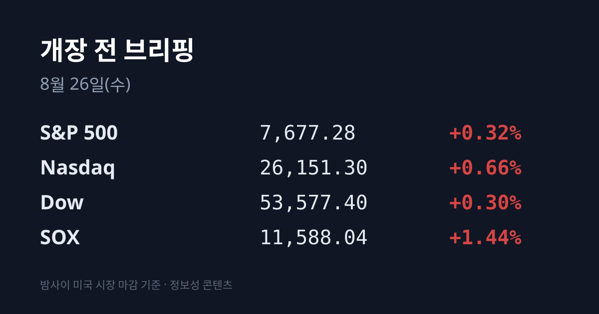
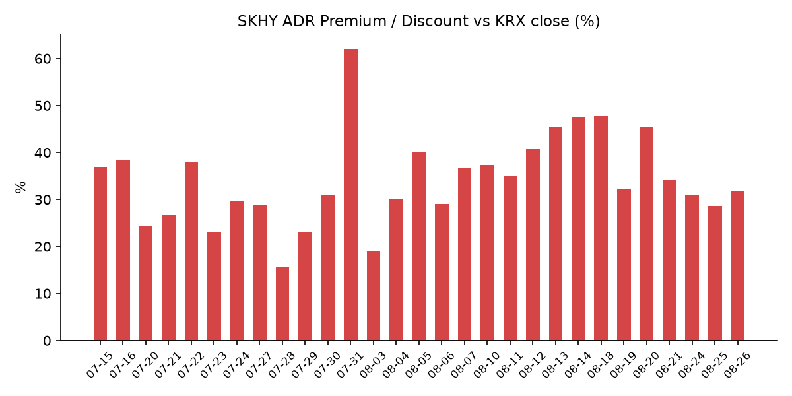
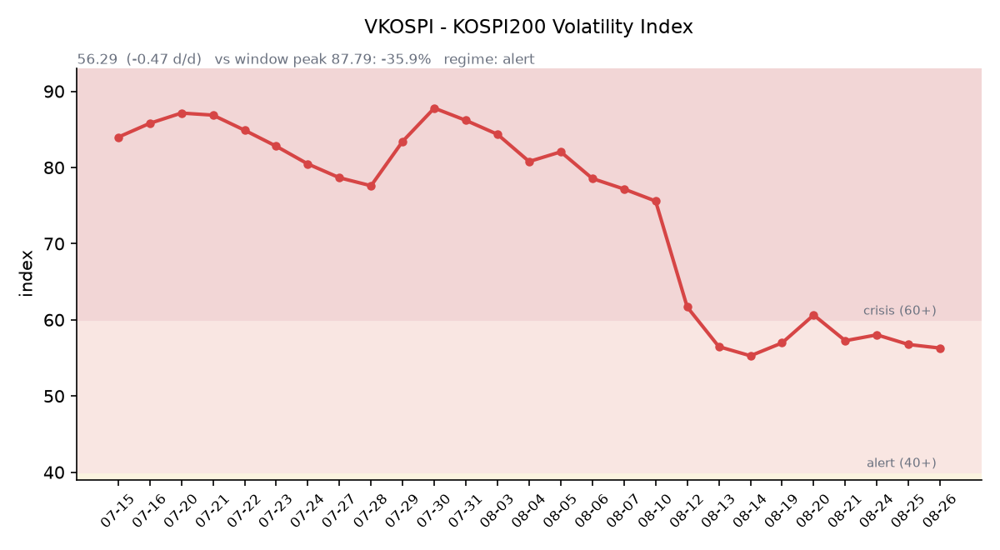

## ① 30초 요약

- 어제 한국 시장은 **하루 안에 두 개의 장이 있었던 날**입니다. 코스피는 **6,535.93(−2.40%)** 으로 출발해 장중 <mark>6,408.82까지 −4.30% 밀렸다가 6,742.74(+45.78, +0.68%)로 반전 마감</mark>했습니다. 일중 진폭이 약 5.0%포인트입니다. 코스닥도 **827.15(+13.82, +1.70%)** 로 올랐습니다.
- 오전 급락의 배경은 밤사이 미국의 반도체 급락(SOX −2.70%), 애플의 중국 메모리 채택 보도, 그리고 **YMTC 모회사의 상하이 IPO 신청**이었습니다.
- 오후 반전의 자금원은 개인이 아니었습니다. <mark>기타법인이 코스피에서 1조5,900억원을 순매수해 역대 2위 규모를 기록했습니다</mark> — 삼성전자·SK하이닉스의 성과급 지급용 자사주 매입과 자기주식 취득이 배경으로 지목됐습니다. 외국인은 **−3조9,491억원**, 기관 **+1조2,200억원**, 개인 **+1조1,500억원** 입니다.
- 지수를 끌어올린 업종은 반도체가 아니었습니다. **미국이 한국에 원전기업 웨스팅하우스 지분 인수를 제안했다는 보도**에 **한전기술 +20.27% · 현대건설 +14.87% · 대우건설 +11.80% · 두산에너빌리티 +10.55%** 가 급등했습니다. 다만 **산업통상부는 "한미 공동 지분 인수설은 사실과 다르다"고 부인**했습니다.
- 삼성전자는 **257,000원(0.00%)** 보합, SK하이닉스는 **1,678,000원(+7,000원, +0.42%)** 입니다. 둘 다 장 초반 −4%·−6%대에서 출발한 자리를 되돌렸습니다.
- 밤사이 미국은 방향을 바꿨습니다. 필라델피아 반도체(SOX)가 11,588.04로 +1.44% 반등했고 3대 지수도 모두 올랐습니다 — **S&P 500 7,677.28(+0.32%) · 나스닥 26,151.30(+0.66%) · 다우 53,577.40(+0.30%)** 입니다. 엔비디아는 **+2.81%로 7거래일 연속 하락을 끊었습니다.**
- 금리는 커브 전체가 내렸습니다. 미 재무부 확정치로 2년물 4.17%(−7bp), 10년물 4.64%(−6bp), 30년물 5.17%(−6bp), 10년물 실질금리 2.32%(−6bp) 입니다. **VIX는 14.89(−6.00%)** 로 빠졌습니다.
- 유가는 또 급락했습니다. **브렌트 $88.58(−3.9%)**, **WTI $82.36(−3.1%)** 로 이틀 누적 브렌트 −6.3%입니다. **같은 날 이란이 호르무즈 해협에서 유조선을 공격했는데도 유가가 내렸습니다.**
- 엔비디아가 주요 고객사에 **AI 칩 가격을 최소 15% 인상**한다고 통보했습니다. 원인은 메모리값 폭등입니다 — 서버용 D램 계약가는 2분기 전분기 대비 **+53~58%** 올랐고 3분기 **+13~18%** 추가 상승 전망이 나와 있습니다.

## ② 밤사이 미국 시장

| 지수 | 종가 | 등락률 |
| :--- | ---: | ---: |
| S&P 500 | 7,677.28 | +0.32% |
| 나스닥 | 26,151.30 | +0.66% |
| 다우 | 53,577.40 | +0.30% |
| 필라델피아 반도체(SOX) | 11,588.04 | **+1.44%** |

화요일 미국장은 **전날 무너진 자리를 반도체가 되찾은 날**이었습니다. 3대 지수가 모두 올랐고 러셀2000도 3,010.02(+14.94, +0.50%)로 마감했습니다. <mark>SOX는 11,588.04로 +164.87포인트, +1.44% 올라 전날 −2.70%의 절반 이상을 되돌렸습니다</mark>. 개별주는 **AMD +3.4~4.25% · 인텔 +3.04% · 엔비디아 +2.81% · 마이크론 +2.48% · SK하이닉스 ADR +2.68%** 이고, 반도체 ETF SOXX는 +1.81%입니다. 엔비디아는 이 반등으로 **7거래일 연속 하락을 끊었습니다.**

배경은 **오늘 밤(미 현지 08/26 장 마감 후 = 08/27 새벽 KST) 엔비디아 FY2027 2분기 실적**입니다. 시장에서는 실적을 앞둔 선반영 매수라는 해석이 나왔습니다. 반대로 말하면 어제 반등의 근거가 아직 발표되지 않은 숫자에 걸려 있다는 뜻이기도 합니다.

금리는 커브 전체가 내렸습니다. 미 재무부 확정치로 **2년물 4.17%(−7bp) · 10년물 4.64%(−6bp) · 30년물 5.17%(−6bp)** 이고, 10년–2년 스프레드는 **+47bp**(전일 +46bp)입니다. 물가를 뺀 **10년물 실질금리(TIPS)는 2.32%로 6bp 내렸습니다.** 30년물은 08/17의 5.31%에서 **5.17%까지 14bp** 내려온 상태입니다. 배경으로는 재무부가 1조달러 규모 일반계정(General Account)을 장기채 바이백 재원으로 쓸 수 있다는 보도가 이틀째 거론됐습니다. **VIX는 14.89(−0.95, −6.00%)**, **달러인덱스는 98.90(−0.10, −0.10%)** 입니다.

원자재에서는 유가가 또 컸습니다. **브렌트가 $88.58로 −3.9%, WTI가 $82.36으로 −3.1%** 정산됐고 이틀 누적으로 브렌트는 −6.3%입니다. 작성 시각 전자거래에서 WTI는 **$81.20(−1.41%)** 로 더 내려 있습니다. **주목할 대목은 같은 날 이란이 호르무즈 해협에서 유조선을 공격했다는 것입니다** — 베선트 미 재무장관의 제재 발표 몇 시간 뒤였고, 이란 안보수장 모흐센 레자에이는 "경제 전쟁을 무력화하겠다"며 호르무즈 원유 흐름 차단을 위협했습니다. 그럼에도 유가는 내렸습니다. 시장에서는 이번 국면을 군사 확전이 아니라 경제 압박으로의 전환으로 읽었다는 해석이 나옵니다. 미 휘발유 전국 평균은 08/23 기준 갤런당 **$4.09** 로 개전 전 대비 +37.5%입니다.

한국 원유 수입의 기준유종인 **두바이유는 페트로넷 08/25 기준 $93.00** 입니다. 같은 날 브렌트가 $88.58이므로 <mark>두바이가 브렌트를 $4.42 웃도는 역전 상태이고, 08/21의 $3.42에서 오히려 벌어졌습니다</mark>. 브렌트만 보면 보이지 않는 대목입니다. 금은 12월물 기준 **$4,718.30(+0.51%)** 입니다. 금이 오르는 동안 실질금리가 6bp 내리고 달러도 소폭 약해졌으므로, 이 조합은 안전자산 회피형이 아니라 할인율이 낮아진 쪽의 움직임에 가깝습니다. 벌크 해상운임 **BDI는 2,815(08/22 기준)** 로, 발틱거래소 확정 시차 때문에 기준일이 며칠 밀려 있습니다.

정규장 마감 후 실적도 있었습니다. **인튜이트가 FY4Q 조정 주당순이익 $4.03, 매출 43억5,400만달러로 컨센서스를 웃돌았지만 FY2027 매출 성장률을 9~10%로 제시**했습니다. FY2026의 14%에서 감속하는 수치이고, **주가는 시간외에서 −7%대로 밀렸습니다.** 줌도 같은 시간 2분기 실적을 발표했습니다.

현재 미 지수선물은 사실상 보합입니다. **S&P 500 선물 7,692.00(0.00%) · 나스닥100 선물 29,295.00(+18.25, +0.06%)** 입니다(08/25 18:11 ET = 08/26 07:11 KST).

## ③ 괴리율 트래커 — SK하이닉스 ADR

| 항목 | 수치 |
| :--- | ---: |
| SKHY 종가 | $159.53 (+2.68%) |
| 본주 환산가 (×10×환율) | 2,211,245원 |
| 본주 직전 종가 | 1,678,000원 |
| **괴리율** | **+31.8%** |

괴리율이 전일 **+28.6%** 에서 **+31.8%로** 3.2%포인트 벌어졌습니다. 확대의 출처는 명확합니다 — ADR이 +2.68% 오르는 동안 본주는 +0.42%에 그쳤습니다. 밤사이 미국이 SK하이닉스를 한국보다 2.3%포인트 더 비싸게 매긴 셈입니다. 환율도 확대 쪽으로 거들었습니다 — 계산에 쓰는 원·달러가 1,382.95원에서 **1,386.10원**으로 올라 환산가를 높였습니다. ADR 시간외 가격은 이번 집계에서 확보하지 못했습니다.

구조를 다시 짚으면, ADR 1주는 본주 10주에 해당하므로 환산가는 ADR 종가에 10과 원·달러 환율을 곱해 구합니다. 환산가가 본주보다 높은 상태(프리미엄)에서는 ADR을 팔고 본주를 사는 전환 차익거래에 유인이 생기고, 낮은 상태(디스카운트)에서는 반대 방향의 유인이 생기는 것이 이 지표의 메커니즘입니다. 다만 실제 차익거래에는 마찰이 있습니다 — 전환 한도가 **1,779만주(발행주식의 2.5%)** 이고 절차에 수 주 이상 걸립니다.

밤사이 한국 시장 전체가 미국에서 어떻게 값이 매겨졌는지도 함께 봅니다. 한국 대표 ETF인 <mark>EWY가 $179.87(+6.23, +3.59%)로 마감</mark>했습니다. **어제 코스피 종가 상승률(+0.68%)을 2.9%포인트 웃도는 수치**입니다. 같은 시간 원화가 1,386.1원에서 1,382.05원으로 강세였으므로 환율 기여를 걷어내도 원화 환산 +3.3% 수준입니다. 밤사이 미국 투자자가 한국 시장 전체를 어제 종가보다 3% 넘게 위로 다시 매겼다는 뜻입니다.

## ④ 변동성 트래커

**판정 한 줄**: <mark>'경보' 구간(40~60) 유지, 지표는 5거래일째 완만히 내리는데 실제 일중 진폭은 5.0%포인트였다</mark>. 기대 변동성의 하락을 '진정'으로 읽기 어려운 국면이다.

**기대 변동성**  VKOSPI **56.29**(전일 56.76 대비 **−0.47p, −0.83%**). 구간 기준은 25 미만 평시 / 25~40 주의 / 40~60 경보 / 60 이상 위기이며 현재는 **경보**다. 6월 종가 고점 96.94 대비 **−41.9%** 까지 내려온 상태이나 평시 상단(25)의 **2.25배**다. 추이: 08/19 60.63 → 08/20 57.26 → 08/21 58.03 → 08/24 56.76 → **08/25 56.29**로 4거래일 중 3일 하락했다.

**실현 변동성**  어제 코스피의 일중 경로는 시가 **6,535.93(−2.40%)** → 저가 **6,408.82(−4.30%)** → 고가 **6,747.16** → 종가 **6,742.74(+0.68%)** 다. 저점에서 종가까지 **약 5.0%포인트**를 되돌렸다. 확보된 일별 등락률은 08/19 −5.80% → 08/20 +5.89% → 08/21 +0.88% → 08/24 −3.12% → **08/25 +0.68%** 이고, 다섯 거래일 중 ±3% 이상이 **3일**이며 방향은 계속 뒤집혔다. 코스닥은 같은 기간 08/20 +1.99% → 08/21 −4.63% → 08/24 +1.42% → **08/25 +1.70%** 다. 그 앞 구간의 일별 전체 시계열은 이번 집계에서 확보하지 못했다.

**매매 정지**  08/19 오전 9시 6분 코스피200 **매도** 사이드카 → 08/20 오전 9시 57분 10초 **매수** 사이드카 → 08/21 오전 10시 5분 5초 코스닥 **매도** 사이드카가 확인된 이력이다. **08/25는 지수가 장중 −4.30%까지 밀렸음에도 사이드카 발동 보도가 확인되지 않았다** — 사이드카 기준이 지수가 아니라 코스피200 선물 5% 변동(1분 지속)이기 때문이다. 서킷브레이커도 발동되지 않았다.

**증폭 경로**  금융위 집계 기준 단일종목 레버리지 상품 거래대금은 **05/27 10조4,000억원 → 07/30 12조4,000억원 → 08/11 7,000억원** 으로 급감했다. 규제는 진행 중이다 — 기본예탁금이 1,000만원에서 3,000만원으로 올랐고(07/16, 현금만 인정), 신규 상장이 중단됐으며, 최소 매매단위를 1주에서 20주로 늘리는 조치가 9월 조기 시행으로 추진되고 있다. 당일 회전율은 개장 전 산출되지 않는다.

**청산 압력**  신용융자 잔고는 **08/13 기준 30조9,263억원**으로 8거래일간 3조4,824억원(+12.7%) 늘었고, 그중 코스닥은 6조3,914억원이다. **08/14 이후 갱신치와 미수금 반대매매 금액은 집계 시점 기준 미확인**이다. 참고로 위탁매매 미수금 대비 반대매매 비중은 월별로 1월 0.98% → 3월 2.11% → 5월 2.63% → **6월 3.52%** → 7월(29일까지) 3.17%로 집계됐다.

**하방 포지션**  공매도 순잔고는 **T+2~3 공시 지연이 구조적**이어서 개장 전에는 알 수 없다. 최신 확보치는 08/01~14 거래대금 집계로, 삼성전자 **5.4조원**(7월 2.3조원 → 2.4배), SK하이닉스 3.1조원이다.

미확인 항목: 코스피200 야간선물(3경로 시도) · SKHY ADR 시간외 · 프로그램 매매 차익·비차익과 선물 베이시스 · 08/14 이후 신용융자·반대매매 갱신치 · CCFI(컨테이너 운임).

## ⑤ 어제 한국장 리뷰

| 지수 | 종가 | 등락 |
| :--- | ---: | ---: |
| 코스피 | 6,742.74 | +45.78 (**+0.68%**) |
| 코스닥 | 827.15 | +13.82 (**+1.70%**) |

어제 한국 시장은 **전약후강의 교과서 같은 하루**였습니다. 코스피는 전 거래일 대비 161.03포인트(−2.40%) 내린 6,535.93으로 출발해 6,600선과 6,500선을 차례로 내주고 **6,408.82(−4.30%)** 까지 밀렸습니다. 오후 들어 낙폭을 빠르게 만회하더니 장 후반 상승 전환해 6,747.16에서 고점을 만들고 **6,742.74** 로 마쳤습니다. 상승 종목 647개, 하락 226개로 전날(하락 615개)에서 완전히 뒤집혔습니다.

오전 급락의 배경은 세 가지로 지목됐습니다. ① 밤사이 미국의 반도체 급락(SOX −2.70%, 마이크론 −5.83%, 엔비디아 −2.91%), ② 애플의 중국산 메모리 구매 허용 가능성 보도, ③ **중국 메모리 업체 YMTC 모회사의 상하이 STAR 마켓 IPO 신청**입니다. 여기에 엔비디아의 AI 칩 가격 인상 통보가 'AI 비용 부담' 쪽으로 읽힌 점, 그리고 직전 거래일 삼성전자 주주환원 실망 물량이 겹쳤습니다.

오후 반전의 자금원은 수급표에 있습니다. **코스피 — 외국인 −3조9,491억원(3거래일 연속 순매도), 기관 +1조2,200억원, 개인 +1조1,500억원** 입니다(매체에 따라 외국인 −3조8,200억원·기관 +1조1,700억원·개인 +1조500억원으로도 집계됐습니다). 그런데 여기에 한 축이 더 있습니다 — 기타법인이 1조5,900억원을 순매수해 역대 2위 규모를 기록했습니다. 삼성전자·SK하이닉스의 성과급 지급용 자사주 매입과 자기주식 취득이 배경으로 지목됐습니다. **코스닥은 외국인 +1,329억원 · 기관 +148억원 순매수, 개인 −1,367억원 순매도**로, 외국인·기관의 코스닥 순매수는 이틀 연속입니다. 프로그램 매매와 선물 베이시스는 이번 집계에서 확보하지 못했습니다.

지수를 끌어올린 업종은 반도체가 아니었습니다. **건설 +8.73% · 기계·장비 +6.74% · 전기가스 +3.26%** 가 상위였고 통신은 −1.40%였습니다. 재료는 <mark>미국 정부가 자국 원전기업 웨스팅하우스 지분을 한국과 공동으로 인수하자고 제안했다는 보도</mark>입니다. **한전기술 +20.27% · 현대건설 +14.87% · 대우건설 +11.80% · 두산에너빌리티 +10.55%** 가 급등했습니다. 다만 **산업통상부는 "한미 공동 지분 인수설은 사실과 다르다"고 공식 부인**했습니다. 보도된 구조는 미국 원전 건설 사업에 한국 기업이 참여하는 대신 웨스팅하우스 지분을 확보하는 방식이고, 배경에는 트럼프 행정부의 2030년까지 대형 원전 10기 착공 목표가 있습니다. 한수원·한전은 2025년 1월 웨스팅하우스와 **원전 1기 수출당 1조원이 넘는 로열티·용역 구매를 제공하고 유럽 등 선진시장 독자 진출을 사실상 포기하는 50년 장기 합의문**에 서명한 바 있습니다.

시가총액 상위 두 종목은 되돌림에 성공했습니다. **삼성전자 257,000원(0.00%)**, **SK하이닉스 1,678,000원(+7,000원, +0.42%)** 입니다. 장 초반 삼성전자는 −3.11%로 출발해 −4%대까지, SK하이닉스는 −4.37%로 출발해 −6%대까지 밀렸던 자리입니다. 그 밖에 **한화가 인적분할 재상장 첫날 +17.40%**, LG에너지솔루션은 −3.45%였습니다.

환율은 어제 서울에서 올랐다가 밤사이 되돌려졌습니다. **원·달러 08/25 종가는 1,386.1원(+2.9원)** 이고, 작성 시각 현재값은 **1,382.05원**(08/26 07:2x KST)입니다. USD/JPY는 **159.21**(전일 종가 159.18)로 거의 정체입니다.

아시아는 전 시장이 반등하거나 보합이었습니다 — **닛케이 225 65,856.43(+0.50%) · 상해종합 3,889.44(+0.19%) · 대만 가권 45,169.46(+0.91%) · 항셍 25,511.10(−0.02%)** 입니다. 반도체 동조 축인 대만 가권이 가장 강했고, 코스피의 회복 폭도 이와 비슷한 궤적이었습니다.

## ⑥ 오늘의 캘린더 & 관전 포인트

- **오늘(08/26)** — 현대차 2026 CEO 인베스터데이 14:00, 여의도 콘래드호텔. 호세 무뇨스 사장과 이승조 CFO 등이 참석해 피지컬 AI 비전, 보스턴다이내믹스를 포함한 그룹 로보틱스 지배구조, 연간 판매 가이던스, 주주환원 정책을 다룬다고 예고돼 있습니다. **미 7월 PCE 물가**와 **7월 내구재 신규수주**는 미 오전(한국장 마감 후) 발표입니다.
- **08/27 새벽(KST)** — <mark>엔비디아 FY2027 2분기 실적</mark>(미 08/26 장 마감 후). 시장 전망은 주당순이익 **$2.09**, 매출 **$920.7억** 입니다. 마벨 테크놀로지도 금주에 발표합니다.
- **08/27(목)** — **한국은행 금융통화위원회 + 수정 경제전망**. 현 기준금리는 **2.75%** (07/16에 2.50%에서 인상)이고, 시장에서는 추가 인상과 동결 전망이 갈려 있습니다. 같은 날 **잭슨홀 심포지엄 개막**(08/27~29)이며 케빈 워시 연준 의장의 취임 후 첫 기조연설은 **08/28** 입니다.
- **08/28** — 미 8월 시카고 PMI, 일본 8월 도쿄 소비자물가지수
- **08/31** — SK하이닉스 분기배당(주당 375원) 기준일
- **09/08** — 캐나다의 대미 보복관세(200억달러 규모) 발효
- **09/15~16** — FOMC. CME FedWatch 기준 **인상 40.4~41.9%, 동결 58%대** 입니다(08/25 집계).
- **09월(조기 시행 추진)** — 단일종목 레버리지 ETF 최소 매매단위 1주 → 20주
- **10월 말** — 삼성전자 이사회, 3분기 실적 발표와 함께 주주환원 구체안 확정
- **내년 1월 이사회** — 삼성전자 잔여 주주환원(현금배당·자사주 매입·소각)의 방식과 규모 결정
- **11/19** — SK하이닉스 40조원 자사주 취득 종료 예정일
- **2027년 상반기(목표)** — YMTC 상하이 STAR 마켓 상장. 공모가·조달 규모 확정일이 각각 개별 이벤트입니다.

**시장이 주시하는 레벨**: 미 30년물 국채금리 **5.17%**(어제 종가)와 **5.31%**(8/17 고점), 10년물 **4.64%**, 원·달러 **1,382원**(현재)과 **1,376원**(08/24 장중 저점)·**1,400원**, VKOSPI **60**과 **65**, SK하이닉스 ADR 괴리율의 최근 범위 **+28.6%(08/24) ~ +47.7%(08/18)**, 두바이-브렌트 스프레드 **$4.42**, 그리고 코스피 **6,700선**과 어제 장중 저점 **6,408.82** 입니다.

## ⑦ 정책 워치

- **공매도 제도**: 차입 공매도는 전면 재개 상태이고 **무차입 공매도는 여전히 금지**입니다. 2026년부터 공매도 전산시스템 의무화와 개정 자본시장법이 시행 중이며, 당국은 이를 "세계에서 가장 엄격한 3중 방지체계"로 설명하고 있습니다. 불법 무차입 공매도에는 부당이득의 **최대 5배 벌금**과 형사처벌이 적용됩니다.
- **단일종목 레버리지 ETF**: 07/16 기본예탁금이 1,000만원에서 **3,000만원**으로 올랐고 주식·채권 등 보유 자산은 예탁금으로 인정되지 않습니다. 신규 상장은 중단됐고, 최소 매매단위를 1주에서 **20주**로 늘리는 유가증권시장 업무규정 시행세칙 개정이 9월 시행을 목표로 추진되고 있습니다. 08/19부터는 ETF 괴리율 관리가 강화되고 단일종목 레버리지 모의거래가 의무화됐습니다.
- **원전 통상**: 미국이 한국에 웨스팅하우스 지분 투자를 제안했다는 보도에 대해 **산업통상부는 공동 인수설을 부인**했습니다. 산업부와 한전이 투자 구조·재원 조달 방식을 검토 중이라는 내용까지는 보도됐습니다.
- **통상**: 캐나다의 대미 보복관세(철강·낙농·가전·농기계·펄프, 200억달러 규모)가 **09/08 발효** 예정입니다.
- **기업 주주환원**: 삼성전자의 자사주 소각 규모와 시점은 **10월 말·내년 1월 이사회**로 이연된 상태입니다. SK하이닉스는 성과급 개편안이 노조 투표에서 **찬성 49.9% 대 반대 50.1%, 25표 차로 부결**됐습니다.

## ⑧ 오늘의 질문

어제 코스피의 반등을 받아낸 것은 기관과 **기타법인 1조5,900억원**(성과급·자사주라는 일회성 물량)이었고, 밤사이 미국은 EWY +3.59%로 한국을 한 번 더 위로 매겼습니다 — 외국인이 4거래일째 파는 자리에서 이 두 신호 중 어느 쪽이 먼저 값으로 나타날 것인가.

---
*본 글은 공개된 시장 데이터를 정리한 정보성 콘텐츠이며, 특정 종목·상품의 매매 권유가 아닙니다. 모든 투자 판단과 책임은 투자자 본인에게 있습니다. 수치는 작성 시점 기준이며 이후 변동될 수 있습니다.*
