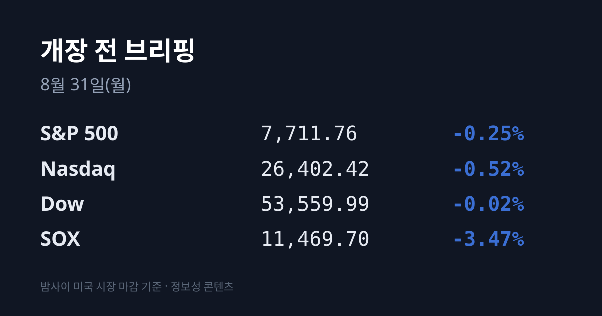
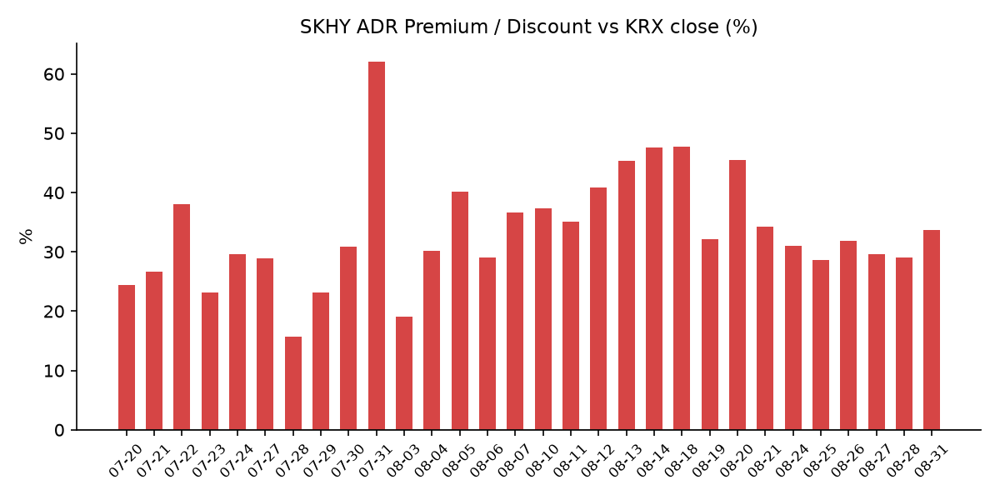
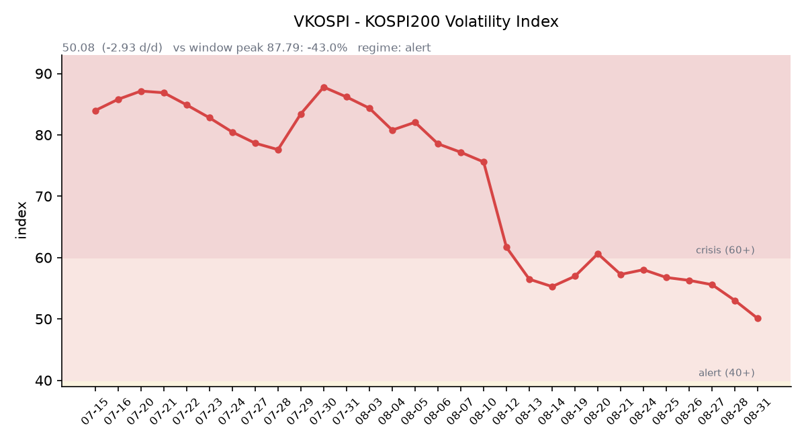

## ① 30초 요약

- 오늘은 **월요일**입니다. 한국장은 **8월 28일(금) 15:30**에 닫혔고, 그 뒤로 지나간 것은 **미국 정규장 1세션(08/28)과 주말 뉴스**입니다. 일본·대만·중국·홍콩의 08/28 세션은 한국장과 같은 시간대여서 한국이 이미 봤습니다.
- 미국 지수는 얕게 밀렸습니다. S&P 500 **7,711.76(−0.25%)**, 나스닥 **26,402.42(−0.52%)**, 다우 **53,559.99(−0.02%)** 입니다. 그런데 <mark>필라델피아 반도체(SOX)만 11,469.7로 −3.47% 무너졌습니다</mark> — 지수 3종보다 3%포인트 더 빠졌습니다.
- 원인은 하나였습니다. **케빈 워시 연준 의장의 잭슨홀 기조연설(08/28 23:00 KST)** 입니다. "연준은 아직 할 일이 남았다", "PCE가 5년 반째 2%를 넘고 있다"는 취지였습니다.
- <mark>9월 금리 인상 확률이 하루 만에 35.4%에서 57.5%로 뛰었습니다</mark>(CME FedWatch, 09/16 FOMC).
- 금리는 앞단만 뛰었습니다 — 2년물 **4.34%(+14bp)**, 10년물 4.73%(+6bp), 30년물 5.211%(+2bp)로 **10년–2년 스프레드가 +47bp에서 +39bp로** 좁혀졌습니다. 10년물 실질금리(TIPS)는 2.34%에서 **2.41%로 +7bp** 올랐습니다.
- 어제 코스피는 **6,788.88(−123.49, −1.79%)**, 코스닥은 838.41(+0.76, +0.09%)입니다. 삼성전자 **257,000원(−3.38%)**, SK하이닉스 **1,653,000원(−4.45%)** 입니다.
- <mark>08/28 아시아에서 내린 곳은 한국뿐이었습니다</mark> — 대만 가권 +0.77%, 닛케이 +0.41%, 항셍 +0.07%, 상해종합 −0.11%입니다.
- 한국 관련 자산의 미국 반응은 훨씬 얕았습니다. **SK하이닉스 ADR(SKHY) $161.04(−0.35%)**, 한국 ETF **EWY $180.20(−1.07%)** 입니다. 그 결과 <mark>괴리율이 +29.0%에서 +33.7%로 4.7%포인트 벌어졌습니다</mark>.
- 코스피가 1.79% 빠진 날인데 **VKOSPI는 오히려 −5.53%** 내려 50.08로 52주 최저를 다시 썼습니다.
- 수급에서는 외국인이 하루 만에 방향을 바꿨습니다 — 코스피 외국인 **−1조5,830억~−1조7,585억원**, 기관 −2,841억원, 개인 +2,638억~+4,241억원입니다. 여기에 <mark>기타법인이 +1조6,162억원을 샀습니다</mark>(삼성전자·SK하이닉스 자사주 매입).

## ② 밤사이 미국 시장

| 지수 | 종가 | 등락률 |
| :--- | ---: | ---: |
| S&P 500 | 7,711.76 | −0.25% |
| 나스닥 | 26,402.42 | −0.52% |
| 다우 | 53,559.99 | −0.02% |
| 필라델피아 반도체(SOX) | 11,469.70 | **−3.47%** |

금요일 미국 정규장은 **표면과 속이 완전히 달랐던 하루** 였습니다. 지수 3종은 −0.02%에서 −0.52% 사이로 얕게 밀렸는데, **SOX는 412.5포인트(−3.47%)나 빠졌습니다.** 낙폭을 주도한 것은 엔비디아와 인텔이었습니다. 표면 지수와 반도체 사이에 **3%포인트의 간격**이 벌어진 것입니다.

방아쇠는 **케빈 워시 연준 의장의 잭슨홀 기조연설**(한국 시각 08/28 23:00)이었습니다. 워시 의장은 기저 물가 상승률이 목표치인 2%로 충분히 빠르게 수렴하지 않으면 대응하겠다는 취지로 말했고, 연준에 **"아직 할 일이 남았다"** 고 했습니다. 개인소비지출(PCE) 물가가 **5년 반째 2% 목표를 넘고 있다** 는 점도 짚었습니다. 취임 후 가장 뚜렷한 매파 메시지로 읽혔습니다.

시장의 되매김은 즉각적이었습니다. CME FedWatch 기준 **9월 16일 FOMC의 금리 인상 확률이 하루 만에 35.4%에서 57.5%로** 뛰었습니다(현 목표범위 3.50~3.75%). 채권 시장은 앞단만 뛰는 **베어 플래트너** 모습이었습니다. **2년물 4.34%(+14bp)**, 10년물 4.73%(+6bp), 30년물 5.211%(+2bp)이고, 10년–2년 스프레드는 +47bp에서 **+39bp로 8bp 좁혀졌습니다.**

반도체가 유독 크게 빠진 이유는 **10년물 실질금리(TIPS)** 에 있습니다. 이 값이 2.34%에서 **2.41%로 7bp 올랐습니다.** 실질금리는 미래 이익을 현재가치로 환산할 때 쓰는 할인율의 실체이고, 이익이 먼 미래에 몰려 있는 성장주·반도체일수록 이 값의 변화에 크게 반응합니다. 8월 내내 코스피를 흔들었던 30년물이 +2bp로 조용했다는 점에서 **8월과는 다른 종류의 충격** 이었습니다.

같은 방향의 신호가 하나 더 있습니다. **금 12월물이 $4,529.90으로 −2.88% 급락** 했습니다(08/27 $4,664.00). 여기에 **달러인덱스(DXY)가 99.14에서 99.70으로 +0.56** 올랐습니다. 금이 내리고 실질금리와 달러가 함께 오른 조합은 **안전자산으로의 도피가 아니라 실질금리 상승이 무이자 자산을 밀어낸 모습** 입니다. **VIX는 14.43(−0.08, −0.55%)** 으로 거의 움직이지 않았습니다 — 주식 시장이 이 사건을 공포가 아니라 금리 이야기로 받았다는 뜻입니다.

개별 종목에서는 **페이팔이 −12.71%($53.66)** 로 크게 빠졌습니다. 스트라이프와 어드벤트가 500억달러 규모의 인수 추진을 가격 이견으로 철회했다는 소식 때문입니다. **델 테크놀로지스는 −3.69%** 였고, 사유로는 메모리 원가 급등과 관세 우려가 거론됐습니다. 델의 2분기 실적 발표일은 **09/01** 입니다.

주말에는 정책 쪽 뉴스가 있었습니다. 08/30 보도에 따르면 **워시 의장과 스콧 베선트 재무장관이 공개적으로 부딪쳤습니다.** 베선트 장관이 장기물 매입 등 시장 개입을 밀어붙인 데 대해, 워시 의장은 현재 시장 여건이 "긴축적이지 않다"고 정면으로 받았습니다.

## ③ 괴리율 트래커 — SK하이닉스 ADR

| 항목 | 수치 |
| :--- | ---: |
| SKHY 종가 | $161.04 (−0.35%) |
| 본주 환산가 (×10×환율) | 2,210,274원 |
| 본주 직전 종가 | 1,653,000원 |
| **괴리율** | **+33.7%** |

괴리율이 전일 +29.0%에서 **+33.7%로 하루 만에 4.7%포인트 벌어졌습니다.** 벌어진 이유는 산수에 그대로 드러납니다 — **본주는 −4.45% 빠졌는데 ADR은 −0.35%만 빠졌습니다.** 밤사이 미국 시장은 한국이 SK하이닉스에 매긴 할인을 따라가지 않은 것입니다.

같은 이야기를 한국 시장 전체를 담는 ETF도 합니다. **코스피가 −1.79%인 날에 EWY는 −1.07%에 그쳤습니다.** 08/28 서울 외환시장에서 원화가 8.4원(약 0.61%) 강해진 것을 감안하면 EWY의 이론적 등락률은 약 −1.19%인데, 실제로는 그보다 덜 빠졌습니다. 시간외 가격은 **SKHY $160.50(−0.34%), EWY $179.82(−0.21%)** 로 조용했습니다.

괴리율 자체의 의미는 구조에서 나옵니다. ADR 1주는 본주 10분의 1에 해당하므로 **ADR 종가 × 10 × 원달러 환율** 이 본주의 해외 평가액이 됩니다. 이 값이 국내 종가보다 높으면(프리미엄) 전환 차익거래 구조상 본주를 사고 ADR을 파는 유인이, 낮으면(디스카운트) 반대 방향의 유인이 생깁니다. 다만 SK하이닉스 ADR은 정식 상장 ADR이 아닌 장외 프로그램이어서 전환이 자유롭지 않고, 그래서 괴리가 장기간 유지되는 특성이 있습니다. 최근 범위는 08/25 +28.6%에서 08/18 +47.7% 사이입니다.

## ④ 변동성 트래커

**판정 한 줄**: <mark>'경보' 구간(40~60)이지만 VKOSPI가 5거래일 연속 내려 52주 최저를 다시 썼다</mark>. 특이한 것은 코스피가 −1.79% 빠진 날에 기대 변동성이 −5.53% 내렸다는 점이다.

**기대 변동성** — VKOSPI **50.08**(전일 53.01 대비 **−2.93p, −5.53%**). **40~60 구간이므로 '경보'** 입니다. 5거래일 연속 하락입니다: 08/24 56.76 → 08/25 56.29 → 08/26 55.59 → 08/27 53.01 → 08/28 50.08. 6월 종가 고점 96.94 대비 **−48.3%** 이고, 평시 상단(25)의 **2.00배** 입니다. 52주 밴드는 18.03~97.99입니다. 통상 지수가 크게 빠진 날에는 기대 변동성이 함께 오르는데, 08/28에는 그렇게 되지 않았습니다.

**실현 변동성** — 코스피 일별 등락률은 08/27 **+1.53%**, 08/28 **−1.79%** 입니다. 08/28 일중 고가·저가를 확보하지 못해 일중 변동폭 계산은 이번 회차에서 하지 못했습니다. 최근 7거래일 ±3.5% 이상 등락일 수도 같은 이유로 집계하지 못했습니다.

**매매 정지** — 08/24~08/28 5거래일 동안 사이드카·서킷브레이커 발동 이력이 확인되지 않습니다. 마지막으로 확인된 이력은 08/21 코스닥 매도 사이드카입니다.

**증폭 경로** — 단일종목 레버리지 ETF의 당일 거래 비중·회전율은 집계 시점 기준 미확인입니다. 제도 쪽으로는 매매수량단위를 1주에서 20주로 올리는 조치가 9월 조기 시행 예정입니다.

**청산 압력** — 신용융자 잔고 **33조1,023억원**(08/26 기준, 전일 대비 +2,540억원), 투자자예탁금 98조9,176억원, 미수금 1조1,491억원입니다. 실제 강제 처분된 **반대매매는 127억원으로 미수금 대비 1.3%** 입니다. 08/27·08/28 기준 잔고는 아직 공표 전입니다.

**하방 포지션** — 공매도 순잔고는 T+3 공시 지연으로 개장 전에는 확인되지 않습니다. 대차거래 잔고는 **173조1,899억원**(08/14 기준)으로, 이 역시 지연 확정치입니다.

미확인 항목을 모으면 이렇습니다 — 코스피200 야간선물 방향(5거래일 연속), 프로그램 매매 차익·비차익, 선물 베이시스, 08/28 코스피 일중 고저, 레버리지 ETF 당일 회전율입니다.

## ⑤ 어제 한국장 리뷰

| 지수 | 종가 | 등락률 |
| :--- | ---: | ---: |
| 코스피 | 6,788.88 | **−1.79%** |
| 코스닥 | 838.41 | +0.09% |

코스피는 123.49포인트(−1.79%) 내린 **6,788.88** 로 6,800선을 내줬고, 코스닥은 0.76포인트(+0.09%) 오른 838.41로 강보합 마감했습니다. **두 지수가 1.9%포인트 갈렸습니다.**

지수를 끌어내린 것은 사실상 두 종목이었습니다. **삼성전자 257,000원(−9,000원, −3.38%)**, **SK하이닉스 1,653,000원(−77,000원, −4.45%)** 입니다. 언론이 든 사유는 두 가지로, **미국의 반도체 관세 확대 검토에 대한 우려**와 **잭슨홀 연설을 앞둔 외국인의 차익 실현** 입니다.

반도체 바깥은 달랐습니다. **에너지가 가장 강했습니다 — S-Oil +9.14%, GS +4.87%, SK이노베이션 +4.38%** 입니다. 화장품이 뒤를 이어 **한국콜마 +10.91%, 코스맥스 +7.07%, 아모레퍼시픽 +5.76%** 였고, 코스닥에서는 **신풍제약 +14.14%, 씨젠 +11.76%** 로 바이오가 강했습니다(코로나 재확산 우려가 재료로 거론됐습니다). 삼성전기 +2.60%, KB금융 +2.08%입니다. 반대편에서는 **삼성바이오로직스가 3조원 규모 유상증자 발표로 −6.02%** 였습니다.

수급은 이렇습니다. 코스피에서 **외국인이 −1조5,830억~−1조7,585억원**(매체별 집계 차이), 기관이 −2,841억원 순매도했고 개인이 +2,638억~+4,241억원 순매수했습니다. 08/27에 4거래일 만에 순매수로 돌아섰던 외국인이 **하루 만에 다시 매도로 방향을 바꿨습니다.** 코스닥은 외국인 −929억원, 기관 −35억원, 개인 +981억원입니다.

여기에 **기타법인이 +1조6,162억원을 순매수했습니다. 7거래일 연속 1조원 이상입니다.** 정체는 자사주 매입입니다 — **삼성전자가 08/24부터 11/21까지 15조원**, **SK하이닉스가 08/20부터 11/19까지 40조원** 규모로 장내 매입을 진행 중입니다. 08/28은 이 매수세(1.6조원)보다 외국인 매도(1.8조원)가 컸던 날이었습니다.

원/달러는 서울 외환시장 주간 종가 기준 **1,372.5원으로 8.4원 내렸습니다(원화 강세).** 코스피가 1.79% 빠지고 외국인이 1.6조원 넘게 판 날에 원화가 오히려 강해진 것입니다. 밤사이 워시 연설 이후에는 되돌려져 **작성 시각 현재 1,377.71원**(08/31 06:19 KST)입니다. 달러/엔은 160.14로, 08/27의 159.39에서 엔이 약해졌습니다.

아시아 전체를 놓고 보면 **08/28에 내린 곳은 한국뿐이었습니다.** 대만 가권 46,331.45(+0.77%), 닛케이 225 66,405.56(+0.41%), TOPIX 4,146.71(+0.72%), 항셍 25,584.79(+0.07%), 상해종합 3,952.18(−0.11%)입니다. 반도체 동조 축인 대만이 오히려 올랐다는 점에서, 08/28의 하락은 아시아 공통 요인보다 한국 고유의 수급 사건에 가까웠습니다.

## ⑥ 오늘의 캘린더 & 관전 포인트

- **오늘(08/31) 23:30** — 미국 8월 댈러스 연은 제조업지수. **한국장 시간 중 예정된 대형 지표는 없습니다.**
- **오늘(08/31)** — SK하이닉스 분기배당(주당 375원) 기준일. 주가 대비 0.02% 수준입니다.
- **09/01** — **한국 8월 수출입 잠정치.** 8월 1~20일 수출이 552억달러로 같은 기간 기준 역대 최대(+56%)였고, 반도체가 그 절반을 차지했습니다.
- **09/01** — 미국 8월 ISM 제조업 PMI · JOLTs 구인건수 · S&P글로벌 제조업 PMI 확정치.
- **09/01** — **델 테크놀로지스 실적.** 직전 브리핑에서 08/29로 예고했던 건인데, 발표일이 09/01로 확인됐습니다. 아직 발표 전입니다.
- **09/02** — 미국 8월 ADP 고용 · 7월 공장주문.
- **09/03** — 미국 8월 ISM 서비스업 PMI · 주간 신규 실업수당 청구.
- **09/04** — **미국 8월 고용보고서**(비농업 신규고용·실업률·시간당임금).
- **09/08** — 캐나다의 대미 보복관세(200억달러) 발효.
- **09월 중** — 단일종목 레버리지 ETF·ETN 매매수량단위 1주→20주(조기 시행) · 선물·옵션 동시만기.
- **09/15~16** — FOMC. CME FedWatch 기준 인상 57.5%, 동결 42.5%입니다.
- **10월** — 한국은행 금통위. 08/27 인상으로 기준금리는 3.00%이고 금통위원 점도표 중간값은 3.25%입니다.
- **11/19** — SK하이닉스 40조원 자사주 취득 종료 예정 / **11/21** — 삼성전자 15조원 자사주 매입 종료 예정.

**시장이 주시하는 레벨** — 방향 판단 없이 레벨만 적습니다.
- SK하이닉스 **ADR 괴리율 +33.7%**. 최근 범위는 +28.6%(08/25)에서 +47.7%(08/18) 사이입니다.
- 원/달러 **1,372.5원**(08/28 서울 주간 종가)과 작성 시각 **1,377.71원**.
- 미 10년물 실질금리(TIPS) **2.41%**, 30년물 **5.211%**, 10년–2년 스프레드 **+39bp**.
- **VKOSPI 50.08.** '경보'(40~60)와 '주의'(25~40)의 경계는 40, 평시 상단은 25입니다.
- 코스피와 대만 가권의 08/28 등락률 차이 **2.6%포인트**.
- 두바이유와 브렌트의 역전 폭 **$3.89**.

## ⑦ 정책 워치

**반도체 관세 2차 라운드는 여전히 "검토 중"이며, 공백 기간 동안 확정 발표는 없었습니다.** 1차는 올해 **1월 15일 발효된 25% 관세**였고, 2차는 대상을 칩에서 **노트북·게임콘솔·데이터센터 서버** 등 반도체 탑재 완제품까지 넓히는 안입니다. 하워드 러트닉 상무장관은 **각 기업의 대미 생산 약정량에 연동한 무관세 쿼터** 구조를 선호한다고 밝혀 왔습니다.

노출 규모가 이번에 수치로 확인됐습니다. **SK하이닉스의 미국 매출은 6월말 기준 84조5,648억원으로 전체의 64.1%** 입니다. 대미 투자 쪽에서는 삼성전자가 텍사스주 테일러에 약 370억달러, SK하이닉스가 인디애나주에 38.7억달러 규모의 패키징 공장을 추진 중입니다.

**공매도 제도는 변동이 없습니다.** 2026년 5월 3일부터 코스피200·코스닥150 구성종목에 한해 재개된 상태가 유지되고 있습니다. 한국거래소는 매매일(T일)부터 결제일(T+2일)까지의 잔고와 매매내역을 매일 점검하고 있습니다.

원자재 쪽에서는 한국에 직접 걸리는 변화가 있었습니다. 한국석유공사 페트로넷 08/28 게시 기준 **두바이유 $93.20(+$2.80), 브렌트 $89.31(+$0.39), WTI $83.40(+$0.13)** 입니다. **두바이유가 브렌트보다 $3.89 비싼 역전 상태** 입니다. 한국 원유 수입의 기준유종은 브렌트가 아니라 두바이유여서, 브렌트만 보면 +0.4%짜리 조용한 날이지만 **한국이 실제로 사는 원유는 하루에 3.1% 올랐습니다.** 이 급등의 확정 사유는 이번 회차에서 확인하지 못했습니다.

메모리 업황 쪽 수치도 갱신됐습니다. 3분기 **D램 계약가 +50%, 낸드 +60%** 전망이 나와 있고, 기업용 SSD(eSSD) 계약가는 **+20~25%** 추가 상승 전망입니다. eSSD가 전체 낸드 비트 출하량에서 차지하는 비중은 지난해 2분기 26%에서 올해 2분기 **48%** 로 높아졌습니다.

## ⑧ 오늘의 질문

밤사이 미국은 반도체를 −3.47% 팔면서도 한국 반도체 프록시는 −0.35%밖에 팔지 않아 괴리율을 +33.7%까지 벌려 놓았고, 어제 한국은 아시아에서 혼자 −1.79% 빠지면서 기대 변동성은 오히려 −5.53% 내렸습니다 — 개장 30분의 가격은 SOX의 낙폭과 ADR의 괴리 중 어느 쪽 산수를 따라갈 것인가.

---
*본 글은 공개된 시장 데이터를 정리한 정보성 콘텐츠이며, 특정 종목·상품의 매매 권유가 아닙니다. 모든 투자 판단과 책임은 투자자 본인에게 있습니다. 수치는 작성 시점 기준이며 이후 변동될 수 있습니다.*
