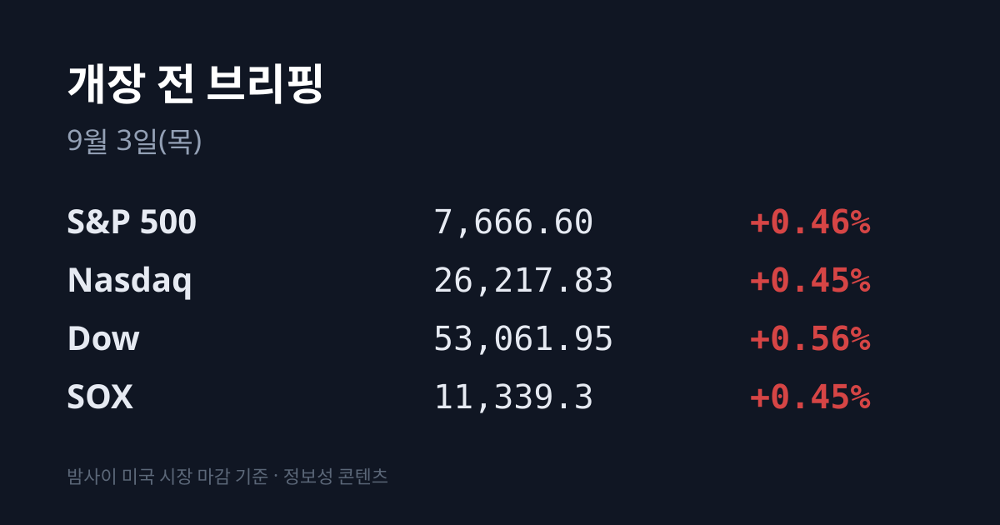
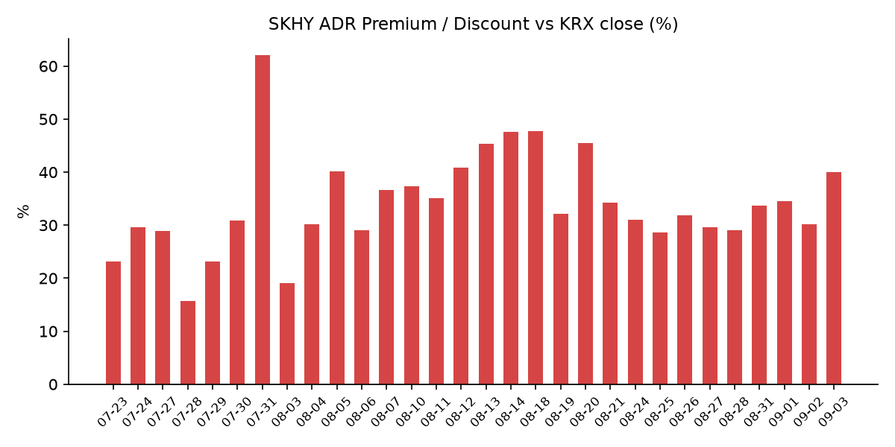
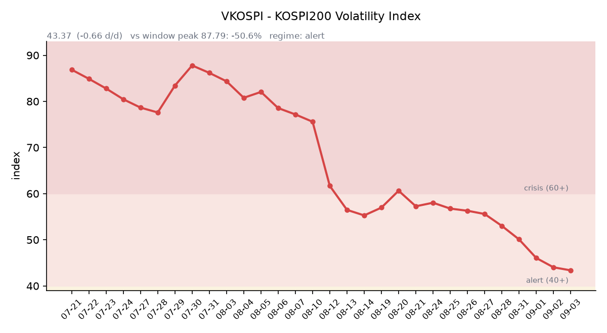

## ① 30초 요약

- 미 3대 지수가 <mark>3일 연속 하락을 끊고 반등</mark>했다. S&P 500 **+0.46%** · 나스닥 **+0.45%** · 다우 **+0.56%**, 필라델피아 반도체(SOX)는 11,339.3(**+0.45%**)으로 마감했다. 러셀2000이 +1.13%로 대형주를 두 배 이상 앞섰다.
- 미 8월 ADP 민간고용이 **+3.8만명**(시장 예상 +4.7만, 7월 +4.6만)으로 1월 이후 가장 약하게 나왔다. 미 10년물은 장중 4.818%(2023년 11월 이후 최고)를 찍고 4.804%로 되밀렸고, <mark>9월 FOMC 인상 확률은 66.1%에서 약 57%로 내려왔다</mark>.
- SK하이닉스 본주는 어제 −4.73%였는데 ADR(SKHY)은 +2.61%였다. 그 결과 <mark>괴리율이 +39.99%로 08/20(+45.5%) 이후 최고</mark>가 됐다(전일 +30.14%).
- 브로드컴이 오늘 06:00 KST에 FY26 3분기 실적을 발표했다. AI 반도체 매출 **$167억**(시장 예상 $152억), 4분기 AI 반도체 가이던스 **$217억**(전년비 +236%)이었으나 4분기 총매출 가이던스 $348억은 예상($350.3억)에 못 미쳤다. 시간외에서 −5~7% 급락 후 +0.07%까지 회복했다.
- 어제 코스피는 **−3.99%**(6,562.72)로 아시아 주요 지수 중 가장 크게 빠졌다. 외국인은 코스피에서 1조9,093억원을 순매도했다.

## ② 밤사이 미국 시장

| 지수 | 종가 | 등락률 |
| :--- | ---: | ---: |
| S&P 500 | 7,666.60 | +0.46% |
| 나스닥 | 26,217.83 | +0.45% |
| 다우 | 53,061.95 | +0.56% |
| 러셀 2000 | 2,953.17 | +1.13% |
| 필라델피아 반도체(SOX) | 11,339.3 | +0.45% |

3일 연속 하락을 끊은 반등이었고, S&P 500 11개 업종 중 9개가 올랐다(소재 +1.6%, 부동산 −0.6%). 지수를 끌어올린 것은 개별 실적과 금리였다. **델 테크놀로지스가 +13%** 로 전일 시간외 상승(+9~10%)을 정규장에서 확대 확인했고, **엔비디아가 3% 넘게 올라** 다우 상승분 295포인트의 주동력이 됐다. 반면 팔로알토 네트웍스는 4분기 전망이 시장 예상을 넘겼음에도 −10%로 마감했다. 러셀2000이 대형주를 두 배 이상 앞선 것은 금리 진정에 따른 위험선호가 중소형주까지 번졌음을 보여준다.

금리 쪽 배경은 고용지표였다. 미 8월 ADP 민간고용이 **+3.8만명**으로 시장 예상(+4.7만)과 7월치(+4.6만)를 모두 밑돌아 1월 이후 최저를 기록했다. 미 10년물 국채금리는 장중 **4.818%(2023년 11월 이후 최고)** 를 찍은 뒤 4.804%(+0.7bp)로 되밀렸고, 30년물은 5.286%(+2bp)였다. 09/01 확정치 기준 2년물은 4.39%, 10년–2년 스프레드는 +40bp, 10년물 실질금리(TIPS)는 2.44%였다. CME FedWatch 기준 9월 FOMC 인상 확률은 전일 66.1%에서 **약 57%** (Kalshi 59%)로 내려왔다. 현 목표범위는 3.50~3.75%다.

원자재와 변동성 지표도 같은 방향이었다. 국제유가는 이틀 연속 5%대 급등 뒤 사실상 멈춰 **브렌트 $94.86(+0.23%) · WTI $90.76(+0.60%)** 로 마감했다. 다만 절대 레벨은 여전히 높고, 한국의 기준유종인 두바이유는 09/01에 이미 $99.91이었다(09/02 확정치는 공표 전이다). VIX는 15.22(−1.12, **−6.85%**)로 내렸고, 달러인덱스는 99.56(−0.12%)이었다. 금은 소스에 따라 $4,334(전일 $4,331 대비 +$3)와 $4,377.15(+1.12%)로 갈렸는데, 어느 쪽이든 방향은 보합~소폭 상승이었다. 금이 오르는 동안 달러가 내리고 명목금리가 진정된 조합은 순수한 위험회피(금↑+달러↑)와는 다른 국면이다.

한편 미국 밖에서는 반대 방향의 기록이 나왔다. **일본 10년물 국채금리가 장중 3.015%** 로 1996년 이후 30년 만의 최고치를 기록했고, 영국 30년물은 5.919%(1998년 이후 최고), 독일 10년물은 3.339%(2011년 이후 최고)였다. 일본은행(BOJ)의 9월 인상 확률은 90%를 넘는 것으로 집계됐다(현 일본 정책금리 1%). 닛케이신문은 "전 세계 금리 인상 뒤 주가가 폭락한 1987년 블랙먼데이의 재현 우려"가 있다고 보도했다.

정규장 마감 후에는 브로드컴이 FY26 3분기 실적을 발표했다(**09/03 06:00 KST**). 매출 $295.9억(시장 예상 $293.6억, 전년비 +86%), 조정 EPS $3.32(예상 $3.24), **AI 반도체 매출 $167억**(예상 $152억, 전년비 3배 이상), 순이익 $130.9억이었다. 4분기 AI 반도체 가이던스는 **$217억(전년비 +236%)** 로 예상을 소폭 넘겼으나, 4분기 총매출 가이던스 $348억은 예상 $350.3억에 미달했다. 주가는 발표 직후 시간외에서 −5~7% 급락한 뒤 낙폭을 줄여 작성 시각 **$367.50(+0.07%)** 로 사실상 원상 회복했다(정규장 종가 $367.24, −0.66%). Hock Tan CEO는 "커스텀 AI 가속기와 네트워킹 수요는 계속 매우 강하다"고 밝혔다. 아폴로 글로벌 매니지먼트와 블랙스톤이 앤스로픽의 브로드컴 설계 구글칩 구매용으로 약 360억달러 규모 부채 조달을 추진 중이라는 내용도 함께 전해졌다. JP모간은 브로드컴의 2027년 AI 매출을 $1,300억으로 봤는데, 이는 회사 가이던스 $1,000억을 넘는 수치다. 국내와 연결되는 지점도 확인됐다 — **삼성전자가 AMD에 이어 브로드컴에도 5세대 HBM(HBM3E)을 공급한다**.

작성 시각(07:10 KST) 미 지수선물은 S&P 500 선물 7,673.75(−0.04%), 나스닥100 선물 29,158.50(−0.10%), 다우 선물 53,119.00(0.00%)이었다.

## ③ 괴리율 트래커 — SK하이닉스 ADR

| 항목 | 수치 |
| :--- | ---: |
| SKHY 종가 (09/02) | $164.98 (+2.61%) |
| SKHY 시간외 | $164.39 (−0.36%) |
| 본주 환산가 (×10×1,368.7원) | 2,258,081원 |
| 본주 직전 종가 (09/02) | 1,613,000원 |
| **괴리율** | **+39.99%** |
| 전일 괴리율 | +30.14% |

어제 같은 회사의 두 가격이 정반대로 움직였다. 본주는 −4.73%였고 ADR은 +2.61%였다 — 하루에 7.34%포인트가 갈라졌다. 그 결과 괴리율은 전일 +30.14%에서 **+39.99%** 로 9.85%포인트 뛰었고, 이는 08/20(+45.5%) 이후 최고치다(트래커 최고치는 07/31의 +62.0%). 최근 밴드가 +28.6~+34.55%였으므로 상단을 벗어난 수준이다.

괴리율의 구조적 의미는 이렇다. 프리미엄(+)은 미국에서 거래되는 ADR 가격이 한국 본주보다 높다는 뜻이고, 전환 차익거래 구조상 **본주 쪽에 매수 유인이** 생기는 상태다. 반대로 디스카운트(−)는 본주 쪽에 매도 유인이 생긴다. 다만 SK하이닉스 ADR은 정식 상장이 아닌 장외 프로그램이어서 전환이 자유롭지 않고, 괴리가 곧바로 메워지지 않는다는 점을 함께 봐야 한다. 즉 +40%라는 숫자가 하루 안에 해소되는 성질의 것은 아니다.

지수 전체를 보는 프록시인 **EWY(iShares MSCI South Korea ETF)** 는 $178.86(**+1.74%**)으로 마감하고 시간외에 $179.43(+0.32%)으로 더 올랐다. 코스피가 −3.99%로 마감한 날에 미국 투자자들이 매긴 한국 시장 전체의 가격이 +1.74%였다는 뜻이다. 브로드컴 실적은 EWY 시간외 시점에 이미 공개된 상태였다.

## ④ 변동성 트래커 🌡️

**판정 한 줄**: <mark>'경보' 유지, 방향은 진정 — 그런데 어제 코스피가 −3.99%였던 날에도 VKOSPI는 오히려 내렸다</mark>. 8거래일 연속 하락이며, 장중 고점도 43.43에 그쳤다.

**기대 변동성**  VKOSPI **43.37**(전일비 −0.66, **−1.50%**), 장중 42.80~43.43. **40~60 = '경보'** 구간이다(25 미만 평시 / 25~40 주의 / 40~60 경보 / 60 이상 위기). **8거래일 연속 하락**이며 6월 고점 96.94 대비 **−55.3%**, 평시 상단(25)의 **1.73배** 수준이다. 특기할 점은 코스피가 −3.99% 급락한 날에 기대 변동성이 오히려 낮아졌다는 것이다 — 옵션시장이 어제의 낙폭에 추가 프리미엄을 붙이지 않았다는 의미로 읽힌다.

**실현 변동성**  09/02 코스피 **−3.99%**, 09/01 +0.23%. 이번 회차에서 ±3.5%를 넘긴 날은 09/02 하루다. 그 이전 거래일의 일별 등락률은 이번 브리핑에 집계하지 않았다.

**매매 정지**  09/02 사이드카·서킷브레이커 발동 여부는 **집계 시점 기준 미확인**이다. 당일 개장 시황과 마감 시황 어디에도 발동 기록이 없었고, 개장은 6,613.58(−2.58%)이었다.

**증폭 경로**  단일종목 레버리지 ETF의 당일 거래 비중·회전율은 집계 시점 기준 미확인이다.

**청산 압력**  신용융자 잔고 **33조3,380억원**(08/28 기준, 9거래일 연속 증가), 위탁매매 미수금 반대매매 470억원, 미수금 9,303억원(모두 08/28 기준). 그 이후 4거래일 — 어제의 −3.99% 급락을 포함한 — 수치는 아직 공표되지 않았다.

**하방 포지션**  공매도 순잔고는 코스피 19조4,480억원, 코스닥 7조3,300억원이다. **T+3 공시 지연으로 08/12 기준**이라는 점을 명시한다.

*미확인 항목*: 09/02 사이드카·서킷브레이커 발동 여부, 코스피200 야간선물, 레버리지 ETF 당일 거래 비중·회전율, 09/01~09/02 기준 신용융자·반대매매·미수금, 프로그램 매매 차익·비차익, 선물 베이시스.

## ⑤ 어제 한국장 리뷰

| 지수 | 종가 | 등락 |
| :--- | ---: | ---: |
| 코스피 | 6,562.72 | −273.08 (**−3.99%**) |
| 코스닥 | 803.98 | −17.27 (−2.10%) |

어제 코스피는 아시아 주요 지수 중 가장 크게 빠졌다. 같은 날 닛케이는 64,325.64(−2.85%), 대만 가권은 46,164.72(−1.67%), 상해종합은 3,941.39(−0.97%), 항셍은 25,311.21(−0.07%)이었다. 개장은 6,613.58(−2.58%)이었고, 장중 낙폭이 확대돼 마감했다.

**실제 수급 확정치.** 코스피에서 외국인이 **1조9,093억원 순매도**, 기관이 2조400억원 순매도, 개인이 2조3,000억원 순매수였다(미디어워치 집계). 다른 집계에서는 기관 순매도를 2조4,000억원, 외국인·기관 합산 순매도를 약 4조3,000억원으로 잡았는데, 소스 간 기관 수치에 약 3,600억원 편차가 있어 둘을 함께 적는다. 외국인의 순매도 규모는 08/31 4,435억원, 09/01 5,331억원에서 3.6~4.3배로 재확대된 것이다. 참고로 8월 한 달 외국인의 코스피 순매도는 10조1,600억원이었고, 그중 **반도체가 7조1,300억원**(SK하이닉스 6조4,000억원, 삼성전자 8,200억원)이었다. 반면 코스닥에서는 기관이 2,322억원을 순매도한 가운데 **외국인이 618억원을 순매수**했고 개인도 1,728억원 순매수였다.

**개별 종목.** 삼성전자는 250,500원(**−4.02%**), SK하이닉스는 1,613,000원(**−4.73%**)으로 마감했다. 두 종목의 하락 배경으로는 미국과 이란의 무력충돌 재개에 따른 국제유가·미 국채금리 동반 급등, 그리고 중국 CXMT(창신메모리)가 HBM3E를 소량 생산하고 있다는 보도에 따른 경쟁 심화 우려가 함께 지목됐다. KB증권 임정은 연구원은 "미국 시장이 3일 연속 하락하며 지정학적 리스크가 이어지는 가운데 고금리·고유가가 압력을 더해 국내 시장의 위험회피 심리가 강해졌다"고 분석했다. 그 외 낙폭이 컸던 종목은 SK스퀘어 −7.97%, HD현대일렉트릭 −7.54%, 현대차 −5.62%, 에코프로비엠 −7.06%(코스닥), 서딘시스템즈 −9.24%(코스닥)였다.

**원/달러 환율.** 어제 서울 외환시장 주간 종가는 **1,368.7원**(전일 대비 −1.7원, −0.12%)이었다. 코스피가 −3.99% 빠지는 동안 원화는 오히려 강해졌다. 작성 시각(09/03 07:18 KST) 현재값은 **1,357.14원** 으로, 어제 주간 종가보다 11.56원, 야간 종가(1,373.83원)보다 16.69원(−1.21%) 낮은 수준이다.

## ⑥ 오늘의 캘린더 & 관전 포인트

**오늘 일정**
- **09/03 06:00 KST** — 브로드컴 FY26 3분기 실적 발표 (완료, ② 참조)
- **오늘 밤** — 미 8월 ISM 서비스업 PMI. 8월 속보치는 56.8로 20개월 최고였다. 통상 발표 시각은 10:00 ET(23:00 KST)이나 이번 회차 정확한 시각은 미확인이다.
- **오늘 밤** — 미 주간 신규 실업수당 청구

**이번 주~이달**
- **09/04** — 미 8월 고용보고서(비농업고용). 어제 ADP가 +3.8만명으로 1월 이후 최저였던 만큼 이번 주 최대 일정이다.
- **09/08** — 캐나다의 대미 보복관세(200억달러) 발효
- **09/15~16** — FOMC (인상 확률 약 57%, 현 목표범위 3.50~3.75%)
- **9월 중** — 일본은행(BOJ) 회의. 인상 확률은 90%를 넘는 것으로 집계됐다.
- **9월 중** — 선물·옵션 동시만기
- **9월(조기 시행)** — 단일종목 레버리지 ETF·ETN 매매수량단위 1주 → 20주
- **9월 IPO 일정** (공모금액 4,721억원, 전년비 2.5배): 네오사피엔스 청약 **09/10~11**, 와이즈플래닛컴퍼니 09/14~15, 빅웨이브로보틱스 09/15~16, 덕산넵코어스·글로벌테크놀로지 09/16~17, 브릴스 09/17~18, 엘리스그룹(공모 2,011억) 수요예측 09/09~15 → 청약 **09/18~21**. 09/14~21에 청약이 집중된다.
- **10월** — 한국은행 금통위 (08/27 인상으로 기준금리 3.00%)
- **11/19** — SK하이닉스 40조원 자사주 취득 종료 / **11/21** — 삼성전자 15조원 자사주 매입 종료

**시장이 주시하는 레벨** (방향 판단이 아닌 참고 레벨)
- 시장 참가자들은 **원/달러 1,350원과 1,370원** 선을 주시하고 있다.
- 미 10년물 **4.82%** 와 **4.75%**, 30년물 **5.35%** 가 언급되는 레벨이다.
- SK하이닉스 ADR 괴리율에서는 **+34%** 와 **+40%** 가 최근 밴드(+28.6~+34.55%)와의 경계로 언급된다.
- **일본 10년물 3.0%** 는 어제 30년 만에 처음 넘긴 레벨이다.
- 두바이유 **$100** 선이 주시되고 있다. 09/01 종가는 $99.91이었고 09/02 확정치는 공표 전이다.
- VKOSPI에서는 '주의' 구간 경계인 **40**, '경보' 구간 내 **48**이 언급된다.

## ⑦ 정책 워치

- **공매도 제도**: 2025년 3월 31일 재개 이후 유지되고 있다. 무차입 공매도 방지시스템 구축이 법인과 수탁 증권사에 의무화됐고, 개인투자자도 기관과 동일한 상환기간(기본 90일, 최대 12개월)과 담보비율(105%)을 적용받는다. 이번 회차에 제도 변경은 없었다.
- **호르무즈 해협**: 08/31 자정 무렵 피격된 유조선 2척의 신원이 확인됐다. 장금상선이 용선한 '세네갈 프로스페리티'호(라이베리아 선적)와 사우디 아람코 소유 '시드르'호다. 해양수산부는 **해당 선박이 한국 국적선이 아니고 한국인 선원도 승선하지 않았으며, 인명·환경 피해도 없었다**고 밝혔다. 피격 시점은 08/30 미군의 라라크섬 이란 로켓발사대 공습 직후였다. 그 후 미군은 호르무즈 인근 이란 표적에 추가 공습을 단행했다.
- **미중**: 반도체 관세 2차 라운드의 발표일은 여전히 미정이다.
- **단일종목 레버리지 ETF·ETN**: 매매수량단위가 1주에서 20주로 바뀌는 조치가 당초 11월에서 9월로 앞당겨져 시행된다.

## ⑧ 오늘의 질문

어제 코스피가 아시아에서 가장 크게 빠지는 동안 미국이 매긴 한국 가격(EWY +1.74%)과 SK하이닉스 ADR 괴리율(+39.99%)은 반대로 벌어졌는데, 이 격차를 좁히는 쪽은 어디가 될 것인가.

---
*본 글은 공개된 시장 데이터를 정리한 정보성 콘텐츠이며, 특정 종목·상품의 매매 권유가 아닙니다. 모든 투자 판단과 책임은 투자자 본인에게 있습니다. 수치는 작성 시점 기준이며 이후 변동될 수 있습니다.*
