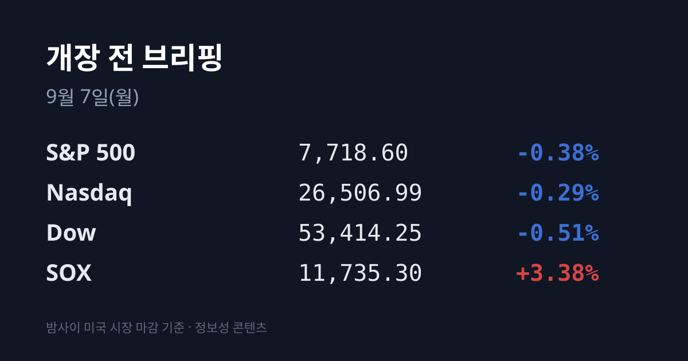
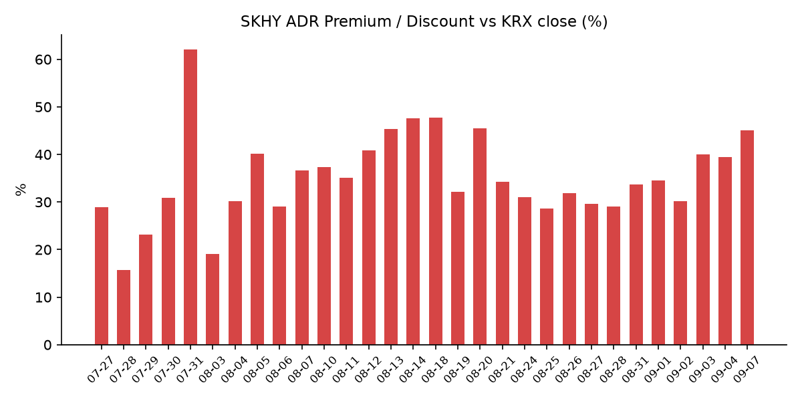
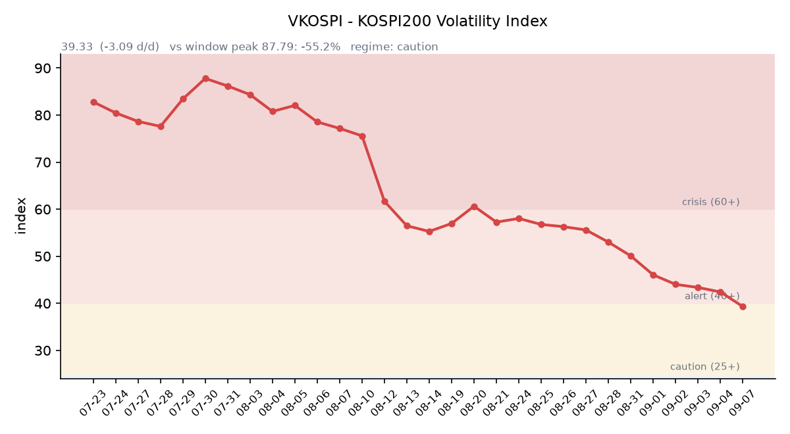

## ① 30초 요약

- 미 3대 지수가 일제히 내렸다. S&P 500 **−0.38%** · 나스닥 **−0.29%** · 다우 **−0.51%**. 그런데 <mark>필라델피아 반도체(SOX)만 11,735.3(+3.38%)으로 홀로 급등했다</mark> — 지수와 방향이 정반대다.
- 지수를 누른 것은 고용이었다. **8월 비농업고용이 16만2,000명 증가**해 시장 예상 5만3,000명의 **세 배**였고, <mark>CME FedWatch 9월 인상 확률이 58~59%로 되올라갔다</mark>(09/03 집계 약 50.3%).
- 반도체를 끌어올린 것은 **OpenAI가 09/03 출시한 GPT-6 아스트라**였다. AI가 컴퓨터·소프트웨어를 직접 조작하는 모델이라 저장장치 수요가 커진다는 해석이 돌면서 <mark>샌디스크 +11.9% · SK하이닉스 ADR +8.14% · 마이크론 +6.1%</mark>로 메모리주가 움직였다.
- <mark>SK하이닉스 ADR 괴리율은 **+45.12%**</mark> 로 전일 +39.40%에서 5.72%포인트 벌어졌다. 트래커 37거래일 중 6위이고, 08/20의 +45.5% 이후 가장 넓은 자리다.
- 어제 코스피는 6,687.21(**+1.64%**), 코스닥은 813.50(**+2.95%**)로 마감했고 <mark>외국인·기관이 6거래일 만에 함께 순매수</mark>했다. **오늘 09/07 뉴욕증시와 채권시장은 노동절로 휴장**한다.

## ② 밤사이 미국 시장

| 지수 | 종가 | 등락률 |
| :--- | ---: | ---: |
| S&P 500 | 7,718.60 | −0.38% |
| 나스닥 | 26,506.99 | −0.29% |
| 다우 | 53,414.25 | −0.51% |
| 러셀 2000 | 2,975.65 | +0.20% |
| 필라델피아 반도체(SOX) | 11,735.30 | **+3.38%** |

지수와 반도체가 정반대로 갈렸다. 지수를 누른 것은 고용지표였다. 미 노동부가 발표한 **8월 비농업 부문 고용이 16만2,000명 증가**해 시장 예상 5만3,000명을 세 배 가까이 웃돌았고, 5개월 만의 최대 증가폭이었다. 실업률은 4.1%로 예상대로 유지됐다. 강한 고용은 곧 금리 인상 가능성으로 읽혔고, **CME FedWatch 기준 9월 FOMC 인상 확률은 58~59%**(소스에 따라 58.4~65%)로 집계됐다. 09/03 시점의 약 50.3%에서 되올라간 수치다.

반대로 반도체는 홀로 올랐다. 방아쇠는 **OpenAI가 09/03 출시한 GPT-6 아스트라**였다. 컨텍스트 창 105만 토큰·출력 최대 12만8,000 토큰에 API 가격은 입력 100만 토큰당 $10, 출력 $50이며, **AI가 컴퓨터와 소프트웨어를 직접 조작해 복잡한 작업을 수행**하는 구조다. 이런 모델이 대량의 스토리지와 플래시 메모리를 소모한다는 해석이 퍼지면서 메모리 종목이 움직였다 — **샌디스크 +11.9% · SK하이닉스 ADR +8.14% · 마이크론 +6.1% · 웨스턴디지털 약 +6% · Roundhill Memory ETF +6.6%**. 마이크론 주가는 $998.385로, 2026년 들어 약 236% 올라 시가총액이 약 1조1,400억달러가 됐다.

배경에는 실적 숫자도 있었다. **2분기 세계 D램 매출은 전분기 대비 +57%, 낸드는 +70%** 증가했고, 마이크론의 선단 메모리 생산능력은 2026년 말까지 예약이 찼다. 델은 AI 서버 백로그가 950억달러로 집계됐다. UBS는 HBM 가격 상승률 전망을 연 67%에서 **79%로 상향**했다.

금리와 통화는 고용지표를 따라 움직였다. 미 재무부 확정 기준 **10년물 4.78%(+1bp) · 30년물 5.25%(보합) · 2년물 4.13%** 였고, 10년물 실질금리(TIPS)는 **2.43%**(전일 2.42%)였다. 시장 호가 기준으로는 2년물 4.379%(+4.7bp), 10년물 4.783%(+2.2bp)로 집계됐는데, 2년물은 재무부 확정치와 약 25bp 차이가 나 이번 회차에서는 **레벨만 표기하고 10년–2년 스프레드 변화는 판정하지 않았다**. 달러인덱스는 **99.18(+0.27%, 시 99.03·고 99.39·저 98.92)** 로 올랐다. VIX는 **14.32**로, 14~17 구간에 25거래일 연속 머물렀다 — 1992년 5월의 26일 기록에 하루 부족한 수치다.

원자재는 방향이 갈렸다. 한국석유공사 페트로넷 09/04 기준 **두바이유 $101.91(+$0.28) · 브렌트 $96.28(+$0.76) · WTI $91.48(+$0.18)** 였다. 한국의 기준유종인 두바이유가 브렌트보다 비싼 역전 상태는 이어졌으나 <mark>역전 폭은 $6.67에서 $5.63으로 좁아졌다</mark>. 금은 내렸다 — 12월 선물 **$4,476.60(−1.4%)**, 현물은 약 $4,432(−0.9%)였다. 금이 내리는 동안 달러인덱스는 오르고 10년물 실질금리도 +1bp 올랐다. 금과 달러가 함께 오르는 위험회피 조합이 아니라, 할인율이 올라가는 쪽의 조합이다.

USD/JPY는 **156.24(+0.40, +0.26%)** 로 전일 종가 155.844에서 엔이 소폭 약해졌다.

★ **오늘 09/07(월) 뉴욕증시와 채권시장은 노동절로 전부 휴장하며 09/08(화)에 재개장한다.** 미 지수선물도 참고 가치가 낮다.

## ③ 괴리율 트래커 — SK하이닉스 ADR

| 항목 | 수치 |
| :--- | ---: |
| SKHY 종가 (09/04) | $177.00 (+8.14%) |
| SKHY 시간외 | $175.06 (−1.10%) |
| 본주 환산가 (×10×1,350.4원) | 2,390,208원 |
| 본주 직전 종가 (09/04) | 1,647,000원 |
| **괴리율** | **+45.12%** |
| 전일 괴리율 | +39.40% |

괴리율은 전일 +39.40%에서 **+45.12%** 로 5.72%포인트 벌어졌다. 트래커 36거래일 중 **6위**이며, 최고치는 07/31의 +62.0%다. 08/20의 +45.5% 이후로는 가장 넓은 자리다. 확대의 원인은 본주가 내려서가 아니라 **ADR이 +8.14%로 크게 올랐기 때문**이다 — 본주도 09/04에 +3.20%로 올랐다.

괴리율은 미국에 상장된 ADR 가격을 본주 기준으로 환산했을 때 국내 주가와 얼마나 벌어져 있는지를 보는 지표다. 구조상 프리미엄(+)이 크면 전환 차익거래 관점에서 본주 쪽에 매수 유인이, 디스카운트(−)면 매도 유인이 생긴다. 다만 SK하이닉스 ADR은 정식 상장이 아닌 장외 프로그램이라 전환이 자유롭지 않고, 그래서 괴리가 곧바로 메워지지 않는다는 점을 함께 봐야 한다.

지수 프록시인 **EWY**(iShares MSCI South Korea ETF)는 09/04에 **$188.87(+4.60%)** 로 마감했고 거래량은 1,835만주로 전일 1,094만주의 1.68배였다. 코스피 등락(+1.64%)과 원화 강세(0.66%)로 계산되는 이론값은 약 **+2.30%** 인데 실제는 +4.60%였다. 야후 파이낸스에 표기된 EWY 시간외 가격($180.44)은 전일 종가 $180.56과 사실상 같은 값이라 스테일 호가로 판단해 이번 회차에서는 채택하지 않았다.

## ④ 변동성 트래커

**판정 한 줄**: <mark>'주의'로 한 단계 내려왔다 — VKOSPI 39.33이 02/12 이후 약 7개월 만에 40선을 내줬고, 실현 변동폭도 09/04에 1.70%로 최근 5거래일 중 가장 좁았다.</mark>

**기대 변동성** — VKOSPI **39.33**(전일비 **−3.09, −8.29%**). 구간 기준으로 **25 미만 평시 / 25~40 주의 / 40~60 경보 / 60 이상 위기** 중 **'주의'** 에 해당한다. 6월 고점 96.94 대비 **−59.4%**, 평시 상단 25의 **1.57배** 수준이다. 02/12 이후 처음으로 40선 아래에서 마감했다.

**실현 변동성** — 최근 5거래일 코스피 일중 변동폭(고가−저가)/종가는 08/31 **3.99%** · 09/01 **1.83%** · 09/02 **2.08%** · 09/03 **3.70%** · 09/04 **1.70%** 로 평균 **2.66%** 였다. 09/04은 이 중 가장 좁았다. 같은 6거래일 중 종가가 ±3% 이상 움직인 날은 09/02(−3.99%) 하루였다.

**증폭 경로** — 단일종목 레버리지 ETF의 당일 거래 비중·회전율은 집계 시점 기준 미확인이다. 제도 쪽은 ⑦ 정책 워치에 정리했다.

**청산 압력** — 신용융자 잔고는 최신 확보치가 **08/28 기준 33조3,380억원**(미수금 9,303억원, 반대매매 47억원)이며 09/01~09/04치는 공표 전이다. 여기에 08/31 기준 28조9,350억원이라는 다른 집계가 함께 검색돼 **레벨 자체가 소스 간에 어긋나 있다** — 이번 회차에서는 판정하지 않았다.

**하방 포지션** — 공매도 순잔고는 **08/12 기준**이 최신이다(코스피 19조4,480억원·코스닥 7조3,300억원). 공매도 잔고는 **T+3 공시 지연**이 있어 개장 전 시점에서는 구조적으로 최신치를 알 수 없다.

미확인 항목: 코스피200 야간선물(11일째), 프로그램 매매 차익·비차익, 선물 베이시스, 레버리지 ETF 당일 회전율, 09/01~09/04 신용융자·반대매매 집계.

## ⑤ 어제 한국장 리뷰

| 지수 | 종가 | 등락률 |
| :--- | ---: | ---: |
| 코스피 | 6,687.21 | +1.64% |
| 코스닥 | 813.50 | +2.95% |

코스피는 **6,687.21(+107.73, +1.64%)** 로 6,600선을 회복했고, 코스닥은 **813.50(+23.29, +2.95%)** 로 5거래일 만에 상승 전환하며 800선을 되찾았다. 장중 경로는 시가 6,654.36(+1.14%) → 저점 6,632.77 → 고점 6,746.14 → 종가 6,687.21로, 일중 변동폭은 1.70%였다.

수급은 <mark>외국인 +4,793억원 · 기관 +1조6,691억원 · 개인 −3조7,224억원</mark>이었다. **외국인과 기관이 6거래일 만에 동시 순매수**로 돌아섰고, 외국인은 나흘 연속 이어지던 순매도를 끊었다. 코스닥에서도 외국인 +262억원 · 기관 +160억원 · 개인 −412억원으로 방향이 같았다. 다만 08/24~09/04 누적으로 보면 기타법인 +14조5,129억원 · 외국인 −3조5,000억원 · 기관 −3조7,000억원이어서, 09/04 하루의 외국인 순매수는 누적 순매도의 7분의 1 수준이다.

**삼성전자·SK하이닉스가 하루 약 1조6,000억원 규모의 자사주를 사들였다.** 09/02 기준 잔여 물량은 삼성전자가 예정 수량의 73.0%·금액의 72.6%, SK하이닉스가 수량의 70.0%·금액의 73.0%로 집계됐다. 취득 종료 예정일은 SK하이닉스 11/19, 삼성전자 11/21이다.

종목별로는 **SK하이닉스 1,647,000원(+3.20%)**, **삼성전자 255,500원(+2.20%)** 로 반도체 대형주가 지수를 끌었다. SK하이닉스는 외국인 패시브 자금 유입과 반도체 업황 회복 기대가 이유로 언급됐다. 코스닥에서는 로봇과 반도체 소부장이 두 축이었다 — **로보티즈 +22.54%**, **TPC로보틱스 상한가 +30%(3,965원)**, 원익홀딩스 +29.90%였고 상한가 종목이 11개였다. 반면 <mark>대형 금융주는 되밀렸다 — KB금융 −2.7%, 신한지주 −2.45%</mark>였다.

로보티즈 급등의 배경은 실적이었다. 2분기 매출 154억원(전년 동기 대비 +95%), 영업이익 20억원(+723%)으로 1분기 적자에서 흑자 전환했고, **중국 매출이 최근 2년 평균 5억원에서 2분기 15억원으로 3배** 늘어 비중이 9.7%가 됐다. 출하는 북미 +142.4%, 중국 +154.0%였다. 여기에 **미 FCC의 수입 규제로 중국 업체의 미국 진출이 막힌 상황**이라는 분석이 붙었다.

원/달러는 **서울 주간 종가 1,350.4원(−8.9원)** 으로 약 14개월 만의 최저 수준이었다. 같은 날 한국은행이 발표한 **7월 경상수지는 420억8,000만달러 흑자**로 동월 기준 역대 최대, 월간 기준 역대 2위였다(6월 497억3,000만달러에 이어). 2023년 5월부터 **39개월 연속 흑자**이며, 상품수지 404억3,000만달러 흑자에 수출은 1,004억5,000만달러로 두 달 연속 1,000억달러를 넘었다. 올해 7월까지 누적 흑자는 2,330억9,000만달러로 전년 동기(598억2,000만달러)의 약 4배다. 작성 시각(07:00 KST 전후) 원/달러는 **1,345.58원**을 기록 중이다.

아시아 증시는 09/04에 함께 올랐다 — 닛케이225 64,769.74(+0.86%), 상해종합 3,961.69(+0.49%), 대만 가권 +0.65%, 항셍 +2.2%였다(일부 소스가 오전장 기준과 종가를 혼용해 표기하고 있어 대만 가권 종가 레벨은 미확인이다).

## ⑥ 오늘의 캘린더 & 관전 포인트

- **09/07(월) — 미국 노동절.** 뉴욕증시와 채권시장이 전부 휴장하며 09/08(화)에 재개장한다.
- **09/09 — 미 10년물 국채 입찰 / 09/10 — 30년물 입찰.** 10년물이 4.78%로 2023년 11월 이후 최고 구간에 있어 입찰 소화 여부가 관심사로 언급된다.
- **09/10 21:30 — 미 8월 생산자물가지수(PPI).**
- **09/10 미 장마감 후(09/11 새벽 KST) — 오라클·어도비 실적 발표.**
- **09/11 21:30 — 미 8월 소비자물가지수(CPI).** 시장 컨센서스는 전월비 +0.4%(7월 +0.1%), 전년비 3.4% 유지, 근원 전년비 2.4%(0.1%p 하락)다.
- **09/15~16 — FOMC**(현 목표범위 3.50~3.75%, CME 기준 인상 확률 58~59%). 결과와 점도표 공개는 **09/17 03:00 KST**.
- **09/18 — 선물·옵션 동시만기(네 마녀의 날).**
- **9월 IPO 일정**(공모금액 4,721억원, 전년비 2.5배): 네오사피엔스 청약 09/10~11 · 와이즈플래닛컴퍼니 09/14~15 · 빅웨이브로보틱스 09/15~16 · 덕산넵코어스·글로벌테크놀로지 09/16~17 · 브릴스 09/17~18 · 엘리스그룹(공모 2,011억원) 수요예측 09/09~15 → 청약 09/18~21. **09/10~21에 청약이 집중된다.**
- **09/06~09 — 대통령 프랑스 국빈방문**(AI·우주·원자력·바이오 등 협력 의제).
- **10월 — 한은 금통위**(08/27 인상으로 기준금리 3.00%). **11/19 — SK하이닉스 자사주 취득 종료 / 11/21 — 삼성전자 자사주 매입 종료.**

**시장이 주시하는 레벨** — 원/달러는 09/04 서울 종가 1,350.4원에서 작성 시각 1,345.58원 구간이고, 1,340원선과 1,360원선이 언급되는 자리다. SK하이닉스 ADR 괴리율은 +45.12%이며 트래커 밴드의 위쪽 끝은 07/31의 +62.0%, 최근 밴드는 +28.6~+45.5% 구간이다. 두바이-브렌트 역전 폭은 $5.63이고 두바이유는 $101.91로 $100 위에 있다. USD/JPY는 156.24로, 154선과 158선이 엔캐리 관련 참고 레벨로 거론된다. VKOSPI는 40선을 아래로 통과한 직후다.

## ⑦ 정책 워치

- **단일종목 레버리지 ETF·ETN의 매매수량단위가 1주(1증권)에서 20주(20증권)로 확대된다.** 당초 11월 시행 예정이었으나 과열을 조기에 진정시켜야 한다는 지적에 따라 **9월로 앞당겨졌다**. 신규 개인투자자는 5거래일 이상, 하루 1시간씩 총 5시간의 모의거래를 의무 이수해야 하고, LP 증권사의 괴리율 관리 책임도 강화된다 — 고의·중과실이나 상습 위반 시 거래소가 해당 증권사의 신규 종목 유동성 공급 업무를 제한할 수 있다.
- **공매도 제도**는 코스피200·코스닥150 부분 재개가 유지되고 있다. 2026년부터 기관·법인의 전산 시스템 구축이 의무화(거래소 NSDS 실시간 연동)됐고, 상환기간은 90일 단위 최대 12개월, 담보비율은 개인·기관 모두 105%로 통일됐다.
- **09/04 — 관계기관 합동 시장상황점검회의**가 전국은행연합회관에서 열려 국내외 금융·외환시장과 부동산시장 동향을 점검했다.

## ⑧ 오늘의 질문

<mark>미 3대 지수가 내린 날에 반도체만 +3.38% 오른 이 격차를, 오늘 미국이 휴장한 채로 한국 시장이 어떻게 값을 매길 것인가.</mark>

---
*본 글은 공개된 시장 데이터를 정리한 정보성 콘텐츠이며, 특정 종목·상품의 매매 권유가 아닙니다. 모든 투자 판단과 책임은 투자자 본인에게 있습니다. 수치는 작성 시점 기준이며 이후 변동될 수 있습니다.*
