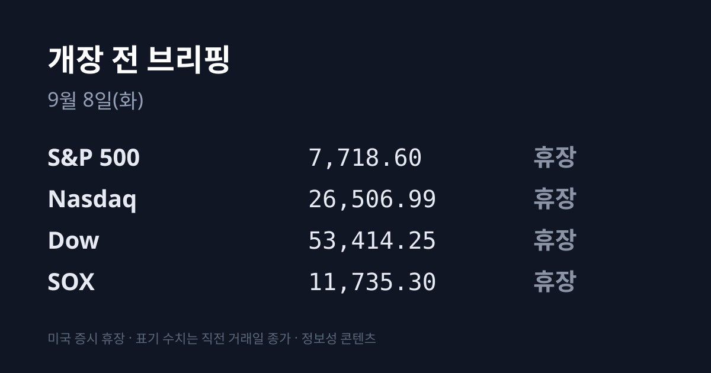
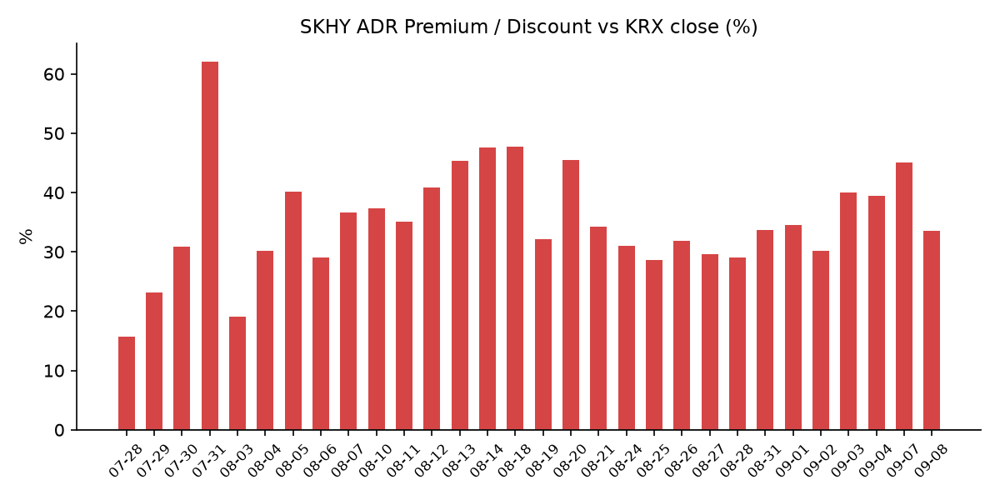
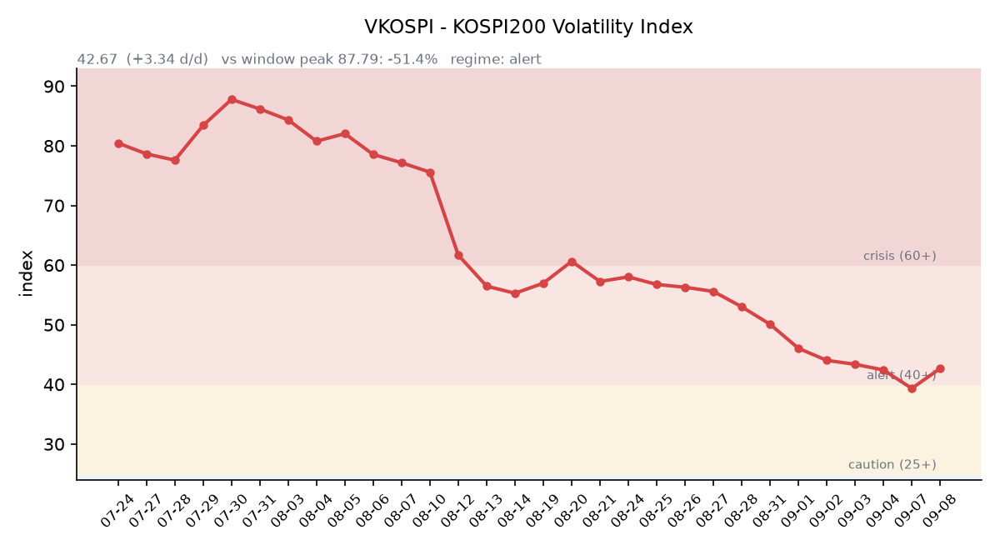

## ① 30초 요약

- <mark>9월 7일 뉴욕증시·채권시장은 노동절로 전면 휴장</mark>했습니다. 밤사이 미국 정규장 세션이 없었고, 미 3대 지수·SOX·국채 금리는 모두 **9월 4일 종가**가 최신입니다. 재개장은 오늘 22:30(KST)입니다.
- 코스피는 <mark>6,995.39(+308.18p, +4.61%)</mark>로 마감했습니다. 시가 6,910.78(+3.34%)로 출발해 **장중 고점 6,995.40에서 그대로 마감**했습니다. 코스닥은 822.19(+1.07%)였습니다.
- SK하이닉스 **178만3,000원(+8.26%)**, 삼성전자 **27만원(+5.68%)** 이 지수를 끌었습니다. 배경은 오픈AI 'GPT-6 아스트라'發 메모리 수요 서사와 SK하이닉스의 1c D램 공정 전환 가속입니다.
- SK하이닉스 ADR 괴리율은 <mark>+45.12% → +33.6%로 11.5%포인트 축소</mark>됐습니다. ADR이 내린 것이 아니라 **본주가 하루 만에 따라 올라간 결과**입니다(미 증시 휴장으로 ADR은 9월 4일 종가 그대로).
- 밤사이 실제로 움직인 시장은 원유였습니다. <mark>브렌트 $97선(6주 만의 최고)</mark>, 5거래일 +9%. 미·이란이 호르무즈에서 서로 유조선을 타격하는 국면이 재개됐습니다.

## ② 밤사이 미국 시장

**9월 7일(현지시간) 뉴욕증권거래소와 나스닥은 노동절로 전면 휴장했습니다.** 채권시장도 함께 쉬었습니다. 따라서 아래 수치는 모두 **9월 4일 종가**이며, 밤사이 갱신된 것이 없습니다.

| 지수 | 종가(09/04) | 등락률 |
| :--- | ---: | ---: |
| S&P 500 | 7,718.60 | −0.38% |
| 나스닥 종합 | 26,506.99 | −0.29% |
| 다우존스 | 53,414.25 | −0.51% |
| 필라델피아 반도체(SOX) | 11,735.30 | **+3.38%** |

지수 선물은 노동절 단축장이 끝난 뒤 재개장 직후 기준(07:15 KST)으로 **S&P 500 선물 7,709.00(−0.17%), 나스닥100 선물 29,586.75(+0.07%), 다우 선물 53,112(−0.61%)** 를 기록 중입니다. 휴일 직후라 거래가 얇고, **어제 아시아가 만든 상승분을 미국이 아직 한 번도 가격에 반영하지 않은 상태**입니다.

미 국채 금리도 휴장으로 9월 4일 확정치가 최신입니다. **10년물 4.78%**, 30년물 5.25%, 10년물 실질금리(TIPS) 2.43%입니다. 2년물과 10Y−2Y 스프레드는 갱신 자체가 없었습니다. VIX는 14.32(9월 4일)로 14~17 밴드에 25거래일 연속 머물렀습니다. CME FedWatch 기준 9월 FOMC 인상 확률은 9월 4일 시점 **58~59%**(소스별 58~66% 편차)이며, 휴장으로 갱신되지 않았습니다.

**밤사이 유일하게 움직인 시장은 원유입니다.** 브렌트는 <mark>$97선까지 올라 6주 만의 최고</mark>를 기록했고 장중 $98을 넘겼다가 되밀렸습니다. 5거래일 +9%, 1개월 +19%로, 이란 전쟁 발발 전 대비 약 40% 높은 수준입니다. 배경은 미·이란 교전 재개입니다. 미군이 이란 라라크섬 로켓발사대를 타격한 뒤(혁명수비대가 호르무즈에 기뢰를 부설하려 했다는 명분), 이란이 호르무즈에서 유조선·미국 연계 선박 6척을 공격했다고 주장했고, 미 중부사령부는 이란 원유 수송선 3척(M/T Downy·M/T Stark 1·M/T Kylo)을 타격했습니다. **현지시간 9월 7일에도 추가 공습이 있었습니다.** 8월 31일에는 **한국 해운사 장금상선 소유 유조선을 포함한 선박 2척**이 피격됐고, UAE 국영 유조선 피격으로 선원 1명이 사망하고 8명이 다쳤습니다.

한국석유공사 페트로넷 기준(9월 4일 확정) **두바이유 $101.91, 브렌트 $96.28, WTI $91.48**입니다. **두바이유가 브렌트보다 $5.63 비싼 역전 상태가 이어지고 있습니다.** 한국은 원유 수입 기준유종이 브렌트가 아니라 두바이유이므로, 브렌트 헤드라인만 보면 이 격차가 보이지 않습니다. 금은 9월 4일 −2%인 온스당 약 $4,380이었고, 달러인덱스(DXY)는 99.14(9월 7일 기준, 사실상 보합)입니다.

## ③ 괴리율 트래커 — SK하이닉스 ADR

| 항목 | 수치 |
| :--- | ---: |
| SKHY 종가 | $177.00 (+8.14%) |
| 본주 환산가 (×10×환율) | 2,381,305원 |
| 본주 직전 종가 | 1,783,000원 |
| **괴리율** | **+33.6%** |

※ 환율은 작성 시각(07:15 KST) 1,345.37원 기준입니다. **미 증시 휴장으로 SKHY 종가는 9월 4일치가 최신**이며, 시간외 $175.06(−1.10%)도 같은 날 값입니다.

전 거래일 **+45.12%에서 11.5%포인트 축소**됐습니다. 축소의 원인이 어느 쪽인지가 이 표에서 가장 중요한 정보입니다. **ADR이 내려서가 아니라 본주가 하루 만에 +8.26% 올라 따라잡았기 때문**입니다. 미 증시가 쉬는 동안 분자(ADR 환산가)는 고정돼 있었고 분모(본주)만 커진 구조입니다.

괴리율은 '같은 회사의 주식이 서울과 뉴욕에서 다른 값에 거래되는 정도'를 나타냅니다. 프리미엄(+)은 뉴욕 쪽이 비싸다는 뜻이라 전환 차익거래 구조상 본주 쪽에 매수 유인이, 디스카운트(−)면 반대 유인이 생깁니다. 다만 SK하이닉스 ADR은 정식 상장이 아닌 장외 프로그램이라 전환이 자유롭지 않고, 괴리가 곧바로 메워지지 않는 구조입니다. **+33.6%는 이 트래커 38거래일 중 20위로 중간값 부근이며, 최고치는 7월 31일의 +62.0%였습니다.**

같은 계산을 한국 시장 전체 ETF에 적용해도 결과가 비슷합니다. **EWY(iShares MSCI South Korea ETF)는 9월 4일 $188.87(+4.60%)로 마감했고, 어제 코스피 실제 등락률은 +4.61%였습니다.** 0.01%포인트 차이입니다. SKHY도 ADR +8.14% 대비 본주가 +8.26%로 마감해, **밤사이 미국 투자자가 매긴 값과 어제 서울이 매긴 값의 격차가 양쪽 모두 0에 수렴한 상태**입니다.

## ④ 변동성 트래커 🌡️

**판정 한 줄**: <mark>'경보' 재진입 — VKOSPI가 하루 만에 40선 위로 되올라왔고, 지수가 4.61% 오른 날에 기대변동성이 8.49% 함께 올랐다</mark>. 상승을 안도가 아니라 진폭 확대로 읽은 흐름이다.

**기대 변동성**  VKOSPI **42.67(전일 39.33 대비 +3.34, +8.49%)**. 구간 기준으로 25 미만 평시 / 25~40 주의 / 40~60 경보 / 60 이상 위기이며, **현재는 '경보'** 구간이다. 전 거래일 하루 '주의'로 내려갔다가 되돌아왔다. 6월 고점 96.94 대비 **−56%**, 평시 상단(25)의 **1.7배** 수준이다.

**실현 변동성**  9월 7일 일중 변동폭(고가−저가 ÷ 종가) **1.82%**, 9월 4일 1.70%, 9월 3일 3.70%였다. 최근 등락률은 9월 2일 −3.99%, 9월 3일 −0.85%, 9월 4일 +1.64%, 9월 7일 +4.61%로, **7거래일 중 ±3.5% 이상인 날이 2일**이다.

**증폭 경로**  단일종목 레버리지 ETF의 당일 거래 비중·회전율은 집계 시점 기준 미확인이다. 제도 쪽에서는 매매수량단위를 1주에서 20주로 올리는 조치가 9월에 조기 시행됐다.

**청산 압력**  신용융자 잔고는 **8월 28일 기준 33조3,380억원**(9거래일 연속 증가), 위탁매매 미수금 9,303억원, 반대매매 47억원이 최신 확보치다. **6거래일째 갱신되지 않았고**, 8월 31일 기준 28조9,350억원이라는 상충 보도가 남아 있어 현재 레벨을 특정하기 어렵다.

**하방 포지션**  공매도 순잔고는 T+3 공시 지연으로 **8월 12일 기준**이 최신이다.

미확인 항목: 코스피200 야간선물(12일째), 레버리지 ETF 거래 비중·회전율, 프로그램 매매 차익·비차익, 선물 베이시스, 9월 1~7일 기준 신용융자·반대매매 집계.

## ⑤ 어제 한국장 리뷰

| 지수 | 종가 | 등락률 |
| :--- | ---: | ---: |
| 코스피 | 6,995.39 | **+4.61%** |
| 코스닥 | 822.19 | +1.07% |

코스피는 시가 6,910.78(+3.34%)로 출발해 **장중 고점 6,995.40에서 그대로 마감**했습니다. 저점은 6,867.91이었고, 7,000선까지 4.61포인트를 남겼습니다.

수급은 한국거래소 기준 **외국인 +2조5,860억원, 기관 +2조6,050억원 순매수**였고, 개인은 5조원대를 순매도했습니다(집계 기관별로 외국인 +2조5,533억~+3조3,050억원, 기관 +2조6,050억~+3조3,813억원, 개인 −5조2,000억~−8조2,565억원으로 편차가 큽니다). **외국인과 기관이 합산 2조원 이상 함께 산 것은 6월 12일 이후 처음**이고, 동반 순매수는 9월 3일부터 3거래일 연속입니다. 8월 한 달 동안 두 주체는 합산 약 15조원을 순매도했습니다.

코스닥은 방향이 반대였습니다. **외국인 −1,170억원, 기관 −1,185억원 순매도, 개인 +2,165억원 순매수**입니다. 어제 상승은 대형 반도체·지주 중심의 코스피 이벤트였습니다.

종목별로는 **SK하이닉스 178만3,000원(+8.26%), 삼성전자 27만원(+5.68%)** 이 지수(+4.61%)를 앞섰습니다. 배경은 두 가지입니다. 9월 3일 공개된 오픈AI 'GPT-6 아스트라'가 촉발한 메모리 수요 서사가 9월 4일 미국 세션에서 확인됐고(SOX +3.38%, 마이크론 +6.10%, 샌디스크 +11.90%, 시게이트 +6.34%), 여기에 **SK하이닉스가 6세대 10나노급 1c D램 공정 전환을 가속해 내년 1분기 주력화한다는 재료**가 겹쳤습니다. 마이크론은 회계 4분기 매출 가이던스로 **500억달러 ±10억달러**(전분기 414.6억달러 대비 +20.6%)와 조정 총이익률 86% 근처를 제시했습니다. 서스퀘해나는 이번 분기 D램 계약가 +50% 이상, 낸드 약 +60%를 전망했습니다. 8월 반도체 수출은 **466억5,000만달러로 월간 최대 규모**였습니다.

반도체 밖에서는 **두산에너빌리티가 8만7,900원(+10.98%)** 으로 시가총액 상위 20종목 중 상승률 1위였습니다(NXT 시간외 8만9,300원, +12.75%). 9월 6~9일 대통령 프랑스 국빈방문에서 AI·우주·원자력·바이오가 협력 의제로 다뤄지면서 한전기술·한양이엔지·풍산홀딩스·비에이치아이 등 원전 밸류체인이 동반 강세였습니다. 이 밖에 SK스퀘어 +8.07%, 삼성생명 +4.87%, 삼성전자우 +4.18%, 삼성전기 +3.78%, 현대차 +2.48%로 상승이 폭넓었습니다.

원/달러 환율은 서울 외환시장 주간 종가 기준 **1,340.5원(−9.9원)** 으로, 약 1년 11개월 만에 장중 1,330원대에 진입했습니다. **다만 작성 시각(07:15 KST) 현재는 1,345.37원으로 약 5원 되밀린 상태**입니다.

아시아 다른 시장도 함께 올랐습니다. **닛케이225 66,399.84(+2.12%), 대만 가권 47,326.27(+1.67%)**, 상해종합 3,932.70(강보합), 항셍은 마감 직전 기준 −0.99%였습니다.

## ⑥ 오늘의 캘린더 & 관전 포인트

- **오늘 22:30 (KST)** — **뉴욕증시·채권시장 노동절 후 재개장.** 어제 아시아가 만든 상승분을 미국이 처음 반영하는 자리이고, 이틀 묵은 10년물 4.78%와 인상 확률 58~59%가 유가 급등을 반영해 재평가되는 자리이기도 합니다.
- **오늘~내일 (09/08~09)** — 한불 정상회담 파리 국빈 일정(AI·원자력·우주·바이오).
- **09/09 21:30~** — 미 10년물 국채 입찰 / **09/10** — 30년물 입찰.
- <mark>**09/10(목) — 한국 선물·옵션 동시만기(네 마녀의 날)**</mark>. 최종거래일은 각 결제월 두 번째 목요일 규정에 따릅니다. 미국 쿼드러플 위칭은 09/18로 따로입니다.
- **09/10 21:30** — 미 8월 PPI. **09/10 미 장마감 후(09/11 새벽 KST)** — 오라클·어도비 실적.
- **09/11 21:30 — 미 8월 CPI**(컨센서스: 근원 전월비 **+0.2%**, 근원 전년비 **2.4%**). FOMC 직전 지표입니다.
- **09/15~16 — FOMC**(현 목표범위 3.50~3.75%), 결과 **09/17 03:00 KST**, 점도표 동시 공개.
- **9월 IPO 일정**: 네오사피엔스 청약 **09/10~11** · 와이즈플래닛컴퍼니 09/14~15 · 빅웨이브로보틱스 09/15~16 · 덕산넵코어스·글로벌테크놀로지 09/16~17 · 브릴스 09/17~18 · 엘리스그룹(공모 2,011억원) 수요예측 09/09~15 → 청약 09/18~21.
- **11/19 — SK하이닉스 40조원 자사주 취득 종료 / 11/21 — 삼성전자 15조원 자사주 매입 종료.**

**시장이 주시하는 레벨**: 원/달러 **1,340원과 1,350원**, 코스피 **7,000선**, 브렌트유 **$95와 $100**, VKOSPI **40선**, ADR 괴리율 **+30%와 +40%**. 증권가에서는 NH투자증권이 6,400~7,500, 대신증권이 7,000선 안착 가능성을 제시했고, 8월 이후 형성된 6,200~7,000 박스권을 거론하는 시각도 있습니다. 코스피 상장사 2026년 영업이익 전망치는 7월 말 974조9,000억원에서 989조7,000억원으로 상향됐고, 12개월 선행 PER은 약 5.5배 수준입니다.

## ⑦ 정책 워치

- **공매도 제도**: 코스피200·코스닥150 부분 재개가 유지되고 있습니다. 2026년부터 기관·법인의 전산 시스템 이용이 의무화(NSDS 실시간 연동)됐고, 상환은 90일 단위·최대 12개월, 담보비율은 105%로 통일됐습니다.
- **단일종목 레버리지 ETF·ETN**: 매매수량단위가 1주에서 20주로 9월 중 조기 시행됩니다. 신규 개인 투자자에게 5시간 모의거래가 의무화되고, LP의 괴리율 관리 책임도 강화됩니다.
- **자사주**: 기타법인의 누적 순매수는 6조4,680억원 규모이며, 잔여 물량은 9월 2일 기준 삼성전자 수량 73.0%·금액 72.6%, SK하이닉스 수량 70.0%·금액 73.0%입니다.

## ⑧ 오늘의 질문

밤사이 새로 들어온 해외 지수 정보가 없는 이틀째에, 어제 혼자 오른 4.61%와 아직 가격에 들어가지 않은 유가 재료 중 시장이 오늘 먼저 보는 쪽은 어디인가.

---
*본 글은 공개된 시장 데이터를 정리한 정보성 콘텐츠이며, 특정 종목·상품의 매매 권유가 아닙니다. 모든 투자 판단과 책임은 투자자 본인에게 있습니다. 수치는 작성 시점 기준이며 이후 변동될 수 있습니다.*
