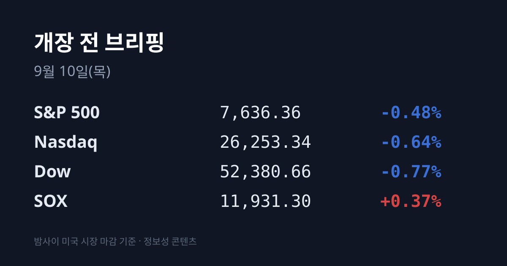
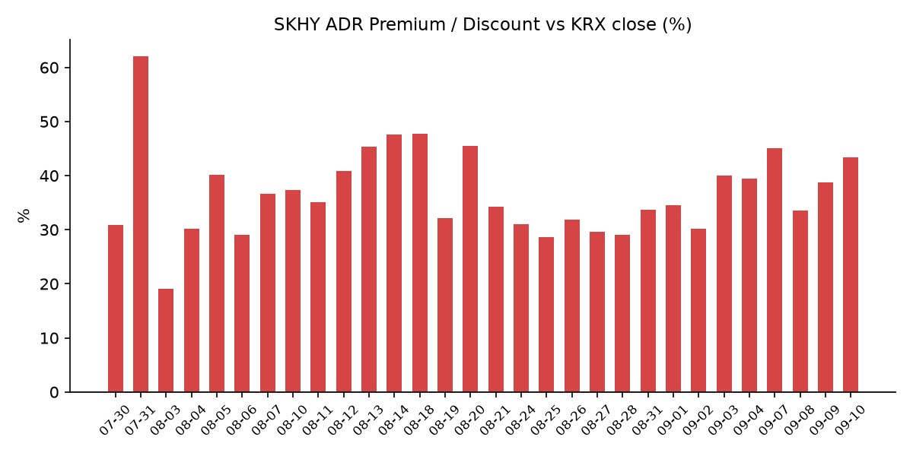
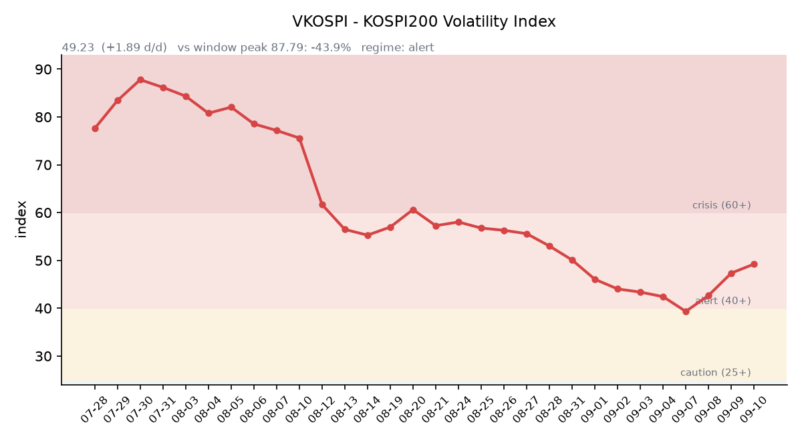

## ① 30초 요약

- 미 3대 지수가 **3거래일 연속** 내렸습니다. 다우 −0.77% · S&P 500 −0.48% · 나스닥 −0.64%. 그런데 <mark>필라델피아 반도체지수(SOX)는 +0.37%로 이틀 연속 홀로 올랐습니다</mark>.
- <mark>SK하이닉스 ADR(SKHY)이 $198.63으로 **+7.05%** 급등</mark>했습니다. 본주 환산가 기준 괴리율은 **+43.35%로,** 전일(+38.7%)보다 4.6%포인트 벌어졌습니다.
- 브렌트유가 <mark>$101.21로 100달러를 다시 넘었습니다</mark>(5월 이후 종가 최고). 한국 기준유종인 두바이유는 **$122.01**로 브렌트보다 **$20.80** 비쌉니다.
- 미 10년물 국채금리가 **4.846%로** 장중 4.85%를 넘어 2023년 11월 이후 최고를 기록했습니다. 30년물은 5.295%입니다.
- 어제 코스피는 **7,051.64(+1.40%)** 로 <mark>33거래일 만에 7,000선을 회복</mark>했습니다. 코스닥은 830.37(+2.28%)이었습니다.
- 오늘 한국 증시는 <mark>선물·옵션 동시만기(네 마녀의 날)와 한국거래소 섹터지수 정기변경이 겹치는 날</mark>입니다.

&nbsp;

## ② 밤사이 미국 시장

| 지수 | 종가 | 등락률 |
| :--- | ---: | ---: |
| S&P 500 | 7,636.36 | **−0.48%** |
| 나스닥 | 26,253.34 | **−0.64%** |
| 다우존스 | 52,380.66 | **−0.77%** |
| 필라델피아 반도체(SOX) | 11,931.30 | **+0.37%** |

3대 지수는 3거래일 연속 하락했고 러셀2000도 −1.28%로 밀렸습니다. 지수를 누른 것은 두 가지였습니다. 하나는 **국제유가**입니다. 브렌트 11월물이 3.36% 올라 배럴당 $101.21로 마감하며 5월 이후 종가 기준 최고를 기록했고, WTI 10월물도 $96.05를 찍었습니다. 다른 하나는 **금리**입니다. 미 10년물 국채금리가 장중 4.85%를 넘어 2023년 11월 이후 최고 수준까지 올랐고, 2년물은 4.436%, 30년물은 5.295%였습니다. 10년–2년 스프레드는 +41.0bp입니다.

지수가 내린 날에 반도체만 오른 것은 이틀째입니다. 특히 <mark>엔비디아가 −0.9%였는데도 SOX가 올랐다</mark>는 점이 어제와 다릅니다. AI 대장주가 아니라 메모리·인프라 쪽이 지수를 지탱했다는 뜻입니다. 배경에는 개별 기업 뉴스가 있었습니다. **퀄컴은 아마존(AWS)과 여러 세대에 걸친 맞춤형 AI 반도체 공동 개발 파트너십**을 체결하며 3.17% 올랐고(아마존에 최대 2,500만 주 신주인수권 발행), 코닝도 대형 데이터센터 계약을 발표했습니다. 대만 디지타임스는 **인텔이 10월부터 PC용 CPU 가격을 최대 10% 인상할 계획**이라고 보도했습니다.

유가를 밀어올린 것은 중동입니다. 미군이 이란의 미 함정 공격에 대응해 **8일 이란 유조선 5척을 파괴**했고, 예멘 후티 반군은 **사우디 남부 아브하·나즈란·지잔의 정유시설을 공격**했습니다. 세계 원유의 약 5분의 1이 지나는 호르무즈 해협에 이어 홍해까지 통항 리스크가 붙은 상태입니다. 골드만삭스는 선박 운송 차질이 지속될 경우 유가가 배럴당 $120까지 오를 수 있다고 경고했습니다.

한편 금 현물은 온스당 $4,361.99로 1% 가까이 내렸고, 달러인덱스는 98.81로 보합권이었습니다. VIX는 15.72(+2.75%)입니다. **금이 내리는 동안 명목금리가 올랐고 달러는 움직이지 않았다**는 조합은, 위험 회피가 확산된 것이 아니라 금리 상승이 금을 눌렀다는 쪽에 가깝습니다.

&nbsp;

## ③ 괴리율 트래커 — SK하이닉스 ADR

| 항목 | 수치 |
| :--- | ---: |
| SKHY 종가 | $198.63 (+7.05%) |
| SKHY 시간외 | $196.73 (−0.96%) |
| 적용 환율 (07:08 KST) | 1,339.49원 |
| 본주 환산가 (×10×환율) | 2,660,629원 |
| 본주 직전 종가 (09/09) | 1,856,000원 |
| **괴리율** | **+43.35%** |

전일 +38.7%에서 4.6%포인트 확대됐습니다. 40거래일 트래커에서 7번째로 높은 값이며, 최고치는 7월 31일의 +62.0%입니다.

괴리율이 플러스, 즉 **프리미엄** 상태라는 것은 미국에 상장된 예탁증서(ADR)가 서울에서 거래되는 본주보다 비싸게 매겨졌다는 뜻입니다. ADR은 본주 1주당 0.1주 비율로 발행돼 있어 이론상 두 가격은 환율을 매개로 붙어 있어야 합니다. 벌어지면 구조적으로 **싼 쪽(본주)을 사고 비싼 쪽(ADR)을 파는** 차익거래 유인이 생깁니다. 다만 한국은 ADR–본주 간 실물 전환에 절차·시간이 걸려 괴리가 즉시 좁혀지지 않고 오래 유지되는 경우가 많습니다.

이번 수치에서 함께 볼 점이 세 가지 있습니다. 첫째, **시간외에서 −0.96% 되밀렸습니다**. 정규장 고점이 그대로 유지되지 않았습니다. 둘째, 한국 시장 전체를 담는 <mark>EWY(iShares MSCI South Korea ETF)는 $190.78로 +0.46%에 그쳤습니다</mark>(시간외 $191.05, +0.14%). 즉 어젯밤 미국의 매수는 한국 시장 전반이 아니라 하이닉스 단일 종목에 몰렸습니다. 셋째, 본주는 어제 이미 +3.51% 오른 상태였습니다.

&nbsp;

## ④ 변동성 트래커

**판정 한 줄**: <mark>'경보' 유지, 방향은 악화 — VKOSPI가 3세션 연속 올랐고, 어제는 지수가 +1.40% 상승한 날에도 함께 올랐습니다.</mark>

**기대 변동성** — VKOSPI 49.23(전일비 **+1.89, +3.99%**). 구간 기준으로 25 미만 평시 / 25~40 주의 / **40~60 경보** / 60 이상 위기 중 '경보'입니다. 42.67 → 47.34 → 49.23으로 **3세션 연속 상승**(누적 +15.4%)했습니다. 6월 고점 96.94 대비로는 −49.2%까지 내려왔지만, 평시 상단인 25의 **2.0배** 수준입니다. 주목할 점은 방향입니다. 그저께는 지수가 −0.58% 내리는 동안 VKOSPI가 +10.94% 올랐고, 어제는 지수가 +1.40% 오르는 동안 +3.99% 올랐습니다. **지수 방향과 무관하게 진폭 기대가 커지고 있습니다.**

**실현 변동성** — 최근 5거래일 일중 변동폭(고가−저가)/종가 평균은 **2.485%** 입니다. 일별로는 09/03 3.70% · 09/04 1.70% · 09/07 1.82% · 09/08 3.16% · 09/09 2.05%였습니다. 확보된 6거래일(09/02~09/09) 중 종가 기준 ±3% 이상 등락일은 **2일**(09/02 −3.99%, 09/07 +4.61%)입니다.

**증폭 경로** — 단일종목 레버리지 ETF의 당일 거래 비중·회전율은 집계 시점 기준 미확인입니다.

**청산 압력** — 신용거래융자 잔고는 **33.3조원**(8월 31일 기준, 9거래일 연속 증가)이 최신 확보치입니다. 이후 9거래일 동안 코스피가 6,562에서 7,051로 7.5% 더 올랐으나, 9월 갱신치는 집계 시점 기준 미확인입니다.

**하방 포지션** — 공매도 순잔고는 **T+2~3 공시 지연**이 구조적이어서 개장 전에는 확정치를 알 수 없습니다.

*미확인 항목: 코스피200 야간선물(14거래일째), 레버리지 ETF 거래 비중·회전율, 프로그램 매매 차익·비차익 및 선물 베이시스, 10년물 실질금리(TIPS) 09/09치.*

&nbsp;

## ⑤ 어제 한국장 리뷰

| 지수 | 종가 | 등락률 |
| :--- | ---: | ---: |
| 코스피 | 7,051.64 | **+1.40%** |
| 코스닥 | 830.37 | **+2.28%** |

코스피는 97.12포인트 올라 <mark>33거래일 만에 7,000선을 회복</mark>했습니다. 종가 기준으로 7,000을 넘은 것은 7월 23일 이후 처음입니다.

**수급은 기관 단독이었습니다.** 유가증권시장에서 기관이 **+9,417억원**을 순매수하며 5거래일 연속 매수 우위를 이어갔고, **외국인은 −4,350억원으로 순매도 전환**, 개인은 −2조2,875억원이었습니다. 여기에 **기타법인이 +1조7,758억원**이라는 이례적 규모로 들어왔습니다. (집계처에 따라 기관 +9,005~9,056억, 외국인 −1,702~1,803억으로도 보도돼 잠정치 편차가 있습니다.)

시총 상위에서는 **SK하이닉스가 1,856,000원(+3.51%)** 으로 지수 상승을 이끌었고, **삼성전자는 269,500원 보합**이었습니다. 장중 271,250원까지 올랐다가 상승분을 반납했습니다. 업종별로는 화학 +3.56%, 기계·장비 +2.73%, 전기·전자 +2.01%, 제조 +1.96%, 금속 +1.63%가 강세였고, 오락·문화 −2.66%, IT서비스 −1.36%가 약세였습니다. 개별 종목으로는 LG에너지솔루션 +6.46%, HD현대중공업 +4.27%, 삼성전기 +2.48%가 올랐고, 신한지주 −2.30%, 삼성물산 −1.57%, 삼성생명 −1.46%가 내렸습니다. 코스닥에서는 에코프로비엠 +9.64%, 심텍 +8.87%가 두드러졌습니다.

2차전지 강세의 배경으로는 **중국의 배터리 소비세 시행**이 거론됩니다. 중국 정부는 9월 1일부터 리튬이온 축전지 등에 2% 소비세를 부과하기 시작했고(2027년 9월부터 4%로 인상 예정), 그동안 중국산 배터리 가격 우위를 뒷받침하던 9~13%의 정부 환급도 축소 국면입니다.

**원/달러 환율**은 서울 외환시장에서 **1,336.1원(−9.5원)** 으로 마감했습니다. 어제 지수 상승의 한 축이었던 원화 강세는 새벽까지 되밀리지 않아, 오전 7시 8분 기준 <mark>1,339.49원</mark>에서 거래됐습니다. 미 10년물이 4.85%까지 올랐는데도 원화가 약해지지 않은 점은 기록해 둘 만합니다.

**아시아 증시**는 닛케이 225 −0.2%, 대만 가권 +0.16%였습니다. 상하이종합·항셍의 9일 종가는 집계 시점 기준 미확인입니다. 코스피 +1.40%는 역내 평균을 크게 웃돌았습니다.

&nbsp;

## ⑥ 오늘의 캘린더 & 관전 포인트

- **오늘(09/10) 한국** — <mark>선물·옵션 동시만기(네 마녀의 날)</mark>. 각 결제월 두 번째 목요일 규정에 따른 것입니다.
- **오늘(09/10) 한국, 종가 부근** — **한국거래소 섹터지수 정기변경**. 총 1조8,000억원 규모의 비중 조절과 별도로 신규 편입·편출 4,000억원이 발생합니다. 미래에셋증권은 <mark>**SK하이닉스 약 1조2,440억원**·**삼성전자 약 2,068억원**(합계 1조4,508억원)의 매도 수요</mark>와 **한미반도체 약 3,064억원**·**주성엔지니어링 약 1,795억원**의 매수 수요를 추산했습니다. 9월 4일 기준 섹터지수 내 비중이 SK하이닉스 **36.75%**, 삼성전자 **22.78%** 로 개별 종목 20% 상한에 걸린 결과입니다. 해당 매매는 **10일 종가 부근에 집중**되고, 변경된 지수는 **11일부터 적용**됩니다.
- **오늘(09/10) 21:30** — 미국 8월 생산자물가지수(**PPI**). 장기 국채 재매입 규모 발표도 예정돼 있습니다.
- **오늘 미 장마감 후(09/11 새벽 KST)** — <mark>**오라클**(FQ1'27)·**어도비** 실적</mark>. 오라클 컨센서스는 매출 약 191.3억 달러(전년비 +28%), 주당순이익 약 1.74달러, 클라우드 매출 증가율 58~65%입니다.
- **09/11 21:30** — 미국 8월 소비자물가지수(**CPI**). FOMC 직전 지표입니다.
- **09/09~15** — 엘리스그룹 기관 수요예측(222.2만 주, 밴드 70,400~90,500원, 공모 1,564~2,011억원, 미래에셋·삼성 주관). 청약 09/18~21, 납입 09/23. 같은 기간 글로벌테크놀로지(09/07~13)·빅웨이브로보틱스(09/07~11)·덕산넵코어스(09/08~14)·브릴스(09/09~15) 수요예측이 진행됩니다.
- **09/15~16** — **FOMC**. 결과는 **09/17 03:00 KST**에 점도표와 함께 공개됩니다. CME 페드워치 기준 25bp 인상 확률 **60.1%**, 동결 39.9%이며 현 목표범위는 3.50~3.75%입니다.
- **09/18** — 미국 쿼드러플 위칭 / 한미 원전 8기 최종 서명 거론일.
- **10월** — 한국은행 금융통화위원회 / 인텔 PC용 CPU 가격 인상 예정 시점.
- **11/19 · 11/21** — SK하이닉스 자사주 취득 종료 / 삼성전자 자사주 매입 종료.

**시장이 주시하는 레벨** — 원/달러 **1,350원**, 미 10년물 **4.90%**, 브렌트 **$105** 및 두바이–브렌트 역전폭 **$25**, VKOSPI **55**, 그리고 SK하이닉스와 한미반도체·주성엔지니어링의 오전 흐름이 거론됩니다.

&nbsp;

## ⑦ 정책 워치

- **중국 배터리 소비세** — 9월 1일부터 리튬이온 축전지 등에 2% 소비세 부과가 시작됐습니다. 약 11년간 이어진 면세가 종료된 것으로, 세율은 2027년 9월 1일부터 4%로 오릅니다.
- **한국 공매도 제도**(직전 확보치 기준) — 코스피200·코스닥150 부분 재개가 유지되고 있으며, 2026년부터 기관·법인의 전산 시스템 이용이 의무화(NSDS 실시간 연동)됐습니다. 상환 기한은 90일 단위 최대 12개월, 담보비율은 105%로 통일돼 있습니다. 2026년 9월 기준 갱신 사항은 집계 시점 기준 미확인입니다.
- **단일종목 레버리지 ETF·ETN** — 매매수량단위가 1주에서 20주로 상향되며, 9월 중 조기 시행됩니다.

&nbsp;

## ⑧ 오늘의 질문

<mark>밤사이 미국이 하이닉스에 매긴 +7.05%와, 오늘 종가에 예정된 1조2,440억원 규모의 지수 리밸런싱 매도 물량 중 어느 쪽이 오늘의 종가를 결정할 것인가.</mark>

&nbsp;

---
*본 글은 공개된 시장 데이터를 정리한 정보성 콘텐츠이며, 특정 종목·상품의 매매 권유가 아닙니다. 모든 투자 판단과 책임은 투자자 본인에게 있습니다. 수치는 작성 시점 기준이며 이후 변동될 수 있습니다.*
