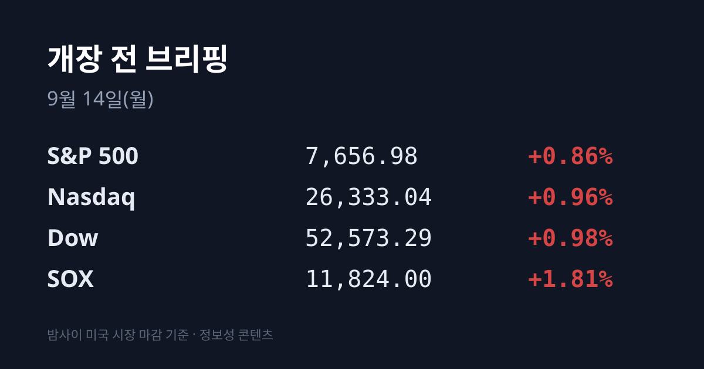
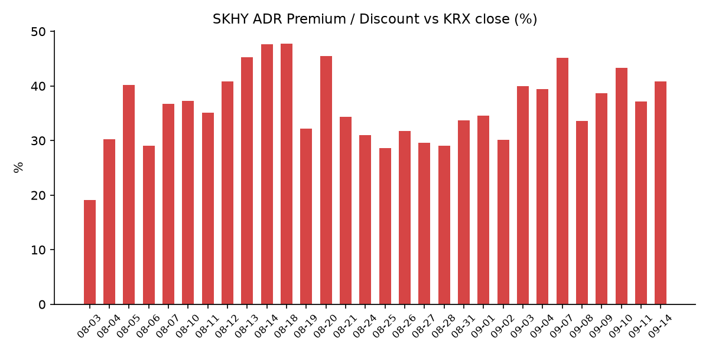
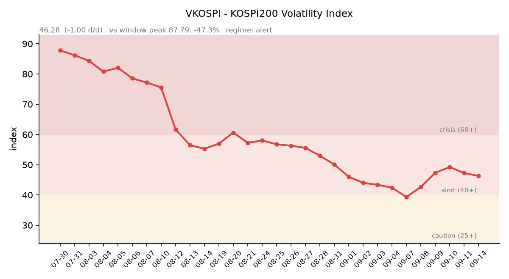

## ① 30초 요약

- 미 8월 CPI가 **전년비 3.4%·전월비 +0.4%** 로 예상에 부합했고, 뉴욕 3대 지수는 5거래일 만에 반등했다. <mark>필라델피아 반도체지수(SOX)는 +1.81%로 지수의 2배 올랐다.</mark>
- 밤사이 한국 자산이 함께 올랐다. **EWY(한국 ETF) +3.25%**, SK하이닉스 ADR(SKHY) +0.94%로 마감했다. 금요일 코스피 종가는 이 값들이 나오기 전에 확정된 수치다.
- 주말에 유가가 방향을 되돌렸다. <mark>이라크발 드론 공격으로 사우디 동서 송유관(하루 400만 배럴, 세계 공급의 약 4%)이 폐쇄</mark>됐고, 오늘 예정이던 이란·걸프 외무장관 회동은 연기됐다. 브렌트는 **$107.87** 을 기록 중이다.
- 근원 CPI가 전월비 **+0.3%** 로 예상(+0.2%)을 웃돌면서, CME 페드워치 기준 9월 FOMC 25bp 인상 확률은 전일 72.4%에서 **86.3%로 상승**했다.
- 금요일 코스피는 **6,909.91(−1.76%)**, 코스닥은 **820.64(−1.95%)** 로 마감했다. 코스피는 −3.29% 갭 하락으로 출발한 뒤 낙폭을 절반 이상 되돌렸다.

## ② 밤사이 미국 시장

| 지수 | 종가 | 등락률 |
| :--- | ---: | ---: |
| S&P 500 | 7,656.98 | +0.86% |
| 나스닥 | 26,333.04 | +0.96% |
| 다우 | 52,573.29 | +0.98% |
| **SOX (필라델피아 반도체)** | **11,824.00** | **+1.81%** |

미 노동부가 발표한 8월 소비자물가지수는 전년 대비 3.4%, 전월 대비 0.4% 상승해 시장 전망에 부합했다. 여기에 중동 국가들이 호르무즈 해협 통항을 두고 임시 합의를 모색한다는 보도가 나오며 국제유가가 내렸고, 두 재료가 겹치면서 뉴욕 증시는 4거래일 연속 하락을 끊고 반등했다.

반도체가 반등을 주도했다. SOX는 직전 거래일 −2.63%의 3분의 2가량을 하루에 회수했다. 직전 하락의 배경으로 업황이 아니라 장기 금리 상승에 따른 할인율 부담이 지목됐던 만큼, CPI 결과로 그 부담이 일부 되감긴 흐름이었다.

다만 채권시장의 해석은 달랐다. 근원 CPI가 전월비 0.3%로 예상을 웃돌면서 <mark>미 10년물은 4.969%로 5% 문턱에 근접</mark>했고, 2년물은 **4.63%** 로 7.75bp 올랐다. 10년–2년 스프레드는 +39.3bp에서 **+33.9bp** 로 축소됐다. VIX는 **15.84(−11.21%)** 로 직전 거래일 상향 돌파했던 14~17 구간으로 되돌아왔다. 달러인덱스는 98.806(+0.04%), 금은 $4,347.76(+0.62%)이었다.

원자재에서는 방향이 주말에 바뀌었다. 금요일 종가 기준 브렌트는 $104.61(−2.81%), WTI는 $100.05(−2.37%)였으나, 주말 사이 사우디 동서 송유관 폐쇄와 이란·걸프 회동 연기 소식이 전해지며 브렌트는 **$107.87(+3.25%)** 로 되돌아섰다(장중 $109.56). 한편 한국의 원유 도입 기준유종인 두바이유는 금요일 기준 **$123.66** 으로 올라, 브렌트 대비 역전폭이 $13.86에서 **$19.05** 로 확대됐다.

## ③ 괴리율 트래커 — SK하이닉스 ADR

| 항목 | 수치 |
| :--- | ---: |
| SKHY 종가 | $190.07 (+0.94%) |
| 본주 환산가 (×10×환율 1,342.97) | 2,552,583원 |
| 본주 직전 종가 | 1,812,000원 |
| **괴리율** | **+40.87%** |

괴리율은 42거래일 트래커에서 8위 수준이며, 기록상 최고치는 7월 31일의 +62.0%다. 최근 10거래일 평균은 +37.57%로, 직전 거래일(+37.16%) 대비로는 3.7%포인트 확대됐다.

ADR과 본주 사이에 프리미엄(+)이 벌어지면, 같은 기업의 주식이 뉴욕에서는 비싸고 서울에서는 싸게 거래된다는 뜻이 된다. 구조적으로는 싼 쪽인 본주를 사고 비싼 쪽인 ADR을 파는 전환 차익거래 유인이 생긴다. 반대로 디스카운트(−)면 본주 쪽에 매도 압력이 생기는 구조다. 다만 ADR은 환율과 거래 시간대가 본주와 다르고, 국내 시장의 수급·제도 요인이 함께 작용하기 때문에 괴리율만으로 본주 가격이 결정되지는 않는다.

참고로 밤사이 <mark>SKHY(+0.94%)보다 EWY(+3.25%)가 훨씬 크게 올랐다</mark>. 특정 종목이 아니라 한국 시장 전반에 자금이 들어온 형태였다는 점에서, 직전 거래일과는 성격이 반대였다.

## ④ 변동성 트래커 🌡️

**판정 한 줄**: <mark>'경보' 유지, 방향은 진정 — VKOSPI가 이틀 연속 내려 7월 이후 최저권이다.</mark> 다만 금요일 시초가가 −3.29%였던 데서 보듯 기대 변동성 레벨의 하락이 곧 일중 진폭 축소를 뜻하지는 않았다.

**기대 변동성**  VKOSPI **46.28**(전일비 −1.00, −2.12%)로 **40~60 '경보'** 구간이다. 49.23 → 47.28 → 46.28로 이틀 연속 하락했고, 6월 고점 96.94 대비 −52.3% 수준이며 평시 상단(25)의 1.9배다.

**실현 변동성**  최근 5거래일 일중 변동폭은 09/11 약 2.5%(시초 −3.29% → 종가 −1.76%), 09/10 2.48%, 09/09 2.05%, 09/08 3.16%, 09/07 1.82%로 평균 **2.40%** 였다. 확보한 8거래일 중 종가 ±3% 이상 등락일은 2일(09/02 −3.99%, 09/07 +4.61%)이다.

**증폭 경로**  단일종목 레버리지 ETF의 당일 거래 비중·회전율은 집계 시점 기준 미확인이다. 제도 측면에서는 매매수량단위가 1주에서 20주로 상향되는 조치가 9월 시행 중이다.

**청산 압력**  신용거래융자 잔고는 8월 28일 기준 **33.333조원**(9거래일 연속 증가)이 확보된 최신치이며, 9월 갱신치는 집계 시점 기준 미확인이다.

**하방 포지션**  공매도 순잔고는 T+2~3 공시 지연으로 개장 전 확인이 구조적으로 불가능하다.

*미확인 항목: 코스피200 야간선물, 레버리지 ETF 당일 회전율, 프로그램 매매 차익·비차익 및 선물 베이시스, 10년물 실질금리(TIPS), 30년물 09/11 확정 종가, DRAM·NAND 당일 현물가.*

## ⑤ 어제 한국장 리뷰

| 지수 | 종가 | 등락률 |
| :--- | ---: | ---: |
| 코스피 | 6,909.91 | −1.76% |
| 코스닥 | 820.64 | −1.95% |

코스피는 **6,802.50(−3.29%)** 으로 갭 하락 출발한 뒤 낙폭을 절반 이상 되돌려 6,909.91에 마감했다. 국제유가 급등과 미 30년물 금리 상승, CPI 발표를 앞둔 경계 심리가 하락 배경으로 지목됐다.

수급에서는 <mark>외국인이 2조2,915억원, 기관이 1조2,236억원을 순매도</mark>했고 개인이 1조8,658억원을 순매수했다. 코스닥에서는 개인 +5,119억원, 외국인 −3,137억원, 기관 −2,162억원이었다. 다만 코스피 수급은 집계처에 따라 외국인 −1조6,400억원·개인 +2조2,500억원으로도 집계돼 편차가 크다.

종목별로는 반도체 낙폭이 컸다. 삼성전자는 **259,500원(−3.53%)**, SK하이닉스는 **1,812,000원(−2.21%)** 으로 마감했고, 장비·소재주에서 원익IPS −7.15%, 테스 −7.36%, 티에스이 −15.01%, 파두 −13.62%가 나왔다.

반면 개별 재료를 가진 종목군은 반대로 움직였다. 엔비디아 젠슨 황 CEO가 골드만삭스 테크 콘퍼런스에서 "사이버 보안이 AI의 다음 주요 적용 분야가 될 가능성이 높다"고 말한 것이 전해지며 보안주가 급등해, <mark>코스닥 상한가 11종목 중 4종목이 보안 관련주</mark>였다(엑스게이트·샌즈랩 상한가, 드림시큐리티 +23.76%, 에스투더블유 +20.68%). 이 밖에 조선(HD현대중공업 +5.62%)·금융(KB금융 +2.60%)이 강세였고, ESS 공급 부족 보도에 삼화콘덴서가 +18.76%, 화장품에서 프리티 +29.89%·한국화장품제조 +19.38%를 기록했다.

원/달러 환율은 서울 외환시장 주간거래에서 **1,345.90원**(+6.7원)에 마감해 사흘 만에 1,340원대로 올라섰다. 다만 9월 14일 07:02 KST 기준 현재값은 1,342.97원으로, 금요일 주간종가 대비 2.93원 내린 수준에서 거래됐다.

한편 9월 들어 개인은 반도체 대형주에서 5개월 만에 순매도로 전환했다. 9월 11일까지 삼성전자 **5.212조원**, SK하이닉스 **7.818조원**을 순매도했고, 같은 기간 기타법인이 반대편에서 매수한 것으로 집계됐다.

## ⑥ 오늘의 캘린더 & 관전 포인트

- **09/14(오늘)** — 이란·걸프협력회의 외무장관 회동이 연기된 상태다. 오만 외무장관은 "건설적 대화 여건 조성"을 이유로 들었다.
- **09/14(오늘)** — 사우디 동서 송유관 복구 진척. 대체 파이프라인으로 기존 물량의 약 3분의 2가 회복됐다는 보도가 나왔다.
- **09/16** — 미국 8월 소매판매.
- <mark>**09/17 03:00 KST** — 9월 FOMC 금리 결정 및 점도표 공개</mark>. CME 페드워치 기준 25bp 인상 확률 **86.3%**(전일 72.4%, 1주 전 59.4%).
- **09/18** — 일본은행(BOJ) 금융정책결정회의, 그리고 선물·옵션 동시만기(세 마녀의 날).
- **09/18~21** — 엘리스그룹 공모주 청약(밴드 70,400~90,500원, 공모 규모 1,564~2,011억원, 납입 09/23).
- **09/30** — 마이크론 FQ4'26 실적 발표.

**시장이 주시하는 레벨**: 미 10년물 **5.00%** 선, 원/달러 **1,350원** 선, 브렌트 **$112** 선과 브렌트–두바이 역전폭 **$20** 선, VKOSPI **50** 선이 거론된다. 대만 가권지수의 개장 방향은 SOX 반등이 아시아 반도체로 전달되는 정도를 확인하는 지표로 함께 언급된다.

## ⑦ 정책 워치

- 공매도 제도는 코스피200·코스닥150 구성종목 부분 재개가 유지되고 있다. 기관·법인 전산화 의무(NSDS 실시간 연동), 상환기간 90일 단위·최대 12개월, 담보비율 105% 일원화가 적용 중이다. 2026년 9월 기준 갱신 정보는 집계 시점 기준 미확인이다.
- 단일종목 레버리지 ETF·ETN의 매매수량단위를 1주에서 20주로 올리는 조치가 9월 시행 중이다.

## ⑧ 오늘의 질문

금요일 미국장이 매긴 한국 자산의 재평가(EWY +3.25%)와, 그 이후 주말에 발생한 사우디 송유관 폐쇄라는 두 개의 미반영 재료 중 어느 쪽이 먼저 가격에 반영될 것인가.

---
*본 글은 공개된 시장 데이터를 정리한 정보성 콘텐츠이며, 특정 종목·상품의 매매 권유가 아닙니다. 모든 투자 판단과 책임은 투자자 본인에게 있습니다. 수치는 작성 시점 기준이며 이후 변동될 수 있습니다.*
