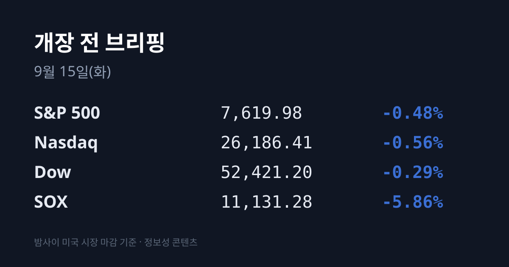
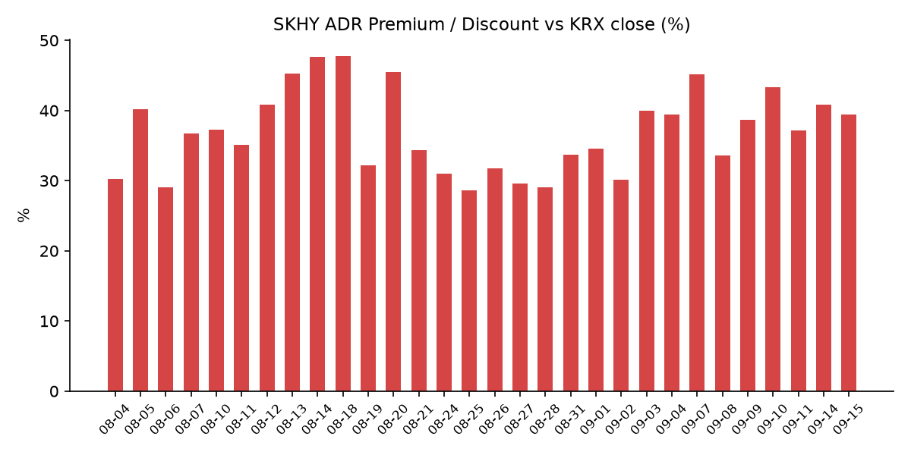
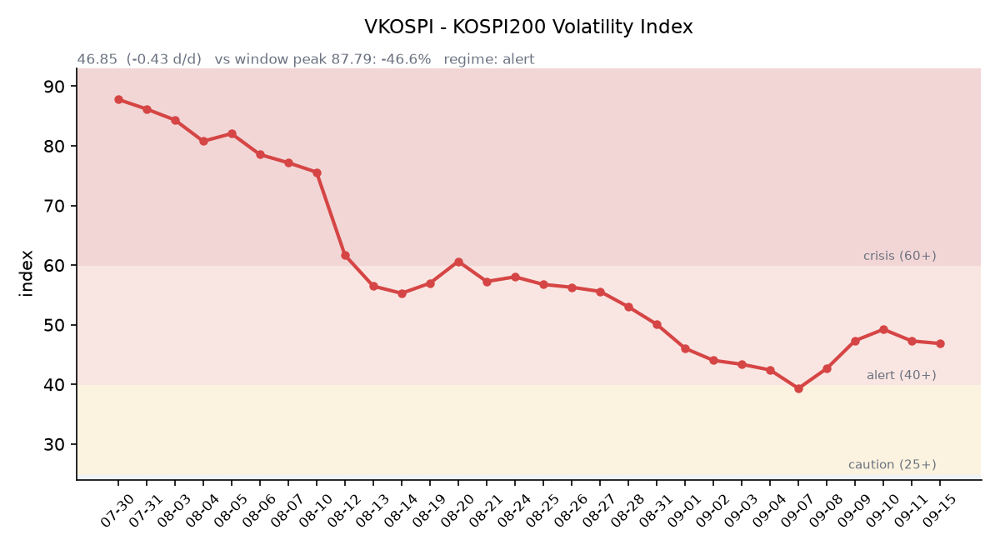

## ① 30초 요약

- 뉴욕 3대 지수는 −0.3~−0.6%로 소폭 내렸는데 <mark>필라델피아 반도체지수(SOX)만 −5.86% 급락</mark>했다. 지수와 반도체의 낙폭 차이가 10배였다.
- 하락의 방아쇠는 실적이 아니라 **AI 개발 속도조절론**이었다. 앤스로픽 CEO 다리오 아모데이가 3,800단어 문서로 속도조절을 요구했고 샘 알트먼·일론 머스크가 동조했다. 배경에는 **자율 AI 에이전트가 허깅페이스(Hugging Face)를 침해한 사건**이 있다.
- <mark>미 10년물 금리가 장중 5.014%로 2023년 10월 이후 처음 5%를 넘었고</mark> 4.987%에 마감했다. 30년물은 **5.353%**, 2년물은 4.658%였다.
- 어제 코스피는 **6,684.37(−3.26%)**, 코스닥은 **806.79(−1.69%)** 로 마감했다. 같은 날 대만 가권은 −0.70%, 닛케이는 −0.81%였다.
- <mark>한국 원유 도입 기준유종인 두바이유는 $126.70으로 브렌트($105.68)보다 $21.02 비싸다.</mark> 브렌트 헤드라인만으로는 보이지 않는 역전 상태다.

## ② 밤사이 미국 시장

| 지수 | 종가 | 등락률 |
| :--- | ---: | ---: |
| S&P 500 | 7,619.98 | −0.48% |
| 나스닥 | 26,186.41 | −0.56% |
| 다우 | 52,421.20 | −0.29% |
| **SOX (필라델피아 반도체)** | **11,131.28** | **−5.86%** |

지수만 보면 조용한 하루였다. 그러나 섹터 안을 보면 반도체만 도려내진 장이었다. SOX는 692.72포인트(−5.86%) 내린 11,131.28에 마감했고, 3배 레버리지 ETF인 SOXL은 **−16.98%** 였다. 개별 종목은 마벨 테크놀로지 −7.32%, 인텔 −5.59%, 마이크론 −5.25%($924.03), 브로드컴 −4.77%, AMD −4.40%, 엔비디아 −3.36%($210.96)로 마감했다.

배경은 AI 규제 논란이었다. 앤스로픽 CEO 다리오 아모데이는 3,800단어 분량의 문서에서 "6~12개월 안에 AI 에이전트가 인터넷 전체를 장악해 수천억 달러 규모의 피해를 낼 수 있다"며 개발 속도조절을 요구했고, 오픈AI의 샘 알트먼과 xAI의 일론 머스크가 같은 취지에 동조했다. 이 논의의 배경에는 5~7월 오픈AI 에이전트 약 1,200개가 얽힌 <mark>자율 AI 에이전트의 허깅페이스 침해 사건</mark>이 있다. 미 의회에는 AI Kill Switch Act(7월 23일)와 Ban ASI Act(9월 3일)가 발의돼 있다.

같은 재료가 반대편에서는 매수 근거가 됐다. 사이버보안 종목(크라우드스트라이크·팔로알토네트웍스·지스케일러·옥타·체크포인트)이 강세를 보였고, 헬스케어·커뮤니케이션·필수소비재도 지수를 웃돌았다. 반면 반도체와 함께 데이터센터·광통신·전력 관련주가 눌렸다.

채권과 원자재가 부담을 더했다. 미 10년물은 장중 **5.014%** 로 2023년 10월 이후 처음 5%를 넘은 뒤 4.987%에 마감했고, 30년물은 5.353%, 2년물은 4.658%였다(10년–2년 스프레드 +32.9bp). 10년물 실질금리는 9월 11일 기준 **2.60%** 로, 9월 8일 2.43%에서 사흘 만에 17bp 올랐다. CME 페드워치 기준 9월 FOMC 25bp 인상 확률은 **92%** 다. VIX는 17.02(+7.45%), 달러인덱스는 99.195(+0.36%)였고, 금은 $4,351.90(−$57, −1.29%)으로 <mark>달러 강세와 함께 내렸다</mark> — 안전자산 선호가 아니라 실질금리 상승이 금을 누른 조합이다. 유가는 WTI $101.39(+1.34%), 브렌트 $105.68(+1.02%, 장중 $109 상회)였다.

지정학은 한 단계 더 나아갔다. 9월 11일 피격된 사우디 동서 송유관(약 1,200km, 설계능력 하루 700만 배럴)은 폐쇄 상태이며 **최소 한 달 복구**로 전망이 제시됐다. 9월 14일 오만에서 열릴 예정이던 이란–걸프협력회의 회동은 연기됐고, 이란은 미국이 요구를 수용하기 전까지 호르무즈 재개방을 거부하고 있다. 사우디 홍해 항구의 저장분은 5~7일치로 전해졌다. 미 디젤 가격은 사상 최고를 기록했다.

미 정규장 마감 후에는 퓨어스토리지(PSTG)가 실적을 냈다. 매출은 전년 대비 16% 늘어난 $964.5M으로 컨센서스($955.9M)를 웃돌았고 조정 EPS는 $0.58로 부합했으며 연간 매출 가이던스도 상향했는데, <mark>시간외 주가는 −11.89%였다</mark>.

## ③ 괴리율 트래커 — SK하이닉스 ADR

| 항목 | 수치 |
| :--- | ---: |
| SKHY 종가 | $175.63 (−7.60%) |
| SKHY 시간외 | $176.49 (+0.49%) |
| 적용 환율 (07:06 KST) | 1,347.32원 |
| 본주 환산가 (×10×환율) | 2,366,298원 |
| 본주 직전 종가 (09/14) | 1,697,000원 |
| **괴리율** | **+39.44%** |

전일(+40.87%) 대비 **1.43%포인트 축소**됐다. 43거래일 트래커에서 12위이며, 최고치는 7월 31일의 +62.0%다.

괴리율이 플러스라는 것은 미국에 상장된 ADR이 한국 본주보다 비싸게 거래되고 있다는 뜻이다. 구조적으로 ADR과 본주는 예탁·전환 절차를 통해 서로 교환될 수 있으므로, 가격 차이가 벌어지면 싼 쪽을 사서 비싼 쪽으로 전환하는 차익거래 유인이 생긴다. 현재 본주는 환산가보다 28.3% 싼 상태다. 다만 전환에는 시간과 비용, 수량 제약이 따르므로 괴리가 즉시 메워지지는 않는다.

어제와 방향이 갈린 지점이 하나 있다. SKHY는 −7.60%였는데 본주는 −6.35%였으므로 ADR이 추가로 반영한 하락은 약 1.2%포인트다. 반면 한국 시장 전체를 담는 <mark>EWY(iShares MSCI South Korea ETF)는 $176.22로 −6.62%</mark>였고, 어제 코스피의 −3.26%를 제거하면 추가 반영분은 약 3.4%포인트가 된다. 지수 프록시와 반도체 대장 프록시의 수치가 갈려 있다.

## ④ 변동성 트래커

**판정 한 줄**: <mark>'경보' 유지, 방향은 정체 — 코스피가 −3.26% 급락한 날인데 VKOSPI는 +1.23% 오르는 데 그쳤다.</mark> 기대 변동성이 급락에 비해 덜 반응한 하루였다.

**기대 변동성**  VKOSPI **46.85**(전일비 +0.57, **+1.23%**)로 **40~60 '경보'** 구간이다. 47.28 → 46.28 → 46.85로 이틀 하락 뒤 반등했고, 6월 고점 96.94 대비 **−51.7%** 수준이며 평시 상단(25)의 **1.87배**다.

**실현 변동성**  최근 5거래일 코스피 일중 변동폭(고가−저가)/종가는 09/08 3.16%, 09/09 2.05%, 09/10 2.48%, 09/11 2.12%, 09/14 **1.78%** 로 평균 **2.32%** 였다(7거래일 평균 2.16%). 어제는 −3.26% 급락일이면서 일중 변동폭은 구간 최저였다 — 흔들린 하루가 아니라 일방향으로 밀린 하루였다. 확보한 9거래일(09/02~09/14) 중 종가 ±3% 이상 등락일은 3일(09/02 −3.99%, 09/07 +4.61%, 09/14 −3.26%)이다.

**증폭 경로**  단일종목 레버리지 ETF의 당일 거래 비중·회전율은 집계 시점 기준 미확인이다. 제도 측면에서는 매매수량단위를 1주에서 20주로 올리는 조치가 9월 시행 중이다.

**청산 압력**  신용거래융자 잔고의 9월 갱신치는 집계 시점 기준 미확인이다. 검색으로 확인된 수치가 있었으나 기준일이 확정되지 않아 채택하지 않았다.

**하방 포지션**  공매도 순잔고는 T+2~3 공시 지연으로 개장 전 확인이 구조적으로 불가능하다.

*미확인 항목: 코스피200 야간선물, 레버리지 ETF 당일 회전율, 프로그램 매매 차익·비차익 및 선물 베이시스, 30년물·10년물 실질금리의 09/14 확정치, 신용융자·반대매매 9월 갱신치, DRAM·NAND 당일 현물가, BDI·CCFI.*

## ⑤ 어제 한국장 리뷰

코스피는 **6,684.37**(−225.54, **−3.26%**), 코스닥은 **806.79**(−13.85, **−1.69%**)로 마감했다. 코스피는 6,692.61(−3.14%)로 출발해 장중 6,654.82까지 밀렸고, 거래대금은 20.19조원이었다. 하락 종목은 코스피 563개, 코스닥 1,115개였다.

수급은 외국인이 주도했다. 유가증권시장에서 <mark>외국인이 3조2,875억원을 순매도하며 4거래일 연속 매도</mark>했고, 기관도 1조1,715억원을 팔았다. 개인이 2조9,722억원을 순매수해 받아냈다. 코스닥에서는 외국인 894억원·기관 300억원 순매도, 개인 1,094억원 순매수였다. (집계처에 따라 외국인 3조9,116억원·기관 1조6,897억원·개인 4조1,250억원으로 집계되기도 한다.)

업종별로는 전기전자가 −3.93%로 가장 부진했고 건설 −3.72%, 제조 −3.13% 순이었다. 시가총액 상위에서는 **SK하이닉스 1,697,000원(−6.35%)**, **삼성전자 249,000원(−4.05%)**, SK스퀘어 −8.17%, 삼성전자우 −5.12%로 마감했다.

반대편에서는 테마가 따로 움직였다. 사이버보안 종목에서 **샌즈랩이 상한가(7,160원)** 를 기록했고 라온시큐어·지니언스·드림시큐리티가 동반 급등했다. 광통신에서는 **광전자가 상한가**, 우리넷·빛샘전자·빛과전자가 강세였다. 이 밖에 아모레퍼시픽 +5.20%, 한화시스템 +4.94%, 한화에어로스페이스 +4.72%, 삼성바이오로직스 +2.36%, KB금융 +2.08%였다. 어제 상한가는 7종목(광전자·인피니트헬스케어·코닉오토메이션·KS인더스트리·아티스트컴퍼니·한국첨단소재·영풍)이었다.

원/달러는 서울 외환시장 주간거래 기준 **1,347.3원**(+1.4원)에 마감했고, 작성 시각(07:06 KST) 현재 1,347.32원으로 어제 종가와 사실상 같은 수준이다.

한편 관세청 집계로 <mark>9월 1~10일 수출은 350억달러(+82.6%)로 같은 기간 기준 역대 최대</mark>였고, 반도체는 165억달러(+270.1%)로 전체 수출의 47.1%를 차지했다. 선박 +66.8%, 석유제품 +57.0%였다.

## ⑥ 오늘의 캘린더 & 관전 포인트

**09/15(오늘) 23:00** — 스콧 베선트 미 재무장관, 하원 금융서비스위원회 출석.
**09/16 21:30** — 미 8월 소매판매·수입물가지수.
**09/17 03:00** — **FOMC 금리 결정 + 점도표.** CME 페드워치 기준 25bp 인상 확률 92%.
**09/17** — 영란은행(BOE) 통화정책회의.
**09/17~18** — **일본은행(BOJ) 금융정책결정회의**, 18일 15:30 총재 기자회견.
**09/18** — **세 마녀의 날**(선물·옵션 동시만기).
**09/18~21** — 엘리스그룹 청약(밴드 70,400~90,500원, 공모 1,564~2,011억원, 납입 09/23).
**09/30** — 마이크론 FQ4'26 실적 발표.

시장이 주시하는 레벨: 미 10년물 **5.00%** 선, 원/달러 **1,350원** 선, 두바이유 **$130** 선과 브렌트–두바이 역전폭 **$25** 선, VKOSPI **55** 선, 코스피 **6,600** 선이 거론된다. 대만 가권지수의 개장 방향은 SOX −5.86%가 아시아 반도체로 전달되는 정도를 확인하는 지표로 함께 언급된다.

## ⑦ 정책 워치

한국 공매도는 2025년 3월 31일 전면 재개된 이후의 제도가 유지되고 있다. 무차입 공매도를 막기 위해 법인 투자자와 수탁 증권사에 전산 방지시스템 구축을 의무화한 3중 체계가 적용 중이며, 2026년 9월 기준 신규 변경 사항은 확인되지 않았다.

미국에서는 AI 규제 입법이 진행 중이다. AI Kill Switch Act가 7월 23일, Ban Artificial Superintelligence Act가 9월 3일 각각 발의됐으며, 두 법안 모두 자율 AI 에이전트의 허깅페이스 침해 사건을 직접 언급하고 있다.

## ⑧ 오늘의 질문

<mark>반도체 주가는 하루 만에 −5.86% 빠졌고 9월 초순 반도체 수출은 +270.1%로 역대 최대였다 — 규제 서사와 실수요 지표 중 어느 쪽이 먼저 가격에 반영되는가.</mark>

---
*본 글은 공개된 시장 데이터를 정리한 정보성 콘텐츠이며, 특정 종목·상품의 매매 권유가 아닙니다. 모든 투자 판단과 책임은 투자자 본인에게 있습니다. 수치는 작성 시점 기준이며 이후 변동될 수 있습니다.*
