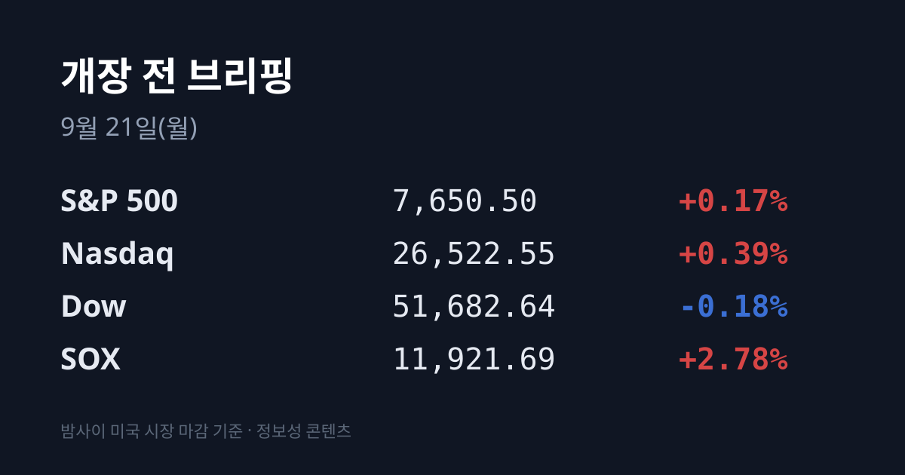
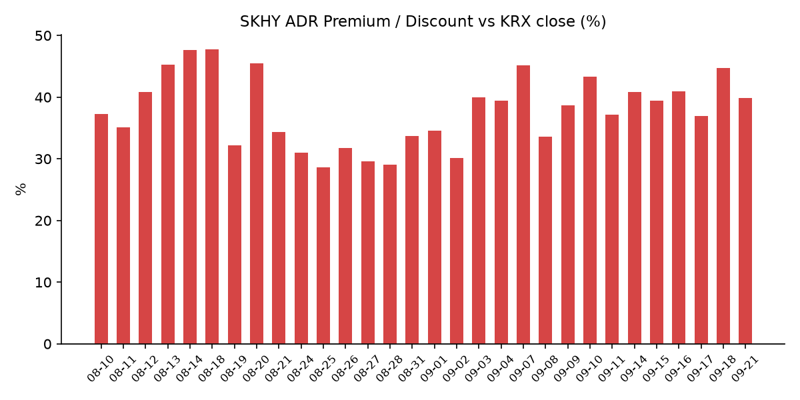
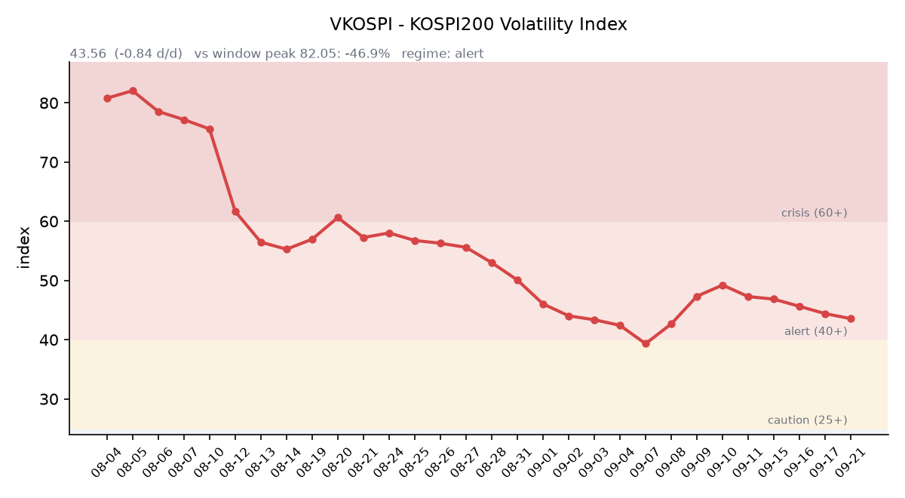

## ① 30초 요약

- 필라델피아 반도체지수(SOX)가 **11,921.69(+2.78%)로 나흘 연속 올랐다.** 같은 밤 다우는 −0.18%였다. <mark>지수가 아니라 반도체만 움직인 하루였다.</mark>
- <mark>주말 사이 중국 CXMT(창신메모리)가 5세대 D램 공정 양산에 돌입했다고 발표했다.</mark> 9월 20일 허페이 세계제조업대회에서 24Gb LPDDR5X 2종을 공개했고, 8Gb 기준 웨이퍼당 칩 수가 4세대 대비 **50% 이상** 늘었다고 밝혔다.
- 같은 주말, 삼성전자·SK하이닉스의 **35조원 규모 자사주 매입**이 예정보다 한 달 이른 10월 중순에 끝날 수 있다는 보도가 나왔다. 삼성전자는 예정 물량의 74.69%, SK하이닉스는 58.79%를 소진한 상태다.
- SK하이닉스 ADR은 **$187.50(+2.46%)** 로 올랐는데, 한국 시장 전체를 담은 ETF인 EWY는 **−0.59%로 내렸다.** 밤사이 두 프록시가 반대 방향을 가리켰다.
- 미 10년물 국채금리가 다시 **5%를 넘었고**, 원/달러는 08:04 KST 기준 1,385.58원으로 서울 종가보다 2.28원 높다. <mark>일본 증시는 오늘부터 9월 23일까지 사흘 연속 휴장이다.</mark>

## ② 밤사이 미국 시장

| 지수 | 종가 | 등락률 |
| :--- | ---: | ---: |
| S&P 500 | 7,650.50 | +0.17% |
| 나스닥 | 26,522.55 | +0.39% |
| 다우 | 51,682.64 | −0.18% |
| **SOX(필라델피아 반도체)** | **11,921.69** | **+2.78%** |

9월 18일(현지시간) 미국 증시는 혼조로 마감했다. 다우가 내리고 S&P 500과 나스닥이 오른 가운데, 필라델피아 반도체지수만 **+2.78%로 나흘 연속** 상승했다. 이날은 선물·옵션이 동시에 만기를 맞는 쿼드러플 위칭이기도 했다.

개별 종목에서는 메모리와 장비가 지수를 크게 앞섰다. **샌디스크 $1,791.82(+10.99%)**, 램리서치 $288.11(+6.98%), 마이크론 $1,015.80(+3.92%), 브로드컴 $357.61(+2.97%), AMD $559.82(+2.70%), 엔비디아 $222.27(+1.34%), TSMC $434.67(+1.02%)였다. 인텔은 $108.60(−0.18%)으로 내렸다.

지수를 누른 쪽은 금리였다. 미 10년물 국채금리가 전장 4.94%에서 **5%를 다시 넘어섰다.** <mark>금리가 5%를 뚫는 날에 반도체만 따로 올랐다는 점이 이날 미국장의 특징이다.</mark> FRED 기준 확정치는 10년물 4.94%, 30년물 5.29%, 2년물 4.67%, 10년 실질금리(TIPS) 2.61%로 모두 09/17 기준이며, 09/18 확정치는 집계 시점 기준 미공개다. 10년−2년 스프레드는 09/18 기준 +0.25%p였다.

원자재는 나흘째 내렸다. WTI 10월물은 $100.30(−1.58%), 브렌트 11월물은 $103.87(−0.91%)였다. 사우디아라비아가 피격된 동서송유관 복구에 착수해 수일 안에 수송 능력의 절반을 되찾는다는 목표를 세웠고, 호르무즈 해협을 통한 유조선 운항도 일부 이어졌다. 금 12월물은 $4,424.90(+0.57%), 달러인덱스는 100.22였다.

> ⚠️ 9월 18일은 쿼드러플 위칭이었다. 야후 파이낸스의 연속물 기호(`CL=F`·`ES=F` 등)는 이 시점에 다음 한월로 갈아타므로, 직전 종가와 그대로 비교하면 유가 −4.3%·지수선물 +1% 상당의 존재하지 않는 등락이 만들어진다. 이 글의 선물 수치는 모두 동일 한월(WTI 10월물·브렌트 11월물·지수 12월물)로 다시 조회한 값이다.

## ③ 괴리율 트래커 — SK하이닉스 ADR

| 항목 | 수치 |
| :--- | ---: |
| SKHY 종가 | $187.50 (+2.46%) |
| 적용 환율 (08:04 KST) | 1,385.58원 |
| 본주 환산가 (×10×환율) | 2,597,962원 |
| 본주 직전 종가 (09/18) | 1,857,000원 |
| **괴리율** | **+39.90%** |
| 전일 괴리율 | +44.75% |

괴리율이 하루 만에 **4.85%포인트** 좁혀졌다. 좁혀진 방식이 전날과 정반대다. 09/18에는 본주가 −0.80%로 내린 자리에서 ADR이 뛰면서 벌어졌지만, 이번에는 본주가 **+6.42% 오르며** 환산가를 따라잡았다. 환율은 2.28원 올라 괴리를 벌리는 쪽으로 작용했는데도 줄었다. 한국 시장이 밤사이 미국이 매긴 값을 실제로 따라갔다는 뜻이다.

구조적으로 ADR이 본주보다 비싼 프리미엄 상태에서는, 두 시장의 가격 차이를 이용하는 전환 차익거래가 성립할 때 본주 쪽에 매수 유인이 생긴다. 반대로 디스카운트 상태에서는 본주 쪽에 매도 유인이 생긴다. 현재 본주는 환산가보다 **28.5% 싸다.** 다만 이 괴리는 자동으로 좁혀지는 것이 아니라 실제 거래가 일어나야 좁혀지며, ADR과 본주 사이에는 거래 시간·세제·전환 절차의 마찰이 존재한다. 이 트래커 기준 +39.90%는 집계된 47거래일 중 14위다. 전 구간 최고치는 07/31의 +62.0%였다.

한편 한국 시장 전체를 담은 ETF인 EWY는 같은 밤 $181.31(−0.59%)로 내렸다. <mark>SK하이닉스 ADR과 EWY가 서로 다른 방향을 가리킨 밤이었다.</mark> EWY는 특정 종목이 아니라 한국 시장 전반에 매겨진 가격이라는 점에서 두 수치는 다른 것을 보여준다.

## ④ 변동성 트래커

<mark>'경보' 유지, 방향은 나흘 만에 위로 — VKOSPI가 소폭 반등했고 레버리지 ETF 비중도 함께 올랐다.</mark> 다만 실현 변동폭은 계속 줄고 있어 기대 변동성과 실현 변동성이 엇갈리는 구간이다.

**기대 변동성**  VKOSPI는 09/18 종가 **43.56(+0.54, +1.26%)** 으로 '경보'(40~60) 구간이다. 나흘 이어지던 하락이 멈추고 방향이 위로 돌았다. 6월 고점 96.94 대비 **−55.1%** 수준까지 내려온 상태이지만, 평시 상단인 25의 **1.74배** 다. 〔한국거래소 통계정보〕

**실현 변동성**  최근 10거래일 일중 변동폭(고가−저가)/종가 평균은 **1.99%**, 최근 5거래일은 **1.65%** 로 축소가 이어졌다. 최근 10거래일 중 종가 기준 ±3% 이상 움직인 날은 09/07(+4.61%)과 09/14(−3.26%) 이틀이다.

**증폭 경로**  09/21 08:03 스냅샷 기준 레버리지 ETF가 전체 ETF 거래대금의 **33.14%** 를 차지했다(전일 29.83%). 상위 두 종목은 KODEX 반도체레버리지(거래대금 1,777억·회전율 16.87%)와 TIGER 반도체TOP10레버리지(1,292억·20.42%)로 둘 다 반도체다.

**파생 지표**  09/18 선물 베이시스는 **+2.22**(선물 1,092.45 − 현물 1,090.23)로 콘탱고를 유지했으나 전일 +4.48에서 절반으로 줄었다. 09/18 개장 직전 밤의 코스피200 야간선물은 1,094.55(직전 주간 종가 대비 +31.80, 거래량 26,006)였다. 〔한국거래소 통계정보〕

**청산 압력**  신용융자 잔고와 위탁매매 미수금 반대매매 금액은 집계 시점 기준 미확인이다. 최신 확인치가 8월 말에서 갱신되지 않아 이 항목은 소스 부재로 분류했다.

**하방 포지션**  공매도 순잔고는 T+2~3 공시 지연이 구조적이어서 개장 전에는 확인할 수 없다.

*미확인 항목: 신용융자·반대매매 최신치, 공매도 순잔고·대차잔고(공시 지연), 오늘 개장 직전 밤의 야간선물(다음 날 아침 공개), 미 국채 09/18 확정치, FedWatch 차기 FOMC 확률.*

## ⑤ 어제 한국장 리뷰

| 지수 | 종가 | 등락률 |
| :--- | ---: | ---: |
| KOSPI | 6,894.23 | **+2.66%** |
| KOSDAQ | 827.12 | +0.60% |

9월 18일 코스피는 178.82포인트 오른 6,894.23에 마감했다. 시가가 6,885.70(+2.54%)으로 이미 높게 열렸고 장중 고가는 6,914.08이었다. 코스닥은 4거래일 연속 상승했다.

수급에서는 <mark>외국인이 8거래일 만에 +4,388억원 순매수로 돌아섰다.</mark> 기관은 **+1조5,055억원**, 개인은 −3조5,929억원이었다. 코스닥에서는 외국인 −428억원, 기관 +217억원, 개인 +122억원으로 방향이 갈렸다.

업종별로는 전기전자 +4.46%, 정보기술 +4.40%가 지수를 끌어올렸다. **삼성전자는 261,000원(+3.37%)**, SK하이닉스는 1,857,000원(+6.42%)에 마감했다. 반대편에서는 헬스케어 −2.63%, 금융 −1.73%가 밀렸고 KB금융 −2.40%, 신한지주 −2.82%였다. 코스피 5종목·코스닥 3종목이 상한가를 기록했고 동양·동양우·동양2우B 3종목이 동반 상한가였다.

원/달러는 서울 외환시장 주간 종가 기준 **1,383.30원(+1.1원)** 으로 7거래일 연속 올랐다. 08:04 KST 현재는 1,385.58원으로 서울 종가보다 2.28원 높다. 달러/엔은 157.10이다. 일본은행이 09/18 기준금리를 1.25%로 0.25%포인트 올려 31년 만의 최고 수준으로 만들었고 우에다 총재가 "연속 인상이나 0.5%포인트 인상도 배제하지 않는다"고 말했는데도, 엔은 강세를 유지하지 못하고 약세로 돌아섰다.

## ⑥ 오늘의 캘린더 & 관전 포인트

- **09:00 · 관세청 9월 1~20일 수출입 잠정치** — 1~10일 수출은 349.7억달러로 전년 대비 **+82.6%**, 반도체는 164.8억달러로 **+270.1%** 였고 수출 비중이 47.1%였다. 무역수지는 +103.7억달러였다.
- **오늘 · 일본 증시 휴장**(경로의 날). 9월 22일·23일도 국민의 휴일·추분의 날로 쉬어 사흘 연속 휴장이다. 11년 만의 5일 실버위크다.
- **오늘 · 엘리스그룹 일반청약 마감**(09/18~21, 희망 밴드 70,400~90,500원, 공모 1,564~2,011억원, 납입 09/23).
- **09/22 밤 · 트럼프 미국 대통령 유엔총회 연설.**
- **09/23 · 글로벌 제조업 PMI 동시 발표**(미국·유럽·일본).
- **09/24 · 트럼프-시진핑 워싱턴 정상회담.** 관세 휴전 연장, 희토류, AI·반도체 수출통제가 의제로 거론된다. <mark>한국 증시는 이날 추석으로 휴장한다.</mark>
- **09/24~09/25 · 추석 연휴 휴장.** 이번 주 거래일은 **09/21·22·23 사흘**이고 다음 거래일은 09/28(월)이다.
- **09/30 · 마이크론 FQ4'26 실적 발표.**

**시장이 주시하는 레벨** — 원/달러 1,390원, SK하이닉스 1,900,000원, 미 10년물 5.05%, VKOSPI 48, 두바이유 $110. 한국 원유 수입 기준유종인 두바이유는 09/18 기준 $118.40(−$5.30)이고, 브렌트와의 역전폭은 전일 $18.88에서 **$14.53으로** 줄었다.

## ⑦ 정책 워치

**중국 CXMT 5세대 D램 양산** — CXMT(창신메모리테크놀로지)는 9월 20일 중국 안후이성 허페이에서 열린 '2026 세계제조업대회'에서 5세대 기술 플랫폼 양산을 공식 발표했다. 이 공정을 적용한 24Gb LPDDR5X 신제품 2종을 함께 공개했고, 회로 간격을 11.95나노미터까지 좁혀 8Gb 제품 기준 웨이퍼 한 장당 생산 가능한 칩 수가 4세대 공정보다 50% 이상 늘었다고 밝혔다. 메모리 공급 측의 구조 변화에 해당하는 발표다.

**삼성전자·SK하이닉스 자사주 매입 진행률** — 9월 20일 보도에 따르면 삼성전자는 8월 24일부터 20거래일 동안 자사주 3,980만주를 사들여 예정 물량 5,328만5,968주의 **74.69%** 를 소진했고, SK하이닉스는 예정 물량 2,407만주의 58.79%를 채웠다(누적 매입액 24조3,900억원). 당초 매입 종료일은 삼성전자 11월 21일·SK하이닉스 11월 19일이었으나, 현재 속도가 이어지면 종료 시점이 한 달가량 앞당겨진다는 분석이 나온다.

**미중 정상회담** — 9월 24일 워싱턴에서 열린다. 9월 20일 스콧 베선트 미국 재무장관과 허리펑 중국 국무원 부총리가 뉴욕에서 만나 의제를 조율했다.

**공매도 제도** — 전면 재개 상태가 유지되고 있으며, 기관투자자의 무차입 공매도를 차단하는 중앙점검시스템(NSDS)이 가동 중이다. 집계 시점 기준 제도 변경은 확인되지 않았다.

## ⑧ 오늘의 질문

지난 이틀 한국 반도체를 끌어올린 논리는 "공급이 부족해 메모리 가격이 올랐다"였다. 주말에 나온 CXMT의 5세대 D램 양산 발표를 시장은 그 논리의 유효기간을 줄이는 소식으로 읽을 것인가, 아니면 먼 훗날의 이야기로 분류할 것인가.

---
*본 글은 공개된 시장 데이터를 정리한 정보성 콘텐츠이며, 특정 종목·상품의 매매 권유가 아닙니다. 모든 투자 판단과 책임은 투자자 본인에게 있습니다. 수치는 작성 시점 기준이며 이후 변동될 수 있습니다.*

*VKOSPI·야간선물·선물 베이시스는 「한국거래소 통계정보」를 사용한 결과입니다.*
