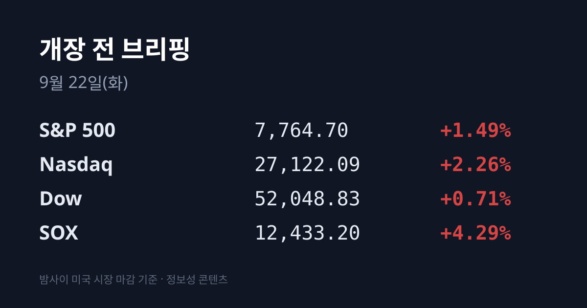
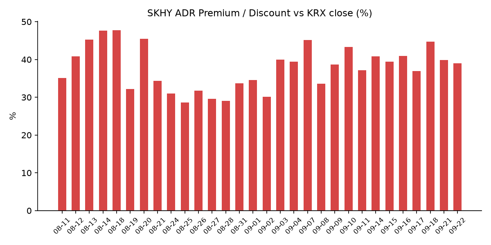
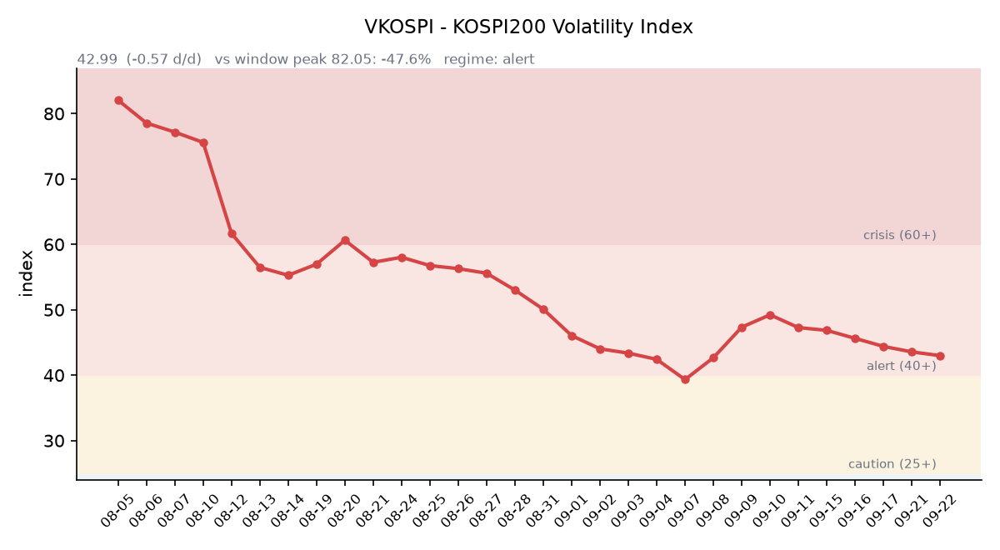

## ① 30초 요약

- 밤사이 <mark>나스닥이 +2.26%로 사상 최고</mark>를 새로 썼습니다. S&P500 +1.49%, 다우 +0.71%였고 필라델피아 반도체지수(SOX)는 **+4.29%로 5거래일 연속** 상승했습니다.
- 랠리의 진원지는 메타의 AI 에이전트 '뮤즈'였습니다. 에이전트형 AI가 CPU·메모리·스토리지 사용시간을 함께 늘린다는 논리가 부상하며 <mark>인텔 +12.14%, AMD +9.95%(사상 첫 시총 1조달러)</mark>를 기록했고, 엔비디아는 +2.29%에 그쳤습니다.
- 미 10년물 국채금리가 **4.954%로 5%를 다시 내줬고**, 국제유가는 미·이란 외교 가능성 기대에 급락했습니다.
- 어제 코스피는 **7,007.72(+1.65%)로 6거래일 만에 7,000선을** 회복했습니다. 삼성전자가 +4.98%로 끌었고 SK하이닉스는 +0.59%에 그쳤습니다.
- 원/달러 서울 주간 종가는 1,381.0원으로 **8거래일 연속 상승이 끊겼고**, 작성 시점 현재는 1,375.13원입니다.

## ② 밤사이 미국 시장

| 지수 | 종가 | 등락률 |
| :--- | ---: | ---: |
| S&P 500 | 7,764.70 | +1.49% |
| 나스닥 종합 | 27,122.09 | +2.26% |
| 다우 | 52,048.83 | +0.71% |
| 필라델피아 반도체(SOX) | 12,433.20 | +4.29% |

랠리의 출발점은 반도체가 아니라 소프트웨어였습니다. 메타가 이달 초 내놓은 에이전트형 AI '뮤즈(Muse)'가 애플 앱스토어 무료 앱 순위 1위에 오르자, 시장은 그 수요가 어디로 흘러가는지를 다시 계산했습니다. 기존 생성형 AI가 질문에 답하는 과정에서 GPU를 집중적으로 썼다면, 에이전트형 AI는 사용자의 지시가 끝난 뒤에도 예약·일정 관리·구매·데이터 처리를 백그라운드에서 계속 수행합니다. 그만큼 CPU 가동 시간과 메모리·스토리지·클라우드 자원 사용이 함께 늘어난다는 해석이 나왔습니다.

그 결과가 종목별 등락에 그대로 찍혔습니다. <mark>인텔 +12.14%, AMD +9.95%, ARM 약 +17%, 퀄컴 +9%</mark>로 CPU 진영이 앞섰고, 메타 자신도 +11% 올랐습니다. 반면 GPU 대표주인 엔비디아는 +2.29%, 마이크론은 +2.77%였습니다. AMD는 이날 사상 처음으로 시가총액 1조달러를 넘었습니다. SOX의 5거래일 누적 상승률은 **+11.3%** 수준입니다.

금리와 유가는 같은 방향으로 움직였습니다. 미 10년물은 4.954%로 0.045%포인트 내려 5% 아래로 돌아왔고, 30년물은 5.280%(−0.047%포인트), 2년물은 4.751%(+0.007%포인트)였습니다. 10년−2년 스프레드는 +0.203%포인트입니다. VIX는 14.87(+0.41%)로 낮은 수준을 유지했습니다. 달러인덱스는 100.43(+0.17%), 금은 온스당 $4,350.63(−0.75%)이었습니다. 국제유가는 호르무즈 해협 원유 수송 개선과 미·이란 외교 가능성 기대가 겹치며 브렌트가 배럴당 100달러 안팎까지 밀렸습니다.

한국석유공사 페트로넷의 09/21 기준 고시가는 두바이 $113.69, 브렌트 $100.34, WTI $95.78입니다. 고시가 게시는 통상 하루 지연되므로 위 미국 세션의 하락은 아직 반영되기 전 수치입니다. 한국의 원유 수입 기준유종인 두바이유가 브렌트보다 **배럴당 $13.35 비싼 역전** 상태가 이어지고 있습니다.

09/21 미국 정규장 마감 후 한국 증시와 관련된 주요 실적 발표는 없었습니다.

## ③ 괴리율 트래커 — SK하이닉스 ADR

| 항목 | 수치 |
| :--- | ---: |
| SKHY 종가 | $188.84 (+0.71%) |
| 본주 환산가 (×10×환율 1,375.13원) | 2,596,795원 |
| 본주 직전 종가 | 1,868,000원 |
| **괴리율** | **+39.0%** |

전일 +39.90%에서 0.89%포인트 좁혀졌습니다. 다만 좁혀진 경로가 전일과 다릅니다. 금요일에는 본주가 +6.42%로 뛰어 환산가를 따라잡으며 줄었지만, 이번에는 환율이 5.87원 내려 환산가 자체가 낮아진 결과입니다. 본주는 어제 +0.59% 올랐을 뿐입니다.

괴리율은 미국에 상장된 예탁증서(ADR) 가격을 본주 1주 기준으로 환산한 값과 한국 본주 종가를 비교한 수치입니다. 환산가가 본주보다 높은 프리미엄 상태에서는, 두 시장의 가격이 붙는 방향으로 움직일 때 이익을 얻는 전환 차익거래 구조상 본주 쪽에 매수 유인이 생깁니다. 반대로 디스카운트면 매도 유인이 생기는 대칭 구조입니다. 현재 본주는 환산가보다 28.1% 낮은 수준입니다. 이 트래커 48거래일 기록에서 오늘 값은 17위이며, 전 구간 최고는 07/31의 +62.0%였습니다.

같은 밤 한국 시장 전체를 담는 EWY(iShares MSCI South Korea ETF)는 <mark>$189.16으로 +4.33%</mark> 상승했고 시간외는 $189.24(+0.04%)였습니다. 어제 한국장이 +1.65% 오른 뒤 미국 투자자가 그 위에 2%포인트 넘게 더 얹은 셈입니다. 하이닉스 단일 종목(ADR +0.71%)보다 지수 전체가 더 크게 재평가됐다는 점이 전일과 달라진 부분입니다.

## ④ 변동성 트래커

**판정 한 줄**: <mark>'경보' 유지, 방향은 진정</mark> — VKOSPI가 전일 대비 내렸고 신용융자 잔고도 9월 초 고점보다 줄어, 두 축이 같은 방향을 가리킵니다.

**기대 변동성**  VKOSPI **42.99**(전일비 −0.57, −1.31%)로 '경보'(40~60) 구간입니다. 6월 고점 96.94 대비 −55.7%까지 내려왔으나 평시 상단인 25의 **1.72배** 수준입니다. 같은 시각 미국 VIX는 14.87로, 두 시장의 기대 변동성 차이는 2.9배입니다. (한국거래소 통계정보 기준)

**실현 변동성**  최근 5거래일 코스피 일별 등락률은 09/15 −0.85%, 09/16 +1.37%, 09/17 −0.04%, 09/18 +2.66%, 09/21 +1.65%였습니다. ±3.5% 이상 등락일은 0일입니다. 어제 일중 변동폭(고가 7,027.58 − 저가 6,938.34)은 종가 대비 1.27%였고, 시가와 저가가 같아 장중 한 번도 시가를 밑돌지 않았습니다.

**청산 압력**  신용융자 잔고는 09/15 기준 **32조8,319억원**으로 09/04의 33조5,958억원에서 줄었습니다. 유가증권시장만 보면 26조5,289억원 → 25조6,204억원으로 9,085억원 감소했습니다. 투자자예탁금은 8월 말 104조원대입니다.

**하방 포지션**  공매도 순잔고는 T+2~3 공시 지연이 있어 개장 전 시점에는 확정치를 알 수 없습니다.

**증폭 경로**  레버리지 ETF 거래대금 비중·회전율은 이번 집계에서 수집되지 않았습니다.

*미확인: 레버리지 ETF 비중·회전율, 공매도 순잔고 최신치, 신용융자 당일치, 오늘 개장 직전 밤의 코스피200 야간선물(한국거래소가 다음 날 아침 공개), DRAM·NAND 당일 현물가.*

## ⑤ 어제 한국장 리뷰

| 지수 | 종가 | 등락 |
| :--- | ---: | ---: |
| 코스피 | 7,007.72 | +113.49 (+1.65%) |
| 코스닥 | 836.27 | +9.15 (+1.11%) |

코스피 수급은 기관이 1조4,923억원 순매수, 기타법인이 <mark>1조6,585억원 순매수</mark>였고 개인은 2조9,789억원, 외국인은 1,602억원 순매도였습니다. 기타법인 매수는 삼성전자·SK하이닉스의 자사주 매입 물량이 포함된 수치입니다. 코스닥에서는 개인이 1,427억원 순매수, 외국인 991억원·기관 306억원 순매도였습니다.

종목별로는 **삼성전자가 274,000원(+4.98%)**, SK하이닉스가 1,868,000원(+0.59%)이었습니다. 반도체 후공정 종목이 두드러져 시그네틱스가 상한가(2,795원, +30.00%)를 기록했고 SFA반도체·하나마이크론·뉴파워프라즈마가 동반 급등했습니다. 코스피에서 상한가는 5종목이었습니다. 신규 상장한 AI 음성합성 기업 네오사피엔스는 공모가 1만원 대비 +268%인 36,850원으로 첫날을 마쳤습니다. 반면 현대차는 −1.64%, LG에너지솔루션은 −3.3%로 밀렸습니다. 업종별로는 의료·정밀기기가 5%대, 유통·전기전자가 2%대 올랐고 비금속·운송장비·금속이 1%대 내렸습니다.

원/달러는 서울 외환시장 주간 종가 1,381.0원으로 2.3원 내려 8거래일 연속 상승이 끊겼습니다. 작성 시점 현재는 1,375.13원(08:00 KST)입니다. 같은 기간 달러인덱스는 오히려 올랐습니다. 달러 전반이 아니라 원화만 강해진 흐름입니다. 달러/엔은 157.30(+0.28%)입니다.

한국거래소 확정치 기준 선물 베이시스는 +2.94(선물 1,115.10 − 현물 1,112.16)로 콘탱고를 유지했습니다. 코스피200 야간선물은 09/21 개장 직전 밤 세션이 1,094.80으로 직전 주간 종가 대비 +2.35, 거래량 21,272계약이었습니다.

관세청이 어제 발표한 9월 1~20일 수출은 **714억달러(+78.3%)로 역대 최대**였습니다. 반도체가 341억달러(+259.4%)로 전체 수출의 47.8%를 차지해 1년 전보다 24.1%포인트 높아졌고, 조업일수를 고려한 일평균 수출은 46억1,000만달러(+89.8%)였습니다. 같은 기간 무역수지는 230억달러 흑자입니다.

## ⑥ 오늘의 캘린더 & 관전 포인트

- **오늘** — 일본 증시 휴장(09/22·09/23 이틀 연속). 아시아 시간대 유동성이 얇은 구간입니다.
- **오늘 밤** — 제81차 유엔총회 고위급 주간 개막(09/22~28), <mark>트럼프 대통령 연설</mark>. 어젯밤 유가 급락의 근거가 미·이란 외교 가능성 기대였습니다.
- **09/23** — 미국·유럽·일본 제조업 PMI 동시 발표.
- **09/24** — **트럼프·시진핑 워싱턴 정상회담.** 관세 휴전 연장, 희토류, AI·반도체 수출통제가 의제로 거론됩니다. 한국 증시는 이날 추석 휴장입니다.
- **09/24~09/25** — 추석 연휴 휴장. 이번 주 남은 거래일은 오늘과 09/23 이틀이며 다음 거래일은 09/28(월)입니다.
- **09/25~09/27** — 중국 중추절 휴장(09/28 재개장).
- **09/30** — 마이크론 FQ4'26 실적 발표.

시장이 주시하는 레벨: 원/달러 **1,385원** 선, SK하이닉스 ADR 괴리율 **+39%대**, 미 10년물 **5.05%** 선, VKOSPI **48** 선, 대만 가권 지수의 오전 등락, 두바이유 **$105** 선입니다.

## ⑦ 정책 워치

삼성전자·SK하이닉스의 자사주 매입 진척이 이어지고 있습니다. SK하이닉스는 지난달 20일부터 22거래일 동안 1,415만주를 매입해 예정 물량의 약 60%를 소진했고, 하루 평균 약 65만주 속도가 유지되면 잔여 992만주는 15~16거래일분에 해당합니다. 당초 11월 중순으로 예상됐던 매입 종료 시점이 10월 중순께로 앞당겨질 수 있다는 전망이 시장에서 나오고 있습니다.

공매도는 전면 재개 상태이며 제도 변경 사항은 확인되지 않았습니다.

## ⑧ 오늘의 질문

밤사이 미국을 움직인 '에이전트 AI가 CPU·메모리 수요를 늘린다'는 논리가, 어제 삼성전자를 SK하이닉스보다 크게 올린 한국 시장의 흐름과 같은 이야기인가.

---
*본 글은 공개된 시장 데이터를 정리한 정보성 콘텐츠이며, 특정 종목·상품의 매매 권유가 아닙니다. 모든 투자 판단과 책임은 투자자 본인에게 있습니다. 수치는 작성 시점 기준이며 이후 변동될 수 있습니다.*
