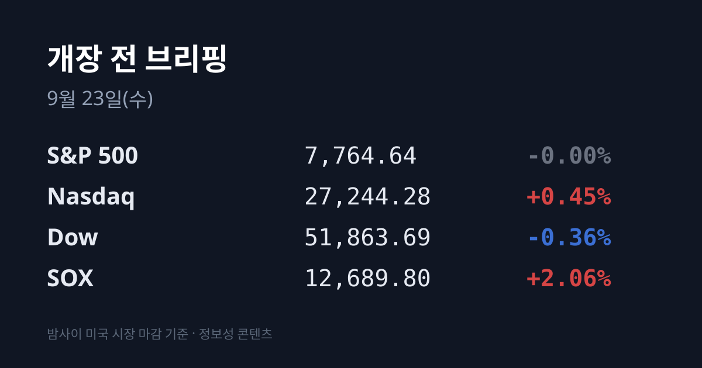
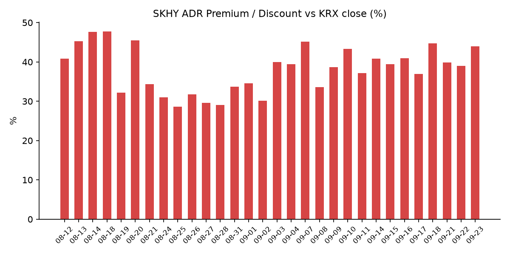
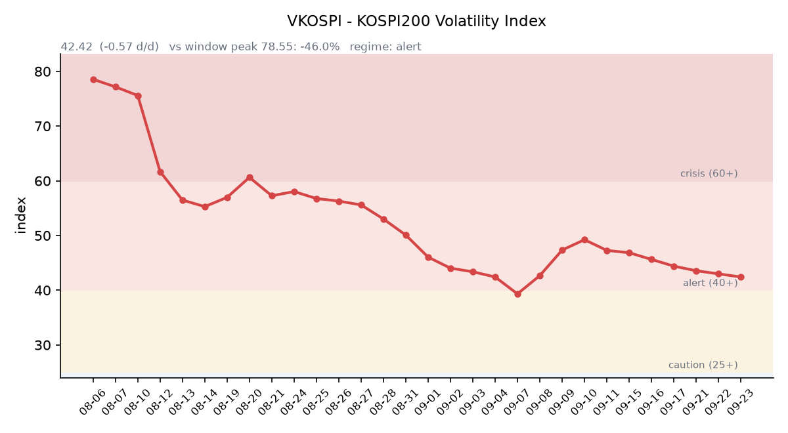

## ① 30초 요약

- 밤사이 나스닥은 +0.45%로 **이틀 연속 사상 최고**를 기록했고, 필라델피아 반도체지수(SOX)는 +2.06%로 6거래일 연속 올랐습니다. S&P500은 보합, 다우는 −0.36%였습니다.
- 메모리주가 반도체 상승을 이끌었습니다. 샌디스크 +6.73%, 마이크론 +3.44%였고 <mark>SK하이닉스 ADR(SKHY)은 +3.45%</mark> 올랐습니다.
- 국제유가는 5거래일 연속 하락해 브렌트가 배럴당 $99.25로 보름 만에 100달러 아래로 내려왔습니다. 이란의 호르무즈 해협 재개방 제안 보도가 계기였습니다.
- 어제 코스피는 +2.19%로 출발했으나 상승분을 대부분 반납해 7,017.91(+0.15%)로 마쳤습니다. SK하이닉스는 −1.50%로 6거래일 만에 내렸습니다.
- 원/달러 서울 종가는 <mark>1,358.2원으로 22.8원 급락</mark>했습니다. 7월 8일 이후 가장 큰 하루 낙폭입니다. 오늘은 추석 연휴 전 마지막 거래일입니다.

## ② 밤사이 미국 시장

| 지수 | 종가 | 등락률 |
| :--- | ---: | ---: |
| S&P 500 | 7,764.64 | −0.00% |
| 나스닥 종합 | 27,244.28 | +0.45% |
| 다우 | 51,863.69 | −0.36% |
| 필라델피아 반도체(SOX) | 12,689.80 | +2.06% |

전날 메타의 AI 에이전트 '뮤즈'가 불을 붙인 AI 랠리가 이틀째 이어졌지만, 이번에는 CPU가 아니라 메모리가 앞에 섰습니다. 로젠블랫이 샌디스크 분석을 '매수' 의견, 목표가 $2,400로 새로 시작하면서 샌디스크가 **+6.73%** 올랐고, 마이크론은 +3.44%였습니다. 스티펠은 마이크론이 09/30 실적에서 컨센서스를 웃도는 결과와 가이던스를 낼 것으로 분석하며 목표가 $1,500를 유지했습니다. 메타는 전날 +11%에 이어 +1.5% 더 올랐습니다.

반면 같은 AI 에이전트 논리가 은행주에는 악재로 작용했습니다. AI 에이전트가 소비자의 금융 행태를 바꿔 전통 은행 사업을 잠식할 수 있다는 우려에, 수익률 곡선이 평평해 순이자마진이 눌린다는 부담이 겹치며 JP모건이 약 −3.3%, 뱅크오브아메리카·씨티가 −2~3% 내렸습니다. 다우가 하락하고 S&P500이 보합에 머문 배경입니다.

국제유가는 이란이 미국의 군사 압박 완화와 이란 항구 봉쇄 해제를 조건으로 **7일 안에 호르무즈 해협을 재개방**할 수 있다고 제안했다는 보도와 사우디 동서 송유관 재가동 준비 소식에 5거래일 연속 내렸습니다. WTI는 $94.59(−1.2%), 브렌트는 $99.25(−1.1%)입니다. 한국의 원유 수입 기준유종인 두바이유는 09/22 기준 $111.20(−$2.49)으로, 브렌트보다 약 $12 비싼 역전 상태가 이어지고 있습니다.

트럼프 대통령은 유엔총회 연설에서 이란에 "합의하거나 궤멸시키거나"의 결정을 앞두고 있다고 말했고, 같은 날 미·이란 당국자가 유엔 부대 행사에서 약 3시간 회동했습니다. 트럼프 대통령은 이 대화를 "매우 좋고 생산적"이었다고 평가하면서도 합의 시점은 "11월 대선 직후"로 언급했습니다. 미 행정부는 경유 가격 급등(올해 +83%)에 대응해 경유 수출 금지도 검토 중이며, 베선트 재무장관은 "전면 또는 부분 금지가 가능한지 정유 능력을 따져 보고 있다"고 밝혔습니다.

미 10년물 국채금리는 4.96% 안팎으로 소폭 올랐고, 30년물은 5.30% 안팎, 2년물은 4.75% 안팎이었습니다. 10년물 실질금리(TIPS)는 2.62%(09/21)입니다. 세인트루이스 연은 무살렘 총재가 추가 인상이 필요할 수 있다고 언급했고, CME 페드워치 기준 10/28 FOMC의 25bp 인상 확률은 59.7%입니다. 연준은 지난 09/16 기준금리를 3.75~4.00%로 올렸습니다. VIX는 14.87(09/21), 달러인덱스는 100.37(+0.21%), 금은 온스당 $4,363.26(+0.47%)이었습니다.

09/22 미 정규장 마감 후에는 KB홈이 실적을 발표했으나(주당순이익 예상 상회, 마진 가이던스 하향, 시간외 −2.23%) 한국 증시와 직접 관련된 발표는 없었습니다.

## ③ 괴리율 트래커 — SK하이닉스 ADR

| 항목 | 수치 |
| :--- | ---: |
| SKHY 종가 | $195.37 (+3.45%) |
| 본주 환산가 (×10×환율 1,355.55원) | 2,648,338원 |
| 본주 직전 종가 | 1,840,000원 |
| **괴리율** | **+43.9%** |

괴리율은 전일 +39.01%에서 **4.92%포인트 벌어졌습니다.** 벌어진 경로가 뚜렷합니다. 한국 본주는 어제 −1.50% 내렸고, 같은 날 밤 미국의 ADR은 +3.45% 올랐습니다. 환율이 19.6원 내려 환산가를 1.4% 깎았는데도 괴리가 커졌습니다. SKHY 시간외 가격은 $195.50(+0.07%)였습니다.

괴리율은 미국에 상장된 예탁증서(ADR) 가격을 본주 1주 기준으로 환산한 값과 한국 본주 종가를 비교한 수치입니다. 환산가가 본주보다 높은 프리미엄 상태에서는, 두 시장의 가격이 붙는 방향으로 움직일 때 이익을 얻는 전환 차익거래 구조상 본주 쪽에 매수 유인이 생깁니다. 반대로 디스카운트면 매도 유인이 생기는 대칭 구조입니다. 현재 본주는 환산가보다 30.5% 낮은 수준입니다. 이 트래커 49거래일 기록에서 오늘 값은 8위이며, 전 구간 1위는 07/31의 +62.0%입니다.

한국 시장 전체를 담는 EWY(iShares MSCI South Korea ETF)는 <mark>$192.62로 +1.83%</mark> 올랐고, 시간외는 $192.51(−0.06%)였습니다. 어제 코스피 상승률(+0.15%)보다 1.7%포인트 높은 수준입니다. 개장 전 NXT 프리마켓(08:04)에서는 삼성전자가 283,000원(+2.35%), SK하이닉스가 1,897,000원(+3.10%)에 거래됐습니다.

## ④ 변동성 트래커

**판정 한 줄**: <mark>'경보' 유지, 방향은 진정</mark> — VKOSPI가 이틀 연속 내렸지만, 어제 장중 변동폭은 2.6%로 커져 기대와 실현 변동성이 다른 방향을 가리킵니다.

**기대 변동성**  VKOSPI **42.42**(전일비 −0.57, −1.33%)로 '경보'(40~60) 구간입니다. 6월 고점 96.94 대비 −56.2%까지 내려왔으나 평시 상단인 25의 1.70배 수준입니다. 같은 시각 미국 VIX는 14.87로, 두 시장의 기대 변동성 차이는 2.9배입니다. (한국거래소 통계정보 기준)

**실현 변동성**  최근 6거래일 코스피 일별 등락률은 09/15 −0.85%, 09/16 +1.37%, 09/17 −0.04%, 09/18 +2.66%, 09/21 +1.65%, 09/22 +0.15%였습니다. ±3.5% 이상 등락일은 0일입니다. 다만 어제는 시가 7,161.61에서 저가 6,986.27까지 밀려 **일중 변동폭이 종가 대비 2.64%로** 전일(1.27%)의 두 배였습니다.

**증폭 경로**  레버리지 ETF 거래대금은 전체 ETF 거래대금의 8.96%였습니다. KODEX 반도체레버리지는 거래대금 2,973억원·회전율 25.78%, TIGER 반도체TOP10레버리지는 2,126억원·31.36%였습니다.

**청산 압력**  신용융자 잔고는 최신 확정치인 09/15 기준 32조8,319억원으로, 09/04의 33조5,958억원에서 줄어든 상태입니다.

**하방 포지션**  공매도 순잔고는 T+2~3 공시 지연이 있어 개장 전 시점에는 확정치를 알 수 없습니다.

*미확인: 공매도 순잔고 최신치, 신용융자 09/15 이후 집계, 오늘 개장 직전 밤의 코스피200 야간선물(한국거래소가 다음 날 아침 공개), DRAM·NAND 당일 현물가.*

## ⑤ 어제 한국장 리뷰

| 지수 | 종가 | 등락 |
| :--- | ---: | ---: |
| 코스피 | 7,017.91 | +10.19 (+0.15%) |
| 코스닥 | 834.38 | −1.89 (−0.23%) |

코스피는 7,161.61(+2.19%)로 출발해 장중 7,171.44까지 올랐지만, 오후 들어 상승분을 대부분 반납했습니다. 시장에서는 개인 매도, 아시아 시간대 유가 선물 반등, SK하이닉스 차익실현을 되밀림 요인으로 꼽았습니다.

코스피 수급(네이버 증권 집계)은 **개인 1조5,643억원 순매도**, 기관 1,295억원 순매도였고 외국인은 494억원 순매수였습니다. 기타법인이 약 1조6,400억원을 순매수해 이틀 연속 1조6천억원대를 기록했으며, 삼성전자·SK하이닉스 자사주 매입이 포함된 수치입니다. 매체별 집계에서는 외국인 순매수가 765억~859억원으로 나타나는 등 편차가 있습니다. 코스닥에서는 개인이 1,548억원 순매수, 외국인 545억원·기관 953억원 순매도였습니다.

종목별로는 삼성전자가 276,500원(+0.91%)으로 장중 28만원을 넘었다가 상승분을 일부 반납했습니다. SK하이닉스는 장중 1,935,000원(+3.59%)까지 올랐다가 오후에 하락 전환해 1,840,000원(−1.50%)으로 마쳐 6거래일 만에 내렸습니다. AI 서버용 PCB 기판주가 두드러져 코리아써키트 +25.43%, 티엘비 +16.93%, 심텍 +12.47%를 기록했고, 동국생명과학·노타·셀리드·더블유에스아이·씨싸이트가 상한가였습니다.

원/달러는 서울 외환시장 주간 종가 <mark>1,358.2원(−22.8원, −1.65%)</mark>으로 마감했고 장중 저가는 1,352.9원이었습니다. 추석 전 수출업체의 달러 매도(네고) 물량이 장 초반부터 이어졌고, 1,380원을 밑돈 뒤에는 역외 매도가 더해졌습니다. 같은 날 달러인덱스는 올랐습니다. 작성 시점 현재 환율은 1,355.5원 안팎입니다. 달러/엔은 157.46(+0.09%)입니다.

한국거래소 확정치 기준 선물 베이시스는 −1.30(선물 1,112.00 − 현물 1,113.30)으로 전일 +2.94에서 백워데이션으로 돌아섰습니다. 코스피200 야간선물은 09/22 개장 직전 밤 세션이 1,137.00으로 직전 주간 종가 대비 +21.90, 거래량 26,076계약이었습니다.

아시아 증시는 대만 가권 47,800.17(+0.17%), 상하이종합 3,952.13(+0.06%), CSI300 4,544.59(+0.11%), 항셍 25,087.75(+0.18%)로 모두 소폭 올랐습니다. 일본은 09/21~09/23 연휴로 휴장 중입니다.

## ⑥ 오늘의 캘린더 & 관전 포인트

- **오늘** — **추석 연휴 전 마지막 거래일.** 일본 증시는 사흘째 휴장입니다.
- **오늘 밤 22:45** — 미국 S&P 글로벌 제조업·서비스업 PMI 예비치. 이번 주 연준 인사 발언이 10회 이상 예정돼 있습니다.
- **09/24(목)** — <mark>트럼프·시진핑 워싱턴 정상회담</mark>. AI, 이란 전쟁, 관세, 희토류가 의제로 거론됩니다. 한국 증시는 이날 휴장입니다.
- **09/24~09/25** — 추석 연휴 휴장. 다음 거래일은 09/28(월)입니다.
- **이번 주 후반** — 미국 8월 PCE 물가, 2분기 GDP 확정치, 내구재 주문.
- **09/25~09/27** — 중국 중추절 휴장(09/28 재개장).
- **09/28(월)** — 삼성전자 3분기 배당 최종 매수일(09/29 배당락, 09/30 기준일). 증권가는 특별배당을 포함해 주당 약 4,604원을 추정하고 있으며 공식 금액은 10월 이사회에서 확정됩니다.
- **09/30** — 마이크론 FQ4'26 실적 발표.

시장이 주시하는 레벨: SK하이닉스 **190만원** 선, 원/달러 1,370원 선, 브렌트 $101 선, VKOSPI 46 선, 대만 가권 지수의 오전 등락, 어제처럼 시가 대비 되밀림이 나오는지 여부입니다.

## ⑦ 정책 워치

국회 산업통상자원중소벤처기업위원장은 어제 대미투자 1호 사업 규모가 223억달러라고 밝혔고, 산업통상자원부는 1호 양해각서(MOU) 체결 시점이 아직 정해지지 않았다고 설명했습니다.

미 행정부의 경유 수출 금지 검토는 아시아 경유 수급과 정제마진에 연결되는 사안입니다.

공매도는 전면 재개 상태이며 제도 변경 사항은 확인되지 않았습니다.

## ⑧ 오늘의 질문

어제 오후 한국장을 끌어내린 유가 반등과 하이닉스 차익실현을 밤사이 미국이 모두 되돌린 상황에서, 추석 휴장을 앞둔 마지막 거래일에 한국 시장은 밤사이 신호를 얼마나 반영하는가.

---
*본 글은 공개된 시장 데이터를 정리한 정보성 콘텐츠이며, 특정 종목·상품의 매매 권유가 아닙니다. 모든 투자 판단과 책임은 투자자 본인에게 있습니다. 수치는 작성 시점 기준이며 이후 변동될 수 있습니다.*
