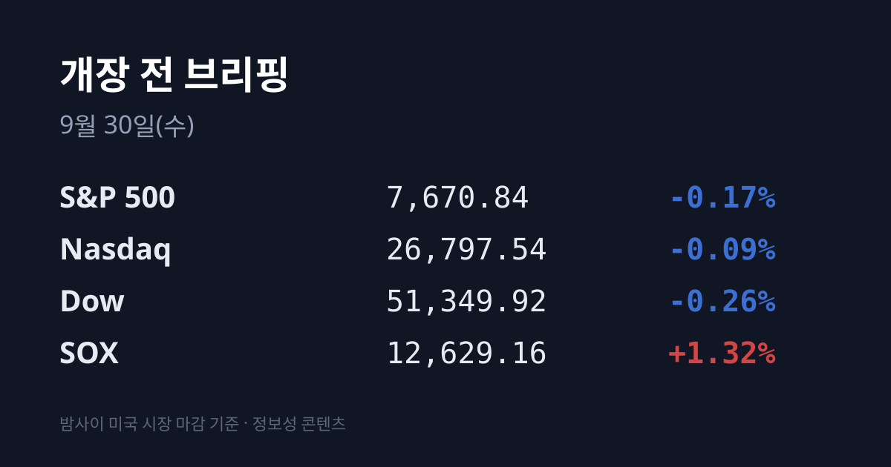
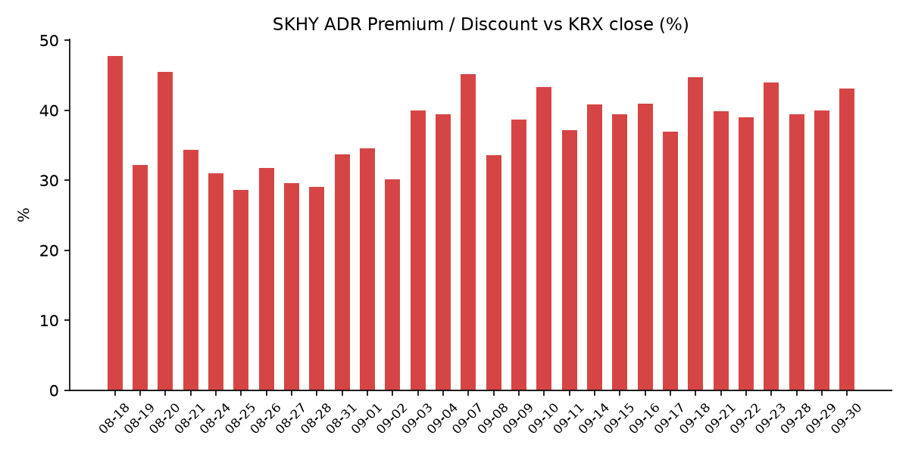
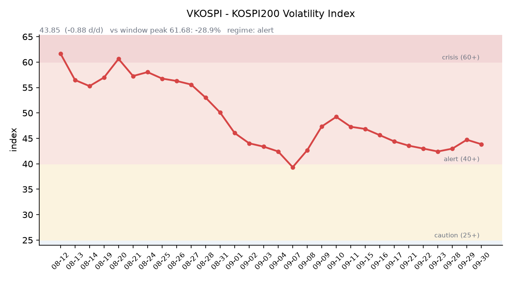

## ① 30초 요약

- 미국 증시는 09/29 S&P500 −0.17%, 나스닥 −0.09%로 소폭 내렸지만, 필라델피아 반도체지수(SOX)는 <mark>+1.32%로 반등</mark>했습니다.
- 9월 소비자신뢰지수가 81.9로 2014년 4월 이후 최저를 기록했고, 윌리엄스 뉴욕 연은 총재가 "서두를 필요 없다"고 말하면서 10월 FOMC 인상 확률은 **약 70%에서 50% 안팎으로** 내려왔습니다.
- 한국 시장 전체를 담는 EWY는 **+1.92%**, SK하이닉스 ADR(SKHY)은 $186.68(+2.62%)이었습니다. 괴리율은 +43.1%로 벌어졌습니다.
- 브렌트유 11월물은 −2.6%, WTI는 −3.5% 내렸습니다. 사우디 송유관 복구와 미국 전략비축유 방출이 겹쳤습니다.
- 직전 거래일 코스피는 외국인 2조9천억원 순매도 속에 6,870.81(−0.27%)로 마감했습니다. <mark>마이크론 실적은 한국 시각 10/01 05:30</mark>에 나옵니다.

## ② 밤사이 미국 시장

| 지수 | 09/29 종가 | 등락률 |
| :--- | ---: | ---: |
| S&P 500 | 7,670.84 | −0.17% |
| 나스닥 종합 | 26,797.54 | −0.09% |
| 다우 | 51,349.92 | −0.26% |
| 필라델피아 반도체(SOX) | 12,629.16 | +1.32% |

미국 증시는 이틀 연속 내렸지만 세 지수 모두 장중 저점에서 올라와 마감했습니다. 장기금리가 한 번 더 올랐고, 9월 컨퍼런스보드 소비자신뢰지수가 81.9(예상 약 89)로 2014년 4월 이후 가장 낮았으며, 8월 구인건수(JOLTS)도 707.9만 건으로 예상(722.8만 건)을 밑돌았습니다. 반대로 유가 급락과 윌리엄스 총재의 발언이 낙폭을 줄였습니다. 반도체는 브로드컴 +1.58%, 마이크론 $1,065.08(+1.05%), TSMC ADR +0.90%, 샌디스크 +0.98%로 올랐고, 엔비디아는 $227.21(−0.72%)로 내렸습니다. AMD는 World Labs를 $82억 규모 주식으로 인수한다고 밝혔고 −0.05%로 마쳤습니다. 오라클은 4거래일 연속 하락 뒤 +3.91% 반등했습니다. 한국 시각 07:53 기준 미국 지수선물은 S&P500 +0.14%, 나스닥100 +0.18%입니다.

금리는 장기물과 단기물이 엇갈렸습니다. 미 재무부 기준 09/29 10년물은 5.26%(+2bp), 30년물은 5.59%(+3bp)로 올랐고, 2년물은 4.89%(−3bp)로 내렸습니다. 10년물과 2년물의 차이는 0.37%p로 벌어졌고, 10년물 실질금리(TIPS)는 2.91%(+1bp)입니다. 윌리엄스 총재는 "서두를 필요가 없다"면서도 연내 한 차례 추가 인상은 적절할 수 있다고 말했습니다. 10/28 FOMC의 25bp 인상 확률은 Kitco 51.5%, CoinDesk 51% 등 **47~52% 수준으로** 보도됐습니다(전일 약 70.9%, CME 원문은 미확인). VIX는 16.04(−0.19%), 달러인덱스는 101.38(+0.18%, 한국 시각 07:04)입니다.

브렌트유 11월물은 $102.59(−2.6%), 거래가 옮겨 가는 12월물은 $96.16(−1.7%), WTI 11월물은 $89.38(−3.5%)로 정산됐습니다. 사우디 동서 송유관이 정상의 약 50%(하루 약 350만배럴) 수준으로 복구돼 얀부 선적이 재개됐고, 미국 정부는 전략비축유를 최대 4,000만배럴 방출하기로 했습니다. 한국 원유 수입의 기준인 두바이유는 $107.50(−1.83%, 09/29)으로 여전히 브렌트보다 높습니다. 금 현물은 $4,172.40(+1.42%)으로 반등했는데, Kitco는 약한 경제지표로 10월 인상 기대가 줄어든 것을 배경으로 꼽았습니다.

직전 정규장 마감 후 대형주의 실적 발표는 없었습니다. 마이크론 FQ4 실적은 미국 시각 09/30 장 마감 후, 컨퍼런스콜은 한국 시각 10/01 05:30입니다. 시장 컨센서스는 매출 약 $506억~512억, 주당순이익 약 $31.3~31.6입니다.

## ③ 괴리율 트래커 — SK하이닉스 ADR

| 항목 | 수치 |
| :--- | ---: |
| SKHY 종가 | $186.68 (+2.62%) |
| 본주 환산가 (×10×환율 1,352.84원) | 2,525,482원 |
| 본주 직전 종가 | 1,765,000원 |
| **괴리율** | **+43.1%** |

괴리율은 전일 +39.94%에서 **3.15%포인트 벌어졌습니다.** 한국 본주가 09/29 −0.17%로 보합권에 머무는 동안, 같은 날 밤 미국의 ADR은 +2.62% 올랐습니다. 번스타인이 목표주가를 낮췄다는 소식에도 ADR은 올랐습니다. 솔리다임의 미국 상장 검토와 관련해 SK하이닉스는 결정된 바가 없다는 입장입니다. SKHY 시간외 가격은 $186.76(+0.04%)입니다.

괴리율은 미국에 상장된 예탁증서(ADR) 가격을 본주 1주 기준으로 환산한 값과 한국 본주 종가를 비교한 수치입니다. 환산가가 본주보다 높은 프리미엄 상태에서는 전환 차익거래 구조상 본주 쪽에 매수 유인이 생기고, 디스카운트면 반대입니다. 오늘 값은 <mark>09/23(+43.93%) 이후 가장 큰 폭</mark>이며, 이 트래커 52거래일 기록에서는 10위입니다. 전 구간 1위는 07/31의 +62.0%입니다.

한국 시장 전체를 담는 EWY(iShares MSCI South Korea ETF)는 $187.10(+1.92%)으로, 코스피 −0.27% 마감 뒤 올랐습니다. 시간외는 $187.08(−0.01%)입니다.

## ④ 변동성 트래커

**판정 한 줄**: <mark>'경보' 유지, 방향은 소폭 진정</mark> — VKOSPI가 사흘 만에 내렸고, 선물 베이시스가 콘탱고로 돌아섰으며, 코스피 일중 변동폭은 전일보다 좁았습니다.

**기대 변동성**  VKOSPI **43.85**(09/29, 전일비 −0.88, −1.97%)로 '경보'(40~60) 구간입니다. 6월 고점 96.94 대비 −54.8%이며 평시 상단인 25의 1.75배 수준입니다. 미국 VIX는 16.04로 보합이었습니다. (한국거래소 통계정보 기준)

**실현 변동성**  최근 7거래일 코스피 일별 등락률은 09/17 −0.04%, 09/18 +2.66%, 09/21 +1.65%, 09/22 +0.15%, 09/23 +0.90%, 09/28 −2.70%, 09/29 −0.27%였습니다. ±3.5% 이상 등락일은 0일입니다. 09/29는 저가 6,782.99에서 고가 6,898.36 사이를 오가 일중 변동폭이 종가 대비 1.68%였습니다.

**증폭 경로**  레버리지 ETF 거래 비중은 개장 전 시점에 집계할 수 있는 무료 소스가 없어 싣지 않습니다. 한국거래소 확정치 기준 선물 베이시스는 **+7.95**(선물 1,096.10 − 현물 1,088.15)로, 전일 −0.38의 백워데이션에서 콘탱고로 바뀌었습니다.

**청산 압력**  신용융자 잔고는 09/23 기준 32조7,764억원으로, 8/3(27조4,439억원) 대비 7주 동안 5조3,326억원(+19.4%) 늘었습니다(파이낸셜뉴스 09/29 보도). 10/01부터 대형 증권사 10곳의 신용공여 한도가 자기자본의 90% 이내로 관리되고, 10/19부터 단일 종목 신용공여를 회사 전체의 15% 이내로 묶는 집중도 관리가 시작됩니다.

**하방 포지션**  공매도 순잔고는 T+2~3 공시 지연이 있어 개장 전 시점에는 확정치를 알 수 없습니다.

*미확인: 레버리지 ETF 거래 비중, 공매도 순잔고 최신치, 9월 하순 반대매매 금액, 오늘 개장 직전 밤의 코스피200 야간선물(한국거래소가 다음 날 아침 공개), DRAM·NAND 당일 현물가.*

## ⑤ 직전 거래일(09/29) 한국장 리뷰

| 지수 | 종가 | 등락 |
| :--- | ---: | ---: |
| 코스피 | 6,870.81 | −18.93 (−0.27%) |
| 코스닥 | 849.80 | +3.22 (+0.38%) |

코스피는 6,844.41(−0.66%)로 출발해 장중 6,782.99까지 밀렸다가 낙폭을 줄여 마감했습니다. 매체들은 미 10년물 금리 5.2%대와 유가 부담, 트럼프 대통령의 호르무즈 재개방 제안 거부, 리사 쿡 연준 이사의 인상 시사를 하락 요인으로 꼽았습니다. 상승 종목은 232개, 하락 종목은 624개로 체감은 지수보다 약했습니다. 코스닥은 3거래일 연속 올랐습니다.

코스피 수급은 개인 1조1,432억원·기관 1,211억원 순매수, <mark>외국인 2조9,030억원 순매도</mark>였고, 외국인 매도의 대부분이 반도체에 몰렸습니다. 이틀 합계 외국인 순매도는 약 6조원입니다. 코스닥에서는 개인 1,486억원·기관 52억원 순매수, 외국인 1,291억원 순매도였습니다.

삼성전자는 3분기 배당락일에도 272,500원(+0.93%)으로 올랐습니다. 전일 −5.43% 급락이 과도했다는 판단에 반발 매수가 들어왔고, 장중 276,000원까지 올랐습니다. SK하이닉스는 1,765,000원(−0.17%)이었습니다. DS투자증권은 3분기 환율 가정을 1,430원에서 1,370원으로 낮추며 목표주가를 310만원에서 264만원으로 내렸습니다. 전일 급락했던 반도체 장비주는 HPSP +8.93%, 피에스케이홀딩스 +8.33%, 유진테크 +7.03%, 주성엔지니어링 +6.22%, 원익IPS +5.76%로 반등했습니다. 업종별로는 건설 −4.95%(현대건설 −6.42%), 금속 −2.98%, 화학 −2.68%가 내렸고 의료정밀은 +2.21%였습니다. 신규 상장한 글로벌테크놀로지는 공모가 대비 +82.20%(18,220원), 빅웨이브로보틱스는 +66.11%(29,900원)로 첫날을 마쳤습니다.

원/달러는 서울 외환시장 주간 종가 **1,356.7원(−8.4원)으로** 마감했습니다. 분기 말 수출업체의 달러 매도 물량이 원화 강세 요인으로 꼽혔습니다. 한국 시각 08:00 현재 환율은 1,352.84원, 달러/엔은 157.38입니다.

아시아 증시는 대체로 약했습니다. 닛케이225는 65,481.27(−0.60%), 토픽스는 4,041.13(−1.72%)이었습니다. 상하이종합은 3,830.45(+0.18%), CSI300은 4,345.21(+0.10%), 항셍은 24,523.57(−0.48%)이었습니다. 재개장한 대만 가권은 47,631.96(−0.82%)으로 미디어텍이 −7.10% 내렸고 TSMC는 보합이었습니다.

## ⑥ 오늘의 캘린더 & 관전 포인트

- **오늘(09/30)** — 삼성전자 3분기 배당 기준일. 한국 8월 산업활동동향. 10:30 중국 9월 PMI(예상 제조업 50.1). 덕산넵코어스 코스닥 상장(공모가 14,600원). 브렌트 11월물 만기. 중국 본토 국경절 연휴 전 마지막 거래일. 21:15 미국 9월 ADP 고용, 21:30 미국 8월 PCE 물가·2분기 GDP 확정치.
- **10/01(목) 05:30** — <mark>마이크론 FQ4'26 실적 컨퍼런스콜</mark>(미국 09/30 장 마감 후 발표). 회사 가이던스는 매출 $500억±10억, 주당순이익 $31±1입니다.
- **10/01(목)** — 한국 9월 수출입(1~20일 수출 +78.3%, 반도체 +259.4%), 08:50 일본 단칸, 23:00 미국 ISM 제조업지수. 증권사 신용공여 한도 관리 시행. 브릴스 코스닥 상장. 중국 본토 10/07까지, 홍콩 10/01 휴장. 나이키 실적(미국 장 마감 후).
- **10/02(금)** — 한국 9월 소비자물가, 21:30 미국 9월 고용보고서.
- **10/05(월)** — **한국 증시 휴장**(개천절 대체공휴일).

오늘 개장 전에는 한미약품이 제넨텍으로부터 경구 항암제 계약 해지를 통보받았다고 공시했습니다(12/27 효력, 이미 받은 $8,000만은 유지). 에스원의 삼성전자 시설관리 1,020억원 계약, SK온의 SK배터리아메리카 해외채권 2조280억원 인수, 한국가스공사의 캐나다 자회사 7,670억원 출자 공시도 나왔습니다.

시장이 주시하는 레벨: SK하이닉스 **175만원** 선과 180만원 선, 원/달러 1,365원 선, 미 10년물 5.30% 선, VKOSPI 46 선, 중국 제조업 PMI 49.8(전월)입니다.

## ⑦ 정책 워치

미·중은 09/28 약 $300억씩의 관세를 서로 낮추는 틀을 발표했고, 관세 휴전은 01/10까지 연장됐습니다. 중국 측 목록에서 대두는 빠졌습니다.

미-이란은 09/28 뉴욕 협의 이후 교착 상태입니다. 이란 아락치 외무장관은 협의가 "더 진지했다"면서도 입장은 바뀌지 않았다고 말했고, 미국은 핵 문제를 포함한 포괄 합의를 요구하고 있습니다. 호주 중앙은행은 09/29 기준금리를 4.60%로 25bp 올렸습니다.

국방부는 09/29 국회에서 장병 3명을 다치게 한 지뢰가 북한의 의도적 매설이라고 밝혔고, 서부전선에서 두 번째 북한 지뢰가 발견됐습니다. 미국 연방정부는 12/11까지 임시예산이 확보돼 있습니다. 공매도는 전면 재개 상태이며 9월 중 제도 변경 사항은 없었습니다.

## ⑧ 오늘의 질문

밤사이 EWY와 SKHY가 이틀 만에 올랐다. 이틀 합계 약 6조원에 이른 외국인의 반도체 매도는 마이크론 실적을 앞두고 멈추는가.

---
*본 글은 공개된 시장 데이터를 정리한 정보성 콘텐츠이며, 특정 종목·상품의 매매 권유가 아닙니다. 모든 투자 판단과 책임은 투자자 본인에게 있습니다. 수치는 작성 시점 기준이며 이후 변동될 수 있습니다.*
