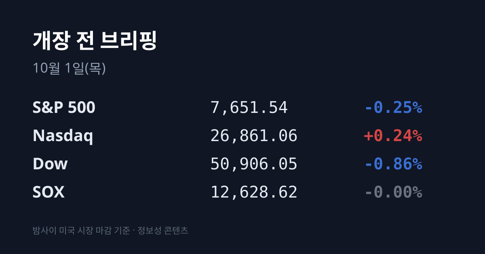
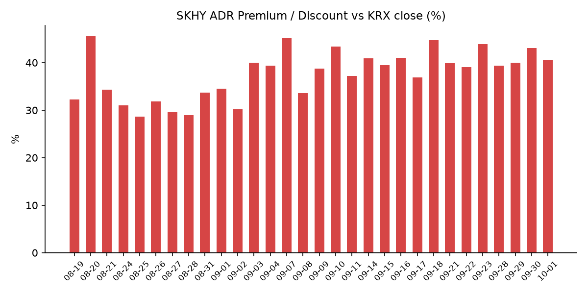
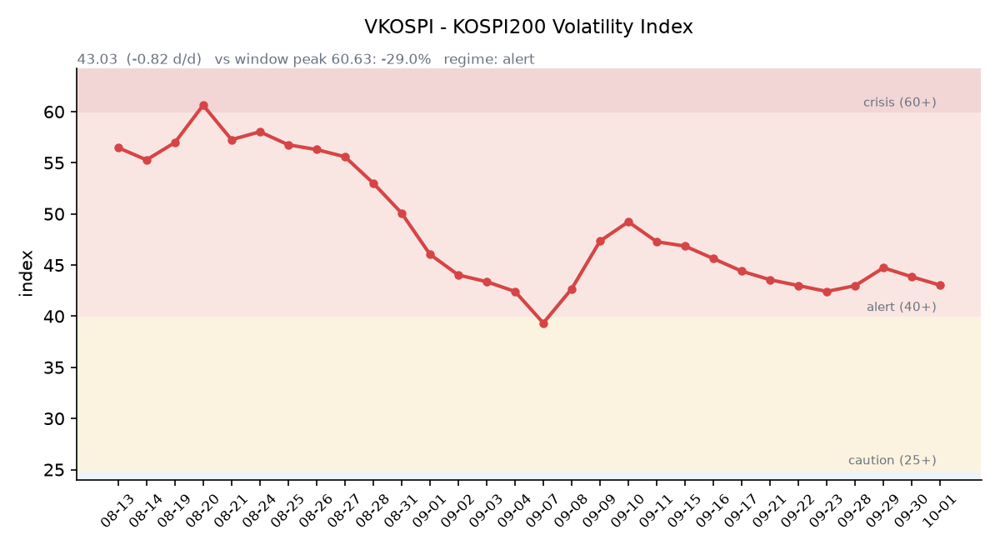

## ① 30초 요약

- 마이크론 FQ4 실적은 매출 $542.3억, 주당순이익 $33.42로 컨센서스(약 $510억, $31.6)를 넘었고 다음 분기 매출 가이던스도 $615억으로 예상(약 $570억)보다 높았습니다. <mark>시간외 주가는 +0.15%로 거의 움직이지 않았습니다.</mark>
- 8월 PCE 물가가 예상보다 낮게 나오면서(근원 3.0%, 예상 3.3%) 10월 FOMC 인상 확률은 **약 51%에서 약 35%로** 내려왔습니다. 반면 2분기 GDP가 2.2%로 상향 수정되며 미 30년물 금리는 5.64%(+5bp)로 올랐습니다.
- 한국 시장 전체를 담는 EWY는 $182.78(−2.31%), SK하이닉스 ADR(SKHY)은 $184.15(−1.36%)였습니다. 괴리율은 +40.6%로 좁혀졌습니다.
- 트럼프 대통령은 09/30(현지) 한국의 대미 투자 첫 프로젝트로 알래스카 LNG 파이프라인 $540억, 대형 원전 8기, 텍사스 6GW 발전설비를 발표했습니다.
- 직전 거래일 코스피는 +1.06%로 출발했다가 외국인 2조2,747억원 순매도 속에 6,838.04(−0.48%)로 마감했습니다. 오늘 09:00에는 한국 9월 수출입 통계가 나옵니다.

## ② 밤사이 미국 시장

| 지수 | 09/30 종가 | 등락률 |
| :--- | ---: | ---: |
| S&P 500 | 7,651.54 | −0.25% |
| 나스닥 종합 | 26,861.06 | +0.24% |
| 다우 | 50,906.05 | −0.86% |
| 필라델피아 반도체(SOX) | 12,628.62 | −0.00% |

미국 증시는 장 초반 8월 PCE 물가가 예상보다 낮게 나오자 올랐다가, 2분기 GDP 확정치가 2.2%(잠정치 1.5%)로 상향 수정되며 금리 부담이 다시 커지자 엇갈려 마감했습니다. 다우는 −0.86%로 5개월 연속 월간 상승에 실패했고, 나스닥은 3분기를 상승으로 마쳤습니다. 반도체지수(SOX)는 보합이었습니다. 인텔이 +3.71%, AMD +0.69%, 엔비디아 $228.38(+0.51%), 샌디스크 +0.59%로 올랐고 브로드컴은 −1.10%, TSMC ADR은 −0.16%였습니다. 한국 시각 07:55 기준 미국 지수선물은 S&P500 +0.25%, 나스닥100 +0.26%입니다.

마이크론은 미국 시각 09/30 장 마감 직후 FQ4'26 실적을 발표했습니다. 매출은 $542.3억, 조정 주당순이익은 $33.42, 조정 매출총이익률은 87.0%였습니다. 다음 분기(FQ1'27) 가이던스는 매출 $615억±15억, 주당순이익 $38.15±1.00으로 LSEG 컨센서스(약 $570억, $35.40)를 웃돌았고, 매출총이익률 가이던스(약 86.25%)는 예상(약 86.4%)을 조금 밑돌았습니다. 회사는 HBM3E·HBM4가 2027년분까지 판매 완료됐고 HBM4 출하가 $10억을 넘었다고 밝혔습니다. FY27 설비투자는 상반기에만 약 $250억으로 제시했습니다. 정규장 종가는 $1,065.11(0.00%)이었고, 시간외 주가는 발표 직후 1~2% 오르다 밀려 **$1,066.70(+0.15%, 한국 시각 08:03)** 수준입니다. 대규모 설비투자 계획이 호실적의 반응을 상쇄했다는 해석이 나왔습니다. 나이키 실적은 한국 시각 10/02 05:15에 나옵니다.

금리는 단기물과 장기물이 엇갈렸습니다. 미 재무부 기준 09/30 10년물은 5.29%(+3bp), 30년물은 5.64%(+5bp)로 올랐고, 2년물은 4.88%(−1bp)로 내렸습니다. 10년물과 2년물의 차이는 0.41%p로 벌어졌고, 10년물 실질금리(TIPS)는 2.93%(+2bp)입니다. 8월 PCE는 헤드라인 3.4%(예상 3.7%), 근원 3.0%(예상 3.3%)였고, 9월 ADP 민간고용은 9.0만 명으로 예상(약 7만 명)을 웃돌았습니다. 10/28 FOMC의 25bp 인상 확률은 CNBC·FXStreet 기준 약 35%로 보도됐습니다(전일 약 51%, 일부 집계는 약 47%, CME 원문은 미확인). 골드만삭스 해치우스 이코노미스트는 10월 인상 가능성이 낮다고 봤습니다. VIX는 16.34(+1.87%), 달러인덱스는 101.46(+0.09%, 한국 시각 07:05)입니다.

유가는 소폭 반등했습니다. WTI 11월물은 $90.42(+1.2%), 근월물이 된 브렌트 12월물은 $98.03(+1.9%)로 정산됐습니다. 트럼프 대통령이 이란 제재 완화 의향을 부인했고 미국 연료 재고가 빠듯하다는 점이 꼽혔습니다. 반대로 중동 원유 수출은 10일 평균 하루 1,750만배럴로 전쟁 전의 98%까지 회복됐습니다. 한국 원유 수입의 기준인 두바이유는 $106.19(−1.22%, KB증권 현물 기준)로 브렌트보다 약 $8 높은 상태가 이어지고 있습니다. 금 현물은 약 $4,184.97(+1.39%)로 올랐습니다. 같은 날 실질금리와 달러인덱스도 함께 올랐습니다.

## ③ 괴리율 트래커 — SK하이닉스 ADR

| 항목 | 수치 |
| :--- | ---: |
| SKHY 종가 | $184.15 (−1.36%) |
| 본주 환산가 (×10×환율 1,356.21원) | 2,497,461원 |
| 본주 직전 종가 | 1,776,000원 |
| **괴리율** | **+40.6%** |

괴리율은 전일 +43.09%에서 **2.47%포인트 좁혀졌습니다.** 한국 본주가 09/30 +0.62% 오르는 동안, 같은 날 밤 미국의 ADR은 −1.36% 내렸습니다. SKHY 시간외 가격은 $185.35(+0.65%)입니다.

괴리율은 미국에 상장된 예탁증서(ADR) 가격을 본주 1주 기준으로 환산한 값과 한국 본주 종가를 비교한 수치입니다. 환산가가 본주보다 높은 프리미엄 상태에서는 전환 차익거래 구조상 본주 쪽에 매수 유인이 생기고, 디스카운트면 반대입니다. 오늘 값은 이 트래커 53거래일 기록에서 14위이며, 전 구간 1위는 07/31의 +62.0%입니다.

한국 시장 전체를 담는 EWY(iShares MSCI South Korea ETF)는 <mark>$182.78(−2.31%)로 코스피 하락률(−0.48%)보다 크게</mark> 내렸습니다. 전날 EWY는 +1.92% 올랐지만 09/30 한국장은 상승 출발 뒤 하락 마감했습니다. 시간외는 $184.10(+0.72%)입니다.

## ④ 변동성 트래커

**판정 한 줄**: <mark>'경보' 유지, 방향은 소폭 진정</mark> — VKOSPI가 이틀 연속 내렸고 선물 베이시스 콘탱고가 넓어졌지만, 코스피 일중 변동폭은 2.15%로 전일보다 컸습니다.

**기대 변동성**  VKOSPI **43.03**(09/30, 전일비 −0.82, −1.87%)으로 '경보'(40~60) 구간입니다. 6월 고점 96.94 대비 −55.6%이며 평시 상단인 25의 1.72배 수준입니다. 미국 VIX는 16.34(+1.87%)였습니다. (한국거래소 통계정보 기준)

**실현 변동성**  최근 7거래일 코스피 일별 등락률은 09/18 +2.66%, 09/21 +1.65%, 09/22 +0.15%, 09/23 +0.90%, 09/28 −2.70%, 09/29 −0.27%, 09/30 −0.48%였습니다. ±3.5% 이상 등락일은 0일입니다. 09/30은 고가 6,965.64(+1.38%)에서 저가 6,818.39 사이를 오가 일중 변동폭이 종가 대비 2.15%였습니다.

**증폭 경로**  레버리지 ETF 거래 비중은 개장 전 시점에 집계할 수 있는 무료 소스가 없어 싣지 않습니다. 한국거래소 확정치 기준 선물 베이시스는 **+9.68**(선물 1,091.50 − 현물 1,081.82)로, 전일 +7.95보다 콘탱고 폭이 넓어졌습니다. 09/30 개장 직전 밤의 코스피200 야간선물은 1,106.55(직전 주간 종가 대비 +10.45)였고, 이날 코스피는 +1.06%로 출발했습니다.

**청산 압력**  신용융자 잔고는 09/23 기준 32조7,764억원으로, 8/3 대비 5조3,326억원(+19.4%) 늘었습니다(파이낸셜뉴스 보도). 오늘(10/01)부터 대형 증권사 10곳의 신용공여 한도가 자기자본의 100%에서 90%로 줄고, 10/19부터는 단일 종목 신용융자 비중 15% 기준의 집중도 관리가 시작됩니다.

**하방 포지션**  공매도 순잔고는 T+2~3 공시 지연이 있어 개장 전 시점에는 확정치를 알 수 없습니다.

*미확인: 레버리지 ETF 거래 비중, 공매도 순잔고 최신치, 9월 반대매매 일별 금액, 오늘 개장 직전 밤의 코스피200 야간선물(한국거래소가 다음 날 아침 공개), DRAM·NAND 당일 현물가.*

## ⑤ 직전 거래일(09/30) 한국장 리뷰

| 지수 | 종가 | 등락 |
| :--- | ---: | ---: |
| 코스피 | 6,838.04 | −32.77 (−0.48%) |
| 코스닥 | 855.91 | +6.11 (+0.72%) |

코스피는 6,943.47(+1.06%)로 출발해 장중 6,965.64까지 올랐지만, 오후 들어 미 장기금리 상승과 마이크론 실적·미국 PCE 발표를 앞둔 경계 속에 하락으로 돌아섰습니다. 코스피는 3거래일 연속 내렸고, 코스닥은 반도체 장비주 강세로 4거래일 연속 올랐습니다. 거래대금은 약 18조8,819억원이었습니다.

코스피 수급은 개인 1조4,544억원 순매수, <mark>외국인 2조2,747억원·기관 8,586억원 순매도</mark>였습니다. 외국인은 삼성전자를 8,654억원, SK하이닉스를 6,066억원 순매도했습니다. 코스닥에서는 기관 560억원 순매수, 외국인 664억원·개인 20억원 순매도였습니다.

삼성전자는 장 초반 오르다 밀려 268,500원(−1.47%)으로 마감했습니다. 외국인과 기관의 순매도 1위 종목이었고, 매체들은 마이크론 실적 발표 전 경계와 미 금리 부담을 이유로 꼽았습니다. SK하이닉스는 장중 약 181만원대까지 올랐다가 1,776,000원(+0.62%)으로 마쳤습니다. 미국 AI·반도체주 강세와 앤트로픽 IPO 서류에서 공개된 10년간 AI 인프라 투자 규모(최소 $5,180억)가 거론됐습니다.

코스닥 반도체 장비주는 이오테크닉스 +4.94%, 주성엔지니어링 +4.73%, HPSP +4.43%로 이틀째 올랐습니다. 트럼프 대통령의 한국 대미 투자 발표 보도가 나오면서 KBI동양철관·동일스틸럭스가 상한가를 기록하는 등 강관주가 급등했습니다. 윈팩은 SK하이닉스가 D램 패키징 외주를 4년 만에 다시 맡겼다는 보도에 상한가(3,035원)였습니다. 업종별로는 기계·장비 +1.98%, 화학 +0.83%가 올랐고 음식료 −1.05%, 전기가스 −0.70%가 내렸습니다. KB금융(−2.71%)·삼성생명(−2.93%) 등 금융주도 약했습니다. 09/30 코스닥에 상장한 덕산넵코어스는 시초가 27,100원에서 밀려 17,980원(공모가 대비 +23.15%)으로 첫날을 마쳤습니다. 같은 날 발표된 8월 산업활동동향에서는 전산업생산(−1.3%), 소매판매(−1.8%), 설비투자(−9.5%)가 모두 줄었습니다.

원/달러는 서울 외환시장 주간 종가 **1,352.8원(−3.9원)으로** 마감했습니다. 분기 말 수출업체의 달러 매도가 이어졌습니다. 한국 시각 08:04 현재 환율은 1,356.21원, 달러/엔은 157.41입니다.

아시아 증시는 대체로 올랐습니다. 닛케이225는 66,753.72(+1.94%), 토픽스는 4,108.65(+1.67%)였습니다. 상하이종합은 3,842.19(+0.31%), CSI300은 4,357.62(+0.29%), 항셍은 24,613.27(+0.37%), 대만 가권은 47,940.13(+0.65%)이었습니다. 중국 9월 제조업 PMI(국가통계국)는 50.1로 예상과 같았고, 전월(49.8)에서 확장 국면으로 돌아섰습니다.

## ⑥ 오늘의 캘린더 & 관전 포인트

- **오늘(10/01)** — 08:50 일본 단칸. <mark>09:00 한국 9월 수출입</mark>(로이터 예상 +62.0%, 1~20일 수출 +78.3%·반도체 +259.4%). 증권사 신용공여 한도 축소 시행. 브릴스 코스닥 상장(공모가 19,500원). 중국 본토(10/07까지)·홍콩 휴장, 대만은 개장. 23:00 미국 9월 ISM 제조업지수(예상 54.8).
- **10/02(금)** — 05:15 나이키 실적. 한국 9월 소비자물가(8월 3.1%). 21:30 미국 9월 고용보고서(예상 약 +9만 명, 실업률 4.1%).
- **10/05(월)** — **한국 증시 휴장**(개천절 대체공휴일). 10/03~05 사흘 연속 휴장입니다.
- **10/07 전후** — 삼성전자 3분기 잠정실적(일정 미확정).
- **10/09(금)** — 한국 증시 휴장(한글날).
- **10/22** 한국은행 금통위, **10/27~28** FOMC, **10/28** 일본은행 회의.

오늘 개장 전에는 현대모비스가 램프사업부(전년 매출 1조220억원)를 물적분할해 OPmobility에 매각한다고 공시했습니다. 현대로템의 싱가포르 LRT 3,103억원 수주, 현대건설의 마천5구역 재개발 우선협상대상자 선정(약 1조1,148억원), 한화투자증권의 5,000억원 유상증자, 한화생명의 아큐온캐피탈 지분 50.54%(4,400억원) 인수, 코리아큐빅의 안산공장(매출의 67%) 2027년 생산 중단 공시도 나왔습니다.

시장이 주시하는 레벨: SK하이닉스 **175만원 선**, 원/달러 1,362원 선, 미 10년물 5.33% 선과 30년물 5.70% 선, VKOSPI 46 선, 한국 9월 수출 증가율 +60% 선입니다.

## ⑦ 정책 워치

트럼프 대통령은 09/30(현지) 한국의 대미 투자 첫 프로젝트로 알래스카 LNG 파이프라인 $540억, 대형 원전 8기, 텍사스 6GW 발전설비를 발표했습니다. 2025년 한미 무역합의의 $3,500억 투자 패키지 중 전략투자 $2,000억에 해당하는 몫입니다. 한국 정부는 알래스카 LNG의 사업성을 검토 중이라고 밝혀 왔습니다.

이란은 카타르를 통해 7일 호르무즈 휴전안에 대한 미국의 답신을 받았다고 09/30 확인했고, 미국은 핵 문제를 함께 다루자는 입장입니다. 합참은 09/21 폭발 현장에서 북한 지뢰가 추가로 발견됐다며 북한에 사과를 요구했습니다. 미·중 관세 휴전(01/10까지)에는 새 변동이 없었습니다.

오늘부터 종합금융투자사업자 10곳의 신용공여 한도가 자기자본의 90%로 줄어듭니다. 공매도는 전면 재개 상태이며 9~10월 제도 변경 사항은 없었습니다.

## ⑧ 오늘의 질문

마이크론이 컨센서스를 넘었는데도 시간외 주가는 움직이지 않았다. 3거래일 동안 약 8.4조원을 판 외국인은 오늘 발표되는 9월 수출 숫자를 보고 반도체 매도를 멈추는가.

---
*본 글은 공개된 시장 데이터를 정리한 정보성 콘텐츠이며, 특정 종목·상품의 매매 권유가 아닙니다. 모든 투자 판단과 책임은 투자자 본인에게 있습니다. 수치는 작성 시점 기준이며 이후 변동될 수 있습니다.*
