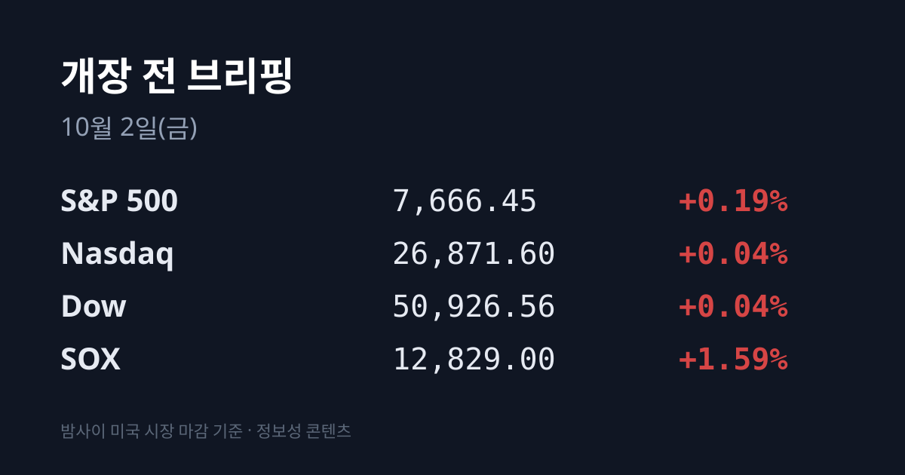
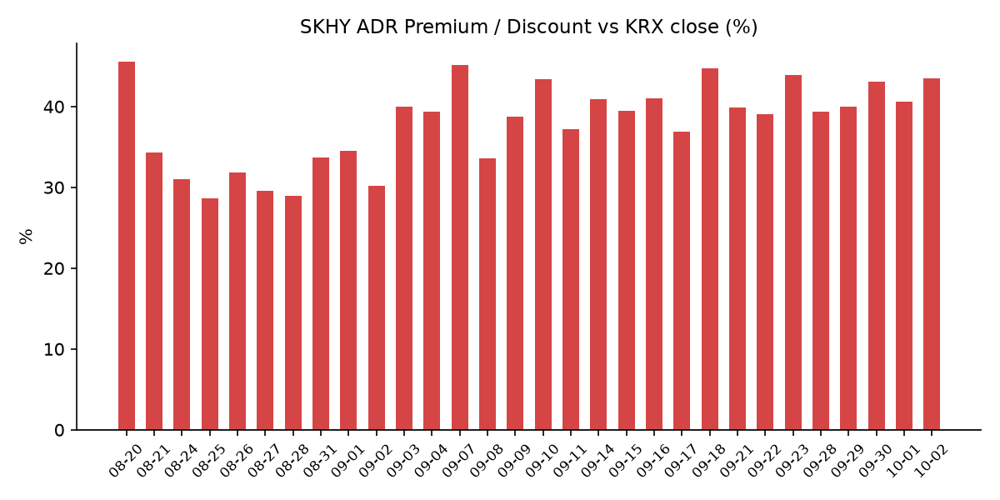
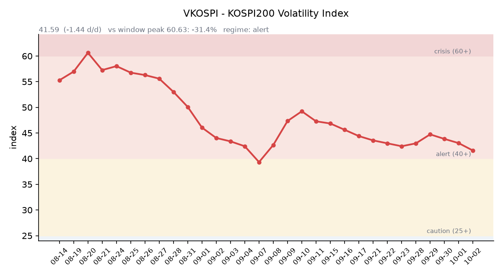

## ① 30초 요약

- 미국 반도체지수(SOX)는 12,829.00(**+1.59%**)으로 올랐고, 마이크론은 실적 발표 다음 날 +3.03% 상승했습니다. S&P500은 +0.19%로 강보합 마감했습니다.
- SK하이닉스 ADR(SKHY)은 $193.50(+5.08%)으로 본주 상승률(+3.21%)보다 더 올라 <mark>괴리율이 +43.5%로 넓어졌습니다.</mark>
- 미 2년물 금리가 4.78%(−10bp)로 크게 내렸습니다. 10년물은 장중 5.3%대까지 올랐다가 5.24%(−5bp)로 마감했습니다.
- 브렌트유 12월물은 미국의 중동 항모 증파와 중국의 석유제품 수출 중단 소식에 $102.31(+4.37%)로 올랐습니다.
- 직전 거래일 코스피는 9월 수출이 사상 첫 1,200억달러를 넘었다는 발표 뒤 6,971.35(+1.95%)로, 코스닥은 894.29(+4.48%)로 마감했습니다. 오늘 거래가 끝나면 10/03~05 사흘 휴장입니다.

## ② 밤사이 미국 시장

| 지수 | 10/01 종가 | 등락률 |
| :--- | ---: | ---: |
| S&P 500 | 7,666.45 | +0.19% |
| 나스닥 종합 | 26,871.60 | +0.04% |
| 다우 | 50,926.56 | +0.04% |
| 필라델피아 반도체(SOX) | 12,829.00 | +1.59% |

미국 증시는 장 초반 10년물 금리가 장중 5.3%대(보도에 따라 5.31~5.34%)까지 치솟자 밀렸다가(11:31 ET 기준 S&P500 −0.26%), 금리가 꺾이면서 강보합으로 마감했습니다. 반도체가 지수를 이끌었습니다. 마이크론 $1,097.39(+3.03%), 샌디스크 +2.75%, 엔비디아 $230.86(+1.09%), TSMC ADR +0.66%, AMD +0.65%가 올랐고 인텔은 −0.19%였습니다. 브로드컴은 앤트로픽에 칩 리스용으로 최대 $420억을 빌려주는 계약이 공개된 날 −2.15% 내렸습니다. 한국 시각 07:08 기준 미국 지수선물은 S&P500 +0.08%, 나스닥100 +0.14%입니다.

나이키는 미국 시각 10/01 장 마감 뒤 FQ1'27 실적을 발표했습니다. 매출은 $112.1억으로 예상(약 $113.3억)에 못 미쳤고 전년보다 4% 줄었습니다. 주당순이익은 $0.48로 예상($0.44)을 넘었습니다. 회사는 FY27 매출이 한 자릿수 후반 감소하고 조정 주당순이익이 $1.15~1.35(시장 예상 약 $1.65)일 것이라고 제시했고, 구조조정과 감원 계획도 밝혔습니다. <mark>시간외 주가는 $32.40(−7.84%)</mark>입니다. 장 마감 뒤에는 온세미컨덕터가 시냅틱스를 주당 $123 현금(약 $57억)에 인수하는 수정 합의도 나왔습니다.

미 국채 금리는 일제히 내렸습니다. 미 재무부 기준 10/01 2년물은 4.78%(−10bp), 10년물은 5.24%(−5bp), 30년물은 5.61%(−3bp)입니다. 10년물과 2년물의 차이는 0.46%p로 벌어졌고, 10년물 실질금리(TIPS)는 2.88%(−5bp)입니다. 9월 ISM 제조업지수는 54.5로 예상(54.8)을 밑돌았지만 가격지수는 77.9로 6.8포인트 올랐습니다. 신규 실업수당 청구는 19.7만 건으로 7월 이후 가장 적었습니다. 10/27~28 FOMC의 25bp 인상 확률은 약 36~38%로 보도됐습니다(CME 원문 미확인). 제퍼슨 연준 부의장은 "인플레이션이 너무 높은 상태"라고 말했습니다. VIX는 16.39(+0.31%), 달러인덱스는 102.04(+0.58%, 한국 시각 07:04)입니다.

유가는 크게 올랐습니다. WTI 11월물은 $92.87(+2.71%), 브렌트 12월물은 **$102.31(+4.37%)로** 정산됐습니다. 미국이 세 번째 항모전단과 병력 약 9,000명을 중동에 보낸다는 WSJ 보도와, 중국 정유사들이 석유제품(경유·휘발유·항공유) 수출을 중단했다는 소식이 겹쳤습니다. 한국 원유 수입의 기준인 두바이유는 09/30 기준 $106.19(한국석유공사)이며 10/01치는 집계 시점 기준 미확인입니다. 금 현물은 $4,176.50(약 +0.5%)으로 올랐습니다. 같은 날 실질금리는 내렸고 달러인덱스는 올랐습니다.

## ③ 괴리율 트래커 — SK하이닉스 ADR

| 항목 | 수치 |
| :--- | ---: |
| SKHY 종가 | $193.50 (+5.08%) |
| 본주 환산가 (×10×환율 1,359.55원) | 2,630,729원 |
| 본주 직전 종가 | 1,833,000원 |
| **괴리율** | **+43.5%** |

괴리율은 전일 +40.62%에서 **2.90%포인트 넓어졌습니다.** 한국 본주가 10/01 +3.21% 오르는 동안, 같은 날 밤 미국의 ADR은 +5.08% 올랐습니다. SKHY 시간외 가격은 $191.93(−0.81%)입니다.

괴리율은 미국에 상장된 예탁증서(ADR) 가격을 본주 1주 기준으로 환산한 값과 한국 본주 종가를 비교한 수치입니다. 환산가가 본주보다 높은 프리미엄 상태에서는 전환 차익거래 구조상 본주 쪽에 매수 유인이 생기고, 디스카운트면 반대입니다. 오늘 값은 이 트래커 54거래일 기록에서 9위이며, 전 구간 1위는 07/31의 +62.0%입니다.

한국 시장 전체를 담는 EWY(iShares MSCI South Korea ETF)는 $186.11(+1.82%)로, 직전 거래일 코스피 상승률(+1.95%)과 비슷하게 올랐습니다. 시간외는 $185.61(−0.27%)입니다.

## ④ 변동성 트래커

**판정 한 줄**: <mark>'경보' 유지, 방향은 진정 — VKOSPI 3거래일 연속 하락으로 경보 하단(40)에 근접</mark>했고, 선물 베이시스 콘탱고는 크게 좁혀졌습니다.

**기대 변동성**  VKOSPI **41.59**(10/01, 전일비 −1.44, −3.35%)로 '경보'(40~60) 구간입니다. 3거래일 연속 내렸고, 6월 고점 96.94 대비 −57.1%이며 평시 상단인 25의 1.66배 수준입니다.

**실현 변동성**  최근 7거래일 코스피 일별 등락률은 09/21 +1.65%, 09/22 +0.15%, 09/23 +0.90%, 09/28 −2.70%, 09/29 −0.27%, 09/30 −0.48%, 10/01 +1.95%였습니다. ±3.5% 이상 등락일은 0일입니다. 10/01은 장중 저가 6,765.06에서 반등해 종가가 저가보다 3.0% 높았습니다.

**증폭 경로**  전체 ETF 거래대금 중 레버리지 ETF 비중은 **19.51%였습니다.** KODEX 레버리지 1조5,068억원(회전율 25.39%), KODEX 코스닥150레버리지 5,975억원(15.41%), KODEX 200선물인버스2X 4,533억원(61.22%), KODEX 반도체레버리지 4,363억원(32.50%) 순입니다(네이버 ETF 목록, 07:17 스냅샷). 선물 베이시스는 +3.27(선물 1,107.75 − 현물 1,104.48)로 전일 +9.68에서 좁혀졌습니다.

**청산 압력**  신용융자 잔고는 09/23 기준 32조7,764억원으로, 09/04 고점(33조5,958억원)보다 낮습니다(파이낸셜뉴스 보도). 10/01부터 대형 증권사 10곳의 신용공여 한도가 자기자본의 90%로 줄었고, 10/19부터는 단일 종목 쏠림 15% 기준이 적용됩니다.

**하방 포지션**  공매도 순잔고는 T+2~3 공시 지연이 있어 개장 전 시점에는 확정치를 알 수 없습니다.

*미확인: 공매도 순잔고 최신치, 9월 반대매매 일별 금액, 오늘 개장 직전 밤의 코스피200 야간선물(한국거래소가 다음 날 아침 공개), DRAM·NAND 당일 현물가.*

## ⑤ 직전 거래일(10/01) 한국장 리뷰

| 지수 | 종가 | 등락 |
| :--- | ---: | ---: |
| 코스피 | 6,971.35 | +133.31 (+1.95%) |
| 코스닥 | 894.29 | +38.38 (+4.48%) |

코스피는 6,814.49로 약세 출발해 장중 6,765.06까지 밀렸지만, 09:00 발표된 9월 수출이 사상 처음 1,200억달러를 넘자 반등해 4거래일 만에 올랐습니다. 9월 수출은 1,209.4억달러(+83.5%), 반도체 수출은 <mark>603억달러(+262.8%)로 단일 품목 첫 600억달러</mark>였고, 무역수지는 498.5억달러 흑자였습니다.

코스피 수급은 기관 4,171억원 순매수, 개인 1조7,115억원·외국인 3,366억원 순매도였습니다(뉴스핌 기준). 외국인은 5거래일 연속 순매도했지만 규모는 전일(2조2,747억원)보다 크게 줄었습니다. 코스닥에서는 **기관 5,704억원·외국인 3,270억원 동반 순매수**, 개인 8,788억원 순매도였습니다.

삼성전자는 장 초반 264,500원까지 내렸다가 276,000원(+2.79%)으로, SK하이닉스는 1,749,000원까지 밀렸다가 1,833,000원(+3.21%)으로 마감했습니다. 매체들은 마이크론 실적과 9월 반도체 수출 기록을 상승 이유로 꼽았습니다. 두 종목은 이날도 외국인 순매도 상위 1·2위였습니다. 삼성전자우는 +4.76%였습니다.

코스닥에서는 반도체 장비·부품주가 급등했습니다. 리노공업 +10.90%, 원익IPS +9.13%, 이오테크닉스 +8.46%, HPSP +8.32%였습니다. 생명과학도구·서비스(+6.19%), 생물공학(+6.16%) 업종과 에코프로(+5.58%), 레인보우로보틱스(+5.02%)도 올랐습니다. 원일티엔아이는 한미 원전 8기 협력 발표에, 덕우전자는 46시리즈 원통형 배터리 부품 5년 약 4,000억원 수주에 상한가였습니다. 금융주는 약했습니다. 포스코가 장 시작 전 우리금융 지분 약 2.7%(6,765억원)를 블록딜로 전량 매각해 우리금융이 −4.73%, 신한지주 −2.17%, KB금융 −1.66%였습니다. 10/01 코스닥에 상장한 브릴스는 시초가 61,800원에서 밀려 30,450원(공모가 대비 +56.15%)으로 첫날을 마쳤습니다.

원/달러는 서울 외환시장 주간 종가 **1,358.4원(+5.6원)으로** 마감했습니다. 장중 고가는 1,363.0원이었습니다. 한국 시각 07:15 현재 환율은 1,359.55원, 달러/엔은 158.10입니다.

아시아 증시도 반도체 중심으로 올랐습니다. 닛케이225는 68,956.72(+3.30%)로 8/17 이후 최고 종가였고, 토픽스는 4,131.98(+0.57%)이었습니다. 대만 가권은 48,353.49(+0.86%)였습니다. 중국 본토는 10/07까지, 홍콩은 10/01 하루 휴장했습니다. 일본 단칸 대형 제조업 지수는 +24로 시장 예상(+25)을 조금 밑돌았지만 전기(+22)보다 올랐습니다.

## ⑥ 오늘의 캘린더 & 관전 포인트

- **오늘(10/02)** — 08:00 한국 9월 소비자물가(8월 3.1%). 홍콩 증시 재개장. 멜콘 공모 청약 마감, 진코스텍 청약(10/02·10/06). <mark>21:30 미국 9월 고용보고서</mark>(비농업 고용 예상 약 8.5만~9만 명, 실업률 4.1%).
- **10/03(토)~10/05(월)** — **한국 증시 휴장**(10/05 개천절 대체공휴일). 중국 본토는 10/07까지 휴장입니다.
- **10/07~08** — 삼성전자 3분기 잠정실적(일정 미확정, 영업이익 컨센서스 약 107조~110조원). 10/08 03:00 FOMC 의사록(9월 회의분).
- **10/09(금)** — 한국 증시 휴장(한글날), 대만도 휴장.
- **10/14** 미국 9월 CPI, **10/15** PPI, **10/22** 한국은행 금통위, **10/27~28** FOMC, **10/30** 일본은행 결정.

시장이 주시하는 레벨: SK하이닉스 **180만원 선**, 원/달러 1,365원 선, 브렌트 $105 선, 미 10년물 5.30% 선, VKOSPI 44 선입니다.

## ⑦ 정책 워치

한미 양국은 10/01 대미 투자 1호 사업 팩트시트를 냈습니다. 텍사스 가스복합발전 6.47GW($223억), 미국 원전 8기(최대 $1,200억, APR1400 최소 2기)가 담겼습니다. 알래스카 LNG는 '검토 착수' 단계로 적혔고, 산업통상부 장관은 "상업적 합리성 확인 후 추진"이라고 밝혔습니다.

미국은 세 번째 항모전단과 병력 약 9,000명을 중동에 보낸다고 보도됐습니다. 이란은 카타르를 통해 받은 미국의 답신을 검토하고 있으며, 쟁점은 이행 순서입니다. 미·중은 09/28~29 각각 약 $300억 규모의 관세 인하 품목을 발표했지만 반도체·전기차·배터리는 빠졌습니다. 북한 지뢰 사안에는 새 변동이 없었습니다.

10/01부터 종합금융투자사업자 10곳의 신용공여 한도가 자기자본의 90%로 줄었습니다. 공매도는 전면 재개 상태이며 9~10월 제도 변경 사항은 없었습니다.

## ⑧ 오늘의 질문

반도체 수출 603억달러가 숫자로 나온 다음 날, 사흘 연휴와 미국 고용보고서를 앞둔 외국인은 5거래일째 이어온 순매도를 멈추는가.

---
*본 글은 공개된 시장 데이터를 정리한 정보성 콘텐츠이며, 특정 종목·상품의 매매 권유가 아닙니다. 모든 투자 판단과 책임은 투자자 본인에게 있습니다. 수치는 작성 시점 기준이며 이후 변동될 수 있습니다.*
