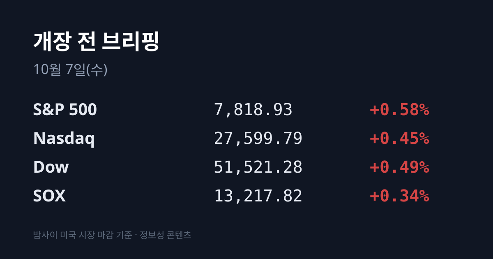
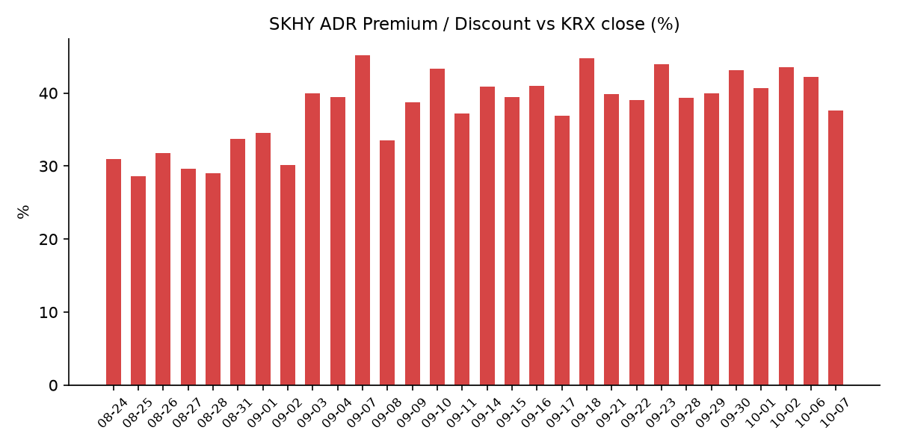
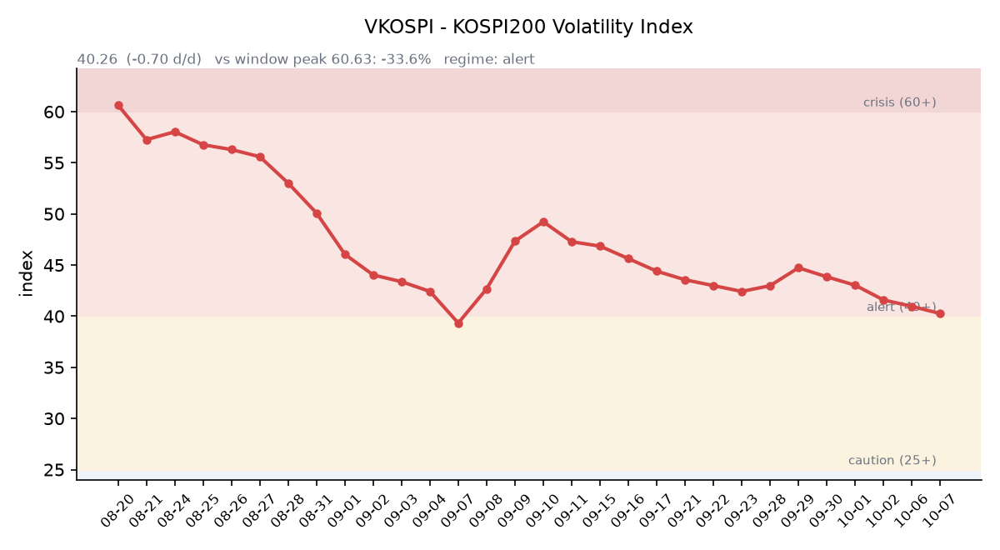

## ① 30초 요약

- 10/06 미국 증시는 S&P500 7,818.93(+0.58%), 나스닥 27,599.79(+0.45%)로 둘 다 사상 최고 종가를 기록했습니다. AMD(+2.80%)·브로드컴(+3.67%)·마벨(+5.81%)이 올랐습니다.
- 반면 메모리·스토리지는 약했습니다. <mark>SK하이닉스 ADR(SKHY)은 $182.56(−6.39%)</mark>, 마이크론 −1.73%, 시게이트 −9.18%, 웨스턴디지털 −6.93%였습니다.
- 한국 시장 전체를 담는 EWY는 **$186.40(−2.64%)였고,** 괴리율은 +37.6%로 전일 +42.18%보다 4.53%포인트 좁혀졌습니다.
- 미 국채 금리는 전 구간 내렸습니다. 10년물은 5.31%에서 5.27%로, 2년물은 4.84%에서 4.79%로 내려왔습니다.
- 10/06 코스피는 외국인 1조7,509억원 순매도에 6,941.39(−0.89%)로 내렸고, 코스닥은 2차전지·바이오 강세에 919.92(+2.98%)로 올랐습니다.

## ② 밤사이 미국 시장

| 지수 | 종가 | 등락률 |
| :--- | ---: | ---: |
| S&P 500 | 7,818.93 | +0.58% |
| 나스닥 종합 | 27,599.79 | +0.45% |
| 다우 | 51,521.28 | +0.49% |
| 필라델피아 반도체(SOX) | 13,217.82 | +0.34% |

10/06(화) S&P500과 나스닥은 이틀 연속 사상 최고 종가를 썼습니다. AI 칩주가 지수를 이끌었습니다. 엔비디아는 $239.24(+0.14%)로 사상 최고가를 다시 썼고, AMD는 $649.42(+2.80%)로 사상 최고가에 올랐습니다. 리사 수 AMD CEO는 "연산 수요가 계속 공급을 앞서고 있다"고 말했습니다. 브로드컴은 +3.67%, 마벨은 2028 회계연도 매출 가이던스를 $200억으로 올리며 +5.81%였습니다.

<mark>반도체 안에서 메모리·스토리지만 반대로 움직였습니다.</mark> SKHY −6.39%, 마이크론 $1,045.56(−1.73%), 샌디스크 −2.56%였습니다. 외신은 삼성전자(10/08 잠정실적)와 SK하이닉스(10/27 실적) 발표를 앞둔 경계, 일부 미국 데이터센터 지연 보도, 원화 강세에 따른 환산이익 감소, 두 회사의 성과급 충당금 확대 압력을 이유로 꼽았습니다. 스토리지에서는 도시바가 데이터센터용 HDD 생산능력을 두 배로 늘리겠다는 계획과 TDK 자기헤드 사업 인수 경쟁이 겹쳐 시게이트 −9.18%, 웨스턴디지털 −6.93%였습니다. 인텔은 −3.18%, TSMC ADR은 $482.30(−0.72%)이었습니다.

장 마감 뒤 실적을 낸 컨스텔레이션 브랜즈는 시간외에서 약 −4.6%였습니다. 반도체·빅테크 실적 발표는 없었습니다. 한국 시각 07:08 기준 미국 지수선물은 S&P500 +0.11%, 나스닥100 +0.11%입니다.

미 국채 금리는 전 구간 내렸습니다. 미 재무부 기준 10년물은 **5.31%에서 5.27%로** 4bp 내렸습니다. 장중에는 5.35%까지 올라 2002년 4월 이후 가장 높은 수준을 찍은 뒤 되돌렸습니다. 2년물은 4.79%(−5bp), 30년물은 5.64%(−2bp), 10년물 실질금리(TIPS)는 2.91%(−4bp)이고, 10년물과 2년물의 차이는 0.48%p입니다. 10/27~28 FOMC의 금리 인상 확률은 CNBC가 10/02 약 17%, CME FedWatch 기준 10/05 오전 약 20%로 전했습니다. VIX는 15.01(−3.29%), 달러인덱스는 101.85(−0.32%, 한국 시각 07:05)입니다.

브렌트유 12월물은 10/06 장중 $100 아래로 내려갔다가 한국 시각 07:05 기준 $101.08(+0.76%)입니다. WTI 11월물은 $89.75(+0.36%)입니다. 셸 CEO는 중동 원유 수출이 전쟁 전의 약 80% 수준까지 회복했다고 말했습니다. 한국 원유 수입의 기준인 두바이유는 한국석유공사 최신 표기 기준 $105.69로, 브렌트보다 약 $4.6 비싼 상태가 이어지고 있습니다(10/02 약 $6.5). 금 12월물은 $4,194.0(+0.89%)으로 올랐고, 같은 날 실질금리와 달러인덱스는 내렸습니다.

## ③ 괴리율 트래커 — SK하이닉스 ADR

| 항목 | 수치 |
| :--- | ---: |
| SKHY 종가 (10/06) | $182.56 (−6.39%) |
| 본주 환산가 (×10×환율 1,336.82원) | 2,440,499원 |
| 본주 직전 종가 (10/06) | 1,773,000원 |
| **괴리율** | **+37.6%** |

괴리율은 전일 +42.18%에서 **4.53%포인트 좁혀졌습니다.** SKHY가 −6.39% 내린 폭이 같은 날 본주(−3.69%)보다 컸고, 원/달러도 1,342.20원에서 1,336.82원으로 내려 환산가가 함께 낮아졌습니다. SKHY 시간외 가격은 $184.13(+0.86%)입니다.

괴리율은 미국에 상장된 예탁증서(ADR) 가격을 본주 1주 기준으로 환산한 값과 한국 본주 종가를 비교한 수치입니다. 환산가가 본주보다 높은 프리미엄 상태에서는 전환 차익거래 구조상 본주 쪽에 매수 유인이 생기고, 디스카운트면 반대입니다. 오늘 값은 이 트래커 56거래일 기록에서 28위로 중간이며, 09/17(+36.91%) 이후 가장 낮습니다. 전 구간 1위는 07/31의 +62.0%입니다.

한국 시장 전체를 담는 EWY(iShares MSCI South Korea ETF)는 <mark>$186.40(−2.64%)로 같은 날 코스피(−0.89%)보다 크게 내렸습니다.</mark> EWY 시간외는 $187.24(+0.45%)입니다.

## ④ 변동성 트래커

**판정 한 줄**: <mark>'경보' 유지, 방향은 진정 — VKOSPI 5거래일 연속 하락해 경보 하단(40)까지 0.26포인트</mark>이지만, 인버스2X ETF 거래는 크게 늘었습니다.

**기대 변동성**  VKOSPI **40.26**(10/06, 전일비 −0.70, −1.71%)으로 '경보'(40~60) 구간입니다. 코스피가 내린 날에도 5거래일 연속 내렸고, 6월 고점 96.94 대비 −58.5%이며 평시 상단인 25의 1.61배 수준입니다.

**실현 변동성**  최근 7거래일 코스피 일별 등락률은 09/23 +0.90%, 09/28 −2.70%, 09/29 −0.27%, 09/30 −0.48%, 10/01 +1.95%, 10/02 +0.46%, 10/06 −0.89%였습니다. ±3.5% 이상 등락일은 0일입니다. 10/06 장중 범위는 6,897.38~7,044.67이었고, 시가가 곧 고가였습니다.

**증폭 경로**  전체 ETF 거래대금 중 레버리지 ETF 비중은 19.88%로 직전(20.06%)보다 조금 내렸습니다. KODEX 레버리지 1조3,575억원(회전율 23.26%), KODEX 코스닥150레버리지 5,795억원(14.30%), KODEX 200선물인버스2X **4,053억원(회전율 56.69%)**, KODEX 반도체레버리지 3,232억원(23.85%), TIGER 반도체TOP10레버리지 1,611억원(21.81%) 순입니다(네이버 ETF 목록, 10/07 07:16 스냅샷). 인버스2X 거래대금은 직전 2,880억원에서 약 41% 늘었습니다. 선물 베이시스는 +7.17(선물 1,103.00 − 현물 1,095.83)로 직전 +4.15에서 벌어졌습니다.

**청산 압력**  신용융자 잔고는 마지막으로 확인된 09/23 기준 32조7,764억원입니다. 10/19부터 증권사 신용공여의 단일 종목 쏠림 15% 상한이 적용됩니다.

**하방 포지션**  공매도 순잔고는 T+2~3 공시 지연이 있어 개장 전 시점에는 확정치를 알 수 없습니다.

*미확인: 신용융자 잔고 최신치, 10월 반대매매 일별 금액, 공매도 순잔고 최신치, 오늘 개장 직전 밤의 코스피200 야간선물(한국거래소가 다음 날 아침 공개), DRAM·NAND 당일 현물가.*

## ⑤ 직전 거래일(10/06) 한국장 리뷰

| 지수 | 종가 | 등락 |
| :--- | ---: | ---: |
| 코스피 | 6,941.39 | −62.35 (−0.89%) |
| 코스닥 | 919.92 | +26.63 (+2.98%) |

코스피는 7,044.67로 올라 출발했지만 그 값이 고가였고, 장중 6,897.38까지 밀린 뒤 하루 만에 7,000선을 내줬습니다. 코스닥은 3% 가까이 올라 두 지수가 반대로 움직였습니다.

코스피에서 <mark>외국인은 1조7,509억원을 순매도해 7거래일 연속 매도했고,</mark> 사흘 동안 줄던 매도 규모가 다시 커졌습니다(10/02 −1,438억원). 기관은 20억원 순매도, 개인은 약 7,406억원 순매수였습니다(보도에 따라 7,406억~7,421억원). 코스닥에서는 외국인과 기관이 합계 약 2,000억원을 순매수했습니다(서울신문).

삼성전자는 272,000원(−1.45%), SK하이닉스는 **1,773,000원(−3.69%)으로** 마감했습니다. 매체들은 10/08 삼성전자 3분기 잠정실적 발표를 앞둔 관망, 연휴 동안 미국 메모리주가 두 세션 내린 점, 외국인 매도를 이유로 꼽았습니다. 골드만삭스는 반도체 펀드 리밸런싱이 SK하이닉스에는 자금 유입, 삼성전자에는 유출 요인이라고 분석했습니다.

코스닥과 2차전지가 강했습니다. 에코프로비엠 +11.41%, 삼성SDI +8.70%, LG에너지솔루션 +5.12%였고, 에코프로비엠과 삼성SDI의 전고체 배터리 협력 발표가 영향을 줬다는 보도가 나왔습니다(인포스탁데일리). LG그룹도 올랐습니다. LG이노텍 +12.20%, LG전자 +7.64%, LG +3.87%였고, AI 데이터센터 냉각 솔루션 수주와 누리호 부품 수주가 배경으로 꼽혔습니다. 코스닥 바이오에서는 HLB가 +17.18%였습니다. 신한은행 해킹에 쓰인 IP 일부가 토스뱅크 서버에도 접근을 시도한 사실이 공개되자 보안주가 올랐습니다. 업종별로는 의료정밀 +6.53%, 운송장비 −1.43%, 전기전자 −1.31%였고 삼성바이오로직스는 −3.25%였습니다.

원/달러는 서울 외환시장 주간 종가 1,343.6원으로 10/02(1,350.6원)보다 7.0원 내렸고, 약 3주 만의 최저였습니다. 수출업체 달러 매도가 이어졌습니다. 한국 시각 07:16 현재 환율은 1,336.82원, 달러/엔은 158.17입니다.

아시아 증시는 10/06 대부분 올랐습니다. 닛케이225 70,683.98(+1.05%), 토픽스 4,183.56(+0.92%), 대만 가권 49,822.55(+0.22%, 사상 최고), 항셍 24,280.56(+1.00%)이었습니다. 중국 본토 증시는 10/08 다시 열립니다.

## ⑥ 오늘의 캘린더 & 관전 포인트

- **오늘(10/07)** — 엘리스그룹 공모 청약(~10/08). 엠에스바이오 공모가 확정. 다비오·티앤이코리아 수요예측 시작. 13:30 인도 중앙은행 금리 결정. 23:30 미국 원유 재고.
- **10/08(목)** — 02:00 미국 10년물 국채 입찰. 03:00 FOMC 의사록(9월 회의분). <mark>삼성전자 3분기 잠정실적</mark>(FnGuide 영업이익 컨센서스 108.1조원, 매출 201.7조원). 14:30 TSMC 9월 매출. 중국 본토·후강퉁 재개장. 21:30 미국 신규 실업수당 청구.
- **10/09(금)** — 한국 증시 휴장(한글날). 02:00 미국 30년물 입찰. 10:30 중국 9월 CPI. 23:00 미시간대 10월 소비자심리 예비치.
- **10/14** 미국 9월 CPI, **10/15** PPI, **10/22** 한국은행 금통위, **10/27** SK하이닉스 3분기 실적, **10/27~28** FOMC.

이번 주 한국 증시는 오늘과 내일 이틀이 남았습니다. 시장이 주시하는 레벨: SK하이닉스 1,773,000원(10/06 종가) 선, 원/달러 1,350원 선, VKOSPI 40·43 선, 미 10년물 5.35% 선입니다.

## ⑦ 정책 워치

예멘에서는 교전이 격화돼 24시간 동안 전투원 270명 이상이 숨졌고, 사우디가 지원하는 정부군의 진격 주장을 후티가 부인했습니다. 10/05에는 호르무즈 해협을 빠져나가던 유조선 1척이 미상의 발사체에 맞았습니다. 미국과 이란의 협상은 교착 상태가 이어지고 있습니다. 러시아-우크라이나, 미·중, 북한 관련으로는 전일 대비 새 동향이 없었습니다.

국내에서는 신한은행 해킹 사고 관련 조사 내용이 공개됐습니다. 증권사 신용공여는 10/19부터 단일 종목 15% 상한이 적용됩니다. 공매도는 전면 재개 상태이며 10월 제도 변경 사항은 없었습니다.

## ⑧ 오늘의 질문

미국 지수가 사상 최고를 쓴 밤 하이닉스 ADR이 6% 넘게 내린 가운데, 잠정실적 발표를 하루 앞둔 메모리 대형주를 외국인은 어떻게 다루는가.

---
*본 글은 공개된 시장 데이터를 정리한 정보성 콘텐츠이며, 특정 종목·상품의 매매 권유가 아닙니다. 모든 투자 판단과 책임은 투자자 본인에게 있습니다. 수치는 작성 시점 기준이며 이후 변동될 수 있습니다.*
