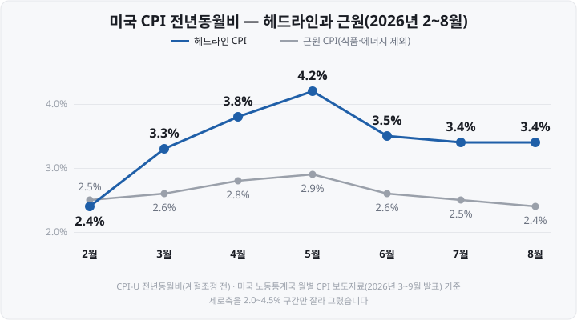

저는 처음 미국 물가 기사를 읽을 때 같은 날 같은 지표를 두고 "CPI 3.4%"와 "CPI 0.4%"가 함께 보도되는 이유를 알지 못했습니다. 보도자료 원문을 확인해 보니 <mark>하나는 1년 전 대비, 다른 하나는 한 달 전 대비 상승률</mark>이었습니다. 또 2026년 9월 발표 때 채권시장이 크게 반응한 수치는 두 가지 모두 아닌 근원 CPI의 전월비였습니다.

미국 9월 **CPI**(Consumer Price Index, 소비자물가지수)는 **10월 14일(수) 한국시간 오후 9시 30분**에 발표됩니다. 다음 날 같은 시각에는 **PPI**(Producer Price Index, 생산자물가지수)가 나옵니다. 두 지표가 발표되는 날에는 미국 국채 금리와 주가지수 선물이 발표 직후 크게 움직이는 경우가 많습니다.

물가지표가 증시에 영향을 주는 것은 물가 수치가 **금리 전망**을 바꾸기 때문입니다. 물가가 예상보다 높게 나오면 중앙은행이 금리를 인상하거나 인하 시점을 미룰 가능성이 커지고, 이러한 전망 변화가 주가에 반영됩니다.

이 글은 ① CPI와 PPI가 각각 무엇을 측정하는지, ② 헤드라인과 근원(코어) 지표의 차이, ③ 전월비와 전년동월비를 읽는 법, ④ 발표 시각과 시장 반응 경로를 미국 노동통계국 자료로 정리합니다. 한국의 소비자물가·생산자물가도 함께 다룹니다. 기준 시점은 **2026년 10월 9일**이며, 물가 전망은 다루지 않습니다.

&nbsp;

【CPI는 소비자 구입가격, PPI는 생산자 판매가격을 측정합니다】

두 지표는 모두 미국 노동부 산하 **BLS**(Bureau of Labor Statistics, 노동통계국)가 작성합니다. 차이는 가격을 어느 단계에서 측정하느냐에 있습니다.

- **CPI**는 소비자가 상품·서비스를 살 때 **지불하는 가격**의 평균 변화를 측정합니다. 대표 지수인 **CPI-U**(도시 소비자 기준)는 미국 인구의 90% 이상을 포괄합니다. 75개 도시 지역의 소매점 약 2만 2,000곳과 주택 약 6,000가구에서 가격을 조사합니다.
- **PPI**는 국내 생산자가 상품·서비스를 팔 때 **받는 가격**의 평균 변화를 측정합니다. 사업체 1만 6,000여 곳에서 매월 약 6만 4,000건의 가격을 조사합니다.

| 구분 | CPI | PPI |
| :-- | :-- | :-- |
| 측정 대상 | 소비자가 지불하는 가격 | 국내 생산자가 받는 가격 |
| 대표 지수 | CPI-U(도시 소비자) | 최종수요(Final Demand) |
| 판매세·소비세 | 포함 | 제외 |
| 9월 지표 발표일 | 10월 14일(수) | 10월 15일(목) |

같은 상품이라도 생산자가 받는 가격과 소비자가 지불하는 가격은 다릅니다. BLS는 그 차이를 보조금, 판매세·소비세, 유통 비용으로 설명합니다. 예를 들어 소비자 가격에는 판매세와 도소매 유통 마진이 포함되지만, 공장 출하 단계의 생산자 가격에는 포함되지 않습니다. 다만 PPI는 도소매업체가 얻는 유통 마진을 **유통 서비스**(trade services)라는 별도 항목으로 측정해 최종수요 지수에 포함합니다.

PPI 대표 지수인 **최종수요 지수**의 구성도 알아 둘 필요가 있습니다. 2025년 12월 기준 가중치는 <mark>서비스 68.3%, 상품 29.0%, 건설 2.6%입니다.</mark> 이름은 '생산자물가'이지만 서비스 비중이 3분의 2를 넘습니다.

생산 단계의 비용 상승은 시차를 두고 소비자 가격에 전가될 수 있기 때문에 시장은 PPI를 CPI와 함께 확인합니다. 다만 두 지표는 품목 구성과 가중치가 달라, <mark>PPI 상승률이 그대로 CPI 상승률로 이어지지는 않습니다.</mark>

&nbsp;

【헤드라인 지표와 근원 지표 — 식품·에너지를 제외하는 이유】

뉴스에서 "CPI가 3.4% 올랐다"고 할 때의 수치는 전체 품목을 대상으로 한 **헤드라인 CPI**입니다. 여기서 식품과 에너지를 제외한 것이 **근원 CPI**(core CPI)입니다.

식품과 에너지를 제외하는 이유는 두 품목의 가격이 날씨·작황·국제유가 같은 일시적 요인으로 크게 변동하기 때문입니다. 근원 지표는 이런 일시적 변동을 제외하고 **기조적인 물가 흐름**을 파악하기 위한 지표입니다.

2025년 12월 기준 CPI 가중치는 다음과 같습니다.

| 항목 | 가중치 |
| :-- | --: |
| 식품 | 13.7% |
| 에너지 | 6.4% |
| **근원(식품·에너지 제외)** | **79.9%** |
| 근원 상품 | 19.2% |
| 근원 서비스 | 60.7% |
| 주거비(근원 서비스에 포함) | 35.6% |

<mark>단일 항목으로 가장 큰 것은 주거비로, 전체의 3분의 1이 넘습니다.</mark> 주거비의 대부분은 자기 집에 거주하는 사람이 그 집을 임차했다면 냈을 임대료를 추정한 **자가주거비**(Owners' equivalent rent, 가중치 26.2%)입니다. 주거비는 근원 CPI 안에서 약 45%(35.6÷79.9)를 차지하므로, 근원 CPI의 흐름은 주거비 변동에 크게 좌우됩니다.

2026년 헤드라인 CPI와 근원 CPI의 추이를 비교하면 두 지표를 구분해 확인해야 하는 이유를 알 수 있습니다.

헤드라인은 2월 2.4%에서 5월 4.2%까지 올랐다가 8월 3.4%로 내려왔습니다. 같은 기간 <mark>근원은 2.4~2.9% 사이에서 움직였습니다.</mark> 두 지표의 격차는 대부분 에너지 가격 상승에서 비롯됐습니다. 8월 에너지 지수는 전년동월비 **16.3%** 올랐습니다.

헤드라인과 근원의 흐름이 엇갈릴 때 시장이 어느 지표에 더 크게 반응하는지는 시기마다 다릅니다. 따라서 발표 기사를 읽을 때는 두 수치를 함께 확인해야 합니다.

PPI에도 근원 지표가 있습니다. BLS는 식품·에너지를 제외한 지수와, 여기에 유통 서비스까지 제외한 지수를 함께 발표합니다. 2026년 8월 전년동월비는 식품·에너지 제외 지수가 **4.6%**, 유통 서비스까지 제외한 지수가 **4.7%** 상승했습니다.

> **참고 — 연준의 물가 목표 기준은 CPI가 아니라 PCE입니다.** 미국 연방준비제도(연준)는 물가 목표 2%를 **PCE**(Personal Consumption Expenditures, 개인소비지출) 물가지수의 연간 상승률로 정의합니다. PCE는 상무부 경제분석국이 작성하며, CPI보다 늦게 발표됩니다. 그런데도 시장이 CPI에 크게 반응하는 것은 CPI가 PCE보다 먼저 발표되고, PCE 물가지수를 작성할 때 CPI와 PPI의 세부 가격 자료가 활용되기 때문입니다. 한국은행은 소비자물가 상승률(전년동기대비) **2%를** 물가안정목표로 정하고 있습니다.

&nbsp;

【전월비와 전년동월비의 차이】

물가 발표에는 상승률이 두 가지 나옵니다. **전월비**는 지난달 대비, **전년동월비**는 1년 전 같은 달 대비 상승률입니다. 미국 BLS 보도자료는 첫 문장에서 계절조정한 전월비를 먼저 쓰고, 이어서 계절조정 전 전년동월비를 씁니다.

**계절조정**은 매년 같은 시기에 비슷한 크기로 반복되는 가격 변동(연말 할인, 계절별 의류 가격 등)을 제거하는 작업입니다. 한 달 단위로 비교하는 전월비는 이런 계절 요인의 영향을 크게 받으므로 계절조정한 값을 씁니다. 1년 전 같은 달과 비교하는 전년동월비는 계절 요인이 대부분 상쇄됩니다.

2026년 3~8월의 두 상승률은 다음과 같습니다.

| 2026년 | 헤드라인 전월비(계절조정) | 헤드라인 전년동월비 | 근원 전월비(계절조정) |
| :-- | --: | --: | --: |
| 3월 | +0.9% | 3.3% | +0.2% |
| 4월 | +0.6% | 3.8% | +0.4% |
| 5월 | +0.5% | 4.2% | +0.2% |
| 6월 | **−0.4%** | **3.5%** | 0.0% |
| 7월 | +0.1% | 3.4% | +0.2% |
| 8월 | +0.4% | 3.4% | +0.3% |

6월 헤드라인 전월비는 **−0.4%로** 물가가 한 달 전보다 하락했습니다. 그러나 전년동월비는 3.5%로, <mark>물가 수준은 여전히 1년 전보다 3.5% 높았습니다.</mark> 전월비는 최근 한 달의 변화를, 전년동월비는 1년 동안 누적된 변화를 보여 줍니다.

시장 참가자들은 여러 수치 가운데 **근원 전월비**에 특히 주목합니다. 일시적 요인을 제외한 최근 한 달의 물가 흐름을 가장 빨리 보여 주는 수치이기 때문입니다. 근원 전월비의 0.1%포인트 차이가 크게 보도되는 이유도 여기에 있습니다. 전월비 0.2% 상승이 12개월 이어지면 연간 상승률은 약 2.4%이지만, 0.3%가 이어지면 약 3.7%가 됩니다. 한 달 수치의 0.1%포인트 차이가 1년으로 환산하면 약 1.2%포인트 차이가 됩니다.

**발표 이후 수치가 수정되는지도 지표마다 다릅니다.** CPI는 계절조정 전 지수를 발표 시점에 확정치로 간주합니다. 계절조정 지수는 매년 2월 1월 지표를 발표하면서 계절요인을 다시 계산해 과거 5년 치를 수정합니다. PPI는 발표 후 넉 달 동안 수정될 수 있으며, 8월 PPI 발표 때도 4~7월 지수가 수정됐습니다.

&nbsp;

【발표 시각 — 한국시간 오후 9시 30분, 11월부터 오후 10시 30분】

CPI와 PPI는 모두 미국 동부시간 **오전 8시 30분**에 발표됩니다. 미국 정규장 개장(오전 9시 30분)보다 1시간 이릅니다. 따라서 발표 직후에는 국채 금리, 달러 환율, 주가지수 선물이 먼저 움직이고, 주식은 1시간 뒤 정규장 개장과 함께 반응합니다.

한국시간으로는 서머타임 여부에 따라 달라집니다. 2026년 미국 서머타임은 **11월 1일(일)에** 끝납니다.

| 지표 | 발표일 | 한국시간 |
| :-- | :-- | :-- |
| 미국 9월 CPI | 10월 14일(수) | **오후 9시 30분** |
| 미국 9월 PPI | 10월 15일(목) | **오후 9시 30분** |
| 미국 10월 CPI | 11월 10일(화) | **오후 10시 30분**(서머타임 종료 후) |

9월에는 PPI(9월 10일)가 CPI(9월 11일)보다 먼저 나왔지만, <mark>10월에는 CPI가 하루 먼저 나옵니다.</mark> 두 지표의 발표 순서는 달마다 바뀌므로 BLS 발표 일정표에서 확인해야 합니다.

한국 주식시장은 한국거래소와 넥스트레이드의 애프터마켓을 포함해 오후 8시에 모든 거래가 종료됩니다([NXT와 KRX 애프터마켓 편](https://blog.naver.com/hdglace/224412184369)). 따라서 미국 물가지표에 대한 국내 주식의 반응은 다음 날 아침 개장 때 나타납니다. 다만 코스피200 선물은 한국거래소 야간시장에서 거래되므로 발표 직후부터 가격에 반영됩니다. 미국 거래시간과 시차는 [미국 증시 시간 편](https://blog.naver.com/hdglace/224365483110)에 정리돼 있습니다.

&nbsp;

【물가지표가 금리와 주가에 영향을 주는 경로】

물가지표가 주가에 영향을 주는 경로는 다음과 같습니다.

1. **발표치와 예상치를 비교합니다.** 시장은 발표 전에 이코노미스트들의 예상치(컨센서스)를 가격에 반영해 둡니다. 따라서 물가 상승률이 높더라도 예상과 같으면 반응이 작고, 예상과 다르면 반응이 큽니다.
2. **금리 전망이 바뀝니다.** 예상보다 높은 물가는 연준이 금리를 올리거나 인하를 미룰 가능성을 키웁니다. 연방기금금리 선물 가격으로 계산한 **CME FedWatch** 확률이 발표 직후 바뀌는 이유입니다.
3. **채권 금리와 주가가 반응합니다.** 금리 인상 전망이 커지면 국채 금리가 오르고, 미래 이익을 현재 가치로 환산하는 할인율이 높아져 주가에 하락 압력으로 작용합니다. 이 경로는 [금리와 주가 편](https://blog.naver.com/hdglace/224369929249)에서 다뤘습니다.

다만 같은 발표를 두고 주식시장과 채권시장이 다르게 반응하는 경우도 있습니다. 2026년 9월 발표가 그런 사례였습니다.

| 날짜(미국 시간) | 발표 | 결과 | 시장 반응 |
| :-- | :-- | :-- | :-- |
| 9월 10일(목) | 8월 PPI | 전년동월비 5.4%(예상 5.3%), 전월비 +0.4% | 10년물 국채 금리 4.943%, 9월 FOMC 0.25%포인트 인상 확률 61.2%→72.4% |
| 9월 11일(금) | 8월 CPI | 헤드라인 전월비 +0.4%·전년동월비 3.4%(예상 부합), 근원 전월비 +0.3%(예상 +0.2%) | S&P500 +0.86%, 10년물 4.97%(+0.029%포인트), 2년물 4.628%(+0.078%포인트), 인상 확률 72.4%→86.3% |
| 9월 16일(수) | FOMC 결정 | 연방기금금리 목표범위 3.75~4.00%로 0.25%포인트 인상(12 대 0) | — |

8월 CPI는 헤드라인이 예상에 부합했고 주가지수는 올랐습니다. 반면 <mark>근원 전월비가 예상보다 0.1%포인트 높게 나오자 2년물 국채 금리는 하루에 0.078%포인트 올랐습니다.</mark> 2년물 국채 금리는 정책금리 전망에 민감하게 움직입니다. 당시 보도는 주식시장이 헤드라인의 예상 부합과 같은 날 국제유가 하락에, 채권시장이 근원 지표에 더 반응한 것으로 해석했습니다.

닷새 뒤 FOMC는 2023년 이후 처음으로 금리를 올렸습니다. 물가지표 하나가 결정을 좌우한 것은 아니지만, <mark>두 지표 발표를 거치며 시장의 인상 예상 확률은 61%에서 86%대로 올라 있었습니다.</mark> FOMC 결정 구조는 [FOMC 편](https://blog.naver.com/hdglace/224375094005)에 정리돼 있습니다. 다음 FOMC는 **10월 27~28일**이며, 9월 CPI·PPI는 그 전에 발표되는 마지막 물가지표입니다.

&nbsp;

【한국의 물가지표 — 소비자물가동향과 생산자물가지수】

한국에도 같은 구조의 지표가 있습니다. 작성 기관과 발표 시각은 다음과 같습니다.

| 구분 | 소비자물가동향 | 생산자물가지수 |
| :-- | :-- | :-- |
| 작성 기관 | 국가데이터처(옛 통계청) | 한국은행 |
| 발표 시점 | 다음 달 초(2~6일경) 오전 8시 | 다음 달 20일 전후 오전 6시 |
| 주 지표 | 전년동월비 | 전월비·전년동월비 |
| 최근 발표 | 9월: 전년동월비 **2.9%**(10월 2일) | 8월: 전년동월비 **7.9%**(9월 18일) |
| 다음 발표 | 10월 지표: 11월 3일(화) | 9월 지표: 10월 21일(수) |

통계청은 **2025년 10월 1일** 국무총리 소속 **국가데이터처**로 개편됐습니다. 한국 소비자물가 보도자료는 첫 문장에 전월비와 전년동월비를 함께 쓰지만, 미국과 달리 <mark>전년동월비를 주 지표로, 전월비를 참고 지표로 씁니다.</mark>

한국의 근원물가 지표는 두 가지입니다.

- **농산물및석유류제외지수** — 곡물을 제외한 농산물과 석유류·도시가스 관련 품목을 제외한 '우리나라 방식'의 근원물가입니다. 458개 품목 중 401개로 작성하며, 9월 전년동월비 상승률은 **2.7%였습니다**.
- **식료품및에너지제외지수** — 미국 근원 CPI와 같은 'OECD(경제협력개발기구) 방식'입니다. 458개 품목 중 309개로 작성하며, 9월 전년동월비 상승률은 **2.8%였습니다**.

언론 기사에서 "근원물가"라고만 쓴 경우 둘 중 어느 지수인지 확인해야 합니다. 이 밖에 자주 구입하는 144개 품목으로 작성하는 **생활물가지수**가 있으며, 9월 전년동월비 상승률은 **2.5%였습니다**.

한국 소비자물가지수는 현재 **2020년=100** 기준입니다. 국가데이터처는 기준연도를 **2025년=100**으로 바꾸는 개편을 진행 중이며, <mark>12월 31일 발표되는 12월 및 연간 소비자물가동향부터 새 기준이 적용됩니다.</mark> 품목 수는 잠정안 기준 455개로 바뀌며, 2025년 1월 이후의 상승률이 수정될 수 있습니다.

&nbsp;

【정리】

- **CPI는 소비자가 지불하는 가격, PPI는 국내 생산자가 받는 가격**을 측정합니다. 둘 다 미국 노동통계국이 작성하며, PPI 최종수요 지수의 3분의 2 이상은 서비스입니다.
- **헤드라인은 전체 품목, 근원은 식품·에너지를 제외한 지표**입니다. 2026년 헤드라인 CPI는 에너지 가격 영향으로 2.4~4.2% 사이를 움직였고, 근원은 2.4~2.9% 사이에 머물렀습니다.
- **CPI 가중치의 35.6%는 주거비**입니다. 근원 CPI의 흐름은 주거비에 크게 좌우됩니다.
- **미국 발표는 계절조정 전월비를 먼저, 한국 발표는 전년동월비를 주 지표로** 씁니다. 2026년 6월처럼 전월비가 마이너스여도 전년동월비는 3%대일 수 있습니다.
- **발표 시각은 미 동부시간 오전 8시 30분**입니다. 10월 14일 CPI·15일 PPI는 한국시간 오후 9시 30분, 서머타임이 끝난 뒤인 11월 10일 CPI는 오후 10시 30분입니다.
- **시장은 발표치와 예상치의 차이에 반응합니다.** 2026년 9월에는 헤드라인이 예상에 부합했지만 근원 전월비가 0.1%포인트 높게 나와 2년물 금리가 올랐고, 닷새 뒤 FOMC는 금리를 인상했습니다.
- **연준의 물가 목표는 PCE 기준 2%, 한국은행의 물가안정목표는 소비자물가 기준 2%입니다.**

&nbsp;

【다음 편에서는】

다음 공부방 글에서는 **경제지표 발표 일정 보는 법**을 다룹니다. 경제 캘린더에서 CPI·고용·FOMC 같은 지표 일정을 확인하는 방법, 예상치·이전치·실제치 열의 뜻, 이전치가 수정되는 이유, 미국 동부시간을 한국시간으로 환산하는 방법을 10월 14일 CPI 발표를 예로 정리하겠습니다.

&nbsp;

【🔗 함께 보면 좋은 글】

- [금리가 오르면 주가가 내리는 이유 — 할인율과 유동성](https://blog.naver.com/hdglace/224369929249) — 물가가 금리를 거쳐 주가에 닿는 경로
- [FOMC란 무엇인가 — 점도표·성명문에서 봐야 할 것](https://blog.naver.com/hdglace/224375094005) — 물가지표 다음에 열리는 회의
- [미국 증시 시간 — 서머타임·프리마켓·애프터마켓 한국시간 총정리](https://blog.naver.com/hdglace/224365483110) — 발표가 왜 밤 9시 30분인지

&nbsp;

【📊 데이터 출처 및 기준일】

- **CPI·PPI 정의(CPI = 소비자가 지불하는 가격의 평균 변화, PPI = 국내 생산자가 받는 판매가격의 평균 변화), 두 지표의 차이 요인(보조금·판매세·소비세·유통 비용)**: 미국 노동통계국(BLS) CPI 「Questions and Answers」, PPI 「Overview」 페이지, **2026년 10월 9일 확인**.
- **CPI-U 인구 포괄 범위(90% 이상), 조사 표본(75개 도시 지역, 소매점 약 2만 2,000곳, 주택 약 6,000가구)**: BLS CPI 보도자료 기술 노트(Technical Note), **2026년 10월 9일 확인**. 매월 수집 가격 건수는 BLS 페이지마다 약 8만~10만 건으로 표기가 달라 본문에 적지 않았습니다.
- **PPI 조사 표본(사업체 1만 6,000여 곳, 월 약 6만 4,000건), 최종수요 가중치(2025년 12월 기준 서비스 68.338, 상품 29.028, 건설 2.634)**: BLS PPI 「Overview」 및 PPI 보도자료 Table 1, **2026년 10월 9일 확인**.
- **CPI 상대중요도(2025년 12월 기준 식품 13.698, 에너지 6.383, 식품·에너지 제외 79.919, 근원 상품 19.176, 근원 서비스 60.744, 주거비 35.625, 자가주거비 26.204)**: BLS 「Relative importance of components in the Consumer Price Indexes: U.S. city average, December 2025」.
- **2026년 2~8월 CPI-U 전년동월비(헤드라인 2.4·3.3·3.8·4.2·3.5·3.4·3.4%, 근원 2.5·2.6·2.8·2.9·2.6·2.5·2.4%)와 3~8월 계절조정 전월비(헤드라인 0.9·0.6·0.5·−0.4·0.1·0.4%, 근원 0.2·0.4·0.2·0.0·0.2·0.3%)**: BLS 월별 CPI 보도자료(2026년 3월~9월 발표) Table A.
- **2026년 8월 CPI(헤드라인 전월비 +0.4%·전년동월비 3.4%, 근원 +0.3%·2.4%, 에너지 전년동월비 16.3%), 9월 11일 발표**: BLS CPI 보도자료. CNBC 보도(2026년 9월 11일)와 교차확인했습니다.
- **2026년 8월 PPI 최종수요(전월비 +0.4%·전년동월비 5.4%, 7월 4.8%), 식품·에너지 제외 전년동월비 4.6%, 식품·에너지·유통 제외 4.7%, 4~7월 지수 수정, 9월 10일 발표**: BLS PPI 보도자료 및 Table 1.
- **예상치(8월 PPI 전년동월비 5.3%, 8월 CPI 헤드라인 전월비 +0.4%·전년동월비 3.4%, 근원 전월비 +0.2%)**: Trading Economics 및 CNBC 보도 기준. ⚠️ 예상치는 집계 기관마다 다르며, 일부 매체(Kiplinger)는 8월 근원 CPI 전월비 예상치를 0.4%로 제시했습니다.
- **9월 10~11일 시장 반응(10년물 4.943%, S&P500 +0.86%, 10년물 4.97%·+2.9bp, 2년물 4.628%·+7.8bp, CME FedWatch 9월 FOMC 0.25%포인트 인상 확률 61.2%→72.4%, 72.4%→86.3%)**: 본 사이트 개장 전 브리핑(**2026년 9월 11일·14일**) 집계. 8월 PPI 발표 전후 확률(61.2%→72.4%)은 StockWireX 보도와 교차확인했습니다. 국채 금리는 CNBC 보도(2026년 9월 11일)와 교차확인했습니다. 주식시장과 채권시장 반응의 해석은 같은 날 보도를 정리한 것입니다.
- **2026년 9월 16일 FOMC 연방기금금리 목표범위 3.75~4.00%로 0.25%포인트 인상(표결 12 대 0, 2023년 이후 첫 인상)**: 연방준비제도 FOMC 성명문(2026년 9월 16일) 관련 보도(Euronews·Semafor) 교차확인. **다음 FOMC 10월 27~28일**: 연방준비제도 회의 일정.
- **발표 일정(9월 CPI 10월 14일, 9월 PPI 10월 15일, 10월 CPI 11월 10일, 모두 미 동부시간 오전 8시 30분)**: BLS 「Schedule of Releases」 CPI·PPI 페이지, **2026년 10월 9일 확인**. 한국시간 환산은 서머타임 기간 13시간, 표준시 기간 14시간 시차를 적용한 **본 사이트 자체 계산**이며, 2026년 미국 서머타임은 11월 1일에 끝납니다.
- **연준 물가 목표(PCE 물가지수 연간 상승률 2%)**: 연방준비제도 「Statement on Longer-Run Goals and Monetary Policy Strategy」(2026년 1월 27일 재확인) 및 연준 FAQ.
- **CPI 계절조정 지수의 연례 수정(매년 1월 지표 발표 시 과거 5년), 계절조정 전 지수는 발표 시 확정**: BLS CPI 보도자료 기술 노트 및 「Questions and Answers」.
- **한국 9월 소비자물가(전년동월비 2.9%, 농산물및석유류제외 2.7%, 식료품및에너지제외 2.8%, 생활물가 2.5%), 10월 2일 발표**: 국가데이터처 「2026년 9월 소비자물가동향」(KDI 경제정보센터 게재본). 뉴스1 보도와 교차확인했습니다.
- **소비자물가동향 발표 시각(오전 8시), 전년동월비가 주 지표·전월비는 참고 지표(일러두기), 458개 품목, 근원 지수 구성(농산물및석유류제외 = 곡물 제외 농산물·도시가스·석유류 57개 품목 제외 401개, 식료품및에너지제외 = 149개 품목 제외 309개), 생활물가 144개 품목, 2020년=100 기준, 10월 소비자물가동향 11월 3일 발표**: 국가데이터처 「2026년 9월 소비자물가동향」 보도자료(지수의 종류·공표일정 부록) 및 「2026년 물가·고용·산업활동동향 보도계획」.
- **통계청의 국가데이터처 개편(2025년 10월 1일, 국무총리 소속)**: 뉴시스 보도(2025년 9월 30일) 등.
- **소비자물가지수 기준연도 개편(2025년=100, 455개 품목, 12월 31일 발표부터 적용, 2025년 1월 이후 상승률 수정 가능)**: 국가데이터처 개편 잠정안 발표(2026년 7월 7일) 관련 뉴시스·아시아경제 보도. 최종 결과는 12월 18일 공표 예정입니다.
- **한국 8월 생산자물가지수(잠정) 전월비 0.2%·전년동월비 7.9%, 9월 18일 발표**: 한국은행 「2026년 8월 생산자물가지수(잠정)」 보도자료(공보 2026-09-11호). **발표 시각 오전 6시, 9월 지표 10월 21일 발표**: 한국은행 통계종류별 공표일정.
- **한국은행 물가안정목표(소비자물가 상승률 전년동기대비 2%)**: 한국은행 「물가안정목표제」 안내 페이지, **2026년 10월 9일 확인**.

⚠️ **면책 안내** — 이 글은 공개된 통계와 제도를 정리한 **교육·정보 제공 목적**의 자료이며, 물가·금리·주가의 향방에 대한 예측을 담고 있지 않습니다. 본문 수치는 위 기준 시점의 값이며 이후 발표와 수정에 따라 달라질 수 있습니다. 투자 판단과 그 결과에 대한 책임은 투자자 본인에게 있습니다.

&nbsp;

#CPI #PPI #소비자물가지수 #생산자물가지수 #근원CPI #미국CPI #물가지표 #CPI발표일 #근원물가 #연준 #금리 #주식초보 #투자공부 #재테크
