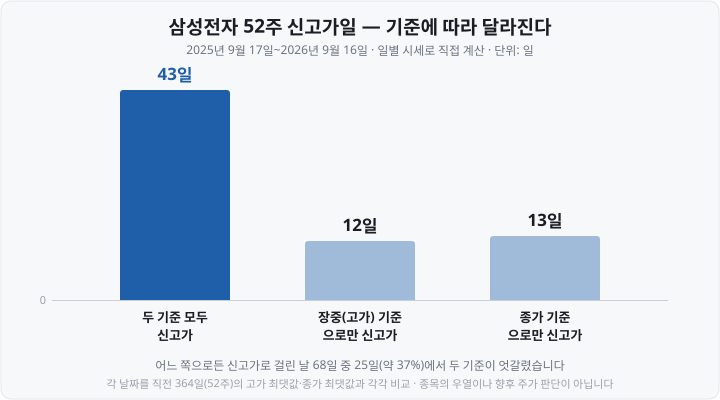
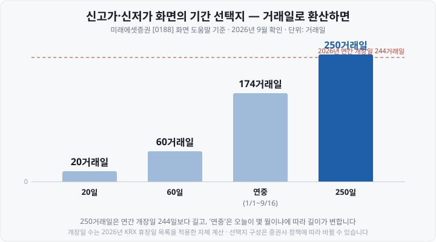

저는 한동안 "어제 52주 최저가를 찍은 종목이 뭐가 있나"를 포털에서 찾으려고 메뉴를 한참 뒤졌습니다. 상한가·하한가 목록도 있고 급등·급락 목록도 있는데, 52주짜리만 아무리 눌러도 안 나오더군요.

한참 뒤에야 알았습니다. <mark>제가 메뉴를 못 찾은 게 아니라 그런 메뉴가 없었습니다.</mark> 그리고 겨우 목록을 받는 길을 찾고 나니 더 성가신 문제가 기다리고 있었어요 — **같은 "52주 신저가"인데 어디서 찾느냐에 따라 다른 종목이 나옵니다.**

오늘은 목록을 얻는 경로와, 그 경로들이 왜 서로 다른 답을 주는지 정리해 보겠습니다.

&nbsp;

【포털 순위 화면에는 52주 목록이 없습니다】

네이버 금융·다음 금융 같은 포털의 국내증시 화면에는 순위 목록이 여럿 있습니다. 상한가·하한가, 상승률·하락률, 거래량 상위, 시가총액 상위 같은 것들이죠.

<mark>그런데 이 목록들은 전부 '오늘 하루'를 재는 자입니다.</mark> 어제 종가 대비 오늘 얼마나 움직였나, 오늘 얼마나 거래됐나를 줄 세운 것이에요. **52주는 자의 길이가 다릅니다** — 1년치 시세를 전부 훑어야 나오는 값이라 하루짜리 순위표에는 들어갈 자리가 없습니다.

어떤 데이터가 어느 사이트에 있는지는 [주식 데이터 무료로 보는 곳 편](https://blog.naver.com/hdglace/224372833633)에 정리해 두었는데, 52주 기준 목록은 그 지도에서도 포털 칸에 없습니다.

&nbsp;

【실질 경로는 증권사 HTS·MTS입니다】

목록을 정식으로 받는 길은 증권사 프로그램입니다. **HTS**(Home Trading System, 컴퓨터용 주식거래 프로그램)와 **MTS**(Mobile Trading System, 휴대폰용 주식거래 앱)에는 조건을 걸어 종목을 추려 주는 기능이 들어 있어요. <mark>다만 이 기능은 대개 그 증권사 계좌가 있어야 쓸 수 있습니다.</mark>

증권사마다 이름과 경로가 다릅니다. 공개된 도움말에서 확인한 두 곳을 예로 들면 이렇습니다.

▶ **키움증권 영웅문4 — 조건검색**
`시세분석 → 가격조건 → 52주 최고가/최저가대비 변동률`을 고르고 「52주 최고가 대비」의 변동률을 **0% 이상**으로 둡니다. 도움말은 이 조건으로 <mark>"당일 최고가가 52주 최고가를 기록한 종목이 검색됩니다"</mark>라고 설명해요.
다른 길도 있습니다. `시세분석 → 가격조건 → 신고가`에서 기준봉을 **0봉전 기준**, 신고가 조건을 **1봉 중 신고가**로 두면 검색일 당일 신고가를 기록 중인 종목이 나옵니다.

▶ **미래에셋증권 — [0188] 신고가/신저가 종목**
조건검색식을 짜지 않아도 되는 전용 화면입니다. 도움말은 이 화면을 "일정 기간 동안에 최고점 또는 최저점을 기록한 종목을 가려내는 화면"이라고 설명합니다.
**신고가와 신저가를 골라서** 조회하고, 기간은 **5일·10일·20일·60일·250일·연중** 중에서 고릅니다. 시장·업종·가격대·거래량으로 범위를 좁힐 수도 있어요.

여기서 오해 하나를 먼저 풀어 둘게요. <mark>신저가만 검색되고 신고가는 안 된다거나 그 반대인 경우는 없습니다.</mark> 두 증권사 모두 신고가와 신저가를 같은 화면·같은 방식으로 다룹니다. 방향만 바꾸면 됩니다.

&nbsp;

【★핵심 갈림길 — 종가 기준과 장중 기준】

이제 오늘 글의 본론입니다. "52주 최저가를 찍었다"는 말에는 <mark>두 가지 뜻이 섞여 있습니다.</mark>

▶ **장중 기준** — 그날 **저가**(하루 중 가장 낮게 거래된 값)가 지난 52주의 어떤 저가보다도 낮았다.
▶ **종가 기준** — 그날 **종가**(장이 끝날 때의 값)가 지난 52주의 어떤 종가보다도 낮았다.

말만 보면 큰 차이가 없어 보입니다. 실제로는 <mark>같은 날 같은 종목이 한쪽에선 걸리고 다른 쪽에선 안 걸려요.</mark> 장중에 푹 내려갔다가 끌어올려 마감하면 장중 기준으로만 신저가이고, 하루 종일 좁게 움직이다 지난 1년 중 가장 낮은 값으로 조용히 마감하면 종가 기준으로만 신저가가 됩니다.

얼마나 자주 갈릴까요. 실제 시세로 세어 봤습니다.

<mark>신고가로 걸린 날 68일 가운데 25일, 약 37%에서 두 기준이 서로 다른 답을 냈습니다.</mark> 세 번에 한 번보다 잦아요. "어느 기준이냐"를 확인하지 않고 목록을 받으면, 내가 찾던 것과 다른 목록을 받아 들고도 그걸 알아채지 못합니다.

실제 날짜를 보면 더 분명합니다. 삼성전자의 <mark>2026년 6월 18일과 19일은 이틀 연속으로, 그것도 정반대 방향으로 갈렸습니다.</mark>

| 날짜 | 그날 고가 | 그날 종가 | 직전 52주 최고 고가 | 직전 52주 최고 종가 | 판정 |
| :--- | ---: | ---: | ---: | ---: | :--- |
| 2026-06-18 | 363,000원 | 362,500원 | 370,000원 | 360,500원 | 종가 기준만 신고가 |
| 2026-06-19 | 374,500원 | 354,000원 | 370,000원 | 362,500원 | 장중 기준만 신고가 |

18일은 고가가 지난 1년 최고 고가에 못 미쳐 장중 기준으로는 아무것도 아니었지만, 종가가 지난 1년 최고 종가를 넘어 **종가 기준 신고가**였습니다. 다음 날인 19일은 반대로 장중에 374,500원까지 올라 **장중 기준 신고가**를 찍고도 354,000원에 마감해 종가 기준으로는 탈락했어요.

신저가 쪽도 같습니다. NAVER(035420)의 2026년 7월 8일은 저가 189,800원으로 직전 52주 최저 저가 190,300원을 밑돌아 <mark>장중 기준으로는 신저가</mark>였지만, 종가는 192,700원으로 직전 52주 최저 종가 191,500원보다 높아 **종가 기준으로는 신저가가 아니었습니다.**

&nbsp;

【화면에서 이 갈림길은 어떻게 나타나나】

미래에셋증권 [0188] 화면에는 이 축이 **선택지로 드러나 있습니다.** 도움말에 이렇게 적혀 있어요.

▶ **일시돌파** — "해당 기간에 신고가/신저가를 한 번이라도 기록했을 경우 조회"
▶ **돌파유지** — "해당 기간의 신고가/신저가와 현재가가 같을 때만 조회"

<mark>일시돌파는 장중에 잠깐 찍은 것까지 포함하고, 돌파유지는 지금 값이 그 수준을 지키고 있어야 걸립니다.</mark> 앞의 6월 19일 같은 날은 일시돌파에는 잡히고 돌파유지에는 잡히지 않아요.

키움증권 쪽은 앞서 본 대로 도움말이 **"당일 최고가가"** 라고 못 박아 두었으니 장중 기준입니다. 이렇게 도움말에 기준이 적혀 있으면 다행인데, **아무 설명 없이 목록만 보여 주는 화면도 많습니다.**

⚠️ 한 가지 더. 조건검색은 <mark>장중에 돌리면 '아직 끝나지 않은 하루'를 재고 있다는 점</mark>을 잊기 쉽습니다. 오전 10시의 검색 결과와 그날 장이 끝난 뒤의 결과는 같을 이유가 없어요. 종가 기준이 필요하다면 애초에 장이 끝난 뒤에 돌려야 합니다.

&nbsp;

【'그날의 고가·저가'가 언제부터 세어지는지도 봐야 합니다】

장중 기준을 쓸 거라면 하나 더 확인할 것이 있습니다. **그 '고가·저가'에 정규장 밖의 거래가 섞이는지**입니다.

이 글을 쓰던 2026년 9월 17일 오전 8시 23분, 그러니까 <mark>정규장이 열리기도 전에 이미 그날의 시가·고가·저가·종가와 거래량이 붙어 있는 것을 확인했습니다</mark>(네이버 금융 일별 시세, 삼성전자). 8시 12분에 446,173주였던 거래량이 8시 23분에 639,294주로 늘어 있었어요. **프리마켓 거래가 그날 행에 들어가고 있다**는 뜻입니다.

[야간·시간외 거래 편](https://blog.naver.com/hdglace/224412184369)에서 본 대로 지금은 정규장 밖에도 거래가 붙는 시간대가 여럿 있습니다. 어느 시간대까지 그날의 고가·저가에 포함할지는 데이터를 주는 쪽이 정하는 문제라 **제공처마다 다를 수 있어요.** 장중 기준 신고가·신저가를 다룰 때는 내가 보는 데이터의 고가·저가가 무엇을 포함한 값인지부터 확인하시는 편이 안전합니다.

&nbsp;

【'52주'가 며칠인지도 창구마다 다릅니다】

기준만 갈리는 게 아닙니다. **기간의 길이도 다릅니다.**

52주는 달력으로 364일입니다(52 × 7). 그런데 시세 데이터는 달력일이 아니라 **거래일**로 쌓입니다. 2026년 한국 증시의 개장일은 **244일**이에요(365일에서 주말을 빼고, 평일에 걸린 휴장일 17일을 더 뺀 수). 그러니 52주어치 시세는 거래일로 세면 대략 이 언저리입니다.

그런데 증권사 화면이 내놓는 선택지는 '52주'라고 적혀 있지 않은 경우가 많습니다.

여기서 두 가지가 보입니다.

▶ <mark>**250일은 52주보다 깁니다.**</mark> 연간 개장일이 244일이니 250거래일은 1년을 조금 넘는 기간이에요. 52주를 정확히 원한다면 이 선택지는 근사치입니다.
▶ <mark>**'연중'은 52주와 아예 다른 개념입니다.**</mark> 올해 1월 1일부터 오늘까지라서 1월에는 며칠치이고 12월에는 1년치예요. 9월인 지금은 174거래일 — 52주의 7할쯤입니다.

같은 '신고가'라도 20일짜리와 250일짜리는 전혀 다른 종목을 내놓습니다. **기간을 확인하지 않은 목록은 해석할 수 없는 목록입니다.**

&nbsp;

【종가 기준 목록을 정확히 만들려면】

여기까지 읽고 "그냥 내가 직접 계산하면 되지 않나" 싶으실 수 있습니다. 맞습니다. 그리고 <mark>그 길이 종가 기준을 정확히 얻는 유일한 방법이기도 합니다.</mark> 전 종목의 1년치 종가를 손에 쥐고 종목마다 최솟값·최댓값을 구하면 기준도 기간도 내가 정한 대로가 됩니다.

문제는 그 1년치 × 전 종목을 받는 일 자체가 만만치 않다는 것이에요. 한국거래소가 데이터를 내주는 단위와, 그래서 파일을 몇 번 받아야 하는지는 [과거 주가 데이터 받는 법 편](https://blog.naver.com/hdglace/224404481437)에 계산까지 해 두었으니 여기서 반복하지 않겠습니다. 한 줄로 줄이면 **"전 종목 × 1년치"를 한 번에 주는 무료 화면은 없고, 날짜별로 개장일 수만큼 받아 이어 붙여야 한다**는 이야기입니다.

한국거래소의 **KRX Data Marketplace**에 신고가·신저가를 바로 뽑아 주는 통계가 있는지도 확인해 봤는데, <mark>2025년 12월 개편 이후 통계·순위 화면이 로그인해야 열리는 구조라 비로그인 상태에서는 목록을 확인하지 못했습니다</mark>(2026년 9월 17일 확인). 다만 앞 편에서 정리한 `[통계] → [기본통계] → [주식]` 아래 화면 목록에는 신고가·신저가 전용 통계가 없었어요. 계정이 있으시면 직접 확인해 보시는 편이 확실합니다.

&nbsp;

【무료 웹 목록을 쓸 때 확인할 것】

증권사 계좌 없이 목록을 보여 주는 무료 사이트도 있습니다. 다만 <mark>사이트마다 기준과 기간이 다르고, 아예 밝히지 않는 곳도 있어요.</mark> 2026년 9월에 직접 확인한 두 곳이 대비를 보여 줍니다.

| 사이트 | 기간 | 기준 | 밝히고 있나 |
| :--- | :--- | :--- | :--- |
| 콕스톡 신고가 종목 | "최근 250일간" | "마감 기준"(종가), 고가·종가 선택 가능 | 페이지에 명시 |
| 인베스팅닷컴 52주 신저가(한국) | 표기 없음 | 표기 없음 | 밝히지 않음 |

어느 쪽을 쓰라는 이야기가 아닙니다. **기준이 적혀 있지 않은 목록은 종가 기준인지 장중 기준인지 알 수 없고, 알 수 없으면 내 질문의 답인지도 알 수 없다**는 것이 요점이에요.

기준이 안 적혀 있을 때 확인하는 방법은 하나 있습니다. <mark>목록에 오른 종목 중 하나를 골라 그날의 저가와 종가를 직접 비교해 보는 것</mark>입니다. 저가는 1년 최저를 뚫었는데 종가는 그보다 높은 종목이 목록에 있다면 그 목록은 장중 기준이에요. 몇 종목만 대조해 봐도 성격이 드러납니다.

&nbsp;

【남는 물음 — 액면분할이 있었다면】

마지막으로 확인하지 못한 것을 밝혀 둡니다. **액면분할**(주식 1주를 여러 주로 쪼개는 것)이나 증자가 있었던 종목의 52주 최고·최저를 증권사 조건검색이 어떻게 처리하는지 — 즉 과거 주가를 분할 비율에 맞춰 고친 **수정주가**로 비교하는지, 당시 실제 거래가로 비교하는지 — 는 <mark>키움증권·미래에셋증권 공개 도움말 어디에도 적혀 있지 않았습니다</mark>(2026년 9월 17일 확인).

이게 왜 문제인지는 [과거 주가 데이터 받는 법 편](https://blog.naver.com/hdglace/224404481437)에서 본 그대로입니다. 1주를 10주로 쪼갠 종목의 과거 주가를 고치지 않고 비교하면, 분할 전 가격이 지금보다 열 배 높게 남아 **그 종목은 앞으로 몇 달간 절대 신고가가 되지 않습니다.** 반대로 신저가에는 계속 걸려요.

확인하고 싶으시면 방법은 있습니다. 최근 1년 안에 액면분할이 있었던 종목 하나를 골라, 그 종목의 52주 최고가가 분할 전 가격 수준인지 분할 비율로 나눈 값인지 보시면 됩니다. 분할·증자 이력은 [DART 공시 보는 법 편](https://blog.naver.com/hdglace/224399426557)의 경로로 찾을 수 있고, 분할 시 기준가격이 어떻게 조정되는지는 [가격제한폭 30% 편](https://blog.naver.com/hdglace/224401345295)에 계산식이 있습니다.

&nbsp;

【정리】

▶ 개별 종목의 52주 최고·최저는 어디에나 있지만, **조건에 맞는 종목 '목록'은 포털에 없습니다.** 포털 순위표는 하루를 재는 자예요.
▶ 정식 경로는 **증권사 HTS·MTS의 조건검색 또는 신고가/신저가 전용 화면**이고, 대개 계좌가 필요합니다. 신고가와 신저가는 같은 방식으로 검색됩니다.
▶ **종가 기준과 장중 기준은 다른 종목을 내놓습니다.** 삼성전자 최근 1년에서는 신고가로 걸린 68일 중 25일, 약 37%가 엇갈렸습니다.
▶ **기간도 창구마다 다릅니다.** 250일은 52주보다 길고, '연중'은 오늘이 몇 월이냐에 따라 길이가 변합니다.
▶ 기준이 밝혀지지 않은 목록은 **종목 하나를 골라 저가와 종가를 직접 대조해** 성격을 확인하세요.

다음 편에서는 반대매매를 다룹니다. 예수금보다 많이 산 주식이 왜 강제로 팔리는지, 미수금과 증거금률이 무엇인지 이야기하겠습니다.

&nbsp;

【📊 데이터 출처 및 기준일】

| 내용 | 출처·확인 방법 |
| :--- | :--- |
| 키움증권 영웅문4 조건검색 경로 — `시세분석 → 가격조건 → 52주 최고가/최저가대비 변동률`, 변동률 0% 이상 시 "당일 최고가가 52주 최고가를 기록한 종목이 검색됩니다" / `시세분석 → 가격조건 → 신고가`의 기준봉 0봉전·1봉 중 신고가 설정 | 키움증권 영웅문4 도움말 「종목검색 - 52주 신고가 종목 검색」 원문, 2026년 9월 17일 확인. 인용 문구는 도움말 원문 그대로 |
| 미래에셋증권 [0188] 신고가/신저가 종목 화면 — "일정 기간 동안에 최고점 또는 최저점을 기록한 종목을 가려내는 화면", 기간 선택지 5·10·20·60·250일·연중, 「일시돌파」("해당 기간에 신고가/신저가를 한 번이라도 기록했을 경우 조회")와 「돌파유지」("해당 기간의 신고가/신저가와 현재가가 같을 때만 조회") 구분 | 미래에셋증권 HTS 화면 도움말 [0188] 원문, 2026년 9월 17일 확인 |
| 삼성전자 52주 신고가일 집계 — 두 기준 모두 43일, 장중(고가) 기준만 12일, 종가 기준만 13일, 어느 쪽으로든 걸린 날 68일 중 25일(약 37%) 엇갈림 | 네이버 금융 일별 시세(삼성전자 005930) 2026년 9월 17일 조회분으로 **본 공부방이 직접 계산**. 집계 구간은 2025-09-17~2026-09-16이며, 각 날짜를 **그 직전 364일(52주)** 구간의 고가 최댓값·종가 최댓값과 각각 비교해 판정. 25÷68=36.8%를 약 37%로 적음 |
| 삼성전자 2026-06-18(고가 363,000원·종가 362,500원·직전 52주 최고 고가 370,000원·최고 종가 360,500원), 2026-06-19(고가 374,500원·종가 354,000원·직전 52주 최고 고가 370,000원·최고 종가 362,500원) | 같은 일별 시세 자료, 2026년 9월 17일 확인. 직전 52주 최고값은 위와 같은 방식의 자체 계산 |
| NAVER(035420) 2026-07-08 — 저가 189,800원·종가 192,700원, 직전 52주 최저 저가 190,300원·최저 종가 191,500원 | 같은 일별 시세 자료(035420), 2026년 9월 17일 확인. 직전 52주 최저값은 자체 계산 |
| 네이버 금융 일별 시세의 당일 행에 정규장 개장 전(프리마켓) 거래가 이미 반영됨 — 2026-09-17 08:12 거래량 446,173주 → 08:23 639,294주, 같은 시각 시가 251,500원·고가 254,500원·저가 251,000원 표시 | 네이버 금융 일별 시세(삼성전자 005930)를 2026년 9월 17일 08:12·08:23(한국시간) 두 차례 조회해 **직접 확인**. ⚠️ 이 확인은 해당 제공처 한 곳에 대한 것이며, 다른 제공처가 어느 시간대까지 고가·저가에 포함하는지는 별도 확인 필요 |
| 2026년 한국 증시 개장일 244일(평일 휴장일 17일) | 본 공부방이 관리하는 2026년 KRX 휴장일 목록을 적용한 **자체 계산**(2026-01-01~12-31, 주말·휴장일 제외). '연중' 174거래일은 같은 방식으로 2026-01-01~09-16을 센 값 |
| KRX Data Marketplace 통계·순위 화면이 로그인 없이 열리지 않음 | data.krx.co.kr 통계·순위 화면에 비로그인 요청 시 "로그인 또는 회원가입이 필요합니다"만 반환됨을 2026년 9월 17일 확인. 로그인 필요 전환은 2025년 12월 27일 개편 사항. ⚠️ **계정 없이는 전체 통계 목록을 확인할 수 없어, 신고가·신저가 전용 통계의 부재를 단정하지 않음** |
| 콕스톡 신고가 종목 페이지 — "최근 250일간 신고가를 경신한 종목", 상단 표시는 "마감 기준", 고가·종가 선택 가능 | 해당 페이지 안내 문구, 2026년 9월 17일 확인 |
| 인베스팅닷컴 「52주 신저가 - 한국 주식」 페이지에 판정 기준·갱신 시점 표기 없음 | 해당 페이지 2026년 9월 17일 확인 |
| 액면분할·증자 시 52주 최고·최저의 수정주가 반영 여부 | **확인하지 못함.** 키움증권·미래에셋증권 공개 도움말에 해당 설명이 없어 2026년 9월 17일 기준 미확정. 본문에서도 단정하지 않고 확인 방법만 안내함 |

&nbsp;

⚠️ **면책 안내** — 이 글은 종목 검색 기능의 이용 방법과 데이터 기준의 차이를 정리한 **교육·정보 제공 목적**의 자료이며, 특정 종목·상품·증권사·사이트의 매매나 이용을 권유하지 않습니다. 본문에 나온 종목명과 수치는 기준의 차이를 설명하기 위한 **실제 시세 예시**일 뿐, 해당 종목에 대한 평가나 향후 주가 전망이 아닙니다. 신고가·신저가는 과거 가격을 정리한 값이며 앞으로의 가격을 알려 주지 않습니다. 화면 이름·메뉴 경로·기간 선택지·판정 기준은 증권사와 사이트의 정책에 따라 변경될 수 있으므로 실제 이용 시 각 서비스의 최신 안내를 직접 확인하시기 바랍니다. 모든 투자 판단과 그 결과에 대한 책임은 투자자 본인에게 있습니다.

&nbsp;

#52주신고가 #52주신저가 #신고가종목 #신저가종목 #조건검색 #종목검색 #영웅문 #HTS #MTS #종가기준 #장중기준 #액면분할 #수정주가 #주식초보 #투자공부 #재테크
