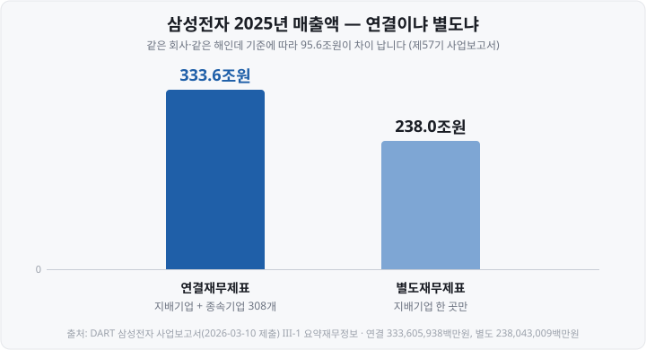
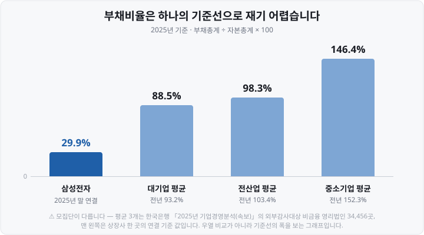
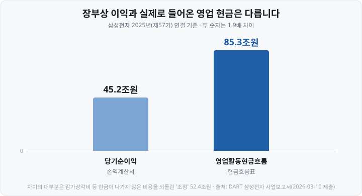

저도 처음 DART(Data Analysis, Retrieval and Transfer System, 금융감독원 전자공시시스템)에서 재무제표를 열어 봤을 때 5분 만에 창을 닫았습니다. <mark>수백 쪽짜리 문서에 주석만 서른 개가 넘게 달려 있었거든요.</mark> "이걸 다 읽으라고?" 싶었습니다.

나중에야 알았습니다. 다 읽는 게 아니었어요. **초보가 실제로 펼쳐 볼 장은 세 장**이고, 읽는 **순서**가 따로 있었습니다. 오늘은 그 세 장이 어디에 있고, 무엇을 뜻하고, 어떤 순서로 보는지를 정리해 보겠습니다.

어느 회사가 좋다 나쁘다를 판정하는 글이 아닙니다. **숫자가 어디에 적혀 있는지**를 찾아가는 글이에요. 설명을 위해 삼성전자의 2025년 사업보고서를 예시로 씁니다. 다들 이름을 아는 회사라야 숫자의 크기를 가늠하기 쉬워서입니다. (모든 수치는 **2026년 3월 10일 제출된 공시 원문에서** 직접 옮겼고, 출처는 맨 아래에 밝혔습니다.)

&nbsp;

【재무제표는 다섯 장 — 그중 세 장부터】

IFRS(International Financial Reporting Standards, 국제회계기준)를 우리나라가 받아들인 **한국채택국제회계기준**(K-IFRS)이 정하는 전체 재무제표는 다섯 장입니다.

| 이름 | 무엇을 보여 주나 | 이 글에서 |
| :-- | :-- | :-- |
| **손익계산서** | 1년 동안 얼마를 벌었나 | ① 본다 |
| **재무상태표** | 지금 무엇을 가졌고 얼마를 빚졌나 | ② 본다 |
| **현금흐름표** | 1년 동안 현금이 어디로 오갔나 | ③ 본다 |
| 자본변동표 | 자본 항목이 어떻게 움직였나 | 나중에 |
| 주석 | 위 네 장의 근거와 설명 | 나중에 |

정식 명칭은 **포괄손익계산서**이고, 옛날에 배우신 **대차대조표는** 2011년 K-IFRS 전면 도입 때 **재무상태표로** 이름이 바뀌었습니다.

주석을 "나중에"로 미루는 건 중요하지 않아서가 아니에요. 오히려 반대입니다. <mark>주석은 앞의 네 장에서 궁금증이 생긴 다음에 찾아보는 자료</mark>거든요. 저도 처음에 주석부터 붙잡고 있다가 아무것도 못 건졌습니다.

&nbsp;

【어디에 있나 — 사업보고서 「III. 재무에 관한 사항」】

DART에서 회사를 검색해 사업보고서를 열면 왼쪽에 목차가 뜹니다. 재무제표는 **세 번째 대항목**에 있어요. 실제 목차는 이렇게 생겼습니다.

| 순서 | 항목 |
| :-- | :-- |
| III-1 | 요약재무정보 |
| III-2 | **연결재무제표** |
| III-3 | 연결재무제표 주석 |
| III-4 | **재무제표** |
| III-5 | 재무제표 주석 |
| III-6 | 배당에 관한 사항 |
| III-7 | 증권의 발행을 통한 자금조달에 관한 사항 |
| III-8 | 기타 재무에 관한 사항 |

처음 열어 볼 곳은 **III-1 요약재무정보**입니다. 3개 사업연도의 자산·부채·자본·매출·영업이익·순이익이 <mark>한 표에 3년치로 정리돼 있어서, 재무제표 세 장의 핵심을 한 화면에서 먼저 훑을 수 있습니다.</mark> 저는 이걸 알고 나서 시간이 확 줄었어요.

지금(2026년 9월) 12월 결산법인에서 볼 수 있는 가장 최신 정기보고서는 **2026년 반기보고서입니다.** 반기보고서 제출기한이 반기 종료 후 45일이라 8월 14일까지 올라왔고, 3분기보고서는 11월 16일이 마감입니다. 정기보고서의 달력은 [DART 공시 읽는 법](https://blog.naver.com/hdglace/224399426557) 편에 정리해 두었습니다.

&nbsp;

【읽기 전 갈림길 — 연결이냐 별도냐】

목차에 **연결재무제표**와 **재무제표**가 따로 있는 게 보이시나요? 이 둘은 같은 회사, 같은 기간의 숫자인데 **값이 다릅니다.** 여기서 잘못 고르면 이후 계산이 전부 어긋나요. 제가 처음에 딱 이걸 틀렸습니다.

▶ **연결재무제표** — 지배기업과 종속기업을 **하나의 회사처럼 합쳐** 만든 것입니다. 삼성전자의 2025년 말 기준 연결 대상 회사는 308개입니다.
▶ **별도재무제표** — 목차에 그냥 「재무제표」로 적힌 게 이쪽이에요. **지배기업 한 곳만** 놓고 만들며, 종속기업은 지분 투자로만 잡힙니다.

차이가 얼마나 되는지 같은 해 매출액으로 보면 이렇습니다.

영업이익도 연결 43.6조원 대 별도 23.6조원으로 벌어집니다. <mark>어느 쪽이 맞는 숫자냐가 아니라, 무엇을 묻고 있느냐에 따라 고르는 것입니다.</mark> 그룹 전체 규모가 궁금하면 연결을, 지배기업 자체가 궁금하면 별도를 봅니다. 뉴스와 증권사 화면에서 쓰는 실적은 대개 **연결 기준이에요.**

종속회사가 있는 법인은 사업보고서의 재무 사항을 연결 기준으로 적되 별도재무제표를 함께 실어야 합니다. 그래서 두 장이 나란히 있는 거예요. 종속회사가 없는 회사는 연결재무제표 자체가 없습니다.

&nbsp;

【첫째 장, 손익계산서 — 이익은 네 번 깎입니다】

손익계산서는 **1년 동안의 성적표**입니다. 맨 위 매출에서 시작해 비용을 단계별로 빼 나가고, 단계마다 이름이 다른 이익이 나와요. 여기가 제가 가장 오래 헷갈렸던 지점입니다 — <mark>"이익"이라는 단어가 한 장 안에서 네 번 다른 뜻으로 쓰입니다.</mark>

| 단계 | 계산 | 2025년 연결 | 매출 대비 |
| :-- | :-- | --: | --: |
| 매출액 | — | 333.6조원 | 100% |
| − 매출원가 | 물건을 만드는 데 든 돈 | 202.2조원 | |
| = **매출총이익** | | **131.4조원** | 39.4% |
| − 판매비와관리비 | 파는 데·굴리는 데 든 돈 | 87.8조원 | |
| = **영업이익** | | **43.6조원** | 13.1% |
| ± 영업 밖 손익 | 이자·환율·지분법 등 | | |
| = 법인세비용차감전순이익 | | 49.5조원 | |
| − 법인세비용 | | 4.3조원 | |
| = **당기순이익** | | **45.2조원** | 13.6% |

세 이익의 성격이 다릅니다.

▶ **매출총이익은** 제품 자체가 얼마나 남는 장사인지를 보여 줍니다.
▶ **영업이익은** 본업으로 번 돈입니다.
▶ **당기순이익은** 이자·환차손익·법인세까지 모두 반영한 최종 잔액이라 **본업과 무관한 사건에 크게 흔들립니다.**

위 표에서도 그 흔들림이 보여요. 영업이익 43.6조원보다 당기순이익 45.2조원이 **더 큽니다.** 법인세를 4.3조원 냈는데도 최종 숫자가 커진 건 영업 밖에서 금융수익이 16.2조원 들어왔기 때문입니다. 이자가 붙는 현금성 자산이 많으면 이런 모양이 나와요. <mark>그래서 "본업이 얼마나 잘되고 있나"를 묻는 자리에서는 순이익이 아니라 영업이익을 봅니다.</mark>

영업이익이 이렇게 손익계산서 본문에 꼭 표시되는 건 2012년 K-IFRS 제1001호 「재무제표 표시」 개정 덕분입니다. 국제회계기준 원문에는 영업손익의 정의도, 표시 요구도 없어요. 한국은 매출액·매출원가·판매비와관리비를 구분해 적고 **영업손익을 본문에 반드시 표시하도록** 기준을 따로 고쳤습니다.

&nbsp;

【순이익 아래에 한 줄이 더 있습니다】

연결 손익계산서에는 당기순이익 다음에 「당기순이익의 귀속」이라는 줄이 붙습니다. 2025년 연결 당기순이익 45.2조원은 **지배기업 소유주지분 44.3조원**과 **비지배지분 0.9조원**으로 나뉩니다.

종속기업을 100% 갖고 있지 않으면 그 회사 이익의 일부는 다른 주주 몫이기 때문이에요. [PER과 PBR](https://blog.naver.com/hdglace/224394070576)을 계산할 때 쓰는 순이익은 이 중 **지배기업 소유주지분입니다.** 주당순이익도 같은 기준으로 계산되며, 이 회사의 2025년 기본주당순이익은 6,605원으로 공시돼 있습니다.

&nbsp;

【둘째 장, 재무상태표 — 왼쪽과 오른쪽이 같습니다】

손익계산서가 1년 동안의 흐름이라면, 재무상태표는 **결산일 하루의 사진**입니다. 2025년 12월 31일 현재 이 회사가 무엇을 갖고 있고 누구에게 얼마를 빚졌는지가 적혀 있어요.

구조는 단순합니다. **자산 = 부채 + 자본.** 가진 것의 총합은 남의 돈과 내 돈의 합과 언제나 같습니다.

| 항목 | 2025년 말 연결 |
| :-- | --: |
| 자산총계 | 566.9조원 |
| — 유동자산(1년 안에 현금화) | 247.7조원 |
| — 비유동자산 | 319.3조원 |
| 부채총계 | 130.6조원 |
| — 유동부채(1년 안에 갚을 것) | 106.4조원 |
| 자본총계 | 436.3조원 |

여기서 뽑는 비율이 두 개입니다.

&nbsp;

【부채비율 — 기준선은 하나가 아닙니다】

**부채비율은** 부채총계를 자본총계로 나눈 값이에요. 남의 돈이 내 돈의 몇 배인지를 봅니다.

▶ 130.6조원 ÷ 436.3조원 × 100 = **29.9%**

흔히 "부채비율 200%가 기준"이라는 말을 듣습니다. 그런데 실제 평균은 업종과 규모에 따라 이렇게 흩어져 있어요.

전산업 평균이 2024년 103.4%에서 2025년 98.3%로 내렸고, 대기업은 93.2%에서 88.5%로, 중소기업은 152.3%에서 146.4%로 내렸습니다. <mark>같은 100%라도 중소기업에서는 평균보다 낮고 대기업에서는 평균보다 높습니다.</mark> 자본집약적인 업종과 그렇지 않은 업종의 차이는 이보다 더 커요. 그래서 이 숫자는 **같은 업종 안에서, 그리고 같은 회사의 과거와** 견주는 게 기본입니다.

⚠️ 위 그래프에서 맨 왼쪽만 상장사 한 곳의 값이고 나머지 셋은 비상장사가 다수 포함된 평균이라, **모집단이 다릅니다.** 우열 비교가 아니라 기준선의 폭을 보는 그래프로 봐 주세요.

&nbsp;

【유동비율 — 1년 안의 이야기】

**유동비율은** 유동자산을 유동부채로 나눈 값입니다. 1년 안에 갚아야 할 돈을 1년 안에 현금이 될 자산으로 감당할 수 있는지를 봐요.

▶ 247.7조원 ÷ 106.4조원 × 100 = **232.8%**

유동자산과 유동부채는 둘 다 <mark>"1년 이내"라는 같은 잣대로 끊어 놓은 항목</mark>이라, 이 비율은 회사의 장기 체력이 아니라 **단기 자금 사정**을 봅니다. 부채비율이 낮아도 유동비율이 낮으면 당장의 자금 압박이 있을 수 있고, 그 반대도 가능해요.

&nbsp;

【셋째 장, 현금흐름표 — 이익과 현금은 다른 숫자입니다】

세 번째 장이 왜 필요한지가 가장 안 와닿는 부분일 거예요. 저도 그랬습니다. 이유는 한 문장으로 정리됩니다. <mark>손익계산서의 이익은 '현금이 오간 시점'이 아니라 '거래가 일어난 시점'으로 적히기 때문입니다.</mark>

물건을 외상으로 팔면 매출과 이익은 그날 잡히지만 현금은 아직 안 들어왔습니다. 반대로 공장 설비의 감가상각비는 비용으로 빠져 이익을 줄이지만, 그해에 현금이 나간 건 아니에요. 그래서 **이익이 나는데도 현금이 말라 부도가 나는 일**이 생깁니다. 회계에서는 이걸 **흑자도산이라고** 부릅니다.

현금흐름표는 이 어긋남을 되짚어 줍니다. 실제 숫자로 보면 이렇습니다.

차이의 정체는 현금흐름표 안에 그대로 적혀 있습니다. 당기순이익 45.2조원에 **조정 52.4조원을** 더하고, 영업활동으로 인한 자산·부채 변동 9.6조원을 뺀 게 출발점이에요. 여기서 '조정'은 감가상각비처럼 <mark>비용으로 빠졌지만 현금은 나가지 않은 항목을</mark> 도로 더해 주는 자리입니다. 설비 투자가 큰 제조업일수록 이 금액이 큽니다.

&nbsp;

【세 칸의 부호를 봅니다】

현금흐름표는 현금의 출처를 셋으로 나눕니다. 금액보다 **부호의 조합**을 먼저 봐요.

| 구분 | 2025년 연결 | 무엇인가 |
| :-- | --: | :-- |
| 영업활동현금흐름 | **＋85.3조원** | 본업으로 벌어들인 현금 |
| 투자활동현금흐름 | **−68.5조원** | 설비·금융자산에 쓴 현금 |
| 재무활동현금흐름 | **−13.5조원** | 배당·자기주식 취득·차입 상환 |

영업에서 들어온 85.3조원에서 투자로 68.5조원, 재무로 13.5조원이 나가고 환율 변동분 0.8조원이 더해져, 그해 현금및현금성자산이 4.2조원 늘었습니다. 재무활동의 마이너스를 뜯어보면 배당금 지급 9.9조원과 자기주식 취득 8.2조원이 큰 몫이에요.

부호 조합을 읽는 기본은 이렇습니다.

▶ **영업이 플러스이고 투자가 마이너스면** 벌어서 투자하는 모양입니다.
▶ **영업이 마이너스인데 재무가 플러스면** 빌려서 버티는 모양일 수 있습니다.

다만 <mark>한 해의 부호만으로 단정할 수는 없습니다</mark> — 창업기·대규모 투자기·구조조정기에는 정상적인 회사도 부호가 뒤집힙니다. 여러 해를 이어서 보는 게 전제예요.

&nbsp;

【그래서, 읽는 순서】

지금까지의 내용을 실제 동선으로 정리하면 이렇습니다.

1. **III-1 요약재무정보를 먼저 펼칩니다.** 3년치가 한 표에 있어 흐름이 보입니다.
2. **연결과 별도 중 무엇을 볼지 정합니다.** 대개 연결입니다.
3. **손익계산서에서 매출액과 영업이익의 3년 추세를 봅니다.** 순이익이 아니라 영업이익입니다.
4. **재무상태표에서 부채비율과 유동비율을 계산합니다.** 같은 업종·같은 회사의 과거와 견줍니다.
5. **현금흐름표에서 영업활동 현금흐름의 부호와 크기를 봅니다.** 순이익과 견줘 너무 벌어지면 왜 그런지 확인합니다.
6. **그때 생긴 궁금증을 주석에서 찾습니다.** 주석 번호는 각 항목 옆에 (주27)처럼 적혀 있어 바로 찾아갈 수 있어요.

숫자를 프로그램으로 받아 여러 해·여러 회사를 한꺼번에 비교하고 싶다면, 화면을 옮겨 적는 대신 OpenDART의 「XBRL 재무제표 원문 내려받기」를 씁니다. 시세 데이터를 파일로 받는 방법은 [과거 주가 데이터 받는 법](https://blog.naver.com/hdglace/224404481437) 편에서 다뤘습니다.

&nbsp;

【세 장이 하지 못하는 일】

마지막으로 경계입니다.

▶ **세 장은 과거만 말합니다.** 재무제표는 이미 끝난 기간의 기록이에요. 앞으로의 실적을 알려 주지 않습니다.
▶ **회계 처리 방법에 따라 숫자가 달라집니다.** 감가상각 방법, 재고 평가, 수익 인식 시점이 어떻게 정해졌는지는 본문이 아니라 **주석에 적혀 있습니다.**
▶ **숫자의 신뢰도 자체는 다른 항목에 있습니다.** 사업보고서 「V. 회계감사인의 감사의견 등」에서 감사의견을 확인해요. 예시로 든 회사는 제55기부터 제57기까지 모두 **적정의견입니다.** 한정·부적정·의견거절은 **비적정 감사의견으로** 묶여 상장폐지 사유에 해당합니다. 2025년 7월 10일 시행된 개정 규정에서는, 감사의견 미달이 발생한 다음 사업연도에 또 미달하면 이의신청 없이 상장폐지됩니다.
▶ **정기보고서는 분기마다 나옵니다.** 방금 벌어진 일은 여기에 없어요. 그런 사건은 수시공시로 올라오고, [실적 시즌 달력](https://blog.naver.com/hdglace/224389308601) 편에서 잠정실적과 확정 보고서의 2단 구조를 정리했습니다.

&nbsp;

【정리】

1. K-IFRS 재무제표는 다섯 장이고, 먼저 볼 세 장은 **손익계산서·재무상태표·현금흐름표입니다.** 주석은 궁금증이 생긴 다음에 찾습니다.
2. 위치는 사업보고서 「III. 재무에 관한 사항」이고, 입구는 **III-1 요약재무정보**입니다.
3. **연결과 별도를 먼저 고릅니다.** 예시로 든 회사의 2025년 매출액은 연결 333.6조원, 별도 238.0조원으로 95.6조원 차이가 납니다.
4. 손익계산서의 이익은 **매출총이익 → 영업이익 → 당기순이익** 순으로 이름과 뜻이 바뀝니다. 본업의 성과는 **영업이익입니다.**
5. 재무상태표에서는 **부채비율**과 **유동비율을** 계산합니다. 2025년 부채비율 평균은 전산업 98.3%, 대기업 88.5%, 중소기업 146.4%로 **기준선이 하나가 아닙니다.**
6. 현금흐름표는 **이익과 현금의 어긋남**을 보여 줍니다. 예시 회사는 순이익 45.2조원에 영업활동 현금흐름 85.3조원이었고, 차이의 대부분은 감가상각 같은 비현금 비용의 조정 52.4조원입니다.

&nbsp;

【다음 편에서는】

**대체거래소 NXT**를 다룹니다. 넥스트레이드가 여는 프리마켓·메인·애프터마켓의 시간과 호가 방식, 한국거래소와 무엇이 다른지, 그리고 2026년 9월 14일 한국거래소가 애프터마켓을 새로 열면서 두 시장이 같은 시간대에 겹치게 된 상황을 실제 운영 기준으로 정리할 예정입니다.

&nbsp;

【📊 데이터 출처 및 기준일】

| 항목 | 값 | 출처·확인일 |
| :-- | :-- | :-- |
| 삼성전자 2025년(제57기) 연결·별도 재무수치 전부 | 연결 매출액 333,605,938백만원·매출원가 202,235,513백만원·매출총이익 131,370,425백만원·판관비 87,769,374백만원·영업이익 43,601,051백만원·법인세비용차감전순이익 49,481,471백만원·법인세비용 4,274,666백만원·당기순이익 45,206,805백만원(지배 44,260,956, 비지배 945,849)·기본주당순이익 6,605원 / 자산총계 566,942,110백만원·유동자산 247,684,612백만원·부채총계 130,621,773백만원·유동부채 106,411,348백만원·자본총계 436,320,337백만원 / 영업활동현금흐름 85,315,148백만원(조정 52,395,616, 자산부채 변동 △9,613,906)·투자 △68,512,206·재무 △13,478,040·외화환산 825,897·현금 증가 4,150,799·배당금 지급 9,897,183·자기주식 취득 8,189,263 / 별도 매출액 238,043,009백만원·영업이익 23,603,619백만원·당기순이익 33,686,601백만원 / 연결 대상 308개 | 금융감독원 전자공시시스템(DART) 「삼성전자 사업보고서」(접수번호 20260310002820, **2026-03-10 제출**) 원문 **직접 조회**, 2026-09-13. 조원 값은 백만원 원본을 소수점 첫째 자리로 **반올림**했고, 비율(39.4%·13.1%·13.6%)·부채비율 29.9%·유동비율 232.8%·연결과 별도 차이 95.6조원·1.9배는 **직접 계산** |
| 사업보고서 「III. 재무에 관한 사항」 하위 8개 항목, 연결재무제표 주석 32개 | 1.요약재무정보 2.연결재무제표 3.연결재무제표 주석 4.재무제표 5.재무제표 주석 6.배당에 관한 사항 7.증권의 발행을 통한 자금조달에 관한 사항 8.기타 재무에 관한 사항 | 위 공시의 목차 구조 **직접 확인**, 2026-09-13. 목차 구성은 기업공시서식 개정에 따라 달라질 수 있음 |
| 감사의견 | 제55~57기 모두 적정, 감사인 삼정회계법인 | 같은 공시 「V. 회계감사인의 감사의견 등」 원문, 2026-09-13 |
| 삼성전자 2026년 반기보고서 제출일 | 2026-08-14 | DART 공시통합검색, 2026-09-13. 제출기한(사업보고서 90일·반기·분기 45일) 근거는 자본시장법 제159조·제160조. 2026년 12월 결산법인 3분기보고서 마감 11월 16일은 DART 「공시업무 스케줄」 |
| 연결 기준 기재 의무 + 별도재무제표 포함 | 종속회사가 있는 법인은 재무 사항을 연결 기준으로 기재하되 별도재무제표를 포함해 작성 | DART 「기업공시 길라잡이 → 정기보고서」 안내, 2026-09-13 |
| K-IFRS 전체 재무제표 5종, 대차대조표 → 재무상태표 명칭 변경, 2011년 상장사 전면 적용 | 재무상태표·포괄손익계산서·자본변동표·현금흐름표·주석 | 한국회계기준원 기업회계기준서 제1001호 「재무제표 표시」 관련 자료 **교차확인**, 2026-09-13 |
| 영업손익 본문 표시 의무화 | 매출액·매출원가·판관비 구분 표시, 영업손익 본문 표시 의무. 국제회계기준 원문에는 영업손익 정의·공시요구 없음 | 금융위원회 「영업손익 산정 관련 K-IFRS 개정」 보도자료 및 회계법인 해설자료 **교차확인**, 2026-09-13. 개정 기준서는 2012-12-31 시행 |
| 부채비율 평균 | 2025년 전산업 98.3%(전년 103.4%), 대기업 88.5%(93.2%), 중소기업 146.4%(152.3%) · 조사 대상 34,456곳(제조 13,918·비제조 20,538) | 한국은행 「2025년 기업경영분석 결과(속보)」(**2026-06-10 발표**), 2026-09-13 확인. 대상은 **외부감사대상 비금융 영리법인**이며 비상장사가 다수 포함되므로 상장사 한 곳과 직접 비교하는 지표가 아님 |
| 부채비율·유동비율 산식 | 부채총계 ÷ 자본총계 × 100 / 유동자산 ÷ 유동부채 × 100 | 한국은행 기업경영분석 안정성 지표 정의 및 한경용어사전 **교차확인**, 2026-09-13 |
| 비적정 감사의견과 상장폐지 | 한정·부적정·의견거절은 상장폐지 사유. 2025-07-10 시행 개정으로 다음 사업연도에 또 미달 시 이의신청 없이 상장폐지(회생·워크아웃 기업은 1년 추가 개선기간) | 금융위원회 보도자료(2019-03-20) 및 2025년 상장폐지 제도 개정 해설 **교차확인**, 2026-09-13 |

&nbsp;

⚠️ **면책 안내** — 이 글은 공개된 공시자료와 회계기준·법령, 한국은행 통계를 정리한 **교육·정보 제공 목적**의 자료이며, 특정 종목·상품의 매매를 권유하지 않습니다. 본문에 등장하는 회사는 재무제표를 읽는 방법을 설명하기 위한 예시이고, 그 회사에 대한 투자 판단이나 우열 평가를 담고 있지 않습니다. 회계기준과 공시서식은 개정될 수 있고, 본문의 수치는 위에 밝힌 기준 시점의 값입니다. 실제 투자 판단은 원문 공시를 직접 확인하고 본인 책임하에 하시기 바랍니다.

&nbsp;

#재무제표보는법 #DART재무제표 #사업보고서 #연결재무제표 #별도재무제표 #손익계산서 #재무상태표 #현금흐름표 #영업활동현금흐름 #부채비율 #유동비율 #영업이익 #당기순이익 #흑자도산 #주식초보 #투자공부 #재테크
