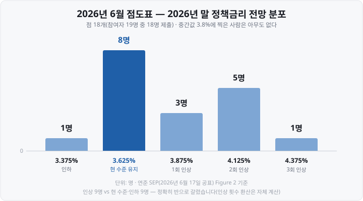
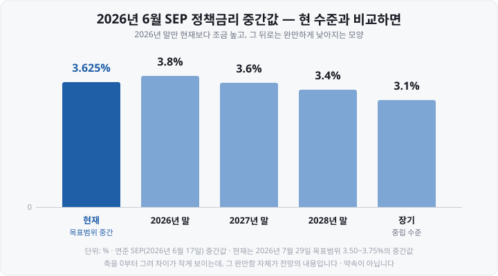

저는 한동안 **FOMC**(Federal Open Market Committee, 미 연방공개시장위원회) 뉴스를 제목만 보고 넘겼습니다. "연준 동결"이라고 쓰여 있으면 "별일 없었네" 하고 지나갔죠.

그러다 한 번은 <mark>동결이라는데 다음 날 미국 지수가 크게 흔들린 걸</mark> 보고 이상하다 싶었습니다. 성명문을 열어 보니 이유가 마지막 문단에 있었습니다. **표결이 만장일치가 아니었습니다.**

그날 이후로 저는 FOMC를 "결정 하나"가 아니라 **자료 네 종류가 한꺼번에 나오는 날**로 보게 됐습니다. 오늘은 그 구조를 정리해 보겠습니다. 금리가 오를지 내릴지는 다루지 않습니다 — 저도 모르고, 이 글의 목적도 아닙니다.

&nbsp;

【① FOMC는 누구인가 — 12명이 투표하고 19명이 토론합니다】

미국 중앙은행은 한국은행처럼 한 기관이 아닙니다. **워싱턴의 연준 이사회 + 전국 12개 지역 연방준비은행**이라는 이중 구조입니다. 그래서 위원 구성도 두 갈래입니다.

| 구분 | 인원 | 자격 |
| :--- | :--- | :--- |
| 연준 이사회 이사 | **7명** | 전원 상시 투표권 |
| 뉴욕 연준 총재 | **1명** | 상시 투표권(관례상 FOMC 부의장) |
| 그 외 지역 연준 총재 | **4명** | 11명 중 **1년 임기로 순환** |
| **투표권자 합계** | **12명** | |

제가 몰랐던 게 이 대목입니다. <mark>투표권이 없는 지역 총재 7명도 회의에 참석해 토론하고 전망치를 냅니다.</mark> 그래서 **참여자는 19명, 투표권자는 12명**입니다. 뒤에 볼 점도표는 12명이 아니라 19명 기준으로 만들어집니다.

순환은 네 그룹으로 돌아갑니다. ①보스턴·필라델피아·리치먼드 ②클리블랜드·시카고 ③애틀랜타·세인트루이스·댈러스 ④미니애폴리스·캔자스시티·샌프란시스코.

**2026년 투표권을 가진 지역 총재는** 필라델피아(애나 폴슨)·클리블랜드(베스 해맥)·댈러스(로리 로건)·미니애폴리스(닐 카시카리)입니다. <mark>같은 발언도 올해 투표권이 있는 사람의 말은 무게가 다릅니다.</mark>

▶ 참고로 **2026년 5월 22일 케빈 워시가 연준 의장으로 취임했습니다.** FOMC가 만장일치로 그를 위원회 의장으로 선출했고, 파월 전 의장의 의장 임기는 5월 17일 만료됐습니다.

&nbsp;

【② 정하는 건 '금리'가 아니라 '목표범위'입니다】

FOMC가 정하는 것은 **연방기금금리**(미국 은행 간 초단기 자금 거래 금리)의 **목표범위**입니다. 2026년 7월 29일 회의 결과 <mark>연 3.50~3.75%로 유지됐습니다.</mark>

한국은행 기준금리가 "연 2.75%"처럼 점 하나로 나오는 것과 다릅니다. 미국은 폭 0.25%포인트의 **구간**으로 제시합니다.

그리고 이 구간을 실제로 유도하는 세부 금리는 성명문이 아니라 **Implementation Note**라는 별도 문서에 적힙니다. 7월 29일 자 문서에서 지급준비금 부리금리(IORB)는 <mark>연 3.65%로 유지</mark>됐고, 역레포 금리는 <mark>연 3.50%</mark>였습니다(둘 다 7월 30일 적용).

▶ **부리금리와 역레포 금리가 무엇이냐면** — 둘 다 실제 시장금리가 목표범위 아래로 새지 않게 **바닥을 받치는 장치**입니다.

▶ **부리금리**(付利金利, IORB) = 은행이 연준에 맡겨 둔 지급준비금에 연준이 붙여 주는 이자. 가만히 둬도 받는 이자이므로 은행은 그보다 낮은 금리로 남에게 빌려줄 이유가 없습니다. 그래서 은행 간 자금 거래 금리의 하한이 됩니다.

▶ **역레포 금리**(ON RRP, 익일물 역환매조건부매매) = 연준이 보유 국채를 담보로 맡기고 하룻밤 돈을 받아 주면서 붙이는 이자. 연준에 지급준비금 계좌가 없어 부리금리를 못 받는 **MMF 같은 기관**도 이용할 수 있어서, 은행 바깥까지 한 겹 더 바닥을 깔아 줍니다. <mark>역레포 금리 3.50%가 목표범위(3.50~3.75%)의 아래 끝과 같다는 점</mark>을 보면 이 장치의 성격이 드러납니다.

&nbsp;

【③ 연 8회 — 그런데 점도표는 네 번만 나옵니다】

정례회의는 **연 8회**, 대개 화·수 이틀간이고 결정은 둘째 날 발표됩니다.

| 2026년 회의 | 경제전망·점도표 |
| :--- | :--- |
| 1월 27~28일 | — |
| **3월 17~18일** | **있음** |
| 4월 28~29일 | — |
| **6월 16~17일** | **있음** |
| 7월 28~29일 | — |
| **9월 15~16일** | **있음** |
| 10월 27~28일 | — |
| **12월 8~9일** | **있음** |

<mark>여덟 번 중 네 번(3·6·9·12월)만 경제전망이 함께 나옵니다.</mark> 이 자료의 정식 이름이 **SEP**(Summary of Economic Projections, 경제전망 요약)입니다.

그래서 같은 "동결"이라도 읽을 재료의 양이 다릅니다. 다음 회의는 **9월 15~16일**이고 SEP가 붙는 회의입니다.

&nbsp;

【④ 하루에 나오는 자료 네 종류 — 한국시간으로】

| 자료 | 발표 시점(미 동부시간) | 무엇인가 |
| :--- | :--- | :--- |
| **성명문** | 둘째 날 **오후 2:00** | 결정·경제 판단·**표결 결과** |
| Implementation Note | 성명문과 동시 | 부리금리 등 세부 금리 |
| SEP·점도표 | 성명문과 동시(연 4회) | 참여자별 전망 |
| **의장 기자회견** | **오후 2:30** | 문구의 배경 설명·질의응답 |
| **의사록** | 결정 **3주 후** | 토론 내용 요약본 |

한국시간으로 옮기면 이렇습니다. 미국이 서머타임을 쓰기 때문에 시차가 13시간·14시간을 오갑니다.

| 자료 | 서머타임 기간 | 표준시 기간 |
| :--- | :--- | :--- |
| 성명문·SEP | **다음날 새벽 03:00** | 다음날 새벽 **04:00** |
| 기자회견 | 다음날 새벽 **03:30** | 다음날 새벽 **04:30** |

2026년은 3월 8일~11월 1일이 서머타임이니, <mark>9월 16일(수) 회의 결과는 한국시간 9월 17일(목) 새벽 3시에 나옵니다.</mark>

의사록의 시차도 알아 둘 만합니다. 6월 16~17일 회의 의사록은 <mark>3주 뒤인 7월 8일에 공개됐습니다.</mark> 회의 당일엔 "결정"만 알고, "왜 그렇게 정했는지의 논의"는 3주 뒤에 봅니다.

▶ **블랙아웃 기간** — 회의 전엔 연준 인사 발언이 갑자기 끊깁니다. 규정상 <mark>회의 전 두 번째 토요일 0시(미 동부시간)부터 회의 다음 날 밤 11시 59분까지</mark> 공개 발언이 제한됩니다. 뉴스가 조용해지는 건 정상입니다.

&nbsp;

【🔥 점도표 — 중간값 하나로 읽으면 안 됩니다】

**점도표**(dot plot)는 참여자들이 각자 "연말에 정책금리가 이 정도면 적절하다"고 보는 수준을 점으로 찍은 그림입니다.

제가 오해했던 게 두 가지였습니다.

- **오해 ①** 점도표는 연준의 약속이다 → **아닙니다.** 개인 판단의 모음이고 회의마다 바뀝니다.
- **오해 ②** 중간값이 위원회의 뜻이다 → **이것도 아닙니다.** 중간값은 <mark>점을 줄 세워 가운데를 계산한 통계</mark>일 뿐입니다.

두 번째가 왜 위험한지, 2026년 6월 실제 자료로 보겠습니다.

<mark>현 수준보다 높게 본 사람 9명, 현 수준이거나 더 낮게 본 사람 9명 — 정확히 반으로 갈렸습니다.</mark>

그런데 SEP 표에 실린 **2026년 말 중간값은 3.8%입니다.** 현재 목표범위 중간(3.625%)보다 높으니 중간값만 보면 "올해 한 번쯤 올릴 생각"으로 읽힙니다.

이 3.8%가 어떻게 나온 숫자인지 뜯어보면 이렇습니다. 점 18개를 낮은 순으로 줄 세우면 중간값은 9번째 점(3.625%)과 10번째 점(3.875%)의 평균, **정확히는 3.75%입니다.** SEP 표가 소수 첫째 자리까지만 적어서 3.8%로 반올림된 것이죠.

그리고 <mark>3.75%는 점도표에서 애초에 찍을 수 없는 값입니다.</mark> 목표범위 폭이 0.25%포인트라서 점은 그 중간값인 3.375%·3.625%·3.875%처럼 0.25%포인트 간격으로만 놓입니다. 실제로 연준이 함께 공개하는 분포표에도 3.750% 칸의 인원은 0명으로 적혀 있습니다.

정리하면 <mark>가장 많은 8명이 찍은 값은 '현 수준 유지'(3.625%)인데, 표에 실리는 중간값은 아무도 찍을 수 없는 자리</mark>인 겁니다. 9번째와 10번째 점 사이를 계산한 결과일 뿐이죠.

하나 더. 2026년 6월엔 **18명이** 전망을 냈습니다. 참여자가 19명이니 한 명이 빠졌는데, 보도에 따르면 <mark>워시 의장이 금리 전망을 제출하지 않았습니다.</mark> 점의 개수 자체도 매번 같지 않다는 뜻입니다.

&nbsp;

【📈 중간값의 '경로'도 같이 봅니다】

2026년 말만 현 수준보다 살짝 높고 그 뒤로는 조금씩 낮아지는 모양입니다. 장기 중간값 3.1%는 <mark>경기가 과열도 침체도 아닐 때 적절하다고 보는 수준</mark>이라는 뜻으로 쓰입니다.

SEP엔 금리 말고 다른 전망도 실립니다. 2026년 6월 중간값은 실질 GDP 성장률 **2.2%**, 실업률 **4.3%**, PCE 물가상승률 **3.6%**, 근원 PCE **3.3%였습니다.** 물가 목표가 2%라는 걸 생각하면 <mark>이 전망 자체가 "물가가 아직 높다"는 판단</mark>을 담고 있습니다.

&nbsp;

【📄 성명문에서 실제로 볼 세 곳】

성명문은 A4 한 장 분량입니다. 짧아서 <mark>문장이 바뀌었는지가 곧 신호로 읽힙니다.</mark>

**① 경제 판단 문구** — 2026년 7월 29일 성명문은 경제활동이 "견고한 속도로 확장" 중이라고 봤습니다. 고용은 일자리 증가가 노동력 증가를 따라잡고 실업률은 거의 변화 없음, 물가는 **"2% 목표에 비해 여전히 높다"**, 생산성·투자는 강함이었습니다.

**② 정책 결정 문장** — 유지·인상·인하 중 무엇인지. 7월은 유지였습니다.

**③ 표결 결과** — 제가 놓쳤던 그 부분입니다. 7월 29일은 <mark>찬성 9 대 반대 3이었고, 반대한 3명(베스 해맥·닐 카시카리·로리 로건)은 모두 0.25%포인트 인상을 원했습니다.</mark>

만장일치 동결과 9대 3 동결은 같은 동결이 아닙니다. 반대가 세 명이나 인상 방향이었다는 건 <mark>다음 회의에서 인상 논의가 이어질 여지</mark>로 읽힙니다. 표결은 성명문 마지막 문단에 항상 있습니다.

&nbsp;

【🇰🇷 새벽에 결정된 것이 한국장에 닿는 경로】

1. **미국이 먼저 반응합니다.** 발표(새벽 3시)는 미국 정규장 마감 1~2시간 전이라, 반응이 그날 미국 종가에 이미 들어갑니다.
2. **금리·환율이 움직입니다.** 미 국채 금리와 달러가 반응하고 원/달러 환율이 따라 움직입니다.
3. **한국장은 '이미 벌어진 일'을 받아 엽니다.** 그래서 볼 것은 결정 자체보다 <mark>미국 지수·금리·환율이 그 결정을 어떻게 받아들였는지</mark>입니다.

한국은행 금융통화위원회 일정도 같이 보면 좋습니다. 2026년 다음 금통위는 **8월 27일**(경제전망 동시 발표)입니다.

&nbsp;

【📝 오늘의 정리】

- **투표권자는 12명**(이사 7 + 뉴욕 연준 + 순환 4), <mark>참여자는 19명이고 점도표는 19명 기준</mark>입니다.
- **2026년 순환 투표권자** = 필라델피아·클리블랜드·댈러스·미니애폴리스 총재.
- **정하는 건 '목표범위'** — 2026년 7월 29일 기준 **연 3.50~3.75%**.
- **정례회의 연 8회, SEP·점도표는 3·6·9·12월 네 번만.** 다음은 **9월 15~16일**.
- **성명문은 미 동부시간 오후 2시** → 서머타임 기간 한국시간 **새벽 3시**. 의사록은 **3주 뒤**.
- **점도표 중간값은 통계입니다.** 2026년 6월 중간값 3.8%였지만 실제로는 <mark>9대 9로 갈렸고 8명이 '현 수준 유지'(3.625%)</mark>였습니다. 3.8%는 **3.75%를 반올림한 값이고, 3.75%는 점도표에서 찍을 수 없는 자리**입니다.
- **성명문 마지막 문단(표결)을 꼭 봅니다.** 7월은 9대 3, 반대는 모두 인상 쪽이었습니다.

다음 편에서는 **섹터·테마 ETF**를 다루겠습니다. 반도체·2차전지·바이오 ETF가 지수형과 무엇이 다른지, '섹터'와 '테마'가 어떻게 갈리는지 정리하겠습니다.

&nbsp;

【🔗 함께 보면 좋은 글】

- [금리가 오르면 주가가 내리는 이유 — 할인율과 유동성](https://blog.naver.com/hdglace/224369929249) — FOMC 결정이 주가에 닿는 두 경로
- [미국 증시 시간 — 서머타임·프리마켓·애프터마켓 한국시간 총정리](https://blog.naver.com/hdglace/224365483110) — 발표가 왜 새벽 3시인지
- [코스피200·S&P500·나스닥100 ETF 비교 — 지수를 통째로 산다는 것](https://blog.naver.com/hdglace/224358137869) — 금리에 민감한 지수가 어느 쪽인지

&nbsp;

【📊 데이터 출처 및 기준일】

| 항목 | 내용 | 출처·기준일 |
| :--- | :--- | :--- |
| FOMC 구성 | 투표권자 12명(이사 7·뉴욕 연준·순환 4), 참여자 19명, 연 8회 | 연준 FOMC 안내 페이지, 2026년 8월 8일 확인 |
| 2026년 순환 투표권자 | 필라델피아 폴슨·클리블랜드 해맥·댈러스 로건·미니애폴리스 카시카리 | 연준 순환 관련 보도 교차확인(2025년 12월~2026년 1월) |
| 연준 의장 | 케빈 워시, 2026년 5월 22일 취임(FOMC 만장일치 선출) | 연준 보도자료 2026년 5월 22일 |
| 목표범위·표결 | 연 3.50~3.75% 유지, 9 대 3(반대 3명 모두 0.25%p 인상 선호) | FOMC 성명문, 2026년 7월 29일 |
| 부리금리·역레포 금리 | IORB 연 3.65% 유지, ON RRP 연 3.50%(둘 다 7월 30일 적용) | Implementation Note, 2026년 7월 29일 |
| 2026년 회의 일정 | 1/27~28, 3/17~18, 4/28~29, 6/16~17, 7/28~29, 9/15~16, 10/27~28, 12/8~9 | 연준 회의 일정 페이지, 2026년 8월 확인 |
| 발표 시각 | 성명문 오후 2:00, 기자회견 2:30(미 동부시간), 의사록 3주 후 | 연준 SEP 문서 표기 및 연준 안내 |
| 의사록 실제 공개일 | 6월 16~17일 회의 → 7월 8일 | 연준 보도자료 |
| 블랙아웃 기간 | 회의 전 두 번째 토요일 0시~회의 다음 날 23:59(미 동부시간) | FOMC 외부 커뮤니케이션 규정, 지역 연준 안내 |
| 점도표(2026년 말) | 3.375% 1명·3.625% 8명·3.875% 3명·4.125% 5명·4.375% 1명(합 18) | 연준 SEP Figure 2, 2026년 6월 17일 공표 |
| SEP 중간값 | 금리 2026년 3.8%·2027년 3.6%·2028년 3.4%·장기 3.1% / GDP 2.2%·실업률 4.3%·PCE 3.6%·근원PCE 3.3% | 연준 SEP, 2026년 6월 17일 |
| 중간값 3.8%의 실제 값 | 9번째 점 3.625%와 10번째 점 3.875%의 평균 = 3.75%(SEP 표는 소수 첫째 자리 표기). 3.750% 칸 인원 0명 | 연준 SEP Figure 2 접근성 표 기준, 평균 계산은 자체 |
| 워시 의장 금리 전망 미제출 | 보도 기준 서술(연준은 참여자별 제출 여부를 공표하지 않음) | 2026년 6월 언론 보도 |
| 다음 금통위 | 2026년 8월 27일(경제전망 동시) | 한국은행 공표 일정 |

**한국시간 환산은** 미 동부시간(서머타임 UTC−4 / 표준시 UTC−5)과 한국표준시(UTC+9)의 시차 13·14시간을 적용한 자체 계산이며, '현재 3.625%'는 목표범위 3.50~3.75%의 중간값입니다.

&nbsp;

⚠️ **면책 안내** — 이 글은 FOMC의 제도와 공개 자료를 정리한 **교육·정보 제공 목적**의 자료이며, 금리 향방이나 주가 방향에 대한 예측을 담고 있지 않습니다. 점도표·경제전망은 참여자 개인의 판단을 모은 자료로 위원회의 약속이 아니고 회의마다 갱신됩니다. 본문 수치는 위 기준 시점의 값이며 이후 변동됩니다. 투자 판단과 그 결과에 대한 책임은 투자자 본인에게 있습니다.

&nbsp;

#FOMC #점도표 #연준 #미국기준금리 #FOMC일정 #연준성명문 #금리 #투자공부 #주식초보 #재테크
