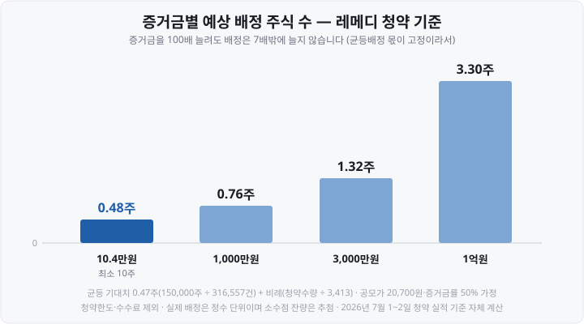
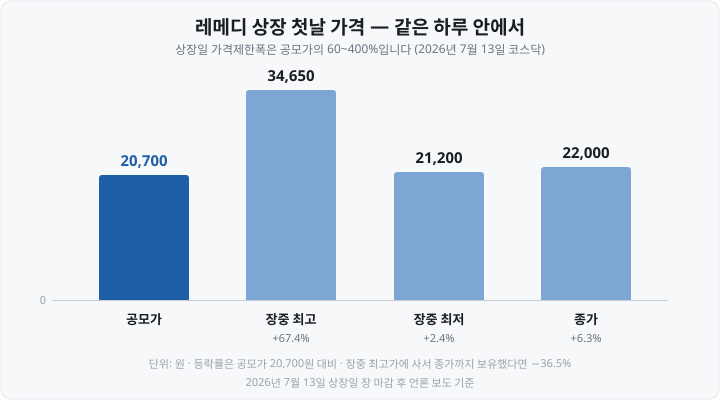
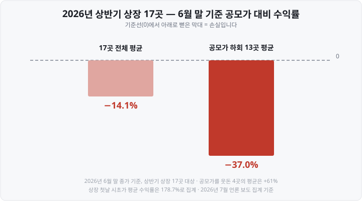

제가 처음 공모주 청약을 알아볼 때 어디선가 이런 말을 들었습니다. <mark>"균등배정이 생겼으니까 10만 원만 넣어도 최소 1주는 준다."</mark> 그 말을 믿고 청약을 넣었다가, 배정 결과 **0주를** 받고 한참 어리둥절했던 기억이 있습니다.

나중에 계산해 보고 알았습니다. 균등배정은 **1주를 보장하는 제도가 아니라 확률을 똑같이 맞춰 주는 제도였습니다.** 이 차이를 모르면 "왜 나만 못 받았지?" 하고 억울해집니다.

오늘은 제가 헤맸던 순서 그대로, 공모주 청약이 실제로 어떻게 굴러가는지 2026년 실제 숫자로 따라가 보겠습니다.

&nbsp;

【🔢 숫자 하나로 시작합니다】

**31만 6,557건.** 2026년 7월 1~2일 진행된 레메디(코스닥) 공모주 청약의 접수 건수입니다.

그리고 이 청약에서 **균등배정으로 나눠 줄 주식은 15만 주였습니다.**

15만 주 ÷ 31만 6,557건 = <mark>0.47주</mark>

주식은 0.47주로 쪼갤 수 없습니다. 그래서 <mark>절반 넘는 사람이 1주도 받지 못했습니다.</mark>

&nbsp;

【💡 공모주가 무엇인지부터】

**IPO**(Initial Public Offering, 기업공개)는 <mark>비상장 기업이 주식을 일반에 팔고 거래소에 상장하는 절차</mark>입니다. 이때 일반 투자자에게 파는 주식이 **공모주**이고, 그 가격이 **공모가**입니다.

기업은 자금을 조달하고, 투자자는 상장 전 정해진 가격으로 먼저 살 기회를 얻습니다.

※ 다만 공모가는 '적정 가치'가 아닙니다. **기관 수요예측 결과로 정해진 가격일** 뿐입니다. 뒤에서 보겠지만 2026년 상반기 상장 종목 상당수는 6월 말 기준으로 공모가를 밑돌았습니다.

&nbsp;

【📋 청약은 6단계로 진행됩니다】

레메디(코스닥, KB증권 주관)의 실제 날짜를 그대로 넣었습니다.

| 단계 | 레메디의 경우 |
| :--- | :--- |
| ① 증권신고서 제출 | 희망밴드 17,800~20,700원 |
| ② 기관 수요예측 | 2026년 6월 17~23일, 2,246개 기관, 1,146.41 : 1 |
| ③ 공모가 확정 | 2026년 6월 26일, 20,700원(최상단) |
| ④ 일반청약 | 2026년 7월 1~2일, KB증권 |
| ⑤ 배정·납입·환불 | 2026년 7월 6일 |
| ⑥ 상장 | 2026년 7월 13일, 코스닥 |

<mark>개인이 손을 대는 구간은 ④번 이틀뿐입니다.</mark> 공모가를 정하는 ②·③번에는 기관만 참여합니다. "공모가가 왜 이렇게 높나"의 답은 대부분 수요예측 결과에 있습니다.

알아 두면 좋은 실무 포인트들입니다.

- **수요예측 기간은 5영업일 이상입니다.** 2023년 7월 모범기준 개정으로 기존 2일에서 늘어났습니다.
- 같은 시점에 **주관사가 기관의 주금납입능력을 확인할 의무**도 생겼습니다. 살 돈 없이 물량만 크게 신청하는 '허수성 청약'을 막는 장치입니다.
- ①번에서 **금융감독원이 정정을 요구하면 일정이 밀립니다.** 2026년에도 그런 사례가 있었습니다.
- 청약 마감부터 상장까지 **열흘 안팎**입니다(레메디는 11일). 이 기간에는 배정받은 주식을 팔 수 없습니다.

&nbsp;

【🧾 개인 몫은 25%입니다】

공모주 전체가 개인에게 오지 않습니다. 금융투자협회 **「증권 인수업무 등에 관한 규정」 제9조**에 정해져 있습니다.

| 배정 대상 | 규정상 비율(기업공개) |
| :--- | :--- |
| 우리사주조합원(직원) | 유가증권시장 20% 배정 / 코스닥·코넥스는 20% 배정 가능 |
| **일반청약자(개인)** | **25% 이상** |
| 고위험고수익투자신탁 | 5% 이상(코스닥 관련 시 10% 이상) |
| 벤처기업투자신탁 | 코스닥 상장 시 25% 이상 |
| 그 밖의 기관투자자 | 남는 물량 |

읽는 순서가 중요합니다. 뒤의 세 줄은 모두 '기관' 안에서 나뉘는 몫입니다. 고위험고수익투자신탁·벤처기업투자신탁은 개인이 청약하는 대상이 아니라, 조건을 갖춘 펀드에 우선권을 주는 제도입니다. 그래서 실제 배정표에는 '기관투자자'로 묶여 나옵니다.

레메디 실제 배정표가 그 모양입니다.

| 구분 | 주식 수 | 비율 |
| :--- | ---: | ---: |
| 기관투자자 | 900,000주 | 75.0% |
| **일반청약자** | **300,000주** | **25.0%** |
| 합계 | 1,200,000주 | 100.0% |

※ 개인 몫 25%는 **최소선입니다.** 유가증권시장에서 우리사주조합 청약이 20%에 미달하면 <mark>공모주식의 5% 이내에서 그 물량이 일반청약자에게 넘어와</mark> 최대 30%까지 늘어납니다.

&nbsp;

【⚖️ 균등배정 — "인원수로 나눈다"의 진짜 의미】

같은 규정 제9조가 이렇게 못 박고 있습니다.

> 일반청약자에게 배정하는 전체 수량의 **50% 이상을** 최소 청약증거금 이상을 납입한 모든 일반청약자에게 **동등한 배정기회를 부여하는 방식**으로 배정하여야 하며 나머지를 청약수량에 비례하여 배정한다

앞부분이 **균등배정**, 뒷부분이 **비례배정**입니다. 균등배정은 2021년에 도입됐습니다. 그전에는 100% 비례배정이라 돈 많이 넣은 사람이 사실상 다 가져갔습니다.

※ **균등배정 1인당 수량** = 균등배정 물량 ÷ 청약 건수

레메디로 계산하면,

- 일반청약자 물량 300,000주 → 균등 **150,000주**, 비례 150,000주
- 청약 건수 **316,557건**
- 150,000 ÷ 316,557 = **0.47주**

몫이 0주이므로 **전원에게 돌아가는 확정 수량은 0주입니다.** 증권사 안내문 표현을 그대로 옮기면 이렇습니다. "청약 접수 건수가 균등 배정 수량을 초과하는 경우 추첨을 통해 배정이 진행되며, 당첨 여부에 따라 1주도 배정받지 못할 수 있습니다."

즉 <mark>균등배정은 '1주 보장'이 아니라 '같은 확률'입니다.</mark> 레메디는 산술적으로 1주 받을 확률이 약 47%였습니다. 반대로 청약 건수가 균등 물량보다 적으면 전원이 1주 이상 받고, 남는 수량은 비례배정으로 넘어갑니다.

여기서 실전 판단 하나가 나옵니다. 균등배정은 액수와 무관하므로 **최소청약수량만 넣어도 확률은 똑같습니다.** 최소청약수량은 종목마다 다르지만 통상 10주 단위이고, 증거금률 50%를 적용하면 레메디는 10주 × 20,700원 × 50% = **103,500원**이 최소 참여 금액이었습니다.

&nbsp;

【💰 비례배정 — 여기서 증거금이 일합니다】

※ **비례배정 수량** = 내 청약수량 × (비례배정 물량 ÷ 전체 청약수량)

레메디 숫자로 계산하면,

- 비례배정 물량 150,000주
- 전체 청약수량 약 **5억 1,200만 주**(경쟁률 약 1,707 : 1)
- 512,000,000 ÷ 150,000 = <mark>약 3,413주를 청약해야 비례로 1주</mark>

3,413주를 청약하려면 얼마가 필요할까요. 여기서 **청약증거금률**이 등장합니다. 대부분의 공모주 청약은 <mark>증거금률 50%</mark>입니다. 청약금액의 절반만 미리 넣으면 됩니다(종목·증권사에 따라 100%인 경우도 있습니다).

- 3,413주 × 20,700원 × 50% = 약 **3,533만 원**

레메디 청약 증거금 총액이 **5조 3,000억 원**으로 집계된 것도 이 계산과 맞습니다. 5억 1,200만 주 × 20,700원 × 50% = 약 5조 2,992억 원이니 보도된 총액과 사실상 일치합니다. 증거금률 50%가 실제로 적용됐다는 뜻입니다.

정리하면 증거금별로 이렇게 갈립니다.

증거금을 **약 100배로** 늘려도 배정은 0.48주에서 3.30주, **약 7배**밖에 늘지 않습니다. 균등배정 몫이 액수와 무관하게 고정돼 있기 때문입니다.

※ 소수점 처리와 잔여 물량 배분은 **증권사 자율 사항입니다.** 어떤 곳은 비례배정 소수점을 0.5 이상이면 올리고 미만이면 버린다고 안내하고, 어떤 곳은 잔여 수량을 추첨으로 돌립니다. 청약 전 해당 증권사 배정 안내문을 확인하세요.

&nbsp;

【🧩 청약 실무에서 걸리는 것들】

**① 계좌는 미리 만들어야 합니다.** 주관사(및 인수단) 증권사 계좌로만 청약할 수 있습니다. 온라인은 청약 마감일까지 개설 가능한 경우가 많지만, 영업점 청약은 시작일 전날까지 요구하는 곳도 있습니다.

**② 중복청약은 금지됩니다.** <mark>여러 증권사에 나눠 넣거나, 한 증권사에서 계좌 여러 개로 넣을 수 없습니다.</mark> 2021년 6월 20일 이후 증권신고서를 최초 제출한 기업공개부터 적용됩니다. 중복으로 넣으면 수량과 무관하게 **가장 먼저 접수된 청약만 유효**하고 나머지는 배정에서 제외됩니다.

**③ 청약한도는 등급에 따라 다릅니다.** 같은 종목이라도 우대 등급에 따라 100%·200%·300%로 갈립니다. 비례배정에는 영향이 있지만 균등배정에는 없습니다.

**④ 청약수수료가 붙습니다.** 증권사·등급·채널별로 다릅니다. 한 증권사는 일반 고객 기준 영업점 5,000원·온라인 2,000원, 상위 등급은 면제로 안내합니다. **1주를 받을지 모르는 청약에 고정비가 먼저 나갑니다.**

**⑤ 환불은 청약 마감일 + 2영업일입니다.** 증거금에서 배정금액과 수수료를 뺀 나머지가 돌아옵니다. 레메디는 7월 2일 마감, 7월 6일 환불이었습니다. 금요일 마감이면 다음 주 화요일입니다. 그 며칠간 증거금은 묶여 있습니다.

&nbsp;

【📈 상장 첫날 — 60%에서 400%까지 열려 있습니다】

배정을 받으면 상장일부터 팔 수 있습니다. 그리고 <mark>상장 첫날의 가격 범위는 다른 날과 완전히 다릅니다.</mark>

- **기준가격 = 공모가.** 별도 시가 결정 절차 없이 공모가가 기준가격이 됩니다.
- **가격제한폭 = 기준가격의 60~400%.** 공모가 1만 원이면 6,000원~4만 원. 2023년 6월 26일 시행된 한국거래소 시행세칙 개정 내용입니다.
- **상장 둘째 날부터는 평상시와 같은 ±30%입니다.**

즉 첫날은 하루에 원금의 40%가 사라질 수도, 4배가 될 수도 있는 구간입니다. 레메디의 첫날이 그 폭을 잘 보여 줍니다.

같은 하루 안에서 **공모가 대비 +67.4%였던 가격이 +6.3%로** 내려앉았습니다. 청약으로 받은 사람은 종가 기준 6.3%를 남겼습니다. 반면 <mark>장중 최고가에 사서 종가까지 들고 있었다면 −36.5%</mark>입니다.

흐름은 다음 날에도 이어졌습니다. 상장 이틀째인 7월 14일 오후 2시 48분 레메디는 전 거래일보다 3,780원(**17.18%**) 내린 **18,220원에** 거래됐습니다. <mark>공모가 20,700원 아래로 내려간 것입니다.</mark>

&nbsp;

【⚠️ '공모주는 안전하다'는 말은 데이터와 맞지 않습니다】

균등배정 도입 이후 "소액으로 안전하게 1주 받는 재테크"라는 인식이 퍼졌습니다. 2026년 상반기 데이터는 다른 그림입니다.

- 상반기 상장 **17곳**(전년 동기 대비 −55.3%)
- 공모금액 **1조 1,000억 원**(−48.7%)
- 코스피는 케이뱅크 1곳(4,980억 원), 나머지 16곳은 코스닥
- 상장 첫날 시초가 기준 평균 수익률은 **178.7%로** 집계
- 그런데 **6월 말까지 보유했다면 공모가 대비 평균 −14.1%**

17곳 중 **13곳이 공모가를 밑돌았고, 그 13곳 평균은 −37%였습니다.** 공모가를 웃돈 4곳의 평균은 +61%입니다.

첫날 시초가가 높게 형성되는 것과, 그 가격이 유지되는 것은 **완전히 다른 이야기**입니다.

&nbsp;

【📌 정리】

- **IPO 절차는** 증권신고서 → 기관 수요예측(5영업일 이상) → 공모가 확정 → 일반청약 → 배정·환불 → 상장의 **6단계**입니다. 개인 참여 구간은 청약 이틀뿐입니다.
- 공모주 중 **일반청약자 몫은 25% 이상**, 우리사주 미달분이 넘어오면 최대 30%입니다.
- 개인 몫의 **50% 이상은 균등배정**, 나머지는 비례배정입니다.
- **균등배정은 1주 보장이 아닙니다.** 레메디는 0.47주(약 47% 확률)였습니다.
- **비례배정은** 청약수량에 비례합니다. 레메디는 약 3,413주(증거금 약 3,533만 원)당 1주, 증거금률은 **통상 50%입니다.**
- **중복청약 금지**, 먼저 접수된 청약만 유효. 환불은 청약 마감일 + 2영업일.
- 상장 첫날 가격제한폭은 **공모가의 60~400%**, 둘째 날부터 ±30%입니다.
- 2026년 상반기 상장 17곳은 6월 말 기준 **평균 −14.1%였습니다.** "손실 없는 재테크"라는 전제는 데이터로 지지되지 않습니다.

&nbsp;

【🔗 함께 보면 좋은 글】

- [연금저축·IRP·ISA — 세금 아끼며 ETF 투자하는 절세 계좌 3종](https://blog.naver.com/hdglace/224357252306)
- [ADR이란 무엇인가 — 한국 주식이 미국에서 거래되는 법](https://blog.naver.com/hdglace/224360141124)
- [ETF란 무엇인가 — 주식도 펀드도 아닌, 초보에게 가장 쉬운 시작](https://blog.naver.com/hdglace/224350308437)

&nbsp;

【📊 데이터 출처 및 기준일】

- 배정 비율(우리사주조합원 유가증권시장 20%·코스닥 20% 배정 가능, 일반청약자 25% 이상, 고위험고수익투자신탁 5% 이상·코스닥 관련 10% 이상, 벤처기업투자신탁 코스닥 25% 이상, 우리사주 미달 시 공모주식 5% 이내 일반청약자 전환, 일반청약자 물량의 50% 이상 균등방식) : **금융투자협회 「증권 인수업무 등에 관한 규정」 제9조, 2026년 7월 확인 기준.** 시장·종목 요건에 따라 적용이 달라질 수 있습니다.
- 레메디 공모 개요(공모주식 1,200,000주, 기관 900,000주 75.0%·일반청약자 300,000주 25.0%, 균등 150,000주·비례 150,000주, 희망밴드 17,800~20,700원, 확정 공모가 20,700원, 주관사 KB증권, 기관 의무보유확약 77.5%) : 2026년 6~7월 공모 공시 및 IPO 정보 사이트 집계.
- 레메디 일정(수요예측 6월 17~23일, 공모가 확정 6월 26일, 청약 7월 1~2일, 납입·환불 7월 6일, 상장 7월 13일) : 2026년 6~7월 언론 보도 및 공모 공시.
- 레메디 청약 결과(경쟁률 약 1,707 : 1, 신청 약 5억 1,200만 주, 청약 건수 316,557건, 증거금 5조 3,000억 원, 수요예측 2,246개 기관·1,146.41 : 1) : 2026년 7월 2일 청약 마감 시점 보도 및 수요예측 결과 보도.
- 증거금별 예상 배정 주식 수(0.48 / 0.76 / 1.32 / 3.30주) : 위 청약 실적을 근거로 한 **자체 계산.** 균등 기대치 150,000 ÷ 316,557 = 0.47주, 비례 512,000,000 ÷ 150,000 = 약 3,413주당 1주, 공모가 20,700원·증거금률 50% 가정. 청약한도·수수료·소수점 처리 미반영. 실제 배정은 증권사 방식에 따라 달라집니다.
- 레메디 상장 첫날(2026년 7월 13일) 공모가 20,700원·장중 최고 34,650원·장중 최저 21,200원·종가 22,000원(+6.28%) : 2026년 7월 13일 상장일 보도 및 7월 14일 종가 확인 보도 교차확인. 등락률은 공모가 대비로 환산했습니다. 시초가·장중 고저는 보도 시점에 따라 다르게 집계된 기사가 있어 장 마감 후 확인된 값만 실었습니다.
- 레메디 상장 이틀째(2026년 7월 14일 오후 2시 48분 기준) 18,220원·−3,780원(−17.18%) : 2026년 7월 14일 언론 보도. **장중 시점 수치이며 그날 종가가 아닙니다.**
- 청약증거금률 통상 50%(종목·증권사에 따라 100% 등 상이), 최소청약수량 통상 10주 단위, 청약수수료(예: 일반 영업점 5,000원·온라인 2,000원, 상위 등급 면제), 청약한도 100%·200%·300%, 환불일 = 청약 마감일 + 2영업일, 균등배정 초과 시 추첨·1주 미배정 가능, 소수점·잔여 물량 처리는 증권사 자율 : 2026년 7월 각 증권사 공모주 청약 안내 페이지 교차확인.
- 중복청약 금지(2021년 6월 20일 이후 증권신고서 최초 제출분부터, 먼저 접수된 청약만 유효) : 자본시장법 시행령 개정 및 2021년 6월 금융위원회 보도자료, 증권사 안내 교차확인.
- 수요예측 기간 5영업일 이상, 주관사의 기관 주금납입능력 확인 의무화, 의무보유확약 우선배정 : 2023년 4월 26일 금융위원회 보도자료 및 대표주관업무 등 모범기준 개정(2023년 7월 적용).
- 상장 첫날 기준가격 = 공모가, 가격제한폭 60~400%, 둘째 날부터 ±30% : 한국거래소 유가증권·코스닥시장 업무규정 시행세칙 개정, **2023년 6월 26일 시행.** 2026년 7월 현재 적용 중임을 상장 사례로 확인했습니다.
- 2026년 상반기 IPO 시장(상장 17곳 −55.3%, 공모금액 1조 1,000억 원 −48.7%, 코스피 케이뱅크 1곳 4,980억 원, 코스닥 16곳 6,348억 원, 첫날 시초가 평균 수익률 178.7%, 6월 말 기준 공모가 대비 평균 −14.1%, 공모가 하회 13곳 −37%, 상회 4곳 +61%) : 2026년 7월 언론 보도 집계, **2026년 6월 말 종가 기준.**
- 금융감독원 정정요구에 따른 청약 일정 지연 사례 : 2026년 6월 언론 보도.

&nbsp;

※ 본 글은 공개된 규정·공시·시장 데이터를 정리한 정보성 콘텐츠이며, 특정 공모주·종목·증권사의 매매나 청약을 권유하거나 우열을 판단하지 않습니다. 수치는 위에 밝힌 기준 시점의 값이며 이후 변동될 수 있습니다. 배정 비율·증거금률·청약한도·수수료·소수점 처리는 종목과 증권사에 따라 다르고 제도도 개정될 수 있으니, 청약 전 해당 종목의 증권신고서·투자설명서와 거래 증권사 안내를 확인하세요. 모든 투자 판단과 책임은 투자자 본인에게 있습니다.

&nbsp;

#공모주청약 #균등배정 #비례배정 #청약증거금 #공모주배정비율 #IPO #공모주 #중복청약금지 #상장첫날 #주식초보 #투자공부 #재테크
