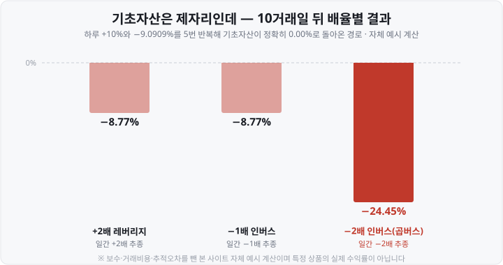
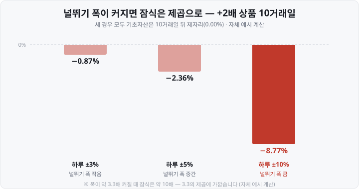
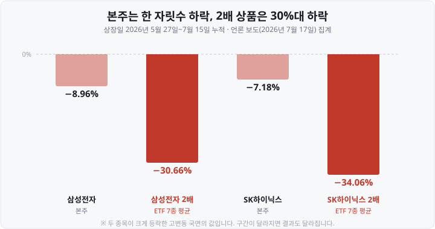

저는 예전에 2배 상품을 사 두고 "본주가 오르기만 하면 두 배로 벌겠지"라고 편하게 생각했습니다. 그런데 한 달 뒤 본주는 분명히 올랐는데 제 계좌는 거의 그대로였습니다. 처음엔 <mark>제가 뭘 잘못 산 줄 알았는데</mark>, 알고 보니 상품 설계대로 나온 결과였습니다.

실제 숫자로 그대로 재현된 사례가 있습니다. 2026년 5월 29일 종가부터 6월 30일 종가까지 한 달간 삼성전자 주가는 **5.36%** 올랐습니다. 하루 등락을 2배로 따라간다면 단순 계산으로 10%대가 나와야 하는 구간이죠. 그런데 같은 기간, 삼성전자의 하루 등락을 2배로 따라간다는 단일종목 레버리지 **ETF**(Exchange Traded Fund, 상장지수펀드) 6종의 수익률은 이랬습니다.

<mark>+0.53% / +0.40% / +0.04% / −0.07% / −0.55% / −0.72%</mark>

본주가 5% 넘게 올랐는데 2배 상품은 제자리걸음이거나 마이너스였습니다. 오늘은 그 범인인 <mark>음의 복리(변동성 잠식)</mark>를 직접 계산해 보겠습니다.

말이 어려우니 뜻부터 풀어 두겠습니다. **잠식**(蠶食)은 누에가 뽕잎을 갉아먹는다는 뜻입니다. 한 번에 크게 베어 무는 게 아니라 가장자리부터 야금야금 사라지는 모양이죠. 여기서 잠식은 <mark>기초자산은 제자리로 돌아왔는데 내 돈만 야금야금 줄어 있는 상태</mark>를 가리킵니다. 아래에서 "깎인다", "갉아먹힌다"고 쓰는 것도 전부 같은 뜻입니다.

특정 상품을 권하거나 말리는 이야기는 하지 않습니다. 본문의 상품명과 수치는 구조를 설명하기 위한 사례입니다.

&nbsp;

【① 이틀만 계산해도 보입니다】

가장 단순한 예부터 보겠습니다. **기초자산**(그 상품이 따라가기로 한 대상 — 여기선 삼성전자 주식이나 코스피200 같은 것)이 첫날 **+10%** 오르고, 다음 날 **−9.0909%** 내렸다고 합시다.

하필 −9.0909%라는 어중간한 숫자를 고른 데는 이유가 있습니다. 100원짜리가 10% 올라 110원이 됐다면, 다시 100원으로 돌아오는 데 필요한 하락률은 10%가 아니라 9.0909%예요. 오르고 난 뒤라 <mark>깎아야 할 기준 금액이 110원으로 커져 있기</mark> 때문이죠. 그러니까 이 이틀은 기초자산이 올랐다가 정확히 제자리로 돌아오는 왕복입니다.

| 구분 | 1일차 | 2일차 | 이틀 뒤 |
| :--- | :--- | :--- | :--- |
| 기초자산 | +10% | −9.0909% | **0.00%** |
| +2배 상품 | +20% | −18.1818% | **−1.82%** |
| −2배 상품 | −20% | +18.1818% | **−5.45%** |

직접 곱해 보면 2배 상품은 1.20 × 0.818182 = 0.981818, 원금의 98.18%입니다. −2배 상품은 0.80 × 1.181818 = 0.945455고요.

기초자산은 하나도 안 움직였는데 둘 다 잃었습니다. 이유는 하나입니다. <mark>하락률은 커진 금액에, 상승률은 작아진 금액에 적용되기 때문</mark>입니다. 2배 상품은 첫날 20% 벌어 120이 됐는데 둘째 날 −18.18%가 그 **커진 120에** 걸립니다. −2배 상품은 첫날 20% 잃어 80이 됐는데 +18.18%가 그 **줄어든 80에** 걸리고요.

&nbsp;

【② 10거래일 반복하면 이렇게 됩니다】

이틀에 1.82%면 별것 아닌 것 같습니다. 문제는 이게 한 번으로 끝나지 않는다는 데 있습니다. 같은 널뛰기(+10% → −9.0909%)를 다섯 번, 그러니까 10거래일 반복해 보겠습니다. 기초자산은 열흘 내내 오르내리기만 하다가 정확히 제자리로 돌아옵니다.

기초자산 0.00%인데 <mark>2배는 −8.77%, 곱버스는 −24.46%</mark>입니다. 열흘 만에 곱버스는 원금의 4분의 1 가까이가 사라졌습니다.

어쩌다 이렇게 됐는지, 열흘을 하루씩 따라가 보겠습니다. 넷 다 **100만원**으로 시작합니다.

| 거래일 | 기초자산 등락 | 기초자산 | +2배 | −1배 | −2배 |
| :--- | :--- | :--- | :--- | :--- | :--- |
| 시작 | — | 100.00 | 100.00 | 100.00 | 100.00 |
| 1일 | +10% | 110.00 | 120.00 | 90.00 | 80.00 |
| 2일 | −9.09% | **100.00** | 98.18 | 98.18 | 94.55 |
| 3일 | +10% | 110.00 | 117.82 | 88.36 | 75.64 |
| 4일 | −9.09% | **100.00** | 96.40 | 96.40 | 89.39 |
| 5일 | +10% | 110.00 | 115.68 | 86.76 | 71.51 |
| 6일 | −9.09% | **100.00** | 94.64 | 94.64 | 84.51 |
| 7일 | +10% | 110.00 | 113.57 | 85.18 | 67.61 |
| 8일 | −9.09% | **100.00** | 92.92 | 92.92 | 79.90 |
| 9일 | +10% | 110.00 | 111.51 | 83.63 | 63.92 |
| 10일 | −9.09% | **100.00** | 91.23 | 91.23 | 75.54 |

(단위: 만원 · 보수·거래비용·추적오차를 뺀 자체 예시 계산)

짝수 날 칸만 세로로 훑어보면 무슨 일이 벌어졌는지 한눈에 들어옵니다. 기초자산은 <mark>2·4·6·8·10일 모두 정확히 100만원</mark>으로 돌아옵니다. 다섯 번을 왕복했는데 제자리인 거죠. 그런데 같은 칸에서 +2배는 98.18 → 96.40 → 94.64 → 92.92 → 91.23으로 <mark>왕복할 때마다 한 계단씩 내려앉습니다.</mark> 곱버스는 94.55에서 75.54까지 훨씬 가파르게 내려가고요.

돌아올 때마다 조금씩 낮은 자리에서 다시 시작하는 것, 이게 앞에서 말한 갉아먹힘입니다.

처음 보면 고개를 갸웃하게 되는 결과가 둘 나옵니다. 하나씩 풀어 보겠습니다.

▶ **① 방향이 정반대인 두 상품이 똑같이 깎였습니다.** +2배는 기초자산이 오르면 버는 상품이고, −1배는 내리면 버는 상품입니다. 정반대에 걸어 둔 셈인데 열흘 뒤 결과가 −8.77%로 똑같습니다. 위 표에서도 짝수 날마다 두 숫자가 소수점까지 붙어 다니죠.

왜 그런지는 1일과 2일만 떼어 놓고 보면 보입니다.

| | 1일차 (기초자산 +10%) | 2일차 (기초자산 −9.09%) | 이틀 뒤 |
| :--- | :--- | :--- | :--- |
| +2배 상품 | +20% 벌어 **120만원** | 그 120만원이 −18.18% | 98.18만원 |
| −1배 상품 | −10% 잃어 **90만원** | 그 90만원이 +9.09% | 98.18만원 |

+2배는 <mark>불어난 120만원에 큰 하락을 맞았고</mark>, −1배는 <mark>쪼그라든 90만원으로 작은 상승을 받았습니다.</mark> 겪는 모양은 정반대인데, 한쪽은 큰 돈에서 많이 잃고 다른 쪽은 작은 돈에서 조금밖에 못 벌어 남는 액수가 98.18만원으로 같아집니다.

그러니까 <mark>깎이는 크기를 정하는 건 상품의 방향이 아닙니다.</mark> 오르는 쪽에 걸었든 내리는 쪽에 걸었든 상관없고, 배율이 얼마나 센가와 기초자산이 얼마나 출렁이는가가 정합니다. "인버스는 하락에 거는 반대편이니 레버리지보다는 안전하겠지"라는 짐작이 통하지 않는 이유죠.

▶ **② 배율을 2배로 키우면 손실은 2배가 아니라 3배 가까이 됩니다.** 방향은 그대로 두고 −1배를 −2배로 바꾸면 깎인 몫이 8.77%에서 24.46%가 됩니다. 배율은 딱 두 배인데 <mark>깎인 몫은 2.8배</mark>죠.

배율을 키우면 매일 겪는 등락폭 자체가 커지기 때문입니다. −1배가 하루 10% 오르내릴 때 −2배는 20%를 오르내리고, 폭이 커지면 앞에서 본 "큰 돈에는 뺄셈, 작은 돈에는 덧셈"이 매일 더 세게 걸립니다. 그래서 <mark>배율은 더한 만큼 늘지만, 깎이는 몫은 그보다 빠르게 늘어납니다.</mark>

&nbsp;

【③ 널뛰기가 심해지면 훨씬 더 깎입니다】

깎이는 크기를 정하는 나머지 한 축은 널뛰기의 폭, 즉 **변동성**입니다. 폭만 바꿔 같은 계산을 돌려 봤습니다. 세 경우 모두 기초자산은 10거래일 뒤 제자리(0%)입니다.

널뛰기 폭이 3%에서 10%로 **약 3.3배** 커지는 동안 깎인 몫은 0.87%에서 8.77%로 <mark>약 10배</mark>가 됐습니다. 폭은 3.3배인데 손실은 3.3배가 아니라, 3.3을 **두 번 곱한 만큼**(3.3 × 3.3 ≈ 11) 커진 셈이죠.

같은 2배 상품이라도 <mark>기초자산이 얼마나 출렁이느냐에 따라 깎이는 크기가 완전히 달라진다</mark>는 뜻입니다.

&nbsp;

【④ 다만, 잠식이 항상 손해는 아닙니다】

여기까지만 보면 "레버리지는 무조건 새는 상품"으로 읽히기 쉬운데, 절반만 맞습니다. 이 구조는 **경로 의존적**입니다. 출발점과 도착점이 같아도 <mark>그 사이를 어떤 길로 지나왔느냐</mark>에 따라 결과가 달라진다는 뜻이죠. 오르내림이 반복되면 갉아먹지만, 한 방향으로 꾸준히 가면 오히려 단순 배율보다 더 벌어 줍니다.

같은 10거래일을 세 경로로 계산해 비교했습니다.

| 10거래일 경로 | 기초자산 | +2배 상품 | (참고) 기초×2 | −2배 상품 |
| :--- | :--- | :--- | :--- | :--- |
| 꾸준한 상승(매일 +2%) | +21.90% | **+48.02%** | +43.80% | −33.52% |
| 꾸준한 하락(매일 −2%) | −18.29% | −33.52% | −36.59% | **+48.02%** |
| 널뛰기(+10%/−9.09%) | 0.00% | **−8.77%** | 0.00% | **−24.46%** |

꾸준한 상승 경로에서 2배 상품은 +48.02%로 단순 2배(43.80%)를 4%p 넘겼습니다. 이익 위에 이익이 쌓이는 **양의 복리**죠. 심지어 꾸준한 하락 경로에서는 2배 상품의 손실(−33.52%)이 단순 2배(−36.59%)보다 **작습니다.** 손실이 나면 **익스포저**(exposure, 가격 변동에 실제로 노출된 금액)도 함께 줄어, 다음 날 얻어맞는 금액이 작아지거든요.

정확한 표현은 이겁니다. <mark>방향이 맞으면 배율보다 더 주고, 방향이 자주 바뀌면 배율보다 덜 준다.</mark> 문제는 현실의 주가가 한 방향으로만 가는 일이 드물다는 데 있습니다.

&nbsp;

【⑤ 회복에 필요한 상승률은 손실률보다 큽니다】

잠식이 특히 아픈 이유는 손실과 회복이 대칭이 아니어서입니다. 100에서 30을 잃으면 70이 되고, 이 70이 100으로 돌아오려면 30이 아니라 <mark>약 43%가 필요합니다.</mark>

| 현재 손실률 | 원금 회복에 필요한 상승률 |
| :--- | :--- |
| −10% | +11.1% |
| −25% | +33.3% |
| −50% | +100.0% |
| −60% | +150.0% |

앞의 곱버스 예(−24.46%)는 원금 회복에 약 **32%의** 상승이 필요합니다. 잠식이 깊어질수록 회복 조건은 가팔라지고, 그동안에도 널뛰기는 계속 잠식을 만듭니다.

&nbsp;

【⑥ 실제 상품에서는 얼마나 벌어졌나】

여기까지는 가정을 세워 만든 숫자였습니다. 그럼 실제 시장에서도 같은 일이 벌어졌을까요. 2026년 5월 27일 국내에 처음 상장된 단일종목 레버리지 상품들이 이 구조를 그대로 보여 줬습니다.

먼저 **하루 단위로는 배율이 잘 맞습니다.** 2026년 7월 28일 SK하이닉스가 하루 만에 14.65% 급락했습니다. 딱 2배라면 −29.30%가 나와야 하는 날이죠. 실제로 그날 KODEX SK하이닉스단일종목레버리지는 −28.43%, TIGER SK하이닉스단일종목레버리지는 −28.11%였습니다(종가 기준). <mark>배율은 하루짜리 약속이고, 그 약속은 지켜집니다.</mark>

어긋나기 시작하는 건 기간을 늘릴 때입니다.

**본주**(本株, 2배 상품이 따라가는 원래 주식)는 한 자릿수 하락인데 2배 상품은 30%대 하락입니다. 2배 상품이니 본주 손실의 2배쯤이어야 할 텐데, 삼성전자는 <mark>약 3.4배</mark>, SK하이닉스는 <mark>약 4.7배</mark>였습니다. 그 사이에 하루 −9%대 급락과 급반등이 오간 널뛰기 구간이 끼어 있었기 때문입니다.

기간별로 나란히 놓으면 흐름이 보입니다.

| 기간 | 기초자산 | 2배 상품 | 배율이 지켜졌나 |
| :--- | :--- | :--- | :--- |
| 하루(2026-07-28) | SK하이닉스 −14.65% | −28.43%·−28.11% | 거의 정확히 2배 |
| 한 달(05-29~06-30) | 삼성전자 +5.36% | −0.72% ~ +0.53% | 2배는커녕 0배 |
| 50일(05-27~07-15) | 삼성전자 −8.96% | 평균 −30.66% | 손실만 3.4배 |

금융위원회와 금융감독원도 2026년 5월 26일 「단일종목 레버리지 상품 투자시 유의사항 안내」에서 같은 경고를 했습니다. 미국의 한 종목이 1년간 **18%** 올랐는데 그 종목의 2배 상품은 <mark>−20%를 기록한 사례</mark>를 들며, "주가가 오르고 내리기를 반복하는 과정에서 투자금이 잠식되는 음의 복리효과 등으로 **장기투자에 부적합하다**"고 명시했습니다.

&nbsp;

【⑦ 인버스가 오래 버티면 이중으로 깎입니다】

인버스에는 잠식 말고 하나가 더 있습니다. 주식시장 지수는 장기적으로 우상향해 온 경우가 많은데, 인버스는 그 <mark>방향 자체를 반대로 타는</mark> 상품이라는 점이죠. ① 지수 상승에 따른 방향 손실 + ② 널뛰기에 따른 잠식이 겹칩니다.

코스피200 선물지수의 일간 −2배를 추종하는 국내 한 상품(2016년 9월 22일 상장)의 **2026년 8월 14일 기준** 수익률입니다.

| 기간 | −2배 상품 수익률 |
| :--- | :--- |
| 최근 1개월 | −24.50% |
| 최근 6개월 | −75.20% |
| 최근 1년 | −93.75% |
| 상장 이후(약 10년) | **−99.20%** |

같은 날 기준 코스피200 지수의 최근 1년 등락률은 <mark>+151.55%</mark>였습니다. 지수가 이만큼 오르는 국면에서 −2배 상품은 방향만으로도 큰 손실인데, 그 위에 잠식이 얹혀 −93.75%가 된 셈입니다.

구조 하나만 덧붙입니다. 이 상품이 −99.20%까지 내려왔는데도 **0원이 되지 않는** 이유는 매일 배율을 다시 맞추기 때문입니다. 남은 돈이 100만원이든 1만원이든, 재조정 뒤에는 늘 "지금 남은 돈의 2배"에서 새로 출발합니다. 100의 절반은 50, 50의 절반은 25… 하는 식으로 <mark>계속 줄어들되 0에는 닿지 않습니다.</mark>

다만 예외가 하나 있습니다. −2배 상품은 기초자산이 **하루 만에 50% 넘게 오르면** 이론상 순자산 전부를 잃습니다. 50%의 2배가 100%니까요. 국내 주식엔 하루 등락을 ±30%로 묶는 **가격제한폭**(하루에 오르내릴 수 있는 한도)이 있어 국내 기초자산 상품에서 이 상황이 오긴 어렵지만, 가격제한폭이 없는 해외 기초자산 상품엔 이 안전판이 없습니다.

&nbsp;

【⑧ 단일종목이 지수형보다 위험한 진짜 이유】

앞에서 널뛰기 폭이 커지면 깎이는 몫은 **그 폭을 두 번 곱한 만큼** 커진다고 했습니다. 이 한 줄이 왜 단일종목 레버리지가 지수형보다 위험하다고 하는지를 설명합니다. 지수는 수백 종목의 등락이 섞여 서로 상쇄되지만, 개별 종목에는 그 상쇄가 없거든요.

숫자로 확인해 보겠습니다. 아래는 **변동성**(가격이 얼마나 출렁였는지를 나타내는 값 — 하루 등락폭을 1년치로 환산해 %로 적습니다)을 국내 종목과 국내 지수에 대해 같은 기간·같은 방법으로 계산한 결과입니다.

| 구간 | SK하이닉스 | 삼성전자 | 코스피200 |
| :--- | :--- | :--- | :--- |
| 상장 직전 1개월(4/27~5/26) | 88.7% | 76.7% | <mark>58.4%</mark> |
| 상장 이후(5/27~6/26) | 114.8% | 100.6% | <mark>80.6%</mark> |

(일간 등락률의 표준편차를 1년 기준으로 환산한 자체 계산 · 종가 시세 기준)

두 구간 모두 <mark>종목 하나가 200개 종목을 묶은 지수보다 훨씬 크게 출렁였습니다.</mark> 상장 이후 구간에서 SK하이닉스는 코스피200의 약 1.4배인데, 앞의 규칙대로 1.4를 두 번 곱하면 <mark>깎이는 몫은 약 2배</mark>가 됩니다. 같은 2배 배율에 같은 기간을 들고 있어도 단일종목 쪽이 구조적으로 더 깎인다는 뜻이죠.

다만 이 표를 "지수는 잔잔하다"로 읽으면 곤란합니다. **이 시기엔 지수도 대단히 험했습니다.** 코스피200은 상장 이후 22거래일 가운데 15일이 하루 2% 넘게 움직였고, 하루 −10.53%와 +9.01%가 오간 날도 있었습니다. <mark>지수형 레버리지도 이런 국면에서는 똑같이 깎입니다.</mark> 단일종목이 더 심할 뿐이에요.

그럼 단일종목 상품이 생겨서 변동성이 올라간 걸까요. 그렇게 단정하긴 어렵습니다. 자본시장연구원은 2026년 6월 29일 자 자본시장포커스에서 같은 기간 **마이크론의 변동성이 85%에서 126%로** 올랐다는 점을 짚었습니다. 국내 상품과 아무 상관이 없는 미국 반도체 종목에서 오히려 상승 폭이 더 컸다는 뜻이죠. 연구원은 단일종목 ETF의 재조정 거래가 일부 영향을 줬을 수는 있어도, 거시환경 불확실성 등 여러 요인이 겹친 결과로 봤습니다.

&nbsp;

【⑨ 정리】

▶ **음의 복리(변동성 잠식)는** 일간 배율을 유지하려고 매일 재조정하는 데서 나옵니다. 큰 금액엔 하락률이, 작아진 금액엔 상승률이 걸려 <mark>기초자산이 제자리로 돌아와도 배율 상품은 원금을 밑돕니다.</mark>

▶ **널뛰기 10거래일 자체 계산**에서 기초자산 0.00%일 때 +2배 −8.77%, −1배 −8.77%, −2배 −24.46%. 오르는 쪽에 걸었든 내리는 쪽에 걸었든 상관없이, 배율이 얼마나 센가와 얼마나 출렁이는가가 깎이는 크기를 정합니다.

▶ **널뛰기가 심해지면 훨씬 더 깎입니다.** 폭 ±3%→±10%(3.3배)일 때 깎인 몫은 0.87%→8.77%(약 10배). 3.3배가 아니라 3.3을 두 번 곱한 만큼입니다.

▶ **경로 의존적입니다.** 한 방향 추세 구간에서는 2배 상품이 단순 2배를 넘기도 합니다(자체 계산 +48.02% 대 +43.80%). 손해가 되는 건 방향이 자주 바뀔 때입니다.

▶ **실제 상품도 그대로.** 하루짜리는 거의 정확히 2배였지만, 한 달간 삼성전자가 5.36% 오르는 동안(단순 2배라면 +10%대) 2배 상품 6종은 −0.72%~+0.53%, 50일 누적으로는 본주 −8.96%에 2배 상품 평균 −30.66%였습니다.

▶ **인버스는 이중 구조.** 코스피200 선물지수 −2배 상품 한 종의 상장 이후(약 10년) 수익률은 2026년 8월 14일 기준 −99.20%였습니다.

▶ **단일종목은 지수보다 더 출렁여서 그만큼 더 깎입니다.** 상장 이후 한 달간 변동성은 SK하이닉스 114.8%, 코스피200 80.6%(자체 계산)로 약 1.4배 차이였고, 깎이는 몫으로는 <mark>약 2배</mark> 차이가 납니다. 다만 같은 기간 지수 자체도 매우 험했다는 점은 함께 봐야 합니다. 금융위원회·금융감독원도 음의 복리효과를 들어 <mark>장기투자에 부적합</mark>하다고 안내했습니다.

&nbsp;

【함께 보면 좋은 글】

▶ [단일종목 레버리지 ETF 원리 — 2배·인버스는 어떻게 만들어지나](https://blog.naver.com/hdglace/224379450793) — 오늘 글의 앞 편입니다. 배율이 선물·스왑으로 어떻게 만들어지고 왜 매일 재조정하는지 다룹니다.

▶ [괴리율이란 무엇인가 — ETF·ADR 가격이 '진짜 값'과 다른 이유](https://blog.naver.com/hdglace/224351030720) — 시장가격이 실제 가치와 벌어지는 문제를 따로 정리했습니다.

▶ [ETF 총보수와 세금 — 실제로 내 수익에서 얼마가 빠지나](https://blog.naver.com/hdglace/224367512124) — 오늘 계산한 숫자에 더해지는 비용 이야기입니다.

&nbsp;

【다음 편 예고】

다음 글은 **공매도·사이드카·서킷브레이커의 차이**입니다. 급락장에 등장하는 이 세 단어가 각각 무엇을 뜻하는지, 공매도는 어떤 절차로 이뤄지고 2026년 현재 제도는 어떤 상태인지, 사이드카와 서킷브레이커의 발동 요건은 한국거래소 규정상 어떻게 다른지 수치로 정리하겠습니다.

&nbsp;

【📊 데이터 출처 및 기준일】

| 항목 | 수치 | 출처·기준일 |
| :--- | :--- | :--- |
| 한 달 비교 | 삼성전자 +5.36%(317,000→334,000원), 레버리지 ETF 6종 +0.53%·+0.40%·+0.04%·−0.07%·−0.55%·−0.72% (2026-05-29~06-30 종가 기준). SK하이닉스 +13.59%(2,333,000→2,650,000원), KODEX +15.42%·1Q +6.91% | ETF 수익률은 언론 보도 2026-07-03, 기초종목 등락률은 종가 기준 자체 계산(원 보도의 +11.52%·+15.77%은 5월 28일 종가 기준이라 ETF와 기준일을 맞춰 재계산) |
| 50일 비교 | 삼성전자 −8.96%·레버리지 7종 평균 −30.66%, SK하이닉스 −7.18%·평균 −34.06% (2026-05-27~07-15) | 언론 보도 2026-07-17 |
| 하루 비교 | 2026-07-28 SK하이닉스 −14.65%, KODEX −28.43%·TIGER −28.11% | 종가 시세 기준 자체 계산 |
| 당국 경고 | 음의 복리효과로 장기투자 부적합. 미국 한 종목 1년 +18%일 때 2배 상품 −20% 사례 | 금융위원회·금융감독원 보도자료 2026-05-26 |
| −2배 상품 장기 | 1개월 −24.50%, 6개월 −75.20%, 1년 −93.75%, 상장 이후 −99.20% (2016-09-22 상장) | FunETF·운용사 공식 상품 페이지, 2026-08-14 기준(기준가격) |
| 코스피200 | 종가 1,098.18, 최근 1년 +151.55% | 지수 시세 정보, 2026-08-14 기준 |
| 국내 변동성 비교 | 상장 직전 1개월(04-27~05-26) SK하이닉스 88.7%·삼성전자 76.7%·코스피200 58.4% / 상장 이후(05-27~06-26) 114.8%·100.6%·80.6%. 같은 구간 코스피200은 22거래일 중 15일 ±2% 이상, 최대 +9.01%·최대 −10.53% | 종가 시세 기준 자체 계산(일간 등락률 표준편차의 연율화) |
| 변동성 상승 원인 | 마이크론 85%→126%. 단일종목 ETF만의 영향으로 보기 어렵고 복합 요인 | 자본시장연구원 자본시장포커스 2026-13호, 2026-06-29 |

**자체 계산 안내** — 이틀·10거래일 경로별 수치(−1.82%·−5.45%·−8.77%·−24.46%·−0.87%·−2.36%·+48.02%·−33.52% 등)와 회복에 필요한 상승률 표는 목표배율이 매일 정확히 유지되고 보수·거래비용·추적오차가 없다고 가정한 **본 사이트 자체 예시 계산**이며 특정 상품의 실제 수익률이 아닙니다.

&nbsp;

⚠️ **면책 안내** — 이 글은 공개된 규정·보도자료·상품 공시와 언론 보도를 정리한 **교육·정보 제공 목적**의 자료이며, 특정 상품의 매수·매도를 권유하거나 상품 간 우열을 판단하지 않습니다. 본문의 상품명과 수익률은 구조 설명을 위한 사례이고 유사한 상품이 다수 있습니다. 인용한 수익률은 모두 밝혀 둔 특정 구간의 값이며, 구간이 달라지면 결과도 달라집니다. 레버리지·인버스 상품은 구조적으로 장기 보유 시 기초자산 성과와 크게 달라질 수 있는 고위험 상품입니다. 수익률·변동성·제도 세부 사항은 시점에 따라 변하니 투자 전 최신 공시와 증권사 안내를 확인하시기 바랍니다. 투자 판단과 그 결과에 대한 책임은 투자자 본인에게 있습니다.

&nbsp;

#레버리지ETF #음의복리 #변동성잠식 #곱버스 #인버스ETF #단일종목레버리지 #일일리밸런싱 #ETF투자 #주식초보 #투자공부
