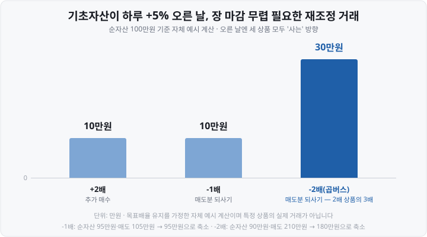
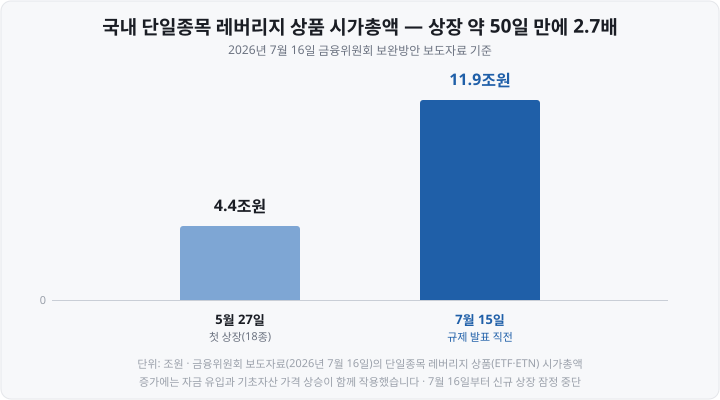

저는 **곱버스**라는 별명을 상품 이름보다 먼저 배웠습니다. 지수가 떨어지면 두 배로 벌어 준다길래, 하락장 보험 같은 거라고 편하게 생각했죠. 그런데 이 상품들이 <mark>매일 장 마감 무렵 조용히 무엇을 하는지</mark> 알고 나서 생각이 완전히 달라졌습니다.

마침 2026년 여름, 국내 증시에서 가장 뜨거웠던 상품이 바로 이 계열입니다. **ETF**(Exchange Traded Fund, 상장지수펀드) 중에서도 5월 27일 국내에 처음 상장된 **단일종목 레버리지 ETF**(삼성전자·SK하이닉스의 하루 등락을 2배로 따라가는 상품)가 그 주인공인데, <mark>한 달 반 만에 시가총액이 약 2.7배로 불더니</mark>, 7월 16일 금융당국이 신규 상장을 잠정 중단시켰습니다.

오늘은 두 가지 질문을 풀어 보겠습니다. **100만원짜리 펀드가 어떻게 200만원어치 움직임을 만드나**, 그리고 **왜 설명서마다 "일간 수익률의 2배"라고 '일간'을 못 박아 두나.** 특정 상품을 권하거나 말리는 이야기는 하지 않습니다. 본문의 상품명은 구조 설명을 위한 사례입니다.

&nbsp;

【① 2배는 '주식을 2배 사는 것'이 아닙니다】

당연한 산수부터. 투자자들에게 100만원을 받은 펀드는 <mark>주식을 200만원어치 살 수 없습니다.</mark> 돈이 100만원뿐이니까요. 그래서 레버리지 ETF는 주식 대신, 혹은 주식과 함께 **파생상품**을 담습니다. 핵심은 **익스포저**(exposure, 가격 변동에 실제로 노출된 금액)를 순자산보다 크게 만드는 겁니다.

도구는 크게 둘입니다.

▶ **선물** — **선물**(futures, 미래의 정해진 시점에 미리 약속한 가격으로 사고팔기로 하는 표준화된 계약)은 계약 금액 전체를 내지 않고 <mark>증거금이라는 보증금만 걸고 계약 금액 전체의 손익을 주고받습니다.</mark> 국내에서 가장 오래된 레버리지 ETF인 KODEX 레버리지(2010년 상장)가 이 방식입니다. 코스피200 **현물 주식 + 코스피200 선물**을 함께 담아 일간 수익률 2배를 목표로 하죠. 2026년 5월 상장된 단일종목 레버리지 16종도 10종이 현물+주식선물 혼합형, 4종이 선물형이었습니다.

▶ **스왑** — **TRS**(Total Return Swap, 총수익스왑)는 증권사 같은 상대방과 <mark>"이 자산 수익률의 2배를 지급하겠다"는 약속을 교환하는 계약</mark>입니다. 자산 없이 수익률만 주고받아 유연한 대신, 상대방이 지급을 못 하게 되는 **거래상대방 위험**이 생깁니다. 미국 단일종목 레버리지 ETF가 주로 이 방식인데, 테슬라 2배 추종 상품인 TSLL은 2026년 4월 30일 공시 기준 <mark>순자산 약 50억 달러 중 실제 테슬라 주식은 약 13%뿐</mark>이고 나머지는 현금성 자산과 스왑입니다.

정리하면 "2배"는 주식을 두 배 산 결과가 아니라 <mark>선물·스왑으로 익스포저를 순자산의 2배로 맞춰 놓은 상태</mark>입니다. 이 "맞춰 놓은 상태"라는 말이 뒤에서 중요해집니다.

&nbsp;

【② 인버스는 '거꾸로 계약'입니다】

**인버스**(inverse, 역방향)는 지수가 내리면 오르는 상품입니다. 원리는 <mark>선물을 사는 대신 팔아 두는(매도 포지션) 것.</mark> 지수가 내리면 판 가격보다 싸게 되살 수 있으니 이익이 됩니다.

국내 지수형 세 종류를 같은 운용사 사례로 보겠습니다. 우열이 아니라 **배율 구조를 비교하기 위한 표본**입니다.

| 상품(사례) | 기초지수 | 배율 | 총보수 | 순자산 | 상장일 |
| :--- | :--- | :--- | :--- | :--- | :--- |
| KODEX 레버리지 | 코스피200 | **+2배** | 0.64% | 50,393억 | 2010-02-22 |
| KODEX 인버스 | 코스피200 **선물**지수 | **-1배** | 0.64% | 8,128억 | 2009-09-16 |
| KODEX 200선물인버스2X | 코스피200 **선물**지수 | **-2배** | 0.64% | 7,810억 | 2016-09-22 |

(순자산은 모두 **2026년 8월 7일 기준**, 금융투자협회 공시 기반)

여기서 놓치기 쉬운 게 하나 있습니다. 인버스 두 상품의 기초지수는 코스피200이 아니라 <mark>코스피200 '선물'지수입니다.</mark> 선물은 현물과 거의 같이 움직이지만 완전히 같지는 않아서, "코스피200이 1% 내렸는데 인버스가 정확히 1% 오르지 않는" 날이 생깁니다. 만기가 다가온 선물을 다음 선물로 갈아타는 **롤오버** 비용도 더해지고요. -2배 상품은 흔히 **곱버스**(곱하기+인버스)라고 불립니다.

&nbsp;

【③ 배율은 '하루짜리 약속' — 그래서 매일 다시 맞춥니다】

왜 설명서마다 **일간**(daily) 수익률의 2배라고 적혀 있을까요. 일주일치, 1년치 2배를 약속하면 안 될까요?

안 됩니다. 산수가 막습니다. <mark>익스포저 2배로 "맞춰 놓은 상태"는 하루만 지나면 어긋나거든요.</mark> 직접 계산해 보겠습니다.

순자산 100만원, 익스포저 200만원(2배)인 상품. 기초자산이 하루 +5% 올랐습니다.

- 순자산: 100만원 → **110만원** (200만원의 5% 이익)
- 익스포저: 200만원 → **210만원** (200만원 × 1.05)
- 2배를 유지하려면 필요한 익스포저: **220만원** (110만원 × 2)
- 그래서 장 마감 무렵 <mark>10만원어치를 더 삽니다</mark>

아무것도 안 하면 다음 날 배율은 210 ÷ 110 = **약 1.9배**로 내려앉습니다. 그래서 운용사는 <mark>매일 장 마감 무렵 종가 기준으로 익스포저를 다시 맞춥니다.</mark> 이게 **일일 재조정**(daily rebalancing)입니다.

인버스는 재조정 폭이 더 큽니다. 같은 +5% 날, 상품별로 마감 무렵 해야 하는 거래를 그려 보면 이렇습니다.

-1배는 순자산 95만원에 매도 포지션이 105만원으로 커져 있으니 <mark>10만원어치를 되사야</mark> 하고, -2배는 순자산 90만원에 매도 포지션 210만원이라 필요한 180만원까지 **30만원어치**를 되사야 합니다. 2배 상품 재조정분의 3배죠.

그리고 흥미로운 사실 하나. <mark>오른 날에는 레버리지도 인버스도 모두 '사야' 하고, 내린 날에는 모두 '팔아야' 합니다.</mark> 방향이 반대인 상품들이 장 마감 무렵엔 같은 방향 주문을 내는 겁니다. 이런 상품 규모가 커질수록 마감 무렵 시장이 한쪽으로 쏠릴 수 있다는 지적이 나오는 이유입니다.

⚠️ 이 일일 재조정에는 대가가 있습니다. **오르내림을 반복하면 지수가 제자리여도 레버리지 상품은 원금을 밑도는** 현상 — <mark>음의 복리(변동성 잠식)</mark>가 여기서 나옵니다. 미국 **SEC**(Securities and Exchange Commission, 증권거래위원회) 위원도 2022년 단일종목 ETF 승인 때 "며칠 이상 보유하면 기초 주식 성과로 예상한 것보다 수익률이 크게 낮아질 수 있다"고 공개 경고했습니다. 이 산수는 다음 편에서 단계별로 계산하겠습니다.

&nbsp;

【④ 국내엔 왜 오랫동안 '지수형 2배'까지만 있었나】

위 표에서 봤듯 국내 상장 레버리지·인버스는 오랫동안 <mark>지수형, ±2배 이내</mark>가 전부였습니다. 미국에 지수형 3배가 있고 2022년 7월부터 개별 종목 2배 상품까지 상장된 것과 대비되죠.

그런데 국내 투자자가 미국 상품을 직접 사는 건 막혀 있지 않았습니다. 그래서 이상한 비대칭이 생겼습니다. <mark>국내 상장 레버리지를 사려면 2020년 9월부터 사전교육과 기본예탁금 1,000만원이 필요했는데, 더 위험할 수 있는 미국 단일종목 레버리지는 아무 요건 없이 살 수 있었던 겁니다.</mark>

2026년에 이 구도가 바뀌었습니다. 시간순으로 정리합니다.

▶ **4월 21일** — 금융위원회가 "국내-해외 상장 ETF 간 비대칭 규제 해소"를 내걸고 시행령·규정 개정을 발표(4월 28일 시행). 국내에도 <mark>단일종목 ±2배 이내 레버리지·인버스</mark>가 허용됐습니다. 시가총액·거래대금·파생상품 거래량 비중과 신용등급 요건을 모두 충족하는 초대형주만 대상인데, 발표 당시 기준 <mark>삼성전자와 SK하이닉스 두 종목만 해당</mark>했습니다.

▶ **5월 27일** — 두 종목 기초 상품 18종(ETF 16종 + **ETN**(Exchange Traded Note, 상장지수증권) 2종)이 한꺼번에 상장. 초기 설정 규모만 약 4조 3,227억원.

▶ **7월 15일** — 상장 약 50일 만에 시가총액 11조 9,000억원.

▶ **7월 16일** — 관계기관 합동 보완방안 발표. <mark>인버스·커버드콜 포함 단일종목 상품 신규 상장 잠정 중단</mark>, 광고·이벤트성 마케팅 금지.

&nbsp;

【⑤ 지금 시행 중 vs 시행 예정 — 2026년 8월 9일 기준】

제도가 빠르게 움직이는 중이라 **시행 중**과 **시행 예정**을 구분해 두는 게 중요합니다.

| 조치(단일종목 상품 대상) | 내용 | 상태 |
| :--- | :--- | :--- |
| 신규 상장 잠정 중단 | 인버스·커버드콜 포함, 광고 금지 | **시행 중**(7/16~) |
| 기본예탁금 상향 | 1,000만 → **3,000만원**, 국내·해외 상장 모두 | **시행 중**(7/31~) |
| 예탁금 현금만 인정 | 대용증권(시가 70% 인정) 배제 | 시행 예정(8/19경) |
| 사전교육 확대 | 평가 60점 미달 재학습(7월) + 심화 1시간, 총 3시간(8월) | 단계 적용 중 |
| 괴리율 관리 강화 | 국내 3%→2%, 해외 기초 6%→5% | 시행 예정(8/19) |
| 매매수량 단위 | 1좌 → 20좌(잠정) | 시행 예정(11월) |

(금융위원회 2026년 7월 16일 보도자료와 이후 보도 종합. 세부 일정은 바뀔 수 있으니 거래 전 증권사 공지를 확인하세요.)

짚어 둘 것 둘. 첫째, <mark>기본예탁금 3,000만원은 미국 상장 단일종목 레버리지를 살 때도 적용됩니다.</mark> "해외 직구엔 요건이 없다"던 비대칭이 단일종목에 한해 반대 방향으로 닫힌 셈입니다. 둘째, 코스피200 레버리지 같은 **지수형은 이번 상향 대상이 아닙니다.** 종전대로 사전교육 + 기본예탁금 1,000만원입니다(2026년 8월 기준).

&nbsp;

【⑥ 퇴직연금 계좌에선 아예 못 담습니다】

퇴직연금 계좌 — **DC**(Defined Contribution, 확정기여형)와 **IRP**(Individual Retirement Pension, 개인형 퇴직연금) — 에서는 <mark>레버리지·인버스 ETF를 배율과 무관하게 편입할 수 없습니다.</mark> 근로자퇴직급여 보장법 시행령과 퇴직연금감독규정이 파생상품 위험평가액이 큰 상품을 노후 자금 운용 대상에서 빼 두었기 때문입니다. 지수형 -1배도 안 됩니다.

진입 문턱을 정리하면 이렇습니다(2026년 8월 9일 기준).

| 어디서 사나 | 지수형 레버리지·인버스 | 단일종목 레버리지·인버스 |
| :--- | :--- | :--- |
| 일반 위탁계좌 | 사전교육 + 예탁금 1,000만원 | 사전교육(확대 중) + 예탁금 **3,000만원**(현금) |
| 퇴직연금(DC·IRP) | 편입 불가 | 편입 불가 |

일반 ETF에는 없는 문턱이 겹겹이 있다는 것 자체가, <mark>제도가 이 상품군을 어떻게 분류하는지 보여 주는 신호</mark>라고 저는 읽었습니다.

&nbsp;

【📝 오늘의 정리】

- **배율은 주식을 2배 사서가 아니라** 선물·총수익스왑(TRS)으로 <mark>익스포저를 순자산의 2배로 맞춰서</mark> 만듭니다. 국내는 현물+선물 혼합이 많고, 미국 단일종목 상품은 스왑 중심(TSLL은 실제 주식 약 13%).
- **인버스는 선물 매도 포지션.** 국내 대표 인버스의 기초지수는 현물이 아니라 <mark>코스피200 선물지수</mark>입니다.
- **배율은 일간 기준.** 하루만 지나도 익스포저가 어긋나 <mark>매일 장 마감 무렵 재조정</mark>하고, 오른 날엔 모두 매수·내린 날엔 모두 매도 방향 거래가 나옵니다. 이 재조정이 다음 편에서 다룰 음의 복리의 원인입니다.
- **국내 상장은 오랫동안 지수형 ±2배까지**(레버리지 2010년~, 인버스 2009년~, 곱버스 2016년~). 2026년 4월 개정으로 <mark>삼성전자·SK하이닉스 단일종목 ±2배가 허용</mark>돼 5월 27일 18종 상장.
- **과열 뒤 보완방안.** 시가총액이 약 50일 만에 4.4조 → 11.9조원이 되자 7월 16일 신규 상장 잠정 중단, <mark>기본예탁금 3,000만원(7/31~, 국내·해외 상장 모두)</mark> 등 도입. 일부는 8~11월 시행 예정.
- **퇴직연금(DC·IRP)에서는 편입 불가.** 배율·방향 무관.

다음 편에서는 **레버리지 ETF의 음의 복리**를 다룹니다. 오늘 본 일일 재조정이 왜 "지수는 제자리인데 내 계좌는 마이너스"를 만드는지, 상승·하락·횡보 세 경로를 배율별로 직접 계산해 보겠습니다.

&nbsp;

【🔗 함께 보면 좋은 글】

- [ETF란 무엇인가 — 주식도 펀드도 아닌, 초보에게 가장 쉬운 시작](https://blog.naver.com/hdglace/224350308437) — ETF의 기본 구조부터
- [코스피200·S&P500·나스닥100 ETF 비교 — 지수를 통째로 산다는 것](https://blog.naver.com/hdglace/224358137869) — 오늘 나온 '지수형'이 이것
- [괴리율이란 무엇인가 — ETF·ADR 가격이 '진짜 값'과 다른 이유](https://blog.naver.com/hdglace/224351030720) — 규제안에 나온 '괴리율'의 뜻
- [ETF 총보수와 세금 — 실제로 내 수익에서 얼마가 빠지나](https://blog.naver.com/hdglace/224367512124) — 총보수 0.64%가 뜻하는 것
- [연금저축·IRP·ISA — 세금 아끼며 ETF 투자하는 절세 계좌 3종](https://blog.naver.com/hdglace/224357252306) — 레버리지를 못 담는 그 계좌들

&nbsp;

【📊 데이터 출처 및 기준일】

| 항목 | 수치 | 출처·기준일 |
| :--- | :--- | :--- |
| 단일종목 레버리지 허용 | ±2배 이내, 요건 충족 종목 삼성전자·SK하이닉스 2개 | 금융위원회 보도자료 2026-04-21(04-28 시행) |
| 첫 상장 | 2026-05-27, ETF 16종+ETN 2종, 초기 약 4조 3,227억원 | 언론 보도 2026-05-27 |
| 시가총액 급증 | 5/27 4.4조원 → 7/15 11.9조원(약 2.7배) | 금융위원회 보도자료 2026-07-16 |
| 보완방안 | 신규 상장 잠정 중단, 예탁금 3,000만원(7/31 시행), 현금만 인정·괴리율 강화(8/19), 20좌 단위(11월) | 금융위원회 2026-07-16 및 이후 시행 보도 |
| KODEX 레버리지 | +2배, 총보수 0.64%, 순자산 50,393억, 상장 2010-02-22 | 금융투자협회 공시 기반, 순자산 기준일 2026-08-07 |
| KODEX 인버스 | -1배, 총보수 0.64%, 순자산 8,128억, 상장 2009-09-16 | 금융투자협회 공시 기반, 순자산 기준일 2026-08-07 |
| KODEX 200선물인버스2X | -2배, 총보수 0.64%, 순자산 7,810억, 상장 2016-09-22 | 금융투자협회 공시 기반, 순자산 기준일 2026-08-07 |
| 미국 첫 단일종목 레버리지 ETF | 2022-07-14 상장(AXS), SEC 위원 경고 성명 07-11 | 미국 SEC 위원 성명·보도자료 2022-07 |
| TSLL 구성 | 순자산 약 50억 달러, 실제 테슬라 주식 약 13% | 미국 SEC 제출 서류(2026-04-30) 인용 보도, 2026-08-05 |
| 퇴직연금 편입 불가 | DC·IRP에서 레버리지·인버스 편입 금지 | 근로자퇴직급여 보장법 시행령·퇴직연금감독규정, 2026년 8월 확인 |

**재조정 예시 계산**(+5% 상승일의 10만원·10만원·30만원, 방치 시 배율 약 1.9배)은 목표배율 유지를 가정한 자체 예시 계산이며 특정 상품의 실제 거래가 아닙니다.

&nbsp;

⚠️ **면책 안내** — 이 글은 공개된 규정·보도자료·상품 공시를 정리한 **교육·정보 제공 목적**의 자료이며, 특정 상품의 매수·매도를 권유하거나 상품 간 우열을 판단하지 않습니다. 본문의 상품명은 구조 설명을 위한 사례이고 유사한 상품이 다수 있습니다. 레버리지·인버스 상품은 구조적으로 장기 보유 시 기초자산 성과와 크게 달라질 수 있는 고위험 상품입니다. 순자산·총보수·제도 세부 사항은 시점에 따라 변하니 투자 전 최신 공시와 증권사 안내를 확인하시기 바랍니다. 투자 판단과 그 결과에 대한 책임은 투자자 본인에게 있습니다.

&nbsp;

#레버리지ETF #인버스ETF #곱버스 #단일종목레버리지 #KODEX레버리지 #일일리밸런싱 #기본예탁금 #투자공부 #주식초보 #재테크
