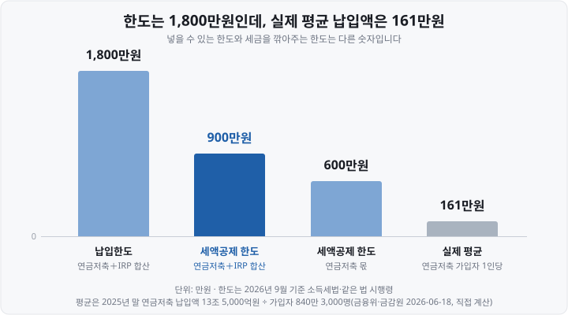
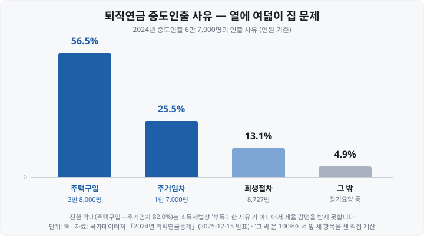

제가 연금저축을 처음 열었을 때, 연말이 다가오자 "600만원을 채워야 한다"는 말을 여기저기서 들었습니다. 그런데 계좌에는 1,800만원까지 넣을 수 있다고 적혀 있더군요. <mark>그럼 1,200만원은 왜 넣으라고 하지 않는 걸까</mark> 한참을 헷갈렸던 기억이 납니다.

답은 간단했습니다. **한도가 하나가 아니라 둘**이었어요. 넣을 수 있는 한도와 세금을 깎아주는 한도가 따로 있었던 겁니다. 「연금저축 한도 제한 푸는 법」을 검색하시는 분들이 막혔다고 느끼는 지점도 대개 여기입니다 — <mark>돈을 더 넣지 못해서가 아니라 세금을 더 깎아주지 않아서</mark>죠.

[절세 계좌 3종](https://blog.naver.com/hdglace/224357252306) 편에서 연금저축·IRP(Individual Retirement Pension, 개인형 퇴직연금)·ISA를 한 번씩 훑었다면, 오늘은 그중 연금계좌의 **한도 하나만** 파고들겠습니다. (수치는 모두 **2026년 9월 기준이며,** 출처는 맨 아래에 밝혔습니다.)

&nbsp;

【한도는 두 개다 — '넣는 한도'와 '깎아주는 한도'】

연금계좌에는 성격이 다른 한도가 두 개 있습니다.

▶ **납입한도 연 1,800만원** — 연금계좌에 **넣을 수 있는** 돈의 상한입니다. 「소득세법 시행령」 제40조의2 제2항 제1호 가목에 "연간 1천800만원"으로 적혀 있어요.
▶ **세액공제 한도 연 900만원** — 그렇게 넣은 돈 중 **세금을 깎아주는** 부분의 상한입니다. 「소득세법」 제59조의3 제1항이 정합니다.

여기서 중요한 건 이 1,800만원이 **계좌마다가 아니라 사람마다** 붙는다는 점입니다. 연금저축계좌를 여러 개 만들어도, 증권사를 나눠도 한도는 늘지 않아요.

&nbsp;

【회사가 넣어 주는 퇴직연금도 1,800만원에 들어가나】

들어가는 돈이 있고 들어가지 않는 돈이 있습니다. 가르는 기준은 <mark>그 돈을 누가 넣었느냐</mark>예요.

| 돈의 종류 | 1,800만원에 포함되나 | 세액공제 대상인가 |
| :--- | :--- | :--- |
| 연금저축에 넣는 돈 | 포함 | 대상(600만원까지) |
| IRP에 본인이 넣는 돈 | 포함 | 대상 |
| DC형에 본인이 추가로 넣는 돈(가입자부담금) | 포함 | 대상 |
| DC형에 회사가 넣어 주는 돈(사용자부담금) | **포함되지 않음** | 대상 아님 |
| 퇴사하며 IRP로 받는 퇴직급여(이연퇴직소득) | **포함되지 않음** | 대상 아님 |

법이 말하는 '연금계좌'에는 퇴직연금 DC형(Defined Contribution, 확정기여형) 계좌도 들어갑니다(「소득세법 시행령」 제40조의2 제1항 제2호 가목). 그래서 DC형 계좌라도 **내가 내 돈으로 추가 납입한 금액**은 연금저축·IRP와 합쳐 연 1,800만원 안에 들어가고, 세액공제도 받아요.

반면 **회사가 근로자의 퇴직급여로 적립해 주는 사용자부담금은 성격이 다릅니다.** 같은 DC 계좌에 쌓이지만 내가 납입한 돈이 아니고, 나중에 찾을 때 퇴직소득세를 매기는 별도 체계 안에 있어요. 국세청도 연금계좌 세액공제 안내에서 퇴직연금계좌의 범위를 적으면서 <mark>"확정기여형퇴직연금 사용자부담금은 제외"</mark>라고 괄호로 못 박아 두었습니다.

그러니 회사가 내 DC 계좌에 한 해 500만원을 넣어 주고 있더라도, 내가 따로 넣을 수 있는 돈은 여전히 연 1,800만원입니다. **회사 몫이 내 한도를 깎아먹지 않아요.**

&nbsp;

【세액공제 한도에는 조건이 하나 더 붙는다】

900만원이라는 숫자 안에 칸막이가 하나 더 있어요. 「소득세법」 제59조의3 제1항 단서를 그대로 옮기면 이렇습니다.

"다만, 연금계좌 중 연금저축계좌에 납입한 금액이 연 600만원을 초과하는 경우에는 그 초과하는 금액은 없는 것으로 하고, 연금저축계좌에 납입한 금액 중 600만원 이내의 금액과 퇴직연금계좌에 납입한 금액을 합한 금액이 연 900만원을 초과하는 경우에는 그 초과하는 금액은 없는 것으로 한다." — 「소득세법」 제59조의3 제1항 단서

풀어 쓰면 <mark>연금저축만으로는 최대 600만원까지</mark>, 여기에 IRP를 더해야 900만원이 채워진다는 뜻입니다. 연금저축에 900만원을 몰아넣어도 공제는 600만원까지만 돼요. 반대로 IRP 하나에 900만원을 넣으면 900만원 전부가 공제 대상입니다.

| | 납입한도 | 세액공제 한도 |
| :--- | :--- | :--- |
| 연금저축 단독 | 합산 1,800만원 안에서 자유 | **600만원** |
| IRP 단독 | 합산 1,800만원 안에서 자유 | **900만원** |
| 연금저축 + IRP | **합산 1,800만원** | **합산 900만원**(연금저축 몫은 600만원까지) |

그림으로 보면 1,800만원이라는 그릇이 이렇게 나뉩니다.

왼쪽 900만원이 세금을 깎아주는 구간이고, 그중에서도 앞의 600만원까지만 연금저축으로 채울 수 있어요. 오른쪽 900만원은 넣어도 그해 공제는 없지만, 계좌 안에서 세금을 미뤄 주는 혜택(과세이연)은 그대로 받습니다.

&nbsp;

【실제로는 얼마나 넣고 있을까】

금융위원회·금융감독원이 2026년 6월 18일 발표한 2025년 말 연금저축 통계를 보면, 한 해 납입액은 13조 5,000억원이고 가입자는 840만 3,000명입니다. 나눠 보면 <mark>1인당 약 161만원</mark>이에요.

다만 이 161만원을 "사람들이 한 해에 161만원씩 넣는다"로 읽으면 어긋납니다. 두 가지를 감안해야 해요.

▶ **연금저축만 센 값입니다.** IRP나 DC형에 본인이 추가로 넣은 돈은 이 통계에 들어 있지 않아요. 그 돈까지 합치면 1인당 금액은 이보다 커집니다.
▶ **그해에 한 푼도 넣지 않은 사람까지 분모에 있습니다.** 840만 3,000명은 계좌를 가진 사람 전체이고, 그중 몇 명이 실제로 납입했는지는 발표 자료에 나오지 않아요. 실제로 돈을 넣은 사람만 놓고 보면 평균은 161만원보다 높습니다.

그래도 방향은 분명합니다. 한 해 900만원을 채운다는 건 가입자 1인당 평균의 대여섯 배를 넣는다는 뜻이니, <mark>한도가 막혀서 못 넣는 사람보다 한도 근처에도 가지 않는 사람이 훨씬 많다</mark>고 보는 편이 실상에 가까워요. 이 글을 "한도 푸는 법"으로 찾아오셨다면 먼저 볼 것은 대개 600만원과 900만원 쪽입니다.

&nbsp;

【1,800만원 밖에 있는 돈 — 원래 별도인 것들】

한도를 늘리는 방법은 없지만, **애초에 1,800만원에 포함되지 않는 돈**은 있습니다. 「소득세법 시행령」 제40조의2가 한도 계산에서 빼 주는 항목들이에요.

▶ **① ISA 만기자금 전환** — ISA(Individual Savings Account, 개인종합자산관리계좌)를 만기 해지하고 그 자금을 연금계좌로 옮기면, 옮긴 금액은 1,800만원 한도와 **별도로** 들어갑니다. 따로 정해진 금액 상한은 없고, ISA 만기일 기준 잔액까지 옮길 수 있어요. 게다가 전환금액의 **10%,** 최대 300만원까지 그해 세액공제 한도에 얹어 줍니다. 900만원에 300만원이 더해져 <mark>한 해 최대 1,200만원</mark>까지 공제받는 구조죠. 단, ISA 만기 후 **60일 이내에** 납입해야 하고(「소득세법 시행령」 제118조의2 제3항) 추가 공제는 납입한 그해에만 적용됩니다.

▶ **② 퇴직금(이연퇴직소득)** — 퇴사하면서 받은 퇴직급여를 IRP로 받는 금액은 납입한도와 무관합니다. 애초에 세액공제 대상이 아니고(이미 퇴직소득세 체계 안에 있어요), 한도 계산에도 넣지 않습니다.

▶ **③ 주택차액(다운사이징)** — 60세 이상 1주택 고령가구가 살던 집을 팔면, 판 값에서 새로 산 집값을 뺀 차액을 연금계좌에 추가 납입할 수 있습니다. **집을 팔고 새로 사지 않아도 돼요** — 이때는 판 값 전부가 대상입니다. 요건이 촘촘해요 — 양도일 현재 거주자 또는 배우자가 60세 이상, 부부합산 1주택(축소주택을 먼저 사고 6개월 이내에 판 경우 포함), 판 집의 기준시가 12억원 이하, 새로 산 집이 있다면 그 취득가액이 판 집의 양도가액보다 낮을 것, 양도일부터 6개월 이내 납입. 한도는 <mark>누적 1억원</mark>인데, 같은 조문이 기초연금 수급자가 10년 이상 보유한 토지·건물을 판 차액도 같은 방식으로 넣게 해 주고 있어 **1억원은 그 둘을 합해서 세는 누적 한도**예요.

※ **과세이연이 뭔가요?** 일반 계좌라면 이익이 날 때마다 세금을 떼지만, 연금계좌 안에서는 인출할 때까지 세금을 매기지 않고 미뤄 줍니다. 세금으로 나갈 돈까지 계속 굴러가니 장기 투자에서 복리 효과가 커져요. 자세한 구조는 [ETF 총보수와 세금](https://blog.naver.com/hdglace/224367512124) 편에서 다뤘습니다.

&nbsp;

【공제율 — 15%와 16.5%가 같은 말인 이유】

공제율을 찾아보면 어떤 글은 15%·12%라 하고 어떤 글은 16.5%·13.2%라고 합니다. 둘 다 맞아요. **법 조문의 숫자는 소득세 본세이고, 실제로 돌려받는 숫자는 거기에 지방소득세가 얹힌 값**입니다.

| 총급여(종합소득금액) | 소득세법 조문 | 지방소득세 포함 | 900만원 채웠을 때 줄어드는 세금 |
| :--- | :--- | :--- | :--- |
| 5,500만원(4,500만원) 이하 | 15% | **16.5%** | 1,485,000원 |
| 초과 | 12% | **13.2%** | 1,188,000원 |

지방소득세는 소득세액의 10%로 따라붙습니다. 그래서 15%에 1.5%포인트가 더해져 16.5%가 돼요. 아래에서는 <mark>실제 체감 세율인 지방소득세 포함 기준</mark>으로 적되, 조문을 인용할 때만 본세를 쓰겠습니다.

맨 오른쪽 칸은 900만원을 채웠을 때 **내야 할 세금이 줄어드는 금액**입니다. 연말정산이라면 이미 월급에서 떼어 간 세금이 그만큼 환급으로 돌아와요.

※ **소득공제와 세액공제는 무엇이 다른가요?** 세금은 「내 소득 → 소득공제를 뺀 과세표준 → 세율을 곱한 세금 → 세액공제를 뺀 최종 세금」 순서로 계산됩니다. **소득공제**는 세율을 곱하기 **전 단계**에서 소득을 깎아 줘요. 그래서 같은 100만원을 공제받아도 세율이 높은 사람일수록 줄어드는 세금이 큽니다. **세액공제**는 세율을 곱해 **나온 세금**을 직접 깎아 줍니다. 소득이 얼마든 정해진 공제율만큼만 줄어들어요. 연금저축·IRP 납입액은 **세액공제**입니다. 900만원 × 16.5% = 1,485,000원이 세금에서 그대로 빠져요. 이 글에서 말하는 '공제'는 따로 밝히지 않는 한 모두 세액공제입니다.

⚠️ 단서가 하나 있습니다. 세액공제는 **깎을 세금이 있어야 받아요.** 조문도 "종합소득산출세액에서 공제한다"고 적고 있어서, 다른 공제를 거친 뒤 낼 세금이 0원인 사람은 900만원을 채워도 돌려받을 것이 없습니다. 소득이 적어 세금을 거의 내지 않는 해라면, 그해 넣은 돈을 다음 해 공제로 넘기는 편이 나아요(뒤에 나오는 납입연도 전환특례).

&nbsp;

【2026년 세제개편안 — 청년은 소득과 무관하게 15%(정부안)】

재정경제부는 **2026년 8월 3일** 「2026년 세제개편안」을 발표했습니다. 연금계좌와 관련해서는 <mark>15~34세 청년이 퇴직연금계좌에 납입한 금액에는 소득 수준과 관계없이 세액공제율 15%</mark>(지방소득세 포함 16.5%)를 적용하는 안이 담겼어요. 개편안의 항목 이름이 「청년의 퇴직연금(IRP) 납입에 대한 소득세 세제지원 확대」인 데서 보이듯 **바뀌는 건 퇴직연금 납입분의 공제율 하나**이고, 연금저축 납입분은 대상이 아니며 연 900만원 한도라는 뼈대도 그대로입니다. 적용 시점은 **2027년 1월 1일 이후 납입분부터입니다.**

⚠️ 이것은 **아직 정부안입니다.** 국회 심의를 거쳐야 확정되고, 그 과정에서 내용이 바뀌거나 빠질 수 있어요. 지금 납입하는 돈에는 적용되지 않습니다. 2024년 세법개정안에 담겼던 ISA 확대안이 국회에서 반영되지 않은 전례가 있으니, "발표됐다"와 "시행된다"를 구분해서 보시는 편이 안전합니다.

&nbsp;

【900만원을 넘겨 넣으면 어떻게 되나】

한도를 넘겨 넣었다고 해서 돈이 튕겨 나오거나 벌금이 붙지는 않습니다. 1,800만원 안이라면 납입 자체는 정상이에요. 달라지는 건 네 가지입니다.

▶ **① 그해에는 공제되지 않습니다.** 900만원을 넘는 부분은 조문 표현대로 "없는 것으로" 봅니다. 계좌에는 들어가 있지만 그해 연말정산에서는 없는 돈 취급이에요.

▶ **② 과세이연은 그대로 받습니다.** 공제를 못 받았을 뿐, 계좌 안에서 굴리는 동안 세금을 미뤄 주는 혜택은 초과분에도 똑같이 적용됩니다.

▶ **③ 다음 해로 넘겨 공제받을 수 있습니다 — 납입연도 전환특례.** 「소득세법 시행령」 제118조의3이 정한 제도입니다. 이전 과세기간에 넣었지만 공제받지 못한 금액을 <mark>올해 납입한 것으로 바꿔 달라고 신청</mark>할 수 있어요. 절차는 이렇습니다.

1. 국세청 홈택스에서 「연금보험료 등 소득·세액 공제확인서」를 발급받아 공제받지 않은 금액을 확인합니다.
2. 계좌를 둔 금융회사에 그 서류와 함께 **전환 신청**을 합니다.
3. 신청한 금액은 계좌에서 가장 먼저 인출됐다가 신청한 날에 다시 납입된 것으로 봅니다.

⚠️ 주의할 점이 있어요. 전환한다고 그해 공제 한도가 늘어나는 건 아닙니다. **전환된 금액도 그해의 600만원·900만원 한도 안에서만** 공제돼요. 작년에 1,800만원을 넣어 900만원만 공제받은 사람이 올해 나머지 900만원을 전환 신청했다면, 올해는 새로 돈을 넣지 않아도 900만원을 공제받게 되는 식입니다. 한도를 키우는 장치가 아니라 **넣은 해와 공제받는 해를 어긋나게 해 주는 장치**예요.

▶ **④ 공제받지 않은 원금은 뺄 때 세금이 없습니다.** 이게 초과 납입의 숨은 성질인데, 다음 절에서 이어집니다.

&nbsp;

【돈을 빼면 무슨 일이 생기나 — 인출 순서가 세금을 정한다】

연금계좌에서 돈을 빼면 "얼마를 빼느냐"보다 "**어느 돈이 먼저 나가느냐**"가 세금을 결정합니다. 순서는 내가 고르는 게 아니라 「소득세법 시행령」 제40조의3이 정해 둔 대로 자동으로 정해져요.

| 순서 | 무엇이 나가나 | 세금 |
| :--- | :--- | :--- |
| 1 | **과세제외금액** — 세액공제받지 않은 납입액(한도 초과분·공제 신청하지 않은 돈), 그해 납입액, ISA 전환금액 | **없음** |
| 2 | **이연퇴직소득** — IRP로 받은 퇴직급여 | 퇴직소득세 |
| 3 | **과세대상** — 세액공제받은 납입액 + 운용수익 전부 | 연금소득세 또는 기타소득세 |

세율이 낮은 돈부터 빠지도록 짜여 있습니다. 그래서 <mark>세액공제를 받지 않고 넣어 둔 돈은 언제 빼도 세금이 붙지 않습니다.</mark> 한도를 넘겨 넣은 돈이 묶이는 게 아닌가 걱정하는 분이 많은데, 적어도 세금 면에서는 그 부분이 가장 자유로워요.

&nbsp;

【연금저축과 IRP는 빼는 규칙부터 다릅니다】

▶ **연금저축(펀드·신탁)은** 계좌를 해지하지 않고도 필요한 만큼 부분인출할 수 있습니다. 사유를 대지 않아도 돼요. 대신 3순위 돈이 나가는 순간 세금이 붙습니다. (연금저축보험은 상품 구조상 중도인출이 제한되거나 해지환급금 형태가 되므로 약관을 따로 확인해야 합니다.)
▶ **IRP는** 원칙적으로 법에 정한 사유가 있을 때만 중도인출할 수 있습니다. 「근로자퇴직급여 보장법 시행령」 제18조 제2항이 정한 사유는 무주택자의 본인 명의 주택 구입, 무주택자의 주거 목적 전세금·임차보증금 부담, 본인·배우자·부양가족이 6개월 이상 요양이 필요해 그 의료비를 부담하는 경우, 재난으로 피해를 입은 경우, 신청일로부터 거꾸로 5년 이내의 파산선고 또는 개인회생절차 개시 결정 등이에요. 사유가 없으면 계좌를 통째로 해지하는 길밖에 없습니다. (회사가 넣어 주는 DC형 계좌의 중도인출 사유는 같은 시행령 제14조에 따로 있고, 목록이 조금 달라요.)

&nbsp;

【⚠️ 돈을 빼도 되는 사유와 세금을 깎아주는 사유는 다르다】

여기가 오늘 글에서 가장 오해가 잦은 지점입니다. **인출을 허용하는 규정과 세율을 낮춰 주는 규정은 서로 다른 법에 들어 있고, 인정하는 사유도 같지 않습니다.**

| | 인출을 허용하는 규정 | 세율을 낮춰 주는 규정 |
| :--- | :--- | :--- |
| 근거 | 「근로자퇴직급여 보장법 시행령」 제18조 제2항 | 「소득세법 시행령」 제20조의2 제1항 |
| 부르는 이름 | 중도인출 사유 | **부득이한 사유** |
| 포함되는 것 | 무주택자 주택구입, 전세금·임차보증금, 6개월 이상 요양 의료비, 재난 피해, 파산·개인회생 | 천재지변, 가입자의 사망·해외이주, 가입자·부양가족의 3개월 이상 요양, 재난으로 15일 이상 입원, 가입자의 파산선고·개인회생절차 개시, 금융회사 영업정지 |

<mark>주택 구입과 전세보증금은 왼쪽에는 있지만 오른쪽에는 없습니다.</mark> 그래서 집을 사려고 IRP에서 돈을 빼는 건 **합법이지만 세금 할인은 없어요.** 세액공제받았던 납입액과 운용수익에는 기타소득세 16.5%(본세 15% ＋ 지방소득세)가 그대로 붙습니다. "법에서 허락한 사유니까 세금도 봐주겠지"라는 기대가 어긋나는 자리입니다.

반대로 오른쪽 목록에 해당한다면, <mark>사유를 확인할 수 있는 서류를 확인일부터 6개월 이내에</mark> 금융회사에 제출해야 합니다. 그러면 기타소득세 16.5%가 아니라 연금소득세 3.3~5.5%로 분리과세돼요. 서류를 늦게 내면 같은 사정이라도 혜택을 받지 못합니다.

&nbsp;

【실제로 사람들은 왜 돈을 뺄까】

국가데이터처가 **2025년 12월 15일** 발표한 「2024년 퇴직연금통계」를 보면, 2024년 한 해 퇴직연금을 중도인출한 사람은 6만 7,000명, 금액은 2조 7,000억원입니다. 사유는 이렇게 갈려요.

주택구입과 주거임차를 합치면 82.0%입니다. 그런데 바로 위에서 봤듯 이 둘은 모두 **세금 할인 대상이 아닌** 사유예요. 인출이 가장 많이 일어나는 지점과 세금이 가장 무겁게 붙는 지점이 겹쳐 있는 셈입니다.

&nbsp;

【계좌를 통째로 해지하면】

중도인출이 아니라 해지라면 계산이 더 단순하고 더 무겁습니다. 세액공제받은 납입액과 운용수익 전부에 <mark>기타소득세 16.5%</mark>가 매겨져요. IRP에 퇴직급여가 들어 있다면 그 부분은 퇴직소득세가 감면 없이 100% 부과됩니다.

숫자로 보면 이렇습니다. 총급여 5,500만원 이하인 사람이 600만원을 넣어 99만원(16.5%)을 돌려받았다고 해 볼게요. 이 돈을 나중에 해지해 빼면 600만원에 대해 99만원(16.5%)을 기타소득세로 냅니다. 운용수익이 있었다면 그 수익에도 같은 세율이 붙어요. <mark>돌려받은 걸 도로 내놓고, 그동안 불어난 수익에 대해서는 추가로 더 낸다</mark>는 구조입니다.

&nbsp;

【55세 이후에 받을 때 — '연금이냐 아니냐'가 세율을 가른다】

연금계좌의 낮은 세율은 자동으로 주어지지 않습니다. 세법이 말하는 **연금수령**의 요건을 갖춰야 해요. 「소득세법 시행령」 제40조의2 제3항이 정한 요건은 셋입니다.

1. **55세 이후** 금융회사에 연금수령 개시를 신청하고 인출할 것
2. 계좌 **가입일부터 5년이 지났을 것** — 단, 이연퇴직소득(퇴직급여)이 들어 있는 계좌라면 이 5년 요건은 적용되지 않습니다
3. **연금수령한도** 안에서 인출할 것

세 번째가 낯선 개념이죠. 한 해에 얼마까지 빼야 '연금'으로 인정되는지를 정한 상한이고, 공식은 이렇습니다.

연금수령한도 ＝ 연금계좌 평가액 ÷ (11 − 연금수령연차) × 120%

연금수령연차는 처음 연금을 받을 수 있게 된 해를 1년차로 세고, 11년차부터는 이 한도 자체가 사라집니다. (2013년 3월 1일 전에 가입한 계좌는 6년차부터 세므로 처음부터 한도가 넉넉해요.) 한도를 넘겨 빼면 초과분은 연금이 아닌 것으로 보아 <mark>한도까지는 연금소득, 넘는 부분은 연금외수령</mark>으로 나눠 과세해요.

요건을 갖춰 연금으로 받으면 세율은 나이에 따라 낮아집니다.

| 수령 나이 | 소득세법 조문 | 지방소득세 포함 |
| :--- | :--- | :--- |
| 55~69세 | 5% | **5.5%** |
| 70~79세 | 4% | **4.4%** |
| 80세 이상 | 3% | **3.3%** |
| 종신형 연금(사망까지 수령, 중도해지 불가) | 3% | **3.3%** |

나이 조건과 종신형 조건에 동시에 해당하면 **둘 중 낮은 세율**을 적용해요.

⚠️ 종신형을 **4%(지방소득세 포함 4.4%)로 적어 둔** 금융회사 안내표가 아직 남아 있습니다. 이 글의 3%는 「소득세법」 제129조 제1항 제5호의2 다목의 조문 그대로이니, 가입한 상품의 안내가 다르게 적혀 있다면 계약서와 금융회사 확인을 한 번 더 거치시기 바랍니다.

퇴직급여를 재원으로 하는 부분은 셈이 다릅니다. 연금으로 실제 받은 햇수가 10년 이하면 이연퇴직소득세의 70%, 10년을 넘고 20년 이하면 60%, 20년을 넘으면 50%만 내요. <mark>오래 나눠 받을수록 감면 폭이 커지는</mark> 구조입니다.

마지막으로 한도가 하나 더 있습니다. **사적연금 수령액이 연 1,500만원을 넘으면**, 그해 연금소득 전체를 다른 소득과 합치는 종합과세와 16.5% 분리과세 중 유리한 쪽을 고르게 됩니다. 국민연금 같은 공적연금은 이 1,500만원 계산에 넣지 않고, 부득이한 사유로 인출한 금액과 이연퇴직소득 재원 부분도 제외돼요.

&nbsp;

【오늘 정리】

▶ 연금계좌의 한도는 둘입니다. **넣는 한도는 연 1,800만원,** 세금을 깎아주는 한도는 연 900만원(연금저축 몫은 600만원까지)이고 둘 다 사람별 합산입니다.
▶ 1,800만원은 **내가 넣는 돈**의 한도예요. DC형에 본인이 추가로 넣은 돈은 포함되지만, **회사가 넣어 주는 사용자부담금과 퇴사하며 받는 퇴직급여는 포함되지 않습니다.**
▶ 한도를 늘리는 방법은 없지만 **1,800만원에 포함되지 않는 돈**은 있어요 — ISA 만기 전환금액(추가 공제 최대 300만원), 퇴직금, 60세 이상 1주택자의 주택차액(부동산 양도차액과 합해 누적 1억원).
▶ 연금계좌 납입액은 **세액공제**입니다. 세율을 곱하기 전의 소득을 깎는 소득공제와 달리, 계산된 세금에서 공제율만큼을 직접 빼요. 다만 낼 세금이 없으면 돌려받을 것도 없습니다.
▶ 공제율 15%·12%와 16.5%·13.2%는 같은 말입니다. 앞은 소득세 본세, 뒤는 지방소득세를 포함한 값이에요.
▶ 900만원을 넘겨 넣어도 과세이연은 그대로이고 **납입연도 전환특례로** 다음 해에 공제받을 수 있습니다. 다만 전환해도 그해 한도는 900만원 그대로예요.
▶ 인출할 때는 **세액공제받지 않은 돈이 가장 먼저** 나가고 세금이 없습니다. 세액공제받은 돈과 운용수익이 나갈 때 기타소득세 16.5%가 붙어요.
▶ ⚠️ **돈을 빼도 되는 사유와 세금을 깎아주는 사유는 서로 다른 법의 서로 다른 목록입니다.** 주택구입·전세보증금은 IRP 중도인출이 허용되지만 세율 감면은 없어요.
▶ 55세 이후 세 가지 요건(55세·5년·연금수령한도)을 갖춰 받으면 3.3~5.5%, 연 1,500만원을 넘으면 종합과세나 16.5% 분리과세 중 선택입니다.

한도를 "푸는" 방법을 찾기보다, 내가 지금 어느 한도에 걸려 있는지부터 확인하는 편이 빠릅니다. 홈택스의 「연금보험료 등 소득·세액 공제확인서」 한 장이면 지난해까지 공제받은 금액과 받지 않은 금액이 그대로 나와요.

&nbsp;

※ 함께 보면 좋은 글
▶ [연금저축·IRP·ISA 절세 계좌 3종](https://blog.naver.com/hdglace/224357252306) — 세 계좌의 성격과 혜택을 나란히 비교
▶ [ETF 총보수와 세금](https://blog.naver.com/hdglace/224367512124) — 계좌에 담을 상품에서 빠져나가는 비용
▶ [해외주식 양도소득세 신고 방법](https://blog.naver.com/hdglace/224371858037) — 일반 계좌에서 해외주식을 거래할 때의 과세
▶ [주식 결제일 D+2](https://blog.naver.com/hdglace/224406855629) — 지난 편, 판 돈은 언제 출금할 수 있나

&nbsp;

【다음 편 예고】

**재무제표 3장만 보기 — 손익계산서·재무상태표·현금흐름표**를 다룹니다. 초보가 실제로 확인할 항목은 몇 개 되지 않아요. 매출과 영업이익, 자산과 부채비율, 그리고 영업활동 현금흐름이 이익과 왜 다른지까지, 전자공시시스템 DART(Data Analysis, Retrieval and Transfer System)에서 찾는 경로와 함께 읽는 순서를 정리하겠습니다.

&nbsp;

【📊 데이터 출처 및 기준일】

| 항목 | 내용 | 출처·기준일 |
| :--- | :--- | :--- |
| 납입한도 1,800만원과 제외 항목 | "연간 1천800만원", ISA 전환금액은 별도 / 주택차액과 부동산 양도차액은 **둘을 합해** 누적 1억원 한도 | 「소득세법 시행령」 제40조의2 제2항 제1호 가목~라목, 국가법령정보센터 조문 원문, 2026-09-12 확인 |
| 퇴직연금 DC형의 처리 | 본인 추가납입(가입자부담금)은 한도·세액공제에 포함, 회사가 넣는 **사용자부담금은 제외** | DC형이 퇴직연금계좌에 포함되는 근거는 「소득세법 시행령」 제40조의2 제1항 제2호 가목, 1,800만원이 '가입자 납입액'의 한도인 근거는 같은 조 제2항, 사용자부담금 제외는 국세청 「연금계좌 세액공제」 안내 괄호("확정기여형퇴직연금 사용자부담금은 제외"), 2026-09-12 확인 |
| 세액공제 한도·공제율·산출세액 한도 | 연금저축 600만원, 퇴직연금 합산 900만원, 본세 15%(종합소득금액 4,500만원·총급여 5,500만원 이하)·12% | 「소득세법」 제59조의3 제1항 조문 원문, 2026-09-12 확인. 지방소득세 10% 가산 시 16.5%·13.2%, 1,485,000원·1,188,000원은 **직접 계산**. 조문이 "종합소득산출세액에서 공제한다"고 정하므로 **낼 세금이 없으면 공제로 돌려받을 금액도 없음** |
| ISA 전환 추가공제·고령가구 추가납입 | 전환금액의 10%·300만원 한도, 납입한 해에만 적용 / 1주택 고령가구 IRP 추가납입 1억원 한도 | 국세청 「연금계좌 세액공제」 안내, 2026-09-12 확인 |
| ISA 전환 60일 요건·한도 별도 | 만기 후 60일 이내 납입, 연 1,800만원 한도에 포함되지 않음, 전환금액의 10%·300만원 추가공제 | 60일 요건은 「소득세법 시행령」 제118조의2 제3항, 한도 별도는 같은 영 제40조의2 제2항 제1호 나목, 추가공제는 「소득세법」 제59조의3 제4항 — 조문 원문, 2026-09-12 확인 |
| 주택 다운사이징 요건 | 60세 이상, 부부합산 1주택, 기준시가 12억원 이하, 축소주택 취득가액이 양도가액 미만, 양도일부터 6개월 이내 납입, **축소주택을 취득하지 않아도 적용** | 「소득세법 시행령」 제40조의2 제2항 제1호 다목 1)~5) 조문 원문을 항목별로 대조, 2026-09-12 확인 |
| 연금저축 현황 | 2025년 말 적립금 198조 2,000억원, 가입자 840만 3,000명, 계약 1,079만 6,000건, 연간 납입액 13조 5,000억원 | 금융위원회·금융감독원 보도자료(2026-06-18) 원문 및 언론 **교차확인**, 2026-09-12. 1인당 약 161만원은 **직접 계산**. ⚠️ 보도자료에 1인당 납입액·실납입 계약 비중이 없어 **분모에 그해 납입이 없었던 가입자도 포함**되며, 연금저축만의 통계라 IRP·DC형 추가납입은 빠져 있음(본문에 단서 표기) |
| 2026년 세제개편안 청년 공제 | 15~34세, 소득 무관 15%, 900만원 한도는 "좌 동", 2027-01-01 이후 납입분 | 재정경제부 「2026년 세제개편안」(2026-08-03 발표)의 조문 대비표를 옮겨 실은 삼일PwC 자료 38쪽 「청년의 퇴직연금(IRP) 납입에 대한 소득세 세제지원 확대(소득법 §59의3)」 **원문 대조**, 2026-09-12. ⚠️ 초안의 "군 복무기간 제외로 최대 40세"는 확인되지 않아 **삭제**. **국회 심의 전 정부안** |
| 납입연도 전환특례 | 이전 과세기간 미공제액을 해당 과세기간 납입액으로 전환 신청, 홈택스 확인서 발급 후 금융회사 신청 | 「소득세법 시행령」 제118조의3 조문 원문(전환액도 "제40조의2제2항 각 호의 요건을 충족하여야 한다") 및 KB 안내 **교차확인**, 2026-09-12 |
| 인출 순서 | 과세제외금액 → 이연퇴직소득 → 세액공제받은 납입액과 운용수익 | 「소득세법 시행령」 제40조의3 제1항·제2항 조문 원문, 2026-09-12 확인 |
| IRP 중도인출 법정 사유 | 무주택자 주택구입, 전세금·임차보증금, 6개월 이상 요양 의료비, 재난 피해, 5년 이내 파산·개인회생 등 | 「근로자퇴직급여 보장법 시행령」 **제18조 제2항** 조문 원문, 2026-09-12 확인. ⚠️ 초안이 적은 제14조는 제목부터 「확정기여형퇴직연금제도의 중도인출 사유」로 **DC형 규정**이라 조문 번호를 정정 |
| 소득세법상 부득이한 사유 | 천재지변 / 사망·해외이주 / 3개월 이상 요양 / **재난으로 15일 이상 입원** / 파산·개인회생 / 연금계좌취급자의 영업정지·인허가 취소·해산결의·파산 — 확인된 날부터 6개월 이내 서류 제출 | 「소득세법 시행령」 제20조의2 제1항 제1호 가목~바목 조문 원문을 목별로 대조, 2026-09-12 확인. 초안이 빠뜨린 **라목(재난 입원)을 표에 추가** |
| 주택구입이 세율 감면 대상이 아닌 점 | 근퇴법상 중도인출 사유이나 소득세법상 부득이한 사유가 아니어서 기타소득세 16.5% 적용 | 한국경제 「퇴직연금 톡톡」(2024-07-01) 및 KB·하나은행 퇴직연금 안내 **교차확인**, 2026-09-12 |
| 중도인출·해지 세율 | 기타소득세 본세 15% ＋ 지방소득세 = 16.5%, 해지 시 퇴직급여는 퇴직소득세 100% | 국세청 「연금소득 원천징수 방법」 및 신한투자증권 IRP 안내 **교차확인**, 2026-09-12 |
| 2024년 중도인출 통계 | 6만 6,531명(반올림 6만 7,000명)·2조 7,352억원, 주택구입 3만 7,618명(56.5%), 주거임차 1만 6,955명(25.5%), 회생절차 8,727명(13.1%) | 국가데이터처 「2024년 퇴직연금통계」(2025-12-15 발표) 및 한국일보·서울경제·아주경제 **교차확인**, 2026-09-12. ⚠️ 초안의 금액 "3조원"을 **2조 7,000억원으로 정정**. 그래프의 '그 밖 4.9%'와 '82.0%'는 **직접 계산** |
| 연금수령 요건·한도 공식 | 55세 이후 개시 신청, 가입일부터 5년 경과(이연퇴직소득 있으면 제외), 한도 = 평가액 ÷ (11 − 연금수령연차) × 120% | 「소득세법 시행령」 제40조의2 제3항 조문 원문, 2026-09-12 확인. 연금수령연차 기산(11년 이상 미적용, 2013-03-01 전 가입은 6년차)은 같은 조 제4항 |
| 연금소득 원천징수세율 | 70세 미만 5%, 70~79세 4%, 80세 이상 3%, 종신계약 3%(동시 충족 시 낮은 세율), 이연퇴직소득은 실제 수령연차에 따라 70%·60%·50% | 「소득세법」 제129조 제1항 제5호의2·제5호의3 **조문 원문**, 2026-09-12 확인. 본문의 5.5%·4.4%·3.3%는 지방소득세 포함. ⚠️ 초안은 종신형을 4%로 적었으나 조문은 **3%여서** 정정 — 4%로 적힌 금융회사 안내표가 남아 있으므로 계약서로 한 번 더 확인 권장 |
| 연 1,500만원 초과 과세 | 종합과세 또는 16.5% 분리과세 선택, 공적연금·부득이한 사유 인출액·이연퇴직소득 제외 | 분리과세 범위는 「소득세법」 제14조 제3항 제9호, 선택 규정은 같은 법 제64조의4 조문 원문, 2026-09-12 확인 |

&nbsp;

⚠️ **면책 안내** — 이 글은 공개된 법령과 국세청·금융감독원·금융회사의 안내를 정리한 **교육·정보 제공 목적**의 자료이며, 특정 금융회사·상품·계좌의 가입이나 매매를 권유하지 않습니다. 세법과 제도는 개정될 수 있고, 본문의 수치는 위에 밝힌 기준 시점의 값입니다. 2026년 세제개편안 관련 내용은 국회를 통과하지 않은 정부안입니다. 개인의 소득·가입 기간·계좌 구성에 따라 실제 세금은 달라지므로, 납입과 인출 판단은 국세청과 이용 중인 금융회사에서 최신 기준을 확인하고 본인 책임하에 결정하시기 바랍니다.

&nbsp;

#연금저축납입한도 #IRP납입한도 #연금계좌세액공제 #연금저축600만원 #IRP900만원 #납입연도전환특례 #연금저축중도인출 #IRP중도인출 #기타소득세 #연금소득세 #ISA연금전환 #퇴직연금통계 #연말정산 #세액공제 #주식초보 #투자공부 #재테크
