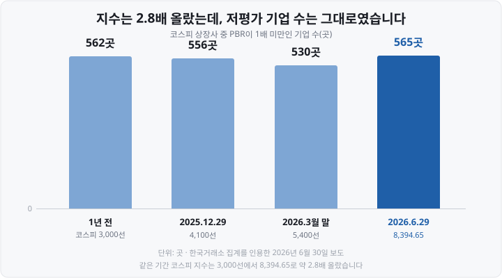
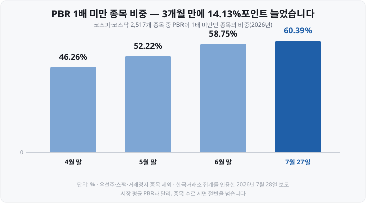

저는 투자를 시작하고 한참 동안 PER을 이렇게 썼습니다. 종목 화면에 **PER 8배** 라고 적혀 있으면 "싸구나", **40배** 면 "비싸구나" 하고 넘어갔습니다. 두 종목을 나란히 놓고 숫자가 작은 쪽을 고르면 되는 줄 알았습니다.

그러다 <mark>PER이 낮아서 산 종목이 계속 낮은 채로 몇 달을 흐르는</mark> 경험을 했습니다. 나중에 알고 보니 업종이 달랐고, 그 업종에서는 8배가 오히려 평균이었습니다. 게다가 제가 본 8배는 **작년에 이미 끝난 실적** 으로 계산된 숫자였습니다.

오늘은 PER과 PBR이 각각 무엇을 나눈 값인지, 언제 계산 자체가 무의미해지는지, 그리고 같은 '코스피 PER'인데 왜 사이트마다 숫자가 다른지를 계산식부터 하나씩 정리해 보겠습니다.

&nbsp;

【① 회사 하나를 두 가지 자로 재 봅니다】

먼저 계산할 회사를 하나 세워 두겠습니다. 설명을 위해 제가 지어낸 숫자이고, 실제 종목이 아닙니다.

| 항목 | 값 |
| :--- | ---: |
| 발행주식 수 | 2,000만 주 |
| 주가 | 20,000원 |
| **시가총액**(주가 × 주식 수) | 4,000억원 |
| 지난 1년 당기순이익 | 200억원 |
| 자본총계(순자산) | 4,000억원 |

**시가총액** 은 <mark>시장이 이 회사 전체에 매긴 값</mark>입니다. 한 주가 20,000원인데 그 주식이 2,000만 주 있으니, 회사를 통째로 사려면 4,000억원이 든다는 뜻이죠.

이제 이 회사에 자를 두 번 댑니다. 하나는 **버는 돈** 에, 하나는 **가진 것** 에 댑니다.

&nbsp;

【② PER — 버는 돈으로 재는 자】

**PER**(Price Earning Ratio, 주가수익비율)은 <mark>주가를 주당순이익으로 나눈 값</mark>입니다.

먼저 **EPS**(Earnings Per Share, 주당순이익)부터 봅니다. 회사가 1년 동안 번 순이익을 주식 수로 나눈 것, 즉 주식 한 주에 배당된 이익입니다.

▶ EPS = 당기순이익 ÷ 발행주식 수 = 200억원 ÷ 2,000만 주 = **1,000원**
▶ PER = 주가 ÷ EPS = 20,000원 ÷ 1,000원 = **20배**

주식 수를 위아래에서 지우면 더 간단해집니다.

▶ PER = 시가총액 ÷ 당기순이익 = 4,000억원 ÷ 200억원 = **20배**

두 식은 완전히 같습니다. 앞은 '한 주' 기준, 뒤는 '회사 전체' 기준일 뿐이죠.

그럼 20배가 무슨 뜻일까요. 저는 이렇게 이해하고 나서야 감이 잡혔습니다 — <mark>지금 이익이 앞으로도 똑같이 유지된다면, 회사를 통째로 사는 데 든 돈을 이익으로 회수하는 데 20년이 걸린다</mark>는 뜻입니다. 4,000억원을 주고 샀는데 매년 200억원씩 벌어 주니 20년이죠.

**뒤집으면 수익률이 됩니다.** PER의 역수를 **이익수익률**(earnings yield)이라고 합니다.

▶ 1 ÷ 20 = 0.05 → **5%**

이 숫자가 쓸모 있는 이유는 <mark>금리와 같은 단위가 되기 때문</mark>입니다. 한국은행 기준금리는 2026년 8월 27일 금융통화위원회에서 2.75%에서 **3.00%로** 올랐는데, 이렇게 확정 이자를 주는 자산과 주식을 같은 자리에 놓고 견줄 수 있게 됩니다.

다만 이 해석에는 큰 전제가 깔려 있습니다. **"지금 이익이 그대로 유지된다면"** 입니다. 이익이 늘어나는 회사면 실제 회수 기간은 짧아지고, 줄어드는 회사면 길어집니다. 그래서 <mark>PER이 높다는 게 '비싸다'는 뜻일 수도 있고 '시장이 성장을 미리 값에 얹었다'는 뜻일 수도</mark> 있습니다. 숫자 하나만으로는 둘을 구분할 수 없습니다.

&nbsp;

【③ PBR — 가진 것으로 재는 자】

**PBR**(Price Book-value Ratio, 주가순자산비율)은 <mark>주가를 주당순자산으로 나눈 값</mark>입니다.

**BPS**(Book-value Per Share, 주당순자산)는 회사의 순자산을 주식 수로 나눈 것입니다. **순자산** 은 전체 자산에서 갚을 빚을 뺀 나머지로, 재무제표에는 **자본총계** 로 적힙니다.

▶ BPS = 자본총계 ÷ 발행주식 수 = 4,000억원 ÷ 2,000만 주 = **20,000원**
▶ PBR = 주가 ÷ BPS = 20,000원 ÷ 20,000원 = **1.0배**

회사 전체로 봐도 같습니다.

▶ PBR = 시가총액 ÷ 자본총계 = 4,000억원 ÷ 4,000억원 = **1.0배**

**PBR 1배가 기준선 노릇을 하는 이유** 가 여기 있습니다. 1배는 <mark>시장이 매긴 회사의 값과 장부에 적힌 순자산이 정확히 같다</mark>는 뜻이니까요. 1배보다 낮으면 "회사가 가진 것보다 시장이 매긴 값이 더 작다"가 되고, 그래서 '청산가치에도 못 미친다'는 표현이 따라붙습니다.

여기서 제가 오래 착각했던 것을 하나 짚습니다. **장부에 적힌 순자산은 실제로 팔았을 때 받을 돈이 아닙니다.** 20년 전에 산 공장은 취득가에서 감가상각을 뺀 값으로 적혀 있고, 브랜드나 기술력처럼 사들이지 않은 것은 장부에 아예 없습니다. 그래서 <mark>PBR 0.7배가 곧 "30% 싸다"는 뜻은 아닙니다.</mark>

&nbsp;

【④ 두 지표를 잇는 다리 — ROE】

PER과 PBR은 따로 노는 숫자가 아닙니다. **ROE**(Return On Equity, 자기자본이익률)가 둘을 이어 줍니다. 회사가 자기 돈으로 얼마나 벌었는가를 재는 값이죠.

▶ ROE = 당기순이익 ÷ 자본총계 = 200억원 ÷ 4,000억원 = **5%**

그리고 세 숫자 사이에 다음 관계가 성립합니다.

▶ **PBR = PER × ROE** → 1.0배 = 20배 × 5% ✔

우연이 아니라 정의상 그렇습니다. PER은 '주가 ÷ 이익', PBR은 '주가 ÷ 순자산', ROE는 '이익 ÷ 순자산'이니 이익이 약분되면서 자연히 이어집니다.

이 관계를 알고 나서 제 시야가 조금 넓어졌습니다. <mark>PBR이 높은 게 그 자체로 '비싸다'는 뜻이 아니라, 시장이 그 회사의 수익성(ROE)을 높게 보고 있다는 뜻</mark>일 수 있으니까요. 반대로 순자산은 두툼한데 그 자산으로 이익을 못 내면 ROE가 낮고, PBR도 따라 눌립니다.

| 지표 | 무엇으로 나누나 | 무엇을 재나 | 이 회사 |
| :--- | :--- | :--- | ---: |
| **PER** | 주가 ÷ **이익**(EPS) | 버는 돈에 견준 값 | 20배 |
| **PBR** | 주가 ÷ **순자산**(BPS) | 가진 것에 견준 값 | 1.0배 |
| **ROE** | 이익 ÷ **순자산** | 가진 것으로 얼마나 버나 | 5% |

&nbsp;

【⑤ PER이 사라지는 자리 — 적자】

종목 화면에서 PER 칸이 비어 있거나 **N/A** 로만 적힌 경우를 보셨을 겁니다. 대개 이 경우입니다.

순이익이 마이너스면 EPS도 마이너스가 되고, PER은 계산 자체가 의미를 잃습니다. 주가 20,000원에 EPS가 −1,000원이면 PER이 −20배로 나오는데, <mark>"−20년 만에 원금을 회수한다"처럼 읽을 수가 없죠.</mark> 그래서 대부분의 서비스는 음수 PER을 표시하지 않고 비워 둡니다.

여기서 시장 평균을 볼 때 조심할 점이 생깁니다. **적자 기업은 애초에 계산에서 빠지므로, 시장 평균 PER은 흑자 기업만 모아 낸 값이 되기 쉽습니다.** 적자 기업이 많은 시장일수록 이 왜곡이 커집니다.

적자 기업은 PER 대신 PBR을 보거나, 매출 대비 시가총액을 보는 **PSR**(Price Sales Ratio, 주가매출비율) 같은 지표를 함께 쓰기도 합니다. 다만 어느 것도 PER을 그대로 대체하지는 못합니다 — 이익이 나지 않는 회사의 값을 재는 일 자체가 <mark>합의된 정답이 없는 영역</mark>이니까요.

&nbsp;

【⑥ 같은 '코스피 PER'인데 왜 숫자가 다를까】

제가 가장 오래 헷갈렸던 부분입니다. 같은 날 여러 곳을 열어 보면 코스피 PER이 5배라고 적힌 곳도, 10배가 넘는다고 적힌 곳도 있습니다. **셋 다 틀린 게 아니라 기준이 다릅니다.**

**첫째, 어느 시점의 이익으로 나누느냐** 가 다릅니다.

| 구분 | 분모에 쓰는 이익 | 성격 |
| :--- | :--- | :--- |
| **후행 PER**(trailing) | <mark>이미 확정된 실적</mark> — 최근 결산 또는 최근 4개 분기 합계 | 사실이지만 과거 |
| **선행 PER**(forward) | <mark>증권사 애널리스트의 추정치</mark> — 흔히 앞으로 12개월 | 미래를 보지만 추정 |

숫자로 보면 차이가 큽니다. 2026년 7월 31일 코스피 종가 6,595.45를 기준으로 한 **12개월 선행 PER은 5.1~5.3배** 로 집계됐습니다(신한투자증권 5.1배, 다른 증권가 집계 5.3배). 낮게 나온 데는 이유가 있습니다 — <mark>반도체를 중심으로 향후 12개월 이익 추정치가 크게 올라 분모가 커졌기 때문</mark>입니다. 같은 시점 확정 실적으로 계산하면 숫자는 훨씬 높아집니다.

**둘째, 어떻게 합치느냐** 가 다릅니다. 모든 종목의 시가총액을 더하고 이익을 더해서 나누는 방식과, 종목별 PER을 구해 단순 평균 내는 방식은 <mark>전혀 다른 값</mark>을 냅니다. 뒤의 방식은 PER 500배짜리 종목 하나가 평균을 통째로 끌어올립니다.

**셋째, 적자 기업을 어떻게 처리하느냐** 가 다릅니다.

그래서 저는 이제 PER 숫자를 옮겨 적을 때 <mark>'후행인지 선행인지, 언제 기준인지'</mark>를 반드시 함께 적습니다. 그것 없이는 "코스피 PER은 몇 배다"라는 문장이 아무 의미가 없더군요.

&nbsp;

【⑦ 업종이 다르면 기준선도 다릅니다】

PER 8배와 PER 40배 중 어느 쪽이 싼가 — 이 질문에는 답할 수 없습니다. **업종이 다르면 애초에 기준선이 다르기** 때문입니다.

이익이 안정적이지만 크게 늘지는 않는 성숙 산업은 PER이 낮게 형성되고, 지금 이익은 적어도 앞으로 크게 늘 것으로 기대되는 산업은 높게 형성됩니다. PBR도 마찬가지입니다 — 공장과 설비가 자산의 대부분인 업종과, 사람·기술이 핵심이라 장부에 잡히는 자산이 적은 업종을 같은 잣대로 볼 수 없습니다.

이건 개인 투자자만의 요령이 아닙니다. 뒤에 나올 **저PBR 기업 공표제도** 도 대상을 고를 때 시장 전체를 한 줄로 세우지 않고 <mark>업종별로 나눠 순위를 매깁니다.</mark> 감독당국과 거래소도 "산업마다 PBR 수준이 구조적으로 다르다"를 전제로 깔고 있는 셈이죠.

그래서 실제로 쓸 때의 순서는 ① 이 종목의 PER·PBR을 확인하고 → ② <mark>같은 업종 평균과 견주고</mark> → ③ 그 회사 자신의 과거 범위와 견주는 것이 됩니다. 절대적인 '적정 PER' 같은 건 없습니다.

&nbsp;

【⑧ 평균의 함정 — 지수가 올라도 저평가 기업은 줄지 않았습니다】

시장 전체 PBR과 개별 종목의 PBR은 생각보다 크게 어긋납니다. 2026년 상반기 한국 증시가 그 사례를 그대로 보여 줬습니다.

**코스피 지수는 3,000선에서 8,394.65로 약 2.8배 올랐는데, PBR 1배 미만 기업 수는 562곳에서 565곳으로 오히려 늘었습니다.** 상승이 일부 대형주에 몰렸기 때문입니다. 시장 평균 PBR은 <mark>시가총액이 큰 종목의 비중이 크게 반영되는 구조</mark>라, 대형주 몇 개가 올리면 평균이 따라 오릅니다. 그러나 종목을 하나하나 세어 보면 사정이 다릅니다.

실제로 **2026년 6월 2일 기준 코스피 전체 PBR은 2.69배** 였지만, 같은 날 코스피 종목 중 **PBR 1배 미만은 543곳(67.4%)** 이었고 그중 0.5배 미만이 328곳이었습니다. <mark>평균은 2.69배인데 개별 종목의 67.4%는 1배에 못 미쳤다</mark>는 뜻이죠. 코스닥도 2026년 7월 22일 기준 1,802곳 중 951곳(52.8%)이 1배 미만이었습니다.

그리고 7월 급락장을 지나며 이 비중은 더 올라갔습니다.

여기서 얻을 교훈은 <mark>"시장 평균이 이러니 내 종목도 이렇겠지"가 성립하지 않는다</mark>는 것입니다. 평균은 시장의 무게중심을 말해 줄 뿐, 종목 하나하나의 자리를 말해 주지 않습니다.

&nbsp;

【⑨ 제도가 PBR을 직접 다루기 시작했습니다】

PBR은 이제 참고 지표를 넘어 제도 안으로 들어와 있습니다. 다만 <mark>시행 중인 것과 시행 예정인 것을 구분해야</mark> 합니다.

**이미 돌아가는 것 — 기업가치 제고(밸류업) 계획 공시.** 2024년 5월 시작된 자율 공시로, 상장사가 스스로 자본효율성 목표와 개선 계획을 밝히는 제도입니다. 2026년 6월 기준 누적 741개사가 공시했고, 이들이 전체 시가총액의 <mark>85.5%</mark>를 차지합니다.

**아직 시행 전인 것 — 저PBR 기업 공표제도.** 2026년 7월 28일 금융위원회와 한국거래소가 세부기준안을 내놓았고, **2026년 8월 29일 현재는 규정 개정 절차를 밟는 중** 입니다.

| 항목 | 내용 |
| :--- | :--- |
| 대상 | 매 반기 **업종별** 로 PBR 순위를 매겨, 코스피는 하위 <mark>25%</mark>, 코스닥은 하위 <mark>10%</mark> |
| 기간 요건 | 그 상태가 **6개 반기(3년) 연속** 이어질 것 |
| 산정 방식 | 순자산은 감사·검토받은 정기보고서 수치, 시가총액은 공표일 7거래일 전 기준 **20거래일 평균** |
| 공표 | 매년 5월·11월 첫 거래일에 거래소 공시 홈페이지(KIND) 게시, 증권사 **MTS**(Mobile Trading System, 모바일 주식거래 시스템) 종목명에도 '저PBR' 표시 |
| 규모 추정 | 최대 220곳 안팎(코스피 130곳·코스닥 90곳), 전체 상장사의 5~10% 수준 |
| 일정 | 개정예고 의견수렴 8월 5~24일 → **9월 증선위·금융위 승인 예정** → <mark>11월 2일 첫 명단 공표 예정</mark> |

⚠️ 마지막 줄이 중요합니다. **아직 확정 시행된 제도가 아니며 승인 절차가 남아 있어 세부 내용이 바뀔 수 있습니다.**

&nbsp;

【⑩ 어디서 볼 수 있나 / 이 숫자가 못 하는 일】

무료로 확인할 수 있는 경로는 여럿입니다.

| 경로 | 볼 수 있는 것 | 확인할 점 |
| :--- | :--- | :--- |
| 증권사 MTS·HTS 종목 화면 | 그 종목의 PER·PBR·EPS·BPS | 표기 기준(최근 결산인지 추정인지) |
| 네이버 증권 종목 페이지 | 같은 지표 + 추정 PER | 적자면 **N/A로** 비어 있음 |
| 한국거래소 정보데이터시스템 | 시장·업종·개별종목의 PER·PBR·배당수익률 | 원자료에 가장 가까움 |
| **KIND**(한국거래소 기업공시채널) 밸류업 포털 업종별 투자지표 | <mark>업종별</mark> PER·PBR·ROE 순위 | 같은 업종끼리 견주기 좋음 |
| **DART**(금융감독원 전자공시시스템) | 재무제표 원문(순이익·자본총계) | 직접 계산해 검산 가능 |

마지막으로 한계를 분명히 해 둡니다. 제가 실제로 부딪힌 것들입니다.

- **낮은 PER이 곧 저평가는 아닙니다.** 이익이 앞으로 줄 것으로 시장이 보면 PER은 낮게 유지됩니다. 이걸 <mark>'가치 함정'(value trap)</mark>이라고 부릅니다.
- **일회성 이익이 분모를 흔듭니다.** 부동산을 팔아 생긴 이익 같은 항목이 섞이면 그해 PER이 뚝 떨어졌다가 이듬해 제자리로 돌아옵니다.
- **장부가는 시세가 아닙니다.** PBR이 낮다고 곧 '싸게 살 수 있는 자산'이 있는 건 아닙니다.
- **성장을 담지 못합니다.** 둘 다 <mark>어느 한 시점을 찍은 사진</mark>이지 앞으로의 궤적이 아닙니다.

그래서 이 두 숫자는 결론이 아니라 **질문을 시작하는 자리** 라고 생각하게 됐습니다. "왜 이 회사는 업종 평균보다 PER이 낮을까"라고 물어보게 만드는 것, 거기까지가 이 지표의 쓸모입니다.

&nbsp;

【📌 정리】

▶ **PER = 주가 ÷ EPS = 시가총액 ÷ 순이익.** 20배는 지금 이익이 유지될 때 원금 회수에 20년이 걸린다는 뜻이고, 역수 5%는 금리와 견줄 수 있는 이익수익률입니다.
▶ **PBR = 주가 ÷ BPS = 시가총액 ÷ 자본총계.** 1배는 시장이 매긴 값과 장부상 순자산이 같다는 뜻이지만, 장부가는 실제 처분가가 아닙니다.
▶ **PBR = PER × ROE** 로 셋이 이어집니다.
▶ **적자면 PER은 계산 자체가 무의미해져** N/A로 비워지고, 그래서 시장 평균 PER은 흑자 기업만 모은 값이 되기 쉽습니다.
▶ **같은 코스피 PER도 후행이냐 선행이냐에 따라 다릅니다.** 2026년 7월 31일 종가 기준 12개월 선행 PER은 5.1~5.3배였습니다.
▶ **평균은 종목을 대변하지 않습니다.** 2026년 6월 2일 코스피 전체 PBR은 2.69배였지만 개별 종목의 67.4%는 1배 미만이었습니다.
▶ **저PBR 기업 공표제도는 2026년 8월 29일 현재 시행 전** 이며, 9월 승인을 거쳐 11월 2일 첫 공표가 예정돼 있습니다.

&nbsp;

【🔗 함께 보면 좋은 글】

- [금리가 오르면 주가가 내리는 이유 — 할인율과 유동성](https://blog.naver.com/hdglace/224369929249) — PER의 역수를 금리와 견주는 감각이 여기서 나옵니다.
- [증권사 리포트 읽는 법 — 목표주가·투자의견을 어떻게 볼까](https://blog.naver.com/hdglace/224386423493) — 선행 PER의 분모가 되는 추정치가 어떻게 만들어지는지 다뤘습니다.
- [주식 데이터 무료로 보는 곳 — KRX·금투협·DART 활용법](https://blog.naver.com/hdglace/224372833633)
- [실적 시즌이란 — 미국·한국 실적 발표 일정 읽는 법](https://blog.naver.com/hdglace/224389308601)
- [공매도·사이드카·서킷브레이커 차이 — 급락장에 켜지는 장치들](https://blog.naver.com/hdglace/224381139813)

&nbsp;

【📊 데이터 출처 및 기준일】

| 항목 | 내용 | 출처·기준일 |
| :--- | :--- | :--- |
| PER·PBR·EPS·BPS·ROE 정의와 계산식, PBR = PER × ROE | 회계·재무 표준 정의 | 본문 예시(2,000만 주·20,000원·4,000억원·200억원·EPS 1,000원·BPS 20,000원·PER 20배·PBR 1.0배·ROE 5%)는 **계산 방식을 보이기 위한 가상 수치** 이며 특정 종목의 실제 값이 아님 |
| 적자 기업 PER은 N/A 표기, PER은 최근 결산 EPS 기준 산출, Fwd. 12M은 최근 3개월 증권사 추정치 평균 | 정보 서비스 산출 기준 | 에프앤가이드 계열 기업정보 서비스(네이버 증권 종목 화면 포함) 안내, 2026년 8월 확인 |
| 코스피 12개월 선행 PER 5.1배(7월 31일 종가 6,595.45 기준) | 신한투자증권 노동길 연구원 | 언론 보도 2026-08-02 |
| 코스피 12개월 선행 PER 5.3배(같은 기준일) | 증권가 집계 | 언론 보도 2026-08-04. 같은 시점인데 값이 다른 것은 추정치 집계 대상·방식이 기관마다 달라서이며, 본문은 이를 '기준이 다르면 숫자가 다르다'의 실례로 인용 |
| 후행 PER 수치 | — | 집계처별 편차가 커 **특정 수치를 싣지 않음** |
| 코스피 PBR 2.69배·코스닥 PBR 2.34배, 코스피 PBR 1배 미만 543곳(67.4%, 0.5배 미만 328곳) | 한국거래소 집계 | 2026년 6월 2일 기준, 언론 보도 2026-06-05 |
| 코스피 PBR 1배 미만 기업 수 — 1년 전(3,000선) 562곳, 2025-12-29(4,100선) 556곳, 2026년 3월 말(5,400선) 530곳, 2026-05-29 537곳, 2026-06-29(8,394.65) 565곳 | 한국거래소 집계 | 언론 보도 2026-06-30. 첫 그래프는 이 중 네 시점 |
| 코스피·코스닥 2,517개 종목(우선주·스팩·거래정지 제외) 중 PBR 1배 미만 1,520개(60.39%), 월별 1월 48.98%·2월 47.98%·3월 50.96%·4월 말 46.26%·5월 52.22%·6월 58.75% | 한국거래소 집계 | 2026년 7월 27일 기준, 언론 보도 2026-07-28. 둘째 그래프는 4월 말 이후 네 시점 |
| 코스닥 1,802곳 중 PBR 1배 미만 951곳(52.8%) | 한국거래소 집계 | 2026년 7월 22일 기준, 언론 보도 2026-07-24 |
| 밸류업 계획 공시 2024년 5월 시행, 2026년 6월 기준 누적 741개사·시총 비중 85.5% | 한국거래소 발표 | 언론 보도 2026-07-07 |
| 저PBR 기업 공표제도 세부기준(안) — 코스피 업종별 하위 25%·코스닥 하위 10%, 6개 반기(3년) 연속, 순자산은 감사·검토 정기보고서, 시총은 공표일 7거래일 전 기준 20거래일 평균, 매년 5월·11월 첫 거래일 KIND 공표·MTS 태그, 최대 220곳(코스피 130·코스닥 90), 의견수렴 8월 5~24일 → 9월 증선위·금융위 승인 예정 → 11월 2일 첫 공표 예정 | 금융위원회·한국거래소 | 발표를 다룬 언론 보도 2026-07-28. ⚠️ **2026년 8월 29일 현재 확정·시행 전** 이며 세부 기준이 바뀔 수 있음 |
| 한국은행 기준금리 2.75% → 3.00% | 금융통화위원회 | 2026년 8월 27일 |
| 업종별 평균 PER·PBR 수치 | — | 집계 기관마다 대상 종목·산출 방식이 크게 달라 **특정 업종의 평균값을 숫자로 싣지 않음** |

&nbsp;

⚠️ **면책 안내** — 이 글은 공개된 제도 자료와 한국거래소 집계를 인용한 언론 보도를 정리한 **교육·정보 제공 목적** 의 자료이며, 특정 종목·업종의 매수·매도를 권유하거나 개별 기업의 저평가·고평가를 판단하지 않습니다. 본문의 계산 예시는 지어낸 가상 수치입니다. PER·PBR은 산출 기준과 집계 기관에 따라 값이 달라지므로, 실제로 쓸 때는 해당 서비스가 밝힌 산출 기준과 기준일을 확인하시기 바랍니다. 인용한 수치는 위에 밝힌 시점의 값이며 이후 달라집니다. 투자 판단과 그 결과에 대한 책임은 투자자 본인에게 있습니다.

&nbsp;

#PER #PBR #EPS #BPS #ROE #주가수익비율 #주가순자산비율 #저PBR #밸류업 #주식초보 #투자공부
