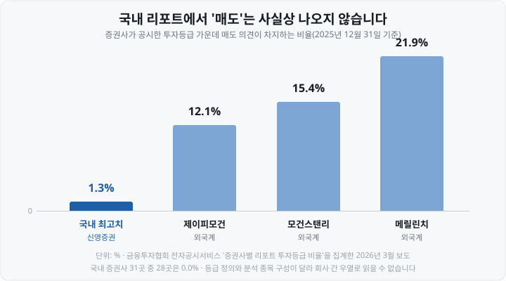

저는 투자를 시작하고 한동안 증권사 리포트를 이렇게 읽었습니다. 맨 윗줄의 **목표주가**만 보고, 현재주가보다 높으면 "오른다는 뜻이구나" 하고 창을 닫았습니다. 목표주가 120,000원에 현재주가 91,300원이면 <mark>30% 넘게 남았다고 계산했습니다.</mark>

나중에 알았습니다. 그 숫자는 예언이 아니라 **애널리스트가 세운 가정을 계산기에 넣은 결과였습니다.** 어떤 배수를 썼는지, 그 회사의 '매수'가 무슨 뜻으로 쓰이는지, 과거에 낸 목표주가가 얼마나 빗나갔는지가 전부 리포트 안에 적혀 있었는데도 저는 첫 줄만 읽고 있었던 거죠.

오늘은 리포트의 각 칸이 무엇을 뜻하는지, 그 숫자를 얼마나 믿을 수 있다고 알려진 통계가 있는지, 어디서 무료로 볼 수 있는지를 규정과 연구자료로 정리해 보겠습니다.

&nbsp;

【① 리포트 첫 장에 적힌 다섯 가지】

기업분석 리포트의 첫 장은 대체로 이렇게 구성됩니다.

| 항목 | 뜻 | 함께 볼 것 |
| :--- | :--- | :--- |
| **투자의견** | 매수·중립·매도 등 등급 | 그 증권사의 **등급 정의**(회사마다 다름) |
| **목표주가** | 통상 12개월 뒤를 겨냥한 적정주가 추정치 | 어떤 **배수·가정**으로 계산했는지 |
| **현재주가** | 리포트 작성 기준일의 종가 | **발간일** — 오래된 리포트면 전제가 이미 바뀜 |
| **실적 추정표** | 매출·영업이익·EPS 등 향후 전망 | **(E)·(F) 표기** — Estimate(추정)·Forecast(전망), 확정치가 아니라 추정치 |
| **투자등급 비율·괴리율** | 그 증권사의 등급 분포와 목표주가 적중 이력 | 규정상 **의무 표시 항목** |

투자의견 옆에는 **'유지'(Maintain)나 '상향·하향'(Upgrade·Downgrade)** 꼬리표가 붙습니다. 저는 이 꼬리표가 등급 자체보다 정보량이 많다고 봅니다. 반년 전에도 매수였던 종목의 '매수 유지'와, 어제까지 중립이었다가 오늘 매수로 올라간 것은 <mark>전혀 다른 사건이니까요.</mark> 앞은 반년 동안 판단이 바뀌지 않았다는 뜻이고, 뒤는 어제와 오늘 사이에 판단을 바꿀 만한 일이 생겼다는 뜻입니다. 새로 생긴 정보는 '매수'라는 등급이 아니라 등급이 움직였다는 사실 쪽에 담겨 있는 셈이죠. 그래서 '상향'이 붙은 리포트는 무엇이 바뀌었는지(실적 추정을 올렸나, 적용한 배수를 올렸나)를 본문에서 찾아볼 값이 있고, '유지'는 시장이 이미 아는 의견의 재확인일 수 있습니다.

참고로 아무나 리포트를 쓸 수 있는 것은 아닙니다. 조사분석자료를 작성하거나 심사·승인하는 인력은 **금융투자분석사로** 금융투자협회에 등록돼 있어야 합니다. 우리가 '애널리스트'라 부르는 직함의 제도적 이름입니다.

&nbsp;

【② '매수'는 증권사마다 다른 뜻입니다】

제가 가장 늦게 깨달은 부분입니다. **투자의견 등급의 기준은 법으로 통일돼 있지 않습니다.** 각 증권사가 스스로 정해 공시합니다.

2026년 8월 기준으로 두 회사의 공시 기준을 나란히 놓으면 이렇습니다.

| 구분 | 교보증권 | 한화투자증권 |
| :--- | :--- | :--- |
| 기준 | **코스피 대비** 기대수익률(상대) | **절대수익률** |
| 투자기간 | 6개월 | 12개월 |
| 매수(Buy) | +10% 이상 | +10% 이상 |
| 중간 등급 | Trading Buy(초과수익 기대되나 불확실성 높음) | 없음 |
| 보유(Hold) | -10% ~ +10% | -10% ~ +10% |
| 매도(Sell) | -10% 이하 | -10% 이하 |

차이가 보이시나요. 한쪽은 <mark>지수 대비</mark>입니다. 코스피가 20% 빠지고 그 종목이 12% 빠져도 '매수' 조건을 만족합니다. 다른 쪽은 **절대수익률이라** 주가 자체가 올라야 매수가 됩니다. 투자기간도 6개월과 12개월로 두 배 차이죠.

**Trading Buy**라는 등급도 있습니다. "오를 것 같은데 불확실성이 크다"는 의견이라, 이름에 Buy가 들어 있어도 순수한 매수 의견과는 다릅니다.

▶ 그래서 리포트를 볼 때 <mark>맨 뒷장의 '투자등급 관련 사항' 고지를 한 번은 읽어야 합니다.</mark> 등급 정의가 거기 적혀 있고, 실은 **'투자등급의 의미'를 적는 것 자체가 규정상 의무입니다**(금융투자협회 규정 제2-33조 제3항 제1호). 다른 회사의 '매수'와 그대로 비교하면 안 됩니다.

&nbsp;

【③ 매수 의견이 10건 중 9건인 이유】

통계를 보겠습니다. 자본시장연구원이 **2000~2024년 25년간 국내 애널리스트 보고서 735,162건**(증권사 43곳·애널리스트 2,601명·대상기업 2,713곳)을 분석한 보고서가 2026년 5월 4일 나왔습니다.

| 기간 | 매수·적극매수 의견 비중 |
| :--- | ---: |
| 2000년대 | **67.3%** |
| 2010년대 | **89.6%** |
| 2020~2024년 | **93.1%** |

25년 사이에 <mark>67%에서 93%로 올라갔습니다.</mark> 지금 리포트를 무작위로 열면 열 건 중 아홉 건 이상이 매수 의견인 셈입니다.

같은 보고서는 이 낙관성의 배경으로 **이해상충 요소를** 지적합니다. 증권사 수익에 대한 기여도, 그리고 분석 대상 기업과의 우호적 관계 유지입니다. 리서치센터가 **IB**(Investment Banking, 기업금융)와 위탁매매 수익에 기대는 구조에서 분석 대상 기업에 부정적 의견을 내기 어렵다는 지적은 국내에서 오래 반복돼 온 이야기입니다.

&nbsp;

【④ 매도 리포트가 사라진 자리】

이 편향을 가장 선명하게 보여 주는 숫자가 **매도 의견 비율입니다.**

금융투자협회 전자공시서비스의 '증권사별 리포트 투자등급 비율'을 집계한 2026년 3월 보도에 따르면, **2025년 12월 31일 기준** 국내 증권사 31곳 중 <mark>매도 비율이 0.0%인 곳이 28곳이었습니다.</mark>

매도 의견이 조금이라도 있던 국내 증권사는 세 곳(신영증권 1.3%, DS투자증권 0.6%, 메리츠증권 0.6%)이었고, 반대로 **매수 비율이 100.0%인 회사도** 네 곳 있었습니다.

⚠️ 이 숫자는 **증권사의 실력이나 신뢰도 순위가 아닙니다.** 앞에서 본 것처럼 등급 정의가 회사마다 다르고 분석 대상 종목 구성도 달라서, 비율을 그대로 우열로 읽을 수는 없습니다. 다만 <mark>'매도'라는 결론이 국내 리포트에서 사실상 나오지 않는다는 사실 자체는</mark> 읽는 사람이 알고 있어야 하는 전제입니다.

그래서 실전에서 중요한 건 이 대목입니다. 매도 의견이 없는 시장에서는 **부정적 신호가 등급이 아니라 다른 칸에 담깁니다.** 등급은 '매수'로 두면서 목표주가만 낮추는 경우가 대표적이죠. <mark>등급보다 목표주가의 변동 방향이 더 정직한 신호일 수 있습니다.</mark> 리포트 검색 서비스들이 '목표주가 상향·유지·하향' 필터를 따로 두는 이유입니다.

&nbsp;

【⑤ 목표주가는 예측이 아니라 계산의 결과입니다】

목표주가는 통상 이런 순서로 만들어집니다.

▶ ① 향후 실적을 추정한다(내년 영업이익, **EPS**(Earnings Per Share, 주당순이익) 등)
▶ ② 그 실적에 **배수를 적용한다**(예: 목표 **PER**(Price Earnings Ratio, 주가수익비율) 12배)
▶ ③ 나온 값을 목표주가로 제시한다

그래서 볼 것은 숫자 자체가 아니라 **②의 배수를 어디서 가져왔는지입니다.** 과거 평균인지, 경쟁사 평균인지, 업황이 좋았던 시기의 값인지에 따라 결과가 크게 달라집니다. 리포트 본문의 밸류에이션 표에 근거가 적혀 있습니다.

이 추정이 실제와 얼마나 벌어지는지도 같은 보고서가 계산해 두었습니다.

| 지표 | 값 | 기간 |
| :--- | ---: | :--- |
| 목표주가 기준 **예상수익률** 평균 | **33.91%** | 2015~2024년 |
| 실제 **실현수익률** 평균 | **4.07%** | 2015~2023년 |
| 예측오차 절댓값 평균 | **45.22%** | — |

이름이 비슷해 헷갈리기 쉬운 세 지표라, 보고서가 밝힌 계산 방식대로 풀어 보겠습니다.

| 지표 | 무엇을 재는 값인가 | 어떻게 계산하나 |
| :--- | :--- | :--- |
| **예상수익률** | 애널리스트가 기대한 상승률 — 목표주가가 그때 주가보다 몇 % 높았나 | 목표주가 ÷ 발표 직전 주가(발표 2거래일 전 종가) − 1 |
| **실현수익률** | 그 뒤 주가가 실제로 몇 % 움직였나 | 리포트가 가정한 투자기간이 끝난 시점의 주가 변화율 |
| **예측오차** | 목표주가가 실제 주가와 얼마나 떨어져 있었나 | 목표주가 ÷ 투자기간 종료 시점 주가 − 1 |

리포트 한 건으로 옮겨 보면 이런 이야기입니다(숫자는 이해를 돕기 위한 가상 예시입니다).

| 단계 | 숫자 | 그때 계산되는 지표 |
| :--- | :--- | :--- |
| 발표 직전 주가 | 100,000원 | — |
| 리포트가 제시한 목표주가 | 130,000원 | **예상수익률 +30%**(130,000 ÷ 100,000 − 1) |
| 투자기간이 끝난 날의 실제 주가 | 105,000원 | **실현수익률 +5%**(105,000 ÷ 100,000 − 1) |
| 목표주가와 실제 주가의 거리 | 130,000원 vs 105,000원 | **예측오차 +23.8%**(130,000 ÷ 105,000 − 1) |

▶ **예상수익률 33.91%** = 리포트들이 평균적으로 "지금 주가보다 34% 위"를 목표주가로 적었다는 뜻입니다.
▶ **실현수익률 4.07%** = 그 리포트들이 겨냥한 기간이 지난 뒤 주가가 실제로 움직인 폭의 평균입니다. <mark>기대는 34%, 결과는 4%로 약 30%p가 비었습니다.</mark>
▶ **예측오차 절댓값 45.22%** = 목표주가와 실제 주가가 평균 45% 떨어져 있었다는 뜻입니다. '절댓값'이 중요한데, 주가가 목표주가에 못 미친 리포트와 목표주가를 넘어선 리포트는 어긋난 방향이 반대라, 그냥 평균하면 서로 지워져 오차가 작아 보이기 때문에 **부호를 떼고 벌어진 거리만 평균한** 값입니다. 그래서 평균끼리의 차이(34% vs 4%)보다 큽니다 — 리포트를 한 건씩 놓고 보면 어긋난 폭이 그만큼 크다는 뜻이죠.

▶ 표의 기간이 1년 다른 이유도 여기 있습니다. 실현수익률과 예측오차는 리포트가 가정한 투자기간이 지나야 계산할 수 있어서, 가장 최근 리포트들은 아직 결과가 나오지 않았습니다.

정리하면 목표주가는 <mark>'도달할 가격'이 아니라 '어떤 가정에서 나온 숫자인가'로 읽어야 하는 값입니다.</mark>

최근 기간도 방향이 비슷합니다. **에프앤가이드** 집계를 인용한 2026년 8월 보도를 보면 **2026년 1월 1일~8월 12일** 사이 투자의견이 매수로 상향된 242개 종목 가운데 8월 12일 종가 기준으로 <mark>오른 것이 119개(49.2%), 내린 것이 122개(50.4%)였습니다.</mark> 절반은 반대로 간 셈이죠. 반면 투자의견이 하향된 114개 종목은 68.4%가 실제로 하락했습니다.

▶ **에프앤가이드(FnGuide)는 어떤 곳인가요.** 2000년에 설립된 국내 금융정보 회사입니다(코스닥 상장사). 증권사들이 리포트에 낸 실적 추정치를 종목별로 모아 평균(컨센서스)을 내고, 지수 개발·펀드평가 서비스도 합니다. 포털이나 증권사 화면에서 보는 '컨센서스·추정 실적' 숫자는 이런 집계 회사가 만든 데이터인 경우가 많습니다. 뒤의 ⑦에서 다시 나옵니다.

▶ 참고로 언론에 자주 나오는 '목표주가 달성률'은 이 글에 싣지 않았습니다. 자료마다 달성의 정의(12개월 내 도달인지, 특정 시점 종가 기준인지)가 달라 값이 크게 다르기 때문입니다.

&nbsp;

【⑥ 규정이 강제하는 두 가지 — 등급 비율과 괴리율】

여기까지 보면 "믿을 근거가 없나" 싶은데, 제도가 마련해 둔 장치가 있습니다. **금융투자협회 「금융투자회사의 영업 및 업무에 관한 규정」이** 리포트에 두 가지를 의무적으로 싣게 합니다.

| 의무 항목 | 내용 | 근거 |
| :--- | :--- | :--- |
| **투자등급 비율** | 기준일로부터 **과거 1년간** 공표한 최근일 투자등급의 비율을 **3단계로 구분** 표시, 3개월마다 1회 이상 갱신 | 제2-33조 제5항 |
| **목표주가 괴리율** | **목표가격과 실제 주가(종가)의 변동추이 그래프** + 괴리율(목표가격 대비 차이의 백분율) 표시. 공표일부터 **과거 2년간**의 투자등급·목표가격 변동추이도 함께 게재 | 제2-33조 제3항 |

<mark>그 애널리스트가 과거에 낸 목표주가가 실제 주가와 얼마나 벌어졌는지가 리포트 뒷장에 이미 적혀 있다는 뜻입니다.</mark> 괴리율 공시는 금융감독원이 **2017년 9월** 도입했습니다. 다만 도입 1년 뒤를 비교한 보도에서는 평균 괴리율이 18.7%에서 20.6%로 오히려 커져, 제도만으로 낙관 편향이 교정되지는 않았다는 평가를 받았습니다.

이해상충을 막는 장치도 있습니다.

▶ 금융투자분석사는 리포트를 공표한 뒤 **24시간이 지나야** 그 상품을 매매할 수 있고, 공표일부터 7일 안에는 **공표 내용과 같은 방향으로만** 매매할 수 있습니다(제2-31조 제4항).
▶ 리포트에는 작성자의 **성명과 보유 재산적 이익의 세부내용**(종류·수량·취득가액)을 투자자가 쉽게 알아볼 수 있게 표시해야 합니다(제2-32조).

▶ 참고로 리서치 독립성을 더 강화하는 방안(매도 의견을 낸 애널리스트 보호장치 등)이 금융감독원에서 검토되고 있다는 보도가 2026년 5월 나왔습니다. 2026년 8월 현재 확정·시행된 제도는 아니라, 위 규정이 현행 기준입니다.

리포트 마지막 장의 깨알 글씨가 이 조항의 결과물입니다. 읽는 사람에게는 <mark>"이 사람이 이 종목을 갖고 있나"를 확인하는 칸이죠.</mark>

&nbsp;

【⑦ 실적 추정표와 컨센서스 읽는 법】

리포트의 본체는 첫 줄이 아니라 **실적 추정표입니다.** 대체로 이런 모양이에요.

| 항목 | 2024 | 2025 | 2026(E) | 2027(E) |
| :--- | ---: | ---: | ---: | ---: |
| 매출액 | 확정 | 확정 | 추정 | 추정 |
| 영업이익 | 확정 | 확정 | 추정 | 추정 |
| EPS | 확정 | 확정 | 추정 | 추정 |

<mark>**(E)** 또는 **(F)** 표기가 붙은 열이 추정치입니다.</mark> **(E)는** Estimate(추정), **(F)는** Forecast(전망)의 약자로, 어느 쪽을 쓰는지는 증권사·리포트마다 다를 뿐 뜻은 같습니다. 확정 실적과 추정치가 같은 표에 나란히 있어서, 표기를 놓치면 아직 벌지 않은 이익을 확정 숫자로 읽게 됩니다.

이 추정치를 여러 증권사에서 모아 평균한 것이 **컨센서스**(consensus, 시장 전망치)입니다. 에프앤가이드 같은 집계 기관이 일정 기간 안에 나온 추정치를 평균합니다. ⚠️ **집계 기간과 대상 증권사 기준은 기관마다 달라서** 같은 종목의 컨센서스가 서비스마다 조금씩 다를 수 있습니다.

컨센서스가 쓰이는 방식은 단순합니다. 발표된 실적을 컨센서스와 비교하는 것이죠.

▶ 실적이 컨센서스를 웃돌면 → **어닝 서프라이즈**(earnings surprise)
▶ 밑돌면 → **어닝 쇼크**(earnings shock)

그래서 실적이 작년보다 좋아졌는데도 주가가 빠지는 일이 생깁니다. 기준이 작년이 아니라 <mark>컨센서스이기 때문입니다.</mark> 시장은 이미 컨센서스만큼의 개선을 가격에 넣어 두고 있었던 셈이죠.

&nbsp;

【⑧ 리포트가 없는 종목이 더 많습니다】

리포트를 찾다가 마주치는 벽입니다. 앞의 보고서 기준으로 2024년에 리포트가 발간된 기업은 **전체 상장기업의 30%였고**, 시장별로는 <mark>코스피 44%, 코스닥 23%였습니다.</mark> 게다가 발간된 리포트의 **69%가** 시가총액 상위 200개 기업에 몰렸습니다.

리포트는 시장 전체를 비추는 조명이 아니라 **큰 종목 쪽에 몰려 있는 조명입니다.** 소형주에 리포트가 없다는 건 그 기업이 나쁘다는 뜻이 아니라, 애널리스트가 배정될 만한 거래 규모가 아니라는 뜻입니다. 그런 종목은 리포트 대신 공시 원문을 직접 읽어야 합니다.

&nbsp;

【⑨ 어디서 무료로 보나】

리포트는 대부분 무료로 볼 수 있습니다. 증권사 앱, 즉 **MTS**(Mobile Trading System, 모바일 주식거래 시스템) 안에도 리서치 메뉴가 있습니다. 2026년 8월 기준 경로입니다.

| 경로 | 볼 수 있는 것 | 특징 |
| :--- | :--- | :--- |
| **한경 컨센서스** | 기업·산업·시장·경제·파생 리포트 원문(PDF) | 목표주가 **상향·하향** 등 분류로 골라 보기 가능 |
| **네이버 증권 리서치** | 시황정보·투자정보·종목분석·산업분석·경제분석·채권분석 6종 | 당일 발간분이 바로 올라옴 |
| **각 증권사 홈페이지·MTS 리서치 메뉴** | 그 회사 리포트 전체 | 로그인이 필요한 곳도 있음 |
| **금융투자협회 전자공시** | **증권사별 리포트 투자등급 비율** | 앞에서 본 매수·중립·매도 비율의 원자료 |
| **DART 전자공시** | 기업의 실적 원문(사업보고서·잠정실적) | 추정치가 아닌 **확정 숫자**의 출처 |

무료 경로로 원문까지 열리니, 초보에게 부족한 건 접근권이 아니라 **읽는 순서라고 생각합니다.**

&nbsp;

【⑩ 리포트를 읽는 순서 — 일곱 칸 체크리스트】

| 순서 | 확인할 것 |
| :--- | :--- |
| 1 | **발간일** — 며칠 전 리포트인가, 그 사이 실적 발표나 급등락이 있었나 |
| 2 | **등급 정의** — 상대수익률인가 절대수익률인가, 투자기간은 6개월인가 12개월인가 |
| 3 | **꼬리표** — 유지인가 상향·하향인가, 목표주가는 함께 움직였나 |
| 4 | **목표주가의 배수** — 어떤 PER·배수를 어디서 가져왔나 |
| 5 | **실적 추정표의 (E)·(F)** — 어디까지가 확정이고 어디부터가 추정인가 |
| 6 | **투자등급 비율·괴리율** — 매도 비율은 얼마이고 과거 목표주가는 얼마나 빗나갔나 |
| 7 | **본문의 리스크 요인** — 리포트가 스스로 밝힌 전제가 깨지는 조건 |

이 일곱 칸을 확인하면 리포트는 '사라·팔라'는 신호가 아니라 <mark>다른 사람의 가정을 열람하는 자료가 됩니다.</mark> 애널리스트가 어떤 가정을 세웠고 그 가정이 내 생각과 어디서 갈리는지를 보는 것이, 제가 생각하는 리포트 읽기의 실제 용도입니다.

&nbsp;

【정리】

▶ 리포트 첫 장의 다섯 칸 = 투자의견·목표주가·현재주가·실적 추정표·투자등급 비율(괴리율)
▶ 투자의견 등급 기준은 **통일돼 있지 않다** — 상대수익률·절대수익률, 6개월·12개월로 갈린다
▶ 매수 의견 비중은 2000년대 67.3% → 2010년대 89.6% → **2020~2024년 93.1%**
▶ 2025년 12월 31일 기준 국내 증권사 31곳 중 **28곳의 매도 비율이 0.0%**, 외국계는 12~22% 수준
▶ 목표주가는 실적 추정 × 배수의 결과 — 예상수익률 평균 33.91%, 실현수익률 평균 **4.07%**, 예측오차 절댓값 평균 45.22%(부호를 뗀 벌어진 폭)
▶ 규정상 **과거 1년 투자등급 비율**(3단계, 3개월 갱신)과 **목표주가 괴리율**이 리포트에 의무 표시된다
▶ 금융투자분석사는 공표 후 **24시간이 지나야** 매매 가능, 7일간은 공표 방향과 같게만
▶ 컨센서스는 증권사 추정치의 평균 — 실적이 작년보다 좋아도 컨센서스를 밑돌면 주가는 빠질 수 있다
▶ 리포트가 있는 기업은 상장사의 **30%**(코스피 44%·코스닥 23%), 69%가 시총 상위 200곳에 몰린다

&nbsp;

【다음 편에서는】

다음 글에서는 **동시호가**를 다룹니다. 장 시작 전 30분과 마감 전 10분에만 켜지는 단일가매매 구간에서 여러 사람의 주문이 어떻게 **하나의 가격으로 한꺼번에** 체결되는지, 예상체결가가 계속 바뀌는 이유, 그리고 "왜 내 지정가 주문은 체결되지 않았나"라는 질문의 답을 정리하겠습니다.

&nbsp;

【함께 보면 좋은 글】

▶ [주식 데이터 무료로 보는 곳 — KRX·금투협·DART 활용법](https://blog.naver.com/hdglace/224372833633) — 오늘 나온 무료 경로들을 화면별로 더 자세히 정리했습니다.

▶ [호가창 보는 법 — 매수·매도 잔량과 호가 단위가 뜻하는 것](https://blog.naver.com/hdglace/224364657994) — 목표주가 상향 리포트가 나온 아침의 호가창을 이해하는 데 필요한 기초입니다.

▶ [FOMC란 무엇인가 — 점도표·성명문에서 봐야 할 것](https://blog.naver.com/hdglace/224375094005) — 리포트의 전제(금리·환율)가 어디서 오는지 다뤘습니다.

▶ [괴리율이란 무엇인가 — ETF·ADR 가격이 '진짜 값'과 다른 이유](https://blog.naver.com/hdglace/224351030720) — 오늘 나온 '목표주가 괴리율'과 이름이 같지만 계산 대상이 다른 개념입니다.

&nbsp;

【📊 데이터 출처 및 기준일】

| 항목 | 내용 | 출처·기준일 |
| :--- | :--- | :--- |
| 투자등급 비율 표시 의무 | 과거 1년간 공표한 최근일 투자등급 비율을 3단계로 구분 표시, 3개월마다 갱신 | 금융투자협회 「금융투자회사의 영업 및 업무에 관한 규정」 제2-33조 제5항(2026년 8월 확인) |
| 목표주가 괴리율 표시 의무 | 목표가격과 주가(종가) 변동추이 그래프 및 괴리율 표시 | 같은 규정 제2-33조 제3항(2026년 8월 확인) |
| 등급 의미·2년 이력 게재 | 투자등급의 의미와 공표일부터 과거 2년간의 투자등급·목표가격 변동추이 게재 의무(제1호). 제2호 목표가격·주가 변동추이 그래프, 제3호 괴리율. 단순 투자의견만 제시한 자료는 적용 제외 | 같은 규정 제2-33조 제3항(2026년 8월 협회 원문 확인) |
| 리서치 독립성 강화 검토 | 매도 의견 애널리스트 보호장치 등 금감원 검토 보도 | 언론 보도(2026-05-22). ⚠️ **확정·시행 제도 아님, 시행 시점 미정** |
| 괴리율 공시제 도입 | 금융감독원 2017년 9월 도입. 도입 전후 1년 평균 괴리율 18.7% → 20.6% | 언론 보도(2018년 6·8월, 2019년 1월). 산출 기준은 보도 원문에 따름 |
| 공표 후 매매 제한 | 24시간 경과 후 매매 가능, 공표일부터 7일 내 같은 방향만 | 같은 규정 제2-31조 제4항(2026년 8월 확인) |
| 작성자 고지 | 성명·보유 재산적 이익 세부내용(종류·수량·취득가액) 표시 | 같은 규정 제2-32조(2026년 8월 확인) |
| 금융투자분석사 | 조사분석자료 작성·심사·승인 인력, 금융투자협회 등록. 자격제도는 2011년 2월부터 적용 | 협회·애널리스트회 안내(2026년 8월 확인) |
| 매수 의견 비중·수익률 통계 | 2000년대 67.3% / 2010년대 89.6% / 2020~2024년 93.1%, 예상수익률 33.91%(2015~2024년)·실현수익률 4.07%(2015~2023년)·예측오차 절댓값 45.22%, 표본 735,162건·애널리스트 2,601명·증권사 43곳·기업 2,713곳, 발간기업 비중 30%·상위 200개 집중도 69% | 자본시장연구원 연구보고서 26-06 「애널리스트의 낙관성, 정확성, 정보성」(김준석 선임연구위원, 2026-05-04). 지표 정의도 같은 보고서 기준 — 예상수익률 = 목표주가 ÷ 발표 2거래일 전 종가 − 1, 예측오차 = 목표주가 ÷ 가정된 투자기간 종료 시점 주가 − 1. 본문의 100,000·130,000·105,000원 예시는 계산 방식을 보이기 위한 가상 숫자 |
| 시장별 커버리지 | 코스피 44%·코스닥 23% | 위 보고서를 다룬 언론 보도(2026-05-04) |
| 매도 의견 비율 | 2025-12-31 기준 국내 31곳 중 28곳 0.0%, 신영증권 1.3%·DS투자증권 0.6%·메리츠증권 0.6%, 매수 100.0% 4곳, 외국계 메릴린치 21.9%·골드만삭스 16.3%·모건스탠리 15.4%·제이피모건 12.1% | 금융투자협회 전자공시서비스 '증권사별 리포트 투자등급 비율'을 집계한 보도(2026-03-18). 리포트 미발행 1곳 제외 |
| 에프앤가이드 회사 설명 | 2000년 설립 국내 금융정보 회사(코스닥 상장), 금융정보서비스·지수 개발·펀드평가, 증권사 추정치 집계 | 회사 소개·기업정보(2026년 8월 확인). 포털·증권사 화면의 컨센서스가 어느 기관 집계인지는 서비스마다 달라 특정하지 않음 |
| 투자의견 변경 종목의 실제 주가 | 2026-01-01~08-12, 매수 상향 242개 중 08-12 종가 기준 상승 119개(49.2%)·하락 122개(50.4%)·거래정지 1개, 하향 114개 중 하락 78개(68.4%) | 에프앤가이드 집계를 인용한 보도(2026-08-17) |
| 등급기준 예시 | 교보증권(코스피 대비, 6개월, 매수 10% 이상/Trading Buy/보유 -10~10%/매도 -10% 이하), 한화투자증권(절대수익률, 12개월, BUY +10% 이상/HOLD -10~+10%/SELL -10% 이하) | 각 사 공시 등급기준(2026년 8월 확인). 한화투자증권 공지에는 시행일이 없고 최신 리포트 고지면으로 재확인하지는 못함 — 등급 기준은 회사가 바꿀 수 있으니 리포트 고지면 확인 권장 |
| 무료 열람 경로 | 한경 컨센서스(기업·산업·시장·경제·파생 분류, 목표주가 상향·하향 등으로 골라 보기), 네이버 증권 리서치(6종), 금융투자협회 전자공시(투자등급 비율), DART | 각 서비스 2026-08-20 접속 확인. 세부 필터 항목은 접속 시점에 따라 다르게 보일 수 있음 |
| 컨센서스 | 증권사 실적 추정치의 평균. 집계 기관·기간 기준이 기관마다 다름 | 집계 서비스 안내(2026년 8월 확인). 특정 기관의 집계 기간은 숫자로 싣지 않음 |
| 목표주가 달성률 | 자료마다 19%, 30~35% 등으로 다르게 인용되고 **달성의 정의가 자료마다 달라** 본문에 싣지 않음 | — |

&nbsp;

⚠️ **면책 안내** — 이 글은 공개된 협회 규정·연구보고서·공시 통계·언론 보도를 정리한 **교육·정보 제공 목적**의 자료이며, 특정 종목·증권사·리포트의 매수·매도를 권유하거나 증권사 간 우열을 판단하지 않습니다. 본문에 인용한 투자등급 비율과 수익률 통계는 위에 밝힌 기준 시점의 값이며 이후 달라질 수 있습니다. 투자의견 등급 기준은 증권사마다 다르므로, 실제 리포트를 읽을 때 해당 리포트의 등급 정의와 고지 사항을 확인하시기 바랍니다. 투자 판단과 그 결과에 대한 책임은 투자자 본인에게 있습니다.

&nbsp;

#증권사리포트 #목표주가 #투자의견 #괴리율 #컨센서스 #애널리스트 #한경컨센서스 #어닝서프라이즈 #주식초보 #투자공부
