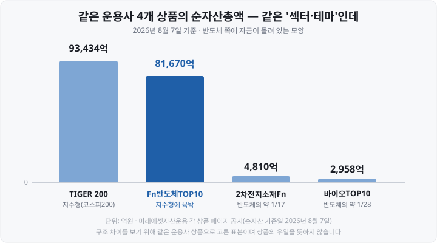
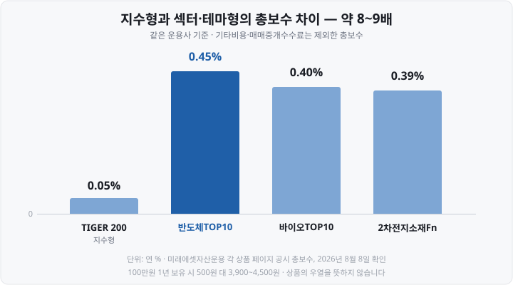
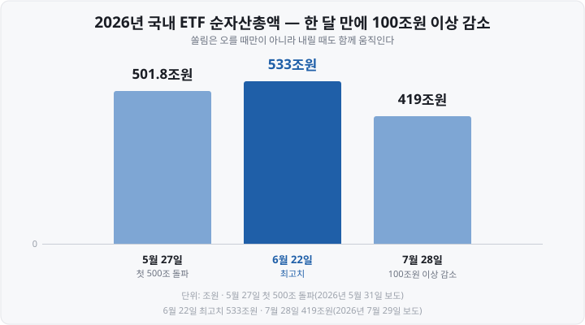

저는 처음에 **ETF**(Exchange Traded Fund, 상장지수펀드)를 "여러 종목을 담았으니 알아서 분산되는 상품"이라고 이해했습니다. 그래서 테마 ETF도 마음 편히 봤습니다. <mark>"어차피 여러 종목이니까"</mark> 하고요.

그런데 어느 날 제가 보던 반도체 ETF의 구성종목 탭을 열어 보고 놀랐습니다. **종목이 딱 10개**였고, <mark>그중 2개가 절반을 차지하고 있었습니다.</mark> 규칙상 각각 25%씩 배정되게 만들어진 상품이었습니다.

"ETF니까 분산"이라는 제 생각이 이 상품에는 통하지 않았던 겁니다. 오늘은 그때 제가 뒤늦게 배운 것 — **섹터와 테마의 차이, 그리고 사기 전에 확인할 세 가지 숫자**를 정리하겠습니다. 어느 산업이 유망하다는 이야기는 하지 않습니다.

&nbsp;

【'섹터'와 '테마'는 같은 말이 아닙니다】

겉보기엔 둘 다 "특정 분야에 투자하는 ETF"인데 <mark>분류의 근거가 다릅니다.</mark>

| 구분 | 섹터 ETF | 테마 ETF |
| :--- | :--- | :--- |
| 분류 근거 | **표준산업분류 체계** | **회사가 정의한 주제** |
| 누가 정하나 | 국제·국내 분류 기관 | 상품을 만드는 회사 |
| 경계 | 상대적으로 고정 | 회사마다 다를 수 있음 |
| 예시 | 반도체·헬스케어·금융 | AI·로봇·우주·2차전지 소재 |

**섹터**는 산업 분류 체계의 단위입니다. 세계에서 가장 널리 쓰이는 **GICS**(Global Industry Classification Standard, 글로벌산업분류기준)는 S&P와 MSCI가 함께 만들었고 <mark>11개 섹터 → 25개 산업군 → 74개 산업 → 163개 하위산업</mark>의 계층 구조입니다.

반면 **테마**는 그런 표준이 없습니다. "AI에 투자하는 ETF"라고 할 때 <mark>어디까지가 AI인지를 상품 만드는 쪽이 정합니다.</mark> 반도체 장비를 넣을지, 전력 인프라를 넣을지, 데이터센터를 넣을지가 회사마다 갈립니다.

그래서 **이름이 같아도 안에 든 종목이 다릅니다.** 제가 상품명만 보고 판단했던 게 바로 이 지점에서 틀렸습니다.

&nbsp;

【기초지수를 누가 만드나 — 이름 끝의 힌트】

ETF는 스스로 종목을 고르지 않고 **기초지수**를 따라갑니다. 국내 상품은 대체로 두 갈래입니다.

- **한국거래소(KRX) 산출** — KRX 반도체, KRX 바이오 TOP 10 등
- **민간 지수사업자 산출** — FnGuide 반도체TOP10, FnGuide 2차전지소재 등

<mark>상품명 끝에 'Fn'이 붙으면 FnGuide 지수를 쓴다는 표시입니다.</mark> 'KRX'·'MSCI'·'S&P' 같은 이름도 같은 힌트죠.

실제 상품으로 비교해 보겠습니다. 공정하게 보려고 **같은 운용사(미래에셋자산운용) 상품**으로 골랐습니다. 어느 게 낫다는 뜻이 아니라 **구조 차이를 보기 위한 표본**입니다.

| 상품 | 기초지수 | 상장일 | 총보수 | 순자산 |
| :--- | :--- | :--- | :--- | :--- |
| TIGER 200 | 코스피200(KRX) | 2008-04-03 | **0.05%** | 93,434억 |
| TIGER Fn반도체TOP10 | FnGuide | 2021-08-10 | **0.45%** | 81,670억 |
| TIGER 2차전지소재Fn | FnGuide | 2023-07-13 | **0.39%** | 4,810억 |
| TIGER 바이오TOP10 | KRX | 2020-10-07 | **0.40%** | 2,958억 |

(순자산은 모두 **2026년 8월 7일 기준**, 운용사 공시)

&nbsp;

【① 규모 — ETF끼리도 격차가 큽니다】

먼저 짚어 둘 게 있습니다. 반도체와 2차전지, 바이오는 <mark>서로 완전히 다른 산업입니다.</mark> 그런데도 셋을 묶어 비교하는 건 **상품이 만들어진 방식이 같은 유형**이기 때문입니다. 셋 다 "특정 산업 하나에 집중해 담은 ETF"라서, 시장 전체를 담는 지수형(TIGER 200)과는 다른 묶음으로 봅니다. 업종이 같다는 뜻이 아니라 <mark>상품 구조가 같은 계열이라는 뜻입니다.</mark>

그런데 이 같은 유형 안에서도 규모 차이가 큽니다. 반도체 상품 하나가 코스피200 상품에 육박하는데, 2차전지 소재는 <mark>그 약 17분의 1, 바이오는 약 28분의 1</mark>입니다.

규모를 봐야 하는 실질적인 이유가 둘 있습니다.

1. **거래가 잘 되는지** — 순자산이 작으면 거래량도 적은 경우가 많고, 매수·매도 호가 간격이 벌어져 사고파는 비용이 커집니다.
2. **상장폐지 가능성** — 뒤에서 볼 규정과 바로 연결됩니다.

&nbsp;

【② 비용 — 섹터·테마는 지수형보다 비쌉니다】

<mark>지수형 0.05%와 섹터·테마형 0.39~0.45%는 약 8~9배 차이입니다.</mark> 100만원을 1년 들고 있으면 500원 대 3,900~4,500원. 절대 금액은 작지만 금액이 커지고 기간이 길어지면 누적됩니다.

왜 더 비쌀까요. 담는 종목이 적고 지수 규칙이 복잡할수록 지수사용료·리밸런싱 부담이 커지는 구조입니다. 그리고 <mark>여기에 기타비용과 매매·중개수수료가 별도로 붙습니다.</mark> 좁은 시장을 담을수록 이 숨은 비용이 커지는 경향이 있습니다.

&nbsp;

【③ 집중도 — 제가 놀랐던 그 대목】

가장 중요한 항목입니다. 앞에서 말한 TIGER Fn반도체TOP10의 지수 규칙을 운용사 공시대로 옮기면 이렇습니다.

▶ 유가증권·코스닥 상장종목 중 반도체에 속하는 종목 가운데 **시가총액 상위 10종목**으로 구성하고, <mark>상위 2개 종목에 각각 25%씩</mark>, 나머지 8종목이 남은 50% 안에서 유동시가총액 가중으로 편입.

즉 <mark>단 2개 종목이 상품 절반을 차지하도록 규칙에 박혀 있습니다.</mark> 국내 반도체 시가총액 1·2위를 떠올리면, 이 상품은 "반도체 산업 전체"가 아니라 **두 대형주 + 8종목**에 가깝습니다.

종목 수 자체도 차이가 큽니다.

| 상품 유형 | 구성 종목 수 |
| :--- | :--- |
| 코스피200 지수형 | **200종목** |
| KRX 반도체 지수 기반 | **20종목** |
| 'TOP10' 계열 | **10종목** |

10종목 상품에서 비중 25%인 종목이 30% 하락하면 <mark>상품 전체가 7.5% 내려갑니다.</mark> 개별 종목 하나의 사고가 상품 전체를 흔든다는 뜻이죠.

⚠️ 그래서 확인 순서는 **①종목 수 → ②상위 2~3종목 비중 → ③지수 편입 규칙**입니다. 셋 다 운용사 상품 페이지와 투자설명서에 적혀 있습니다.

&nbsp;

【⚠️ 테마 ETF의 구조적 함정】

▶ **첫째, 테마 ETF는 테마가 뜨거워진 뒤에 상장됩니다.**

운용사도 사업이니 **자금이 몰릴 상품을 만듭니다.** 그래서 신규 테마 ETF의 상장 시점은 대개 그 테마가 이미 화제가 된 뒤입니다. 위 표에서 2차전지 소재 상품의 상장일이 2023년 7월인 것도 그 무렵 2차전지가 시장 최대 화제였던 국면과 겹칩니다.

나쁘다는 뜻이 아닙니다. 다만 <mark>"신규 테마 ETF가 많다"는 건 전망이 아니라 자금 흐름의 결과</mark>라는 걸 알고 볼 필요가 있습니다.

▶ **둘째, 쏠림은 급락장에서 되돌아옵니다.**

2026년 국내 ETF 시장이 이걸 그대로 보여 줬습니다.

5월 27일 처음 500조원을 넘어(501조 8,199억원) 6월 22일 533조원까지 올랐는데, <mark>7월 29일엔 400조원대로 한 달 남짓 사이 100조원 이상 줄었습니다.</mark> 5월 한 달 신규 상장이 32개로 역대 최다였고 5월 27일 하루에만 16개가 상장된 직후였습니다.

보도에 따르면 <mark>감소액이 큰 쪽에 반도체 관련 ETF와 레버리지 ETF가 함께 올랐습니다.</mark> 순자산은 자금이 빠질 때만 줄지 않습니다. **담고 있는 자산 가격이 내려가도 줄어듭니다.** 둘이 동시에 오면 감소 폭이 커지죠.

한 산업에 집중한 상품은 그 산업의 변동을 그대로, 때로는 더 크게 받습니다. <mark>그게 섹터·테마 ETF의 설계 목적이기도 합니다.</mark>

▶ **셋째, 작아지면 상장폐지될 수 있습니다.**

ETF도 상장폐지됩니다. 한국거래소 상장규정상 대표적인 사유는 둘입니다.

- **규모** — 상장 1년 지난 ETF의 순자산총액이 <mark>50억원 미만</mark>이 되고 다음 반기 말까지 해소되지 않으면 상장폐지 사유.
- **추적** — 1좌당 순자산가치와 기초지수 일간 변동률의 **상관계수가 0.9 미만인 상태가 3개월 지속**되면 상장폐지.

상장폐지되면 주식처럼 휴지가 되는 건 아니고 <mark>순자산가치에 따라 현금으로 정산</mark>받습니다. 다만 내가 원하지 않는 시점에 강제 청산된다는 점, 그 과정에서 세금·비용이 생길 수 있다는 점이 불편이죠. 유행이 지난 테마 ETF엔 남의 얘기가 아닙니다.

&nbsp;

【🔎 그래서 무엇을 보고 고르나】

ETF를 고를 때는 상품명만을 보는 대신 **아래 항목을 순서대로 확인**하는 게 좋습니다. 어떤 산업의 상품이든 같은 순서로 적용됩니다.

| 순서 | 확인 항목 | 어디서 |
| :--- | :--- | :--- |
| 1 | **기초지수 이름과 산출 주체** | 상품명·운용사 페이지·투자설명서 |
| 2 | **종목 수, 상위 2~3종목 비중** | 운용사 페이지 구성종목 탭 |
| 3 | **지수 편입 규칙**(비중 상한 여부) | 투자설명서·지수 산출 기준 |
| 4 | **순자산총액과 거래량** | 운용사 페이지·거래소 통계 |
| 5 | **총보수+기타비용+매매중개수수료** | 금융투자협회 전자공시서비스 |
| 6 | **상장일** | 운용사 페이지 |

제가 틀렸던 건 <mark>1번과 2번을 건너뛰고 상품명만 본 것</mark>이었습니다. "반도체 ETF"라는 이름만으로는 20종목인지 10종목인지, 상위 2종목이 절반인지 알 수 없습니다.

&nbsp;

【📝 오늘의 정리】

- **섹터는 표준산업분류(GICS 등), 테마는 회사가 정의합니다.** 이름이 같아도 내용이 다를 수 있습니다.
- **기초지수 산출 주체**는 한국거래소와 민간 지수사업자로 갈립니다('Fn' 표기 등이 힌트).
- **한 산업에 집중한 상품끼리도 규모 격차가 큽니다.** 2026년 8월 7일 기준 반도체 8조 1,670억 / 2차전지소재 4,810억 / 바이오 2,958억.
- **총보수는 지수형의 약 8~9배**(0.05% 대 0.39~0.45%), 여기에 기타비용이 별도.
- **집중도를 꼭 봅니다.** 'TOP10' 계열은 10종목, <mark>상위 2종목에 각 25%씩 배정되는 규칙</mark>도 있습니다.
- **테마 ETF는 대개 테마가 뜨거워진 뒤 상장됩니다.**
- **2026년 ETF 순자산**은 5월 27일 501.8조 → 6월 22일 533조 → 7월 29일 400조원대.
- **상장폐지 요건** — 순자산 50억원 미만(1년 경과 후, 다음 반기말까지) 또는 상관계수 0.9 미만 3개월.

다음 편에서는 **레버리지·인버스 ETF의 구조**를 다루겠습니다. 오늘이 "ETF가 무엇을 담는가"였다면, 다음은 "어떻게 담는가"입니다. 100만원짜리 펀드가 어떻게 200만원어치 움직임을 만드는지, 왜 '일간 수익률의 2배'라고 <mark>'일간'을 못 박아 두는지</mark> 풀어 보겠습니다.

&nbsp;

【🔗 함께 보면 좋은 글】

- [ETF란 무엇인가 — 주식도 펀드도 아닌, 초보에게 가장 쉬운 시작](https://blog.naver.com/hdglace/224350308437) — ETF의 기본 구조부터
- [코스피200·S&P500·나스닥100 ETF 비교 — 지수를 통째로 산다는 것](https://blog.naver.com/hdglace/224358137869) — 오늘 비교 대상이던 '지수형'
- [ETF 총보수와 세금 — 실제로 내 수익에서 얼마가 빠지나](https://blog.naver.com/hdglace/224367512124) — 총보수 밖의 숨은 비용
- [호가창 보는 법 — 매수·매도 잔량과 호가 단위가 뜻하는 것](https://blog.naver.com/hdglace/224364657994) — 거래량이 적을 때 벌어지는 일

&nbsp;

【📊 데이터 출처 및 기준일】

| 항목 | 수치 | 출처·기준일 |
| :--- | :--- | :--- |
| GICS 계층 구조 | 11개 섹터·25개 산업군·74개 산업·163개 하위산업 | GICS 소개 및 국내 운용사·증권사 해설, 2026년 8월 확인 |
| TIGER 200 | 총보수 0.05%, 순자산 93,434억, 코스피200, 상장 2008-04-03 | 미래에셋자산운용 상품 페이지, 순자산 기준일 2026-08-07 |
| TIGER Fn반도체TOP10 | 총보수 0.45%, 순자산 81,670억, FnGuide 반도체TOP10, 상장 2021-08-10 | 미래에셋자산운용 상품 페이지, 순자산 기준일 2026-08-07 |
| TIGER 2차전지소재Fn | 총보수 0.39%, 순자산 4,810억, FnGuide 2차전지소재, 상장 2023-07-13 | 미래에셋자산운용 상품 페이지, 순자산 기준일 2026-08-07 |
| TIGER 바이오TOP10 | 총보수 0.40%, 순자산 2,958억, KRX 바이오 TOP 10, 상장 2020-10-07 | 미래에셋자산운용 상품 페이지, 순자산 기준일 2026-08-07 |
| 반도체TOP10 지수 규칙 | 상위 10종목, 상위 2종목 각 25%, 하위 8종목이 나머지 50% 내 유동시총 가중 | 미래에셋자산운용 상품 페이지, 2026년 8월 확인 |
| KRX 반도체 지수 | 국내 반도체 대표 20개 종목 | 한국거래소 지수 설명 및 운용사 자료 |
| ETF 순자산 500조 돌파 | 2026-05-27 501조 8,199억, 5월 신규 상장 32개(역대 최다) | 디지털타임스 2026년 5월 31일 보도 |
| ETF 순자산 감소 | 2026-06-22 최고 533조 → 07-29 400조원대(100조원 이상 감소) | 서울경제 2026년 7월 29일 보도 |
| ETF 상장폐지 요건 | 순자산 50억원 미만(1년 경과 후, 다음 반기말) / 상관계수 0.9 미만 3개월 | 한국거래소 상장규정 관련 해설, 2026년 8월 확인 |

**계산 예시**(비중 25% 종목이 30% 하락 → 상품 7.5% 하락, 100만원 보유 시 보수 금액)는 위 수치를 근거로 한 자체 계산이며 특정 상품의 실제 수익률이 아닙니다. 7월 29일 순자산은 보도상 '400조원대'로만 제시돼 그래프 막대는 개략치입니다.

&nbsp;

⚠️ **면책 안내** — 이 글은 공개된 상품 공시·거래소 규정·보도를 정리한 **교육·정보 제공 목적**의 자료이며, 특정 종목·산업·상품의 매수·매도를 권유하거나 상품 간 우열을 판단하지 않습니다. 본문의 네 개 상품은 구조 차이를 설명하기 위해 같은 운용사 상품 중에서 고른 표본이고, 유사한 상품이 다수 있습니다. 순자산·수익률·총보수는 시점에 따라 변하고 총보수는 운용사 공지로 변경될 수 있으니 투자 전 최신 공시를 확인하시기 바랍니다. 투자 판단과 그 결과에 대한 책임은 투자자 본인에게 있습니다.

&nbsp;

#섹터ETF #테마ETF #반도체ETF #2차전지ETF #바이오ETF #ETF총보수 #ETF구성종목 #투자공부 #주식초보 #재테크
