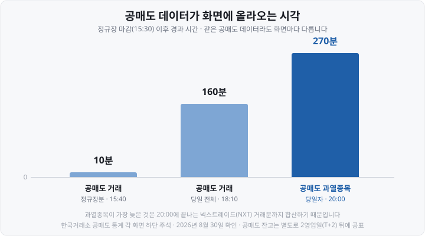
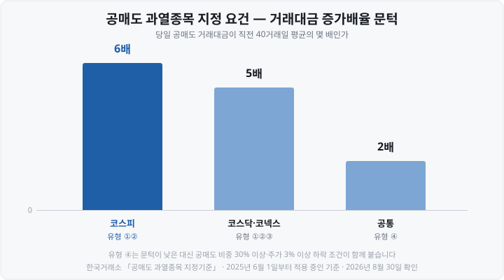

공매도가 뉴스에 오를 때마다 저도 "내 종목은 공매도 잔고가 얼마나 쌓였을까" 싶어 검색해 본 적이 여러 번입니다. 그런데 검색해서 나온 **공매도 종합포털** 주소를 누르면 <mark>포털이 아니라 다른 화면으로 넘어가고, 로그인부터 하라는 안내가 뜹니다.</mark>

처음엔 사이트가 없어진 줄 알았습니다. 알고 보니 없어진 게 아니라 **자리를 옮긴 것**이었습니다. 그리고 옮겨진 자리에서 만나는 숫자들이 생각보다 까다로웠습니다. 비슷해 보이는 '비중'이 두 개인데 뜻이 완전히 다르고, 화면마다 최신 데이터의 날짜가 달랐습니다.

오늘은 그 화면들을 어디서 열고, 각 숫자가 정확히 무엇을 센 값인지 정리해 보겠습니다. 공매도 제도 자체는 예전 글에서 다뤘으니, 이 글은 **데이터를 읽는 법**에만 집중하겠습니다.

&nbsp;

【💡 공매도 종합포털은 어디로 갔나】

결론부터 적으면 이렇습니다.

<mark>**short.krx.co.kr**로 들어가면 **data.krx.co.kr**의 「개별종목 공매도 종합정보」 화면으로 자동 연결됩니다.</mark> 2026년 8월 30일 확인 기준으로 이 연결은 그대로 작동합니다. 옛 주소를 즐겨찾기 해 두셨다면 지울 필요는 없고, 도착지가 달라졌을 뿐입니다.

다만 도착해도 **바로 데이터가 보이지는 않습니다.** 한국거래소 데이터 포털은 2025년 12월 27일 개편으로 이름이 **KRX Data Marketplace**로 바뀌면서 <mark>조회에 로그인이 필요해졌습니다.</mark> 같은 날 확인해 보니, 로그인하지 않으면 "로그인 또는 회원가입이 필요합니다"라는 안내만 뜹니다.

회원가입은 **무료**입니다. 네이버·카카오 계정으로 할 수 있고 조회도 종전대로 무료입니다. 유료는 `데이터 상품` 메뉴에 따로 모여 있습니다. "로그인 없이 볼 수 있다"고 안내하는 글이 아직 많은데, 그건 개편 전에 쓰인 글입니다.

&nbsp;

【💡 공매도 데이터는 다섯 묶음】

로그인한 뒤 `[통계] → [공매도 통계]`로 들어가면 화면이 다섯 묶음으로 갈라집니다. 이 구조만 알아 두면 원하는 숫자를 훨씬 빨리 찾습니다.

▶ **공매도 종합정보** — 개별종목 공매도 종합정보 (한 종목의 거래와 잔고를 한 화면에서)
▶ **공매도 거래** — 개별종목 / 개별업종 / 투자자별 / 거래 상위 50종목
▶ **공매도 순보유잔고** — 개별종목 / 개별업종 / 대량보유자 / 잔고 상위 50종목
▶ **공매도 과열** — 공매도 과열종목 / 공매도 과열종목 지정기준
▶ **공매도 제도** — 공매도 의의 / 관리방안 / 규제연혁 / 법령체계 / Q&A

많이들 찾으시는 <mark>"공매도 순위"에 해당하는 화면은 두 개</mark>입니다. `공매도 거래 상위 50종목`(오늘 많이 판 종목)과 `공매도 순보유잔고 상위 50종목`(잔고가 많이 쌓인 종목). **둘은 다른 순위입니다.**

&nbsp;

【💡 ① 종합정보 화면 — 컬럼이 왜 이렇게 많을까】

`개별종목 공매도 종합정보`는 종목 하나를 넣으면 거래와 잔고를 함께 보여 줍니다. 저도 처음 열었을 때 컬럼이 너무 많아 눈이 튕겼는데, 실은 세 덩어리입니다.

▶ **공매도 거래** : 공매도 수량 · 공매도 금액 (각각 전체 / 업틱룰적용 / 업틱룰예외)
▶ **비교용** : 그 종목의 거래량 · 거래대금
▶ **공매도 잔고** : 순보유잔고수량 · 순보유잔고금액

여기서 제가 가장 오래 헷갈렸던 게 **업틱룰적용**과 **업틱룰예외**로 갈린 컬럼이었습니다.

**업틱룰**(uptick rule)은 공매도 주문을 직전 체결가보다 낮은 값에 낼 수 없게 막는 규칙입니다. 거래소 설명을 그대로 옮기면, 공매도 호가는 원칙적으로 "직전가격 보다 1 호가 높은 가격으로 제출"해야 합니다. 다만 가격이 오르는 중이라면 직전가격 그대로도 낼 수 있습니다.

그런데 여기에 **예외**가 있습니다. 거래소가 밝힌 예외 사유는 지수차익거래·주식차익거래·**DR**(Depositary Receipt, 주식예탁증권) 차익거래, ETF·ETN 매도, **ELW**(Equity Linked Warrant, 주식워런트증권) 유동성공급호가, 각종 **LP**(Liquidity Provider, 유동성공급자)와 **MM**(Market Maker, 시장조성자)의 헤지거래입니다.

<mark>즉 '업틱룰예외' 숫자는 대체로 '주가 하락에 건 공매도'가 아니라 차익거래·헤지 목적의 기계적인 매도입니다.</mark> 공매도 수량 전체만 보고 "이만큼이 하락 베팅"이라고 읽으면 부풀려 읽는 셈입니다.

⚠️ 참고로 **ETF·ETN·ELW는 업틱룰 구분값이 제공되지 않습니다.** 조회하면 전체 수량만 나옵니다.

&nbsp;

【💡 거래 비중과 잔고 비중은 아예 다른 숫자】

이 글에서 가장 중요한 대목입니다. 두 화면 모두 '비중'이라는 컬럼이 있는데, **재는 대상이 다릅니다.**

▶ **공매도 거래 비중** = 공매도 거래대금 ÷ 그 종목 거래대금
　→ 오늘 하루 거래 중 공매도가 차지한 몫 / 최신 데이터는 **당일**

▶ **공매도 잔고 비중** = 공매도 순보유잔고수량 ÷ 상장주식수
　→ 지금까지 쌓여 아직 안 갚은 몫 / 최신 데이터는 **2영업일 전**

분모가 하나는 거래대금, 하나는 상장주식수입니다. 그래서 <mark>두 숫자는 애초에 크기를 견줄 수 없습니다.</mark> "거래 비중은 5%인데 잔고 비중은 1%뿐이네"라는 문장은 성립하지 않습니다.

&nbsp;

【💡 잔고에는 '작은 공매도'가 안 잡힙니다】

집계 범위 차이가 특히 중요합니다.

공매도 잔고는 거래소가 직접 센 값이 아니라, <mark>투자자가 **보고한** 값을 종목별로 합산한 것</mark>입니다. 자본시장법 제180조의2에 따라 보고의무는 순보유잔고가 음수이면서 다음 중 하나일 때 생깁니다.

▶ 상장주식수의 **0.01% 이상** (단, 평가액 1억원 미만은 제외)
▶ 평가액 **10억원 이상**

기준에 못 미치는 잔고는 **아예 집계되지 않습니다.** 거래소 Q&A에 실린 예가 명쾌합니다.

> 0.009%의 공매도잔고를 보유한 A 투자자가 오늘(T) 추가적인 공매도거래를 하여 0.012%의 공매도잔고를 보유하게 되었다면, T일 이전에는 A 투자자의 공매도잔고는 집계되지 않다가, T일 공매도잔고부터 A투자자의 공매도잔고 0.012%가 집계되기 시작합니다.

오늘 공매도한 양은 0.003%포인트인데 잔고는 0.012%포인트가 통째로 늘어납니다. <mark>공매도 거래 증가분보다 잔고 증가분이 더 커 보이는 날</mark>이 있는 이유가 이것입니다. 누가 몰래 대량으로 판 게 아닙니다.

반대로 **갚은 물량은 따로 표시되지 않습니다.** 공매도한 주식을 되사서 갚는 걸 상환매수라고 하는데, <mark>매수 주문에는 "이건 상환매수"라고 밝힐 의무가 없습니다.</mark> 법이 공매도라는 행위를 규제해서 매도 호가에만 표시 의무가 있기 때문입니다. 거래소도 잔고 추이의 감소로 간접 확인하라고 안내합니다.

&nbsp;

【💡 화면마다 올라오는 시각이 다릅니다】

같은 시각에 조회해도 화면마다 최신 데이터 기준이 다릅니다. 각 화면 하단 주석에 적혀 있는 값입니다.

거래 데이터가 두 번에 나눠 올라오는 건 **시간외 거래** 때문입니다. 15:40에 뜨는 건 정규장분만이고, 시간외까지 더한 당일 전체는 18:10 이후에 채워집니다. 저녁 일찍 본 숫자와 다음 날 아침 숫자가 다른 이유입니다.

과열종목만 20:00으로 늦은 건 <mark>2025년 3월 4일 출범한 대체거래소 **넥스트레이드**(NXT)의 애프터마켓이 20:00에 끝나기 때문</mark>입니다. 같은 날짜부터 KRX 공매도 통계는 **KRX와 NXT를 합산해서** 제공합니다.

잔고는 성격이 다릅니다. 보고의무 발생일(T)로부터 **2영업일(T+2)까지** 보고하게 되어 있어, <mark>오늘 화면에는 2영업일 전 잔고까지만 보입니다.</mark> T+2일 18시 이후 신규·정정 보고가 들어오면 이미 공표된 값이 바뀔 수도 있습니다. **공매도 잔고는 실시간 지표가 아니라 며칠 지난 사진입니다.**

참고로 "기관·외국인은 실시간으로 본다"는 이야기는 거래소가 Q&A에서 직접 부정한 오해입니다. 공매도 거래현황은 <mark>장 종료 후 집계해 모두에게 같은 시점에 공개</mark>되며, 일본·홍콩·호주·미국도 실시간 제공 사례는 없다고 밝히고 있습니다.

&nbsp;

【💡 ② 대량보유자 화면 — 여기엔 '이름'이 나옵니다】

`공매도 순보유잔고 대량보유자`는 성격이 다릅니다. 종목별 합계가 아니라 <mark>공시의무가 생긴 투자자의 성명(법인명)·국적·주소가 그대로 뜹니다.</mark> 자본시장법 제180조의3에 따른 공시입니다.

여기서 꼭 알아야 할 두 가지가 있습니다.

**첫째, 2024년 12월 1일부터 공시 기준이 크게 낮아졌습니다.**

▶ 2024년 11월 30일까지 : 상장주식수의 **0.5% 이상**
▶ 2024년 12월 1일부터 : 상장주식수의 **0.01% 이상**(1억원 미만 제외) 또는 평가액 **10억원 이상**

<mark>이건 데이터를 읽을 때 함정이 됩니다.</mark> 이 화면에서 2024년과 2026년을 나란히 놓고 "공시된 투자자가 몇 배로 늘었다"고 읽으면 안 됩니다. 늘어난 건 공매도가 아니라 **그물코**입니다. 시계열을 보려면 2024년 12월 1일에서 끊어야 합니다.

**둘째, 헤지펀드 이름 대신 증권사 이름이 보이는 경우가 많습니다.** 일부 투자자는 증권사와 **TRS**(Total Return Swap, 총수익스왑) 계약을 맺고 손익만 정산받는 방식으로 공매도합니다. 실제 주문을 낸 주체가 증권사라서, <mark>공시에도 증권사 이름이 오릅니다.</mark> 그 증권사가 자기 판단으로 베팅했다는 뜻은 아닙니다.

&nbsp;

【💡 ③ 과열종목 화면 — 어제 걸린 종목과 그 기준】

`공매도 과열종목` 화면은 **적출일**(요건에 걸린 날)과 **공매도 거래제한일**(그래서 공매도가 금지되는 날)을 함께 보여 줍니다. 지정되면 다음 거래일 공매도가 제한되고, <mark>금지된 날에 주가가 5% 이상 더 떨어지면 다음 거래일까지 자동 연장</mark>됩니다.

옆에 붙은 `공매도 과열종목 지정기준` 화면에 요건표가 있습니다. 2025년 6월 1일부터 적용 중인 기준입니다.

▶ **코스피 ①** 주가 −5%~−10% + 공매도 비중이 직전분기 코스피 구성종목 비중의 3배 이상(상한 20%) + 거래대금 6배 이상
▶ **코스피 ②** 주가 −10% 이상 하락 + 거래대금 6배 이상
▶ **코스닥·코넥스 ①②** 위와 같되 코스닥150 기준 + 거래대금 5배 이상
▶ **코스닥 ③** 직전 40거래일 공매도비중 평균 5% 이상 + 거래대금 5배 이상
▶ **공통 ④** 주가 −3% 이상 하락 + 당일 공매도 비중 30% 이상 + 거래대금 2배 이상

'거래대금 증가배율'은 **당일 공매도 거래대금이 직전 40거래일 평균의 몇 배인가**입니다. 시장마다 문턱이 다릅니다.

유형 ④의 문턱(2배)이 낮아 보이지만 **공매도 비중 30% 이상**이라는 조건이 함께 걸려 있어 실제로는 통과하기 쉽지 않습니다. 배율 하나만 떼어 읽으면 안 되는 이유입니다.

⚠️ **과열종목으로 지정됐는데 그날 공매도가 찍혀 있다면** 오류가 아닙니다. 거래소는 과열종목이라도 <mark>주식시장 LP·MM 호가, ETF·ETN·ELW LP의 헤지거래 호가, 파생상품시장 MM의 헤지거래 호가는 예외로 허용</mark>합니다. 유동성 공급 의무를 지려면 헤지가 필수이기 때문입니다.

&nbsp;

【💡 대차잔고는 이 포털에 없습니다】

"공매도 대기 물량"이라며 자주 인용되는 **대차잔고**는 거래소 공매도 통계에 들어 있지 않습니다. 집계하는 곳이 따로 있습니다.

▶ **대차거래 추이·상위 종목** — 금융투자협회 FreeSIS (freesis.kofia.or.kr), `증시자금/신용공여` 아래
▶ **종목별 대차거래 현황** — 한국예탁결제원 세이브로 (seibro.or.kr), `주식대차 → 종목별대차거래현황`

그런데 여기서 가장 흔한 오해가 생깁니다. <mark>대차잔고가 늘었다고 그만큼 공매도가 대기 중인 건 아닙니다.</mark> 거래소가 Q&A에서 이유를 두 가지로 정리해 두었습니다.

**첫째, 대차거래의 목적이 공매도만이 아닙니다.** ETF 설정, **Repo**(환매조건부매매)에 필요한 증권 조달, 결제불이행 부족분 충당 등에 쓰입니다. 거래소가 든 예는 이렇습니다 — 대차잔고가 1,000주 늘었는데 600주는 ETF 설정용, 50주는 결제 충당용이라면 <mark>실제 공매도 대기 수량은 350주</mark>입니다.

**둘째, 중복 집계됩니다.** 증권사 A가 100주를 빌린 뒤 고객 B에게 그중 50주를 다시 빌려주면(재대차), 두 건이 합산돼 **대차잔고는 150주로 잡힙니다.** 재대차·재재대차까지 쌓이면 과다 계상될 여지가 커집니다.

&nbsp;

【💡 자주 하는 실수 다섯 가지】

**1. 거래 비중과 잔고 비중을 견준다.** 분모가 거래대금과 상장주식수로 다릅니다.
**2. 잔고 데이터를 오늘 값으로 읽는다.** T+2까지 보고되므로 2영업일 전 사진이고, 정정될 수도 있습니다.
**3. 공매도 수량 전체를 하락 베팅으로 읽는다.** 업틱룰예외분에 차익거래·헤지·LP 물량이 섞여 있습니다.
**4. 대량보유자 명단의 연도별 추이를 그린다.** 2024년 12월 1일에 기준이 0.5%에서 0.01%로 바뀌었습니다.
**5. 대차잔고를 공매도 예정 물량으로 읽는다.** 목적이 다양하고 중복 집계됩니다.

그리고 목록에 넣기도 애매한 마지막 하나가 **이 데이터로 주가를 예측하려는 것**입니다. 거래소가 2014년 공매도 상위 40종목을 분석한 결과로는, 공매도가 주가하락을 유발한 종목이 4개인 반면 <mark>주가 하락이 공매도에 선행한 경우가 15개, 인과관계가 없는 경우가 18개</mark>였습니다. 데이터는 무슨 일이 있었는지를 알려 줄 뿐입니다.

&nbsp;

【💡 정리】

▶ **공매도 종합포털(short.krx.co.kr)은** data.krx.co.kr의 「개별종목 공매도 종합정보」로 자동 연결됩니다. 조회에는 로그인이 필요하지만 무료입니다.
▶ **화면은 다섯 묶음**이고, "공매도 순위"는 `거래 상위 50종목`과 `잔고 상위 50종목` 두 개입니다.
▶ **거래 비중은** 공매도 거래대금 ÷ 거래대금, **잔고 비중은** 순보유잔고수량 ÷ 상장주식수입니다.
▶ **잔고는 보고 기반**이라 0.01%(1억원 이상) 또는 10억원에 못 미치면 잡히지 않습니다.
▶ **공표 시각은** 정규장분 15:40, 당일 전체 18:10, 과열종목 20:00이고 잔고는 T+2입니다.
▶ **대량보유자 공시 기준은** 2024년 12월 1일에 0.5%에서 0.01%로 낮아졌습니다.
▶ **대차잔고는** 금투협 FreeSIS·예탁결제원 세이브로에 있고, 공매도 대기 물량이 아닙니다.

저는 이 화면들을 처음 열었을 때 숫자부터 봤다가 한참을 헤맸습니다. 지금은 순서를 바꿨습니다 — <mark>"이건 언제 기준이고, 무엇을 무엇으로 나눈 값인가"</mark>를 먼저 확인합니다. 그게 결국 가장 빠른 길이었습니다.

다음 편에서는 **단일종목 ETF**를 다룹니다. 한 종목의 비중을 크게 담는 ETF가 어떤 구조로 만들어지는지, 분산 효과가 어디서 약해지는지를 정리하겠습니다.

&nbsp;

【🔗 함께 보면 좋은 글】

- [공매도·사이드카·서킷브레이커 차이 — 급락장에 켜지는 장치들](https://blog.naver.com/hdglace/224381139813)
- [주식 데이터 무료로 보는 곳 — KRX·금투협·DART 활용법](https://blog.naver.com/hdglace/224372833633)
- [호가창 보는 법 — 매수·매도 잔량과 호가 단위가 뜻하는 것](https://blog.naver.com/hdglace/224364657994)
- [지정가·시장가 차이 — 주문 유형 5가지와 주문 실수 막는 법](https://blog.naver.com/hdglace/224391794715)
- [증권사 리포트 읽는 법 — 목표주가·투자의견을 어떻게 볼까](https://blog.naver.com/hdglace/224386423493)

&nbsp;

【📊 데이터 출처 및 기준일】

- **short.krx.co.kr → data.krx.co.kr 「개별종목 공매도 종합정보」 자동 연결, 조회 시 로그인 요구** : **2026년 8월 30일 직접 접속해 확인.** 접속 시 302 응답으로 이동하며, 로그인하지 않은 상태에서는 "로그인 또는 회원가입이 필요합니다" 안내가 표시됩니다. 공매도 외 다른 통계 화면도 동일했습니다.
- **KRX Data Marketplace 개편(2025년 12월 27일)과 로그인 정책·무료 조회** : 앞선 공부방 「주식 데이터 무료로 보는 곳」 편에서 확인한 내용이며, 2026년 8월 30일 재확인했습니다.
- **공매도 통계 메뉴 구조와 각 화면의 컬럼 구성** : **한국거래소 KRX Data Marketplace 공매도 통계 각 화면(화면번호 31001·32001~32004·33001~33004·34001·34002·35001~35007), 2026년 8월 30일 확인.**
- **공표 시각 — 당일 정규시장 매매내역 15:40 이후, 당일 전체 매매내역 18:10 이후, 공매도 과열종목 당일자 20:00 이후(2025년 3월 4일부터), KRX·NXT 데이터 합산(2025년 3월 4일부터)** : **위 각 화면 하단 주석, 2026년 8월 30일 확인.**
- **공매도 잔고 보고의무 기준(상장주식수의 0.01% 이상이면서 평가액 1억원 이상, 또는 평가액 10억원 이상), T+2 보고, T+2일 18시 이후 신규·정정 보고 시 값 변경 가능** : **자본시장법 제180조의2 및 한국거래소 「개별종목 공매도 순보유잔고」 화면 주석, 2026년 8월 30일 확인.**
- **공매도 잔고 공시 기준 강화 — 개정 전 0.5% 이상, 개정 후 0.01% 이상(1억원 미만 제외) 또는 10억원 이상, 2024년 12월 1일 시행** : **금융위원회 보도자료(2024년 11월) 및 한국거래소 「공매도 순보유잔고 대량보유자」 화면 주석(자본시장법 제180조의3), 2026년 8월 30일 확인.**
- **공매도 과열종목 지정기준(유형 ①②③④, 거래대금 증가배율 6배·5배·2배, 직전분기 구성종목 공매도 비중의 3배·상한 20%), 2025년 3월 31일~5월 31일 한시 강화 후 2025년 6월 1일부터 원래 기준 적용, 지정 시 다음 거래일 공매도 제한 및 5% 이상 하락 시 연장** : **한국거래소 「공매도 과열종목 지정기준」 화면(화면번호 34002), 2026년 8월 30일 확인.** 거래일수가 직전 40거래일 중 20거래일 미만인 종목은 대상에서 제외되고, 코넥스에는 유형 ③이 적용되지 않습니다.
- **업틱룰 원칙과 예외 사유, 과열종목 지정일의 LP·MM 예외, 상환매수 미집계, 잔고 보고기준 미달분 미집계 예시, TRS로 인한 증권사 명의 공시, 대차잔고의 목적 다양성과 재대차 중복 집계, 공매도 거래현황의 동일 시점 공개** : **한국거래소 「공매도 제도 Q&A」 화면(화면번호 35007), 2026년 8월 30일 확인.** 본문의 인용문과 1,000주·150주 예시는 이 화면의 문언입니다.
- **공매도와 주가의 인과관계 분석(총 40종목, 주가⇒공매도 15종목, 공매도⇒주가 4종목, 인과관계 없음 18종목)** : **위 Q&A 화면에 실린 한국거래소 2014년 1년간 분석(Granger 인과관계 검정, 유의수준 10% 기준), 2026년 8월 30일 확인.** 2014년 자료이며 현재 시장에 그대로 적용되지 않을 수 있습니다.
- **대차거래 데이터 소재 — 금융투자협회 FreeSIS(freesis.kofia.or.kr), 한국예탁결제원 세이브로(seibro.or.kr) 주식대차 → 종목별대차거래현황** : **2026년 8월 30일 확인.** 두 사이트 모두 화면이 스크립트로 그려져 세부 컬럼까지는 직접 확인하지 못했으므로, 실제 조회 시 화면 안내를 함께 보시기 바랍니다.
- **넥스트레이드(NXT) 2025년 3월 4일 출범 및 애프터마켓 20:00 종료** : 앞선 공부방 글에서 확인한 내용입니다. ⚠️ **2026년 9월 14일 예정된 한국거래소 애프터마켓 신설·시간외 단일가매매 폐지**로 시간 구조가 바뀔 예정이며, 그때 공매도 통계 공표 시각도 조정될 수 있습니다.

&nbsp;

※ 본 글은 공개된 거래소·감독당국 자료를 정리한 정보성 콘텐츠이며, 특정 종목·상품·매매 기법을 권유하거나 우열을 판단하지 않습니다. 공매도 데이터로 주가의 방향을 예측할 수 있다는 주장을 하지 않으며, 각 화면의 숫자가 무엇을 집계한 값인지를 설명한 것입니다. 수치와 제도는 위에 밝힌 기준 시점의 값이며 이후 개정으로 변동될 수 있습니다. 사이트 메뉴 구성과 접속 정책은 수시로 바뀌므로 실제 조회 시 화면 안내를 확인하세요. 모든 투자 판단과 책임은 투자자 본인에게 있습니다.

&nbsp;

#공매도데이터 #공매도종합포털 #공매도잔고조회 #공매도순위 #공매도과열종목 #대차잔고 #업틱룰 #KRX공매도통계 #공매도비중 #넥스트레이드 #주식초보 #투자공부 #재테크 #주식데이터
