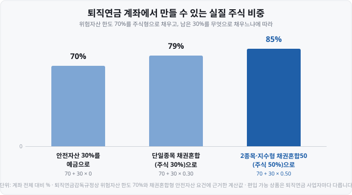
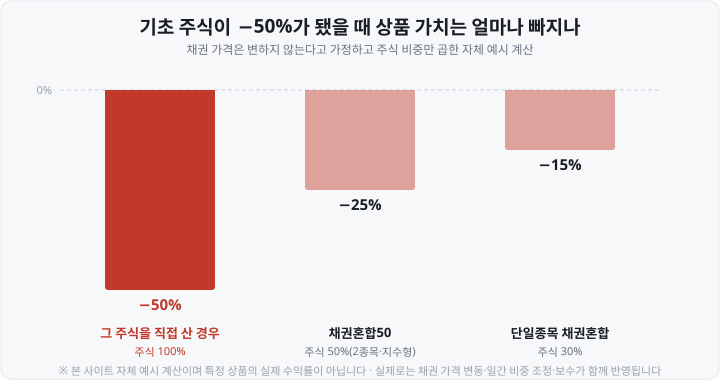

저는 처음 IRP 계좌를 열었을 때 <mark>주식형 ETF를 70%까지밖에 못 담는다</mark>는 안내에서 한참 멈췄습니다. 남은 30%를 예금으로 두자니 아깝고, 그렇다고 다른 선택지가 뭔지도 몰랐거든요. 그러다 상품 목록에서 `KODEX 삼성전자채권혼합` 같은 이름을 보고 "종목이 하나인데 왜 ETF지?" 하고 또 한 번 막혔습니다.

두 질문의 답이 사실 같은 곳에 있더군요. 오늘은 그 이야기입니다.

**ETF**(Exchange Traded Fund, 상장지수펀드)는 원래 **여러 종목을 담은 바구니**입니다. 그런데 이름에 종목 하나만 들어 있는 ETF가 있죠. 답은 이름 뒤쪽에 있습니다 — <mark>주식은 30%만 담고 나머지 70%를 국고채로 채웁니다.</mark>

그리고 이 30%는 운용사가 정한 게 아니라 **규정에서 나온 숫자**입니다. 특정 상품을 권하거나 우열을 판단하지는 않습니다.

&nbsp;

【⚠️ 먼저 — '단일종목 ETF'는 지금 두 가지를 가리킵니다】

이 말이 2026년 들어 두 갈래로 쓰이고 있어서 시작부터 갈라 둘게요. **구조도 위험도 담을 수 있는 계좌도 전혀 다릅니다.**

| | ① 단일종목 **채권혼합형** | ② 단일종목 **레버리지·인버스** |
| :--- | :--- | :--- |
| 언제부터 | **2022년 11월 29일**~ | **2026년 5월 27일**~ |
| 주식 비중 | <mark>약 30%</mark>(나머지 국고채) | <mark>사실상 100%</mark>(그 종목 하나) |
| 배율 | 1배(그대로) | **±2배 이내** |
| 퇴직연금(DC·IRP) | <mark>담을 수 있다</mark>(안전자산) | <mark>담을 수 없다</mark> |
| 진입 문턱 | 일반 ETF와 같음 | 사전교육 + 기본예탁금 3,000만원(현금) |

오늘 글은 **①번**입니다. 이름이 비슷해 검색하다 섞이기 쉬운데, <mark>한쪽은 노후 자금 계좌에 담으라고 만든 상품이고 다른 한쪽은 그 계좌에 아예 못 들어갑니다.</mark>

&nbsp;

【① 30%는 어디서 나온 숫자인가】

ETF가 따라가는 지수에는 규정이 있습니다. **금융투자업규정 제7-26조**가 정하는 기초지수 요건인데, 핵심은 두 줄이에요.

▶ 지수를 구성하는 종목이 **10종목 이상**일 것
▶ 지수를 구성하는 **하나의 종목이 그 지수에서 차지하는 비중이 100분의 30을 초과**하지 아니할 것

이게 **ETF의 분산투자요건**입니다. ETF라는 이름을 달려면 <mark>최소 10종목을 담아야 하고, 한 종목에 30%를 넘겨 실을 수 없다</mark>는 뜻이죠. 여기서 단일종목 ETF의 30%가 나옵니다. 운용사가 고른 값이 아니라 **규정이 허용한 최대치가 30%였던** 겁니다.

그럼 "10종목 이상"은 어떻게 채울까요. **채권으로 채웁니다.**

**표 1. TIGER 테슬라채권혼합Fn의 구성 — 2026년 8월 31일 기준**

| 담은 것 | 비중 |
| :--- | :--- |
| 테슬라(TSLA) | <mark>29.5%</mark> |
| 국고채권03250-3512(25-11) | 16.5% |
| 국고채권02625-3506(25-5) | 15.7% |
| 국고채권03375-3103(26-3) | 11.7% |
| 국고채권02750-2812(25-10) | 11.7% |
| 그 밖의 국고채 | 나머지 |

주식 1종목 + 국고채 9종목, **합해서 10종목입니다.** 주식 비중은 30%를 넘지 않는 29.5%죠. <mark>규정의 두 요건을 정확히 턱걸이로 맞춘 구조</mark>인 셈입니다. 이름은 '단일종목'인데 내용물은 열 종목이고, 그중 아홉이 국고채예요.

&nbsp;

【② 비중은 매일 다시 맞춥니다】

주가는 오르내리니까 가만두면 비중이 어긋납니다. 테슬라가 오르면 주식 몫이 30%를 넘어가고, 그러면 규정을 벗어나죠.

그래서 이 상품들의 기초지수는 **Constant Mix**(콘스턴트 믹스, 고정비중) 방식으로 산출됩니다. <mark>정해 둔 비율이 매일 다시 맞춰지도록</mark> 지수 자체가 그렇게 설계된 겁니다. KODEX 삼성전자채권혼합이 따라가는 지수도 주식과 채권 비율을 **일간 단위로 3:7**로 유지해요. 실제 보유 비중이 정확히 30.0%가 아니라 28.8%·29.5% 같은 값으로 찍히는 건 그 조정이 매일 돌아가는 중이기 때문입니다.

지난 「레버리지 ETF 음의 복리」 글을 보신 분은 "매일 다시 맞춘다"에서 같은 냄새를 맡으셨을 수 있어요. 맞습니다 — **매일 비중을 되돌리는 구조는 오르내림이 반복되는 구간에서 원자산과 성과가 벌어집니다.** 다만 배율을 곱하지 않으니 그 크기는 훨씬 작습니다.

&nbsp;

【③ 왜 이런 상품을 만들었나 — 퇴직연금의 '70% 룰'】

이제 진짜 이유입니다. 이 상품군은 사실상 **퇴직연금 계좌를 겨냥해 설계**됐어요.

**DC**(Defined Contribution, 확정기여형)와 **IRP**(Individual Retirement Pension, 개인형 퇴직연금)에는 규정이 하나 걸려 있습니다.

▶ 위험자산은 적립금의 **70%까지**만. 나머지 **30% 이상은 안전자산**으로.

노후 자금이니 전부 주식에 넣지는 못하게 한 장치죠. 주식형 ETF는 위험자산이라 70%가 끝입니다.

그런데 **채권혼합형 펀드**는 안전자산으로 분류됩니다. 요건은 <mark>주식 편입비율 50% 미만</mark>(뒤집으면 채권 등이 절반 이상)이고, 이걸 채우면 **적립금의 100%까지** 담을 수 있어요. 이 선은 원래 40% 이내였는데 **2023년 11월 16일** 퇴직연금감독규정 개정(금융위원회고시 제2023-56호)으로 50% 미만까지 올라갔습니다.

여기서 계산이 나옵니다. 위험자산 70%를 주식형으로 다 채우고, **남은 30%를 예금이 아니라 주식이 섞인 채권혼합형으로 채우면** 어떻게 될까요.

▶ 예금으로 채우면 **70 + 0 = 70%**
▶ 단일종목 채권혼합(주식 30%)으로 채우면 **70 + 30 × 0.30 = 79%**
▶ 2종목·지수형 채권혼합50(주식 50%)으로 채우면 **70 + 30 × 0.50 = 85%**

<mark>규정을 하나도 어기지 않으면서 주식 비중이 70%에서 85%까지 올라갑니다.</mark> 운용사들이 상품 안내에 "연금계좌 내 최대 85%까지 주식투자 효과"라고 대놓고 적어 두는 이유가 이겁니다.

돈도 그쪽으로 흘렀어요. 국내 채권혼합형 ETF의 순자산총액은 <mark>2025년 말 13조 9,000억원에서 2026년 6월 19일 25조원</mark>으로 약 80% 늘었습니다. 2026년에는 7월까지만 채권혼합형 ETF 16종이 새로 상장됐는데, **직전 3년 평균 상장 수의 약 3배**입니다.

&nbsp;

【④ 왜 요즘은 '2종목'이 쏟아지나】

방금 그림에서 눈치채셨을 수 있어요. 단일종목형은 79%인데 2종목형은 85%죠. **왜 단일종목형은 50%까지 못 갈까요.**

앞의 30% 한도 때문입니다. 지수 안에서 한 종목이 30%를 넘을 수 없으니, 주식을 하나만 쓰면 <mark>주식 몫의 천장이 30%로 막힙니다.</mark> 그런데 **주식을 둘로 나누면** 달라져요.

▶ 삼성전자 25% + SK하이닉스 25% = **주식 50%**
▶ 각 종목은 25%라 30% 한도를 넘지 않는다

2026년 들어 `삼성전자SK하이닉스채권혼합50` 같은 이름이 쏟아진 이유입니다. 실제로 RISE 삼성전자SK하이닉스채권혼합50은 기초지수가 <mark>삼성전자 25%·SK하이닉스 25%·국고통안채 50%</mark>로 구성돼 있고, 2026년 2월 26일 상장 이후 순자산이 **4조 1,161억원**(2026년 8월 14일 기준)까지 불어 채권혼합형 가운데 가장 큽니다. 같은 두 종목을 담은 다른 운용사 상품들도 나란히 상장돼 있어요.

정리하면 **'단일종목'은 목표가 아니라 규정이 만든 모양**이었고, 규정 안에서 주식을 더 담는 방법을 찾다 보니 종목 수가 하나에서 둘로 늘어난 겁니다.

&nbsp;

【⑤ 여기서 분산은 어디까지 살아 있나】

오늘의 핵심입니다. 이름에 ETF가 붙어 있으니 분산이 되는 것 같지만 **되는 부분과 안 되는 부분이 갈립니다.**

**⑴ 주식 쪽은 분산이 없습니다**

30%든 50%든 그 몫은 **한두 종목에 전부 걸려 있습니다.** 언론에서도 "단 두 종목만으로 ETF의 50%가 구성됐기에 사실상 분산투자 효과가 없고 특정 주식에 집중하는 효과만 발생한다"는 지적이 나왔습니다(시사저널e, 2026년 8월 18일).

다만 **채권이 섞여 있으니 충격은 비중만큼만 전달됩니다.** 기초 주식이 반토막 났을 때를 계산해 봤어요.

주식 100%면 −50%지만, 주식 30%짜리는 <mark>−15%에서 멈춥니다.</mark> "완충재가 있다"는 말은 맞아요. 다만 그 완충이 <mark>분산이 아니라 희석</mark>이라는 점이 중요합니다. 위험을 여러 종목에 나눈 게 아니라 **한 종목에 걸린 금액 자체를 줄인 것**이니까요.

같은 구조라도 담은 종목에 따라 결과가 얼마나 갈리는지는 실제 숫자가 보여 줍니다. 2026년 8월 31일 기준 최근 1년 수익률이 삼성전자를 담은 상품은 **+55.64**%, 테슬라를 담은 상품은 **−0.76**%였습니다. **둘 다 주식 30%·국고채 70%로 구조는 똑같습니다.** 결과를 가른 건 구조가 아니라 <mark>그 한 종목</mark>이었어요.

**⑵ 채권 쪽도 '무위험'은 아닙니다**

나머지 70%가 국고채라고 값이 고정된 건 아닙니다. <mark>금리가 오르면 이미 발행된 채권의 값은 떨어지고</mark>, 만기가 긴 채권일수록 그 폭이 큽니다. 그래서 담은 채권이 무엇인지도 봐야 해요 — **국고채 3~10년물**을 담은 상품과 **단기 국고통안채 1년물**을 담은 상품은 금리가 움직일 때 반응이 다릅니다.

**⑶ '안전자산' 분류의 뜻**

퇴직연금 규정이 이 상품을 안전자산으로 분류하는 건 <mark>채권 비중이 절반을 넘는다는 형식 요건을 충족했다는 뜻</mark>이지, 원금이 지켜진다는 뜻이 전혀 아닙니다. 주식 몫만큼은 그대로 주식이에요.

이 지점은 제도 쪽에서도 논쟁 중입니다. 위험자산 한도 70%를 두고도 채권혼합형으로 85%까지 만들 수 있으니 **한도가 사실상 실효성을 잃었다**는 지적이 이어졌고, 금융권은 완화를, 노동계는 유지를 주장합니다. 고용노동부는 <mark>완화 시 쏠림·과열과 현행 유지 시 가입자 불편을 함께 점검 중</mark>이라는 입장이에요. **다만 이건 '논의 중'이지 '시행 예정'이 아닙니다.**

&nbsp;

【⑥ 지금 시행 중인 것과 논의 중인 것 — 2026년 9월 1일 기준】

| 항목 | 내용 | 상태 |
| :--- | :--- | :--- |
| DC·IRP 위험자산 한도 | 적립금의 **70%** | 시행 중 |
| 채권혼합형 안전자산 요건 | 주식 편입비율 <mark>50% 미만</mark>(종전 40% 이내) | 시행 중(2023-11-16~) |
| ETF 기초지수 분산투자요건 | 10종목 이상 · 한 종목 **30%** 이하 | 시행 중 |
| 단일종목 ETF 허용(동일종목 한도 30%→100%) | 국내 우량주식 기초 **±2배 이내** 도입 근거 | 시행 중(2026-04-28~) |
| 단일종목 레버리지·인버스·커버드콜 신규 상장 | 잠정 중단, 광고 금지 | 시행 중(2026-07-16~) |
| 퇴직연금 위험자산 70% 한도 개편 | 완화 여부·범위 검토 | <mark>논의 중</mark>(확정 없음) |

네 번째 줄을 조금 더 볼게요. **2026년 4월 28일** 자본시장법 시행령 개정이 시행되면서 ETF의 동일종목 운용한도가 30%에서 100%로 확대되고 10종목 이상 요건도 적용배제됐습니다. <mark>규정상으로는 '주식 100%인 단일종목 ETF'의 길이 열린 것</mark>이죠. 그 근거로 5월 27일 단일종목 레버리지·인버스 18종이 상장됐고, 과열 논란으로 7월 16일 신규 상장이 잠정 중단됐습니다.

다만 그 변화가 **채권혼합형 쪽을 바꾼 건 아닙니다.** 2026년 9월 1일 현재 거래되는 단일종목 채권혼합형 ETF들은 여전히 주식 약 30% 구조이고, 주식 비중이 30%를 넘는 단일종목 채권혼합형은 확인하지 못했습니다(전수 조회가 아니라 "없다"는 뜻은 아닙니다). 퇴직연금에 담으려면 어차피 **주식 50% 미만**이라는 다른 요건이 따로 걸리고요.

&nbsp;

【⑦ 사기 전에 확인할 것】

특정 상품을 고르는 기준을 제시하진 않을게요. 대신 **상품 페이지에서 눈으로 확인할 수 있는 항목**만 적어 둡니다.

1. **주식이 무엇인지, 몇 %인지** — 이름 끝의 숫자(`채권혼합50`)가 주식 비중인 경우가 많지만 없는 상품도 있으니 구성종목 화면에서 직접 봅니다.
2. **채권이 무엇인지** — 단기 국고통안채 1년물과 국고채 3~10년물은 금리가 움직일 때 반응이 다릅니다.
3. **총보수** — 같은 채권혼합형인데도 차이가 큽니다. 위에서 본 세 상품만 해도 연 **0.01**%(RISE 삼성전자SK하이닉스채권혼합50), 연 **0.07**%(KODEX 삼성전자채권혼합), 연 **0.25**%(TIGER 테슬라채권혼합Fn)로 갈립니다(2026년 8월 확인).
4. **내 계좌에서 살 수 있는 상품인지** — 퇴직연금은 사업자(증권사·은행·보험사)마다 담을 수 있는 목록이 다릅니다.
5. **세금** — 국내주식형이 아닌 ETF의 매매차익엔 배당소득세가 붙습니다. 다만 연금계좌 안에서는 과세가 미뤄집니다.

&nbsp;

【⑧ 참고 — 미국의 'single-stock ETF'는 다릅니다】

해외 자료를 보면 `single-stock ETF`라는 말이 나오는데 **국내의 단일종목 채권혼합형과는 다른 물건**입니다. 미국에서는 2022년 7월 **SEC**(Securities and Exchange Commission, 미국 증권거래위원회)가 첫 단일종목 상품들의 등록신고서 효력을 인정했고, 7월 14일 AXS Investments가 8종을 상장했어요. 이들은 <mark>파생상품으로 한 종목의 하루 등락을 확대하거나 뒤집는 레버리지·인버스형</mark>이었습니다.

즉 미국의 그 말은 우리 기준으로 **②번에 가깝습니다.** 해외 기사에서 본 위험 설명을 국내 채권혼합형에 그대로 옮기지 않는 편이 좋아요.

&nbsp;

【정리】

▶ **'단일종목 ETF'는 지금 두 가지**를 가리킵니다. ① 2022년 11월부터의 **채권혼합형**(주식 약 30% + 국고채, 퇴직연금 편입 가능)과 ② 2026년 5월부터의 **레버리지·인버스**(한 종목 ±2배, <mark>퇴직연금 편입 불가</mark>).
▶ **30%는 규정에서 나온 숫자**입니다. 금융투자업규정 제7-26조가 ETF 기초지수에 <mark>10종목 이상·한 종목 30% 이하</mark>를 요구하기 때문이죠. 주식 1종목에 국고채 9종목을 더해 10종목을 채운 게 실제 구조입니다.
▶ **만든 이유는 퇴직연금의 70% 룰**입니다. 채권혼합형은 <mark>주식 50% 미만이면 안전자산</mark>이라 100%까지 담기고, 남은 30%를 이걸로 채우면 계좌 전체 주식 비중이 **79%**(주식 30%짜리) 또는 **85%**(주식 50%짜리)가 됩니다.
▶ **2종목형이 쏟아지는 것도 30% 한도 때문**입니다. 25%씩 둘로 나누면 주식 몫이 50%가 되니까요.
▶ **분산이 아니라 희석입니다.** 구조가 같아도 담은 종목에 따라 결과가 갈립니다 — 2026년 8월 31일 기준 최근 1년 수익률이 한쪽은 **+55.64**%, 다른 쪽은 **−0.76**%였습니다.
▶ **'안전자산'은 형식 분류**입니다. 원금 보장이 아니고 국고채 쪽도 금리 위험이 있습니다. 70% 한도 자체를 손볼지는 <mark>2026년 9월 현재 논의 중이며 확정된 건 없습니다.</mark>

&nbsp;

【함께 보면 좋은 글】

- [ETF란 무엇인가 — 주식도 펀드도 아닌, 초보에게 가장 쉬운 시작](https://blog.naver.com/hdglace/224350308437) — 오늘의 출발점인 '바구니' 개념
- [단일종목 레버리지 ETF 원리 — 2배·인버스는 어떻게 만들어지나](https://blog.naver.com/hdglace/224379450793) — 이름이 같은 ②번 상품
- [연금저축·IRP·ISA — 세금 아끼며 ETF 투자하는 절세 계좌 3종](https://blog.naver.com/hdglace/224357252306) — 오늘 나온 DC·IRP 계좌의 기본
- [ETF 총보수와 세금 — 실제로 내 수익에서 얼마가 빠지나](https://blog.naver.com/hdglace/224367512124) — 총보수와 계좌별 과세 차이
- [금리가 오르면 주가가 내리는 이유 — 할인율과 유동성](https://blog.naver.com/hdglace/224369929249) — 나머지 70%(채권)의 위험

&nbsp;

【다음 편 예고】

다음 글은 **DART 공시 보는 법**입니다. 전자공시시스템에서 초보가 꼭 확인할 공시 다섯 가지 — 정기보고서, 주요사항보고서, 단일판매·공급계약, 유상증자, 최대주주 변경 — 를 실제 검색 경로와 함께 짚어 보겠습니다.

&nbsp;

【📊 데이터 출처 및 기준일】

| 항목 | 내용 | 출처·기준일 |
| :--- | :--- | :--- |
| ETF 기초지수 분산투자요건 | 지수 구성종목 10종목 이상, 하나의 종목 비중이 100분의 30을 초과하지 아니할 것(채무증권만으로 구성된 지수는 3종목 이상 등 예외 별도) | 「금융투자업규정」 제7-26조, 2026-09-01 확인 |
| TIGER 테슬라채권혼합Fn(447770) | 2022-11-29 상장, 총보수 연 0.25%, 순자산 4,344억원, 테슬라 29.5%+국고채, 최근 1년 −0.76%·상장 이후 +45.39%. 지수의 29.5:70.5 일간 유지는 운용사·지수사업자 안내를 인용한 자료로 확인했고 산출 방법서 원문은 대조하지 못함. '국고채 9종'은 보도·구성 화면 기준이며 만기 도래에 따라 바뀜 | FunETF 상품 페이지, 2026-08-31 기준 |
| KODEX 삼성전자채권혼합(448330) | 2022-11-29 상장, 총보수 연 0.07%, 순자산 1조 2,835억원, 삼성전자 28.8%, 주식:채권 일간 3:7 Constant Mix, 최근 1년 +55.64%·상장 이후 +81.11% | FunETF 상품 페이지, 2026-08-31 기준 |
| RISE 삼성전자SK하이닉스채권혼합50 | 2026-02-26 상장, 총보수 연 0.01%, 기초지수 삼성전자 25%·SK하이닉스 25%·KAP 단기 국고통안채 1Y 50%(일간 Constant Mix), 연금계좌 100% 투자 가능 상품으로 안내 | 운용사 상품 페이지, 2026-09-01 확인 |
| 2종목형 순자산 | RISE 4조 1,161억원(2026-08-14 기준, 더구루 2026-08-22 보도) / KODEX 1조 5,239억원·KIWOOM 2,411억원(시사저널e 2026-08-18 보도) | 언론 보도 |
| 퇴직연금 한도 | DC·IRP 위험자산 70%, 나머지 30% 이상 안전자산. 채권혼합형 펀드(주식 편입비율 50% 미만·채권 50% 이상)는 안전자산으로 적립금 100%까지 가능. ⚠️ 매체에 따라 '50% 이하'로 쓰기도 하나 규정 문언은 **'50% 미만'** | 퇴직연금감독규정·증권사 안내, 2026-09-01 확인 |
| 주식 편입 한도 상향 | 40% 이내 → 50% 미만, 2023-11-16 시행(금융위원회고시 제2023-56호) | 금융위 보도자료·언론, 2026-09 확인 |
| 레버리지·인버스 퇴직연금 편입 | 불가(파생상품 위험평가액 40% 초과 상품 제외) | 증권사 퇴직연금 유의사항, 2026-09-01 확인 |
| 70%·79%·85% | 위험자산 한도 70%와 각 상품 주식 비중으로 계산(70 + 30 × 주식비중). 79%·85%는 언론 보도(2026-02-24, 2026-08-22)와 운용사 안내에서도 같게 제시 | 계산값 + 보도 |
| 채권혼합형 ETF 순자산 | 2025년 말 13조 9,000억원 → 2026-06-19 25조원(약 80% 증가). 같은 기간 전체 ETF 297조원 → 527조원(06-18 기준) | 머니투데이 2026-06-20 |
| 2026년 신규 상장 | 연초~7월 채권혼합형 16종(직전 3년 평균의 약 3배) | 한국경제 2026-07-30 |
| 분산 효과 비판 | "두 종목만으로 ETF의 50%가 구성돼 사실상 분산투자 효과가 없다"는 지적 인용 | 시사저널e 2026-08-18 |
| 70% 한도 개편 | 고용노동부 검토 중(금융권 완화 요구·노동계 유지 주장). ⚠️ **확정·공표된 개정안 아님** | 언론 보도 2026-06 |
| 2026년 ETF 규제 변화 | 04-28 시행령 개정 시행(동일종목 한도 30%→100%, 분산투자요건 적용배제, ±2배 이내 단일종목 레버리지 근거) → 05-27 18종 상장 → 07-16 신규 상장 잠정 중단·광고 금지, 기본예탁금 1,000만→3,000만원(07-31 조기시행) | 금융위 보도자료·언론 |
| 미국 단일종목 ETF | 2022년 7월 SEC가 첫 단일종목 상품 등록신고서 효력 인정, 07-14 AXS Investments 8종 상장(레버리지·인버스형) | 미국 ETF 업계 보도, 2026-09 확인 |
| −50%·−25%·−15% | 채권 가격 불변을 가정하고 주식 비중만 곱한 **자체 예시 계산** | 본 사이트 계산 |

&nbsp;

⚠️ **면책 안내** — 이 글은 공개된 법령·감독규정과 상품 공시, 언론 보도를 정리한 **교육·정보 제공 목적**의 자료이며, 특정 상품의 매수·매도를 권유하거나 상품 간 우열을 판단하지 않습니다. 본문의 상품명과 수치는 구조를 설명하기 위한 사례이고 유사한 상품이 다수 있습니다. 채권혼합형 ETF가 퇴직연금 규정상 '안전자산'으로 분류된다는 것은 형식 요건 충족을 뜻할 뿐 **원금 보장을 의미하지 않으며**, 주식 비중만큼의 가격 변동과 채권의 금리 위험이 함께 존재합니다. 순자산·수익률·구성 비중은 매일 바뀌고 제도는 시점에 따라 변하니, 투자 전 최신 공시와 투자설명서, 본인의 퇴직연금 사업자 안내를 확인하시기 바랍니다. 투자 판단과 그 결과에 대한 책임은 투자자 본인에게 있습니다.

&nbsp;

#단일종목ETF #채권혼합형ETF #퇴직연금 #IRP #연금계좌 #안전자산 #ETF투자 #주식초보 #투자공부 #재테크
