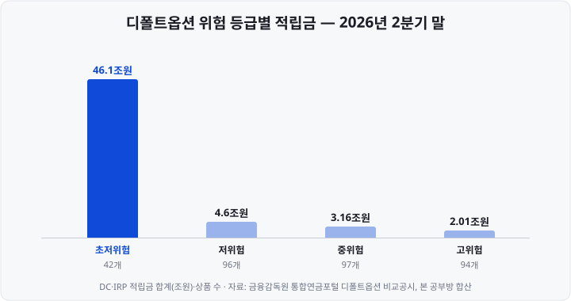

저도 연금저축과 IRP를 함께 쓰고 있지만, 어떤 ETF가 왜 한 계좌에서는 매수할 수 있고 다른 계좌에서는 매수할 수 없는지 정확한 이유는 모르고 있었습니다. 이번에 규정 원문을 찾아보니 <mark>계좌마다 투자 가능 상품을 정하는 규정 자체가 달랐습니다.</mark>

[연금저축·IRP·ISA 절세 계좌 3종](https://blog.naver.com/hdglace/224357252306) 편에서는 세 계좌의 혜택과 한도를 비교했습니다. 이 글은 그다음 질문을 다룹니다. **각 계좌에서 실제로 무엇을 살 수 있는가, 그리고 같은 상품이 계좌에 따라 세금이 어떻게 달라지는가**입니다.

세 계좌는 투자 가능한 상품을 정하는 규정이 서로 다릅니다. 연금저축은 금융투자협회 표준약관이, IRP(Individual Retirement Pension, 개인형 퇴직연금)와 DC(Defined Contribution, 확정기여형) 퇴직연금은 근로자퇴직급여 보장법과 퇴직연금감독규정이, ISA(Individual Savings Account, 개인종합자산관리계좌)는 조세특례제한법이 정합니다. <mark>근거 규정이 다르기 때문에 같은 상품이라도 한 계좌에서는 매수할 수 있고 다른 계좌에서는 매수할 수 없습니다.</mark>

특정 상품을 권하는 글이 아니라 계좌별 규칙을 정리하는 글입니다. 기준 시점은 **2026년 10월**이고, 출처는 하단에 밝혔습니다.

&nbsp;

【계좌별 투자 가능 상품 한눈에 보기】

먼저 전체 표입니다. 증권사에서 개설하는 연금저축계좌(연금저축펀드)와 중개형 ISA를 기준으로 했습니다.

| 상품 | 연금저축 | IRP·DC | 중개형 ISA |
| :-- | :-- | :-- | :-- |
| 국내 상장주식 (개별 종목) | ✗ | ✗ | ○ |
| 국내 상장 ETF (주식형·채권형·해외지수형) | ○ | ○ (위험자산 한도 적용) | ○ |
| 레버리지·인버스 ETF | ✗ | ✗ | ○ (증권사별 사전교육·예탁금 조건) |
| ETN (Exchange Traded Note, 상장지수증권) | ✗ | 최대 손실이 원금의 40% 이내인 공모 ETN만 | ○ |
| 상장 리츠·상장 인프라펀드 | ○ | ○ (위험자산) | ○ |
| 공모펀드·TDF (Target Date Fund, 생애주기펀드) | ○ (연금저축 전용 클래스) | ○ | ○ |
| 국채·회사채 직접 매수 | ✗ | ○ (국채는 안전자산, 회사채는 위험자산) | ○ |
| 예금·원리금보장상품 | ✗ | ○ | ✗ (신탁형 ISA에서 가능) |
| RP (Repurchase Agreement, 환매조건부채권) | ✗ | ○ | ○ |
| ELS·DLS (Equity·Derivatives Linked Securities, 주가연계증권·파생결합증권) | ✗ | 최대 손실 40% 이내인 공모 상품만 | ○ |
| 해외 상장 주식·ETF | ✗ | ✗ | ✗ |

표에서 두 가지가 눈에 띕니다. 첫째, <mark>개별 종목을 직접 살 수 있는 계좌는 중개형 ISA뿐</mark>이고, 그것도 국내 상장주식과 K-OTC(Korea Over-The-Counter, 금융투자협회가 운영하는 장외시장)에서 거래되는 중소·중견기업 주식에 한합니다. 둘째, **연금저축은 투자 가능한 상품의 폭이 가장 좁습니다.** 예금·채권·ETN을 모두 살 수 없고, 계좌에 남은 현금에는 예탁금이용료만 지급됩니다.

아래에서 계좌별 근거 규정과 예외를 살펴봅니다.

&nbsp;

【연금저축 — 표준약관이 정한 네 가지만 살 수 있다】

증권사 연금저축계좌에서 살 수 있는 상품은 금융투자협회 「연금저축계좌설정약관」 제8조가 **열거한 네 가지**입니다.

1. 연금저축 전용 집합투자증권(공모펀드의 연금저축 클래스)
2. 한국거래소에 상장된 ETF(Exchange Traded Fund, 상장지수펀드)
3. 상장 리츠(REITs, Real Estate Investment Trusts, 부동산투자회사)
4. 상장 인프라 투융자회사·투융자신탁(2025년 5월 13일 시행 약관부터 추가)

약관이 투자 대상을 하나씩 나열하는 방식이어서 <mark>목록에 없는 상품은 살 수 없습니다.</mark> 개별 주식, ETN, 채권, 예금, RP가 여기에 해당합니다. 리츠는 "IRP에서만 투자할 수 있다"는 안내가 일부 남아 있지만, 현행 표준약관에서는 연금저축에서도 투자할 수 있습니다.

다만 각 증권사는 표준약관을 바탕으로 자체 약관을 운영하며, 4번(인프라)을 아직 반영하지 않은 곳도 있습니다. 예를 들어 2026년 3월 시행된 유진투자증권 약관은 3번까지만 나열하고 있습니다. 실제 매수 가능 여부는 이용하는 증권사의 약관으로 확인해야 합니다.

&nbsp;

【레버리지·인버스 ETF의 제외 기준 — 추적 배율】

약관은 ETF 가운데 **추적 배율이 1배를 초과하거나 음(−)의 배율인 상품을** 제외합니다. 2배 레버리지 ETF, −1배·−2배 인버스 ETF는 모두 연금저축에서 살 수 없습니다. 2026년 5월 27일 상장한 [단일종목 레버리지 ETF](https://blog.naver.com/hdglace/224379450793)도 배율이 1배를 넘으므로 같은 이유로 제외됩니다.

반대로 추적 배율이 1배인 상품은 지수 구성 종목을 직접 사는 실물 복제형이든, 스와프(swap, 증권사와 수익률을 교환하는 계약)로 지수 수익률을 얻는 합성형이든 약관 문구상 제한이 없습니다.

&nbsp;

【위험자산 투자 한도가 없다】

연금저축에는 IRP의 70% 같은 비율 제한이 없습니다. 근로자퇴직급여 보장법은 퇴직연금에만 적용되고, 연금저축 약관에는 자산 비중 규정이 없기 때문입니다. 그래서 <mark>연금저축은 적립금 전부를 주식형 ETF로 운용할 수 있습니다.</mark>

&nbsp;

【IRP·DC — 위험자산은 70%까지】

IRP와 DC형 퇴직연금은 근로자퇴직급여 보장법 시행규칙 제10조에 따라 **위험자산 투자가 가입자별 적립금의 70%로 제한됩니다.** 나머지 30% 이상은 안전자산으로 채워야 합니다. 개별 주식은 같은 시행규칙 제10조 제2항과 퇴직연금감독규정 제11조가 지분증권에 직접 투자하지 못하도록 해 살 수 없습니다. 상장 리츠는 시행규칙이 이 제한의 예외로 명시하고 있어 투자할 수 있습니다.

따라서 어떤 상품이 위험자산이고 어떤 상품이 안전자산으로 분류되는지가 실제 운용 범위를 결정합니다.

| 구분 | 해당 상품 (예시) | 투자 한도 |
| :-- | :-- | :-- |
| 위험자산 | 주식형·주식혼합형 펀드와 ETF, 투자적격 회사채·특수채, 상장 리츠·인프라펀드, 요건을 충족한 ELS·ETN | 합산 70% |
| 안전자산 | 예금·적금, 원리금보장 RP, 국채·통안채·정부보증채, MMF(Money Market Fund, 단기금융펀드) | 100% |
| 안전자산으로 분류되는 펀드 | 주식 투자한도가 50% 미만인 채권형·채권혼합형 펀드와 ETF, **적격 TDF**, 승인받은 디폴트옵션 | 100% |

마지막 줄이 중요합니다. 주식을 일부 편입한 채권혼합형 상품도 안전자산으로 분류되므로, 계좌 전체의 실제 주식 비중은 70%를 넘을 수 있습니다. 구체적인 계산은 [단일종목 ETF](https://blog.naver.com/hdglace/224397300262) 편에 정리해 두었습니다.

**적격 TDF**는 은퇴 예정 시점(목표 시점)에 가까워질수록 주식 비중을 줄이는 TDF 가운데 퇴직연금감독규정 시행세칙 제5조의2의 요건을 충족한 상품입니다. 목표 시점 이전에는 채권·현금성자산을 20% 이상, 이후에는 60% 이상 보유해야 합니다. 2026년 4월 1일 시행된 개정 세칙은 <mark>특정 국가의 주식은 주식 투자액의 80%, 채권은 채권 투자액의 80%를 넘지 못하도록</mark> 하는 요건을 새로 추가했습니다.

&nbsp;

【레버리지 ETF·ETN·ELS의 투자 제한】

- **레버리지·인버스 ETF**: 퇴직연금감독규정 제9조도 연금저축 약관과 같은 문구로 1배를 초과하거나 음의 배율인 ETF를 제외합니다. 그 밖의 펀드·ETF는 파생상품 **위험평가액**(파생상품 거래로 노출된 위험 금액)이 자산총액의 40%를 넘으면 투자할 수 없고, 스와프로 지수를 1배 추종하는 국내 상장 합성 ETF는 예외로 적립금의 100%까지 허용됩니다.
- **ETN·ELS·DLS**: 공모로 발행되고 **최대 손실이 원금의 40% 이내인 상품만** 위험자산으로 투자할 수 있습니다. 대부분의 ETN은 손실 한도가 없어 이 요건을 충족하지 못합니다.
- **계열회사 증권**: 가입자가 근무하는 회사(사용자)와 그 계열회사가 발행한 증권은 DC 20%, IRP 30%까지만 투자할 수 있습니다.

&nbsp;

【70% 한도는 2026년 10월 현재 그대로다】

고용노동부가 2026년 6월 위험자산 한도를 100%로 넓히는 방안을 검토한다고 보도됐고, 7월에는 80%·90%로 단계적으로 올리는 안도 논의된다는 보도가 나왔습니다. 노동계는 7월 반대 성명을 냈습니다. 그러나 **시행규칙 개정안의 입법예고는 나오지 않았고**, 현행 조문은 여전히 70%입니다. 검토 단계의 보도 내용은 현행 규정과 구분해서 읽어야 합니다.

&nbsp;

【중개형 ISA — 국내 상장 상품은 대부분 가능하다】

ISA에서 투자할 수 있는 상품은 조세특례제한법 제91조의18 제3항이 정합니다. 중개형 ISA는 그 범위가 가장 넓어 **국내 상장주식, ETF, ETN, ELS, 채권, RP, 리츠, 공모펀드에** 투자할 수 있습니다.

예외는 두 가지입니다.

- **예금**은 중개형에서 가입할 수 없습니다. 예금을 편입하려면 신탁형 ISA를 써야 합니다.
- **해외 상품**은 같은 조문이 "외국 집합투자증권은 제외"라고 명시하고 있고, 주식도 국내 증권시장에 상장된 법인의 주식만 허용합니다.

레버리지·인버스 ETF는 법령상 투자 범위 안에 있습니다. 다만 일반 계좌와 마찬가지로 증권사가 정한 사전교육 이수와 기본예탁금 조건을 충족해야 매수할 수 있습니다.

&nbsp;

【해외 상장 ETF는 왜 어느 계좌에도 안 되나】

미국에 상장된 ETF나 애플 같은 해외 주식은 세 계좌 어디에서도 살 수 없습니다. 다만 매수를 제한하는 근거는 계좌마다 다릅니다.

| 계좌 | 근거 |
| :-- | :-- |
| ISA | 조세특례제한법 제91조의18이 외국 집합투자증권을 **명문으로 제외** |
| 연금저축 | 약관이 투자 대상을 자본시장법상 국내 상장 ETF로 한정 |
| IRP·DC | 해외 주식은 지분증권 금지 조항으로 불가. 해외 상장 ETF는 이를 직접 금지하는 조문은 없지만, 가입자는 퇴직연금사업자가 제시하는 운용방법 가운데서만 고를 수 있고(근로자퇴직급여 보장법 제21조) 사업자들은 국내 상장 ETF만 제시함 |

그래서 절세 계좌에서 해외 지수에 투자하려면 **한국거래소에 상장된 해외지수 ETF를** 이용하게 됩니다. 이 상품이 절세 계좌에서 유리해지는 이유는 다음 절의 과세 구조에 있습니다.

&nbsp;

【같은 상품, 계좌마다 다른 세금】

[ETF 총보수와 세금](https://blog.naver.com/hdglace/224367512124) 편에서 일반 계좌의 ETF 과세를 정리했습니다. 같은 상품을 절세 계좌에 넣으면 아래처럼 바뀝니다.

| 소득 | 일반 계좌 | 중개형 ISA | 연금저축·IRP |
| :-- | :-- | :-- | :-- |
| 국내 주식형 ETF 매매차익 | 비과세 | 비과세 (과세 대상 소득이 아님) | **인출 시 과세** |
| 국내 상장주식 매매차익 | 비과세 (대주주 제외) | 비과세 | 투자 불가 |
| 해외지수·채권형 ETF 매매차익과 분배금 | 배당소득세 15.4% | 비과세 한도(200만원·서민형 400만원) 차감 후 9.9% | 인출 시 과세 |
| 국내 주식형 ETF 분배금·리츠 배당 | 배당소득세 15.4% | 위와 같음 | 인출 시 과세 |

**인출 시 과세**의 세율은 연금으로 수령하면 나이에 따라 3.3~5.5%, 연금 외 방식으로 인출하면 16.5%입니다. 모두 지방소득세를 포함한 세율이며, 세액공제를 받지 않은 납입 원금은 인출할 때 과세되지 않습니다. 세율 구조는 [연금저축·IRP 납입한도](https://blog.naver.com/hdglace/224409292371) 편에 정리해 두었습니다.

&nbsp;

【연금계좌에서는 국내 주식형 ETF 차익도 과세된다】

표에서 가장 혼동하기 쉬운 칸은 연금계좌의 국내 주식형 ETF입니다. 소득세법 제20조의3은 연금계좌에서 받는 돈을 **"그 소득의 성격에도 불구하고"** 연금소득으로 보고, 그 범위에 "연금계좌의 운용실적에 따라 증가된 금액"을 포함합니다. <mark>일반 계좌에서는 비과세인 국내 주식형 ETF의 매매차익도 연금계좌 안에서 생기면 인출할 때 연금소득세 대상이 됩니다.</mark>

반대로 국내 상장 해외지수 ETF는 일반 계좌에서 매매차익에 15.4%가 과세되는 상품입니다. 연금계좌에서는 이 세금이 인출 시점까지 미뤄지고(과세이연), 연금으로 수령하면 세율이 3.3~5.5%로 낮아집니다. 절세 계좌로 줄일 수 있는 세금은 <mark>일반 계좌에서 과세되는 상품일수록 큽니다.</mark>

&nbsp;

【ISA에서는 국내 주식형 ETF의 손실을 다른 이익과 합산하지 않는다】

ISA가 과세하는 것은 계좌의 **이자소득과 배당소득**뿐입니다(조세특례제한법 제91조의18 제1항). 국내 주식과 국내 주식형 ETF의 매매차익은 애초에 과세 대상 소득이 아니어서 비과세 한도 200만원을 소진하지 않습니다.

ISA는 계좌 안의 이익과 손실을 합산해 순이익에만 과세하는데(손익통산), 합산하는 손실의 범위가 정해져 있습니다. 조세특례제한법 시행령 제93조의4는 **국내 상장주식을 직접 매매해 생긴 손실은** 다른 이익과 합산해 차감하도록 하지만, 국내 주식형 ETF 안에서 생긴 국내주식 매매손실은 차감 대상에서 제외합니다. 같은 국내 주식 손실이라도 <mark>직접 산 주식의 손실은 다른 이익에서 차감되고, ETF를 통한 손실은 차감되지 않습니다.</mark>

&nbsp;

【해외 분배금의 이중과세 문제 — 2026년 7월에 개선됐다】

국내 상장 해외지수 ETF가 미국 주식에서 배당을 받으면 미국에서 먼저 세금이 원천징수(소득을 지급하는 자가 세금을 미리 징수해 납부하는 것)됩니다. 2025년 1월부터 이 외국 납부세액을 펀드 단계에서 환급받지 않고 **투자자에게 소득을 지급할 때 공제하는 방식으로** 바뀌었습니다.

문제는 절세 계좌였습니다. ISA와 연금계좌는 분배금이 들어올 때 국내에서 원천징수하는 세금이 없어, 외국 납부세액을 공제할 대상도 없었습니다. 그 결과 외국에서 원천징수된 세금은 공제받지 못한 채, 인출할 때 국내 세금이 다시 부과되는 이중과세 구조가 됐습니다. 이후 두 단계로 보완됐습니다.

| 계좌 | 시행 | 내용 |
| :-- | :-- | :-- |
| ISA | 2025년 7월 1일 | 계좌 안 외국 납부세액을 합산해 해지할 때 배당소득 원천징수세액 한도 안에서 공제. 비과세 한도 안의 소득에는 실익이 없음 |
| 연금저축·IRP | **2026년 7월 1일** | 외국 납부세액의 **55%를** 공제액으로 쌓아 두었다가 인출할 때 원천징수세액 한도 안에서 공제, 남은 금액은 다음 인출로 이월 |

연금계좌 개선은 2025년 1월 1일 이후 계좌에 들어온 소득부터 적용됩니다(소득세법 제57조의2·제129조, 시행령 제189조의2). 다만 공제율이 55%여서 <mark>외국에서 원천징수된 세금 전액이 공제되지는 않습니다.</mark>

&nbsp;

【디폴트옵션 — 운용 지시를 하지 않으면 적용되는 상품】

**디폴트옵션**(default option, 사전지정운용방법)은 DC·IRP 가입자가 적립금을 어디에 투자할지 지시하지 않을 때, 미리 정해 둔 상품으로 자동 운용하는 제도입니다. 근로자퇴직급여 보장법 제21조의2~제21조의4에 근거하며 2022년 7월 12일 시행됐습니다. DB(Defined Benefit, 확정급여형)와 연금저축에는 이 제도가 없습니다.

&nbsp;

【언제 적용되나】

퇴직연금사업자(증권사·은행·보험사)는 아래 두 경우에 가입자에게 통지합니다.

1. DC에 처음 가입했을 때
2. 가입자가 고른 상품(예: 정기예금)의 **만기가 지나고 4주가 지났을 때**

정기예금 만기 후 재예치를 지시하지 않은 경우가 2번에 해당합니다. 통지를 받고 **2주 안에** 가입자가 직접 상품을 선택하지 않으면 디폴트옵션으로 운용됩니다(법 제21조의3). 가입자는 이후에도 언제든 다른 상품으로 변경할 수 있습니다.

&nbsp;

【상품 유형과 위험 등급】

디폴트옵션으로 승인받을 수 있는 상품은 원리금보장상품과 네 가지 펀드입니다.

| 유형 | 내용 |
| :-- | :-- |
| 원리금보장 | 예금·이율보증보험 등 |
| TDF | 은퇴 시점에 맞춰 주식 비중을 줄이는 펀드 |
| BF (Balanced Fund, 밸런스드펀드) | 주식·채권 비중을 일정 범위로 유지하는 펀드 |
| SVF (Stable Value Fund, 단기금융펀드) | 단기 금융상품에 투자하는 펀드 |
| SOC펀드 (사회기반시설펀드) | 사회기반시설에 투자하는 펀드 |

펀드만으로 구성하는 경우에는 TDF나 BF를 반드시 하나 이상 포함해야 합니다. 각 상품은 초저위험·저위험·중위험·고위험 네 단계로 구분되고, 고용노동부는 2025년에 안정형·안정투자형·중립투자형·적극투자형으로 이름을 바꿨습니다. 승인받은 디폴트옵션은 안전자산으로 분류돼 **적립금의 100%까지** 운용할 수 있습니다.

금융감독원 비교공시를 합산하면 2026년 2분기 말 디폴트옵션 상품은 329개, 적립금은 55조 8,700억원입니다. 이 가운데 <mark>82.5%가 초저위험(안정형) 상품</mark>에 있습니다.

상품 수는 저위험·중위험·고위험이 각각 90여 개로 더 많지만, 적립금은 42개 초저위험 상품에 집중돼 있습니다. 고용노동부도 2026년 2월 보도자료에서 2025년 4분기 말 적립금의 85%가 안정형(초저위험) 상품에 있다고 밝혔습니다.

&nbsp;

【디폴트옵션 상품의 보수는 어디서 확인하나】

**금융감독원 홈페이지 → 금융소비자보호 → 통합연금포털 → 연금상품 비교공시 → 사전지정운용방법(디폴트옵션) 비교공시**(https://www.fss.or.kr/fss/lifeplan/defaultCmpr/list.do?menuNo=201133)에서 상품별 유형·위험도·적립금·기간별 수익률과 **합성총보수**를 확인할 수 있습니다. 조회할 때는 기준 분기를 먼저 선택해야 합니다. 합성총보수의 의미와 총보수와의 차이는 [ETF 총보수와 세금](https://blog.naver.com/hdglace/224367512124) 편에 정리했습니다.

여러 펀드를 조합한 **포트폴리오형** 디폴트옵션에는 편입 펀드의 보수 외에 포트폴리오 단계의 보수가 따로 부과되지 않습니다. 하나증권 디폴트옵션 상품설명서(2026년 9월 7일 심사필)는 "포트폴리오 구성에 따른 추가적인 비용은 발생하지 않습니다"라고 적고 있고, <mark>공시되는 보수는 편입 펀드 합성총보수의 가중평균</mark>이라고 밝히고 있습니다.

보수가 이중으로 부과되는 경우는 편입된 개별 펀드 안에 있습니다. 다른 펀드에 투자하는 **재간접형 TDF는** 자체 총보수에 피투자펀드의 보수가 더해지므로, 총보수만 볼 것이 아니라 피투자펀드 보수까지 합산한 합성총보수를 확인해야 합니다. 이와 별도로 퇴직연금사업자에게 운용·자산관리수수료를 납부합니다.

&nbsp;

【정리】

- **세 계좌는 투자 가능 상품을 정하는 규정이 다릅니다.** 연금저축은 금융투자협회 표준약관, IRP·DC는 근로자퇴직급여 보장법과 퇴직연금감독규정, ISA는 조세특례제한법입니다.
- **연금저축은** 전용 펀드·국내 상장 ETF·상장 리츠·상장 인프라펀드 네 가지만 살 수 있고, 1배를 넘거나 음의 배율인 ETF는 제외됩니다. 대신 위험자산 한도가 없습니다.
- **IRP·DC는** 위험자산이 적립금의 70%까지입니다. 채권혼합형(주식 50% 미만)·적격 TDF·디폴트옵션은 안전자산으로 분류돼 100%까지 가능하고, 70% 한도는 2026년 10월 현재 개정되지 않았습니다.
- **중개형 ISA는** 국내 상장주식·ETF·ETN·채권까지 투자 범위가 가장 넓지만, 예금과 해외 상품에는 투자할 수 없습니다. 해외 상장 ETF는 세 계좌 모두 매수할 수 없습니다.
- **같은 상품도 계좌에 따라 과세가 다릅니다.** 국내 주식형 ETF의 매매차익은 일반 계좌·ISA에서는 비과세지만 연금계좌에서는 인출 시 과세됩니다. 해외지수 ETF처럼 일반 계좌에서 과세되던 상품일수록 절세 계좌의 효과가 큽니다.
- **연금계좌의 해외 분배금 이중과세는** 2026년 7월 1일부터 외국 납부세액의 55%를 공제하는 방식으로 보완됐습니다.
- **디폴트옵션은** DC·IRP에서 운용 지시가 없을 때 적용되는 상품이고, 보수는 금융감독원 통합연금포털 비교공시에서 확인합니다. 포트폴리오형에도 포트폴리오 단계의 별도 보수는 없습니다.

&nbsp;

【다음 편에서는】

다음 공부방 글에서는 **배당 ETF 고르는 법**을 다룹니다. 고배당·배당성장·다우존스 계열로 나뉘는 배당 ETF의 유형, 분배율과 배당수익률의 차이, 분배금 지급 주기와 과세를 정리하겠습니다.

---

&nbsp;

【📊 데이터 출처 및 기준일】

| 항목 | 내용 | 출처·기준일 |
| :-- | :-- | :-- |
| 연금저축 투자 가능 상품 | 약관 제8조 제1항: 연금저축 전용 집합투자증권, 상장 ETF(지수 변화의 1배 초과·음의 배율 제외), 상장 리츠, 상장 인프라 투융자회사·투융자신탁(2025년 5월 13일 시행본에 추가) | 금융투자협회 「연금저축계좌설정약관」, 소득세법 시행령 제40조의2, 2026년 10월 6일 확인 |
| 퇴직연금 위험자산 한도 | 가입자별 적립금의 100분의 70 | 근로자퇴직급여 보장법 시행규칙 제10조 제1항, 시행령 제26조 (국가법령정보센터 현행본), 2026년 10월 6일 확인 |
| 퇴직연금 투자 금지·제한 | 지분증권 직접 투자 금지(부동산투자회사 지분증권은 제외, 시행규칙 제10조 제2항), 1배 초과·음의 배율 ETF 제외, 파생상품 위험평가액 40% 초과 ETF 제외, 파생결합증권은 공모·최대손실 40% 이내, 계열회사 증권 DC 20%·IRP 30% | 퇴직연금감독규정 제9조·제10조·제11조·제12조(금융위원회고시 제2023-56호, 2023년 11월 16일), KB증권 퇴직연금 위험자산 투자한도 안내 |
| 안전자산 분류 | 원리금보장 운용방법, 주식 투자한도 50% 미만 증권형 펀드, MMF, 적격 TDF, 승인 디폴트옵션 | 퇴직연금감독규정 제11조 제1항, 근로자퇴직급여 보장법 시행령 제25조 |
| 적격 TDF 요건 | 목표시점 전 채권·현금성자산 20% 이상·이후 60% 이상, 특정 국가 주식·채권 각각 투자액의 80% 이내(신설) | 퇴직연금감독규정 시행세칙 제5조의2(2026년 3월 31일 개정, 4월 1일 시행) |
| 70% 한도 개편 논의 | 고용노동부 100% 확대 검토(2026년 6월 10~11일 워크숍), 80·90% 단계 상향 논의, 민주노총 반대 성명(2026년 7월 22일), 입법예고 없음 | 이데일리(2026년 6월 22일), 뉴스토마토(2026년 7월 12일·7월 23일), 민주노총 성명, 법제처 입법예고 목록, 국가법령정보센터 현행 조문 대조(2026년 10월 6일) |
| ISA 투자 가능 상품 | 외국 집합투자증권 제외, 주권상장법인 주식, 파생결합증권, 채권, RP 등 | 조세특례제한법 제91조의18 제3항, 시행령 제93조의4 제7항·제8항, 미래에셋증권 ISA 안내 |
| ISA 과세 대상·손실 차감 | 과세 대상은 이자·배당소득, 국내 상장주식 직접 투자 양도차손은 차감, 국내 주식형 ETF 내 국내주식 손실은 차감 제외 | 조세특례제한법 제91조의18 제1항, 시행령 제93조의4 제9항·제10항, 시행규칙 제42조의3, 국회예산정책처 나보포커스 제156호(2026년 4월 30일) |
| 연금계좌 과세 | 운용실적 증가분은 연금소득, 연금수령 3.3~5.5%·연금외수령 16.5%(지방소득세 포함) | 소득세법 제20조의3 제1항 제2호, 제129조 제1항 |
| 일반 계좌 해외지수 ETF 과세 | 국내주식 매매차익 비과세 대상에서 해외지수 ETF 제외, 배당소득세 15.4% | 소득세법 시행령 제26조의2 제4항 |
| 외국납부세액 공제 | 2025년 1월 1일 지급 시 공제 방식으로 변경 / ISA: 2025년 7월 1일 이후 지급분 해지 시 공제 / 연금계좌: 간접투자외국법인세액의 0.55를 누적, 인출 시 원천징수세액 한도 공제·이월, 2025년 1월 1일 이후 지급분·2026년 7월 1일 이후 인출분 적용 | 소득세법 제57조의2·제129조 제8항~제10항(2025년 12월 23일 개정)·부칙, 시행령 제189조의2 제3항·제4항, 기획재정부 설명자료(2025년 2월), KB증권 공지(2025년 6월 30일) |
| 디폴트옵션 제도 | DC 가입 시·만기 후 4주 경과 시 통지, 2주 내 미선택 시 적용, 상품 유형(원리금보장·TDF·BF·단기금융펀드·사회기반시설펀드), 2022년 7월 12일 시행 | 근로자퇴직급여 보장법 제21조의2(상품 유형)·제21조의3(통지·적용)·제24조(IRP 준용), 부칙(법률 제18752호), 시행령 제13조(승인 요건)·제13조의3(통지 내용) |
| 디폴트옵션 규모 | 2026년 2분기 말 329개 상품, 적립금 55조 8,700억원, 위험도별 초저위험 42개·46.1조원 / 저위험 96개·4.6조원 / 중위험 97개·3.16조원 / 고위험 94개·2.01조원 | 금융감독원 통합연금포털 디폴트옵션 비교공시 전 상품을 **본 공부방이 합산**(DC·IRP 합계). 2025년 4분기 합산(53.33조원·85.4%)이 고용노동부 보도자료(2026년 2월 27일, 53조원·85%)와 일치함을 확인 |
| 디폴트옵션 보수 | 포트폴리오 구성에 따른 추가 비용 없음, 공시 보수는 피투자펀드 합성총보수의 가중평균 | 하나증권 퇴직연금 디폴트옵션 적극투자형 포트폴리오 1호 핵심설명서(심사필 제2026-0405호, 2026년 9월 7일) |

&nbsp;

【🔗 함께 보면 좋은 글】

- [연금저축·IRP·ISA — 세금 아끼며 ETF 투자하는 절세 계좌 3종](https://blog.naver.com/hdglace/224357252306) — 세 계좌의 혜택·한도 비교
- [연금저축·IRP 납입한도 — 1,800만원과 900만원은 왜 다른가](https://blog.naver.com/hdglace/224409292371) — 인출 시 연금소득세율과 중도인출 과세
- [ETF 총보수와 세금 — 실제로 내 수익에서 얼마가 빠지나](https://blog.naver.com/hdglace/224367512124) — 합성총보수와 일반 계좌의 ETF 과세
- [단일종목 ETF란 — 주식 30%·채권 70% 구조와 퇴직연금 활용](https://blog.naver.com/hdglace/224397300262) — 퇴직연금 안전자산 분류와 79%·85% 계산

&nbsp;

⚠️ **면책 안내** — 이 글은 공개된 법령·감독규정·약관과 공시 자료를 정리한 정보성 콘텐츠이며, 특정 계좌·상품의 가입이나 매매를 권유하지 않습니다. 본문의 상품명은 제도를 설명하기 위한 예시입니다. 실제 투자 가능 여부는 증권사·퇴직연금사업자마다 다를 수 있고 세법과 규정은 개정될 수 있으므로, 가입·매매 전 해당 금융회사의 최신 안내를 확인하고 본인 책임하에 결정하시기 바랍니다.

&nbsp;

#절세계좌 #연금저축ETF #IRP투자상품 #ISA중개형 #디폴트옵션 #사전지정운용 #퇴직연금위험자산 #적격TDF #연금저축리츠 #외국납부세액공제 #해외ETF절세 #DC형퇴직연금 #주식초보 #투자공부 #재테크
