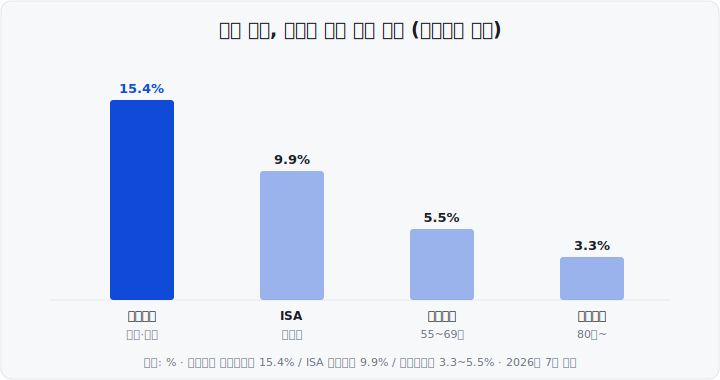

제가 처음 ETF를 살 때, "어떤 종목을 살까"만 고민했지 <mark>"어떤 통장에 담을까"</mark>는 전혀 몰랐습니다. 나중에야 같은 ETF라도 담는 계좌에 따라 세금이 크게 달라진다는 걸 알고 아차 싶었죠. 오늘은 그때의 저처럼 헤매지 않도록, 초보가 가장 먼저 알아두면 좋은 세 가지 절세 계좌 — 연금저축·IRP·ISA를 쉽게 정리해드립니다. (수치는 모두 2026년 7월 기준입니다.)

&nbsp;

【💡 절세 계좌가 왜 필요할까】

우리가 흔히 쓰는 일반 증권 계좌로 ETF에 투자하면, 이익이 날 때마다 세금이 붙습니다. ETF 분배금(주식의 배당금에 해당)이나 국내 상장 해외지수 ETF의 매매차익에는 배당소득세 <mark>15.4%</mark>가 매겨집니다.

절세 계좌는 이 세금을 <mark>미뤄주거나(과세이연), 깎아주거나(저율과세), 아예 면제(비과세)</mark>해 주는 특별한 그릇입니다. 담는 내용물이 같아도 그릇이 다르면 세금이 달라지는 셈이죠.

- **연금저축** : 노후 자금을 모으며 매년 세액공제(세금 환급)를 받는 계좌
- **IRP**(Individual Retirement Pension, 개인형 퇴직연금) : 세액공제 한도가 더 크고 규칙은 조금 엄격한 계좌
- **ISA**(Individual Savings Account, 개인종합자산관리계좌) : 노후가 아닌 중기 목돈을 굴리며 비과세·저율과세를 받는 계좌

&nbsp;

【📊 세 계좌 한눈에 비교】

| 구분 | 연금저축 | IRP | ISA |
| :--- | :--- | :--- | :--- |
| 핵심 혜택 | 세액공제+과세이연 | 세액공제+과세이연 | 비과세+저율과세 |
| 세액공제 한도 | 연 600만원 | 합산 900만원 | 없음 |
| 목적 | 노후(연금) | 노후(연금) | 중기 목돈 |
| 돈 찾는 조건 | 만 55세 이후 | 만 55세 이후 | 3년 뒤 자유 |

※ 세액공제 = 내야 할 세금에서 일정 금액을 직접 깎아주는 것. 연금저축·IRP에 넣은 돈의 일정 비율을 연말정산 때 현금으로 돌려받는다고 보면 쉽습니다.

&nbsp;

【💰 연금저축·IRP — 넣을 때 돌려받고, 굴리는 동안 안 뗀다】

연금저축과 IRP는 노후용 '연금 계좌' 형제입니다. 매력은 두 가지예요.

**① 세액공제** — 연금저축은 연 600만원까지, IRP를 더하면 <mark>둘을 합쳐 연 900만원</mark>까지 공제 대상입니다.

| 총급여(종합소득) | 공제율 | 900만원 채우면 |
| :--- | :--- | :--- |
| 5,500만원(4,500만원) 이하 | 16.5% | 최대 148만 5,000원 |
| 초과 | 13.2% | 최대 118만 8,000원 |

즉 총급여 5,500만원 이하인 분이 900만원을 채우면 <mark>약 148만원을 연말정산 때 돌려받습니다.</mark> 투자 수익과 별개로 나오는 확정 혜택이라 체감이 큽니다.

**② 과세이연** — 연금 계좌 안에서는 찾기 전까지 세금을 매기지 않고 미뤄줍니다. 세금으로 나갈 돈까지 계속 굴러가니 장기 복리 효과가 커지죠.

대신 이 돈은 원칙적으로 만 55세 이후 연금으로 찾습니다. 이때 미뤄둔 세금을 내는데 세율이 낮아요 — 55~69세 5.5%, 70~79세 4.4%, 80세 이상 3.3%(연금소득세). (연금 수령액이 연 1,500만원을 넘으면 다른 세율이 적용되니 그때는 별도 확인이 필요합니다.)

&nbsp;

【🔍 연금저축 vs IRP, 뭐가 다를까】

- **IRP는 안전자산 의무가 있습니다.** 주식형 ETF 같은 <mark>위험자산은 최대 70%까지만</mark> 담고, 30% 이상은 채권·예금 등 안전자산이어야 합니다. 연금저축은 이 제한이 없어요.
- **중도 인출은 IRP가 더 까다롭습니다.** 연금저축은 상대적으로 자유롭지만, IRP는 법정 사유가 아니면 인출이 어렵습니다.

그래서 실무에서는 연금저축 600만원 + IRP 300만원 = 900만원 조합을 많이 씁니다. 정답이 아니라 한도를 채우는 한 방법일 뿐이에요.

&nbsp;

【🏦 ISA — 3년만 묶으면 세금을 깎아주는 계좌】

연금 계좌가 "노후까지 오래 묶는 대신 세액공제"라면, ISA는 <mark>"3년만 묶으면 세금을 깎아주는"</mark> 중기용 계좌입니다.

- **비과세** : 순이익 중 일반형 200만원, 서민형 400만원까지 세금 0원. (서민형 = 총급여 5,000만원 또는 종합소득 3,800만원 이하)
- **저율 분리과세** : 비과세 한도를 넘는 이익엔 15.4%가 아니라 <mark>9.9%</mark>만 매깁니다.
- **손익통산** : 계좌 안 이익과 손실을 합쳐 순이익에만 과세합니다.

의무 가입 기간은 3년, 연 납입 한도는 2,000만원(총 1억원)입니다. 만기 자금을 60일 안에 연금 계좌로 옮기면 옮긴 금액의 **10%까지**(최대 300만원) 세액공제 한도에 얹어주는 연계 혜택도 있어요.

&nbsp;

【🔎 ISA는 세 종류 — 중개형·신탁형·일임형】

ISA를 만들 때 세 유형 중 하나를 골라야 합니다. "누가 굴리느냐"가 핵심 차이예요.

| 유형 | 누가 굴리나 | 담을 수 있는 것 | 수수료(대략) |
| :--- | :--- | :--- | :--- |
| **중개형** | 내가 직접 | 국내 주식·ETF·채권 등 직접 매매 | 매매수수료만 |
| **신탁형** | 내가 고르고 금융사 관리 | 펀드·ETF·예금 (주식 직접매매 불가) | 연 0.1%대 신탁보수 |
| **일임형** | 전문가가 알아서 | 금융사가 짠 포트폴리오 | 연 0.1~0.8% 운용수수료 |

가장 큰 갈림길은 <mark>주식·ETF를 직접 사고팔고 싶으면 '중개형'</mark>이라는 점이에요. 요즘 ETF 투자용으로 많이 여는 게 이 중개형입니다. 직접 고르기 부담스러우면 신탁형·일임형이 대신 굴려주지만 수수료가 붙고 직접 매매는 어렵습니다.

&nbsp;

※ 2026년 들어 정부가 ISA의 납입·비과세 한도를 늘리고 국내 투자 전용 유형을 만드는 개편(이른바 '슈퍼 ISA')을 추진 중입니다. 다만 구체 한도·시행 시점은 세법 개정·국회 절차로 확정되므로, 이 글은 확정된 기존 기준으로 설명했습니다. 가입 전 최신 확정 내용을 꼭 확인하세요. (2026년 7월 기준, 진행 중)

&nbsp;

【📈 그래서 세금이 얼마나 차이 날까】

같은 이익이라도 <mark>어느 계좌에서 났느냐에 따라 세율이 이렇게 다릅니다.</mark> 계좌마다 적용 상황이 다르니 단순 우열이 아니라 '세율 크기 차이'로 봐주세요. 다만 혜택이 큰 계좌일수록 돈이 묶이는 조건도 함께 커진다는 점을 잊지 마세요.

&nbsp;

【📌 ETF 담을 때 꼭 알아둘 점】

- **국내 상장 ETF만 담을 수 있습니다.** 연금저축·IRP·ISA에는 한국 거래소에 상장된 ETF만 넣을 수 있어요. 미국에 직접 상장된 ETF는 못 담습니다.
- **'국내 상장 해외 ETF'가 특히 유리합니다.** 일반 계좌면 15.4%가 붙는 매매차익이, 절세 계좌 안에서는 <mark>과세이연·저율과세로</mark> 바뀝니다.
- **레버리지·인버스 같은 파생형 ETF는 연금저축·IRP에 담을 수 없습니다.** 다만 <mark>ISA는 '중개형'이면 국내 상장 파생형 ETF 매수가 가능합니다</mark>(증권사별 사전교육·예탁금 조건 있음, 신탁형·일임형은 대체로 제한).

참고로 미국에 직접 상장된 해외 ETF를 일반 계좌로 사면 매매차익에 양도소득세 22%(연 250만원 기본공제)가 적용되는 등 과세 방식이 또 다릅니다. "무엇을, 어느 계좌에 담느냐"를 함께 보는 습관이 중요합니다.

&nbsp;

【✅ 정리】

- 절세 계좌는 같은 ETF라도 <mark>세금을 미루거나·깎거나·면제</mark>해 주는 그릇입니다.
- **연금저축·IRP**는 세액공제(합산 900만원)+과세이연, 노후에 낮은 세율. IRP는 위험자산 70% 한도가 다른 점.
- **ISA**는 3년 묶으면 비과세(200만·서민형 400만원)+9.9% 분리과세+손익통산.
- 정답은 없습니다. <mark>오래 묶어도 될 돈은 연금 계좌로, 중기 목돈은 ISA로</mark> 나눠 담는 게 핵심이에요.

&nbsp;

【🔗 함께 보면 좋은 글】

ETF가 처음이시라면 먼저 읽어보세요 → ETF란 무엇인가 (주식·펀드와 뭐가 다를까)
https://blog.naver.com/hdglace/224350308437

&nbsp;

【📊 데이터 출처 및 기준일】

- 연금저축·IRP 세액공제 한도(600만·합산 900만원)·공제율(16.5%/13.2%) : 국세청, 금융투자협회·증권사 공식 가이드, 2026년 7월 기준.
- 연금소득세율(55~69세 5.5%, 70~79세 4.4%, 80세~ 3.3%, 연 1,500만원 기준) : 국세청·찾기쉬운 생활법령정보, 2026년 7월 기준.
- IRP 위험자산 70% 한도 : 금융감독원 퇴직연금감독규정, 2026년 7월 기준(한도 완화 논의 진행 중).
- ISA 납입한도(2,000만·총 1억원)·비과세(일반 200만·서민 400만원)·9.9% 분리과세·손익통산·연금전환 추가공제 : 금융위원회·국세청·증권사 안내, 2026년 7월 기준.
- ISA 제도 확대 : 기획재정부·금융위원회 발표 및 국회 입법 논의, 세부 내용·시행 시점 확정 진행 중(2026년 7월 기준).
- ETF 과세(15.4%·해외 직접상장 양도세 22%·절세 계좌 내 과세이연) : 국세청·자산운용사·증권사 가이드, 2026년 7월 기준.

&nbsp;

※ 본 글은 공개된 제도와 세법을 정리한 정보성 콘텐츠이며, 특정 종목·상품·계좌의 가입이나 매매 권유가 아닙니다. 세법은 개정될 수 있고 수치는 위 기준 시점의 값입니다. 실제 판단은 최신 규정을 확인하고 본인 책임하에 결정하시기 바랍니다.

&nbsp;

#절세계좌 #연금저축 #IRP #ISA #ISA계좌 #세액공제 #ETF투자 #과세이연 #재테크 #주식초보 #투자공부 #연말정산
