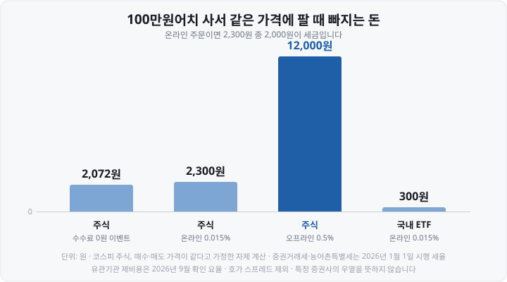

제가 처음 주식을 샀다가 같은 가격에 되팔았을 때, 계좌에 돌아온 돈이 산 금액보다 2천원쯤 적어서 한참을 들여다본 적이 있습니다. 수수료 무료 이벤트로 계좌를 열었는데 왜 돈이 빠졌는지 그때는 몰랐어요. <mark>알고 보니 빠진 돈의 대부분은 수수료가 아니라 세금이었습니다.</mark>

그 돈은 네 군데로 나뉘어 나갑니다. 증권사가 받는 **위탁수수료**, 거래소와 예탁결제원이 받는 **유관기관 제비용**, 그리고 나라가 걷는 **증권거래세**와 **농어촌특별세**입니다. 오늘은 네 항목을 하나씩 나눠 보고, 100만원 왕복 거래로 실제 금액을 계산합니다. 해외주식은 환전 비용이 따로 붙으니 마지막에 따로 계산했습니다.

기준은 **2026년 9월**입니다. 수수료율은 증권사마다 다르므로 본문에 나오는 증권사 이름은 요율이 어떻게 적혀 있는지 보여 주기 위한 예시이고, 어느 곳이 낫다는 뜻이 아닙니다.

&nbsp;

【한 번 사고팔 때 빠지는 네 가지】

| 항목 | 누가 받나 | 언제 붙나 | 요율(2026년 9월) |
| :-- | :-- | :-- | :-- |
| 위탁수수료 | 증권사 | 살 때·팔 때 모두 | 증권사·계좌·주문 방법마다 다름 |
| 유관기관 제비용 | 한국거래소·한국예탁결제원 등 | 살 때·팔 때 모두 | KRX 주식 0.0036396% |
| 증권거래세 | 국가 | **팔 때만** | 코스피 0.05%, 코스닥 0.20% |
| 농어촌특별세 | 국가 | **팔 때만, 코스피만** | 0.15% |

수수료 두 가지는 **살 때와 팔 때 모두** 붙고, 세금 두 가지는 **팔 때만** 붙습니다. 그래서 매수 체결 내역에는 수수료만 찍히고, 매도 체결 내역에서 비로소 세금이 보입니다.

세금은 매도금액에 붙습니다. <mark>이익을 봤든 손해를 봤든 판 금액의 0.20%가 빠집니다.</mark> 소득에 매기는 세금이 아니라 거래에 매기는 세금이기 때문입니다.

&nbsp;

【위탁수수료 — 같은 증권사에서도 열 배 차이가 납니다】

**위탁수수료**(委託手數料, 주문을 맡긴 대가로 증권사에 내는 돈)는 증권사가 자유롭게 정합니다. 그래서 가장 차이가 큰 항목입니다. 차이를 만드는 것은 대개 증권사 이름보다 **어떤 계좌로, 어떤 방법으로 주문했느냐**입니다.

한국투자증권이 공시한 요율(2025년 10월 27일 기준)을 보면 이렇습니다.

| 같은 코스피 주식을 온라인으로 주문할 때 | 요율 |
| :-- | --: |
| 비대면 개설 시 계좌관리점을 「온라인(뱅키스) 계좌」로 선택 | 0.0140527% |
| 비대면 개설 시 계좌관리점을 「영업점 계좌」로 선택 | 0.147% |
| 영업점에 전화하거나 방문해 주문(오프라인) | 0.491% |

<small>한국투자증권 「수수료안내」 국내주식 온라인매매·영업점매매 표, 2025년 10월 27일 기준(2026년 9월 26일 확인). 특정 증권사의 우열을 판단하는 자료가 아닙니다.</small>

같은 앱, 같은 종목인데 계좌를 열 때 고른 관리점 하나로 요율이 <mark>열 배 넘게</mark> 벌어집니다. 오프라인 주문은 0.5% 안팎으로 다른 증권사도 비슷한 수준입니다(신한투자증권 오프라인 0.4991639%, 우리투자증권 오프라인 0.498%).

흔히 놓치는 부분이 셋 있습니다.

- **반대매매·전화 주문은 오프라인 요율입니다.** 키움증권 「국내주식 핵심설명서」는 반대매매가 "오프라인 거래 수수료로 적용되어" 집행된다고 적고 있습니다. 앱 주문이 막혀 고객센터에 전화로 주문해도 비싼 요율이 붙을 수 있습니다. 반대매매는 [반대매매란](https://blog.naver.com/hdglace/224417557515) 편에 정리했습니다.
- **'평생 무료'·'0원' 이벤트에도 기한과 조건이 있습니다.** 키움증권의 신규 고객 할인 이벤트는 비대면 계좌 6개월(은행영업부 계좌 3개월)이 기한이고, 끝나면 일반 요율로 돌아갑니다. 이벤트 기간에도 **유관기관 수수료는 따로 부과된다**고 명시돼 있습니다.
- **요율에 유관기관 제비용이 포함됐는지는 증권사마다 적는 방식이 다릅니다.** 우리투자증권처럼 "위탁매매수수료에는 유관기관제비용이 포함"이라고 밝히는 곳이 있고, 이벤트 요율처럼 따로 붙는 경우가 있습니다. 수수료 안내 화면의 작은 글씨를 확인해야 합니다.

&nbsp;

【유관기관 제비용 — 수수료가 0원이어도 나가는 돈】

**유관기관 제비용**(有關機關 諸費用, 거래에 관여한 기관들에 내는 여러 비용)은 증권사가 아니라 거래를 처리한 기관 몫입니다. 체결을 맡은 거래소와 주식·대금을 옮기는 한국예탁결제원이 받습니다. 증권사가 대신 걷어 넘기기 때문에 <mark>증권사 수수료를 0원으로 해 줘도 이 돈은 남습니다.</mark>

| 어디서 체결됐나 | 유관기관 제비용률 |
| :-- | --: |
| **KRX**(Korea Exchange, 한국거래소) 주식(코스피·코스닥·코넥스) | 0.0036396% |
| KRX **ETF**(Exchange Traded Fund, 상장지수펀드)·ETN·ELW | 0.0042087% |
| **NXT**(Nextrade, 대체거래소 넥스트레이드) 주식 | 0.0031833% |
| **K-OTC**(Korea Over-The-Counter, 한국장외주식시장) | 0.0999187% |

<small>한국투자증권 「우대 수수료에 적용되는 유관기관제비용율」(2025년 10월 현재 표기, 2026년 9월 26일 확인). NXT 요율은 호가를 먼저 내놓고 기다린 주문(메이커)이 0.0027033%로 더 낮고, 위 표는 바로 체결되는 주문(테이커) 기준입니다(미래에셋증권 「유관기관 수수료」 표).</small>

100만원이면 36원입니다. 금액 자체는 작지만 두 가지는 알아 둘 만합니다. 첫째, 같은 주식이라도 **NXT에서 체결되면 조금 낮습니다.** 키움증권의 온라인 요율이 KRX 0.015%, NXT 0.0145%로 다른 것도 이 차이 때문입니다. 둘째, 이 요율은 한시적으로 내려가기도 합니다 — 한국거래소는 2025년 12월 15일부터 2026년 2월 13일까지 거래 수수료를 한시 인하했고, 지금은 원래 요율로 돌아와 있습니다. NXT는 [대체거래소 NXT와 KRX 애프터마켓](https://blog.naver.com/hdglace/224412184369) 편에 있습니다.

&nbsp;

【증권거래세와 농어촌특별세 — 시장마다 세율이 다릅니다】

세금은 어느 시장에 상장된 주식이냐에 따라 달라집니다.

| 시장 | 증권거래세 | 농어촌특별세 | 합계(매도금액 대비) |
| :-- | --: | --: | --: |
| 코스피(유가증권시장) | 0.05% | 0.15% | **0.20%** |
| 코스닥 | 0.20% | 없음 | **0.20%** |
| 코넥스 | 0.10% | 없음 | 0.10% |
| K-OTC | 0.20% | 없음 | 0.20% |
| 그 밖의 장외 거래(비상장주식 등) | 0.35% | 없음 | 0.35% |

<small>한국투자증권 「매매관련 세금」 표 및 증권거래세법 시행령 제5조(대통령령 제36001호, 2026년 1월 1일 시행), 증권거래세법 제8조(기본세율 1만분의 35), 2026년 9월 26일 확인.</small>

코스피와 코스닥은 세목 구성이 다른데 **합계는 둘 다 0.20%입니다.** 코스피 주식은 증권거래세가 낮은 대신 농어촌특별세 0.15%가 따로 붙기 때문입니다. 결국 코스피 종목을 팔든 코스닥 종목을 팔든 판 금액의 0.20%가 세금으로 빠집니다.

두 세금은 투자자가 따로 신고하지 않습니다. 결제일에 한국예탁결제원이나 증권사가 **매도대금에서 떼어 대신 냅니다.** 그래서 매도 후 들어오는 돈이 이미 세금을 뺀 금액입니다.

&nbsp;

【세율은 해마다 바뀌어 왔습니다】

인터넷에서 보이는 세율이 서로 다른 이유는 최근 몇 년 동안 해마다 세율이 바뀌었기 때문입니다.

| 적용 연도 | 코스피(거래세 + 농특세) | 코스닥 |
| :-- | --: | --: |
| 2023년 | 0.05% + 0.15% = 0.20% | 0.20% |
| 2024년 | 0.03% + 0.15% = 0.18% | 0.18% |
| 2025년 | 0% + 0.15% = 0.15% | 0.15% |
| **2026년~(현재 시행 중)** | **0.05% + 0.15% = 0.20%** | **0.20%** |

<small>2023~2025년은 2022년 세법 개정에 따른 단계적 인하 일정(파이낸셜뉴스 2022년 12월 30일, 에너지경제 2025년 4월 30일 보도로 교차확인). 2026년은 증권거래세법 시행령 개정(2025년 12월 31일 공포, 2026년 1월 1일 시행).</small>

2025년까지의 인하는 **금융투자소득세**(주식 매매차익에 매기려던 세금) 도입을 전제로 한 것이었습니다. 금융투자소득세가 폐지되면서 2026년 1월 1일부터 세율이 2023년 수준으로 돌아갔습니다. 2025년에 쓰인 글에서 "코스피는 거래세 0%"를 보았다면 그 뒤로 바뀐 것입니다.

적용 기준은 체결일이 아니라 **결제일**입니다. 세법이 주식을 넘긴 시점을 결제가 끝나는 때로 보기 때문에, 2025년 12월 29일 체결분부터 새 세율이 적용됐습니다(KB증권 「2026년 증권거래세율 변경 안내」). 결제일은 [주식 결제일 D+2](https://blog.naver.com/hdglace/224406855629) 편에서 다뤘습니다.

**시행 예정인 변경은 2026년 9월 현재 없습니다.** 2026년 8월 3일 발표된 세제개편안(국회 심사 중)에도 증권거래세 항목이 있지만, 우정사업본부·연기금의 차익거래나 금융지주회사 설립을 위한 주식 교환처럼 <mark>특정 거래에 주던 면제의 기한을 늘리거나 끝내는 내용입니다.</mark> 개인이 증권사 앱으로 사고파는 상장주식의 세율을 바꾸는 항목은 없습니다. 개편안 전체는 [2026년 세제개편안](https://blog.naver.com/hdglace/224416773496) 편에 정리했습니다.

&nbsp;

【100만원 사고팔면 얼마가 빠지나】

코스피 주식을 **100만원에 사서 가격 변동 없이 100만원에 판다**고 가정하고 계산했습니다. 위탁수수료는 세 경우로 나눴습니다.

| 항목 | 수수료 0원 이벤트 | 온라인 0.015% | 오프라인 0.5% |
| :-- | --: | --: | --: |
| 매수 수수료 | 36원 | 150원 | 5,000원 |
| 매도 수수료 | 36원 | 150원 | 5,000원 |
| 증권거래세(0.05%) | 500원 | 500원 | 500원 |
| 농어촌특별세(0.15%) | 1,500원 | 1,500원 | 1,500원 |
| **합계** | **2,072원** | **2,300원** | **12,000원** |
| 원금 대비 | 0.21% | 0.23% | 1.2% |

<small>본 공부방 자체 계산. 0원 이벤트는 유관기관 제비용(0.0036396%, 원 미만 버림)만 부과되는 경우, 온라인·오프라인 요율은 유관기관 제비용이 포함된 요율로 가정했습니다. 오프라인 0.5%는 주요 증권사 오프라인 요율(0.491~0.4991639%)을 반올림한 예시입니다. 원 미만 처리 방식은 증권사마다 달라 실제로는 몇 원 차이가 날 수 있습니다. 코스닥 주식도 세금 합계가 0.20%로 같아 결과가 같습니다.</small>

온라인으로 주문하면 2,300원 가운데 **2,000원이 세금입니다.** 수수료를 0원으로 만들어도 2,072원이 빠집니다. <mark>온라인 거래에서는 수수료보다 세금이 훨씬 큰 비용입니다.</mark> 수수료 이벤트를 찾아다니기 전에 이 비율을 먼저 알아 두면 좋습니다.

국내 ETF를 같은 조건으로 사고팔면 어떨까요? 온라인 0.015% 기준으로 **300원입니다.** ETF는 매도할 때 증권거래세가 붙지 않기 때문입니다(아래에서 설명합니다).

&nbsp;

【여러 번 사고팔면 비용도 그만큼 쌓입니다】

2,300원은 한 번 왕복할 때의 금액입니다. 같은 100만원으로 하루 한 번씩 사고팔기를 1년 250거래일 동안 반복하면 **2,300원 × 250 = 57만 5,000원**이 빠집니다. <mark>원금의 57.5%가 수익과 상관없이 비용으로 나가는 셈입니다.</mark> 거래 횟수가 늘어나면 요율이 낮아도 비용은 커집니다.

그리고 이 계산에는 **호가 스프레드**가 빠져 있습니다. 실제로 바로 사고팔면 매도 1호가에 사서 매수 1호가에 팔게 되므로, 그 차이만큼이 더 빠집니다. 이 부분은 [호가창 보는 법](https://blog.naver.com/hdglace/224364657994) 편에서 따로 계산했습니다.

&nbsp;

【ETF·ETN은 팔 때 증권거래세가 없습니다】

증권거래세법은 과세 대상을 **주권**(株券, 주식을 나타내는 증권)과 지분으로 정하고 있습니다. ETF는 펀드의 **수익증권**이고, ETN은 증권사가 발행한 **파생결합증권**이라 둘 다 주권이 아닙니다. 그래서 <mark>국내 상장 ETF와 ETN을 팔 때는 증권거래세가 붙지 않습니다.</mark> 한국투자증권의 ETN 과세 안내도 "증권거래세는 비과세"라고 적고 있습니다.

다만 두 가지를 구분해야 합니다.

- **수수료와 유관기관 제비용은 그대로 붙습니다.** ETF·ETN의 유관기관 제비용률(0.0042087%)은 오히려 주식보다 조금 높습니다.
- **증권거래세가 없다고 세금이 없는 것은 아닙니다.** 국내주식형이 아닌 ETF(해외지수·채권·원자재·레버리지 등)는 매매차익에 15.4%의 배당소득세가 붙습니다. 이 구분과 ETF 보수는 [ETF 총보수와 세금](https://blog.naver.com/hdglace/224367512124) 편에, ETN의 구조는 [레버리지 ETN과 ETF 차이](https://blog.naver.com/hdglace/224381929727) 편에 있습니다.

국내 주식은 대주주가 아니면 매매차익에 양도소득세가 없으므로, 소액투자자가 국내 주식을 사고팔 때 내는 세금은 사실상 이 0.20%가 전부입니다.

&nbsp;

【해외주식은 환전 비용이 따로 붙습니다】

미국 주식은 비용 구조가 다릅니다. 국내 증권거래세가 없는 대신 **환전 비용**과 **현지 제비용**이 붙습니다.

| 항목 | 요율(2026년 9월) | 언제 붙나 |
| :-- | :-- | :-- |
| 위탁수수료 | 온라인 0.20~0.25%, 오프라인 0.5% 수준 | 살 때·팔 때 |
| SEC 수수료 | 매도금액의 0.00206% | 팔 때만 |
| 환전 스프레드 | 매매기준율 대비 1% 수준, 우대율에 따라 감면 | 원화→달러, 달러→원화 각각 |

<small>위탁수수료: 한국투자증권·신한투자증권 온라인 0.25%, 우리투자증권 온라인 0.20%(각 사 수수료 안내, 2026년 9월 26일 확인). SEC 수수료: 미국 SEC Fee Rate Advisory, 2026년 4월 4일부터 100만 달러당 20.60달러. 환전 스프레드: 시사저널e 2026년 1월 16일 보도.</small>

**SEC**(Securities and Exchange Commission, 미국 증권거래위원회) 수수료는 미국 법에 따라 매도할 때만 붙는 비용입니다. 요율이 해마다 조정되는데, 2025년 5월 14일부터 2026년 4월 3일까지는 0달러였다가 **2026년 4월 4일부터 100만 달러당 20.60달러**(0.00206%)가 됐습니다. 금액은 작지만 시기에 따라 있었다 없었다 하는 항목입니다.

비용을 가장 크게 좌우하는 것은 **환전**입니다. 증권사는 은행과 마찬가지로 **매매기준율**(살 때와 팔 때의 중간 환율)에 일정 비율을 더한 환율로 달러를 팔고, 뺀 환율로 달러를 삽니다. 이 차이가 **환전 스프레드**이고, 증권사는 통상 1% 수준입니다. '환율우대 95%'는 이 1% 가운데 95%를 깎아 준다는 뜻이라 실제 부담은 0.05%가 됩니다.

100만원으로 미국 주식을 사서 같은 가격에 팔고 다시 원화로 바꾸면 이렇습니다(환율 변동이 없다고 가정).

| 항목 | 환율우대 없음 | 환율우대 95% |
| :-- | --: | --: |
| 원화→달러 환전 | 10,000원 | 500원 |
| 매수 수수료(0.25%) | 2,500원 | 2,500원 |
| 매도 수수료(0.25%) | 2,500원 | 2,500원 |
| SEC 수수료 | 약 21원 | 약 21원 |
| 달러→원화 환전 | 10,000원 | 500원 |
| **합계** | **약 25,021원(2.5%)** | **약 6,021원(0.6%)** |

<small>본 공부방 자체 계산. 환전 스프레드 1%는 예시이며 증권사·시간대(장중·장외)·통화에 따라 다릅니다. 환전 후 금액이 줄어드는 효과는 무시한 근삿값입니다.</small>

같은 100만원 왕복인데 **우대율 하나로 네 배 넘게** 차이가 납니다. 환전 우대는 이벤트로 주어지는 경우가 많았는데, 2025년 12월 18일 금융감독원이 증권사들을 불러 과도한 해외주식 마케팅 중단을 요구한 뒤 <mark>신규 수수료·환전 우대 이벤트가 상당수 중단됐습니다.</mark> 이미 적용받던 기존 우대는 유지한다는 증권사가 많았지만, 새로 계좌를 여는 경우에는 지금 적용되는 우대율을 직접 확인해야 합니다.

미국 외 시장은 현지 세금이 더 붙습니다. 한국투자증권 안내 기준으로 홍콩 주식은 매수·매도 때 각각 0.1085%, 중국 A주는 매도 때 0.05841%의 현지 제세금이 있습니다. 그리고 해외주식은 매매차익에 **양도소득세 22%**(연 250만원 기본공제)가 따로 있습니다. 신고 방법은 [해외주식 양도소득세 신고 방법](https://blog.naver.com/hdglace/224371858037) 편에 정리했습니다.

&nbsp;

【내 계좌의 실제 비용 확인하는 법】

- **체결 내역(거래 내역) 화면**에서 매도 건을 열면 수수료와 제세금이 원 단위로 나옵니다. 가장 정확한 값입니다.
- **수수료 안내 페이지**에서 내 계좌가 어떤 유형(비대면·영업점·은행 연계)인지, 요율에 유관기관 제비용이 포함인지 확인합니다.
- **이벤트 적용 중이라면 종료일**을 확인합니다. 종료 후 적용될 요율도 함께 봐 둡니다.
- 해외주식은 **환전 내역**에서 적용 환율과 그 시점의 매매기준율을 비교하면 실제 스프레드를 계산할 수 있습니다.

&nbsp;

【정리】

- 국내 주식을 한 번 사고팔면 살 때와 팔 때 **위탁수수료·유관기관 제비용이**, 팔 때만 **증권거래세·농어촌특별세가** 빠집니다.
- 2026년 1월 1일부터 세금은 **코스피·코스닥 모두 매도금액의 0.20%입니다**(코스피 거래세 0.05% + 농특세 0.15%, 코스닥 거래세 0.20%). 이익이든 손해든 붙습니다. 2026년 9월 현재 개인 매매에 적용되는 세율의 변경 예정은 없습니다.
- 100만원 왕복이면 온라인 기준 약 2,300원이고 그중 2,000원이 세금입니다. 오프라인 주문이면 12,000원까지 커집니다.
- 수수료는 증권사보다 **계좌 유형과 주문 방법**에 따라 더 크게 달라집니다. 반대매매와 전화 주문은 오프라인 요율입니다.
- ETF·ETN은 증권거래세가 없어 같은 조건에서 약 300원입니다.
- 해외주식은 **환전 스프레드**가 가장 큰 변수입니다. 우대 없이 100만원 왕복하면 약 2.5%, 95% 우대면 약 0.6%입니다.

다음 편에서는 **배당 캘린더 만드는 법**을 다룹니다. 배당기준일·배당락일·지급일을 DART 공시와 ETF 분배금 공지에서 직접 찾아 스프레드시트로 정리하는 방법입니다. 기준일의 개념은 [배당기준일](https://blog.naver.com/hdglace/224384496256) 편에 먼저 정리해 두었습니다.

&nbsp;

【📊 데이터 출처 및 기준일】

| 항목 | 내용 | 출처·기준일 |
| :-- | :-- | :-- |
| 국내주식 위탁수수료 예시 | 한국투자증권 온라인(뱅키스) 0.0140527%·온라인(영업점 계좌) 0.147%·오프라인 0.491% | 한국투자증권 「수수료안내」, 2025년 10월 27일 기준 표, 2026년 9월 26일 확인 |
| | 키움증권 온라인 KRX 0.015%·NXT 0.0145%, 키움금융센터·반대매매 0.3%, "반대매매 시 오프라인 거래 수수료로 적용" | 키움증권 「국내주식 핵심(요약)설명서」(소비자보호검토필 제26-0385호, 심의일 2026년 3월 25일), 2026년 9월 26일 확인 |
| | 신한투자증권 오프라인 0.4991639%, 우리투자증권 온라인 0.010%·오프라인 0.498%, "위탁매매수수료에는 유관기관제비용이 포함" | 각 사 수수료 안내 페이지, 2026년 9월 26일 확인 |
| 신규 고객 할인 이벤트 조건 | 비대면 계좌 6개월·은행영업부 계좌 3개월, "유관기관 수수료는 부과(KRX 0.0036396%, NXT 0.0031833%)" | 키움증권 「주식 수수료 할인 혜택 이벤트」(이벤트 기간 2025년 12월 26일~2026년 12월 25일), 2026년 9월 26일 확인 |
| 유관기관 제비용률 | KRX 주식 0.0036396%, ETF·ETN·ELW 0.0042087%, NXT 0.0031833%, K-OTC 0.0999187% | 한국투자증권 「우대 수수료에 적용되는 유관기관제비용율」(2025년 10월 현재 표기), 2026년 9월 26일 확인 |
| | NXT 테이커 0.0031833%·메이커 0.0027033% | 미래에셋증권 「유관기관 수수료」 표, 2026년 9월 26일 확인 |
| KRX 수수료 한시 인하 | 2025년 12월 15일~2026년 2월 13일 | 쿠키뉴스 2025년 12월 15일 보도 및 키움증권 안내, 2026년 9월 26일 확인 |
| 시장별 세율(2026년) | 코스피 거래세 0.05%+농특세 0.15%, 코스닥 0.20%, 코넥스 0.10%, K-OTC 0.20% | 한국투자증권 「매매관련 세금」 표, 증권거래세법 시행령 제5조(대통령령 제36001호, 2025년 12월 31일 공포·2026년 1월 1일 시행), 머니투데이 2025년 12월 1일 보도로 교차확인 |
| 장외 기본세율 | 0.35%(1만분의 35) | 증권거래세법 제8조 제1항, 2026년 9월 26일 확인 |
| 2023~2025년 세율 | 코스피 0.05%→0.03%→0%(+농특세 0.15%), 코스닥 0.20%→0.18%→0.15% | 파이낸셜뉴스 2022년 12월 30일, 에너지경제 2025년 4월 30일 보도 교차확인 |
| 새 세율 적용 시작 | 2025년 12월 29일 체결분부터(결제일 기준) | KB증권 「2026년 증권거래세율 변경 안내」(2025년 12월 18일 공지), 2026년 9월 26일 확인 |
| 2026년 세제개편안의 증권거래세 항목 | 우정사업본부·연기금 차익거래, 기업재무안정 PEF, 금융지주회사 설립 등 주식 이전·교환의 면제 기한 연장, 농협 사업구조 개편 면제 종료 | 한국세정신문 「목차로 보는 2026년 세제개편안」(2026년 8월 4일), 2026년 9월 26일 확인. ⚠️ 국회 심사 중인 정부안 |
| ETN 증권거래세 비과세 | "증권거래세는 비과세" | 한국투자증권 「ETN 과세제도」, 2026년 9월 26일 확인 |
| 해외주식 수수료·현지 제세금 | 미국 온라인 0.25%·오프라인 0.50%, 매도 시 SEC Fee 0.00206%, 홍콩 주식 매수·매도 0.1085%, 중국 A주 매도 0.05841% | 한국투자증권 「해외주식 매매수수료」, 2026년 9월 26일 확인 |
| SEC 수수료율 | 2026년 4월 4일부터 100만 달러당 20.60달러, 그 전(2025년 5월 14일~2026년 4월 3일)은 0달러 | 미국 SEC Fee Rate Advisory(FY2026) 및 FINRA Information Notice(2026년 3월 17일), 2026년 9월 26일 확인 |
| 환전 스프레드 | 증권사 통상 1% 수준, 은행 1.5~2%, 95% 우대 | 시사저널e 2026년 1월 16일 보도 |
| 해외주식 마케팅 자제 요구 | 2025년 12월 18일 금감원 증권사 소집, 신규 이벤트 중단·기존 우대 유지 방침 | 뉴데일리 2025년 12월 19일 보도 |
| 100만원 왕복 비용·연간 누적·해외주식 예시 | 2,072원·2,300원·12,000원·300원, 57만 5,000원, 약 25,021원·약 6,021원 | 위 요율을 적용한 **본 공부방 자체 계산** |

&nbsp;

【🔗 함께 보면 좋은 글】

- [호가창 보는 법 — 매수·매도 잔량과 호가 단위가 뜻하는 것](https://blog.naver.com/hdglace/224364657994) — 이 글에서 뺀 호가 스프레드 비용 계산
- [ETF 총보수와 세금 — 실제로 내 수익에서 얼마가 빠지나](https://blog.naver.com/hdglace/224367512124) — ETF를 들고 있는 동안 빠지는 보수와 매매차익 과세
- [해외주식 양도소득세 신고 방법 — 250만원 공제와 5월 확정신고](https://blog.naver.com/hdglace/224371858037) — 해외주식을 판 다음 해 5월의 신고
- [반대매매란 — 미수금·증거금률과 예수금보다 많이 산 주식의 결말](https://blog.naver.com/hdglace/224417557515) — 반대매매에 오프라인 수수료가 붙는 이유

&nbsp;

⚠️ **면책 안내** — 이 글은공개된 법령과 증권사·감독기관 안내, 언론 보도를 정리한 정보성 콘텐츠이며, 특정 증권사·계좌·상품의 가입이나 매매를 권유하거나 우열을 판단하지 않습니다. 본문의 수수료율·환전 우대율·이벤트 조건은 **증권사와 계좌 유형, 시점마다 다르고 수시로 바뀌므로** 실제 거래 전 이용 중인 증권사의 최신 안내를 반드시 확인하시기 바랍니다. 세율은 2026년 9월 26일 현재 시행 중인 규정 기준이며 이후 개정될 수 있습니다. 모든 투자 판단과 그 결과에 대한 책임은 투자자 본인에게 있습니다.

&nbsp;

#주식수수료 #증권거래세 #농어촌특별세 #유관기관제비용 #주식세금 #매매비용 #증권사수수료 #수수료무료 #해외주식수수료 #환전수수료 #환율우대 #ETF세금 #주식초보 #투자공부 #재테크
