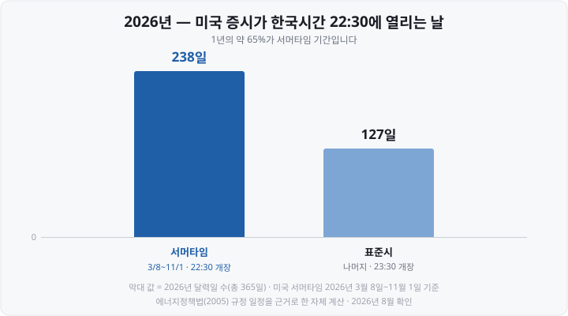
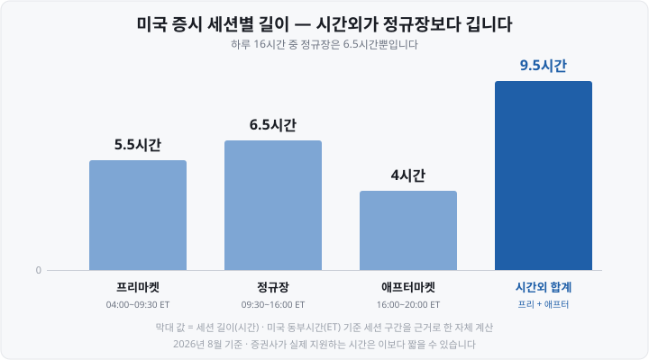

제가 미국 주식을 처음 샀을 때, 밤 11시 30분에 맞춰 알람을 맞춰 놓고 기다린 적이 있습니다. 그런데 그날은 이미 한 시간 전에 장이 열려 있었습니다. <mark>서머타임이 시작된 걸 몰랐던 겁니다.</mark>

그 뒤로 "미국장은 몇 시부터더라"를 계절마다 다시 검색하는 일이 반복됐습니다. 결국 외우는 방법을 바꾸고 나서야 헷갈리지 않게 됐습니다. **한국시간으로 외우지 않고, 미국 동부시간으로 외운 다음 더하는 방식입니다.**

오늘은 제가 정리한 그 방법과 함께, 프리마켓·애프터마켓, 한국 낮에 거래하는 주간거래, 2026년 휴장일, 그리고 밤사이 나온 실적이 다음날 우리 시장에 닿는 경로까지 짚어 보겠습니다.

&nbsp;

【🕘 기준은 동부시간(ET) 하나입니다】

미국 증시 시간표는 **동부시간 기준으로는 사시사철 똑같습니다.** 바뀌는 건 한국시간으로 옮길 때의 시차뿐입니다.

| 동부시간(ET) | 세션 | 성격 |
| :--- | :--- | :--- |
| 04:00~09:30 | **프리마켓** | 정규장 전 시간외 거래 |
| 09:30~16:00 | **정규장** | 개장·마감 동시호가 포함 |
| 16:00~20:00 | **애프터마켓** | 정규장 후 시간외 거래 |

한국은 **KST**(Korea Standard Time, 한국표준시) 하나만 쓰는데, 미국 동부는 두 개를 번갈아 씁니다.

- **EDT**(Eastern Daylight Time, 동부 일광절약시간 = 서머타임) → 한국이 **13시간** 빠름
- **EST**(Eastern Standard Time, 동부 표준시) → 한국이 **14시간** 빠름

그래서 동부시간에 13이나 14를 더하면 끝입니다. 정규장 09:30에 13을 더하면 22:30, 14를 더하면 23:30입니다.

&nbsp;

【🌏 한국시간으로 옮긴 시간표】

| 세션 | 서머타임(한국시간) | 표준시(한국시간) |
| :--- | :--- | :--- |
| 프리마켓 | 17:00~22:30 | 18:00~23:30 |
| **정규장** | **22:30~05:00** | **23:30~06:00** |
| 애프터마켓 | 05:00~09:00 | 06:00~10:00 |

이 표에서 제가 뒤늦게 알아차린 게 하나 있습니다. <mark>미국 애프터마켓이 끝나는 시각과 한국 증시가 열리는 시각이 겹칩니다.</mark>

서머타임 기간에는 미국 애프터마켓이 09:00에 끝나는데, 한국 정규장이 열리는 시각이 정확히 09:00입니다. 표준시 기간에는 미국 시간외 시장이 10:00까지 이어져 <mark>한국장이 열린 뒤에도 한 시간 동안 같이 돌아갑니다.</mark>

&nbsp;

【☀️ 서머타임 — 1년에 두 번 시간표가 움직입니다】

미국 서머타임 적용 기간은 법으로 정해져 있습니다.

- **시작** : 3월 **둘째 주 일요일** 새벽 2시
- **종료** : 11월 **첫째 주 일요일** 새벽 2시

2005년 에너지정책법으로 정해져 2007년부터 이 일정입니다. **2026년은 3월 8일에 시작해 11월 1일에 끝납니다.** 지금(2026년 8월)은 서머타임 기간이라 <mark>미국 정규장은 한국시간 22:30에 열려 05:00에 닫힙니다.</mark>

이게 성가신 이유는 **한국이 서머타임을 쓰지 않기 때문입니다.** 우리나라는 1987~1988년 서울올림픽에 맞춰 잠깐 시행했다가 1989년에 폐지한 뒤로 하지 않고 있습니다. 미국만 시계를 옮기니 시차가 13시간과 14시간 사이를 오갑니다.

그런데 두 시간표가 반반은 아닙니다.

1년의 약 **3분의 2**가 서머타임입니다. 그래서 "미국장은 밤 10시 30분"이 오히려 기본값에 가깝고, 11월부터 3월 초까지 넉 달 남짓만 11시 30분입니다.

※ 전환은 **일요일** 새벽에 일어나므로 체감하는 첫날은 그 다음 거래일입니다. 2026년이면 3월 9일(월) 밤부터 22:30 개장, 11월 2일(월) 밤부터 23:30 개장이었습니다.

※ 미국에서 서머타임을 없애거나 상시화하자는 법안이 여러 번 발의됐지만, **2026년 8월 현재 위 일정이 그대로입니다.**

&nbsp;

【⏳ 정규장 밖이 정규장보다 깁니다】

프리마켓과 애프터마켓을 짧은 덤처럼 생각하기 쉬운데, 시간만 보면 반대입니다.

하루 16시간 중 정규장은 **6.5시간뿐이고** 시간외가 **9.5시간입니다.** 다만 길다고 활발한 건 아닙니다. 오히려 반대입니다.

미국 **SEC**(Securities and Exchange Commission, 증권거래위원회)는 시간외 거래 위험을 따로 안내하고 있습니다.

- **유동성이 낮습니다.** 주문이 체결되지 않거나, 아예 거래가 없는 종목도 있습니다.
- **스프레드가 벌어집니다.** 매수·매도 호가 차이가 커져 <mark>정규장이라면 내지 않았을 가격에 체결됩니다.</mark>
- **변동성이 큽니다.** 적은 물량으로도 가격이 크게 흔들립니다.

여기에 **시간외에는 지정가 주문만 받는 것이 일반적입니다.** 얕은 호가창에서 시장가를 허용하면 가격이 튀기 때문입니다.

※ 그리고 <mark>증권사가 지원하는 시간은 위 표보다 짧은 경우가 많습니다.</mark> 프리마켓 시작 시각도, 애프터마켓 종료 시각도 회사마다 다릅니다. 저는 이걸 모르고 "왜 우리 앱은 아직 안 열리지" 하고 기다린 적이 있습니다. 실제 주문 전에 이용 증권사 안내를 꼭 확인하세요.

&nbsp;

【🌤️ 한국 낮에 미국 주식을 사는 법 — 주간거래】

밤에 깨어 있기 어렵다면 **주간거래**(데이마켓)가 있습니다. 미국 정규 거래소가 아니라 **ATS**(Alternative Trading System, 대체거래소)에 연결해 한국 낮에 미국 주식을 사고파는 서비스입니다.

원리는 단순합니다. 블루오션(Blue Ocean) 같은 미국 ATS가 **동부시간 20:00~04:00** 야간 세션을 운영하는데, 그 시간이 한국에서는 대낮입니다. 서머타임 기간이면 한국시간 **09:00~17:00** 무렵입니다.

이 서비스에는 꼭 알아야 할 사고 이력이 있습니다.

**2024년 8월 5일** 글로벌 증시가 급락한 날, 블루오션 ATS에서 시스템 문제로 일정 시각 이후 체결된 주문이 전량 취소됐습니다. 약 9만 계좌·6,300억 원 규모로 알려졌고, 금융당국은 국내 증권사의 미국주식 주간거래를 전면 중단시켰습니다.

서비스는 **2025년 11월 4일** 재개됐습니다. 1년 2개월 만이었고, 재개 조건은 **복수의 ATS 확보였습니다.** 한 곳이 멈춰도 거래가 통째로 무너지지 않게 블루오션 외에 문(Moon)·브루스(Bruce) 등을 함께 연결하도록 했습니다. 18개 증권사가 참여했습니다.

정리하면 이런 성격입니다.

- **정규장이 아닙니다.** 시간외라 유동성·스프레드 위험이 그대로 있습니다.
- **거래 가능 종목이 제한됩니다.** 증권사·ATS마다 다릅니다.
- **취소·정정 사태의 전례가 있습니다.** 복수 ATS로 보완했지만 정규 거래소와 같은 안정성을 가정하긴 어렵습니다.

&nbsp;

【📅 2026년 휴장일과 조기폐장】

미국 증시는 2026년에 **10일** 쉽니다.

| 날짜(현지) | 휴일 |
| :--- | :--- |
| 1월 1일(목) | 새해 첫날 |
| 1월 19일(월) | 마틴 루서 킹 데이 |
| 2월 16일(월) | 워싱턴 탄생일 |
| 4월 3일(금) | 성금요일 |
| 5월 25일(월) | 메모리얼 데이 |
| 6월 19일(금) | 준틴스 |
| 7월 3일(금) | 독립기념일(대체) |
| 9월 7일(월) | 노동절 |
| 11월 26일(목) | 추수감사절 |
| 12월 25일(금) | 크리스마스 |

7월 3일이 눈에 띕니다. <mark>2026년은 독립기념일(7월 4일)이 토요일이라 하루 앞당겨 금요일에 통째로 쉬었습니다.</mark> 미국 증시는 휴일이 토요일이면 전 금요일에, 일요일이면 다음 월요일에 쉽니다.

그리고 정규장이 동부시간 **13:00에** 끝나는 **조기폐장일**이 따로 있습니다.

- **11월 27일(금)** — 추수감사절 다음날
- **12월 24일(목)** — 크리스마스 이브

※ 여기서 계산을 틀리기 쉽습니다. **두 날 모두 11월 1일 서머타임 종료 이후라 표준시입니다.** 동부시간 13:00에 14를 더하면 <mark>한국시간 새벽 3시입니다.</mark> "오후 1시 마감이니 새벽 2시"로 외우면 어긋납니다.

※ 2026년 조기폐장이 두 번뿐인 것도 독립기념일 때문입니다. 보통은 7월 3일에도 조기폐장하는데 올해는 그날이 휴장일이 됐습니다.

&nbsp;

【📊 밤사이 실적이 다음날 우리 시장에 닿는 경로】

미국 증시 시간을 알아야 하는 가장 실전적인 이유가 여기 있습니다. <mark>미국 기업은 실적을 정규장 중에 발표하지 않습니다.</mark>

거의 모든 기업이 **정규장 마감 직후**(동부시간 16:00 이후)나 **개장 전**에 발표합니다. 미국의 **Reg FD**(Regulation Fair Disclosure, 공정공시 규정)가 중요한 미공개 정보를 일부에게만 먼저 줄 수 없게 하기 때문에, 모두가 동시에 소화하도록 한산한 시간에 내놓는 관행이 자리 잡았습니다.

한국 투자자에게는 이렇게 이어집니다.

1. 미국 기업이 **동부시간 16:05쯤** 발표합니다. 서머타임 기준 한국시간 **새벽 5시 5분** 무렵입니다.
2. 발표 직후 **애프터마켓에서** 주가가 크게 움직입니다. 정규장 종가는 이미 확정된 뒤라 <mark>"어제 종가"와 "지금 가격"이 벌어진 채 밤이 지나갑니다.</mark>
3. 그 종목이 반도체처럼 한국 상장사와 엮인 업종이면, **한국 증시가 09:00에 열릴 때** 관련 종목 시초가에 그 반응이 먼저 반영됩니다.
4. 정작 그 미국 주식의 **정규장** 반응은 그날 밤 22:30이 되어야 나옵니다.

즉 우리는 미국 실적의 여파를 한국장에서 먼저 겪고, 원본 시장의 반응은 그날 밤에 확인하는 순서가 됩니다. 애프터마켓에서 크게 올랐던 종목이 다음날 정규장에서 되밀리는 일도 흔합니다. 얕은 유동성에서 만들어진 가격이기 때문입니다.

※ **결제일.** 미국 주식시장은 **2024년 5월 28일부터** 현지 결제주기를 T+2에서 **T+1**(거래일 다음 영업일)로 단축했습니다. 국내 증권사를 통한 매도대금 입금·환전 시점은 회사마다 다릅니다.

&nbsp;

【🔮 시간표가 또 바뀝니다 (아직 시행 전)】

지금까지 본 시간표는 **곧 낡을 예정입니다.**

**나스닥 23시간 거래(23/5).** SEC가 **2026년 4월 10일** 나스닥의 거래시간 확대안을 승인했습니다.

| 세션 | 동부시간 | 서머타임 기준 한국시간 |
| :--- | :--- | :--- |
| 데이 세션 | 04:00~20:00 | 17:00~09:00 |
| (정비 시간) | 20:00~21:00 | 09:00~10:00 |
| 나이트 세션 | 21:00~04:00 | 10:00~17:00 |

주 5일, 하루 23시간입니다. 한국 투자자에게 이 표의 의미는 분명합니다. <mark>서머타임 기준 한국시간 오전 9시~10시 한 시간만 빼면 하루 종일 거래할 수 있게 됩니다.</mark>

**NYSE 아카(Arca) 22시간 거래.** 뉴욕증권거래소 계열 NYSE Arca도 2025년 2월 기존 정규 거래소 중 처음으로 SEC 승인을 받았고, 오버나이트·얼리·코어·레이트 네 세션 체제를 준비 중입니다.

※ **다만 2026년 8월 현재 둘 다 시작하지 않았습니다.** 승인과 시행은 다릅니다. 야간 호가·체결 정보를 배포할 **SIP**(증권정보처리기관)와 결제를 맡는 **DTCC**(예탁결제기관)가 24시간 체제를 갖춰야 하고, 나스닥은 그 뒤 별도 규칙 변경안을 다시 SEC에 내야 합니다. 목표 시점도 자료마다 **2026년 3분기 초에서 12월까지** 엇갈립니다.

&nbsp;

【✅ 오늘 정리】

- **동부시간으로 외우세요.** 프리마켓 04:00~09:30, 정규장 09:30~16:00, 애프터마켓 16:00~20:00은 사시사철 같습니다.
- **한국시간은 서머타임에 따라 갈립니다.** 정규장이 서머타임에는 **22:30~05:00**, 표준시에는 **23:30~06:00**입니다.
- **2026년 서머타임은 3월 8일~11월 1일**이고 1년의 약 65%(238일)라 22:30 개장이 기본값에 가깝습니다.
- **한국은 서머타임을 쓰지 않습니다.** 1989년 폐지 이후 미실시입니다.
- **시간외가 정규장보다 깁니다**(9.5시간 vs 6.5시간). 하지만 유동성·스프레드·변동성 위험이 큽니다.
- **주간거래는** 미국 ATS 야간 세션을 한국 낮에 연결한 것입니다. 2024년 8월 5일 사태로 중단됐다가 **2025년 11월 4일** 복수 ATS 체제로 재개됐습니다.
- **2026년 휴장 10일**, 독립기념일이 토요일이라 **7월 3일에** 쉬었습니다.
- **조기폐장은 11월 27일·12월 24일**이고, 표준시라 한국시간 새벽 3시 마감입니다.
- **실적은 정규장 중에 안 나옵니다.** 애프터마켓 반응이 <mark>다음날 한국장 시초가에 먼저 반영됩니다.</mark>
- **나스닥 23시간 거래는 승인됐지만 2026년 8월 현재 시행 전입니다.**

&nbsp;

【🔗 함께 보면 좋은 글】

- [호가창 보는 법 — 매수·매도 잔량과 호가 단위가 뜻하는 것](https://blog.naver.com/hdglace/224364657994) : 오늘 말한 '스프레드가 벌어진다'가 실제로 어떤 화면인지, 그리고 국내 대체거래소 NXT의 프리마켓과 무엇이 다른지 정리했습니다.
- [ADR이란 무엇인가 — 한국 주식이 미국에서 거래되는 법](https://blog.naver.com/hdglace/224360141124) : 한국장이 닫힌 뒤에도 가격이 움직이는 그 배경이 오늘 본 시간표입니다.
- [ETF란 무엇인가 — 주식도 펀드도 아닌, 초보에게 가장 쉬운 시작](https://blog.naver.com/hdglace/224350308437) : 다음 편에서 다룰 ETF 보수·세금 이야기의 출발점입니다.

&nbsp;

【📌 다음 편 예고】

다음 글에서는 **ETF 총보수와 세금을** 다룹니다. 공시되는 총보수와 실제로 빠져나가는 **실부담비용이** 왜 다른지, 국내주식형·국내상장 해외형·해외 직접상장 ETF의 세금이 어떻게 갈리는지 금융투자협회 공시 기준으로 정리하겠습니다.

&nbsp;

📊 데이터 출처 및 기준일

- 미국 정규장 09:30~16:00 ET, 프리마켓 04:00~09:30 ET, 애프터마켓 16:00~20:00 ET : NYSE 거래시간·휴장일 안내, 나스닥 시장 안내, 국내 증권사 해외주식 매매거래시간 안내로 **2026년 8월 교차확인.** NYSE Arca 얼리 세션은 04:00부터, NYSE·NYSE American은 07:00부터 시작하는 등 거래소별로 다릅니다.
- 한국시간 환산(서머타임 프리 17:00~22:30 / 정규장 22:30~05:00 / 애프터 05:00~09:00, 표준시 프리 18:00~23:30 / 정규장 23:30~06:00 / 애프터 06:00~10:00) : 동부시간에 시차(EDT 13시간, EST 14시간)를 적용한 **자체 계산.** 국내 증권사 해외주식 거래시간 안내로 2026년 8월 교차확인.
- 미국 서머타임 기간(3월 둘째 주 일요일 ~ 11월 첫째 주 일요일, 2026년 3월 8일~11월 1일) : **미국 표준기술연구소(NIST) 일광절약시간 규정** 및 timeanddate.com 2026년 자료로 2026년 8월 확인. 현행 일정은 **2005년 에너지정책법**에 따라 2007년부터 적용 중입니다.
- 2026년 서머타임 238일 / 표준시 127일 : 위 기간을 근거로 한 **자체 계산**(달력일, 2026년 365일). 거래일(평일) 기준으로는 약 170일·91일입니다.
- 세션별 길이(프리 5.5시간 / 정규장 6.5시간 / 애프터 4시간 / 시간외 합계 9.5시간) : 동부시간 세션 구간을 근거로 한 **자체 계산.** 증권사 실제 지원 시간은 더 짧을 수 있습니다.
- 한국 서머타임 미실시(1987~1988년 시행 후 1989년 폐지) : **국가기록원 「서머타임제」 기록** 및 한국민족문화대백과사전 '일광절약시간제' 항목 확인.
- 시간외 거래 위험(유동성 부족·스프레드 확대·가격 변동성·일부 종목 미거래) : **미국 SEC 투자자 안내 「After-Hours Trading: Understanding the Risks」** 및 FINRA 규정 2265, 2026년 8월 확인.
- 시간외 세션 지정가 주문만 허용이 일반적 : 2026년 8월 미국·국내 증권사 시간외 거래 안내 확인. 허용 주문 유형은 증권사·세션별로 다를 수 있습니다.
- 국내 증권사 애프터마켓 종료시간 연장 : 2026년 8월 증권사 공지 및 보도 확인. ⚠️ **종료 시각은 증권사마다 다릅니다.**
- 주간거래 구조(미국 ATS 야간 세션 동부시간 20:00~04:00을 한국 낮에 연결) : 2026년 8월 국내 증권사 주간거래 안내 및 보도 확인. 한국시간 운영 구간은 서머타임 여부·증권사별 종료 시각에 따라 다릅니다.
- 2024년 8월 5일 블루오션 ATS 주문 취소 사태(약 9만 계좌·6,300억 원), 금융당국의 주간거래 전면 중단 : 2024~2025년 언론 보도 및 금융당국 조치 보도로 교차확인. 계좌 수·금액은 보도 기준입니다.
- 2025년 11월 4일 주간거래 재개, 18개 증권사 참여, 복수 ATS(블루오션·문·브루스 등) 확보 조건 : 2025년 9~11월 언론 보도(한국경제·한국금융신문·시사저널e 등) 교차확인. 참여 증권사·연결 ATS는 변동될 수 있습니다.
- 2026년 미국 증시 휴장일 10일 : **NYSE 그룹 「2025·2026·2027 Holiday and Early Closings Calendar」** 공식 발표 및 나스닥 안내로 2026년 8월 교차확인. 7월 4일이 토요일이어서 7월 3일(금)이 휴장일이 됐고, 실제 휴장은 당시 보도로 확인했습니다.
- 2026년 조기폐장 2일(11월 27일·12월 24일, 동부시간 13:00 마감 / 옵션 13:15) : NYSE 그룹 공식 캘린더 확인. **두 날 모두 서머타임 종료 후라 한국시간 03:00 마감**이라는 환산은 **자체 계산**입니다. 채권시장 일정은 주식시장과 다릅니다.
- 미국 기업 실적 발표가 정규장 마감 후·개장 전에 이뤄지는 관행, Reg FD : **미국 SEC Regulation FD(17 CFR 243.100)** 및 2026년 8월 해설 자료 확인. 발표 시각은 기업마다 다르며 '16:05쯤'은 통상적인 예시입니다.
- 미국 결제주기 T+2 → T+1, 2024년 5월 28일 시행 : **미국 SEC 결제주기 단축 규정** 및 국내 증권사 「미국시장 결제일 변경 안내」, 자본시장연구원 보고서 교차확인.
- 나스닥 23시간 거래(23/5) SEC 승인 2026년 4월 10일, 데이 세션 04:00~20:00 ET·나이트 세션 21:00~04:00 ET : **SEC 승인 명령(File No. SR-Nasdaq-2025-109)** 및 로펌 해설(Alston & Bird 2026년 5월, Simpson Thacher·Arnold & Porter 2026년 4월) 교차확인.
- 나스닥 23/5 시행 조건(SIP·DTCC 인프라 준비 후 별도 규칙 변경안 재제출) 및 시행 시점 미확정 : 위 자료 확인. ⚠️ **목표 시점이 '2026년 3분기 초'와 '2026년 12월 6일'로 엇갈리며 2026년 8월 현재 시행되지 않았습니다.**
- NYSE Arca 거래시간 연장(2025년 2월 SEC 승인, 오버나이트·얼리·코어·레이트 4세션 준비) : NYSE 「Extended Hours Trading」 안내 및 보도로 2026년 8월 확인. ⚠️ **아직 시행 전입니다.**
- 한국 정규장 09:00~15:30 : 한국거래소 매매거래시간 기준, 2026년 8월 확인.

&nbsp;

※ 본 글은 공개된 거래소 공시·규정·감독기관 안내와 언론 보도를 정리한 정보성 콘텐츠이며, 특정 종목·증권사·거래 시간대의 매매를 권유하거나 우열을 판단하지 않습니다. 시간외 거래(프리마켓·애프터마켓·주간거래)는 본문에 밝힌 대로 유동성과 가격 변동 측면의 위험이 있습니다. 시간·일정은 위에 밝힌 기준 시점의 값이며, 특히 나스닥·NYSE Arca의 거래시간 확대는 시행 전 제도로 변경될 수 있습니다. 증권사가 지원하는 거래 시간과 종목은 회사마다 다르니 실제 주문 전 이용 증권사 안내를 확인하세요. 모든 투자 판단과 책임은 투자자 본인에게 있습니다.

&nbsp;

#미국증시시간 #미국주식거래시간 #서머타임 #프리마켓 #애프터마켓 #미국주식주간거래 #데이마켓 #미국증시휴장일 #나스닥 #뉴욕증시 #서학개미 #미국주식초보 #투자공부 #재테크
