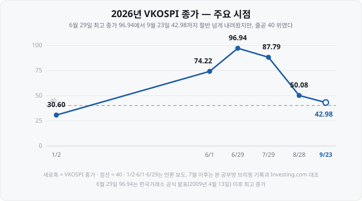

저는 투자 초기에 VKOSPI를 '높으면 위험하고 낮으면 안전하다'는 정도로만 알았습니다. 그러다 2026년 여름, 이 숫자가 7월 중순부터 8월 28일까지 하루도 빠짐없이 50을 넘기는 걸 보면서 궁금해졌어요. 매일 '공포 구간'이라고만 나오는데, 그러면 이 숫자로 알 수 있는 게 도대체 뭘까?

찾아보니 답은 생각보다 구체적이었습니다. <mark>VKOSPI 42.98은 '앞으로 한 달 동안 코스피200이 하루 2.7% 안팎으로 움직일 것'이라는 옵션 시장의 예상</mark>으로 바꿔 읽을 수 있습니다.

2026년 9월 23일 VKOSPI는 **42.98로** 마감했고, 하루 전 미국의 VIX는 **14.21이었습니다.** 한국의 '공포지수'가 미국의 세 배입니다.

오늘은 계산 원리부터 정리하고, 숫자를 등락폭으로 환산하는 법, 흔히 쓰는 수치대 해석이 2026년에 어떻게 어긋났는지, 실제 등락과 대조하는 방법까지 차례로 보겠습니다.

&nbsp;

【두 지수의 기본 정보】

VKOSPI(KOSPI 200 Volatility Index, 코스피200 변동성지수)는 한국거래소가, VIX(Cboe Volatility Index, 시카고옵션거래소 변동성지수)는 미국 Cboe(Chicago Board Options Exchange, 시카고옵션거래소)가 산출합니다.

| 항목 | VKOSPI | VIX |
| :-- | :-- | :-- |
| 산출 기관 | 한국거래소 | Cboe Global Markets |
| 계산에 쓰는 옵션 | 코스피200 옵션 | S&P500 옵션(SPX·SPXW) |
| 예상하는 기간 | 앞으로 30일 | 앞으로 30일 |
| 공식 발표 시작 | 2009년 4월 13일 | 1993년 도입, 현행 방식은 2003년 9월 22일부터 |
| 발표 주기 | 10초(2022년 한국거래소 연구원 논문 기준) | 15초 |

둘 다 **앞으로 30일 동안 지수가 얼마나 크게 움직일지**에 대한 예상을 숫자로 만든 것입니다. 방향은 담지 않습니다. 오를지 내릴지가 아니라 **움직임의 폭이** 대상입니다.

&nbsp;

【무엇으로 계산하나 — 옵션 가격에 들어 있는 예상】

옵션은 정해진 가격에 사거나 팔 권리입니다. 지수가 크게 움직일 것 같으면 이 권리의 값이 비싸집니다. 크게 오르든 크게 내리든 권리를 쓸 기회가 커지기 때문입니다. 그래서 거꾸로, **옵션 가격을 보면 시장이 예상하는 움직임의 폭을 계산해 낼 수 있습니다.** 이렇게 옵션 가격에서 역산한 값을 **내재변동성**(Implied Volatility)이라고 부릅니다. 내재(內在)는 '안에 들어 있다'는 뜻으로, 가격 안에 들어 있는 변동성이라는 말입니다.

VKOSPI와 VIX는 행사가격 하나의 내재변동성이 아니라 **여러 행사가격의 옵션 가격을 한꺼번에 모아** 계산합니다. VKOSPI 도입 당시 증권사 해설 자료에 실린 거래소 산출 방식은 이렇습니다.

- 만기가 가장 가까운 월물(최근월물)과 그다음 월물(차근월물)의 **등가격·외가격 옵션 전체**를 씁니다. ATM(At The Money, 등가격)은 행사가격이 지금 지수와 가장 가까운 옵션이고, OTM(Out of The Money, 외가격)은 지금 행사하면 이익이 없는 옵션, 즉 등가격보다 행사가격이 높은 콜옵션과 낮은 풋옵션입니다.
- 두 월물로 각각 구한 값을 **30일 기준으로 맞춥니다**(선형 보간). 만기가 30일보다 짧은 것과 긴 것 사이에서 30일에 해당하는 값을 비율로 계산한다는 뜻입니다. 월물이 막 바뀌어 최근월물 만기가 30일 넘게 남은 때는 최근월물만 씁니다.
- 계산식은 미국 VIX와 같은 공정분산스왑(Fair Variance Swap) 방식입니다. 분산스왑은 앞으로 실제로 나타날 변동성을 사고파는 계약인데, 여러 행사가격의 옵션 가격을 합치면 이 계약의 '공정한 가격'을 구할 수 있습니다. 그 값에 제곱근을 씌운 것이 지수입니다.

2022년 한국거래소 연구원이 한국증권학회지에 낸 논문도 현행 VKOSPI를 같은 구조로 설명합니다. 가장 가까운 두 만기로 30일 값을 맞추고, 가장 가까운 만기가 돌아오는 주에는 그다음 두 만기로 바꿉니다. 이 논문은 차근월물 거래가 너무 적어 **예전 체결가가 계속 반영되면서 지수가 비정상적으로 둔해지거나, 체결 한 건에 크게 튀는 문제**를 지적하고, 차근월물 대신 **위클리옵션**(매주 만기가 돌아오는 옵션)을 쓰는 방안을 제안했습니다. 현행 VKOSPI는 위클리옵션을 쓰지 않습니다.

VIX는 만기가 30일 이하로 남은 근월물과 30일을 넘는 차월물, 두 만기의 SPX·SPXW 옵션으로 역시 30일 기준 값을 만듭니다(Cboe 산출방법서 6.0판, 2026년 2월 26일 개정). SPX는 매달 셋째 금요일 장 시작 때 만기가 오는 표준 월물 옵션이고, SPXW는 셋째 금요일을 뺀 매주 금요일 장 마감 때 만기가 오는 위클리 옵션입니다. VKOSPI와 달리 VIX는 위클리 옵션까지 함께 씁니다.

&nbsp;

【과거 등락으로 계산하는 변동성과 다릅니다】

변동성에는 한 가지가 더 있습니다. 지나간 일별 등락률로 계산하는 **실현변동성**(Realized Volatility, 역사적 변동성이라고도 합니다)입니다. <mark>VKOSPI는 앞으로의 예상이고, 실현변동성은 이미 일어난 움직임입니다.</mark> 둘 다 1년 단위로 환산한 값(연율 %)이라 나란히 놓고 비교할 수 있고, 이 글 뒷부분에서 그 비교를 직접 해 보겠습니다.

&nbsp;

【숫자 읽는 법 — 하루·한 달 등락폭으로 바꾸기】

VKOSPI와 VIX의 숫자는 **연 단위로 환산한 변동성(%)입니다.** 42.98은 "1년 기준 42.98%"라는 뜻인데, 1년짜리 숫자는 감이 잘 오지 않습니다. 기간을 줄이려면 기간 비율의 제곱근으로 나눕니다.

- **하루치** = 지수 ÷ √252 (1년 거래일을 관행상 252일로 봅니다, √252 ≈ 15.9)
- **한 달치** = 지수 ÷ √12 (√12 ≈ 3.46)

기간에 비례해서가 아니라 기간의 제곱근에 비례해서 커지는 것이 변동성의 성질이라, 12로 나누지 않고 √12로 나눕니다.

| 지수 값 | 하루 환산 | 한 달 환산 |
| :-- | --: | --: |
| VIX 14.21 (2026-09-22) | 약 0.90% | 약 4.1% |
| 20 (언론이 '평균'으로 부르는 수준) | 약 1.26% | 약 5.8% |
| 40 (언론이 '공포 구간'의 경계로 쓰는 값) | 약 2.52% | 약 11.5% |
| VKOSPI 42.98 (2026-09-23) | 약 2.71% | 약 12.4% |
| VKOSPI 96.94 (2026-06-29, 공식 발표 이후 최고 종가) | 약 6.11% | 약 28.0% |

<small>환산은 본 공부방 계산 · 하루 = 지수÷√252, 한 달 = 지수÷√12</small>

<mark>VKOSPI 42.98이면 코스피200이 하루에 2.7% 안팎 움직이는 것이 옵션 시장의 예상입니다.</mark> 하루 전 VIX로 환산한 S&P500의 예상 폭은 0.9%입니다.

이 환산을 건너뛰면 해석이 크게 어긋납니다. 기획재정부 시사경제용어사전의 VIX 설명은 "VIX 30(%)이라고 하면 앞으로 한 달간 주가가 30%의 등락을 거듭할 것이라고 예상하는 투자자들이 많다는 것을 의미한다"고 적고 있습니다. 그런데 30은 연 단위 값이므로 한 달로 환산하면 30 ÷ √12 ≈ **8.7%입니다.** <mark>연율을 그대로 한 달치로 읽으면 예상 폭을 3배 넘게 크게 보게 됩니다.</mark>

이 환산값은 통계에서 말하는 **1표준편차**입니다. 등락률이 정규분포를 따른다고 가정하면, VKOSPI 42.98일 때 **약 68%(대략 3분의 2)의 날은 −2.71%~+2.71% 사이에서** 움직인다는 뜻입니다. 흔히 보이는 '34%'는 0%에서 +2.71%까지처럼 한쪽 방향만 센 비율이고, 위아래를 합치면 68%입니다.

거꾸로 말하면 <mark>정규분포를 가정해도 3일에 하루꼴(약 32%)은 이 범위를 벗어납니다.</mark> "이 범위를 넘는 날은 거의 없다"고 읽으면 안 됩니다. 실제로 2026년 8월 27일부터 9월 23일까지 20거래일 동안 코스피200이 하루 2.71%를 넘게 움직인 날은 4일(9월 2일 −4.07%, 9월 7일 +5.10%, 9월 14일 −3.61%, 9월 18일 +3.02%)이었습니다. 게다가 실제 주가는 정규분포보다 아주 큰 폭의 등락이 자주 나오는 편이라, 7월 31일처럼 하루 20% 가까이 움직이는 날도 나옵니다.

&nbsp;

【왜 '공포지수'인가 — 그리고 늘 그렇지는 않다는 것】

주가가 급락할 때는 손실을 막으려는 풋옵션 매수가 몰리고, 옵션 가격이 오르면서 변동성지수도 오릅니다. 그래서 **주가가 내릴 때 변동성지수가 오르는** 경향이 생겼고, VIX는 오래전부터 '공포 지표(fear gauge)'라고 불렸습니다. 기획재정부 시사경제용어사전도 VKOSPI가 "주가가 급락할 때 변동성지수는 급등하는 역상관관계를 보였기 때문에" 공포지수로 불린다고 설명합니다.

그런데 2026년에는 이 경향과 다른 장면이 여러 번 나왔습니다.

- **2026년 6월 9일**, 코스피200은 전날보다 **9.0% 올랐는데** VKOSPI는 19.04% 뛰어 91.23으로 마감했습니다. 당시 삼성증권 연구원은 코스피가 가파르게 오르면서 '상승위험', 즉 앞으로 더 크게 오를 수도 있다는 쪽에 투자자들이 민감해진 결과라고 해석했습니다.
- 2026년 상반기 코스피가 처음으로 9,000선을 넘는 동안에도 VKOSPI는 함께 올라 6월 29일 사상 최고 종가를 기록했습니다.

<mark>변동성지수는 '하락에 대한 공포'가 아니라 '움직임의 폭에 대한 예상'이기 때문입니다.</mark> 위로든 아래로든 크게 움직일 것 같으면 올라갑니다.

2026년 7월 15일부터 9월 23일까지 49거래일을 제가 직접 세어 보니, 코스피200과 VKOSPI가 **반대 방향으로 움직인 날은 28일, 같은 방향으로 움직인 날은 21일이었습니다.** 둘이 얼마나 반대로 움직이는지를 나타내는 상관계수(−1이면 늘 정반대, 0이면 서로 무관)는 −0.23으로 약했습니다. 이 기간에는 VKOSPI가 86에서 43으로 내려오는 중이어서, 코스피200이 내린 20일 가운데서도 VKOSPI가 함께 내린 날이 13일이었습니다.

즉 '주가와 반대로 움직인다'는 것은 **평균적인 경향**이지 날마다 성립하는 규칙이 아닙니다.

&nbsp;

【수치대별 해석 관행 — 그리고 그 한계】

뉴스와 용어사전에는 대개 이런 기준이 나옵니다.

| 출처 | 구분 |
| :-- | :-- |
| 한국경제 경제용어사전 「코스피200 변동성지수」 | 20선 초반 = 안정적, 30 초과 = 변동성이 큰 것으로 간주 |
| 아시아경제 2026-07-21 기사 | 20선 = 평균 구간, 30 이상 = 변동성 확대, 40 이상 = 공포 구간 |

미국 VIX는 긴 기록이 공개돼 있어 이 기준이 어디서 나왔는지 확인할 수 있습니다. Cboe가 공개한 1990년 1월 2일~2026년 9월 22일 일별 종가 9,278일을 집계하면 이렇습니다.

| 항목 | VIX |
| :-- | --: |
| 평균 | 19.43 |
| 중앙값 | 17.58 |
| 20 이상이었던 날 | 37.0% |
| 30 이상이었던 날 | 7.9% |
| 40 이상이었던 날 | 2.2% |
| 최고 종가 | 82.69 (2020-03-16) |

<small>Cboe VIX 일별 종가 CSV로 본 공부방 집계 · 2003년 9월 이전 값은 현행 방식으로 소급 계산된 값입니다</small>

VIX에서 '20 = 평균'은 실제 기록과 맞습니다. 해석 문장 가운데 검산할 수 있는 것도 있습니다. 같은 시사경제용어사전은 VIX가 "40 이상 50에 근접하면 바닥권 진입의 징조로 해석돼 주가 반등이 이루어진다"고 적었습니다. 같은 자료로 확인해 보겠습니다. 각 날의 VIX 종가로 날을 나누고, **그날로부터 21거래일 뒤 S&P500 종가가 그날보다 높았는지**를 집계했습니다.

| 그날 VIX | 해당한 날 | 21거래일 뒤 S&P500이 높았던 비율 | 변화율 중앙값 | 가장 나빴던 경우 |
| :-- | --: | --: | --: | --: |
| 20 미만 | 5,798일 | 64.3% | +1.1% | −33.0% |
| 20~30 | 2,688일 | 61.2% | +1.4% | −28.0% |
| 30~40 | 528일 | 74.2% | +3.6% | −30.0% |
| 40 이상 | 208일 | 63.5% | +3.7% | −20.0% |
| **전체** | **9,222일** | **63.9%** | **+1.2%** | **−33.0%** |

<small>표본 = 1990년 1월 2일~2026년 9월 21일 중 21거래일 뒤 S&P500 종가가 있는 날 · VIX는 Cboe, S&P500 종가는 Yahoo Finance · 본 공부방 자체 계산 · 과거 기록이며 앞으로의 방향을 뜻하지 않습니다</small>

<mark>VIX가 40 이상이었던 날 뒤에 지수가 오른 비율은 63.5%로, 아무 날이나 고른 전체(63.9%)와 거의 같았습니다.</mark> 변화율 중앙값은 +3.7%로 전체(+1.2%)보다 높았지만, 오른 비율 자체는 같았고 21거래일 뒤 20% 더 떨어진 경우도 있었습니다. 30~40 구간의 74.2%가 눈에 띄지만, 해당한 날이 몇 차례의 급락장에 몰려 있습니다. 같은 급락장 안의 연이은 날들은 뒤따른 21거래일도 대부분 겹치므로, 528번의 서로 다른 결과라기보다 몇 번의 사례를 여러 번 센 셈입니다. "40을 넘으면 반등한다"는 문장은 이 36년치 기록으로는 확인되지 않습니다.

더 큰 문제는 **이 기준들을 VKOSPI에 그대로 옮기는 것**입니다.

&nbsp;

【한계 ① — 매일 같은 구간이면 구분이 되지 않습니다】

아래는 2026년 VKOSPI 종가의 흐름입니다.

연초 30.60에서 출발해 6월 29일 96.94까지 올랐다가, 9월에는 40대 초반까지 내려왔습니다. 이 경로를 '40 이상 = 공포 구간' 기준으로만 읽으면 **7월 중순부터 지금까지 거의 매일 같은 답이 나옵니다.** 7월 14일부터 9월 23일까지 50거래일 가운데 종가가 40 아래였던 날은 9월 4일(39.33) 하루뿐이었고, 다음 거래일에 바로 40 위로 돌아왔습니다.

제가 매일 쓰는 개장 전 브리핑도 실제로 이 문제를 겪었습니다. 2026년 7월 14일부터 8월 20일까지 26거래일 동안 VKOSPI는 **하루도 빠짐없이 55를 넘었고**(최저 55.28, 평균 75.3), 그 사이 6월 고점 96.94에서 50대 후반으로 40% 넘게 내려온 완화 흐름이 '공포 구간'이라는 한 단어에 가려졌습니다. <mark>매일 같은 답을 내는 기준으로는 완화와 악화를 구분할 수 없습니다.</mark>

그래서 제 브리핑은 2026년 8월 22일부터 구간을 **평시(25 미만)·주의(25~40)·경보(40~60)·위기(60 이상)** 네 단계로 쓰고, **수준 옆에 방향을 반드시 함께 적습니다.** 적는 요소는 세 가지입니다.

1. 현재 값과 전일 대비 변화
2. 최근 고점 대비 변화율
3. 평시 상단(25)의 몇 배인지

2026년 9월 23일 값으로 적으면 이렇습니다.

> VKOSPI 42.98(+0.56) — 6월 29일 고점 96.94 대비 −55.7%, 평시 상단 25의 1.7배

'경보 구간'이라는 한 단어보다 <mark>고점에서 절반 넘게 내려왔지만 여전히 평시의 1.7배라는 두 사실</mark>이 함께 전달됩니다. 이 네 단계 구분과 경계값(25·40·60)은 **제 브리핑에서 정한 것**이고 거래소나 업계의 공식 기준이 아니라는 점도 밝혀 둡니다.

&nbsp;

【한계 ② — 시장마다 평소 값이 다릅니다】

같은 날 VKOSPI와 VIX를 나란히 보면 차이가 큽니다. 6월 29일 VKOSPI가 96.94였을 때 같은 날 미국 VIX 종가는 **17.65였습니다.** 미국은 장기 평균 아래였고 한국은 기록을 새로 쓰고 있었습니다.

아시아경제는 그 이유로 **시장 집중도**를 들었습니다. 삼성전자와 SK하이닉스 두 종목이 코스피 시가총액의 50%를 넘는 반면, S&P500에서 반도체 비중은 18% 수준이어서 충격이 분산된다는 설명입니다. 지수를 이루는 종목이 몇 개에 몰려 있으면 그 종목들의 등락이 곧 지수의 등락이 되고, 옵션 가격도 그만큼 비싸집니다.

VKOSPI의 평소 값도 VIX와 같다고 볼 근거가 약합니다. 앞의 2022년 논문은 2019년 9월~2020년 6월 VKOSPI의 평균(10초 단위 값 기준)을 약 24.07로 적었는데, 이 기간에는 코로나 급락이 들어 있습니다. <mark>VIX의 '20 = 평균'을 VKOSPI에 그대로 대입하면 기준부터 어긋날 수 있습니다.</mark> 다만 VKOSPI의 장기 평균을 공식적으로 공표한 자료는 이번 조사에서 찾지 못했습니다.

&nbsp;

【실제 등락과 대조하기 — 실현변동성】

VKOSPI가 예상한 폭이 실제로 맞았는지는 나중에 확인할 수 있습니다. 코스피200의 일별 등락률로 실현변동성을 계산하면 됩니다.

> 실현변동성(%) = √(일별 로그수익률 제곱의 평균 × 252) × 100

로그수익률은 ln(오늘 종가 ÷ 어제 종가)로, 하루 등락률과 거의 같은 값입니다. 어려워 보이지만 원리는 간단합니다. 하루하루 움직인 폭을 제곱해 평균 내고, 1년 단위로 늘린 뒤 제곱근을 씌웁니다. 이렇게 하면 VKOSPI와 같은 단위(연율 %)가 됩니다.

VKOSPI는 앞으로 30일(약 21거래일)을 예상하므로, 그날 VKOSPI와 **그 뒤 21거래일의 실현변동성을** 나란히 놓으면 예상과 결과를 비교할 수 있습니다. 비교용으로 그날까지 **지난 20거래일의 실현변동성도** 함께 적었습니다.

| 날짜 | VKOSPI | 지난 20거래일 실현변동성 | 이후 21거래일 실현변동성 |
| :-- | --: | --: | --: |
| 2026-07-14 | 83.97 | 81.9 | 100.1 |
| 2026-07-30 | 86.18 | 92.9 | 82.7 |
| 2026-08-13 | 55.28 | 100.1 | 47.3 |
| 2026-08-25 | 56.29 | 97.6 | 33.0 |
| 2026-09-23 | 42.98 | 33.7 | (아직 없음) |

<small>코스피200 종가(네이버 금융, 2026년 9월 25일 조회)로 본 공부방 계산 · VKOSPI는 한국거래소 Open API · 과거 기록이며 앞으로의 방향을 뜻하지 않습니다</small>

표에서 읽을 수 있는 것은 세 가지입니다.

**첫째, 예상은 크게 빗나가기도 합니다.** 7월 14일 VKOSPI 83.97은 이미 80을 넘는 높은 값이었지만, 그 뒤 21거래일 동안 코스피200은 **연율 100.1%로** 더 크게 움직였습니다. 7월 31일 하루에만 20.0% 올랐습니다. 반대로 8월 25일 VKOSPI 56.29 뒤의 실제 움직임은 33.0으로 예상의 60%에도 못 미쳤습니다.

**둘째, 지난 20거래일 실현변동성은 하루짜리 급등락에 크게 좌우됩니다.** 7월 31일의 +20.0%가 계산 기간에 들어 있던 8월 28일에는 지난 20거래일 실현변동성이 84.7이었는데, 그날이 기간에서 빠진 8월 31일에는 **54.7로 하루 만에 30포인트 떨어졌습니다.** 시장이 그날 갑자기 잔잔해진 것이 아니라 계산 기간이 바뀐 것입니다.

**셋째, 지금은 예상이 최근의 실제 움직임보다 큽니다.** 9월 23일 VKOSPI 42.98은 지난 20거래일 실현변동성 33.7보다 9포인트쯤 높습니다. <mark>옵션 시장이 최근 한 달의 실제 움직임보다 큰 폭을 가격에 반영하고 있다는 뜻입니다.</mark> 이 차이가 앞으로 어떻게 풀릴지는 이 계산으로 알 수 없습니다. 첫째에서 본 것처럼 예상과 결과는 어느 방향으로든 벌어질 수 있습니다.

VKOSPI 하나만 보면 "높다·낮다"로 끝나지만, 실현변동성을 옆에 두면 **"옵션 시장이 최근 실제 움직임보다 더 큰 폭을 예상하는가, 더 작은 폭을 예상하는가"를** 물을 수 있습니다. 수준 하나보다 이 질문이 더 쓸모 있습니다.

&nbsp;

【어디서 보나】

- **VKOSPI** — 한국거래소가 파생상품지수의 하나로 공표합니다. 한국거래소 Open API의 「파생상품지수 시세정보」 서비스가 2010년 1월 4일 이후 일별 종가·시가·고가·저가를 제공합니다(인증키 필요). 정보데이터시스템의 통계 화면은 2025년 12월 개편 이후 로그인해야 열립니다. 받는 방법은 [과거 주가 데이터 받는 법](https://blog.naver.com/hdglace/224404481437) 편에 정리해 두었습니다. 증권사 프로그램과 Investing.com 같은 시세 사이트에서도 볼 수 있습니다.
- **VIX** — Cboe 홈페이지가 1990년부터의 일별 시가·고가·저가·종가를 CSV 파일로 무료 공개합니다. 이 글의 VIX 집계도 그 파일로 했습니다.
- **실현변동성** — 따로 공표되는 값이 아니어서 지수 일별 종가를 받아 직접 계산해야 합니다. 위 계산식을 엑셀에 옮기면 됩니다.

VIX와 VKOSPI를 기초로 한 선물·ETN 같은 상품도 있지만, 이 글은 지표를 읽는 법만 다룹니다. 변동성이 클 때 레버리지 상품에서 생기는 손실 구조는 [레버리지 ETF 음의 복리](https://blog.naver.com/hdglace/224380108823) 편에, 급락장에 작동하는 매매 중단 장치는 [공매도·사이드카·서킷브레이커 차이](https://blog.naver.com/hdglace/224381139813) 편에 정리해 두었습니다.

&nbsp;

【🔗 함께 보면 좋은 글】

- [공매도·사이드카·서킷브레이커 차이 — 급락장에 켜지는 장치들](https://blog.naver.com/hdglace/224381139813) — 2026년 7월 급락장에 실제로 작동한 매매 중단 장치
- [레버리지 ETF 음의 복리 — 지수가 제자리인데 왜 손실이 나나](https://blog.naver.com/hdglace/224380108823) — 변동성이 클수록 레버리지 상품이 깎이는 구조
- [코스피 ADR(등락비율) 읽는 법 — 계산식이 두 가지라 값도 다릅니다](https://blog.naver.com/hdglace/224419630335) — 구간 해석을 직접 검산한 또 하나의 시장 지표
- [과거 주가 데이터 받는 법 — KRX 엑셀·CSV 다운로드와 Open API](https://blog.naver.com/hdglace/224404481437) — 실현변동성 계산에 필요한 일별 종가 받기

&nbsp;

【정리】

- VKOSPI와 VIX는 옵션 가격으로 계산한 **앞으로 30일의 예상 변동폭**(연율 %)입니다. 방향은 담지 않습니다.
- 숫자를 **√252로 나누면 하루치, √12로 나누면 한 달치** 예상 폭이 됩니다. 2026년 9월 23일 VKOSPI 42.98은 하루 약 2.7%, VIX 14.21(9월 22일)은 하루 약 0.9%입니다.
- '주가와 반대로 움직인다'는 것은 경향일 뿐입니다. 2026년 6월 9일에는 코스피200이 9.0% 오른 날 VKOSPI가 19.04% 올랐고, 7월 15일~9월 23일 49거래일 중 21일은 같은 방향이었습니다.
- VIX의 '20 = 평균'은 1990년 이후 기록(평균 19.43)과 맞지만, '40 이상이면 반등'은 기록으로 확인되지 않았습니다(21거래일 뒤 상승 비율 63.5%, 전체 63.9%). 그리고 이 기준들을 **VKOSPI에 그대로 옮기면 어긋날 수 있습니다.** 2026년 7~8월에는 26거래일 내내 55를 넘어 구간 이름이 매일 같았습니다.
- 수준만 보지 말고 **전일 대비·고점 대비·평시 배수를 함께** 보고, 가능하면 **실현변동성과 나란히** 놓아 예상과 실제의 차이를 확인합니다.

&nbsp;

【다음 편에서는】

다음 편에서는 **주식 매매 수수료와 세금**을 다룹니다. 100만원어치를 사고팔 때 위탁수수료, 유관기관 제비용, 증권거래세와 농어촌특별세로 실제 얼마가 빠져나가는지 항목별로 계산하고, 시장별 세율과 시행 예정 일정까지 표로 정리하겠습니다.

&nbsp;

📊 **데이터 출처 및 기준일**

| 내용 | 출처·확인 방법 |
| :-- | :-- |
| VKOSPI 정의·도입일(2009년 4월 13일)·"주가가 급락할 때 변동성지수는 급등하는 역상관관계" | 기획재정부 시사경제용어사전 「한국형 변동성지수(VKOSPI)」, 2026년 9월 25일 확인 |
| VKOSPI 도입 당시 산출 방식 — 공정분산스왑 방식, 최근월·차근월 등가격·외가격 옵션 전체, 30일 선형 보간(월물 교체 직후 최근월 잔존 30일 이상이면 최근월 단독). 상장 옵션이 부족할 때는 블랙-숄즈 모형으로 추정한 옵션을 보충 | 한국거래소 정보사업부 인덱스팀 「변동성지수(VKOSPI) 해설 및 실증분석」(KRX Market 2009년 4월호), 동양종합금융증권 「한국의 VIX, VKOSPI 변동성지수」(2009년 4월), 2026년 9월 25일 확인. 도입 당시 산출 주기는 30초였습니다 |
| 현행 VKOSPI 구조(최근월·차근월 30일 보간, 만기 주간 교체, 위클리옵션 미사용 — 논문이 위클리옵션 활용 방안을 제안), 10초 간격 산출, 2019년 9월 23일~2020년 6월 30일 10초 간격 지수 평균 24.07, 차근월물 유동성 문제 | 강태훈(한국거래소), 「변동성지수의 개선을 위한 위클리옵션의 활용에 관한 연구」, 한국증권학회지 제51권 6호(2022년 12월), 2026년 9월 25일 확인. ⚠️ 논문 시점 이후의 산출 방식 변경 여부는 확인하지 못했습니다 |
| VIX 정의("30-day expected volatility of the S&P 500 Index"), SPX(셋째 금요일 AM 결제)·SPXW(그 밖의 금요일 PM 결제) 옵션, 근월물 잔존 30일 이하·차월물 30일 초과('30 Day Bracket Method'), 15초 주기, 1993년 도입·2003년 9월 22일 현행 방식 출시·첫 값 1990년 1월 | Cboe 「Volatility Index Methodology: Cboe Volatility Index」 6.0판(2026년 2월 26일 개정), 2026년 9월 25일 확인 |
| VIX 일별 종가 집계 — 1990-01-02~2026-09-22 9,278일, 평균 19.43·중앙값 17.58, 20 이상 37.0%·30 이상 7.9%·40 이상 2.2%, 최고 82.69(2020-03-16), 2026-09-22 14.21, 2026-06-29 17.65 | Cboe 공개 파일 VIX_History.csv를 2026년 9월 25일 내려받아 **본 공부방이 집계**. 2003년 9월 이전 값은 현행 방식으로 소급 계산된 값입니다 |
| VKOSPI 2026-06-29 종가 96.94(공식 발표 이후 최고 종가)·장중 97.99 | 연합뉴스(2026년 6월 29일)·아시아경제(2026년 7월 21일) 보도. 공식 발표 이전 소급치로는 2008년 10월 29일 종가 89.30·장중 103.05가 보도됐습니다(연합뉴스, 2026년 6월 29일) |
| VKOSPI 2026-01-02 30.60, 2026-06-01 74.22, 2026-06-09 91.23(+19.04%) | 데일리안(2026년 7월 1일), 헤럴드경제(2026년 6월 10일) 보도. 한국거래소 공식 등락률은 +19.05%입니다 |
| 6월 9일 급등에 대한 삼성증권 연구원 해석("'상승위험'에 민감한 투자심리가 고조된 결과") | 헤럴드경제(2026년 6월 10일) 보도 인용 |
| 시사경제용어사전의 VIX 설명 — "VIX 30(%)이라고 하면 앞으로 한 달간 주가가 30%의 등락을 거듭할 것", "40 이상 50에 근접하면 바닥권 진입의 징조로 해석돼 주가 반등이 이루어진다" | 기획재정부 시사경제용어사전 「한국형 변동성지수(VKOSPI)」 항목 원문, 2026년 9월 25일 확인 |
| VIX 구간별 21거래일 뒤 S&P500 상승 비율(20 미만 64.3%·20~30 61.2%·30~40 74.2%·40 이상 63.5%·전체 63.9%)과 중앙값·최저값 | 위 VIX 일별 종가와 S&P500 일별 종가(Yahoo Finance, 2026년 9월 25일 조회)를 날짜로 맞춰 **본 공부방이 직접 계산**. 두 자료의 날짜가 모두 있는 9,243일 중 21거래일 뒤 값이 있는 9,222일이 표본 |
| 수치대 해석 관행 — 20선 초반 안정·30 초과 변동성 큼 / 20선 평균·30 이상 확대·40 이상 공포 | 한국경제 경제용어사전 「코스피200 변동성지수」 / 아시아경제 2026년 7월 21일 기사, 2026년 9월 25일 확인 |
| 코스피 시가총액 중 삼성전자·SK하이닉스 50% 이상, S&P500 반도체 비중 18% | 아시아경제 2026년 7월 21일 기사 |
| VKOSPI 일별 종가(2026-01-02~09-23) | 한국거래소 Open API 「파생상품지수 시세정보」, 2026년 9월 25일 조회. 9월 4일 종가 39.33 |
| 7월 14일~8월 20일 26거래일 최저 55.28·평균 75.3, 7월 15일~9월 23일 49거래일 방향 집계(반대 28일·같은 방향 21일, 상관계수 −0.23, 하락일 20일 중 VKOSPI 하락 13일) | 위 VKOSPI 일별 종가와 코스피200 종가로 **본 공부방 계산** |
| 코스피200 일별 종가(2025-01-02~2026-09-23), 실현변동성, 6월 9일 +9.0%·7월 31일 +20.0% | 네이버 금융 코스피200 일별 시세, 2026년 9월 25일 조회. 실현변동성은 일별 로그수익률로 **본 공부방 계산** |
| 하루·한 달 환산값, 고점 대비 −55.7%, 평시 배수 1.7배 | **본 공부방 계산** |
| 평시·주의·경보·위기 네 단계와 경계값 25·40·60 | 이 사이트의 개장 전 브리핑 작성 기준(2026년 8월 22일 개정). 거래소·업계의 공식 기준이 아닙니다 |
| 한국거래소 Open API 「파생상품지수 시세정보」(2010년 1월 4일 이후 제공) | 한국거래소 Open API 서비스 명세, 2026년 9월 17일 확인 |

⚠️ **면책 안내** — 이 글은 변동성지수의 계산 원리와 해석상의 한계를 정리한 **교육·정보 제공 목적**의 자료이며, 변동성지수를 기초로 한 선물·옵션·ETN 등 어떤 상품의 매매도 권유하지 않습니다. 본문의 과거 수치와 집계는 **지나간 기록을 계산한 것이고 앞으로의 지수나 변동성을 알려 주지 않습니다.** 변동성지수의 수준이나 구간을 매매 신호로 옮기는 어떤 판단도 이 글은 지지하지 않습니다. 인용한 산출 방식과 공개 자료는 제공처의 정책에 따라 변경될 수 있으므로 실제 이용 시 각 기관의 최신 안내를 직접 확인하시기 바랍니다. 모든 투자 판단과 그 결과에 대한 책임은 투자자 본인에게 있습니다.

&nbsp;

#VKOSPI #VIX #공포지수 #변동성지수 #코스피변동성지수 #내재변동성 #실현변동성 #옵션 #코스피200 #시장지표 #주식지표 #주식초보 #투자공부 #재테크
