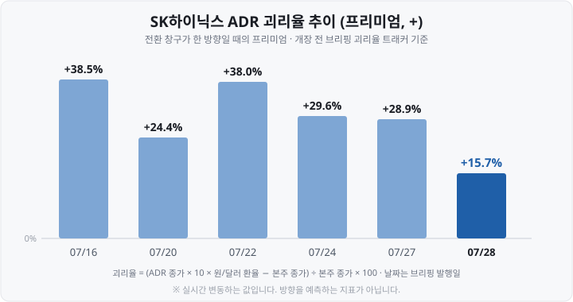
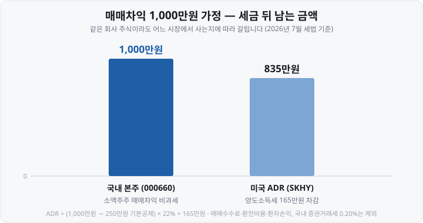

저는 처음 "SK하이닉스 ADR이 143달러"라는 기사를 보고 <mark>"어? 국내 주가는 181만 원인데 미국에서는 21만 원밖에 안 하네?"</mark>라고 생각했습니다. 완전히 거꾸로 읽은 것이었습니다. 실제로는 ADR이 본주보다 **15.7% 비싸게** 거래되고 있었거든요.

제가 놓친 건 딱 하나, **예탁비율입니다.** 이 숫자를 모르면 ADR 기사를 아무리 읽어도 방향을 잘못 잡습니다. 오늘은 제가 헤맸던 순서 그대로 ADR을 풀어보겠습니다.

&nbsp;

【💡 한 줄 정의부터】

**ADR**(American Depositary Receipt, 미국주식예탁증서)은 <mark>외국 기업 주식을 미국 은행에 맡겨 두고, 그 주식을 근거로 미국 시장에서 거래되는 증서</mark>입니다.

핵심 단어는 '증서'입니다. 미국 투자자가 SKHY를 사도 SK하이닉스 주식이 그 사람 계좌로 들어오지 않습니다. 실제 주식(**원주** 또는 **본주**)은 한국에 그대로 있고, 손에 쥐는 건 **"그 주식이 은행에 보관돼 있다"는 증명서**입니다.

물품보관소에 짐을 맡기고 받는 보관증과 비슷합니다. 짐은 창고에 있고 손에 든 건 종이죠. 그런데 이 종이가 나스닥에서 거래됩니다.

※ 참고로 이 구조는 1927년 J.P. 모건이 영국 백화점 셀프리지 주식을 기초로 처음 발행했습니다. 100년 가까이 쓰인 방식입니다.

&nbsp;

【🏛 누가 무엇을 하나 — 네 명의 등장인물】

2026년 7월 SK하이닉스 사례의 실제 이름을 그대로 넣었습니다.

| 역할 | 하는 일 | SK하이닉스의 경우 |
| :--- | :--- | :--- |
| 발행 기업 | 원주를 발행해 예탁 | SK하이닉스 |
| 보관기관 | 원주를 한국에서 보관 | 한국예탁결제원 |
| 예탁기관 | 미국에서 ADR 발행·관리 | 씨티은행(뉴욕) |
| 투자자 | 나스닥에서 달러로 매매 | SKHY 매수자 |

흐름은 이렇습니다.

1. SK하이닉스가 신주 **1,779만 주를** 발행합니다.
2. 이 원주는 예탁기관(씨티은행)에 예탁되고, **실물 보관은 한국예탁결제원이** 대신 맡습니다.
3. 씨티은행이 그 원주를 근거로 ADR을 발행해 나스닥에 상장합니다.
4. 배당이 나오면 씨티은행이 원화로 받아 **세금을 원천징수한 뒤** 달러로 환전해 지급합니다.

&nbsp;

【🔢 가장 중요한 숫자 — 예탁비율】

제가 틀렸던 지점입니다. <mark>ADR 1주는 원주 1주가 아닙니다.</mark>

ADR 1주에 원주 몇 주를 대응시킬지는 발행할 때 정해집니다. 이걸 **예탁비율**(ADR ratio)이라고 합니다. SK하이닉스 투자설명서(2026년 7월 10일 공시)에는 이렇게 못 박혀 있습니다.

> 원주 대 ADR 비율(신주 1주당 ADR 수량)은 **1 : 10**

즉 <mark>ADR 10주를 모아야 본주 1주</mark>입니다. ADR 1주는 본주의 10분의 1 조각인 셈이죠.

왜 쪼갤까요. 2026년 7월 초 본주는 200만 원을 넘겼습니다. 1:1로 상장하면 미국에서 1주가 1,400달러가 넘습니다. 10분의 1로 쪼개니 **150달러 안팎, 미국 대형주와 비슷한 가격대**가 만들어집니다.

※ **환산식** = ADR 가격(달러) × 예탁비율 × 원/달러 환율

2026년 7월 27일(미국 시간) 종가로 계산하면,

- SKHY $143.02 × 10 × 환율 → 본주 환산가 **2,100,249원**
- 같은 날 서울 본주 종가 **1,816,000원**
- 괴리율 = **+15.7%** (ADR이 그만큼 비쌈)

예탁비율을 빼고 보면 "21만 원 vs 181만 원"이라는, 완전히 반대인 결론이 나옵니다.

&nbsp;

【📑 ADR에도 등급이 있습니다】

먼저 회사의 참여 여부로 두 갈래입니다.

- **스폰서드** — 회사와 예탁은행이 정식 계약을 맺고 발행(회사가 비용 부담)
- **언스폰서드** — 회사와 계약 없이 예탁은행이 시장 수요에 맞춰 발행

스폰서드는 다시 세 등급입니다.

| 등급 | 거래 장소 | SEC 보고 | 자금 조달 |
| :--- | :--- | :--- | :--- |
| 레벨 I | 장외(OTC)만 | 면제 수준 | 불가 |
| 레벨 II | NYSE·나스닥 | 등록·정기보고 | 불가 |
| 레벨 III | NYSE·나스닥 | 등록 + 공모 서류 | 가능 |

레벨 I·II는 <mark>"미국에서 거래되게 하는 것"까지만</mark> 가능합니다. **새 주식을 팔아 돈을 끌어오려면 레벨 III** 여야 합니다. SK하이닉스가 신주 1,779만 주로 265억 700만 달러(약 40조 원)를 조달한 게 이 방식입니다.

반대로 삼성전자·LG전자·현대차·기아처럼 회사가 자금 조달을 목적으로 하지 않는 경우엔 장외(OTC)에서 ADR이 거래되는 형태로 남아 있기도 합니다.

&nbsp;

【📈 괴리율은 왜 벌어지나 — 문이 한쪽으로만 열릴 때】

원리는 간단합니다. 서울이 싸고 뉴욕이 비싸면, 서울에서 사서 뉴욕에서 팔면 차익이 납니다. 이 거래가 자유로우면 두 가격은 붙습니다.

문제는 <mark>그 전환이 막혀 있을 때</mark>입니다. 2026년 7월 SK하이닉스가 딱 이 상황이었습니다.

- 상장 직후에는 **ADR → 본주 방향으로만** 전환이 가능했습니다.
- 서울에서 사서 뉴욕에서 파는 길이 막히니 프리미엄이 그대로 남았습니다.
- 미국 수요는 강했습니다. 공모 청약 주문이 발행 규모의 <mark>7배를 넘겼다</mark>고 보도됐습니다.

한 달도 안 되는 사이 프리미엄이 <mark>+38.5%에서 +15.7%까지 좁혀졌습니다.</mark> 특히 7월 27일(미국 시간)에는 ADR이 −7.47%인데 서울 본주는 +3.24%로 정반대로 움직여, 하루에 13.2%포인트가 사라졌습니다. 계산식의 분자는 내려가고 분모는 올라간 것이죠.

그리고 **2026년 7월 29일부터** 한국예탁결제원을 통해 <mark>본주 ↔ ADR 양방향 상호전환 신청이 열립니다.</mark> 문이 양쪽으로 열리면 차익거래가 작동해 가격차를 좁히는 쪽으로 힘이 실립니다.

※ 다만 **개인이 이 차익거래를 하기는 쉽지 않습니다.** 증권사를 통한 별도 신청 절차와 외국환 절차를 거쳐야 하고, 처리 방식도 증권사마다 다릅니다. MTS에서 버튼 하나로 바꾸는 방식이 아닙니다. 예탁결제원도 "절차는 증권사마다 상이할 수 있다"고 설명했습니다.

&nbsp;

【⚠️ ADR 보유자는 '주주'가 아닙니다】

투자설명서에 짧지만 중요한 문장이 있습니다. **"ADR 보유자는 당사의 주주가 아니므로…"**

- **의결권** — 직접 행사하지 못하고 예탁기관을 통해 간접적으로 전달합니다.
- **배당** — 예탁기관이 원화로 받아 원천징수하고 달러로 환전해 지급합니다. 입금이 본주보다 늦어질 수 있습니다.
- **수수료** — <mark>본주에 없는 비용이 붙습니다.</mark> SK하이닉스 ADR은 발행·취소·이체·배당 지급 등에 **ADR 100주당 5달러** 수준의 예탁기관 수수료가 정해져 있고, 보관수수료와 환전 비용이 더 붙습니다.

ADR 1주당 5센트꼴이라 작아 보이지만, **배당받을 때마다 떼이는 성격**이라는 점은 알아두면 좋습니다.

&nbsp;

【💸 국내 투자자에게는 세금이 크게 갈립니다】

여기가 우리 입장에서 제일 실질적인 대목입니다. **같은 회사 주식인데도** 서울에서 사는 것과 뉴욕에서 사는 것의 세금이 완전히 다릅니다.

| 구분 | 국내 본주(000660) | 미국 ADR(SKHY) |
| :--- | :--- | :--- |
| 매매차익 | 소액주주 비과세 | 양도소득세 22%(250만원 공제) |
| 매도 거래세 | 0.20% | 없음(대신 환전 비용) |
| 배당 | 배당소득세 15.4% | 원천징수 후 달러 지급 |
| 신고 | 없음 | 5월 확정신고 |
| 환율 | 노출 없음 | 원/달러에 그대로 노출 |

매매차익 1,000만 원이라면 세금만으로 <mark>165만 원 차이</mark>입니다. 여기에 ADR 쪽은 환전 수수료, 예탁기관 수수료, 환율 변동까지 얹힙니다.

즉 <mark>ADR을 사려면 이 비용 차이를 넘어설 이유가 있어야 한다</mark>는 계산이 나옵니다. 프리미엄이 붙어 있는 상태라면 더욱 그렇죠. 이 글은 어느 쪽이 유리하다고 결론 내리지 않습니다 — 다만 **비교할 때 빠뜨리면 안 되는 항목이** 무엇인지는 분명합니다.

&nbsp;

【🇰🇷 미국 증시에 있는 한국 기업들】

SK하이닉스가 처음은 아닙니다. 1994년 포스코를 시작으로 여러 기업이 ADR로 올라가 있습니다.

| 기업 | 티커 | 거래소 |
| :--- | :--- | :--- |
| POSCO홀딩스 | PKX | NYSE |
| SK텔레콤 | SKM | NYSE |
| KT | KT | NYSE |
| 한국전력 | KEP | NYSE |
| LG디스플레이 | LPL | NYSE |
| KB금융 | KB | NYSE |
| 신한지주 | SHG | NYSE |
| 우리금융 | WF | NYSE |
| SK하이닉스 | SKHY | 나스닥 |

※ **ADR과 직접상장은 다릅니다.** 쿠팡(CPNG)은 ADR이 아니라 미국 법인이 NYSE에 직접 상장한 경우입니다(2021년 3월 11일). 한국에 원주가 없으니 예탁비율도, 괴리율도 없습니다.

한 가지 덧붙이면, <mark>미국에 상장했다고 자동으로 더 높은 값을 받는 건 아닙니다.</mark> 2026년 7월 2일 기준 국내 금융지주 3사(KB·신한·우리) ADR 평균 **PER**(Price Earnings Ratio, 주가수익비율)은 9.38배로 미국 대형은행 4사 평균 15.28배의 약 61% 수준이었습니다. KT는 ADR 가격이 국내 주가에 못 미친 구간도 보도됐습니다.

&nbsp;

【🔍 예탁비율은 어디서 확인하나】

예탁비율은 회사마다 다르고 변경되기도 합니다. 그래서 **그때그때 확인하는 습관**이 필요합니다.

1. **해당 기업 IR 페이지** — 'ADR'·'해외시세' 메뉴에 비율을 함께 표기
2. **예탁은행 DR 정보 사이트** — 씨티·BNY멜론·JP모건·도이체방크
3. **DART·KIND 공시** — 증권신고서·투자설명서에 확정 수치로 기재(SK하이닉스 1:10도 여기서 확인)
4. **SEC EDGAR** — Form F-6, 20-F

&nbsp;

【✅ 정리】

- ADR은 원주를 미국 은행에 예탁하고 발행하는 **증서입니다**. 주식 자체가 아닙니다.
- 원주는 한국(한국예탁결제원)에 남고, 미국 예탁기관(SK하이닉스는 씨티은행)이 ADR을 발행합니다.
- <mark>예탁비율을 모르면 가격 비교가 불가능합니다.</mark> SK하이닉스는 원주 1주 = ADR 10주.
- 자금 조달까지 하려면 **레벨 III** ADR이어야 합니다.
- 괴리율은 <mark>양방향 전환이 막혀 있을 때 크게 벌어집니다.</mark> 7월 29일부터 상호전환 신청이 열립니다.
- 국내 투자자에게는 **세금·환율·수수료가** 본주와 ADR에서 다르게 작동합니다.

&nbsp;

【🔗 함께 보면 좋은 글】

- [괴리율이란 무엇인가 — ETF·ADR 가격이 '진짜 값'과 다른 이유](https://blog.naver.com/hdglace/224351030720)
- [연금저축·IRP·ISA — 세금 아끼며 ETF 투자하는 절세 계좌 3종](https://blog.naver.com/hdglace/224357252306)
- [코스피200·S&P500·나스닥100 ETF 비교 — 지수를 통째로 산다는 것](https://blog.naver.com/hdglace/224358137869)

&nbsp;

【📊 데이터 출처 및 기준일】

- 예탁비율(원주 1주 : ADR 10주), 예탁기관 씨티은행, 보관기관 한국예탁결제원, 신주 17,790,000주, 공모가 원주 1주당 2,249,751원(ADR $149, 2026년 7월 9일 환율 1,509.90원), 총 조달 40조 230억 원, 예탁기관 수수료 ADR 100주당 5달러, "ADR 보유자는 주주가 아니다" 문구 : **SK하이닉스 투자설명서, 2026년 7월 10일 KRX 공시(KIND)**.
- 나스닥 상장·거래 개시(2026년 7월 10일, SKHY), 본주↔ADR 양방향 상호전환 개시(2026년 7월 29일) : 위 투자설명서 및 한국예탁결제원 안내, 언론 보도 종합.
- 조달액 265억 700만 달러, 청약 주문 발행 규모 7배 초과 : 2026년 7월 9~10일 공모가 확정 시점 보도.
- 괴리율 추이(07/16 +38.5% → 07/28 +15.7%), SKHY $143.02·환산가 2,100,249원·본주 1,816,000원 : 개장 전 브리핑 괴리율 트래커, 각 발행일 기준. 실시간 변동합니다.
- 과세(해외주식 양도소득세 22%·연 250만원 공제·5월 확정신고 / 국내 소액주주 매매차익 비과세 / 배당소득세 15.4%) : 국세청 기준, 증권사 안내 자료 교차확인, 2026년 7월 기준.
- 증권거래세 0.20%(2026년 1월 1일 이후 양도분, 코스피 0.05% + 농어촌특별세 0.15%) : 세법 개정 내용, 언론·증권사 안내 교차확인.
- ADR 등급 체계, 1927년 최초 ADR(J.P. 모건·셀프리지) : SEC 및 예탁은행·금융교육 공개 자료.
- 한국 기업 ADR 목록·포스코 1994년 상장·쿠팡 2021년 3월 11일 직접상장 : 각 사 IR 및 언론 보도 종합, 2026년 7월 기준. 예탁비율은 기업·시점마다 달라 표에 넣지 않았습니다.
- 금융지주 3사 ADR 평균 PER 9.38배 vs 미국 대형은행 15.28배 : 2026년 7월 2일 기준 언론 보도.

&nbsp;

※ 본 글은 공개된 공시·시장 데이터와 제도를 정리한 정보성 콘텐츠이며, 특정 종목·시장의 매매 권유나 우열 판단이 아닙니다. 수치는 위에 밝힌 기준 시점의 값이며 이후 변동될 수 있습니다. 예탁비율·수수료·세법·전환 절차는 변경될 수 있으니 투자 전 최신 공시와 거래 증권사 안내를 확인하세요. 모든 투자 판단과 책임은 투자자 본인에게 있습니다.

&nbsp;

#ADR #미국주식예탁증서 #SK하이닉스ADR #SKHY #예탁비율 #괴리율 #해외주식양도소득세 #나스닥상장 #투자공부 #주식초보 #재테크 #미국주식
