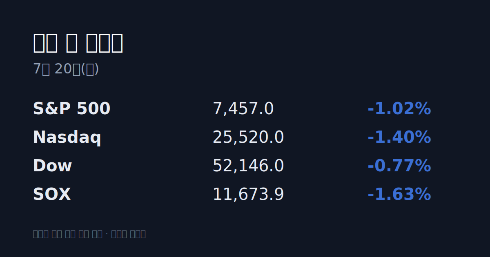
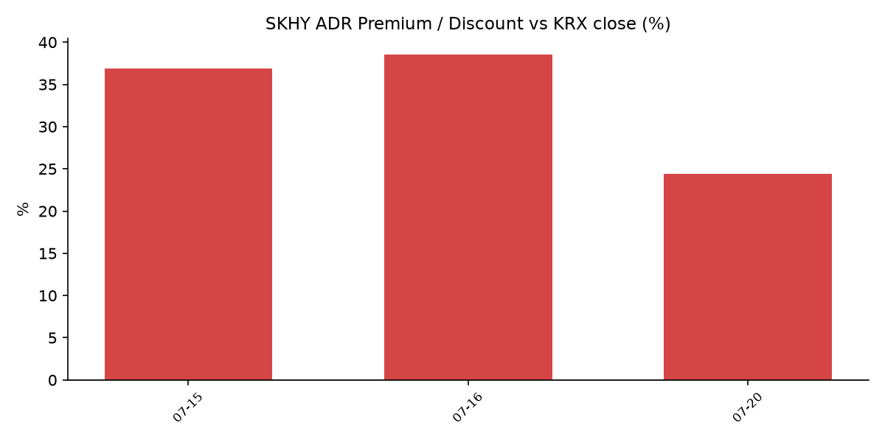

⚠️ 이번 브리핑은 공백(gap) 커버입니다. 한국장은 7/16(목) 마감 후 7/17(금) 휴장으로 4일간 쉬었고, 그동안 미국은 7/16·7/17 두 세션을 더 지나왔습니다. 아래 미국 수치는 한국 7/16 마감 이후의 누적 변화를 함께 표기합니다.

&nbsp;

【① 30초 요약】
· <mark>미 반도체가 공백 2세션 연속 하락</mark> — SOX는 7/16 -4.29%, 7/17 -1.63%, 한국 7/16 마감 대비 누적 -5.85%(6월말 고점 대비 약 -20%).
· 방아쇠는 <mark>TSMC의 대규모 capex 상향($52-56B→$60-64B)</mark> — 어닝 서프라이즈에도 AI 투자 정점·공급과잉 우려 부각, 알파벳 Gemini 3.5 Pro 지연 보도까지 겹침.
· <mark>SK하이닉스 ADR(SKHY) 괴리율 +38.5%→+24.4%로 압축</mark> — ADR이 7/16 하루 -21.5% 폭락(7/17 +1.13% 소폭 반등)한 결과.
· 한국 7/16 마감 KOSPI 6,820.60(-6.37%)·KOSDAQ 791.84(-4.53%), 지수 7,000선 하회.
· 이번 주 미국 7/20 지표·어닝 없음, 7/22 알파벳 실적, <mark>7/28-29 FOMC</mark> 대기.

&nbsp;

【② 밤사이(공백) 미국 시장】

| 지수 | 7/16(목) 종가 | 7/17(금) 종가 | 한국 7/16 대비 누적 |
| :--- | :--- | :--- | :--- |
| S&P 500 | 7,533.77 (-0.51%) | 7,457.0 (-1.02%) | -1.52% |
| 나스닥 | 25,881.95 (-1.47%) | 25,520.0 (-1.40%) | -2.85% |
| 다우 | 52,552.97 (-0.20%) | 52,146.0 (-0.77%) | -0.97% |
| SOX(반도체) | 11,867.5 (-4.29%) | 11,673.9 (-1.63%) | -5.85% |

반도체가 두 세션을 지배했습니다. 7/16 하락의 방아쇠는 TSMC였습니다. 2분기 실적은 예상을 웃돌았으나 연간 설비투자 전망을 $52-56B에서 $60-64B로 대폭 올리면서, 시장은 이를 <mark>AI 투자 사이클의 정점·공급과잉 신호</mark>로 읽었습니다. 같은 날 알파벳이 Gemini 3.5 Pro 출시를 지연한다는 보도에 4% 넘게 밀렸고, Arm은 5% 이상 하락했습니다. 반도체 ETF(SMH)는 주간 약 9% 빠졌습니다.

&nbsp;

【③ 괴리율 트래커 — SK하이닉스 ADR】

| 항목 | 수치 |
| :--- | :--- |
| SKHY 종가 (7/17) | $154.03 (+1.13%) |
| 본주 환산가 (×10×환율) | 2,291,551원 |
| 본주 직전 종가 (7/16) | 1,842,000원 |
| 괴리율 | +24.4% |

괴리율은 미국 상장 ADR을 본주 가격으로 환산(ADR 1주 = 본주 10주, 환율 1,487.73원)해 실제 본주 종가와 비교한 값입니다. 프리미엄(+)이면 전환 차익거래 구조상 본주에 매수 유인이, 디스카운트(−)면 매도 유인이 생기는 것이 메커니즘입니다. 지난주 +38.5%였던 프리미엄이 +24.4%로 크게 줄었는데, ADR이 7/16 하루 -21.5% 폭락하며 본주(-11.5%)보다 더 크게 빠진 결과입니다.

&nbsp;

【④ 오늘의 시장 온도계】
VKOSPI는 7/16 종가 <mark>87.14로 '극단' 구간</mark>(기준 40 이상)이었습니다. 6월 29일에는 96.94로 지수 도입 이후 사상 최고였습니다. 7월 코스피 일중 변동성 평균은 6.75%로 1987년 이후 최대이자 2008년(6.11%)·1997년(5.37%)을 웃도는 수준입니다. 원/달러는 7/17 국제 기준 1,487.73원(7/16 국내 주간거래 1,480.4원)으로 1,480~1,490원 박스권이었습니다.

&nbsp;

【⑤ 어제(7/16) 한국장 리뷰】
한국 마지막 거래일 7/16, KOSPI는 463.81포인트(-6.37%) 내린 6,820.60으로 7,000선 아래 마감, KOSDAQ은 37.59포인트(-4.53%) 내린 791.84로 마쳤습니다. 삼성전자 -5.19%, SK하이닉스 -11.53%(종가 1,842,000원)로 반도체 투톱이 낙폭을 주도했습니다. 7/15 밤 미국 반도체 약세(SOX -2.08%)가 전이된 흐름이며, 투자자별 순매매 확정치는 집계 시점 기준 미확인입니다.

&nbsp;

【⑥ 오늘의 캘린더 & 관전 포인트】
· 7/20(월): 미국 주요 지표·어닝 없음(조용한 세션)
· 7/22(수): 알파벳 실적 — 매그니피센트7 첫 발표
· 7/28-29: FOMC(의장 케빈 워시), 7/29 마이크로소프트·메타 실적
· 시장이 주시하는 레벨: 원/달러 1,510원, VKOSPI 95, 브렌트유 $90. SKHY·미 반도체 프리마켓 흐름도 관전 포인트.

&nbsp;

【⑦ 정책 워치】
국내 공매도는 코스피200·코스닥150 구성종목 대상 재개(5/3~) 상태이며, 과열종목 지정제가 운영 중입니다. 올해 7/19까지 코스피 공매도 과열종목 지정은 205건으로 지난해 같은 기간(169건)을 웃돌았습니다. 지정학 측면에서는 이란 혁명수비대가 7/12 호르무즈 해협 전면 봉쇄를 선언하며 중동 긴장이 재차 고조돼, 유가·해운 비용 변수로 남아 있습니다.

&nbsp;

【⑧ 오늘의 질문】
TSMC의 capex 상향이 촉발한 '반도체 피크아웃' 논쟁을, 7/22 알파벳을 시작으로 한 빅테크 실적이 어떻게 되받을 것인가.

&nbsp;

#개장전브리핑 #미국증시마감 #하이닉스ADR #ADR괴리율 #반도체 #SOX #코스피 #VKOSPI #FOMC #TSMC

&nbsp;

본 글은 공개된 시장 데이터를 정리한 정보성 콘텐츠이며, 특정 종목·상품의 매매 권유가 아닙니다. 모든 투자 판단과 책임은 투자자 본인에게 있습니다. 수치는 작성 시점 기준이며 이후 변동될 수 있습니다.

