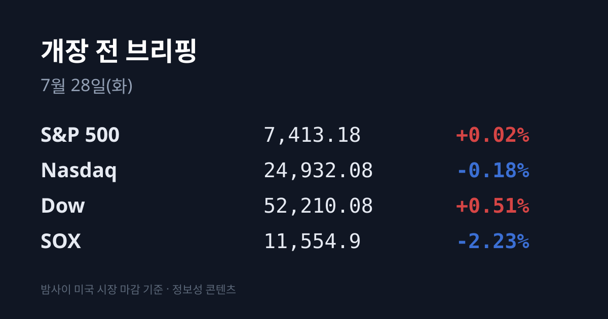
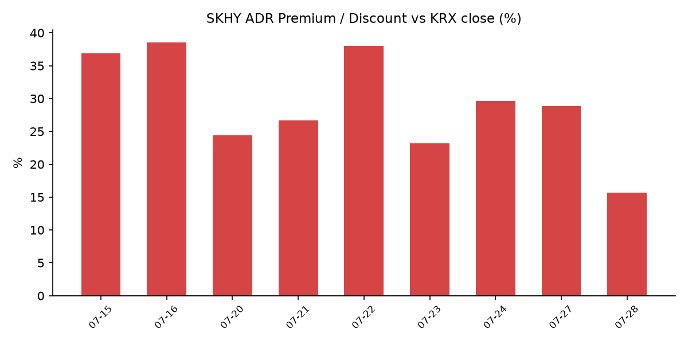

&nbsp;

【① 30초 요약】

- 어제(07/27) 코스피는 <mark>+0.97% 오른 6,755.75로 6,700선을 회복</mark>했다. 코스닥은 +2.22%(764.86). 다만 외국인은 **−2조8,851억 원 순매도**로 이틀 연속 대량 매도를 이어갔고, 지수는 개인(+1조9,800억 원)과 기관(+8,624억 원)이 받아 올렸다.
- 밤사이 미국은 방향이 갈렸다. 다우 +0.51%(52,210.08)·S&P 500 +0.02%로 올랐지만 나스닥은 −0.18%로 4거래일 연속 하락했고, <mark>필라델피아 반도체지수(SOX)는 −2.23%로 이틀 연속 밀렸다</mark>(11,554.9).
- 반도체 약세의 원인은 매크로가 아니라 중국이었다. <mark>중국 창신메모리(CXMT)가 07/27 상하이 커촹반에 상장해 첫날 466%까지 폭등</mark>했고, 종가 기준 시가총액은 약 **711조7,000억 원**으로 중국공상은행을 제치고 중국 본토 1위이자 인텔 시총을 넘어섰다. 공모 조달 금액은 약 14조4,000억 원이다.
- 같은 날 IT 매체 DiInformation이 "중국이 정부 지원으로 DUV(심자외선) 노광장비 개발·생산에 착수했다"고 보도했다. 노광장비 독점 기업 <mark>ASML이 −5.8%(장중 −7.04%)</mark>, 엔비디아 −4.99%, 샌디스크 −11.0%, 마이크론 −2.3%로 반응했다.
- 반대로 매크로는 크게 풀렸다. 미국과 이란이 공격·보복 중단에 합의하고 전쟁 종료 협상 재개를 논의한다는 보도에 <mark>WTI가 −7.5%($82.61), 브렌트가 −8.7%($88.36)</mark>로 하루 만에 붕괴했고, 미 10년물 금리도 **4.65%로** 3bp 내렸다.
- SK하이닉스 ADR(SKHY)은 −7.47% 급락한 $143.02로 07/09 공모가 $149를 약 4% 하회했다. 본주는 같은 날 +3.24% 올라, <mark>괴리율이 +28.9%에서 +15.7%로 하루에 13.2%p 압축</mark>됐다.

&nbsp;

【② 밤사이 미국 시장 📈】

| 지수 | 종가 | 등락률 |
| :--- | :--- | :--- |
| S&P 500 | 7,413.18 | +0.02% |
| 나스닥 | 24,932.08 | −0.18% |
| 다우 | 52,210.08 | +0.51% |
| SOX(필라델피아 반도체) | 11,554.9 | −2.23% |

지수 표면과 업종 내부가 또 갈렸다. 다우는 262.83포인트 올라 52,210.08로 마감했고 유럽(DAX +1.04%, FTSE +0.42%)과 아시아(닛케이 +0.50%, 상해종합 +1.15%, 항셍 +0.98%, ASX200 +1.39%)도 전면 상승했다.

그런데 나스닥은 4거래일 연속 하락하고 SOX는 이틀 연속 밀렸다. 개별 종목으로는 마이크로소프트 +1.94%, 애플 +1.17%가 오른 반면 엔비디아 −4.99%, 메타 −0.22%, 테슬라 −1.22%였다.

반도체 약세의 방아쇠는 두 개였고, 둘 다 중국에서 나왔다.

첫째, <mark>중국 창신메모리(CXMT)가 07/27 상하이증권거래소 커촹반(과창판)에 상장</mark>했다. 공모가 8.66위안으로 579억2,000만 위안을 조달했고 초과배정 옵션까지 행사하면 총 666억1,000만 위안(약 14조4,000억 원)으로, 2010년 중국농업은행 상장 이후 중국 본토 사상 두 번째로 큰 규모다.

상장 첫날 시초가는 공모가 대비 +452%, 장중 49.88위안까지 올라 +476%를 기록했고, 종가 기준 시가총액은 3조2,800억 위안(약 711조7,000억 원)으로 중국공상은행(ICBC)을 제치고 **중국 본토 시총 1위**, 인텔 시총도 넘어섰다.

CXMT는 현재 16나노 공정까지 따라왔고 전송속도 8000Mbps DDR5, 8533Mbps LPDDR5X 개발에 성공한 것으로 알려져 있다. 다만 상장 직후 자유롭게 거래 가능한 유통 물량이 전체의 6%대에 불과해 주가 변동성이 클 수 있다는 관측도 함께 나왔다.

둘째, IT 매체 DiInformation은 같은 날 "중국이 정부 지원을 받아 DUV 노광장비 개발·생산에 착수했다"고 보도했다. 미국 제재로 ASML의 EUV 장비를 살 수 없는 CXMT는 DUV 장비로 회로를 여러 번 겹쳐 새기는 멀티 패터닝 공정으로 미세화를 추진해 왔는데, 그 DUV마저 자체 생산에 들어갔다는 내용이다.

증권가에서는 현재 생산량이 5대 수준이고 2027년 계획도 20대여서 <mark>ASML의 2026년 생산능력 130대와 비교하면 아직 미미하다</mark>는 지적이 나왔다. 그럼에도 시장 반응은 컸다 — ASML은 −5.8%(장중 한때 −7.04%, $1,632.57), 샌디스크 −11.0%, 마이크론 −2.3%였다.

엔비디아 −4.99%에는 별개의 재료가 있었다. 엔비디아가 7,500억 달러 이상 규모의 새로운 AI 인프라 거래를 추진 중이라는 보도가 나왔는데(SK그룹·SK스퀘어와 5,000억 달러 이상 AI 이니셔티브, 오픈AI의 소프트뱅크 오하이오 데이터센터 임대에 최대 2,500억 달러 보증, 오픈AI의 칩 구매 3,500억 달러 금융지원 논의), 이를 두고 **'순환금융' 우려**가 다시 불붙었다.

엔비디아가 지분을 투자하거나 자금을 대준 기업이 결국 엔비디아 칩을 사들이는 구조가 반복돼 업계 수요와 밸류에이션이 인위적으로 부풀려진다는 지적이며, 이번에는 채권시장에서도 경고음이 나왔다는 보도가 이어졌다.

매크로는 정반대 방향이었다. 미국과 이란이 공격·보복 중단에 합의하고 전쟁 종료를 위한 협상 재개를 논의한다는 보도에 <mark>WTI는 6.70달러(−7.5%) 내린 배럴당 $82.61</mark>, 브렌트는 8.42달러(−8.7%) 내린 $88.36으로 붕괴했다. 브렌트는 07/23 $100.69에서 나흘 만에 약 12% 되밀렸다.

미 10년물 국채금리는 3bp 내린 4.65%(장중 4.7% 초과 후 4.64%까지 되밀림), VIX는 18.67로 +0.48%의 보합, 금은 약 $4,081~4,089 수준이었다. 달러/엔은 163.60으로 거의 움직이지 않았다.

미 정규장 마감 후 대형 반도체·빅테크 실적 발표는 없었다. 발표된 곳 중에서는 케이던스 디자인 시스템스가 시간외 +4%대(2분기 조정 EPS 2.11달러, 컨센서스 2.05달러), 램버스가 소폭 상승(EPS 0.77달러·매출 2억700만 달러, 컨센서스 0.72달러·1억9,800만 달러)이 눈에 띄었다. 웰타워 +4%, 해픈(전 렌딩클럽) +4%, F5 +2%였고, 신신내티 파이낸셜 −4%, 유니버설 헬스 서비스 −4%였다. 케이던스는 반도체 설계자동화(EDA), 램버스는 메모리 IP 기업으로 반도체 사이클의 프록시로 읽히는 곳이다.

&nbsp;

【③ 괴리율 트래커 — SK하이닉스 ADR ⚡】

| 항목 | 수치 |
| :--- | :--- |
| SKHY 종가 | $143.02 (전일 $154.57에서 −7.47%) |
| 본주 환산가 (×10×환율) | 2,100,249원 |
| 본주 직전 종가 | 1,816,000원 |
| **괴리율** | **+15.7%** |

괴리율은 미국에 상장된 SK하이닉스 ADR 가격을 원화로 환산(ADR 종가 × 10 × 원/달러 환율)한 값이 서울 본주 종가보다 얼마나 높거나 낮은지를 나타낸다. 플러스(프리미엄)는 ADR이 본주보다 비싸다는 뜻으로, 전환 차익거래 구조상 본주에는 매수 유인이 생기는 것으로 해석된다.

이번 수치가 중요한 것은 압축의 경로다. 07/24에는 ADR −8.81%, 본주 −8.34%로 두 시장이 같은 방향으로 거의 같은 폭 빠져 괴리율이 0.7%p만 줄었다. 반면 <mark>07/27은 ADR −7.47%인데 본주는 +3.24%로 정반대였다</mark> — 분자는 내려가고 분모는 올라가면서 괴리율이 하루에 13.2%p 사라진 것이다. ADR은 이 과정에서 07/09 공모가 $149를 약 4% 하회해 상장가 아래로 내려왔다.

배경에는 날짜가 있다. 한국예탁결제원에 따르면 **7월 29일부터** SK하이닉스 ADR 신주의 국내 상장과 함께 본주↔ADR 양방향 상호전환 신청이 가능해진다. 그동안 전환이 한 방향으로만 제한돼 있었기 때문에 프리미엄은 한때 51%까지 벌어졌고, 07/15경 25~26% 수준으로 좁혀진 뒤 이제 +15.7%까지 내려왔다.

전환 창구가 양방향으로 열리면 차익거래가 가능해져 두 시장의 가격차를 좁히는 방향으로 작동한다. 시장에서는 양방향 전환 허용과 2분기 실적 발표 이후 차익거래가 활성화되며 프리미엄이 해소되는 쪽으로 본다는 해석이 나오지만, 실제 압축 속도는 ADR 신주 발행 규모와 수급에 좌우된다는 지적도 함께 있다.

괴리율 추이: 07/15 +36.9% → 07/16 +38.5% → 07/20 +24.4% → 07/21 +26.7% → 07/22 +38.0% → 07/23 +23.2% → 07/24 +29.6% → 07/27 +28.9% → 07/28 +15.7%

&nbsp;

【④ 오늘의 시장 온도계 🌡️】

- VKOSPI **77.6**(07/27) — 통상 25 미만을 '평온', 25~40을 '경계', 40 이상을 '극단'으로 구분하는데 현재는 기준선의 약 1.9배로 <mark>여전히 '극단' 구간</mark>이다. 다만 5거래일 연속 하락해 06/08 이후 33거래일 만의 최저이며, 06/29 장중 고점 96.9 대비 약 20% 내려왔다.
- 최근 실현 변동폭 — 07/16 −6.37% → 07/20 −4.46% → 07/21 +3.56% → 07/22 +0.74% → 07/23 +4.39% → 07/24 −5.72% → 07/27 +0.97%. 최근 7거래일 중 4일이 ±3.5% 이상 움직였지만, 어제는 7월 들어 드물게 진폭이 좁았던 날이었다.
- 투기적 과열 지표 — 단일종목 레버리지 상품의 거래 비중은 07/27 **31.3%로** 7월 월평균 35.7%에서 내려왔고, 회전율도 77.7%로 전주의 100% 이상에서 낮아졌다. 7월 변동성을 키운 종가 리밸런싱 물량이 실제로 줄고 있다는 뜻으로 읽힌다.
- 원/달러 1,468.5원(07/27 주간 거래 종가, 전일 대비 +1.9원) — 중동 완화로 1,459.9원에 하락 출발해 유가 급락에 낙폭을 키웠으나, <mark>외국인의 국내 주식 순매도가 확대되며 상승 전환</mark>했다.
- 공매도 잔고 — 코스피 순잔고는 07/22 기준 16조8,500억 원으로, 06/01 사상 최고치 22조8,200억 원에서 한 달 반 만에 약 6조 원 줄었다.
- 미 10년물 4.65% / VIX 18.67 — 금리는 내리고 공포지수는 보합인 조합이다.
- 달러인덱스 07/27 종가, 대만 TAIEX·중국 CSI300 종가, 코스피200 야간선물, 07/27 사이드카 발동 여부, 07/27 신용융자 잔고·반대매매 금액은 집계 시점 기준 미확인.

&nbsp;

【⑤ 어제 한국장 리뷰】

| 지수 | 종가 | 등락률 |
| :--- | :--- | :--- |
| KOSPI | 6,755.75 | +0.97% (+65.13p) |
| KOSDAQ | 764.86 | +2.22% (+16.64p) |

코스피는 장중 외국인 매도에 하락 전환하기도 했지만 개인과 기관의 매수가 유입되며 상승 마감했다.

실제 수급(플로우 팩트): 코스피에서 개인 +1조9,800억 원, 기관 +8,624억 원 순매수, 외국인 −2조8,851억 원 순매도였다. 외국인은 07/24 −3조2,828억 원에 이어 이틀 연속 대량 순매도로, **두 날 합계 6조 원**을 넘겼다. 코스닥에서는 기관이 +2,727억 원 순매수한 반면 개인 −1,295억 원, 외국인 −1,440억 원 순매도였다.

시총 상위 종가: 삼성전자 254,000원(+1.80%), SK하이닉스 1,816,000원(+3.24%). 시장에서 지목된 배경은 세 가지다 — ① 07/24 급락(삼성 −7.59%, 하이닉스 −8.34%)에 따른 반발 매수, ② 주말 사이 이재명 대통령 방미를 계기로 발표된 9,500억 달러(약 1,375조 원) 규모 한미 반도체 협력(삼성전자–브로드컴 2,000억 달러 MOU, SK–엔비디아 약 5,000억 달러 파트너십)의 지연 반영, ③ 기관·개인 쌍끌이 매수. 다만 두 종목 모두 강세로 출발한 뒤 상승폭을 축소하며 마감했다.

개별 재료 장세: 대형주 단독 장세보다 개별 재료에 민감한 순환 매매가 강했다. <mark>NAVER는 +8.43%(225,000원) 급등</mark>했는데, 엔비디아가 10억 달러 규모 제3자 배정 유상증자에 참여해 지분 4.5%를 취득하기로 한 점이 부각됐다(거래량 270만3,746주). 미래산업 +22.28%(10,210원), NHN +10.16%(40,100원)였고 코스닥에서는 케이엔알시스템·씨피시스템·아이크래프트·셀리드·오브젠·아이씨에이치·썸에이지·파이온엑스·바이오인프라·소프트센우 10개 종목이 상한가를 기록했다.

반대편에서는 신재생·수소 업종이 무너졌다. **OCI홀딩스는 −17.6%**(206,000원)로 실적 우려와 차익실현 매물이 겹쳤고, 두산퓨얼셀은 장중 −21.85%(33,450원)까지 밀리며 정적 변동성완화장치(VI)가 두 차례 발동했다. DS투자증권은 두산퓨얼셀에 대해 해외 수주 유입 시기가 예상보다 미뤄지고 있다며 목표주가를 5만6,000원에서 4만7,000원으로 하향했다. SK이터닉스 등 신재생 발전 관련주도 두 자릿수 약세였다.

&nbsp;

【⑥ 오늘의 캘린더 & 관전 포인트 📅】

이번 주는 실적과 FOMC가 겹친 주간이다(시각은 KST).

| 일정 | 내용 |
| :--- | :--- |
| **07/28(화) 오늘** | 10:00 금감원장 임원회의 / 12:00 금융위 저PBR 기업 공표제도 세부기준안 의견수렴 / 12:00 한은 6월 금융기관 가중평균금리 / 14:00 금융위원장 국무회의 / 18:00 한은 7월 소비자동향조사 / 미 FOMC 개시(28~29일) / 미 컨퍼런스보드 소비자신뢰지수 |
| 07/28 국내 실적 | 에스티팜 10:00 · 한화시스템 14:00 · HD현대일렉트릭·하이브 15:00 · BNK금융지주 15:30 · 칩스앤미디어 16:00 · 한미약품 16:30 |
| **07/29(수)** | ★SK하이닉스 2분기 실적 + IR 콘퍼런스콜 ★ADR 신주 국내 상장 + 본주↔ADR 양방향 상호전환 신청 개시 / 6월 소매판매지수 / 미 장 마감 후 마이크로소프트·메타 실적 |
| **07/30(목) 03:00** | ★FOMC 결과 발표(회견 03:30) / ★삼성전자 2분기 확정 실적 콘퍼런스콜 / 미 2분기 GDP 속보치·근원 PCE / 미 장 마감 후 애플·아마존 실적 |
| **07/31(금)** | 6월 광공업생산 / 미 6월 PCE 물가지수·시카고 PMI |

시장이 주시하는 레벨과 수치:

- FOMC — CME FedWatch 기준 25bp 인상 확률이 <mark>38%</mark>로 집계된다. 1주 전 12%, 07/15 10.7%, 07/22 34.7%에서 빠르게 올라온 수치다. 기준금리 3.50~3.75% 동결 전망이 여전히 우세하며, 확률 상승 배경으로는 유가 급등에 따른 인플레이션 우려와 AI 데이터센터 공급 제약이 거론됐다. 결과는 KST 07/30 03:00에 나온다.
- ADR 괴리율 **+15.7%** — 07/29 양방향 전환 개시를 하루 앞둔 수치다. 시장에서는 이 프리미엄이 어느 수준에서 안착하는지가 관전 포인트로 언급된다.
- CXMT 상장 2일차 — 유통 가능 물량이 6%대에 불과해 변동성이 클 수 있다는 관측이 나왔다.
- 레벨 — 코스피 6,755선, SOX 11,554.9, 미 10년물 4.65%, VKOSPI 77.6, 원/달러 1,468.5원, 브렌트 $88.36이 시장 참가자들이 지켜보는 지점으로 언급된다.
- 증권가에서는 우호적인 매크로(유가 급락·금리 하락·미-이란 긴장 완화)보다 중국발 반도체 노이즈가 우세해 코스피가 하락 출발할 수 있다는 전망이 나왔고, 동시에 CXMT의 DUV 장비 생산량이 아직 미미하다는 점에서 일시적 노이즈로 보는 시각이 우세하다는 해석도 함께 제시됐다. 주 후반 국내 반도체·미국 하이퍼스케일러 실적이 상황을 정리할 자리라는 언급도 나왔다.

&nbsp;

【⑦ 정책 워치】

국내 공매도는 2026년 3월 31일 전 종목 전면 재개가 완료된 상태가 유지되고 있다. 모든 공매도 주문에 대해 주식 차입 여부를 실시간으로 확인하는 무차입 공매도 차단 전산 시스템이 가동 중이며, 신규 금지·추가 제한 등 제도 변경은 없다.

금융위원회는 오늘(07/28) 낮 12시 저PBR 기업 공표제도 세부기준안에 대한 의견수렴을 진행한다. 한국은행은 같은 시각 6월 금융기관 가중평균금리를, 오후 6시에는 7월 소비자동향조사 결과를 공표한다.

중동에서는 07/25~26 이틀 연속 공습 중단에 이어 07/27 미국과 이란이 공격·보복 중단에 합의하고 전쟁 종료를 위한 협상 재개를 논의한다는 보도가 나왔다. 직전 브리핑 시점의 '협상 전 단계'에서 한 단계 진전된 것이며, 이것이 유가 −8% 붕괴의 직접 배경으로 지목됐다.

한편 미중 기술 전선에서는 반대 방향의 뉴스가 나왔다. 중국이 미국 제재로 ASML의 EUV 장비를 구매할 수 없는 상황에서 DUV 노광장비 자체 개발·생산에 착수했다는 보도가 나오며, 제재 우회 시도가 표면화됐다.

&nbsp;

【⑧ 오늘의 질문】

유가가 나흘 만에 12% 무너지고 미 10년물이 4.65%로 내려온 매크로 해소와, 중국 메모리 기업의 시가총액이 하루 만에 711조 원으로 확정된 공급 구조 변화 — 시총 30%가 반도체인 시장은 이 두 힘 중 어느 쪽을 먼저 가격에 반영할 것인가.

&nbsp;

#개장전브리핑 #미국증시마감 #하이닉스ADR #괴리율 #창신메모리 #CXMT #반도체주 #코스피 #FOMC #국제유가

&nbsp;

본 글은 공개된 시장 데이터를 정리한 정보성 콘텐츠이며, 특정 종목·상품의 매매 권유가 아닙니다. 모든 투자 판단과 책임은 투자자 본인에게 있습니다. 수치는 작성 시점 기준이며 이후 변동될 수 있습니다.